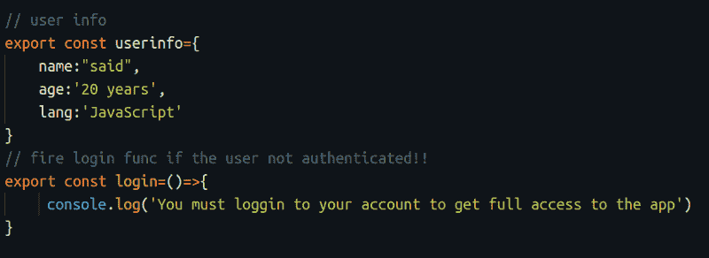
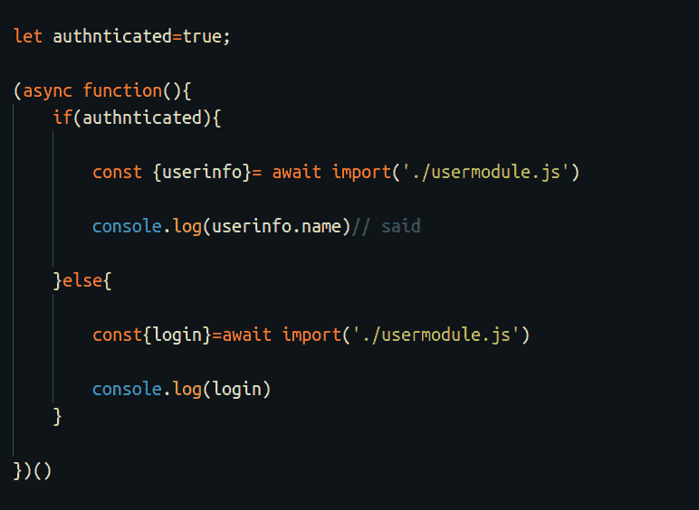
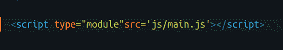
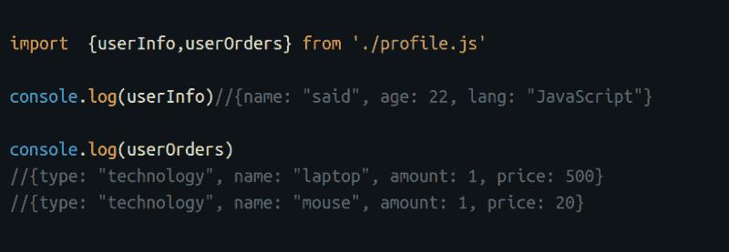
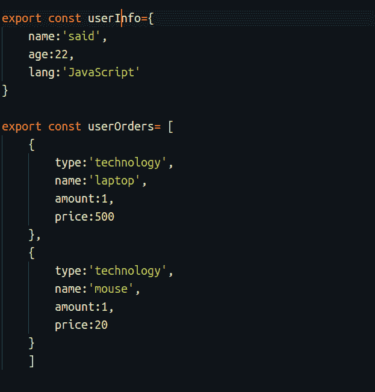
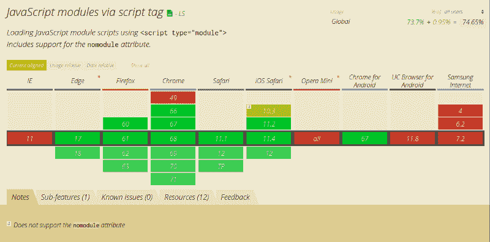

# 如何使用 ECMAScript 模块在 JavaScript 中构建模块化组件

> 原文：<https://www.freecodecamp.org/news/how-to-use-ecmascript-modules-to-build-modular-components-in-javascript-9023205ea42a/>

浏览器现在支持 JavaScript 模块。这意味着您可以在浏览器中使用由 ECMAScript 2015 引入的 JavaScript 中的这一出色附加功能。以前，为了使用模块，你必须使用一个捆绑器，如[网络包](https://www.zeolearn.com/magazine/beginning-with-webpack-4)。但不会了。多酷啊！

因此，在本文中，我们将浏览 JavaScript 模块，并探索如何在我们的 web 应用程序中使用它们。

### 什么是 JavaScript 模块，为什么应该使用它们而不是经典脚本？

JavaScript 模块基本上允许我们使用导入和导出方法将一个文件导入到另一个文件中。它们还允许我们构建可重用的模块化组件。

#### 为什么要使用 JavaScript 模块？

在应用程序中使用 JavaScript 模块代替传统脚本有很多好处:

*   **将你的应用程序分成模块**:用模块构建你的应用程序会更有效率，并提高你代码的性能。通过使用这些模块，您可以延迟加载您的代码，并且可以只使用您需要的代码，避免使用未使用的代码。
*   **默认使用严格模式:**是的，JavaScript 模块中默认启用严格模式。
*   **默认使用延迟方法**
*   这意味着**你的 [HTML](https://www.zeolearn.com/magazine/material-design-tooltip-with-css-html) 代码与 JavaScript** 并行加载。因此，在使用 ECMAScript 时，您不再需要向脚本标记添加 deferattribute。
*   **它动态导入你的模块**
*   有了 JavaScript 模块，你可以通过运行一个动态函数来定制模块的加载，这个动态函数会在你需要的时候导入一个模块。这是假设当用户访问您的网站时，您只需加载处理配置文件的模块，以防用户登录。这在下面的例子中解释得很清楚:

`usermodule.js`

`profile.js`

### 如何使用模块

现在，在这一部分，我们将探索使用 JavaScript 模块的方法。通过在实现主 JavaScript 文件的脚本标签中指定模块的属性类型，您可以轻松地使用 JavaScript 模块。现在，您可以使用导入和导出方法来导入您的模块。

在您的`main.js`中，您可以导入和导出您的模块:

使用`profile.js`中的**导出**方法:

如上例所示，使用 ECMAScript 模块很容易——在这种情况下没有复杂的代码。

当您在模块中设置类型时，浏览器会自动检测到该文件是一个模块，并将其视为 JavaScript 模块。

另一种方法是，您可以设置文件的扩展名`.mjs`，这样浏览器就可以识别模块。但是，如果您将 type 属性设置为脚本标记的模块，这不会产生很大的变化。

### 浏览器支持

似乎只有现代的浏览器支持 JavaScript 模块。但如果你使用 Chrome、Edge 和 Firefox 等优秀的浏览器，这也没什么。

#### 我不再需要使用捆扎机了？

Addy Osmani 和 [Mathias Bynens](https://twitter.com/mathias) 在这篇[文章](https://developers.google.com/web/fundamentals/primers/modules?utm_source=ESnextNews.com&utm_medium=Weekly+Newsletter&utm_campaign=2018-06-19)中解释说，如果你开发一个少于 100 个模块的网络应用，你可能不需要像 webpack 这样的网络捆绑器。你可以在这篇文章中找到 ECMAScript 模块的最佳实践和良好用法。

在这里找到 GitHub 库[中的代码。](https://github.com/hayanisaid/JavaScript-modules-in-browser)

### 包扎

JavaScript 模块是提高应用程序性能的好方法。它们允许你做很多事情，让你的应用程序更有性能，比如动态加载你的模块，延迟加载，等等。而且，很棒的是它支持浏览器。所以，如果你不使用文件捆绑器，不要犹豫利用它们。

*最初发表于[Zeolearn](https://www.zeolearn.com/magazine/javascript-modules-are-now-supported-by-the-browsers)*

[*加入我的班级学习技能分享上的自举*](https://skl.sh/2OZZhxs)

***往期文章:***

*   [JavaScript ES6 —写得更少，做得更多](https://medium.freecodecamp.org/write-less-do-more-with-javascript-es6-5fd4a8e50ee2)
*   [通过建立一个登陆网站在 30 分钟内学会自举 4](https://medium.freecodecamp.org/learn-bootstrap-4-in-30-minute-by-building-a-landing-page-website-guide-for-beginners-f64e03833f33)
*   [Angular 6 及其新特性，三分钟内全部讲解完毕](https://medium.freecodecamp.org/angular-what-is-the-new-briefly-e6837348dd3a)
*   [如何使用 Vue.js 中的路由创建更好的用户体验](https://medium.freecodecamp.org/how-to-use-routing-in-vue-js-to-create-a-better-user-experience-98d225bbcdd9)
*   下面是用 JavaScript 发出 HTTP 请求的最流行的方法
*   [学习如何在 20 分钟内创建你的第一个 Angular 应用程序](https://medium.freecodecamp.org/learn-how-to-create-your-first-angular-app-in-20-min-146201d9b5a7)