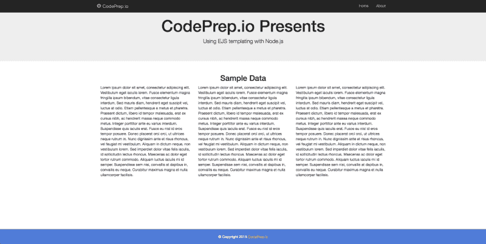
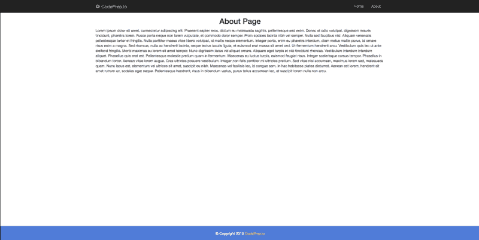

# 如何在 Node.js 应用程序中使用 EJS 模板

> 原文：<https://www.freecodecamp.org/news/how-to-use-ejs-templating-in-a-node-js-application-ea9347a96c65/>

詹妮弗·布兰德

# 如何在 Node.js 应用程序中使用 EJS 模板


EJS，嵌入式 javascript，是一种模板语言。EJS 将数据和模板结合起来生成 HTML。《EJS》最重要的特点之一是它使用了偏音。Partials 允许你一次定义一个东西，然后把它应用到应用程序的任何页面上。

我将向您展示如何创建一个使用 EJS 作为模板引擎的简单 Node.js 应用程序。然后，我们将为一个网站创建 2 页。我们将使用部分来建立我们的头，导航，页脚和内容。

[你可以在 github](https://github.com/ratracegrad/nodejs_ejs_boilerplate) 上获得这个例子的代码

#### 文件结构

我们将创建一个有两个页面的示例应用程序:index 和 about。

这是我们将要创建的应用程序的文件结构。

```
public — — style.css- routes — — index.js- views — — pages — — — — about.ejs — — — — index.ejs- partials — — — — 3columns.ejs — — — — footer.ejs — — — — head.ejs — — — — nav.ejs — — — — scripts.ejs- package.json- server.js
```

#### 入门指南

我们将首先设置我们的 package.json。这个文件将包含我们将在应用程序中使用的所有模块。我们将使用:

*   表达
*   ejs

```
{   “name”:    “node_ejs_boilerplate”,   “version”: “1.0.0”,   “description”: “Boilerplate showing the use of ejs as view template engine in a Node.js application”,   “author”: “Jennifer Bland”,   “main”: “server.js”,   “dependencies”: {       “ejs”: “^2.4.1”,       “express”: “^4.13.4”   }}
```

您可以将依赖项直接添加到 package.json 中，也可以安装依赖项，以便它们自动添加到 package.json 中。要手动安装依赖项，请输入以下命令:

```
npm install express ejs  — save
```

如果通过将依赖项添加到 package.json 中来添加依赖项，则需要使用以下命令来安装它们:

```
npm install
```

#### Server.js

现在我们已经安装了所有的依赖项，我们需要在 server.js 中构建应用程序。

```
‘use strict’;
```

```
// ================================================================// get all the tools we need// ================================================================var express = require(‘express’);var routes = require(‘./routes/index.js’);var port = process.env.PORT || 3000;
```

```
var app = express();
```

```
// ================================================================// setup our express application// ================================================================app.use(‘/public’, express.static(process.cwd() + ‘/public’));app.set(‘view engine’, ‘ejs’);
```

```
// ================================================================// setup routes// ================================================================routes(app);
```

```
// ================================================================// start our server// ================================================================app.listen(port, function() { console.log(‘Server listening on port ‘ + port + ‘…’);});
```

我们的服务器将监听 process.env.PORT 中定义的端口，如果没有定义，则监听 3000。

我们定义了/public 目录，因为这是我们访问位于/public 文件夹中的样式表 style.css 的方式。

我们将模板引擎定义为 ejs。

#### 路线

为了使我们的应用程序遵循 node.js 应用程序的结构，我将我们的索引和 about pages 的路径放在它们自己的文件中。该文件是 routes 文件夹中的 index.js。

因为我已经将路由放在它们自己的文件夹中，所以我需要通过在 server.js 文件中请求它们来获得对它们的访问。

我们的应用程序中有两条路线

*   / —这是显示主页的 GET
*   /about —这是显示“关于”页面的 GET

在 routes 中，我们使用 res.render 来显示适当的页面。默认情况下，render 命令将在名为 views 的文件夹中查找文件。我们依赖这个缺省值，只从视图文件夹中添加路径。

这是 routes 文件夹中的 index.js 文件。

```
‘use strict’;
```

```
module.exports = function(app) { app.get(‘/’, function(req, res) {   res.render(‘pages/index’); });
```

```
 app.get(‘/about’, function(req, res) {   res.render(‘pages/about’); });};
```

#### 配置我们的部分

对于我们的示例应用程序，我将实现四个部分。

*   标题—包含在网页标题部分找到的项目
*   导航—将在每一页上显示的导航
*   页脚—静态页脚，带有指向我的网站的链接
*   脚本——加载脚本，如 jQuery 和 Bootstrap
*   3 栏—将在主页上显示的内容

分部提供了代码的简单维护。例如，如果您在所有页面上创建导航，当您需要向导航添加新条目时，您必须用此更改更新每个页面。

导航部分将被插入到需要它的每个页面中。要在导航中添加一个新条目，你只需要更新导航部分，它会自动应用到包含导航部分的每个页面。

这是我们所有部分的内容。

头儿

```
<! — views/partials/head.ejs →<head>  <meta charset=”UTF-8">  <meta http-equiv=”X-UA-Compatible” content=”IE=edge”>  <meta name=”viewport” content=”width=device-width, initial-scale=1">  <! — The above 3 meta tags *must* come first in the head; any other head content must come *after* these tags →  <title>Demonstration of EJS templating in NodeJS Application</title>
```

```
 <! — STYLESHEETS →  <! — CSS (load bootstrap from a CDN) →  <link rel=”stylesheet” href=”https://maxcdn.bootstrapcdn.com/bootstrap/3.3.6/css/bootstrap.min.css">  <link rel=”stylesheet” href=”/public/style.css”></head>
```

导航 ejs

```
<! — views/partials/nav.ejs →<nav class=”navbar navbar-inverse navbar-fixed-top” role=”navigation”> <div class=”container”>
```

```
<div class=”navbar-header”> <a class=”navbar-brand” href=”/”> <span class=”glyphicon glyphicon glyphicon-cog”></span> CodePrep.io </a> </div>
```

```
<ul class=”nav navbar-nav pull-right”> <li><a href=”/”>Home</a></li> <li><a href=”/about”>About</a></li> </ul>
```

```
</div></nav>
```

大脚野人

```
<! — views/partials/footer.ejs →<footer class=”footer”> <div class=”container”> <p class=”text-center text-muted”>© Copyright 2015 <a href=”http://www.codeprep.io">CodePrep.io</a></p> </div></footer>
```

脚本. ejs

```
<! — views/partials/scripts.ejs →
```

```
<! — jQuery (necessary for Bootstrap’s JavaScript plugins) →<script src=”https://ajax.googleapis.com/ajax/libs/jquery/1.11.3/jquery.min.js"></script><! — Bootstrap javascript file →<script src=”https://maxcdn.bootstrapcdn.com/bootstrap/3.3.6/js/bootstrap.min.js"></script>
```

第三列

```
<! — views/partials/3columns.ejs →<section name=”content”> <div class=”container”> <h2 class=”text-center”>Sample Data</h2> <div class=”col-xs-12 col-md-4"> <p>Lorem ipsum dolor sit amet, consectetur adipiscing elit. Vestibulum eget iaculis lorem. Fusce elementum magna fringilla ipsum bibendum, vitae consectetur ligula interdum. Sed mauris diam, hendrerit eget suscipit vel, luctus at odio. Etiam pellentesque a metus et pharetra. Praesent dictum, libero id tempor malesuada, erat ex cursus nibh, ac hendrerit massa neque commodo metus. Integer porttitor ante eu varius interdum. Suspendisse quis iaculis erat. Fusce eu nisl id eros tempor posuere. Donec placerat orci orci, ut ultrices neque rutrum in. Nunc dignissim ante et risus rhoncus, vel feugiat mi vestibulum. Aliquam in dictum neque, non vestibulum lorem. Sed imperdiet dolor vitae felis iaculis, id sollicitudin lectus rhoncus. Maecenas ac dolor eget tortor rutrum commodo. Aliquam luctus iaculis mi id semper. Suspendisse sem nisi, convallis at dapibus in, convallis eu neque. Curabitur maximus magna et nulla ullamcorper facilisis.</p> </div> <div class=”col-xs-12 col-md-4"> <p>Lorem ipsum dolor sit amet, consectetur adipiscing elit. Vestibulum eget iaculis lorem. Fusce elementum magna fringilla ipsum bibendum, vitae consectetur ligula interdum. Sed mauris diam, hendrerit eget suscipit vel, luctus at odio. Etiam pellentesque a metus et pharetra. Praesent dictum, libero id tempor malesuada, erat ex cursus nibh, ac hendrerit massa neque commodo metus. Integer porttitor ante eu varius interdum. Suspendisse quis iaculis erat. Fusce eu nisl id eros tempor posuere. Donec placerat orci orci, ut ultrices neque rutrum in. Nunc dignissim ante et risus rhoncus, vel feugiat mi vestibulum. Aliquam in dictum neque, non vestibulum lorem. Sed imperdiet dolor vitae felis iaculis, id sollicitudin lectus rhoncus. Maecenas ac dolor eget tortor rutrum commodo. Aliquam luctus iaculis mi id semper. Suspendisse sem nisi, convallis at dapibus in, convallis eu neque. Curabitur maximus magna et nulla ullamcorper facilisis.</p> </div> <div class=”col-xs-12 col-md-4"> <p>Lorem ipsum dolor sit amet, consectetur adipiscing elit. Vestibulum eget iaculis lorem. Fusce elementum magna fringilla ipsum bibendum, vitae consectetur ligula interdum. Sed mauris diam, hendrerit eget suscipit vel, luctus at odio. Etiam pellentesque a metus et pharetra. Praesent dictum, libero id tempor malesuada, erat ex cursus nibh, ac hendrerit massa neque commodo metus. Integer porttitor ante eu varius interdum. Suspendisse quis iaculis erat. Fusce eu nisl id eros tempor posuere. Donec placerat orci orci, ut ultrices neque rutrum in. Nunc dignissim ante et risus rhoncus, vel feugiat mi vestibulum. Aliquam in dictum neque, non vestibulum lorem. Sed imperdiet dolor vitae felis iaculis, id sollicitudin lectus rhoncus. Maecenas ac dolor eget tortor rutrum commodo. Aliquam luctus iaculis mi id semper. Suspendisse sem nisi, convallis at dapibus in, convallis eu neque. Curabitur maximus magna et nulla ullamcorper facilisis.</p> </div> </div></section>
```

#### 构建我们的页面

我们的示例应用程序有一个主页和一个 about 页面。我们将需要创建这两个页面。在这些页面上，我们将插入我们刚刚在页面上创建的适当部分。

我们将所有的片段放在视图文件夹中的一个名为 partials 的文件夹中。我们将在 views 文件夹中创建另一个名为 pages 的文件夹。这个文件夹将包含我们的主页和关于页面。

要在页面上插入部分内容，我们使用以下格式:

```
<% include ../partials/head %>
```

以下是我们两个页面的内容:

**索引. ejs】t1**

```
<!DOCTYPE html><html lang=”en”>
```

```
<% include ../partials/head %>
```

```
<body>
```

```
<% include ../partials/nav %>
```

```
<section name=”jumbotron” > <div class=”jumbotron text-center”> <h1>CodePrep.io Presents</h1> <p>Using EJS templating with Node.js</p> </div> </section>
```

```
<% include ../partials/3columns %>
```

```
<% include ../partials/footer %>
```

```
<% include ../partials/scripts %>
```

```
</body>
```

```
</html>
```

**about.ejs**

```
<!DOCTYPE html><html lang=”en”>
```

```
<% include ../partials/head %>
```

```
<body>
```

```
<% include ../partials/nav %>
```

```
<! — content for about page → <div class=”container” id=”about”> <div class=”row”> <h2 class=”text-center”>About Page</h2> <div class=”col-xs-12"> <p>Lorem ipsum dolor sit amet, consectetur adipiscing elit. Praesent sapien eros, dictum eu malesuada sagittis, pellentesque sed enim. Donec at odio volutpat, dignissim mauris tincidunt, pharetra lorem. Fusce porta neque non lorem vulputate, et commodo dolor semper. Proin sodales lacinia nibh vel semper. Nulla sed faucibus nisi. Aliquam venenatis pellentesque tortor et fringilla. Nulla porttitor massa vitae libero volutpat, id mollis neque elementum. Integer porta, enim eu pharetra interdum, diam metus mollis purus, id ornare risus enim a magna. Sed rhoncus, nulla ac hendrerit lacinia, neque lectus iaculis ligula, et euismod erat massa sit amet orci. Ut fermentum hendrerit arcu. Vestibulum quis leo ut ante eleifend fringilla.
```

```
Morbi maximus eu lorem sit amet tempor. Nunc dignissim lacus vel aliquet ornare. Aliquam eget turpis et nisi tincidunt rhoncus. Vestibulum interdum interdum aliquet. Phasellus quis erat est. Pellentesque molestie pretium quam in fermentum. Maecenas eu luctus turpis, euismod feugiat risus. Integer scelerisque cursus tempor. Phasellus in bibendum tortor.
```

```
Aenean vitae lorem augue. Cras ultricies posuere vestibulum. Integer non felis porttitor mi ultricies pretium. Sed vitae nisi accumsan, maximus lorem sed, malesuada quam. Nunc lacus est, elementum vel ultrices sit amet, suscipit eu nibh. Maecenas vel facilisis leo, id congue sem. In hac habitasse platea dictumst. Aenean est lorem, hendrerit sit amet rutrum ac, sodales eget neque. Pellentesque hendrerit, risus in bibendum varius, purus tellus accumsan leo, et suscipit lorem nulla non arcu.</p> </div>
```

```
</div> </div><! — end of content →
```

```
<% include ../partials/footer %>
```

```
<% include ../partials/scripts %>
```

```
</body></html>
```

#### 开始我们的应用

要启动该应用程序，请输入以下命令:

```
node server.js
```

当我们的应用程序启动时，它将显示我们的主页:



homepage

如果您单击导航中的“关于”链接，您将看到“关于”页面:



about page

### 获取代码

[你可以在 github](https://github.com/ratracegrad/nodejs_ejs_boilerplate) 上获得这个例子的代码

### 更多文章

感谢阅读我的文章。如果你喜欢，请点击下面的拍手图标，这样其他人就会找到这篇文章。这里还有一些你可能感兴趣的我的文章:
[使用 Node.js & Express.js 将数据保存到 MongoDB 数据库](https://medium.com/@ratracegrad/hitchhikers-guide-to-back-end-development-with-examples-3f97c70e0073)
[第一印象很重要——为什么你的 Github Repo 没有自述文件？](https://medium.com/@ratracegrad/first-impressions-count-why-doesnt-your-github-repo-have-a-readme-file-f240961a8fca)
[为什么公司文化对你的软件工程师职业很重要](https://medium.freecodecamp.org/why-company-culture-is-important-to-your-career-as-a-software-engineer-5a590bc44621)