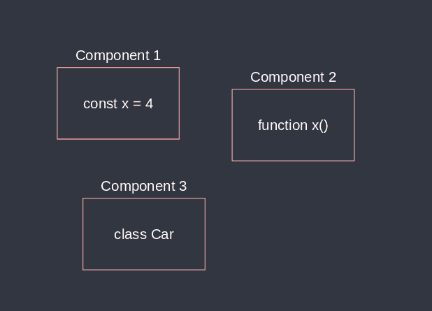
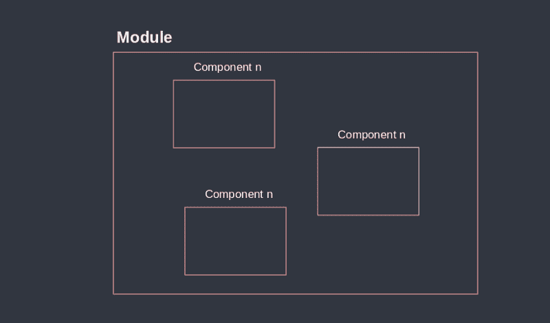
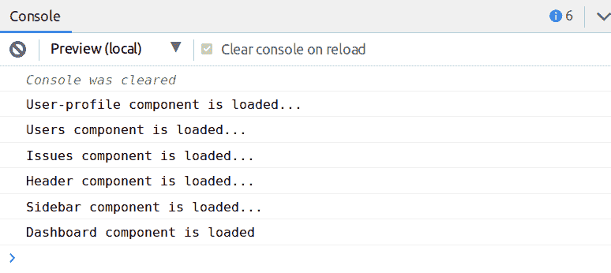
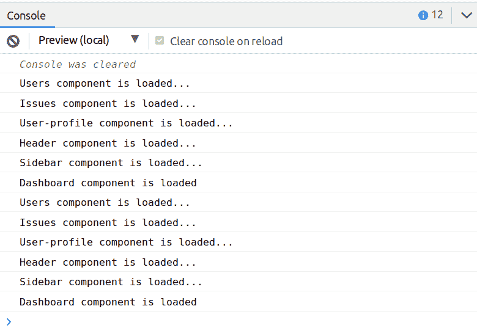

# ES6 模块实用指南

> 原文：<https://www.freecodecamp.org/news/how-to-use-es6-modules-and-why-theyre-important-a9b20b480773/>

构建网络应用的一个主要挑战是如何快速扩展和响应市场需求。当需求(需求)增加时，功能(特性)也会增加。因此，重要的是要有一个坚实的架构结构，这样应用程序才能有机增长。我们不希望因为应用程序中的所有内容都被深深地纠缠在一起，而导致应用程序无法扩展。

> 写容易删除，不容易扩展的代码。
> - Tef，编程太可怕了

在本文中，我们将使用 ES6 模块创建一个简单的仪表板，然后介绍用于改进文件夹结构和简化代码编写的优化技术。让我们深入了解一下为什么 ES6 模块很重要，以及如何有效地应用它。

> JavaScript 很久以前就有模块了。然而，它们是通过库实现的，而不是内置在语言中。ES6 是 JavaScript 第一次内置模块([源](http://exploringjs.com/es6/ch_modules.html))。

TL；DR —如果您想看一个实际的例子，我们使用 ES6 模块从一个架构设计布局中创建一个控制面板，请跳到第 4 部分。

### 这是我们要解决的问题

1.  为什么需要 ES6 模块
2.  回到手动加载脚本的时代
3.  ES6 模块如何工作(`import`与`export`)
4.  让我们用模块构建一个仪表板
5.  仪表板示例的优化技术

> 如果你想成为一名更好的 web 开发人员，开创自己的事业，教导他人，或者提高你的开发技能，我会每周发布最新 web 语言的提示和技巧。

### 1.为什么需要 ES6 模块

让我们来看几个场景，看看为什么模块是相关的。

#### 场景 1——不要重新发明轮子

作为开发人员，我们经常在不知不觉中重新创建已经创建的东西，或者复制和粘贴东西以减少时间。最后，加起来，我们就剩下 x 个分散在应用程序中的相同副本。每次我们需要改变某个东西时，我们必须根据我们有多少副本来做 x 次。

举例
例如，想象一下一家汽车工厂每生产一辆新车都试图重新发明引擎，或者一位建筑师每画完一幅画都要从头开始。做到这一点并不是不可能的，但是如果你不能重复使用你已经获得的经验，那知识还有什么意义呢？

#### 场景 2——知识壁垒

如果系统被深深地纠缠，并且缺乏文档，老/新的开发者很难了解应用程序如何工作，以及事物是如何连接的。

举例来说，一个开发人员应该不用猜测就能看到一个变化的结果，否则我们最终会犯很多错误，不知道从哪里开始。一个解决方案是使用模块封装行为，我们可以很容易地缩小调试过程，并迅速确定问题的根源。

> 我最近写了一篇关于[“不断想要学习新东西的开发人员”](https://codeburst.io/developers-that-constantly-want-to-learn-new-things-heres-a-tip-7a16e42302e4)的文章，提供了如何提高知识的技巧。

#### 场景 3—意外行为

通过避免关注点分离(设计原则)，它会导致意想不到的行为。

**例子**
举个例子，比方说有人增加了车内的音量，于是挡风玻璃的雨刷就开始工作了。这是一个意外行为的例子，不是我们在应用程序中想要的。

简而言之，为了有效地重用、维护、分离和封装内部行为和外部行为，我们需要 ES6 模块。这不是让系统变得复杂，而是能够在不破坏系统的情况下轻松扩展和删除内容。

### 2.回到手动加载脚本的时代

如果您从事 web 开发已经有几年了，那么您肯定会遇到依赖性冲突，比如脚本没有以正确的顺序加载，或者 JS 不能访问 DOM 树的元素。

原因是页面上的 HTML 是按照它出现的顺序加载的，这意味着在`<bo` dy >元素内的内容完成加载之前，我们无法加载脚本。

例如，如果您试图访问`<body>`标签`using document.getElementById("id-name")`中的一个元素，而该元素还没有被加载，那么您会得到一个未定义的错误。为了确保脚本被正确加载，我们可以使用和延迟异步。前者将确保每个脚本按照出现的顺序加载，而后者则在脚本可用时加载。

解决这个问题的老式方法是在`</body>`元素之前加载脚本。

```
<!DOCTYPE html>
<head>
</head>
<body>

  <!--HTML content goes here-->

  <script src="js/jquery.js"></script>
  <script src="js/script2.js"></script>
  <script src="js/script3.js"></script>
  <script src="js/script4.js"></script>
</body>
</html>
```

但是从长远来看，脚本的数量越来越多，当我们试图维护版本和依赖冲突时，我们可能会有 10 多个脚本。

#### 关注点分离

一般来说，就性能、依赖性和可维护性而言，如上所示加载脚本并不是一个好主意。我们不想让`index.html`文件负责加载所有脚本——我们需要某种结构和逻辑分离。

解决方案是利用 ES6 的语法、`import`和`export`语句，这是一种优雅且可维护的方法，允许我们将事物分开，并且仅在需要时可用。

#### `import`和`export statements`

当我们想在某个地方提供某样东西时，就使用`export`关键字，而`import`用来访问`export`已经提供的东西。

> 经验法则是，为了`import`某事，你首先需要`export`它。

而我们究竟能`export`些什么？

*   一个变量
*   对象文字
*   头等
*   一项功能
*   ++

为了简化如上所示的例子，我们可以将所有脚本包装在一个文件中。

```
import { jquery } from './js/jquery.js';
import { script2 } from './js/script2.js';
import { script3 } from './js/script3.js';
import { script4 } from './js/script4.js';
```

然后在我们的`index.html`中加载`app.js`脚本。但是首先，为了让它工作，我们需要使用`type="module"` ( [源](https://caniuse.com/#search=modules))，这样我们就可以使用`import`和`export`来处理模块。

```
<!DOCTYPE html>
<head>
</head>
<body>

  <!--HTML content goes here-->

  <script type="module" src="js/app.js"></script>
</body>
</html> 
```

如您所见，`index.html`现在负责一个脚本，这使得维护和扩展变得更加容易。简而言之，`app.js`脚本成为我们的入口点，我们可以用它来引导我们的应用程序。

注意:我不建议将所有的脚本加载到一个文件中，比如`app.js`，除非那些需要它的脚本。

既然我们已经看到了如何使用`import`和`export`语句，那么让我们看看在实践中如何使用模块。

### 3.ES6 模块如何工作

模块和组件有什么区别？模块是我们可以在应用程序中重用的小型独立单元(组件)的集合。

#### **目的是什么？**

*   封装行为
*   易于使用
*   易于维护
*   易于扩展

是的，它使开发更容易！

#### 那么什么是真正的组件呢？

组件可以是变量、函数、类等等。换句话说，可以由`*export*`语句导出的所有东西都是一个组件(或者你可以称之为一个块、一个单元等等)。



What is a component

#### 那么什么是模块呢？

如前所述，模块是组件的集合。如果我们有多个组件进行通信，或者只是必须显示在一起以形成一个集成的整体，那么您很可能需要一个模块。



What is a module

#### 让所有东西都可以重复使用是一个挑战

一位在电气工程领域拥有 30 多年经验的首席工程师曾经说过，由于时间和成本的原因，我们不能期望所有的东西都被重复使用，而且不是所有的东西都应该被重复使用。与其指望东西 100%复用，不如一定程度上复用。

总的来说，这意味着我们不必让应用程序中的所有内容都可以重用。有些东西注定只能用一次。经验法则是，如果你需要某样东西两次以上，那么创建一个模块或组件可能是个好主意。

起初，使一些东西可重用听起来很容易，但是记住，它需要从它的环境中取出组件，并期望它在另一个环境中工作。但是很多时候，我们不得不修改它的一部分以使它完全可重用，在你知道之前，你已经创建了两个新的组件。

Antoine 写了一篇文章，描述了创建可重用 JS 组件的 3 个基本规则，推荐阅读。当他向他的团队展示 VueJS 时，一位经验丰富的同事说:

> 这在理论上很棒，但根据我的经验，这些花哨的“可重用”的东西从来不会被重用。

这个想法是，不是所有的东西都应该被重用，比如按钮、输入框和复选框等等。使一些东西可重用的整个工作需要资源和时间，并且我们经常以永远不会发生的过度思考的场景结束。

Stack Overflow 的首席执行官 Joel Spolsky 说:

> 人们实际拥有的 50%好的解决方案比没有人拥有的 99%好的解决方案能解决更多的问题，并且持续时间更长，因为它是在你的实验室里，你在那里无休止地打磨那该死的东西。航运是一个特点。一个非常重要的特性。你的产品一定要有。

### 4.让我们用模块构建一个仪表板

现在我们已经对模块如何工作有了基本的了解，让我们来看一个在使用 JS 框架时最有可能遇到的实际例子。我们将按照由布局和组件组成的架构设计创建一个简单的仪表板。

该示例的代码可以在[这里](https://stackblitz.com/edit/modules-example)找到。

#### 第一步——设计你需要的东西

在大多数情况下，开发人员会直接跳到代码中。然而，设计是编程的一个重要部分，它可以节省你很多时间和头痛。请记住，设计不应该是完美的，而是引导你走向正确方向的东西。

所以这是我们基于建筑设计所需要的。

*   **组件:**`users.js``user-profile.js`和`issues.js`
*   **布局:**`header.js``sidebar.js`
*   **仪表盘:** `dashboard.js`

所有组件和布局都将加载到`dashboard.js`中，然后我们将在`index.js`中引导`dashboard.js`。


Architectural design of our dashboard

那么，为什么我们有一个布局和组件文件夹呢？

布局是我们曾经需要的东西，例如静态模板。仪表板内的内容可能会改变，但侧边栏和标题将保持不变(这些就是所谓的布局)。布局可以是错误页、页脚、状态页等等。

components 文件夹用于存放我们很可能会多次重复使用的通用组件。

处理模块时，有一个坚实的基础结构是很重要的。为了有效地扩展，文件夹必须有一个合理的名字，以便于查找和调试。

> 稍后我将向您展示如何创建一个动态界面，这需要为我们需要的组件和布局准备一个文件夹空间。

#### 步骤 2-设置文件夹结构

如上所述，我们有 3 个主要文件夹:仪表板，组件和布局。

```
- dashboard
- components 
- layouts
index.html
index.js ( entry point ) 
```

而在文件夹里面的每个文件里，我们`export`一个`class`。

```
- dashboard
    dashboard.js
- components
    issues.js
    user-profile.js
    users.js 
- layouts
    header.js
    sidebar.js
index.html
index.js ( entry point )
```

#### 步骤 3 —实施

文件夹结构已经设置好了，所以接下来要做的是在每个文件中创建组件(a `class`),然后`export`它。其余文件的代码约定是相同的:每个组件只是一个`class`和一个`method`，控制“x 组件已加载”，其中 x 是组件的名称，以表示组件已加载。

让我们创建一个用户`class`，然后如下所示`export`。

```
class Users {

  loadUsers() {
    console.log('Users component is loaded...')
  }

}

export { Users }; 
```

注意，在处理`export`语句时，我们有各种[选项](https://developer.mozilla.org/en-US/docs/web/javascript/reference/statements/export)。所以这个想法是，你既可以`export`单个组件，也可以是组件的集合。例如，如果我们`export`了`class`，我们可以通过创建一个`class`的新实例来访问其中声明的方法。

```
export { name1, name2, …, nameN };
export function FunctionName(){...}
export class ClassName {...}
...

export * from …;
export { name1, name2, …, nameN } from …;
export { import1 as name1, import2 as name2, …, nameN } from …;
export { default } from …;
...
```

好的，如果你在步骤 1 中查看架构图，你会注意到`user-profile`组件被`header`布局封装。这意味着当我们加载`header`布局时，它也会加载`user-profile`组件。

```
import { UserProfile } from '../components/users-profile.js';

class Header {

  loadHeader() {
    // Creata a new instance
    const userProfile = new UserProfile(); 

    // Invoke the method (component)
    userProfile.loadUserProfile();

    // Output loading status
    console.log('Header component is loaded...')
  }

}

export { Header };
```

既然每个组件和布局都有一个导出的`class`，我们就像这样把它`import`到我们的`dashboard`文件中:

```
// From component folder
import { Users } from '../components/users.js';
import { Issues } from '../components/issues.js';

// From layout folder
import { Header } from '../layouts/header.js';
import { Sidebar } from '../layouts/sidebar.js';

class Dashboard {

  loadDashboard(){

    // Create new instances
    const users = new Users();
    const issues = new Issues();
    const header = new Header();
    const sidebar = new Sidebar();

    console.log('Dashboard component is loaded');
  }

}

export { Dashboard } 
```

为了理解`dashboard`文件中到底发生了什么，我们需要重新查看步骤 1 中的绘图。简而言之，由于每个组件都是一个`class`，我们必须创建一个新的实例，然后将它分配给一个对象。然后我们使用该对象来执行方法`loadDashboard()`中所示的方法。

目前，应用程序不输出任何东西，因为我们还没有执行方法`loadDashboard()`。为了让它工作，我们需要像这样将文件`index.js`中的`dashboard`模块`import`:

```
import { Dashboard } from './dashboard/dashboard.js'; 

const dashboard = new Dashboard(); 

dashboard.loadDashboard(); 
```

然后控制台输出:



ES6 Components loaded

如图所示，一切正常，组件加载成功。我们还可以继续创建两个实例，然后像这样做:

```
import { Dashboard } from './dashboard/dashboard.js'; 

const dashboard_1 = new Dashboard(); 
const dashboard_2 = new Dashboard(); 

dashboard_1.loadDashboard();
dashboard_2.loadDashboard();
```

它的输出和上面显示的一样，但是因为我们必须创建新的实例，所以我们得到了两次结果。



Two unique instances of dashboard

一般来说，这允许我们在不干扰其他模块的情况下，在需要的文件中轻松地维护和重用该模块。我们只是创建一个封装组件的新实例。

然而，如前所述，我们的目的是通过使用`import`和`export`语句来解释如何使用模块和组件。

在大多数情况下，当使用 JS 框架时，我们通常有一个可以改变`dashboard`内容的途径。现在，每次我们调用方法`loadDashboard()`时，所有的东西都被加载，比如布局，这不是一个理想的方法。

### 5.仪表板示例的优化技术

现在我们已经对模块如何工作有了基本的了解，但是当我们处理由许多组件组成的大型应用程序时，这种方法并不是真正可伸缩的或者直观的。

我们需要被称为动态界面的东西。它允许我们创建我们需要的组件的集合，并且容易地访问它。如果您使用的是 Visual Studio 代码，IntelliSense 会向您显示哪些组件可用，以及您已经使用了哪些组件。这意味着您不必手动打开文件夹/文件来查看已导出的组件。

因此，如果我们有一个包含 20 个组件的模块，我们不希望每个组件一行接一行。我们只是想得到我们需要的，仅此而已。如果您使用过 C#、PHP、C++或 Java 等语言中的名称空间，您会注意到这个概念在本质上是相似的。

以下是我们想要实现的目标:

```
// FILE: dashboard.js

// From component folder
import { users, issues } from '../components';

// From layout folder
import { header, sidebar } from '../layouts'; 

class Dashboard {

  loadDashboard(){

    // Invoke methods
    users.loadUsers();
    issues.loadIssues();
    header.loadHeader();
    sidebar.loadSidebar();

    console.log('Dashboard component is loaded');
  }

}

export let dashboard = new Dashboard(); 
```

如图所示，我们有更少的代码行，并且在不丢失上下文的情况下使它成为声明性的。让我们看看我们做了哪些改变。

#### 创建一个动态界面(也称为桶)

动态界面允许我们创建我们需要的东西的集合。这就像用我们喜欢的工具创建一个工具箱。值得一提的是，动态界面不应该添加到每个单独的文件夹中，而应该添加到包含许多组件的文件夹中。

> 它们极大地简化了导入，使它们看起来更清晰。我们只是不想有太多的桶文件，因为这是反生产的，通常会导致*循环依赖*的问题，这有时会很难解决。
> - [阿德里安·弗丘](https://www.freecodecamp.org/news/how-to-use-es6-modules-and-why-theyre-important-a9b20b480773/undefined)

为了创建一个动态界面，我们创建了一个名为`index.js`的文件，它位于每个文件夹的根目录下，用于重新导出我们需要的文件或组件的子集。同样的概念也适用于 TypeScript，你只需要把类型从`.js`改成`.ts`，就像`index.ts`一样。

`index.js`是我们访问根文件夹空间时加载的第一个文件——它与引导我们的 HTML 内容的`index.html`是同一个概念。这意味着我们不必明确地将`import { component } from './components**/index.js**'`**写成`import { component } from './components`。**

**下面是动态界面的样子。**

```
`// Root space -> components folder

// Dynamic interface
export { users } from './users';
export { issues } from './issues';
export { userProfile } from './user-profile';`
```

**通过使用动态接口，我们最终少了一个要访问的根级别，也少了一些代码。**

```
`// Before
import { Users } from '../components/users.js';
import { Issues } from '../components/issues.js';
import { Header } from '../layouts/header.js';
import { Sidebar } from '../layouts/sidebar.js';

// After (with dynamic interface)
import { users, issues } from '../components';
import { header, sidebar } from '../layouts';` 
```

#### **在运行时创建新实例**

**我们删除了`dashboard.js`中的四个实例，而是在运行时导出每个组件时创建一个实例。如果你想决定对象的名字，你可以先做`export default new Dashboard()`，然后不加花括号做`import dashView`。**

```
`// Before
export class { dashboard }; 
const dashboard = new Dashboard(); 
dashboard.loadDashboard(); 

// After
export const dashboard = new Dashboard(); 
dashboard.loadDashboard()`
```

**如图所示，我们可以直接调用该方法，而不需要创建新的实例，并且编写的代码也更少。然而，这是个人偏好，您可以自由决定什么是您的应用程序和需求的实际用例。**

**最后，我们用一种方法加载所有组件和布局。**

```
`import { dashboard } from './dashboard/dashboard';

dashboard.loadDashboard();`
```

### **结论**

**我一开始只是想展示一个简短的例子，告诉你如何`import`和`export`一个组件，但是后来我觉得有必要分享我所知道的一切(几乎)。我希望这篇文章能让你了解在构建应用程序时如何有效地处理 ES6 模块，以及在关注点分离(设计原则)方面重要的事情。**

#### ****外卖:****

*   **有了 ES6 模块，我们可以很容易地重用、维护、分离和封装组件，以免被外部行为改变**
*   **模块是组件的集合**
*   **组件是一个独立的块**
*   **不要试图让每样东西都可以重复使用，因为这需要时间和资源，而且大多数情况下我们不会重复使用它**
*   **在深入研究代码之前，创建一个架构图**
*   **为了使组件在其他文件中可用，我们必须首先`export`然后`import`**
*   **通过使用`index.js`(TypeScript`index.ts`的相同概念)我们可以创建动态接口(桶),用更少的代码和更少的层次路径快速访问我们需要的东西**
*   **您可以通过使用`export let objectName = new ClassName()`在运行时`export`一个新的实例**

**好消息是事情已经改变了，我们正在向基于组件和可重用的范例发展。问题是我们如何不仅能重用普通的 JS 代码，还能以实用和直观的方式重用 HTML 元素。看起来 ES6 模块与 [web 组件](https://developer.mozilla.org/en-US/docs/Web/Web_Components)的结合可能正好给了我们构建高性能和可扩展应用所需的东西。**

**这里是我写的几篇关于网络生态系统的文章，以及个人编程技巧和诀窍。**

*   **【Angular 和 React 之间的比较**
*   **[混乱的头脑导致混乱的代码](https://medium.freecodecamp.org/a-chaotic-mind-leads-to-chaotic-code-e7d6962777c0)**
*   **[不断想学习新事物的开发人员](https://codeburst.io/developers-that-constantly-want-to-learn-new-things-heres-a-tip-7a16e42302e4)**
*   **[了解这些核心网络概念](https://medium.freecodecamp.org/learn-these-core-javascript-concepts-in-just-a-few-minutes-f7a16f42c1b0?gi=6274e9c4d599)**
*   **[用这些重要的 JavaScript 方法提升你的技能](https://medium.freecodecamp.org/7-javascript-methods-that-will-boost-your-skills-in-less-than-8-minutes-4cc4c3dca03f)**
*   **[通过创建自定义 bash 命令加快编程速度](https://codeburst.io/learn-how-to-create-custom-bash-commands-in-less-than-4-minutes-6d4ceadd9590)**

**你可以在我每周发表文章的媒体上找到我。或者你可以在 Twitter 上关注我，在那里我会发布相关的 web 开发技巧和窍门以及个人开发故事。**