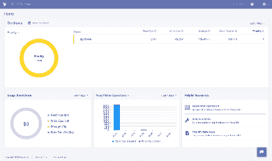
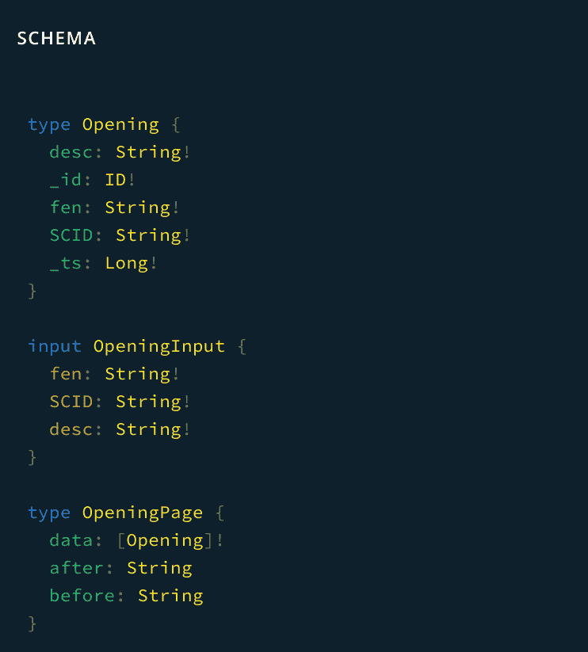
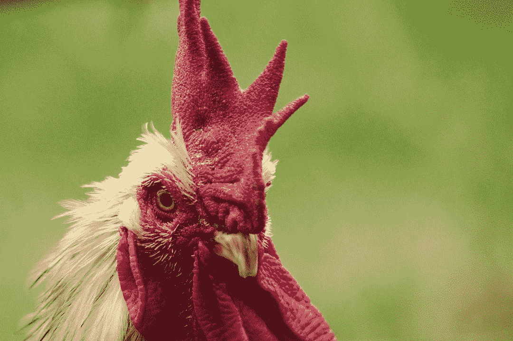

# 如何使用 FaunaDB + GraphQL

> 原文：<https://www.freecodecamp.org/news/how-to-use-faunadb/>

除了在那里开博客，我还有一两个项目在网上维护。这是一个易于部署的平台，具有内容管理(CMS)和 lambda 功能(通过 AWS)的特性。

不过，我最近的项目需要的是一个数据库。Netlify 已经集成了 FaunaDB:一个 NoSQL 的面向文档的数据库。最近，[宣称支持 GraphQL](https://fauna.com/blog/the-worlds-best-serverless-database-now-with-native-graphql) ，这是一大优势。免费且设置简单，为什么不试试呢？

## 数据库

动物群有一种独特的方法来管理全球分布的数据存储中的[事务，这样当数据库记录从很远的地方更新时就不会失去同步。这是具有高交易量的全球企业的问题，但与我的小项目无关。](https://fauna.com/blog/consistency-without-clocks-faunadb-transaction-protocol)

## 应用程序

我是一个中等水平的象棋选手，我想建立数据来分析大师级的象棋比赛。SQL 或 NoSQL 并不重要——两者我都用过，并且都可以支持我的应用程序的适度需求。

我爱 GraphQL，从 2016 年开始用。但是，我不希望我的 GraphQL 模式暴露在客户端。解决这个问题的方法是用 lambda 函数来处理 GraphQL 请求，然后让客户端使用这些函数作为一种代理。

## 实施

我从[网生动物开始，例如](https://github.com/netlify/netlify-faunadb-example) *。这个不用 GraphQL 相反，这个例子的[网络功能](https://www.netlify.com/docs/functions/)使用 FQL: [动物查询语言](https://docs.fauna.com/fauna/current/api/fql/)。您可以通过[动物群外壳](https://github.com/fauna/fauna-shell)或[使用 NodeJS 客户端模块](https://github.com/fauna/faunadb-js)执行查询。下面使用客户端将一个 **todoItem** 插入到 **todos** 集合中:

todos-create.js

```
 ...
  /* construct the fauna query */
  return client.query(q.Create(q.Ref('classes/todos'), todoItem))
    .then((response) => {
      console.log('success', response)
      /* Success! return the response with statusCode 200 */
      return callback(null, {
        statusCode: 200,
        body: JSON.stringify(response)
      })
    }).catch((error) => {
      console.log('error', error)
      /* Error! return the error with statusCode 400 */
      return callback(null, {
        statusCode: 400,
        body: JSON.stringify(error)
      })
    })
```

要使用 GraphQL，我需要创建一个关于动物的数据库，然后导入一个 GraphQL 模式。一旦你在动物群上创建了一个账户，你就可以通过他们的仪表盘来完成所有这些。



My new Fauna database

一旦完成，就会基于我导入的 GraphQL 类型定义创建一组集合(类似于 SQL 中的表)。有趣的是，还添加了新的类型和字段来处理诸如识别实例和管理类型之间的关系之类的事情。例如，我的开场白是:

```
type Opening {
  desc: String!
  fen: String!
  SCID: String!
}
```

当我打开仪表板，打开 GraphQL Playground，查看模式时，我看到:



除了 Opening 中的 _id 和 _ts 字段之外，OpeningInput 和 OpeningPage 是由动物群添加的。

### 查询和突变

如果您在自己创建的模式中定义了某些查询和变异，那么动物群*会自动为您实现它们。当我定义保存国际象棋开局信息的类型时，我*可以*在我的模式中包含以下查询和变异定义:*

```
type Query {
 allOpenings: [Opening]
}
```

FaunaDB 将提供一个实现。

### λ函数

最初的兰姆达斯讲 FQL 语。要将这些请求转换为 GraphQL 请求，请使用 node-fetch 等提取库，并使用类似于 [apollo-boost](https://levelup.gitconnected.com/giving-react-a-lift-with-apollo-boost-74c6ff32894d) 中包含的客户端向动物群 GraphQL 端点发出 HTTPS 请求:

```
import ApolloClient from 'apollo-boost';
import gql from 'graphql-tag'
import fetch from 'node-fetch'
import authorization from './authorization'

const URL = 'https://graphql.fauna.com/graphql'

const client = new ApolloClient({
  uri: URL,
  fetch,
  request: operation => {
    operation.setContext({
      headers: {
        authorization
      },
    });
  },
})

exports.handler = (event, context, callback) => {
  const allOpeningFens = gql`    
  query openings {
      allOpenings {
        data {fen}
      }
    }
  `;

  client.query({ query: allOpeningFens })
    .then(results => {
      callback(null, {
        statusCode: 200,
        body: JSON.stringify(results),
      })
    })
    .catch(e => callback(e))
}
```

上面的代码请求开放集合中所有开放的 FEN 字符串。

## 我们说完了吗？号码


Photo by [Massimo Sartirana](https://unsplash.com/@sarti46?utm_source=ghost&utm_medium=referral&utm_campaign=api-credit) / [Unsplash](https://unsplash.com/?utm_source=ghost&utm_medium=referral&utm_campaign=api-credit)

Fauna 的 GraphQL 支持处于功能性阶段，但仍处于形成阶段。我想做的事情之一是具有批量插入能力，这样我就不必一次插入一个打开的内容到打开的集合中。这种变异不是由动物群自动创建的(尽管它是有标签的特性请求)，所以我必须为它定义一个解析器。

动物界有一个 [@resolver](https://docs.fauna.com/fauna/current/api/graphql/directives/d_resolver) 指令，可以用在突变定义上。它将指导动物使用 FQL 编写的用户自定义函数；这些可以直接写在 shell 里。对于像 open 这样的简单类型的集合，解析器 FQL 非常简单。

首先，我转到 FaunaDB 控制台外壳，创建函数`add_openings`:

```
CreateFunction({
  name: "add_openings",
  body: Query(
    Lambda(
      ["openings"],
      Map(
        Var("openings"),
        Lambda("X", Create(Collection("Opening"), { data: Var("X") }))
      )
    )
  )
```

Openings 是一个数组，Map 方法对每个元素执行 Create 调用。然后，我将@resolver 指令添加到我要导入的模式中的变异定义中(称为**自定义解析器**):

```
type Mutation {
   addOpenings(openings: [OpeningInput]) : [Opening]! @resolver(name: "add_openings" paginated:false)
}
```

现在，当通过 GraphQL 客户端执行变异时，`add_openings`被调用，并将所有游戏作为参数插入到变异中。从 GraphQL 客户端看起来是这样的:

```
import ApolloClient from 'apollo-boost';
import gql from 'graphql-tag'
import fetch from 'node-fetch'
import authorization from './authorization'

const URL = 'https://graphql.fauna.com/graphql'

const client = new ApolloClient({
  uri: URL,
  fetch,
  request: operation => {
    operation.setContext({
      headers: {
        authorization
      },
    });
  },
})

exports.handler = (event, context, callback) => {

  const addScidDocs = gql`
  mutation($scid: [OpeningInput]) {
    addOpenings(openings: $scid) {desc}
  }
  `

  const json = JSON.parse(event.body)

  client.mutate({
    mutation: addScidDocs,
    variables: { scid: json },
  })
    .then(results => {
      console.log({ results })
      callback(null, {
        statusCode: 200,
        body: JSON.stringify(results),
      })
    })
    .catch(e => callback(e.toString()))

  // callback(null, { statusCode: 200, body: event.body })
}
```

## 古老的鸡和蛋的问题



Photo by [Chromatograph](https://unsplash.com/@chromatograph?utm_source=ghost&utm_medium=referral&utm_campaign=api-credit) / [Unsplash](https://unsplash.com/?utm_source=ghost&utm_medium=referral&utm_campaign=api-credit)

你会注意到在上面的变异中，我指的是 OpeningInput 类型。为了将我的模式导入到动物群中，必须定义该类型。但是……当我导入 Opening 时，动物群自动为我生成了那个类型。当我稍后在我的模式中定义它时(为了突变)，我基本上覆盖了那个类型。因为生成的类型用于生成的突变(即，createOpening，singular)，通过在我自己的模式中覆盖该类型定义，我可能会破坏其中一个生成的突变。

建议的解决方案是不覆盖 OpeningInput 类型，而是将我的输入类型重命名为类似 MyOpeningInput 的名称。这确保了我的导入模式是有效的，并且不会扰乱生成的突变所期望的。

但是，当您使用 [@relation](https://fauna.com/blog/getting-started-with-graphql-part-2-relations) 指令时，问题就变得更加复杂了。该指令生成用于关联其他两个类型实例的类型。

下面是我的导入模式中的关系。请注意指令:

```
type Game {
  header: Header! @relation
  fens: [String!]!
  opening: Opening @relation
}

type Header {
    Event: String
    Date: String!
    White: String!
    WhiteElo: String
    Black: String!
    BlackElo: String
    ECO: String
    Result: String
}
```

为了存储一个游戏，我还需要一个必需的标题(不需要打开)。该关系由标题上的动物群生成的 **ref** 字段维护。它是通过使用 GameHeaderRelation 类型为突变定义的，该类型允许在单个突变中创建游戏和标题。以下是相关的生成类型:

```
input GameHeaderRelation {
  create: HeaderInput
  connect: ID
}

input GameInput {
  header: GameHeaderRelation
  fens: [String!]!
  opening: GameOpeningRelation
}

type Mutation {
  createGame(data: GameInput!): Game!
}
```

现在，要添加一个带有所需标题信息的游戏，我可以在操场上这样调用这个变异:

```
mutation CreateGameWithHeader {
    createGame(data: {
        fens: [],
        header: { 
           create: {
           date: "2004.10.16", 
           white: "Morozevich, Alexander", 
           ...} ) {
        _id
        fens
        header {
          data {
            date
            white
          }
        }
    }
}
```

假设我现在想创建一个变种来批量上传多个游戏。不幸的是，我无法访问生成的 **GameHeaderRelation** 类型，或者任何其他输入类型。如果我试图在我的批量变异定义中使用它们，如果没有定义它们，我的导入模式将无法验证。再次强调，批量突变是一个有标签的特性请求，所以它们应该很快就可以使用了。然而，任何自定义解析器对类型的使用都会出现这种问题。

我想了一会儿，解决方案是下载生成模式(从 Playground ),然后用我的批量变化修改它。然而，我正在*覆盖* **__** 导入时生成的其他类型，这不是我想要发生的。

### 解决方法:在 FQL 编写一个自定义的解析器

如上所述，我需要确保当我为我的 addGames 解析器创建一个要调用的函数时，必须先为每个游戏创建一个头。

GraphQL 模式解析器属性调用 FQL add_games 函数:

```
addGames(games: [GameInput]) : [Game]! @resolver(name: "add_games", paginated: false)
```

下面是 add_games 的函数定义:

```
CreateFunction({
  name: "add_games",
  body: Query(
    Lambda(
      ["games"],
      Map(
        Var("games"),
        Lambda("X", [
          Create(Collection("Game"), {
            data: Merge(Var("X"), {
              header: Select(
                ["ref"],
                Create(Collection("Header"), {
                  data: Select(["header"], Var("X"))
                })
              )
            })
          })
        ])
      )
    )
  )
}
```

我不是 FQL 专家(见致谢)，但这段代码是可读的(从最里面到外面):

1.  创建标头实例
2.  选择其生成的参考字段“ref”
3.  将该引用作为字段“header”合并到数据对象“X”中
4.  “X”代表输入数组参数“games”(game input)的一个元素

我应该注意到，一位 Fauna 的工程师说手工维护引用是“棘手”的。这需要了解幕后发生了什么。像这样，如果关系是一对一的，那么在 FQL，[@嵌入式](https://docs.fauna.com/fauna/current/api/graphql/directives/d_embedded)类型的关系可能更容易实现。

## 从这里去哪里…

动物群的支持团队和 Slack 社区论坛成员在问题上给予了极大的帮助，甚至为实现 FQL 功能提供了帮助。当现场文档不完整或错误时，他们也很乐意提供帮助。

性能不是很好:批量插入 1000 个小文档只需要几秒钟，速度很慢。然而，我没有在我的解析器中使用分页，这可能会有很大的不同。也有可能 GraphQL 特性处于较慢的可调试配置中，因为动物群增加了特性集。

要编写自定义解析器，需要掌握 [FQL](https://docs.fauna.com/fauna/current/api/fql/) 。它的[笨拙的](https://www.tutorialspoint.com/lisp/lisp_basic_syntax.htm)语法会吸引一些人，但我觉得它冗长且“老套”。对于简单的 CRUD 操作来说，这很好。您可能也不会发现自己编写了许多自定义解析器。

我选择尝试动物群不是因为它的优势，而是因为方便。我可能会在几个月后回来看看进展如何。

**致谢**

我要感谢萨默·施拉德、克里斯·比斯卡尔迪和利奥·雷尼尔，感谢他们的耐心和洞察力。

* * *

*我想我的生活不够有趣:当我克隆一个像 netlify-fauna-example 这样的项目时，我通常会运行`npm update outdated`和`npm audit fix`。当我这样做时，我可以预料会遇到问题，但实际上我通常在一两个小时内解决它们。

这次不会了。我删除了 node_modules，package-lock.json，甚至在重装所有东西之前对缓存进行了强制清理。没用。我最终切换到了 **yarn** ，删除了上面的内容(但只保留了 package.json 中的更新版本信息)并进行安装。几个打嗝之后，成功了！以下是我推荐的依赖版本:

```
 "dependencies": {
    "apollo-boost": "^0.4.4",
    "chess.js": "^0.10.2",
    "encoding": "^0.1.12",
    "faunadb": "^2.8.0",
    "graphql": "^14.5.7",
    "graphql-tag": "^2.10.1",
    "node-fetch": "^2.6.0",
    "react": "^16.9.0",
    "react-dom": "^16.9.0",
    "react-scripts": "^3.1.1"
  },
  "devDependencies": {
    "http-proxy-middleware": "^0.20.0",
    "markdown-magic": "^1.0.0",
    "netlify-lambda": "^1.6.3",
    "npm-run-all": "^4.1.5"
  },
```