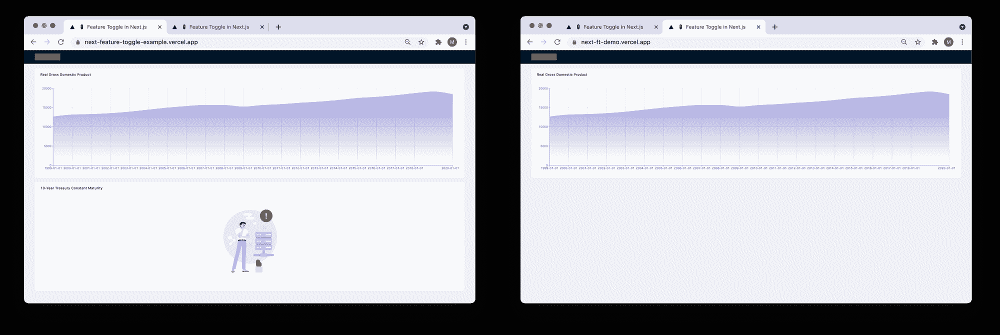
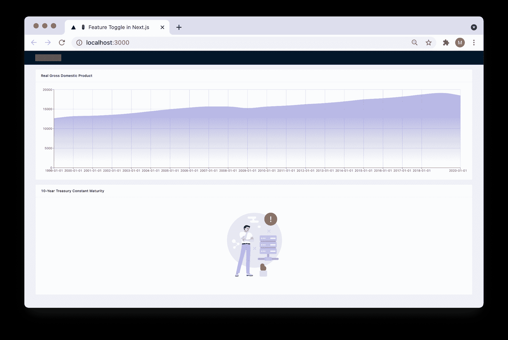
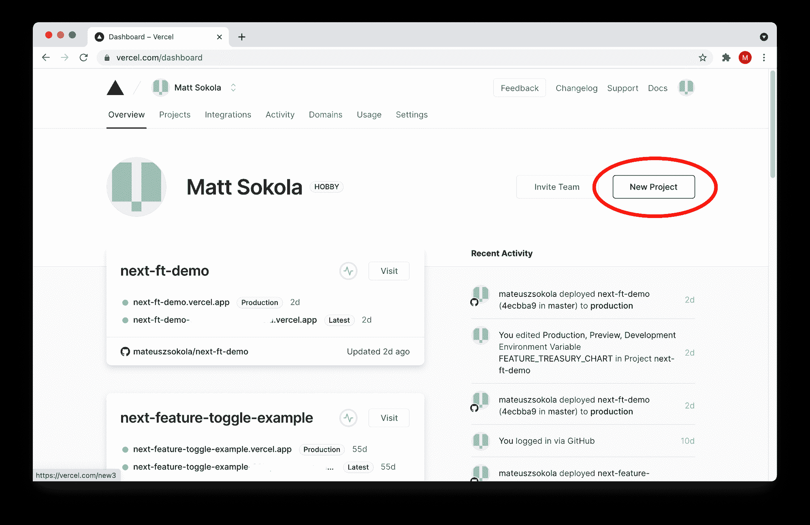
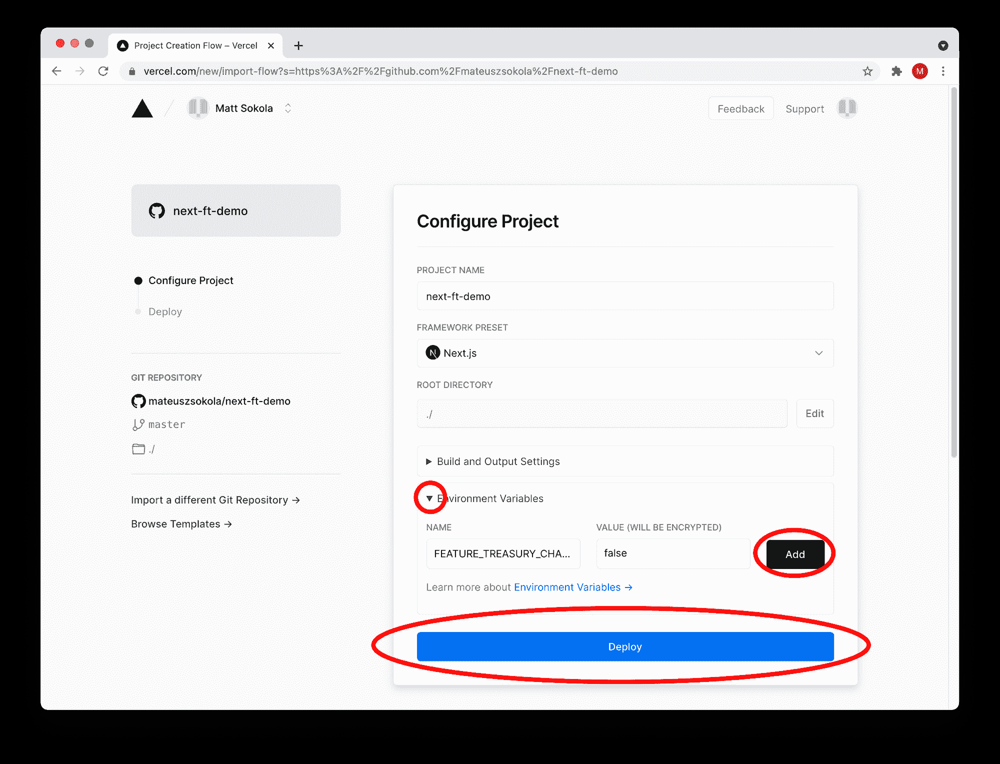
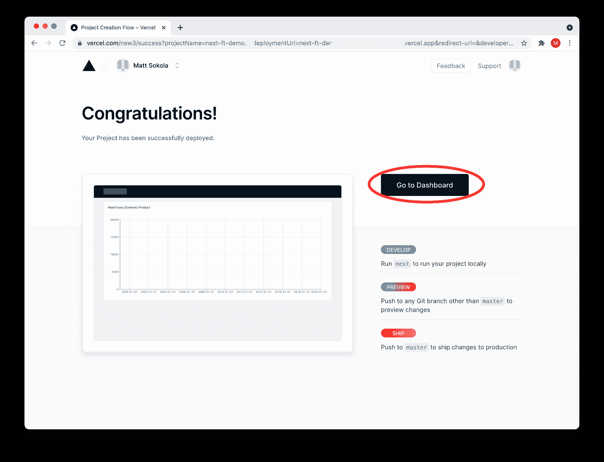
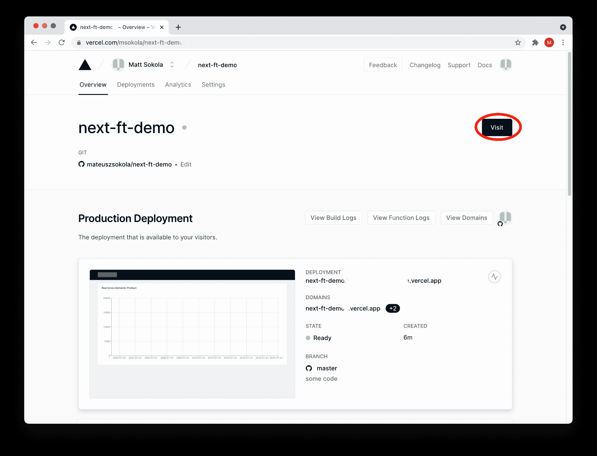
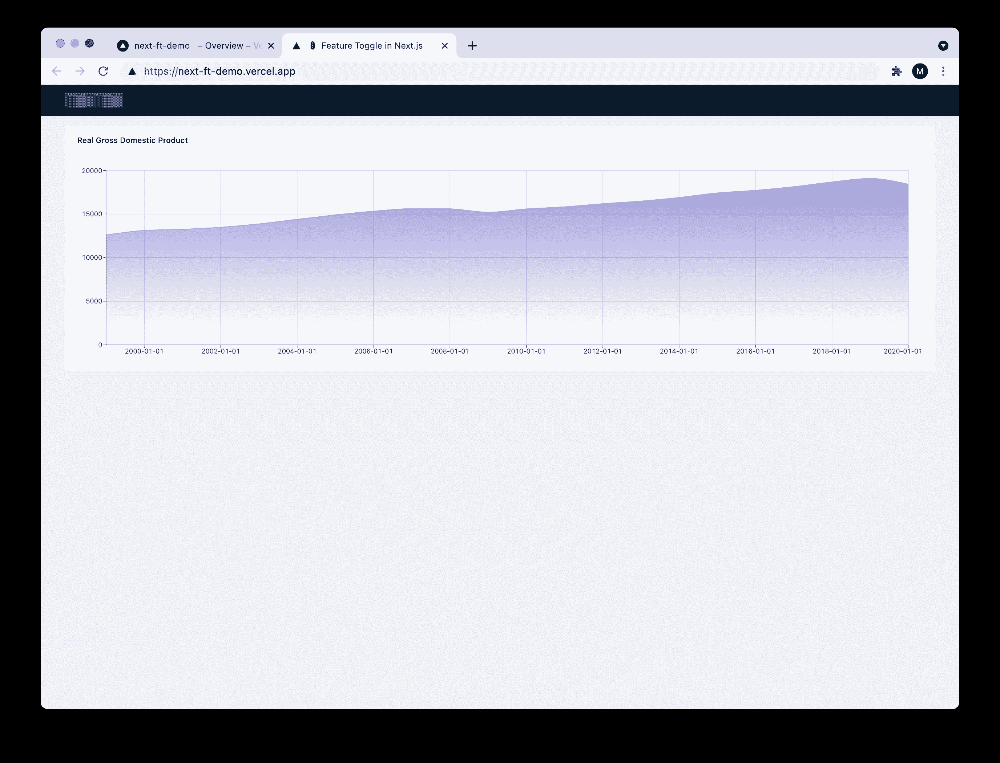
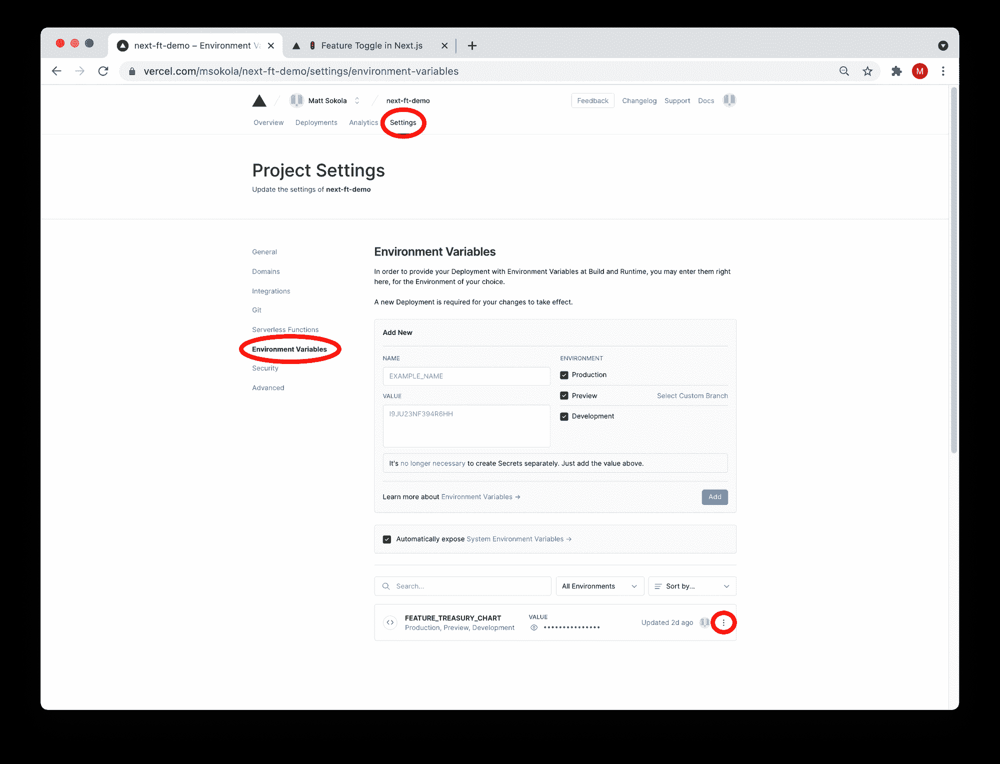
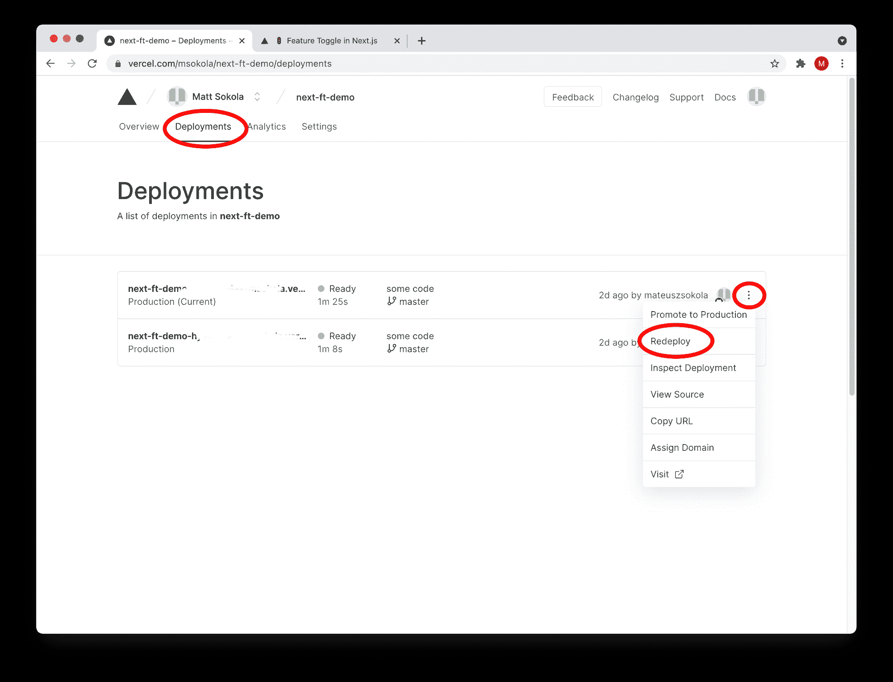
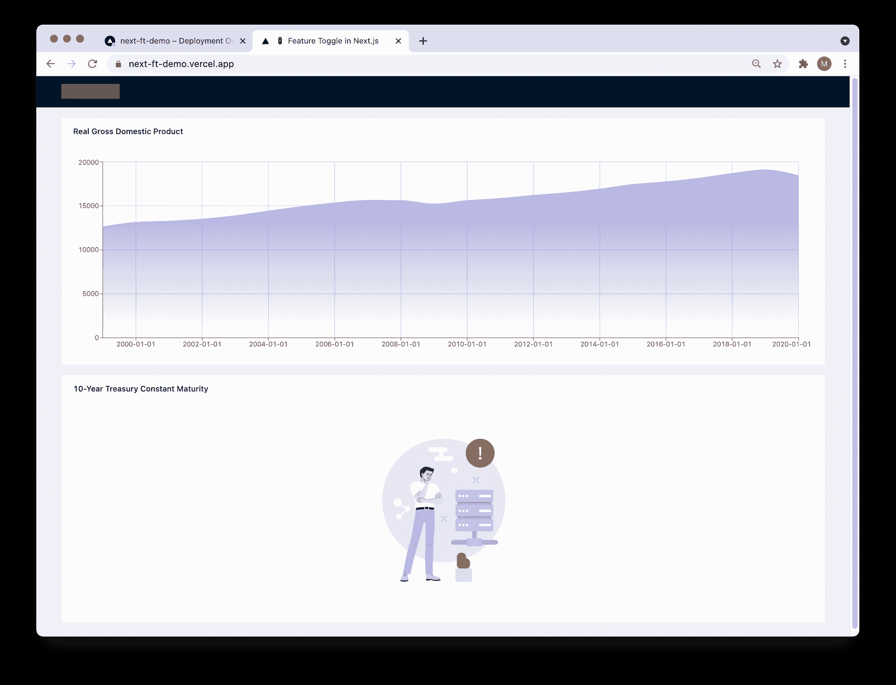

# 使用 Next.js 构建您自己的功能，并在 30 分钟内做出反应

> 原文：<https://www.freecodecamp.org/news/how-to-use-feature-toggles-in-next-js-and-react/>

这篇文章将向你展示如何在你的下一个。JS 应用。

我们将使用 Next。JS、React 和 TypeScript。我们将把我们的应用程序部署到 Vercel 来演示真实的例子。

你可以在最后的总结中找到 ********代号******** 和 ********视频******** 。

## **你将从这篇文章中学到什么**

在本文中，我们将深入探讨几个主题，例如:

*   什么是特征切换？
*   如何使用 React 的上下文 API
*   什么是环境变量，我们如何在应用程序中使用它们？
*   如何在 React 中构建自定义钩子？

## 什么是特征切换？

特性切换(也称为特性标志)是一种技术，它允许您在不修改代码的情况下改变应用程序的状态。

一开始，这听起来可能有点令人困惑，但让我们考虑以下场景:每年 12 月，许多公司都会更换他们的徽标，以增加一点节日气氛。也许他们想在商标上加上一顶圣诞老人的帽子或者某种雪人。

你有没有想过，他们是不是每年都换网站，只是为了更新 logo？不，在大多数情况下，他们只做一次，只是连接到他们的功能切换。因此，他们可以在需要时启用特殊徽标。

这里有另一个例子:想象一个遵循持续集成(CI)的开发团队。他们使用这种机制提交未完成的代码，然后将其合并到主分支上。未完成的代码在生产环境中被禁用，因此用户看不到未完成的功能。

请记住，这只是对成熟的开发团队来说是一个好主意，他们有经验丰富的开发人员，并对他们的 CI 管道进行自动化检查(比如自动化测试、静态代码分析、编译/捆绑等等)。

## **在我们开始之前**

本教程需要一些节点和反应的基础知识。在遵循本文的说明之前，您还应该知道如何使用 Git 和 GitHub。

我跳过了关于引导示例应用程序的部分，因为我在以前的一篇文章中展示了一个非常相似的过程。如果你不知道如何做到这一点，没关系——只需查看 freeCodeCamp 上的以下教程(它们是免费的！)在您开始遵循本文中的说明之前:

*   [针对初学者的 Git 和 Github](https://www.youtube.com/watch?v=RGOj5yH7evk)。
*   [Learn Node.js -初学者全教程](https://www.youtube.com/watch?v=RLtyhwFtXQA)。
*   学习 React -初学者的完整课程。
*   [如何在两个小时内构建一个全功能的无服务器应用](https://www.freecodecamp.org/news/how-to-build-a-serverless-app/)(可选)。

我为这篇文章创建了两个 GitHub 库。第一个包含应用程序的 scaffolder，因此您可以自己遵循教程的所有步骤。第二个是完成的应用程序，如果您只想看到最终结果，您可以将它部署到 Vercel，而无需编写任何代码。

*   [应用架子工(GitHub)。](https://github.com/mateuszsokola/next-feature-toggle-scaffolder)
*   [最终的 app，准备部署(GitHub)。](https://github.com/mateuszsokola/next-feature-toggle-example)

我们将使用 Next 构建示例应用程序。JS、React 和 Typescript。该应用程序的主要目的是显示两个财务图表。

第一个代表美国的国内生产总值，第二个显示了过去 10 年的国债到期量。

第二个还没完成。我们的目标是将它隐藏在特性开关之后，这样我们就可以在需要的时候启用它。

最终的应用程序应该是这样的:



你可以在这里找到它。

## **我们开始吧！**

我们需要从 GitHub 中克隆 scaffolder 存储库，我们可以通过在终端中键入以下命令来实现:

```
$ git clone git@github.com:mateuszsokola/next-feature-toggle-scaffolder.git
```

现在我们需要安装所需的依赖项并启动服务器。

```
$ cd next-feature-toggle-scaffolder
$ npm install
$ npm run dev

# COMMAND OUTPUT:
> next-feature-toggle-example@0.1.0 dev /Users/msokola/code/next-feature-toggle-scaffolder
> next dev

ready - started server on 0.0.0.0:3000, url: http://localhost:3000
info  - Using webpack 5\. Reason: no next.config.js https://nextjs.org/docs/messages/webpack5
event - compiled successfully
event - build page: /
wait  - compiling...
event - compiled successfully
```

现在您可以在浏览器中打开 [http://localhost:3000/](http://localhost:3000/) ，看到以下网站:



> 如果你想知道如何建立下一个？JS app 从零开始，你可以从[我的另一个教程这里](https://www.freecodecamp.org/news/how-to-build-a-serverless-app/)学习如何做。

现在，我们如何在这里实现特性切换机制呢？React 的上下文 API 似乎是最简单最合适的方式。

## 什么是 React 上下文 API？

React Context API 提供了一种整洁的方式，无需手动操作就可以通过多级组件传递数据。让我们看下面的例子:

```
<Page enabledFeatures={features} />
<PageLayout enabledFeatures={features} />
<NavigationBar enabledFeatures={features} />
<Link href="https://freecodecamp.org/news/">
  <Avatar enabledFeatures={features} />
</Link>
```

如果您不想使用上下文，您需要将数据作为属性传递给每个组件。这很容易出错，而且很麻烦。如果您决定使用上下文，您可以将数据直接注入到实际需要它的组件中。

现在我们可以为我们的特性切换创建一个上下文。我们需要创建一个名为`context/`的目录，并在这个目录中创建一个新文件。我们可以称之为`FeatureToggleContext.ts`。

```
mkdir context
cd context
touch FeatureToggleContext.ts
```

在 React 中创建上下文相当容易。您需要在文件中导入 React，并使用默认的上下文值调用`React.createContext`方法。请参见下面的示例:

```
// file: context/FeatureToggleContext.ts
import React from "react";

export const FeatureToggleContext = React.createContext({
    // TypeScript will have hard time to determine its type, 
    // if we don't cast this array to an array of strings.
    // Likely, we will end up with an array of never or any.
    enabledFeatures: [] as string[],
})
```

请记住，只有当组件没有包装到上下文提供者中时，才使用默认值。这只是一个后备方案，没有提供者就不应该使用它。

## 上下文提供程序组件

上下文附带了一个提供者组件，它允许消费组件监听上下文的变化。提供者组件接受一个`value`属性，您可以将它传递给作为该提供者的子组件的组件。

简而言之，如果我们想利用上下文，我们需要让提供者成为我们所有组件的父代。我决定将提供者包装成一个独立的组件，这样我们就不会弄乱应用程序的其他部分。

让我们在`components/`目录中创建一个名为`FeatureToggle.tsx`的新文件:

```
cd components
touch FeatureToggle.tsx
```

现在我们可以创建一个接受两个属性的组件:`children`和`enabledFeatures`。

`children`是应用程序的主要组件。如果你用`create-react-app`创建了一个 React 应用，你可能会注意到主要组件叫做`App`。下一个。JS 称之为`MyApp`，你可以在`pages/_app.tsx`文件中找到。

`enabledFeatures`是启用功能的数组。我们以后会用到它。

```
# file: compontents/FeatureToggle.tsx

import React from "react";
import { FeatureToggleContext } from "../context/FeatureToggleContext";

type Props = {
    children: any;
    enabledFeatures: string[];
}

export const FeatureToggle = ({ children, enabledFeatures }: Props) => {
    return (
        <FeatureToggleContext.Provider value={{ enabledFeatures }}>
            {children}
        </FeatureToggleContext.Provider>
    )
}
```

包装好的组件准备好了。现在我们需要把它挂在主组件上。让我们打开文件`pages/_app.tsx`。

我们只有一个可切换的特性——`treasury_chart`。我们需要将它添加到已启用功能的列表中。现在，我们将对这个列表进行软编码，并将其直接传递给提供者，以确认我们可以访问上下文。稍后，我们将为特性切换创建一个合适的 API。

我们需要修改该文件，如下所示:

```
import { FeatureToggle } from "../components/FeatureToggle";
import "../styles/globals.css";

function MyApp({ Component, pageProps }) {
  const enabledFeatures = ["treasury_chart"];

  return ( 
    <FeatureToggle enabledFeatures={enabledFeatures}>
      <Component {...pageProps} />
    </FeatureToggle>
  );
}

export default MyApp;
```

从技术上讲，现在整个应用程序中都有启用的特性列表。但是我们没有接口去消费它的价值。利用 React 钩子是暴露它的最好方法。

## 如何在 React 中创建自定义挂钩

我们基于 React 上下文 API 创建了这种机制，使用 React 上下文的最有效方式是使用钩子。所以我们需要创建一个钩子来提供对上下文中正确数据的简单访问。

让我们创建一个名为`hooks/`的新目录和一个名为`useFeatureToggle.ts`的新文件。

```
mkdir hooks
touch useFeatureToggle.ts
```

让我们考虑一下钩子。我们想要检查给定特性的状态。如果特征被激活，我们将渲染它，否则我们不渲染。所以钩子应该返回一个助手来检查所请求的特性是否在已启用特性的列表中，对吗？我们来编码吧。

```
# file: hooks/useFeatureToggle.ts

import React, { useContext } from "react";
import { FeatureToggleContext } from "../context/FeatureToggleContext";

export const useFeatureToggle = () => {
	// we need to read values defined in the FeatureToggleContext. 
    // In this case, we'll take only the array of enabled features.
    const { enabledFeatures } = useContext(FeatureToggleContext);

    const isEnabled = (featureName: string) => {
        return enabledFeatures.includes(featureName);
    }

	// For consistency, We return an array of helpers, 
    // so we follow the pattern defined by the useState hook.
    // It makes the code open for extensions, 
    // so no need to refactor the app when a new helper is added here.
    return [
        isEnabled,
    ];
}
```

钩子准备好了。我们可以打开主页，将资金图表连接到功能开关中。

我们来开`pages/index.tsx`。

我们将使用我们的自定义钩子来访问`isEnabled`助手，并使用它来检查该特性是否被启用。

```
const [isEnabled] = useFeatureToggle();

// ... 

return (
	/* ... */
    {isEnabled("treasury_chart") && (<TreasuryChart />)}
    /* ... */
);
```

完整的实现如下所示:

```
# file: pages/index.tsx

import React from "react";
import Head from "next/head";
import { Layout } from "antd";

import { GdpChart, TreasuryChart } from "../components/Charts";
import { useFeatureToggle } from "../hooks/useFeatureToggle";

const { Header, Content } = Layout;

export default function Home() {
  const [isEnabled] = useFeatureToggle();
  return (
    <Layout className="layout">
      <Head>
        <title>🚦 Feature Toggle in Next.js</title>
      </Head>
      <Header>
        <div className="logo" />
      </Header>
      <Content className="content">
        <GdpChart />
        {isEnabled("treasury_chart") && (<TreasuryChart />)}
      </Content>
    </Layout>
  );
} 
```

现在，您可以在浏览器中试用该应用程序。请记住，您仍然会看到第二个图表。

您可以随意使用赋予`isEnabled`助手的特性名称。例如，你可以打个错字，然后图表就会消失。

不幸的是，这个解决方案没有给我们在不修改代码库的情况下切换特性的灵活性。每当我们想要改变特性的状态时，我们将需要修改已启用特性的列表。我们如何解决这个问题？

在不改变代码的情况下使其可切换的最简单的方法是实现一个 API，它从环境变量中读取特性的状态，并返回一个活动特性的数组。

## 如何在节点中使用环境变量

环境变量的值是在应用程序外部设置的，通常由操作系统内置的功能来设置。这是 Node。JS 在我们的情况下。

让我们在项目中创建一个`.env`文件。

```
touch .env
```

现在，我们可以打开这个文件并添加一个新变量。我们可以称之为`FEATURE_TREASURY_CHART`。我们需要将其值设置为`false`。

```
# file: .env
FEATURE_TREASURY_CHART=false
```

如果我们使用`.env`变量，我们将需要使用 Next 的一些服务器特性。JS，并定义一个新的 API。这意味着我们需要编写更多的代码。

所以我们需要在`pages/api/`目录下创建一个新文件。姑且称之为`features.ts`。

API 将返回一组已启用的特性。

```
// file: pages/api/features.ts

export default (req, res) => {
    res.status(200).json([
    	// Your environment variables are available within the `process.env` object.
    	// IMPORTANT! All environment variable values are strings. 
        // So we cannot compare them with booleans, numbers and so on.
        process.env.FEATURE_TREASURY_CHART === "true" ? "treasury_chart" : "",
    ])
}
```

现在，您可以尝试在浏览器中打开[http://localhost:3000/API/features](http://localhost:3000/api/features)，您应该会收到以下输出:

```
[""]
```

`treasury_chart`未被添加到启用功能列表中，因为它已被禁用。您可以将`FEATURE_TREASURY_CHART`变量更改为`true`，并重启您的服务器进行测试。

## 如何使用特性 API

我们很好地将应用程序的反应部分连接到我们全新的 API。在此之前，我们需要安装`axios`。

Axios 将帮助我们以比`fetch`更便捷的方式进行 HTTP 请求。它支持错误处理和开箱即用的类型。我们不需要自己实现它，所以我们可以直接进入正题。你可能需要点击`Control + C`来关闭你的服务器。两次。

```
$ npm install --save axios
```

让我们创建一个名为`services/`的新目录和一个名为`FeatureToggle.ts`的新文件。

现在我们需要使用一个标准的异步函数向我们的 API 发出 GET 请求。

```
// File: services/FeatureToggle.ts

import axios from "axios";

export const fetchFeatures = async () => {
    try {
        const { data } = await axios.get<string[]>("/api/features");

        return data;
    }
    catch(e) {
        console.log("Something went wrong");
    }

    return [] as string[];
}
```

好的。功能 API 请求已准备好。我们实际上可以在主组件上触发这个函数。

打开文件`pages/_app.tsx`。

我们需要像 React 中的其他 API 一样，使用`useEffect`和`useState`钩子发出一个 API 请求。我们需要将以下代码片段添加到`MyApp`组件中:

```
 const [enabledFeatures, setFeatures] = useState<string[]>([]);

  const processFeatures = async () => {
    const features = await fetchFeatures();

    setFeatures(features);
  }

  useEffect(() => {
    processFeatures();
  }, []);
```

完整的解决方案在这里:

```
// file: pages/_app.tsx

import { useEffect, useState } from "react";
import { FeatureToggle } from "../components/FeatureToggleProvider";
import { fetchFeatures } from "../services/FeatureToggle";
import "../styles/globals.css";

function MyApp({ Component, pageProps }) {
  const [enabledFeatures, setFeatures] = useState<string[]>([]);

  const processFeatures = async () => {
    const features = await fetchFeatures();

    setFeatures(features);
  }

  useEffect(() => {
    processFeatures();
  }, []); // eslint-disable-line react-hooks/exhaustive-deps

  return (
    <FeatureToggle enabledFeatures={enabledFeatures}>
      <Component {...pageProps} />
    </FeatureToggle>
  )
}

export default MyApp; 
```

万岁！我们完成了编码。最后一步是部署我们的应用程序。

## 如何在 Vercel 上发布应用程序

我们将[将应用程序部署到 Vercel](https://vercel.com/) 上，因为他们为应用程序提供免费托管，并允许我们设置自定义环境变量，这对我们来说至关重要。

像往常一样，我将跳过创建新帐户的过程。你可以使用你的 GitHub 或 Google 帐户一键创建一个。

注册后，您应该会看到这个屏幕。点击 **新建项目** 按钮:



现在您需要选择想要导入的 GitHub 存储库。在我的例子中，它是“ *next-ft-demo* ”，但你也可以称它为别的东西。如果你没有看到你的资源库，你需要点击 **调整 GitHub App 权限** (下面标有红色椭圆的链接):


我们需要配置项目。让我们打开 **环境变量** ，添加一个名为`FEATURE_TREASURY_CHART`的新变量，并将其值设置为`false`。然后点击 **添加** 按钮，并点击 **部署** :



现在正在部署应用程序。完成后，您应该会看到以下屏幕。只需点击“*转到仪表板*按钮:



您可以通过点击“*访问*按钮打开您的应用程序:



应用程序仅显示一个图表:



如果要启用财资图，需要选择“*设置*选项卡，选择“*环境变量*部分，将`FEATURE_TREASURY_CHART`变量设置为`true`:



现在我们需要重新部署应用程序来加载新的变量。



部署完成后，您将在网站上看到资金图表:



## **总结**

这是特性切换的一个简单实现。你可能需要调整它来适应你的需要。但我认为这是一个很好的起点，你可以以此为基础。

如果你有关于如何改进我的解决方案的想法，或者你想向我们展示另一种方法，请在 freeCodeCamp 论坛或下面 YouTube 视频的评论部分分享它(我会回复每一条评论)。

[https://www.youtube.com/embed/H9Tx5SqWX9o?feature=oembed](https://www.youtube.com/embed/H9Tx5SqWX9o?feature=oembed)

如果你觉得这个视频有用，如果你点击“喜欢”按钮并订阅，它对我来说就是整个世界。

********你可以在 ****GitHub******** 上找到所有的代码**:**

*   [应用架子工与 Next.JS.](https://github.com/mateuszsokola/next-feature-toggle-scaffolder)
*   最后一个应用程序与下一个。JS，准备部署到 Vercel。

如果你有任何问题，你可以在推特上给我发消息: [@msokola](https://twitter.com/msokola)

我希望你喜欢它，并有一个伟大的一天:)