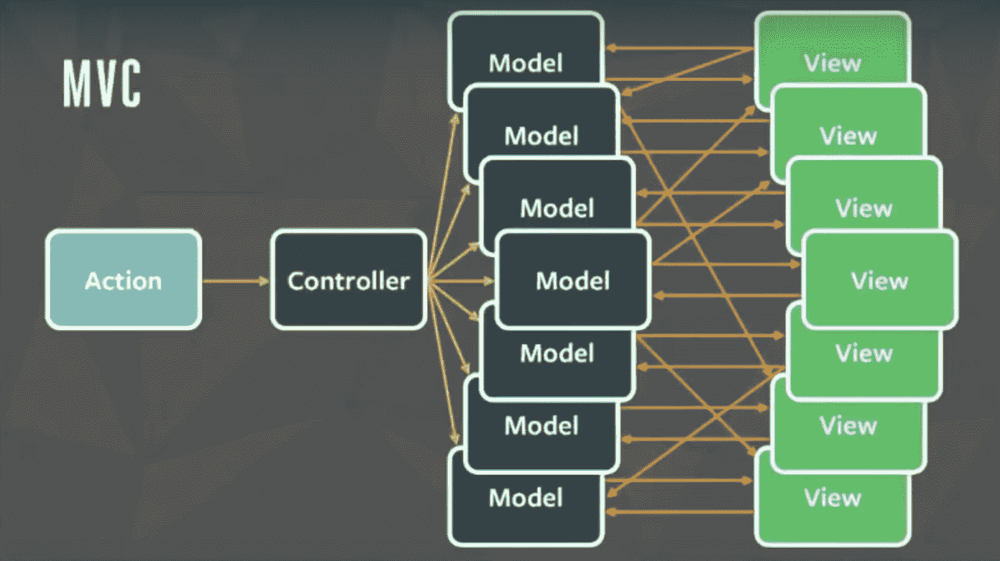
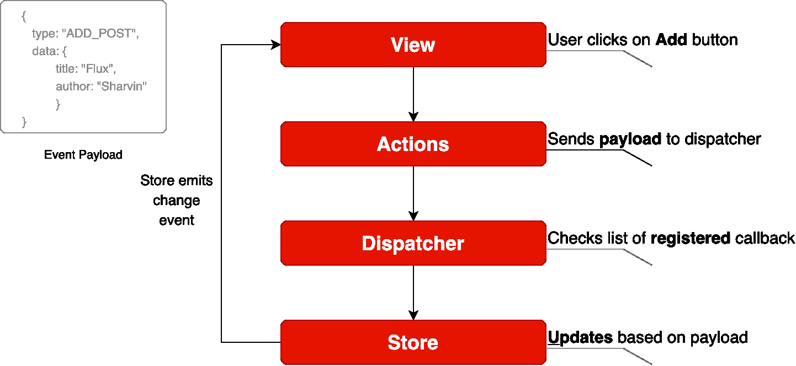
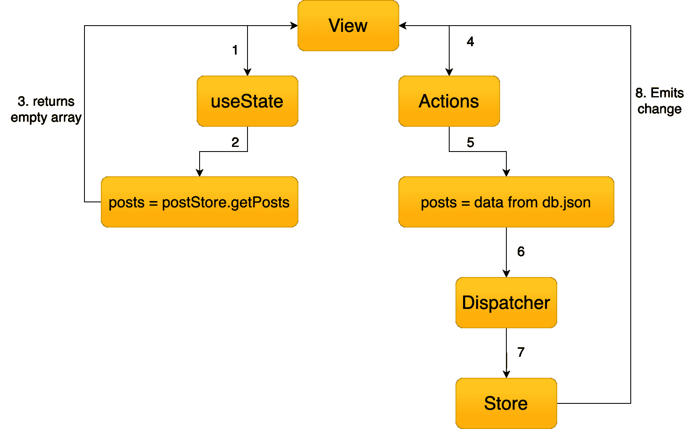

# 如何使用 Flux 管理 ReactJS 中的状态——用一个例子说明

> 原文：<https://www.freecodecamp.org/news/how-to-use-flux-in-react-example/>

如果您最近才开始使用 ReactJS，那么您可能想知道如何在 React 中管理状态，以便您的应用程序可以伸缩。

为了解决这个状态管理问题，许多公司和个人已经开发了各种解决方案。开发 ReactJS 的脸书提出了一个解决方案，叫做[](https://facebook.github.io/flux/)**。**

**你可能听说过 **Redux** 如果你从事过前端技术，比如 **AngularJS** 或者 **EmberJS** 。ReactJS 也有一个实现 Redux 的库。**

**但是在学习 Redux 之前，我会建议你去了解 Flux 并理解它。之后给 Redux 一个尝试。我这样说是因为 Redux 是 Flux 的更高级版本。如果 Flux 的概念很清楚，那么你可以学习 redux 并将其集成到你的应用程序中。**

## **什么是通量？**

**Flux 使用**单向数据流模式**来解决状态管理的复杂性。请记住，它不是一个框架——更确切地说，它是一个旨在解决状态管理问题的模式。**

**你想知道现有的 MVC 框架有什么问题吗？想象一下您客户的应用程序向上扩展。您可以在许多模型和视图之间进行交互。看起来怎么样？**

**

Credit: Image from Facebook F8 Flux Event** 

**组件之间的关系变得复杂。很难扩展应用程序。脸书面临着同样的问题。为了解决这个问题，他们设计了一个**单向数据流**。**

**

Credit: Image from Facebook's Flux Doc** 

**从上图可以看出，Flux 中使用了很多组件。让我们逐一检查所有组件。**

****视图:**这个组件渲染 UI。每当有任何用户交互发生时(比如一个事件)，它就会触发动作。此外，当商店通知视图发生了一些变化时，它会重新呈现自己。例如，如果用户点击**添加**按钮。**

****动作:**处理所有的事件。这些事件由视图组件传递。这一层通常用于进行 API 调用。一旦动作完成，就使用调度程序进行调度。操作可以是添加帖子、删除帖子或任何其他用户交互。**

**用于分派事件的有效负载的常见结构如下:**

```
`{
	actionType: "",
    data: {
        title: "Understanding Flux step by step",
        author: "Sharvin"
    }
}`
```

**actionType 键是必需的，调度程序使用它将更新传递给相关的存储。使用常量来保存 actionType 键的值名称也是一种已知的做法，这样就不会出现输入错误。数据保存了我们希望从动作发送到存储的事件信息。此项的名称可以是任何名称。**

****Dispatcher:** 这是中心 hub 和 singleton 注册表。它将有效负载从 Actions 分派到 Store。还确保在向商店分派操作时没有级联效果。它确保在数据层完成处理和存储操作之前没有其他动作发生。**

**考虑这个组件在系统中有一个流量控制器。这是一个集中的回调列表。它调用回调并广播它从动作中收到的有效负载。**

**由于这个组件，数据流是可预测的。每个操作都用向调度程序注册的回调来更新特定的存储。**

****Store:** 这个保存 app 状态，是这个模式的一个数据层。不要认为它是来自 MVC 的模型。一个应用程序可以有一个或多个应用程序商店。存储得到更新，因为它们有一个使用 dispatcher 注册的回调。**

**节点的事件发射器用于更新存储并将更新广播给视图。视图从不直接更新应用程序状态。由于商店的变化，它被更新。**

**这只是 Flux 可以更新数据的一部分。商店中实现的接口如下:**

1.  ****EventEmitter** 被扩展以通知视图存储数据已经被更新。**
2.  **添加了类似于 **addChangeListener** 和 **removeChangeListener** 的监听器。**
3.  ****emitChange** 用于发出变更。**

**考虑上面有更多商店和视图的图表。尽管如此，模式和数据流将是相同的。这是因为这是单向和可预测的数据流，不像 MVC 或双向绑定。这提高了**数据的一致性**，并且**更容易发现 bug** 。**

**

Flux Data Flow** 

**在**单向数据流的帮助下，Flux 为表带来了以下主要好处:****

1.  **代码变得非常清晰易懂。**
2.  **使用单元测试很容易测试。**
3.  **可以构建可扩展的应用程序。**
4.  **可预测的数据流。**

> *****注意:**Flux 的唯一缺点是我们需要编写一些样板文件。除了样板文件，在向现有应用程序添加组件时，我们几乎不需要编写代码。***

## **应用程序模板**

**为了学习如何在 ReactJS 中实现 flux，我们将构建一个帖子页面。在这里，我们将显示所有的职位。应用程序模板在这个[提交](https://github.com/Sharvin26/DummyBlog/tree/0d56987b2d461b794e7841302c9337eda1ad0725)时可用。我们将使用它作为模板，在其上集成通量。**

**要从该提交中克隆代码，请使用以下命令:**

```
`git clone  https://github.com/Sharvin26/DummyBlog.git`
```

```
`git checkout 0d56987b2d461b794e7841302c9337eda1ad0725`
```

**我们需要一个 **react-router-dom** 和 **bootstrap** 模块。要安装这些软件包，请使用以下命令:**

```
`npm install react-router-dom@5.0.0 bootstrap@4.3.1` 
```

**完成后，您将看到以下应用程序:**

**

DummyBlog** 

**为了详细理解 Flux，我们将只实现 **GET** posts 页面。一旦完成，你就会意识到这个过程对于**发布**、**编辑**和**删除**都是一样的。**

**在这里，您将看到以下目录结构:**

```
`+-- README.md 
+-- package-lock.json
+-- package.json
+-- node_modules
+-- .gitignore
+-- public
|   +-- index.html
+-- src
|   +-- +-- components
|   +-- +-- +-- common
|   +-- +-- +-- +-- NavBar.js
|   +-- +-- +-- PostLists.js
|	+-- +-- pages
|   +-- +-- +-- Home.js
|   +-- +-- +-- NotFound.js
|   +-- +-- +-- Posts.js
|   +-- index.js
|   +-- App.js
|   +-- db.json`
```

> ****注意:**我们在这里添加了一个`db.json`文件。这是一个伪数据文件。因为我们不想构建 API，而是专注于 Flux，所以我们将从这个文件中检索数据。**

**我们的应用程序的基本组件是`index.js`。这里我们使用 **render** 和 **getElementById** 方法渲染了公共目录下`index.html`中的`App.js`。`App.js`用于配置路线。**

**我们还在另一个组件的顶部添加了 **NavBar** 组件，这样所有组件都可以使用它。**

**在**页面**目录中，我们有 3 个文件= > `Home.js`、`Posts.js`和`NotFound.js`。`Home.js`只是用来显示 Home 组件。当用户路由到一个不存在的网址，然后`NotFound.js`渲染。**

**`Posts.js`是父组件，用于从`db.json`文件中获取数据。它将这些数据传递给**组件**目录下的`PostLists.js`。这个组件是一个哑组件，它只处理 UI。它从其父组件(`Posts.js`)中获取数据作为道具，并以卡片的形式显示出来。**

**现在我们已经清楚了我们的博客应用程序是如何工作的，我们将开始在它的基础上集成 Flux。**

## **积分通量**

**使用以下命令安装 Flux:**

```
`npm install flux@3.1.3`
```

**为了将 Flux 整合到我们的应用中，我们将本节分为 4 小节:**

1.  **分配器**
2.  **行动**
3.  **商店**
4.  **视角**

**注意:完整的代码可以从这个[库](https://github.com/Sharvin26/DummyBlog)获得。**

### **分配器**

**首先，在 **src** 目录下创建两个名为 **actions** 和 **stores** 的新文件夹。之后，在同一个 src 目录下创建一个名为`appDispatcher.js`的文件。**

****注意:**从现在开始，所有与 Flux 相关的文件都将有**驼色外壳**，因为它们不是 ReactJS 组件。**

**转到`appDispatcher.js`并复制粘贴以下代码:**

```
`import { Dispatcher } from "flux";
const dispatcher = new Dispatcher();
export default dispatcher;` 
```

**这里我们从我们安装的 flux 库中导入 Dispatcher，创建一个新对象并导出它，以便我们的 actions 模块可以使用它。**

### **行动**

**现在转到**动作**目录，创建两个名为`actionTypes.js`和`postActions.js`的文件。在`actionTypes.js`中，我们将定义`postActions.js`和存储模块中需要的常量。**

**定义常量背后的原因是我们不想犯错别字。您不必定义常数，但这通常被认为是一种好的做法。**

```
`// actionTypes.js

export default {
    GET_POSTS: "GET_POSTS",
};` 
```

**现在在`postActions.js`中，我们将从`db.json`中检索数据，并使用 dispatcher 对象来调度它。**

```
`//postActions.js

import dispatcher from "../appDispatcher";
import actionTypes from "./actionTypes";
import data from "../db.json";

export function getPosts() {
    dispatcher.dispatch({
        actionTypes: actionTypes.GET_POSTS,
        posts: data["posts"],
    });
}` 
```

**在上面的代码中，我们导入了 dispatcher 对象、actionTypes 常量和数据。我们使用 dispatcher 对象的 dispatch 方法将数据发送到存储。在我们的例子中，数据将以下列格式发送:**

```
`{
	actionTypes: "GET_POSTS",
    posts: [
        {
            "id": 1,
            "title": "Hello World",
            "author": "Sharvin Shah",
            "body": "Example of blog application"
        },
        {
            "id": 2,
            "title": "Hello Again",
            "author": "John Doe",
            "body": "Testing another component"
        }
    ]
}`
```

### **商店**

**现在我们需要构建一个存储，它将作为存储文章的数据层。它将有一个**事件监听器**来通知视图发生了变化，并且**将使用 dispatcher 注册**来获取数据。**

**转到存储目录并创建一个名为`postStore.js`的新文件。现在首先，我们将从事件包中导入 **EventEmitter** 。默认情况下，它在 NodeJS 中可用。我们还将在这里导入 dispatcher 对象和 actionTypes 常量文件。**

```
`import { EventEmitter } from "events";
import dispatcher from "../appDispatcher";
import actionTypes from "../actions/actionTypes";` 
```

**我们将声明 **change** 事件的常量和一个变量，以便在调度程序通过它时保存帖子。**

```
`const CHANGE_EVENT = "change";
let _posts = [];`
```

**现在我们将编写一个扩展 **EventEmitter** 作为其基类的类。我们将在这个类中声明以下方法:**

**`addChangeListener`:使用了的节点 **EventEmitter.on。它添加了一个接受回调函数的更改侦听器。****

**`removeChangeListener`:使用 NodeJS**event emitter . remove listener**T3。每当我们不想听某个特定的事件时，我们就用下面的方法。**

**`emitChange`:使用 NodeJS**event emitter . emit**T3。每当任何变化发生，它就散发出那种变化。**

**这个类也有一个名为`getPosts`的方法，它返回我们在这个类上面声明的变量`_posts`。**

**在变量声明下添加以下代码:**

```
`class PostStore extends EventEmitter {
    addChangeListener(callback) {
        this.on(CHANGE_EVENT, callback);
    }

    removeChangeListener(callback) {
        this.removeListener(CHANGE_EVENT, callback);
    }

    emitChange() {
        this.emit(CHANGE_EVENT);
    }

    getPosts() {
        return _posts;
    }
}`
```

**现在创建 PostStore 类的`store`对象。我们将导出这个对象，以便在视图中使用它。**

```
`const store = new PostStore();`
```

**之后，我们将使用 dispatcher 的 **register** 方法从我们的 Actions 组件接收有效负载。**

**为了注册特定的事件，我们需要使用`actionTypes`值，确定发生了哪个动作，并相应地处理数据。在对象声明下添加以下代码:**

```
`dispatcher.register((action) => {
    switch (action.actionTypes) {
        case actionTypes.GET_POSTS:
            _posts = action.posts;
            store.emitChange();
            break;
        default:
    }
});`
```

**我们将从该模块中导出对象，以便其他人可以使用它。**

```
`export default store;`
```

### **视角**

**现在我们将更新我们的视图，每当我们的 Posts 页面被加载并从 postStore 接收有效负载时，就将事件发送到`postActions`。转到**页面**目录下的`Posts.js`。您将在 **useEffect** 方法中找到以下代码:**

```
`useEffect(() => {
	setposts(data["posts"]);
}, []);`
```

**我们将改变 useEffect 读取和更新数据的方式。首先，我们将使用 postStore 类中的`addChangeListener`方法，并向它传递一个`onChange`回调。我们将把`posts` 状态值设置为具有来自`postStore.js`文件的`getPosts`方法的返回值。**

**开始时，存储将返回一个空数组，因为没有可用的数据。所以我们将从`postActions.js`中调用一个`*getPosts*` 方法。该方法将读取数据并将其传递给存储。然后，商店将发出更改，`addChangeListener`将监听该更改，并在其`onChange`回调中更新`posts`的值。**

**如果这看起来很混乱，不要担心，看看下面的流程图，它会更容易理解。**

****

**删除旧代码并更新`Posts.js`中的以下代码:**

```
`import React, { useState, useEffect } from "react";
import PostLists from "../components/PostLists";
import postStore from "../stores/postStore";
import { getPosts } from "../actions/postActions";

function PostPage() {
    const [posts, setPosts] = useState(postStore.getPosts());

    useEffect(() => {
        postStore.addChangeListener(onChange);
        if (postStore.getPosts().length === 0) getPosts();
        return () => postStore.removeChangeListener(onChange);
    }, []);

    function onChange() {
        setPosts(postStore.getPosts());
    }

    return (
        <div>
            <PostLists posts={posts} />
        </div>
    );
}

export default PostPage;` 
```

**在这里你会发现我们也移除了导入，并且我们在回调中使用了`setPosts`而不是 useEffect 方法。`return () => postStore.removeChangeListener(onChange);`用于在用户离开页面时删除监听器。**

**有了这个，进入博客页面，你会发现我们的博客应用程序正在工作。唯一的区别是，现在我们不是在 **useEffect** 方法中读取数据，而是在动作中读取数据，将其存储在存储中，并将其发送给需要它的组件。**

**当使用实际的 API 时，您会发现应用程序从 API 加载一次数据，并将其存储在存储中。当我们再次访问同一个页面时，您会发现不再需要 API 调用。你可以在 Chrome 开发者控制台的 source 标签下进行监控。**

**我们完事了。！我希望这篇教程能让 Flux 的概念更加清晰，并且你能在你的项目中使用它。**

> **请随时在 [Twitter](https://twitter.com/sharvinshah26) 和 [Github](https://github.com/Sharvin26) 上联系我。**