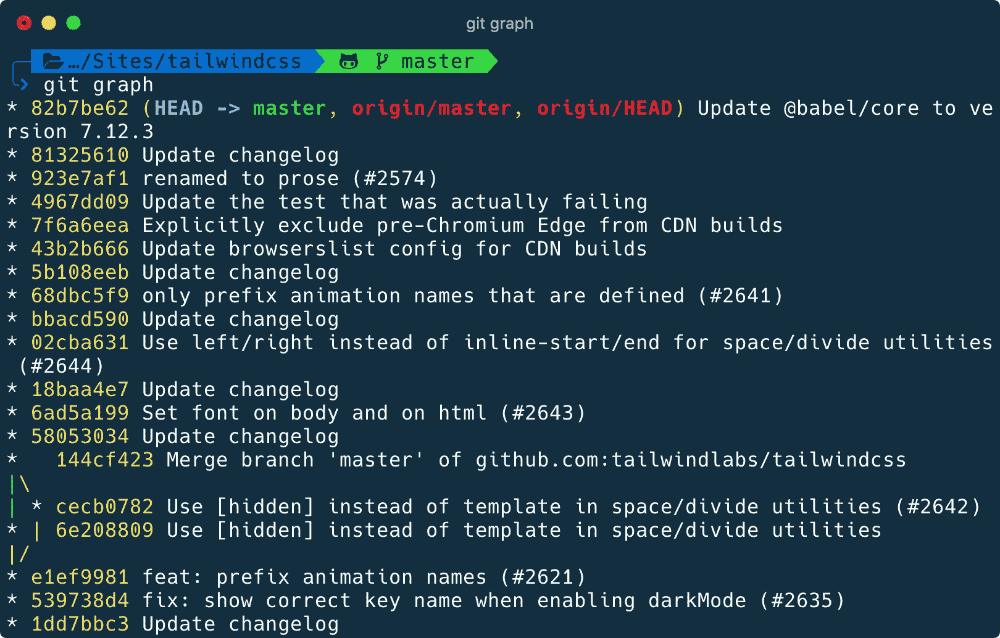
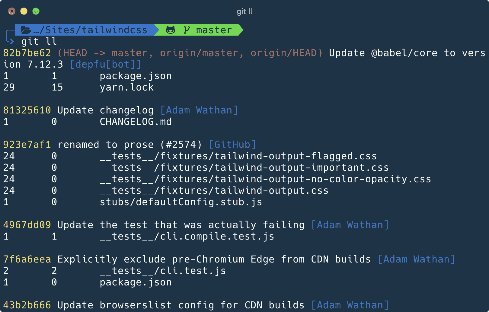

# 如何使用 Git 别名来提高您的生产力

> 原文：<https://www.freecodecamp.org/news/how-to-use-git-aliases/>

Git 是一个非常强大的工具，有时会有点吓人。不管你用了多久，你都会发现自己在搜索“如何做 X”。

今天我想谈谈别名。别名是简短的定制命令，可以翻译成其他命令。除了保存击键之外，别名还可以帮助您避免记忆命令选项或挖掘 shell 历史来查找您需要的命令。

别名有 2 种: [Git 别名](https://git-scm.com/book/en/v2/Git-Basics-Git-Aliases)和 shell 别名，由 bash、zsh 等控制。让我们从 Git 别名开始。

## 如何创建 Git 别名

Git 别名可以全局存储，也可以存储在单独的存储库中。除非您有非常具体的理由将别名限制在项目范围内，否则我建议您编辑位于`~/.gitconfig`的全局配置文件。

别名住在`[alias]`段。它们在您的终端中作为 Git 选项可用，与`add`、`commit`和其他选项的工作方式相同。让我们看一下如何一步一步地添加别名:

首先，打开 Git 配置文件。在我的例子中，我将使用 VS 代码:

```
code ~/.gitconfig 
```

接下来，让我们添加第一个 Git 别名:

```
[alias]
	graph = log --oneline --graph --decorate 
```

保存文件后，转到现有的 Git 项目并执行`git graph`。结果类似于下图:



现在您可以使用`git graph`并获得相同的结果，而不是键入`git log --oneline --graph --decorate`并记住所有三个标志。

## 我最喜欢的 Git 别名

以下是我最近经常使用的一些别名:

```
[alias]
	graph = log --oneline --graph --decorate
	ls = log --pretty=format:"%C(yellow)%h%Cred%d\\ %Creset%s%Cblue\\ [%cn]" --decorate
	ll = log --pretty=format:"%C(yellow)%h%Cred%d\\ %Creset%s%Cblue\\ [%cn]" --decorate --numstat
	lds = log --pretty=format:"%C(yellow)%h\\ %ad%Cred%d\\ %Creset%s%Cblue\\ [%cn]" --decorate --date=short
	conflicts = diff --name-only --diff-filter=U
	local-branches = !git branch -vv | cut -c 3- | awk '$3 !~/\\[/ { print $1 }'
	recent-branches = !git branch --sort=-committerdate | head
	authors = !git log --format='%aN <%aE>' | grep -v 'users.noreply.github.com' | sort -u --ignore-case 
```

`graph`、`ls`、`ll`、`lds`对历史可视化很有用。我经常使用`git ll`,因为它给了我提交、更改的文件以及修改了多少行，如下所示:



返回一个冲突列表，你可以在你的编辑器中复制并粘贴。

`local-branches`返回本地可用的分支列表，而不是原始分支(例如 GitHub)。例如，如果您需要仔细检查您的团队是否有权访问您的分支机构，这将非常有用。

`recent-branches`大概是这个列表里我用的最多的一个。如果你同时在不同的特性中工作，并且从一个分支跳到另一个分支，这是必须的。

对于开源工作来说很方便。您可以运行`git authors > AUTHORS.txt`并查看在存储库中工作过的人员列表。

## Shell 别名与 Oh My Zsh Git 插件

你可能认为上面的列表很小。的确如此。这是因为我还使用了由我的 Zsh Git 插件创建的别名。

> 哦，我的 zsh 是一个管理你的 Zsh 配置的框架。使用这个工具，您可以定制 shell 提示符，使用不同的主题，并添加提供别名的插件来提高您的工作效率。

Shell 别名的创建方式略有不同。它们存在于 shell 配置文件中(如果您分别使用 Bash 和 Zsh，通常是`~/.bashrc`或`~/.zshrc`)。

下面是插件创建的一个例子:

```
alias gst='git status' 
```

如果您不使用 Oh My Zsh，您仍然可以复制上面的行并将其粘贴到`~/.bashrc`或`~/.zshrc`文件的末尾 shell 别名也可以。

我没有为`status`设置 Git 别名`st`，而是使用 shell 别名`gst`,它给出了相同的结果。

相比 Git 别名，我更喜欢 shell 别名，原因有二:

1.  Shell 别名不需要以命令`git`为前缀。
2.  我不需要维护别名列表，因为我可以学习由 Oh My Zsh 社区维护的别名。

> Protip:如果你使用默认外壳而没有任何定制，我建议你去看看[My Zsh](https://github.com/ohmyzsh/ohmyzsh/)项目和[Wes Bos](https://wesbos.com/)‘[命令行用户](https://commandlinepoweruser.com/)。

## 结论

别名是快捷方式，您可以创建或使用它来提高工作效率。今天我展示了在 Git 中使用它们的两种方法。

我希望这篇文章能启发你重新想象如何使用终端。开始创建自己的别名怎么样？

你可以在我的博客上阅读更多类似的文章。如果你喜欢这个内容，可以在 [Twitter](https://twitter.com/leozera) 和 [GitHub](https://github.com/leonardofaria) 关注我。

封面照片由 [Yancy Min/Unsplash 拍摄](https://unsplash.com/photos/842ofHC6MaI)