# 如何使用 Github 操作将 Next.js 网站部署到 AWS S3

> 原文：<https://www.freecodecamp.org/news/how-to-use-github-actions-to-deploy-a-next-js-website-to-aws-s3/>

Next.js 和静态 web 应用的美妙之处在于，它们让你可以在任何使用对象存储的地方运行项目，比如在 AWS S3 上。但是每次手动更新这些文件是很痛苦的。

我们如何使用 GitHub Actions 将我们的应用程序自动化并持续部署到 S3？

*   [什么是 GitHub 动作？](#what-are-github-actions)
*   [什么是持续部署？](#what-is-continuous-deployment)
*   我们要建造什么？
*   [步骤 0:在 GitHub 上建立一个新的 Next.js 项目](#step-0-setting-up-a-new-next-js-project-on-github)
*   [步骤 1:手动创建 Next.js 项目并将其部署到新的 S3 存储桶](#step-1-manually-creating-and-deploying-a-next-js-project-to-a-new-s3-bucket)
*   [步骤 2:创建一个新的 GitHub 动作工作流来自动构建 Next.js 项目](#step-2-creating-a-new-github-action-workflow-to-automatically-build-a-next-js-project)
*   [步骤 3:配置 GitHub 动作，将静态网站部署到 S3](#step-3-configuring-a-github-action-to-deploy-a-static-website-to-s3)

[https://www.youtube.com/embed/D3h91EvRxuk?feature=oembed](https://www.youtube.com/embed/D3h91EvRxuk?feature=oembed)

## 什么是 GitHub 动作？

GitHub Actions 是 GitHub 的一项免费服务，允许我们自动执行代码任务。

我[以前写过关于](https://www.freecodecamp.org/news/what-are-github-actions-and-how-can-you-automate-tests-and-slack-notifications/)我们如何使用它们来自动化任务，比如对我们的代码运行测试和向 Slack 发送通知。

它们提供了一种灵活的方式来基于我们现有的工作流自动运行代码。这提供了很多可能性，甚至像部署我们的网站！

## 什么是 AWS S3？

[S3](https://aws.amazon.com/s3/) (简单存储服务)是来自 AWS 的对象存储服务。它可以让你轻松地将文件存储在云中，让它们在世界各地都可以使用。

它还允许您将这些文件用作网站。因为我们可以上传一个 HTML 文件作为一个对象，我们也可以配置 S3 访问该文件作为一个 HTTP 请求。这意味着我们可以在 S3 托管整个网站。

## 什么是持续部署？

连续部署，通常简称为 CD，是将代码保持在可发布状态并自动或在短周期内部署代码的实践。

特别是在我们的用例中，我们将配置我们的项目，以便任何时候新的更新被推送到或合并到主 Git 分支，我们的网站将被部署。

## 我们要建造什么？

我们首先将使用默认的 Next.js 启动模板引导一个简单的 [Next.js](https://nextjs.org/) 应用程序，并将其配置为编译为静态文件。

如果您不想创建一个 Next.js 项目，您甚至可以跟随一个简单的 HTML 文件，而不运行任何构建命令。但是 Next.js 是构建动态 web 应用程序的一种现代方式，所以我们将从那里开始。

随着我们的网站文件准备就绪，我们将在 AWS 中创建和配置一个 S3 桶，在那里我们将托管我们的网站。

最后，我们将创建一个新的 GitHub Action workflow，它将在我们的主要分支(`main`)发生新变化时自动更新 S3 的网站文件。

## 步骤 0:在 GitHub 上建立一个新的 Next.js 项目

我们将从默认模板 Next.js 开始。

导航到要在其中创建项目的目录后，运行:

```
yarn create next-app my-static-website
# or
npx create-next-app my-static-website 
```

注意:请随意用您选择的名称替换`my-static-website`。我们将在本教程的剩余部分使用它。

如果您导航到该目录并运行 development 命令，您应该能够成功启动您的开发服务器。

```
cd my-static-website
yarn dev
# or
npm run dev 
```

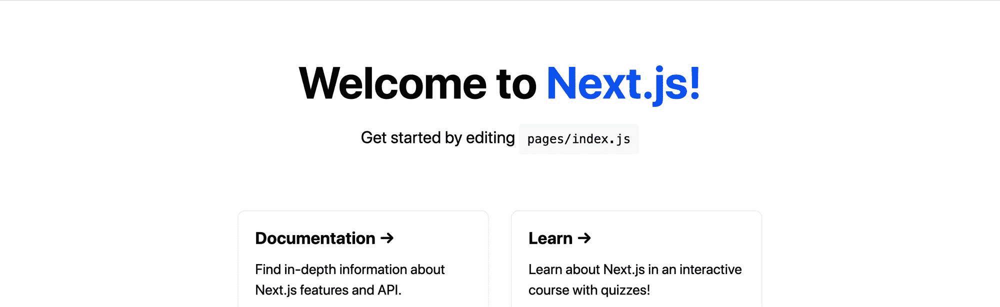

New Next.js App

接下来，让我们将项目配置为静态编译。

在`package.json`文件中，将`build`脚本更新为:

```
"build": "next build && next export", 
```

这将做的是告诉下一步采取的网站，并将其导出到静态文件，我们将使用主机网站。

我们可以通过运行以下命令对此进行测试:

```
yarn build
# or
npm run build 
```

完成后，我们可以在`out`目录中查看我们新网站的所有文件。

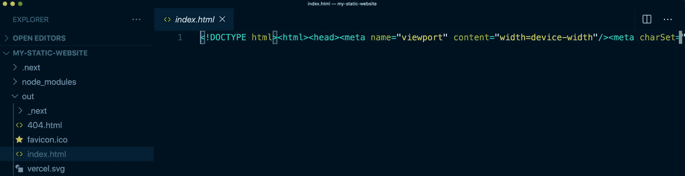

Static output from Next.js

最后，我们想把这个放在 GitHub 上。

在您的 GitHub 帐户中，[创建一个新的存储库](https://docs.github.com/en/free-pro-team@latest/github/getting-started-with-github/create-a-repo)。这将为你如何[将现有项目](https://docs.github.com/en/free-pro-team@latest/github/importing-your-projects-to-github/adding-an-existing-project-to-github-using-the-command-line)添加到回购协议中提供指导。

一旦你把你的项目推送到 GitHub，我们应该准备好建立我们的新网站项目了！

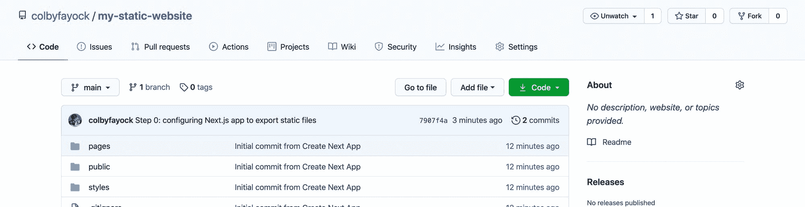

New repo in GitHub

跟随提交:

*   [通过](https://github.com/colbyfayock/my-static-website/commit/ca9e4bca3c37fbd8553b0b183890c32836c35296)[创建下一个 App](https://nextjs.org/docs/api-reference/create-next-app) 添加初始 Next.js 项目
*   [配置 Next.js 导出项目](https://github.com/colbyfayock/my-static-website/commit/7907f4a0fac5f0aed2922202c5f0070dfc055f83)

## 步骤 1:手动创建 Next.js 项目并将其部署到新的 S3 存储桶中

要开始使用我们的新 S3 桶，首先登录您的 AWS 帐户并导航到 S3 服务。

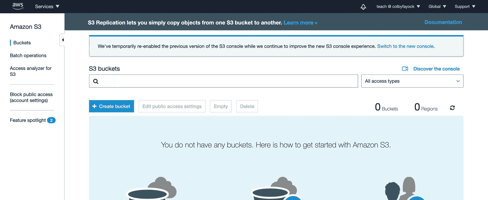

No buckets in S3

我们想要创建一个新的 bucket，使用我们选择的名称，它将用于托管我们网站的 S3 端点。我们还想配置我们的 S3 桶，以便能够托管一个网站。

*注意:这个教程不会带你浏览如何在 S3 上建立网站，但是你可以看看我的另一个教程，它会带你一步步在 S3 上建立网站。*

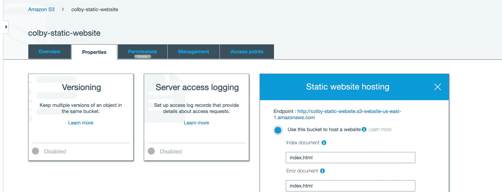

Static website hosting in AWS S3

一旦我们将 S3 bucket 配置为网站，我们就可以返回到 Next.js 项目文件夹，运行我们的 build 命令，然后将所有文件从`out`目录上传到我们的新 S3 bucket 中。

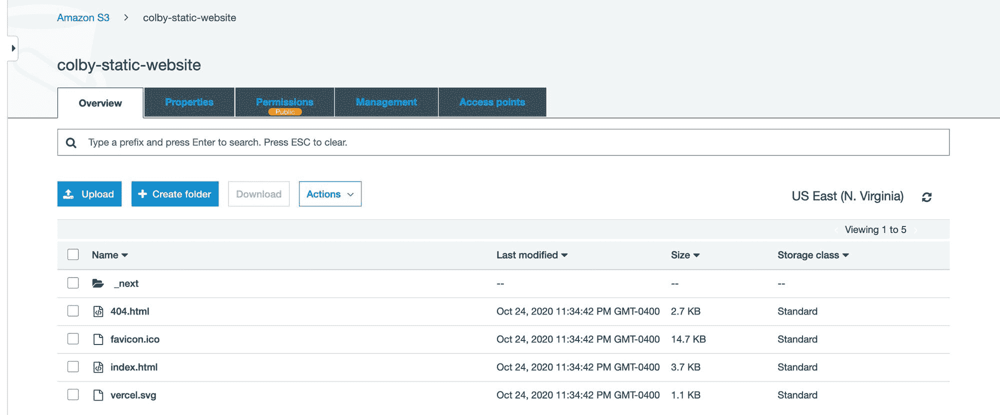

S3 Bucket with Static App

一旦这些文件被上传，我们已经为网站托管配置了我们的 S3 桶，我们现在应该能够看到我们的项目在网上直播！

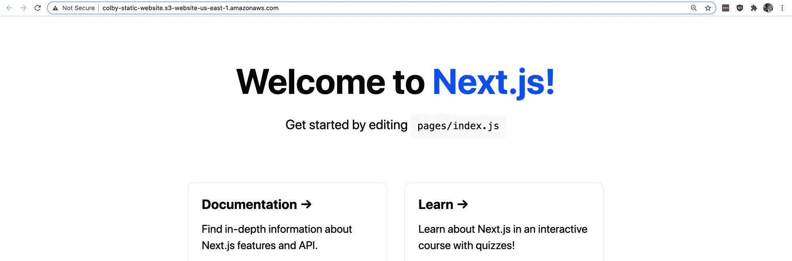

AWS S3 hosted Next.js app

## 步骤 2:创建一个新的 GitHub 动作工作流来自动构建 Next.js 项目

首先，我们需要创建一个新的工作流。

如果您熟悉 GitHub 操作，您可以手动创建一个，但是我们将快速浏览如何在 UI 中完成。

导航到 GitHub 库的 Actions 选项卡，点击“自己设置工作流”

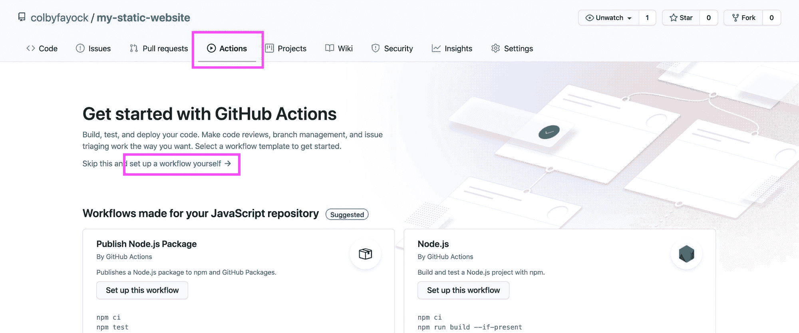

New GitHub Action Workflow

GitHub 为我们的工作流程提供了一个起始模板，尽管我们还需要做一些修改。

让我们执行以下操作:

*   可选:将文件重命名为 deploy.yml
*   可选:将工作流重命名为 CD(因为它与 CI 有点不同)
*   可选:删除所有注释，使其更易于阅读
*   删除`on`属性中的`pull_request`定义
*   移除除`uses: actions/checkout@v2`之外的所有`steps`

因此，在这一点上，我们应该留下:

```
name: CD

on:
  push:
    branches: [ main ]

jobs:
  build:
    runs-on: ubuntu-latest
    steps:
      - uses: actions/checkout@v2 
```

这段代码本身将触发一个进程，该进程将启动一个新的 Ubuntu 实例，并在任何时候有新的更改被推送到`main`分支时，简单地从 GitHub 中签出代码。

接下来，一旦我们签出了代码，我们就想要构建它。这将允许我们获取输出并将其同步到 S3。

这一步会有细微的不同，取决于你的项目是使用 yarn 还是 npm。

如果您使用 yarn，在`steps`定义下，添加以下内容:

```
- uses: actions/setup-node@v1
  with:
    node-version: 12
- run: npm install -g yarn
- run: yarn install --frozen-lockfile
- run: yarn build 
```

如果您正在使用 npm，请添加以下内容:

```
- uses: actions/setup-node@v1
  with:
    node-version: 12
- run: npm ci
- run: npm run build 
```

在这两组步骤之间，我们要做的是:

*   设置节点:这样我们就可以使用 npm 和节点来安装和运行我们的脚本
*   安装 yarn(仅 Yarn):如果我们正在使用 Yarn，我们将其安装为一个全局依赖项，以便我们可以使用它
*   安装依赖项:我们安装我们的依赖项，并使用一个特定的命令来确保我们使用锁文件来避免任何意外的包升级
*   构建:最后，我们运行构建命令，将 Next.js 项目编译到`out`目录中！

现在，我们可以将该文件提交到我们的`main`分支，这将启动我们工作流的新一轮运行，我们可以在 Actions 选项卡中看到它。

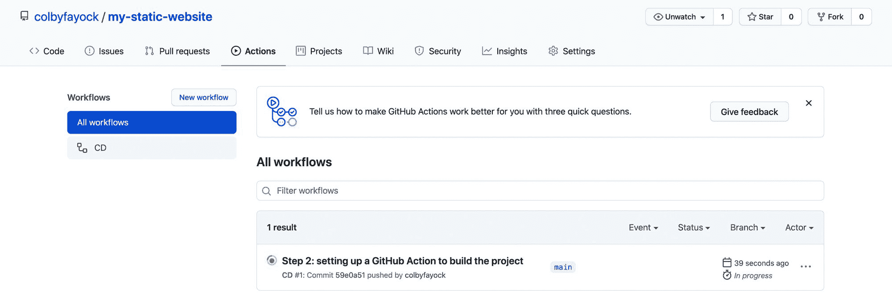

New workflow in GitHub Actions

要查看它的工作情况，我们可以导航到该运行，选择我们的工作流，并查看我们所有的步骤运行情况，包括构建我们的项目！

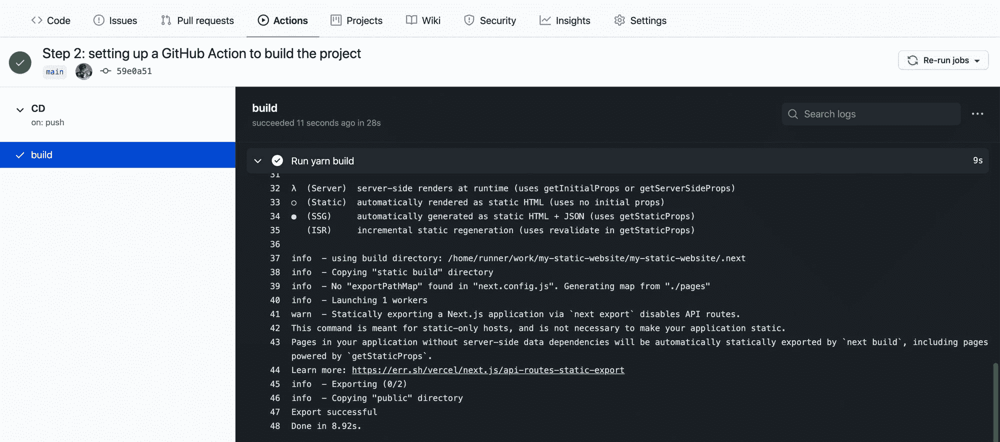

Successful build logs for a GitHub Action workflow

[跟随提交！](https://github.com/colbyfayock/my-static-website/commit/59e0a5158d6afbf54793d826d05455f5205c98fb)

## 步骤 3:配置 GitHub 操作，将静态网站部署到 S3

现在我们正在自动构建我们的项目，我们想自动更新我们在 S3 的网站。

为此，我们将使用 GitHub 操作[AWS-actions/configure-AWS-credentials](https://github.com/aws-actions/configure-aws-credentials)和 AWS CLI。

我们正在使用的 GitHub 操作将接受我们的 AWS 凭证和配置，并使其在工作流的整个生命周期中可用。

到目前为止，GitHub Actions 提供的 Ubuntu 实例允许我们使用 AWS CLI。因此，我们将能够在工作流中直接使用 CLI 命令。

或者，我们可以使用 [S3 同步动作](https://github.com/jakejarvis/s3-sync-action)。但是通过使用 AWS CLI，我们可以更加灵活地定制我们的设置，我们可以将它用于其他 CLI 命令，而且熟悉 AWS CLI 通常也很好。

因此，首先，让我们将以下代码片段作为附加步骤添加到我们的工作流中:

```
- uses: aws-actions/configure-aws-credentials@v1
  with:
    aws-access-key-id: ${{ secrets.AWS_ACCESS_KEY_ID }}
    aws-secret-access-key: ${{ secrets.AWS_SECRET_ACCESS_KEY }}
    aws-region: us-east-1 
```

上面要做的是使用 AWS 凭证配置操作来根据我们的设置设置我们的 AWS 访问密钥、秘密密钥和区域。

AWS 区域可以自定义为您的 AWS 帐户通常使用的任何区域。我在美国东北部，我就留着`us-east-1`。

访问密钥和秘密密钥是您需要用 AWS 帐户生成的凭证。我们的代码是这样设置的，我们将这些值存储在 GitHub Secrets 中，这将防止这些密钥被泄露。当动作运行时，Github 将这些值更改为星号(`***`)，这样人们就无法访问这些键。

所以要设置这些秘密，我们首先要在 AWS 中生成访问密钥。

导航到 AWS 控制台。在用户菜单下，选择**我的安全凭证**，然后选择**创建访问密钥**。

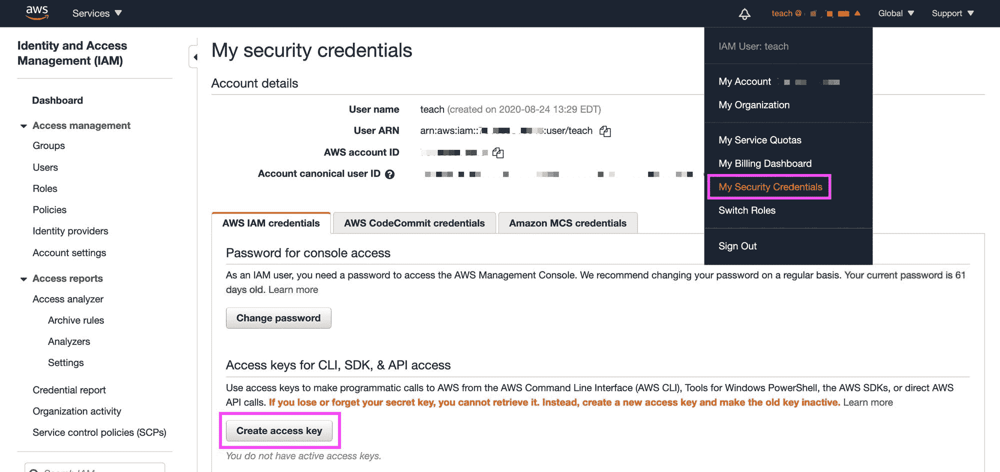

Creating an Access Key in AWS

这将为您提供两个值:访问密钥 ID(T1)和秘密访问密钥(T3)。保存这些值，因为您将无法再次访问密钥 ID。

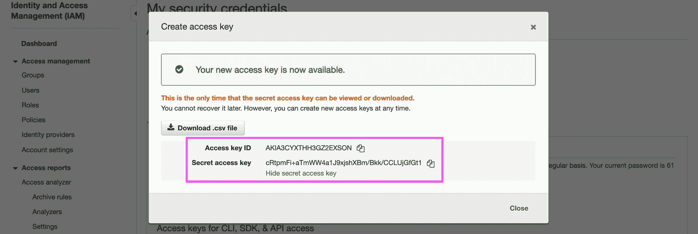

Finding Secret and Access Key in AWS

注意:记住不要在代码中包含访问密钥和秘密密钥。这可能会导致有人泄露您的 AWS 证书。

接下来，在 GitHub repo 中，导航到“设置”、“秘密”,然后选择“新秘密”。

在这里，我们希望使用以下秘密来添加我们的 AWS 密钥:

*   AWS_ACCESS_KEY_ID:您的 AWS 访问密钥 ID
*   AWS 秘密访问密钥:您的 AWS 秘密密钥

一旦被拯救，你应该有你的两个新秘密。

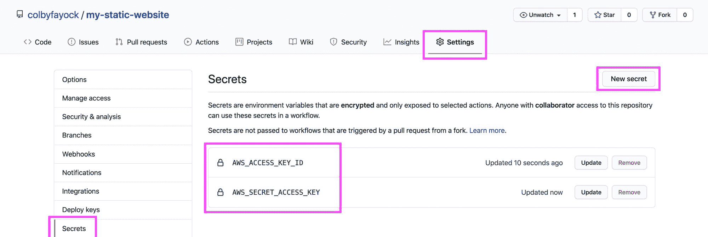

Creating Secrets in GitHub

既然我们已经配置了凭证，我们应该准备好运行命令来将我们的项目同步到 S3。

在 GitHub 操作中，添加以下步骤:

```
- run: aws s3 sync ./out s3://[bucket-name] 
```

*注意:确保用您的 S3 铲斗的名称替换`[bucket-name]`。*

这个命令将使用`out`目录的内容触发与我们指定的 S3 桶的同步，这个目录是我们的项目构建的地方。

现在，如果我们提交我们的更改，我们可以看到一旦提交到`main`分支，我们的操作就会自动触发，在那里我们构建我们的项目并将其同步到 S3！

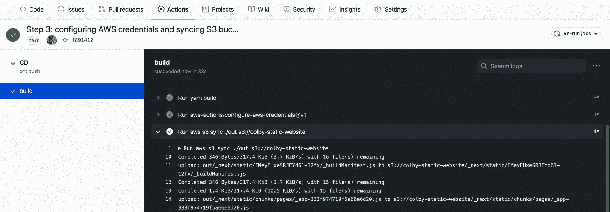

Successful AWS S3 sync in GitHub Action workflow

*注意:确保在设置此操作之前，您已经将 S3 桶配置为托管一个网站(包括解除 S3 桶的阻止权限)——否则此操作可能会失败。*

在这一点上，我们的项目可能看起来是一样的，因为我们没有对代码做任何更改。


Next.js app on AWS S3

但是如果您更改了代码，比如更改了`pages/index.js`中主页的标题，并提交了该更改:

```
<h1 className={styles.title}>
  Colby's <a href="https://nextjs.org">Next.js!</a> Site
</h1> 
```

我们可以看到，我们的更改触发了工作流的启动:

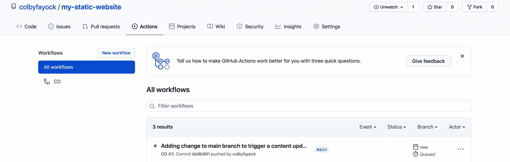

New GitHub Action workflow from code change

一旦我们的工作流程完成，我们可以看到我们的内容现在会自动更新到我们的网站上:

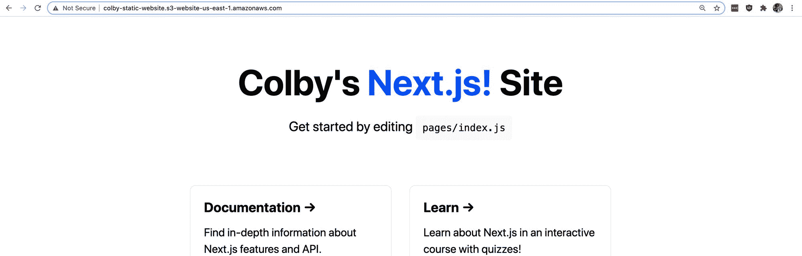

AWS S3 hosted app with updated code changes

跟随提交:

*   [添加 AWS 配置和 S3 同步命令](https://github.com/colbyfayock/my-static-website/commit/f891412b827aca4b06e9bf3de8e4e5b4c5704fc8)
*   [测试工作流程标题更新](https://github.com/colbyfayock/my-static-website/commit/bb9b981416645e35c6d3442e02d6b61f2ba032d2)

## 我们还能做什么？

### 设置 CloudFront

这篇文章的目的不是介绍为 AWS 配置网站的整个过程，但是如果你在 S3 上为一个网站提供服务，你可能还想在它前面包括 CloudFront。

你可以在这里查看我的另一个指南,它将带你完成设置 CloudFront 以及在 S3 创建网站的一步一步的指导。

### 无效的 CloudFront 缓存

如果你的 S3 网站在 CloudFront 之后，很有可能你会希望确保 CloudFront 没有缓存新的变化。

通过 AWS CLI，我们还可以使用 CloudFront 触发缓存失效，以确保它获取最新的更改。

[查看此处的文档](https://docs.aws.amazon.com/cli/latest/reference/cloudfront/create-invalidation.html)了解更多信息。

### 拉请求部署

如果你经常在一个拉请求中处理网站的变化，有时更容易实时看到变化。

您可以设置一个新的工作流，该工作流只对拉请求运行，该工作流可以基于分支或环境动态创建一个新的存储桶，并使用该 URL 向拉请求添加注释。

您也许可以找到一个 GitHub 动作来管理 pull 请求上的评论，或者您可以查看一下 [GitHub 动作文档](https://docs.github.com/en/free-pro-team@latest/rest/reference/actions)。

[](https://twitter.com/colbyfayock)

*   [🐦在 Twitter 上关注我](https://twitter.com/colbyfayock)
*   [🎥订阅我的 Youtube](https://youtube.com/colbyfayock)
*   [✉️注册我的简讯](https://www.colbyfayock.com/newsletter/)
*   [💝赞助我](https://github.com/sponsors/colbyfayock)