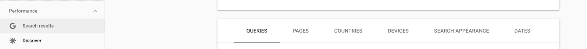

# 如何使用谷歌搜索控制台-GSC 功能和工具，并举例说明

> 原文：<https://www.freecodecamp.org/news/how-to-use-google-search-console/>

如果你正在开发产品，你想知道人们是如何使用产品的，他们是如何听说你正在开发的产品的，以及最终他们是如何接触到你的。搜索控制台在帮助您跟踪和衡量这些运营指标方面发挥着重要作用。

控制台可以免费使用。你只需要向谷歌证明你拥有一个网站。然后谷歌会给你这个搜索数据宝库的使用权。

我将带你浏览谷歌搜索控制台的核心功能，并用简单的英语描述每一个功能。我希望这有助于您利用它，以便您可以测量对您的产品最重要的数据点。

## 谷歌搜索控制台:特点和核心功能

谷歌搜索控制台是谷歌的一项网络服务，允许网站管理员检查索引状态并优化其网站的可见性。下面是搜索控制台主要部分的屏幕截图，以便您可以看到一个可视化布局。

The main tabs on the Google Search Console interface

控制台提供了五个不同的搜索性能区域，您可以快速查看并深入了解。这 5 个领域是:

1.  问题
2.  页
3.  国家
4.  搜索外观
5.  日期

我想提供每一个的概要。然后我会解释你的网站在每个领域的表现和渲染将如何告诉你一个关于你的网站的流量和用户体验的故事。

### 如何在谷歌搜索控制台中使用查询

建筑商在各个层面运作，了解细节，并经常审计数据。在深入控制台之前，构建者会想知道人们在 Google.com 中键入什么以到达登录页面或网站。

换句话说，当人们寻找与你的页面相关的内容时，他们输入的特定短语、单词或查询是什么？搜索意图是什么？

控制台使构建者能够看到用户为了访问您的网站而输入的确切查询。与查询相关的信息非常重要，因为它使你能够看到人们在到达你的页面之前实际上在他们的搜索引擎中输入了什么。

了解人们在搜索什么是一个很好的指南，可以用来分配资源或者优化你的页面，让人们了解他们想了解的内容。

### 如何在谷歌搜索控制台中使用页面

Pages 是控制台的一部分，使您能够看到哪些页面正在排名、每个页面获得的点击数以及该页面获得的总浏览量。默认情况下，谷歌会首先列出访问量最大的页面。

如果你不知道哪个页面的访问量最大，你就不知道人们是如何发现你的网站的。特别是页面，你可能认为你的网站是关于话题 X 的，但是大多数人是通过登陆页面 y 来了解你的。

当我第一次建立一个在家工作的网站时，我想建立一个帮助人们在家工作的通用网站。

令我惊讶的是，排名最好的页面，包括四显示器支架和红色办公椅，让我觉得有些深奥。

然而，这正是人们想要阅读的内容，也是他们消磨时间的地方。如果没有控制台的页面部分，我不可能获得这种洞察力。

您还可以使用控制台来比较您的站点在不同设备和操作系统上的性能。如果你想知道特定的页面是更适合手机用户还是桌面用户，这里有相关的数据。

例如，如果你发现有很多用户通过桌面应用程序使用 gmail，然后看看他们在页面上花费的时间是否比使用手机的 Gmail 用户多，这将是一件有趣的事情。

### 如何在谷歌搜索控制台中使用国家

这一部分对那些期望和想要驱动来自不同地理位置的流量的人来说最为重要。例如，如果你是一个基于教育的网站，你可能希望来自世界各地的用户都能访问你的内容。

人们来自哪里会影响你显示的页面语言，或者帮助你更好地与用户互动。如果你是一个销售实体产品的网站，你可能会看重你实际能运送到的地方的流量。

国家选项卡有助于确认您的假设，即您的流量来自某些地区。

### 如何在谷歌搜索控制台上使用搜索外观

你的一些流量将来自标准查询，其他流量来源将来自视频，或谷歌的“加速移动网页”，更普遍的说法是 AMP。“外观”标签记录了 Google 如何对内容的外观进行分类。

在我看来，这个标签是最不重要的，因为你可能不会因为你在这里看到的东西而改变你的行为。

但是，如果您正在实践敏捷产品开发，并且想要迭代并查看每个变更如何影响搜索结果，这个选项卡将是一个有用的指南。

### 如何在谷歌搜索控制台中使用日期

最后一个标签是最简单明了的，与时间有关。

您可以按天跟踪您的有机搜索结果，或者通过缩小到月度、季度或年度绩效来查看趋势。总的来说，从长远的角度来看搜索性能是有帮助的，因为你为改进网站所做的任何事情都很可能需要几天或几周的时间才能被谷歌收录。

谷歌正在寻找高性能、对用户有用、快速、反应灵敏、结构良好的网站。如果你的网站能给用户带来这些好处——并随着时间的推移提高用户参与度——你的流量很可能会增加，日期选项卡将帮助你直观地看到这一点。

## 结论:利用搜索控制台来构建更好的产品

谷歌搜索控制台是一个强大而必要的工具，用于审查、利用和探索网站的核心运营指标。该控制台将帮助您了解用户如何在有机搜索中了解您的网站，以及他们在您的域名上访问了哪些页面。

通过测量这些数据点，您可以通过增强单个页面、提高搜索外观的质量以及查看您如何随着时间的推移而改进来改进您的网站。

Google 免费提供对控制台的访问，因此您可以构建和扩展而无需为每个查询付费。

控制台非常强大，是在公共互联网上构建和部署任何站点时可以利用的有用工具。