# 如何使用谷歌标签管理器来维护谷歌分析和其他营销标签

> 原文：<https://www.freecodecamp.org/news/how-to-use-google-tag-manager-to-maintain-google-analytics-and-other-marketing-tags/>

管理网站或应用程序上的代码片段和像素来衡量流量可能会有点压力，尤其是如果你有一个需要不断做出改变的营销团队。幸运的是，有像 Google Tag Manager 这样的工具可以让他们更容易争论。


Sandy wrangling

## **什么是谷歌标签管理器？**

如果你曾经使用过任何一种分析软件，或者你曾经和一个营销团队合作过，你可能听说过 pixel 这个词。像素顾名思义就是:通过图像请求向服务器发送信息的 1x1 图像。


Google Analytics pixel request

尽管像素仍然很常见，但许多团队已经转向小型 javascript 代码片段，这些代码片段就在 HTML 的其余部分旁边。他们将允许谷歌分析等软件在你的页面上运行自己的脚本，有时甚至有像素备份，以防浏览器不运行 JavaScript。

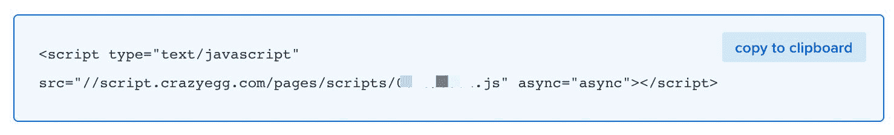

Crazy Egg snippet

这些像素和片段非常好用。但是，当您处理一堆代码并且它们都使用相同的数据时，看起来您只是在向一堆难以管理的单一用途代码片段中添加代码，而这些代码片段从来都不觉得它们在正确的位置。

谷歌标签管理器，或 GTM，是一个软件解决方案，为你管理这些像素和片段。首先，GTM 的工作方式与其他代码片段非常相似，因为它本身就是一个代码片段。但是它的亮点在于，您可以管理 GTM 中的其余像素和片段以及数据流，使其成为代码中唯一需要管理的片段。

## **我为什么要用它？**

### **代码更改越少，部署越少**

大多数情况下，如果您在代码中管理这些片段，那么每次更改都需要另一个合并请求和另一个部署来实现更改。这不仅增加了更多的风险，因为您需要对代码进行另一次更改，而且这是处理部署管道和确保一切正常工作所花费的额外时间。

GTM 允许你打破这种流程，给你更大的灵活性来做出改变，这种改变可以提供一些修复一些 UI 错误所需要的洞察力，或者可以增加一些利润。

### **更易管理的数据流**

在整个应用程序中争论所有不同的变量，确保它们都在正确的位置可用，并跟上步伐避免破坏任何更改可能会被证明是具有挑战性的。这也使得你的代码更脆弱，更容易崩溃。

Google Tag Manager 利用了他们称之为`dataLayer`的东西，它本质上的功能就像它所监听的一系列事件。这允许您推送或植入新数据，使其在 GTM 本身中可用。这意味着你把所有的变量集中到代码中的一个点上。这就让管理 GTM 的人来完成剩下的工作——他们可以安心地使用这些数据，因为他们知道即使忘记更新 10 个点中的 1 个，数据流也不会中断。

### **能够给营销人员更多的访问权限**

这是一个机会，通过让营销团队自己处理标签变化，而不是你作为他们的中间人，来腾出你的一些时间。或许他们需要为你的分析软件调整 ID，或许他们想添加[疯狂彩蛋](https://www.crazyegg.com/)。有了适当的权限(稍后解释)，他们可以完成所有的工作，并在发布之前将更改发送给您进行审查。

## 这与谷歌分析有什么关系？

没有直接关系。但是除了 Google Analytics，GTM 是 Google 营销平台中的另一个工具，它让您能够更轻松地管理您的 Google Analytics 安装。GA 附带了 GTM 内部的预建标签，使设置变得轻而易举。

## 我还可以用这个做什么？

谷歌分析只是许多代码片段中的一个。理想情况下，你不会把整个网站都写在这里。但是你有能力在自己的网站上做任何你想做的事情，只要谷歌不认为它是恶意软件。

其他一些使用案例包括:

*   交通可视化用[疯狂彩蛋](https://www.crazyegg.com/)或[热罐](https://www.hotjar.com/)
*   用谷歌广告[转换和再销售像素](https://ads.google.com/home/)
*   用[谷歌优化](https://marketingplatform.google.com/about/optimize/)或 [AB 美味](https://www.abtasty.com/)进行 A/B 测试
*   [客户端错误](https://support.google.com/tagmanager/answer/7679411?hl=en)跟踪(并记录它们)
*   GDPR 合规管理

有许多像上面的例子一样的内置，意味着你甚至不需要弄乱代码。只需添加 id 或设置即可。但是对于您需要的任何定制解决方案或标签，您总是可以手动设置 HTML。

## 在开始之前，我需要知道什么吗？

在开始之前，让我们先熟悉几个关键术语，这会让我们的旅程稍微轻松一些。

### **标签**

GTM 中的标签是你的像素或者代码片段。标签包括用于一个功能的所包含的一段代码的单个实例。

*例如:*你的谷歌分析片段将是一个标签，如果你添加了疯狂的鸡蛋，这将是另一个标签。

### **变量**

变量是一个名字，你给它一个预定的或动态的值。变量可以基于各种不同的东西，因此得名“变量”。但是它将作为一个单独的名称，您可以给出并引用它，在使用它时永远不会改变。

*示例:*我们将把您的 Google Analytics ID 设置为一个变量，这意味着您将在 GA 标签本身中使用该变量。如果你需要更新 ID，你不需要修改标签或者任何其他使用变量的标签——你只需要更新变量本身。

### **触发器**

触发器是使您的标签触发或加载的事件或动作。这可能以多种方式发生，例如当所有或特定页面加载时，当某个内容被点击时，或者当您用 Javascript 触发一个完全自定义的事件时。

*举例:*当我们设置 Google Analytics 时，我们的触发器将是任何页面加载时。

### **集装箱**

GTM 允许您管理组织内的多个“容器”或标签组。当你的公司有几个不同的网站属性时，这是很有帮助的。

例:你是母公司旗下的一家小公司。母公司希望维持一个组织，但是每个较小的公司都有自己的容器，因为它们对标记和代码片段有各自的需求。

## 我如何被设置？

### **设置您的帐户**

你需要做的第一件事是建立你的账户。在进入[标签管理器主页](https://tagmanager.google.com/)后，你可能会想使用你先前存在的谷歌账户。如果你在一个为组织设置的组织中，你很可能想使用你的商务邮箱，否则你的个人账户也可以。

接下来，创建一个新的 GTM 帐户:

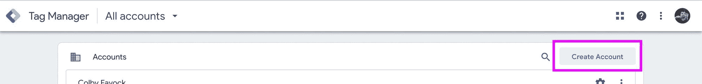

Google Tag Manager new account

一旦到了那里，适当地填写表格。帐户名应该代表层次结构的顶层，容器名应该代表特定的安装实例。

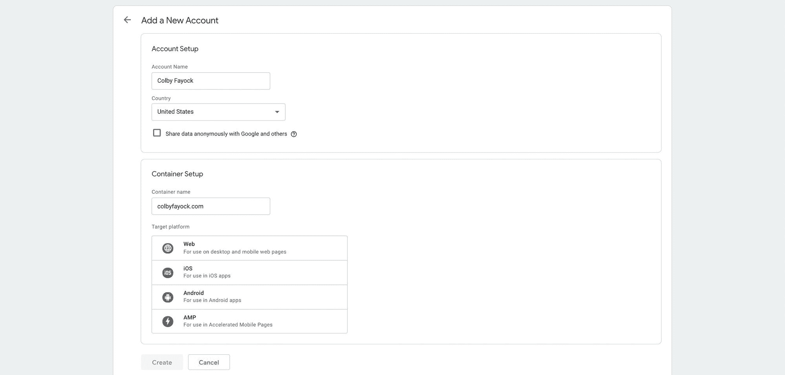

Google Tag Manager new account container

至于目标平台，选择有意义的。如果它是一个网站或 web 应用程序，Web 在这里最有意义。

### **查找并安装您的代码片段**

一旦您接受这些条款并点击 create，您将看到一个小模态的代码片段。您需要完全按照它所说的去做，并按照说明安装代码片段。

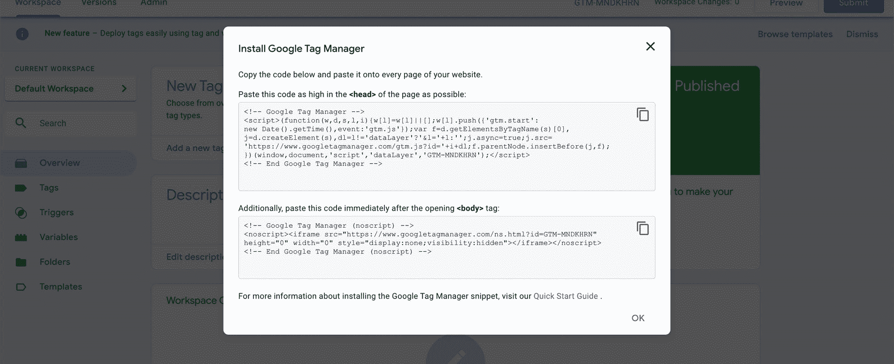

Google Tag Manager install snippet

没拿到屏幕还是意外退出去了？您可以通过在顶部导航栏中导航到 Admin，然后在右侧的 Container 下单击 Install Google Tag Manager，再次找到您的代码片段。

### **测试它的工作情况**

为了确保它正常工作，让我们验证几件事:

*   我们创建了自己的账户
*   我们创造了我们的容器
*   我们在我们的页面上安装了谷歌标签管理器片段，这一变化是实时的

一旦所有这些都是真的，继续点击页面右上角的预览按钮。

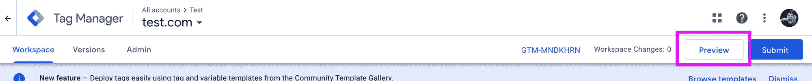

Google Tag Manager preview

如果成功，您将在页面顶部看到一个橙色横幅，表示您正处于预览模式:

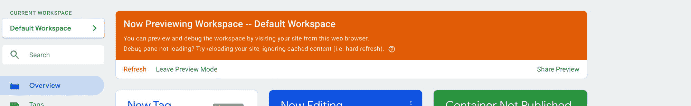

Google Tag Manager preview mode

现在转到你安装 GTM 的网站，你应该会在页面底部看到一个横幅。这将作为您使用 GTM 预览的调试器。

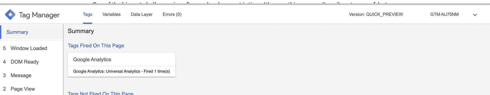

Google Tag Manager debugger

您应该看到类似的东西，这意味着它的工作！？

注意:如果你有一个广告拦截器，类似于 GA，你可能需要在你安装的页面上禁用它才能看到它的工作。

## 酷，它在工作，谷歌分析怎么样？

现在我们已经有了 GTM 工作的基本安装，让我们设置 Google Analytics。首先，我们要做一些准备，让我们跳回标签管理器仪表板。

### **创建一个设置变量**

导航到左侧栏中的变量，然后单击用户定义的变量旁边的新建。

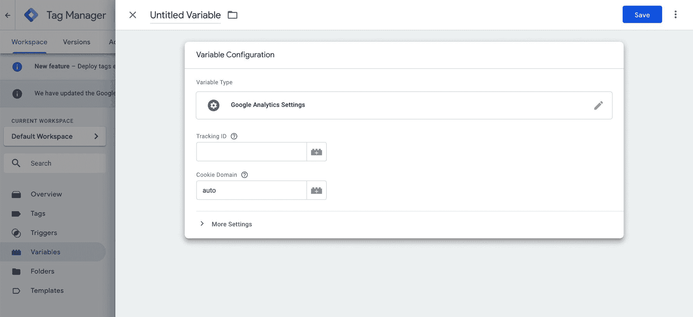

Google Tag Manager new variable

在名称中，输入“GA Settings ”,在变量类型下，单击并选择 Google Analytics Settings。在适当的字段中输入您的 Google Analytics 跟踪 ID(或属性 ID ),最后单击 Save，此时您就有了新的设置变量。

### **创建新的 GA 标签**

导航到左侧边栏中的标签，然后单击标签旁边的新建。


Google Tag Manager new tag

对于名称，输入“GA -所有页面”。在标签类型下，点击并在右边弹出的面板中选择 Google Analytics:Universal Analytics。

选择标签类型后，在 Google Analytics 设置下，从上一步中选择您的变量，如果您遵循该步骤，它将被称为“GA 设置”。

接下来，单击触发框的中间，这将打开一个新的 UI 来选择一个触发器。

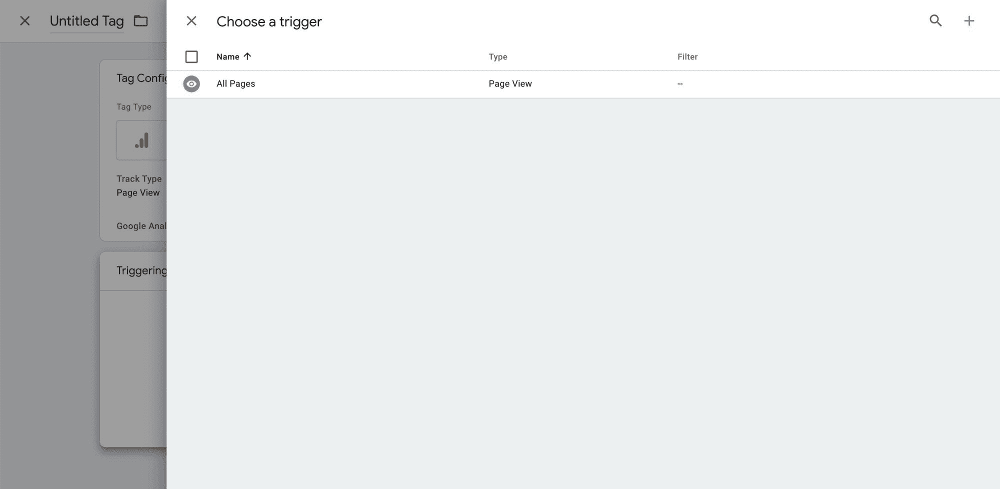

Google Tag Manager trigger

选择所有页面，如果你是一个新帐户，这应该是唯一的触发器。它将带你回到新的标签用户界面和你新选择的触发器。

完成上述操作后，单击 UI 右上角的 Save，保存并创建新的 Google Analytics 标签。

### **测试 GTM 是否工作**

与我们开始安装 GTM 时类似，让我们通过单击左侧边栏中的 Overview 返回工作区主页。然后点击右上角的预览。

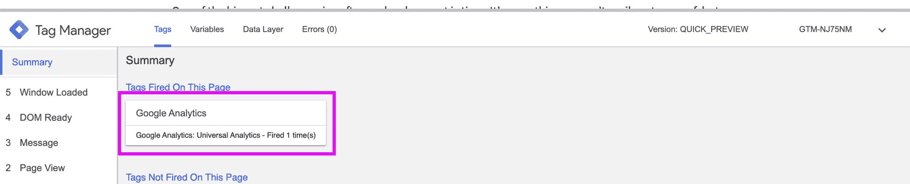

Google Tag Manager debugger with Google Analytics

打开安装了 GTM 的页面，你应该会再次看到你的调试器，但是这一次加载了 Google Analytics 标签。

## 我们结束了吗？

不完全是。虽然我们有 GA 工作，但我们需要调整配置以确保 GA 和 GTM 一起正确工作。

### **更新页面片段**

让我们再次深入研究代码，更新我们的 Google Analytics 和 Google Tag Manager 片段。

我们在这里设置的安装的问题是，我们通过 GA 指令和 GTM 内部的 GA 来安装 GA。这意味着我们安装了两次 GA。实际上，GA 可能会从您的默认安装中发送一个页面视图，然后通过 GTM 发送另一个页面视图。为了避免这种情况，我们希望从默认的 GA 代码片段中删除页面视图。

如果你只有一个超级基本的默认安装，我已经为你做了，你可以继续复制下面的代码片段。将`[YOUR GA PROPERTY ID]`替换为您的 GA 属性 ID，将`[YOUR GTM CONTAINER ID]`替换为您的 GTM 容器 ID，并将其替换为您页面上现有的 GA 和 GTM 安装。

```
<script>
// Set up an initial dataLayer configuration
window.dataLayer = window.dataLayer || [{
  "gaPropertyId": "[YOUR GA PROPERTY ID]"
}];

// Configure gtag and your GA ID
function gtag(){dataLayer.push(arguments);}
gtag('js', new Date());
gtag('config', '[YOUR GA PROPERTY ID]');

// Google Tag Manager snippet
(function(w,d,s,l,i){w[l]=w[l]||[];w[l].push({'gtm.start':
new Date().getTime(),event:'gtm.js'});var f=d.getElementsByTagName(s)[0],
j=d.createElement(s),dl=l!='dataLayer'?'&l='+l:'';j.async=true;j.src=
'https://www.googletagmanager.com/gtm.js?id='+i+dl+'&gtm_cookies_win=x';f.parentNode.insertBefore(j,f);
})(window,document,'script','dataLayer', '[YOUR GTM CONTAINER ID]');
</script>
```

这应该取代你目前的谷歌分析片段，如果你有一个。如果你不这样做，这应该尽可能地放在你的`<head>`标签的顶部，但是在`charset` meta 标签的下面。

对于更高级的用户，只要确保你没有在页面片段和你创建的任何 GTM 标签之间发送重复的浏览量或者重复的事件。

### **测试 GA 正在工作**

按照上面的步骤，确保 GA 出现在调试器中。

你要做的最后一件事是使用[谷歌的标签助手扩展](https://chrome.google.com/webstore/detail/tag-assistant-by-google/kejbdjndbnbjgmefkgdddjlbokphdefk?hl=en)确保你的安装正在工作。安装完扩展后，返回页面并在扩展的 UI 中单击 Enable。

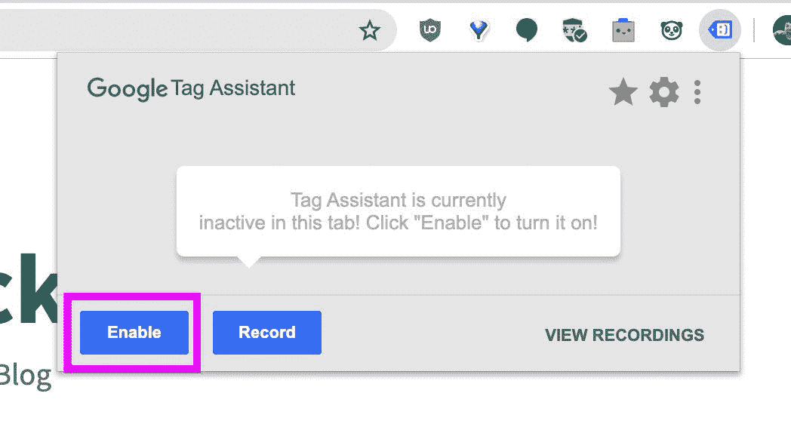

Google Tag Assistant enable recording

刷新页面，您应该会看到 2 个标签，GA 和 GTM。

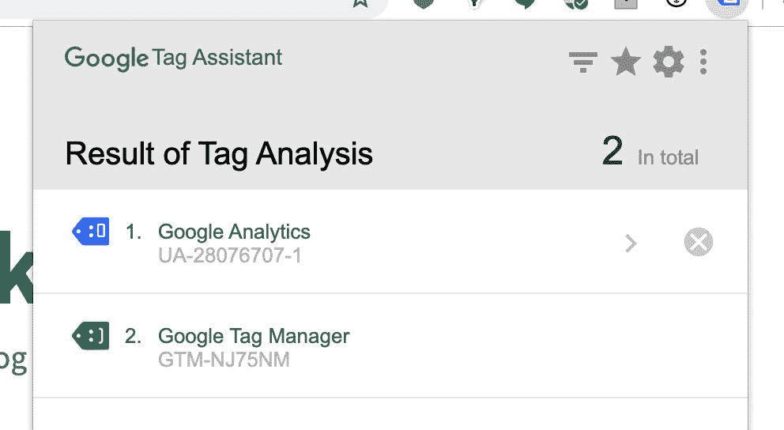

Google Tag Assistant results

如果你注意到，我的 GA 标签是蓝色的，你的可能也是。点击谷歌分析了解更多信息。

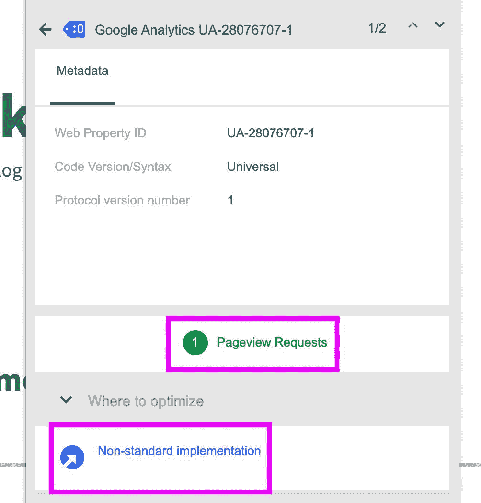

Google Tag Assistant non-standard implementation

正如你所看到的，我们有一个健康的 1 Pageview 请求和一个非标准实现的注释(因此是蓝色的),这是因为我们用 GTM 安装了它，而不是缺省的 page。

## **发布部署！**

我们到了。最后一步是发布您的容器并使更改生效。


Google Tag Manager submit version

单击概览 UI 中的提交，输入名称和描述。

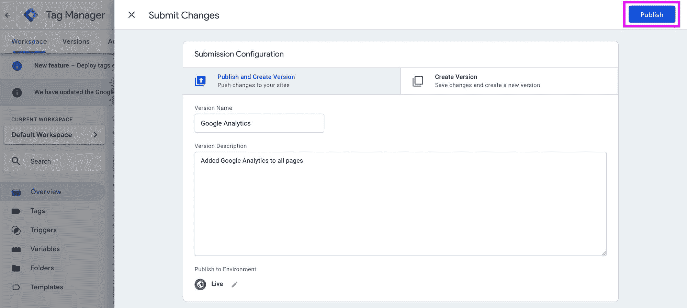

Google Tag Manager version configuration

最后点击发布，你的修改将会在你的网站上生效！

## 我还需要知道什么？

还有很多要谈的，但那是另外一天了。网上有大量的资源可以让你开始添加自己的新标签，探索 Google Analytics 的功能，但这里有几点需要记住。

### **权限**

您很可能不希望您的 1000 人团队中的每个营销人员都可以发布您的 GTM 容器。最好是让一个或几个人负责管理容器、审查和发布，同时让其他人担任较低的访问角色。这将有助于防止更大团队中的意外变化或滥用。

### **安全**

权限是维护安全安装的第一步。但是谷歌采取了额外的步骤，为你执行一些动作，比如检查代码错误和扫描恶意软件。虽然这很好，但保持标签发布的积极审查周期仍然很重要，就像任何其他代码一样，以确保网站的完整性和健康性。

### **惯例**

我强烈建议在配置标签、变量、触发器以及 GTM 中的任何东西时，尽早从命名约定和最佳实践开始。命名事物的不同方式会很快失控，这取决于有多少人在那里工作。这将使你的工作很难找到，所以最好与团队就一个约定达成一致，以便尽早使用，并取得良好的开端。

### **单页应用**

这还没有考虑到单页应用对 GTM 和 GA 设置的影响。我们在这里设置的触发器将在任何页面加载时触发，这是由浏览器加载的新页面定义的。单页应用程序实际上并不加载新页面——相反，应用程序中的 JavaScript 让它看起来像是加载了新页面，所以这里的触发器只会触发第一次页面视图。虽然它不包括 GTM 中直接可用的信息，但 GA 文档中有一些关于跟踪这些类型应用的有用信息。

### **GDP**

虽然 GTM 本身(目前)没有违反 GDPR，但你仍然需要认识到你使用的任何标签是如何影响你的地位的。本指南不涉及这一点，请务必做好功课。

### **退出调试器**

卡住了？一种方法是清除您的 cookies，但您应该总是能够进入 GTM 概述页面，并点击页面顶部橙色预览模式横幅下方的“离开预览模式”。

## 下一步是什么？

从这里开始，您可以通过 GTM 管理您的标签和像素，这允许您有一个一致的数据流到这些标签的单一来源。尝试使用调试器，因为它为许多新的营销方式打开了大门。

[](https://twitter.com/colbyfayock)

*   [？在 Twitter 上关注我](https://twitter.com/colbyfayock)
*   [？️订阅我的 Youtube](https://youtube.com/colbyfayock)
*   [✉️注册我的简讯](https://www.colbyfayock.com/newsletter/)

*最初发布于[https://www . colbyfayock . com/2019/11/how-to-use-Google-tag-manager-to-maintain-Google-analytics-and-other-marketing-tags](https://www.colbyfayock.com/2019/11/how-to-use-google-tag-manager-to-maintain-google-analytics-and-other-marketing-tags)*