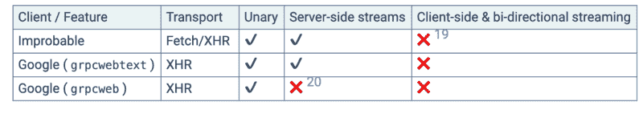
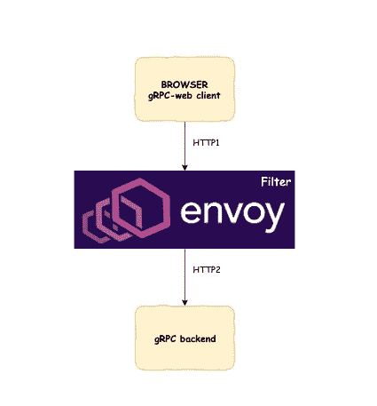
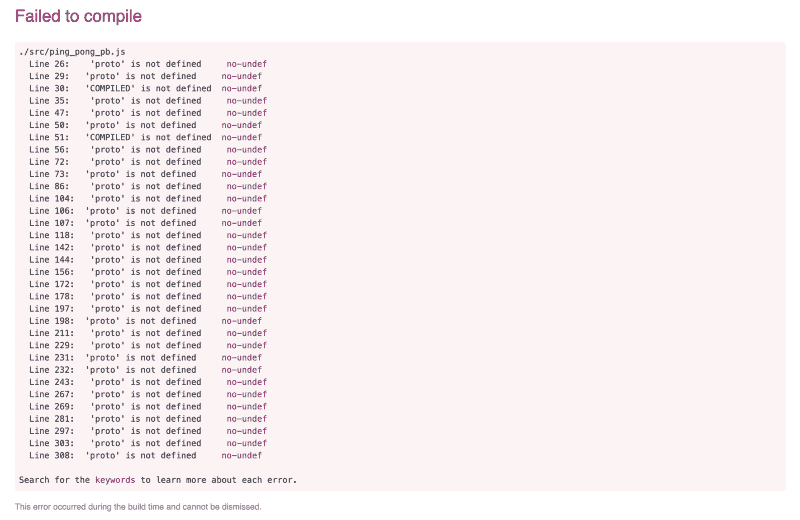
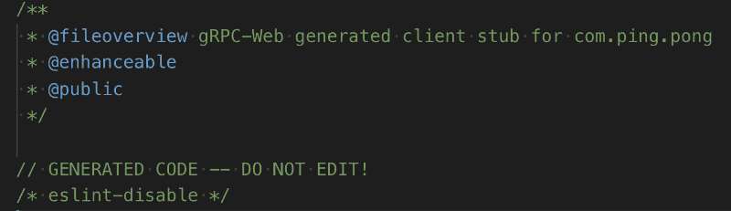
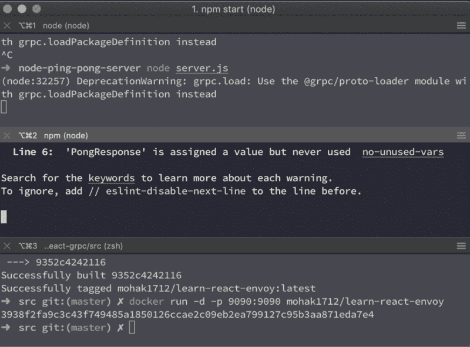
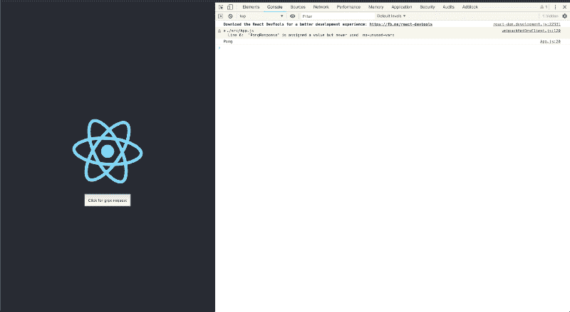

# 如何使用 gRPC-web 和 React

> 原文：<https://www.freecodecamp.org/news/how-to-use-grpc-web-with-react-1c93feb691b5/>

莫哈克·普里

# 如何使用 gRPC-web 和 React

在过去的几个月里，我的团队一直致力于 gRPC 服务。几周前，出现了一个新的需求:我们需要一个门户网站来显示一些信息。因为我们已经有了一个 gRPC 后端，所以服务器端被分类了。但是对于前端，我们有几个重要的选择要做。

```
1\. Vue or React (We choose react)2\. REST or gRPC from the web portal 
```

如果你不知道 gRPC 是什么，你可以在这里阅读。以下是让我们选择 gRPC 而不是 REST 的几个原因。

1.  选择 gRPC 的一个主要因素是我们已经有了用于后端服务的原型。我们可以使用相同的原型在 javascript **中生成客户端代码。**
2.  使用 gRPC 意味着我们不必为创建客户机编写任何代码。添加新的端点意味着对原型进行修改并生成客户端代码。
3.  我们需要 gRPC-web 支持的服务器端流。
4.  我们已经设置了 envoy 来平衡后端服务的负载(稍后会详细介绍)。

### 警告

1.  gRPC web 客户端不会发送 HTTP2 请求。相反，您需要一个 web 客户端和 gRPC 后端服务之间的代理来将 HTTP1 请求转换为 HTTP2。gRPC web 客户端内置了对 Envoy 作为代理的支持。你可以在这里找到更多关于这个[的信息。](https://grpc.io/blog/state-of-grpc-web#f2)
2.  Google 和 Improbable 的团队都在两个不同的存储库中实现了这个规范。我们将使用谷歌提供的 gRPC 网络客户端。你可以通过谷歌[在这里](https://github.com/grpc/grpc-web)和不可能[在这里](https://github.com/improbable-eng/grpc-web)找到实现。
3.  到目前为止，还不支持客户端流。



Credits: [https://grpc.io/blog/state-of-grpc-web](https://grpc.io/blog/state-of-grpc-web)

现在我们对 gRPC web 有了一些了解，下面的图表描述了整个交流是如何进行的。我们将创建一个 react web 应用程序，它将发送一个 *Ping* 请求并获得一个 *Pong* 响应。



Front-end + Proxy + Back-end

#### 开始之前，请确保您安装了以下设备:

```
1\. npm (Node package manager) - For generating react project2\. Docker - For running envoy locally3\. protoc - For generating code using protos
```

这个谜题有三个部分。我们将逐一解决它们。

### 1.用户界面—使用 react 的网站

为了创建一个 react 项目，我们将使用 *create-react-app* 命令。

```
create-react-app learn-react-grpc
```

现在我们已经有了一个示例项目，让我们创建一个原型。这就是乒乓球原型机的样子。

对于要运行的后续命令，请确保 proto 位于 react 项目的 src/文件夹中。要在 javascript 中生成客户端代码，请运行以下命令:

```
protoc -I=. src/ping_pong.proto --js_out=import_style=commonjs:. --grpc-web_out=import_style=commonjs,mode=grpcwebtext:.
```

这将生成两个新文件: ***ping_pong_pb.js*** 和***ping _ pong _ grpc _ web _ Pb . js，*** 所有生成的代码都在其中。我们将使用此代码向我们的 gRPC 服务发出请求。

首先，让我们用一些 gRPC 和 protobuf 相关的依赖项更新我们的 package.json，然后运行 ***npm install*** *。*

下面是建立我们网站的整个逻辑。您可以在 App.js 文件中使用这段代码。这是一个非常简单的网站，包含一个按钮，点击它会创建一个乒乓请求并得到响应。

现在，如果您使用 **npm start，**运行节点服务器，您可能会面临这个编译问题。当使用 gRPC-web 和使用 *create-react-app* 命令行界面*创建的项目一起使用时，这显然是一个问题。*



compilation issues when using create-react-app

然而，这个问题可以通过向所有 proto 生成的文件添加 *eslint-disable* 来解决。确保你为*所有的*文件做这件事。现在，如果您启动服务器，一切都应该正常工作。



fixing compile issues

### 2.后端—节点中的 gRPC 服务器

让我们创建一个简单的节点服务器。我们将使用 react 应用程序中使用的相同原型。让我们创建一个节点 js 应用程序节点-乒乓-服务器。这是我们的示例 server.js 文件。

我们可以使用以下命令运行节点服务器:

```
node server.js
```

### 3.代理特使

如上所述，我们将使用 Docker 来设置 envoy。这是 docker 文件。截至发稿时，最新的标签指向特使*版本 1.11。*在 react 应用的 src/文件夹中创建 Dockerfile。

在运行 Docker 容器之前，我们需要确保我们有一个用于 envoy 的配置文件。将 envoy.yml 添加到 react 应用程序的 src/文件夹中。

让我们了解一下这个特使配置文件的作用:

9901 是运行特使管理门户的端口。你可以使用这个入口来检查特使路线，健康检查等等。

9090 是 envoy 监听传入请求的端口。我们的网站将在此端口向特使发出请求。

任何匹配上述前缀的请求都被路由到 ping_pong_service 集群。因为我们的节点服务器(又名集群)运行在主机(您的笔记本电脑)上，而不是 docker 容器上，所以我们需要将这些请求从容器路由到主机。***host . docker . internal***正是这么做的。

现在，让我们使用以下命令构建 docker 映像:

```
docker build -t mohak1712/learn-grpc-web .
```

现在让我们运行 docker 图像:

```
docker run -d -p 9090:9090 mohak1712/learn-grpc-web
```

我们需要将主机端口 9090 转发到容器端口 9090，以便端口 9090 上的任何请求都被转发到运行 envoy 的 docker 容器。

### 最终输出

现在一切都设置好了，确保网站、节点服务器和特使容器正在运行。如果您还没有这样做，您可以运行下面的命令集。

```
npm start -> start web server
```

```
node server.js -> start node server
```

```
docker run -d -p 9090:9090 mohak1712/learn-grpc-web -> start envoy
```



现在，当你点击按钮，它发送一个 Ping 请求，并得到一个 Pong 响应！

差不多就是这样！感谢您的阅读，我希望您喜欢这篇文章。

可以在 [Medium](https://medium.com/@mohak1712) 和 [Github](https://github.com/mohak1712) :)上关注我