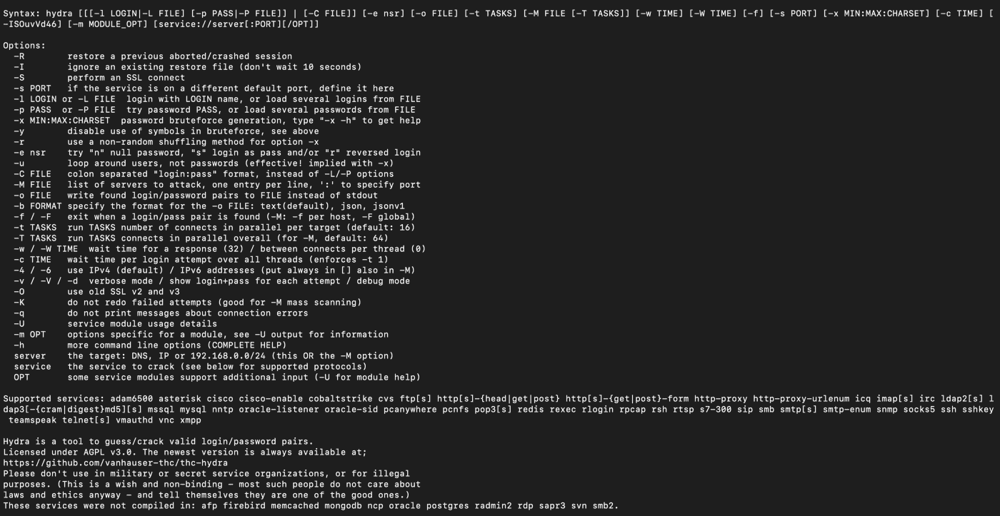
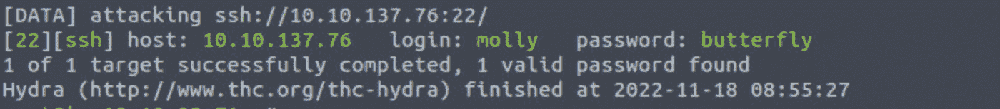
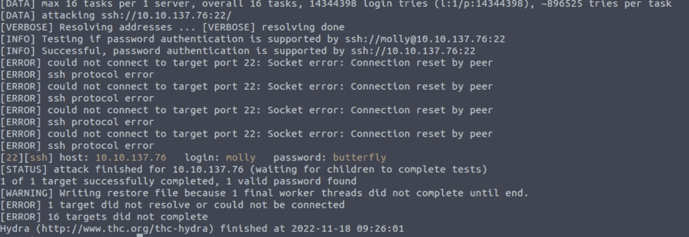

# 如何使用 Hydra 破解密码——渗透测试教程

> 原文：<https://www.freecodecamp.org/news/how-to-use-hydra-pentesting-tutorial/>

Hydra 是一个暴力破解工具，帮助渗透测试人员和道德黑客破解网络服务的密码。

Hydra 可以对 50 多种协议进行快速字典攻击。这包括 telnet、FTP、HTTP、HTTPS、SMB、数据库和其他几种服务。

九头蛇是由黑客组织“[黑客的选择](https://www.thc.org/)”开发的。Hydra 最初发布于 2000 年，是一个概念验证工具，演示了如何对网络登录服务进行攻击。

Hydra 也是一个并行登录破解程序。这意味着您可以有多个并行连接。与顺序暴力破解不同，这减少了破解密码所需的时间。

在我的上一篇文章中，我解释了另一个叫做[开膛手约翰](https://stealthsecurity.io/cracking-passwords-using-john-the-ripper-977943d7ab38)的暴力工具。虽然约翰和九头蛇是蛮力工具，但约翰离线工作，而九头蛇在线工作。

在本文中，我们将看看 Hydra 是如何工作的，然后是一些真实的用例。

> **注:我所有的文章都是出于教育目的。如果你非法使用，惹上麻烦，我不负责。在扫描/暴力破解/利用系统之前，一定要获得所有者的许可。**

# 如何安装九头蛇

Hydra 预装了 Kali Linux 和 Parros OS。因此，如果您正在使用其中一个，您可以立即开始与 Hydra 合作。

在 Ubuntu 上，你可以使用 apt 包管理器来安装它:

```
$ apt install hydra
```

在 Mac 中，你可以在 Homebrew 下找到 Hydra:

```
$ brew install hydra
```

如果你用的是 Windows，我会推荐使用虚拟盒子，安装 Linux。个人认为，如果想成为专业的渗透测试人员，我不建议使用 Windows。

# 如何与九头蛇合作

让我们看看如何与九头蛇合作。我们将讨论 Hydra 为暴力破解用户名和密码提供的常见格式和选项。这包括单一用户名/密码攻击、密码喷洒和字典攻击。

如果您已经安装了 Hydra，您可以像这样启动 help 命令:

```
$ hydra -h
```

这将为您提供一个标志和选项列表，您可以在使用 Hydra 时作为参考。



Hydra help command

## **如何使用 Hydra 进行单一用户名/密码攻击**

让我们从一个简单的攻击开始。如果我们有了期望系统拥有的用户名和密码，我们可以使用 Hydra 来测试它。

下面是语法:

```
$ hydra -l <username> -p <password> <server> <service>
```

假设我们有一个名为“molly”的用户，密码为“butterfly ”,位于 10.10.137.76。下面是我们如何使用 Hydra 来测试 SSH 的凭证:

```
$ hydra -l molly -p butterfly 10.10.137.76 ssh
```

如果成功，结果会是这样的:



Hydra single username and password

## **如何用九头蛇进行密码喷射攻击**

如果我们知道某人正在使用的密码，但不确定是谁，该怎么办？我们可以使用密码喷雾攻击来确定用户名。

密码喷射攻击是指我们使用单个密码，并对多个用户运行该密码。如果有人在用密码，九头蛇会帮我们找到匹配的。

这种攻击假设我们知道系统中的用户列表。对于本例，我们将为以下用户创建一个名为 users.txt 的文件:

```
root
admin
user
molly
steve
richard
```

现在我们要测试谁有“蝴蝶”这个密码。下面是我们如何使用 Hydra 运行密码喷射攻击。

```
$ hydra -L users.txt -p butterfly 10.10.137.76 ssh
```

如果任何用户与给定的密码匹配，我们将得到与下面的输出类似的结果。您还应该注意到，我们使用了标志-l 而不是-L。-L 表示单个用户名，而-L 表示用户名列表。


Hydra password spraying

## **如何用九头蛇进行字典攻击**

让我们看看如何执行字典攻击。在现实世界中，这就是我们经常使用 Hydra 的原因。

字典攻击是指我们拥有单个/多个用户名，并向 Hydra 提供一个密码单词列表。然后 Hydra 对列表中的每个用户测试所有这些密码。

在这个例子中，我将使用 [Rockyou 单词表](https://github.com/teamstealthsec/wordlists)以及我们在之前的攻击中创建的 users.txt 文件。如果使用的是 Kali Linux，可以在/usr/share/word lists/RockYou . txt 下找到 rock you 单词列表。

下面是字典攻击的命令:

```
$ hydra -L users.txt -P /usr/share/wordlists/rockyou.txt 1010.137.76 ssh
```

如果攻击成功，我们将看到与其他两个命令类似的结果。Hydra 将用绿色突出显示所有匹配的成功用户名/密码组合。

## **如何使用 Hydra 中的详细度和调试标志**

九头蛇在进行大规模暴力攻击时会非常安静。如果我们必须确保 Hydra 正在做它应该做的事情，我们可以使用两个标志。

verbosity (-v)标志将显示每个用户名/密码组合的登录尝试。当有很多组合要经历时，这可能有点多，但是如果这是你需要的，我们可以使用 verbosity 标志。

这是一个示例结果。我们可以看到，除了成功的匹配之外，Hydra 还打印了关于失败尝试的信息。



Hydra verbose mode

我们还可以使用 debug (-d)标志来收集更多的信息。下面是使用调试标志时的相同结果:


Hydra debug mode

我们可以看到九头蛇打印的信息比我们需要的多得多。我们将很少使用调试模式，但很高兴知道我们可以选择观察 Hydra 在暴力破解服务时采取的每一个动作。

## **如何在 Hydra 中保存您的结果**

让我们看看如何保存结果。花费数小时破解密码并由于系统崩溃而丢失密码是没有意义的。

我们可以使用-o 标志并指定一个文件名来保存结果。下面是语法。

```
$ hydra -l <username> -p <password> <ip> <service> -o <file.txt>
```

### 更多标志和格式

Hydra 还提供了一些额外的标志和格式，对我们作为 pen 测试人员很有用。以下是一些例子:

#### 服务规范

我们可以使用 IP 地址来代替单独指定服务。例如，要强行使用 SSH，我们可以使用以下命令:

```
$ hydra -l <username> -p <password> ssh://<ip>
```

#### 如何恢复攻击

如果 Hydra 的会话在攻击进行时退出，我们可以使用-R 标志恢复攻击，而不是从头开始。

```
$ hydra -R
```

#### 如何使用自定义端口

有时，系统管理员会更改服务的默认端口。例如，FTP 可以运行在端口 3000，而不是默认端口 21。在这些情况下，我们可以使用-s 标志指定端口。

```
$ hydra -l <username> -p <password> <ip> <service> -s <port>
```

#### 如何攻击多台主机

如果我们有多台主机要攻击怎么办？很简单，我们可以使用-M 标志。files.txt 将包含 IP 地址或主机的列表，而不是单个 IP 地址。

```
$ hydra -l <username> -p <password> -M <host_file.txt> <service>
```

#### 目标组合

如果我们有一个用户名和密码的列表，我们就可以实施字典攻击。但是，如果我们有更多关于哪些用户名可能有一组密码的信息，我们可以为 Hydra 准备一个自定义列表。

例如，我们可以创建一个用分号分隔的用户名和密码列表，如下所示。

```
username1:password1
username2:password2
username3:password3
```

然后我们可以使用-C 标志告诉 Hydra 运行这些特定的组合，而不是遍历所有的用户和密码。这大大减少了完成暴力攻击所需的时间。

下面是语法。

```
$ hydra -C <combinations.txt> <ip> <service>
```

我们已经详细了解了如何与 Hydra 合作。现在，您应该已经准备好对 FTP、SSH 和 Telnet 等网络服务进行真实世界的审计了。

但是作为一名笔测试人员，了解如何防御这些攻击是很重要的。记住，我们是好演员😎。

# 如何防御九头蛇

帮助您抵御暴力攻击的明确解决方案是设置强密码。密码越强，就越难应用暴力破解技术。

我们还可以实施密码策略，每隔几周更改一次密码。不幸的是，许多个人和企业多年来一直使用相同的密码。这使得它们很容易成为暴力攻击的目标。

防止基于网络的暴力破解的另一种方法是限制授权尝试。如果我们在几次失败的登录尝试后锁定帐户，暴力攻击就不起作用了。这在谷歌和脸书等应用中很常见，如果你几次登录失败，它们就会锁定你的账户。

最后，像 re-captcha 这样的工具可以很好地防止暴力攻击。像 Hydra 这样的自动化工具无法像真正的人一样解决验证码。

# 摘要

Hydra 是一个快速灵活的网络暴力工具，用来攻击 SSH 和 FTP 等服务。凭借模块化架构和对并行化的支持，Hydra 可以轻松扩展以包含新的协议和服务。

毫无疑问，Hydra 是笔测试工具包中的一个强大工具。

希望这篇文章能帮助你理解九头蛇是如何工作的。如果你有任何问题，请在评论中告诉我。

你可以[联系我](https://www.linkedin.com/in/manishmshiva/)或者注册[隐形安全简讯](https://tinyletter.com/stealthsecurity)。如果你真的喜欢这篇文章，你可以在这里[给我买杯咖啡](https://www.buymeacoffee.com/manishmshiva)。