# 如何使用 Instagram 教程——像专业人士一样使用 IG

> 原文：<https://www.freecodecamp.org/news/how-to-use-instagram-like-a-pro/>

在过去几年里，Instagram 已经成为一个非常受欢迎的社交媒体平台。全世界的人都用它来分享照片、传播信息和相互激励。

据 TechCrunch 报道，Instagram 拥有超过 10 亿活跃用户(每天有 5 亿条帖子)——所以如果你想发布你的图片或想法，这是一个很好的起点。

在本教程中，我们将介绍一些 Instagram 的基础知识——它是什么，如何建立一个帐户，如何添加帖子，标题和标签，等等。

然后，我们将看看如何用过滤器、故事等来提升你的 Instagram 游戏。

## 我们将在本指南中介绍的内容:

1.  [insta gram 是什么？](https://www.freecodecamp.org/news/how-to-use-instagram-like-a-pro/#what-is-instagram)
2.  [为什么要用 Instagram？](https://www.freecodecamp.org/news/how-to-use-instagram-like-a-pro/#why-should-you-use-instagram)
3.  [如何注册 Instagram？](https://www.freecodecamp.org/news/how-to-use-instagram-like-a-pro/#how-do-you-sign-up-for-instagram)
4.  [如何使用 insta gram–基础知识](https://www.freecodecamp.org/news/how-to-use-instagram-like-a-pro/#how-to-use-instagram-the-basics)
5.  [如何像专业人士一样使用 Instagram】](https://www.freecodecamp.org/news/how-to-use-instagram-like-a-pro/#how-to-use-instagram-like-a-pro)
6.  [Instagram 礼仪](https://www.freecodecamp.org/news/how-to-use-instagram-like-a-pro/#instagram-etiquette-some-do-s-and-don-ts-of-posting)

## Instagram 是什么？

Instagram 是一个社交媒体平台，人们在这里分享照片、视频、艺术和信息图——任何视觉上的东西都是公平的游戏。

这些照片会被发布到一个 feed 上，你可以滚动浏览(感觉好像没完没了)。除了照片，你还可以添加一个标题和一些标签来提供更多关于你的图片的信息。

与 Twitter 和脸书等其他社交媒体网站不同，Instagram 传统上更关注视觉媒体和艺术，而不是文本媒体。

但最近，随着人们通过 Instagram 分享重要的社会和政治信息，文本越来越多的出现。

## 为什么要用 Instagram？

你可能想在 Instagram 上分享照片和视频的原因有很多。

也许你正在创业或推出一种产品。你可能会为一家希望拥有 Instagram 的公司工作。作为一名摄影师、旅行者或艺术家，也许你想建立自己的个人品牌。或者你只是想通过图片分享你现在的感受。

不管是什么原因，Instagram 是一个在线分享想法、信息和艺术的好地方。

使用 Instagram 的一些主要好处是:

*   免费使用
*   每天都有数亿人使用它——所以你拥有巨大的潜在受众
*   它有助于增加你的网站、产品、服务或工具的曝光率
*   你可以从其他人的帖子中获得灵感和想法(如果你使用/分享他们的作品，一定要注明出处！)
*   你可以通过信息图表分享你所学到的东西
*   你可以用它来放大别人的声音
*   这通常是一种非常积极的氛围(如果出现负面/令人不快的评论，账户所有者可以删除它们)

## 如何注册 Instagram？

在你可以在 Instagram 上发布任何东西之前，你必须有一个 Instagram 帐户。设置起来并不难，我们在这里快速的过一遍步骤。

在我们开始之前，先简单说明一下:Instagram 的桌面界面和移动应用程序非常不同。大多数人在他们的移动设备上使用 Instagram(从 Instagram 应用程序)，因为那是你可以发布照片的地方。

Instagram for Mobile

你不能从你的桌面发布到 Instagram，你只能滚动、关注他人、搜索等等。

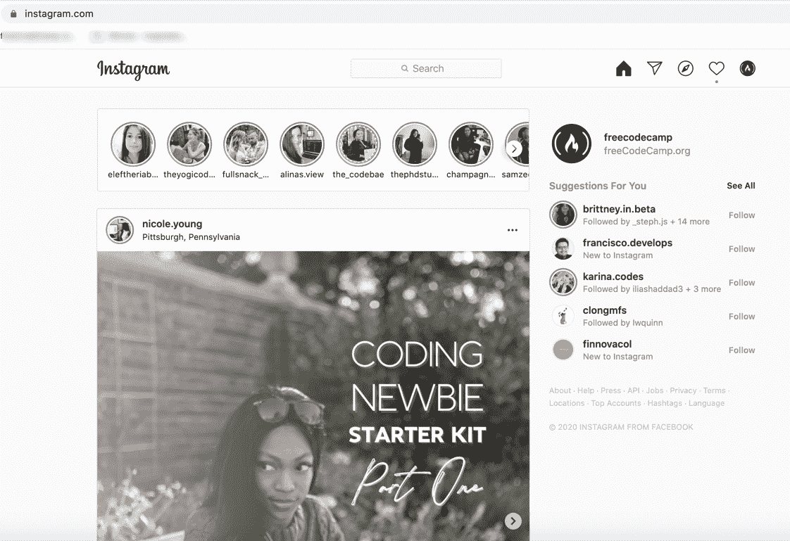

Instagram for Desktop

现在，我们将按照说明在您的移动设备上设置您的帐户。如果你想看看如何在你的台式机或笔记本电脑上做到这一点，只需跳到文章末尾的“奖金”部分。

### 如何在手机上注册 Instagram

#### 第一步:下载 Instagram 应用程序

首先，你需要这个应用程序。访问 app store 并下载(免费)。

#### 第二步:注册 Instagram

接下来，您需要创建一个帐户。选择一个用户名(如果需要，您可以稍后更改)和一个密码。输入这些值后，应用程序会自动让您进入下一步。

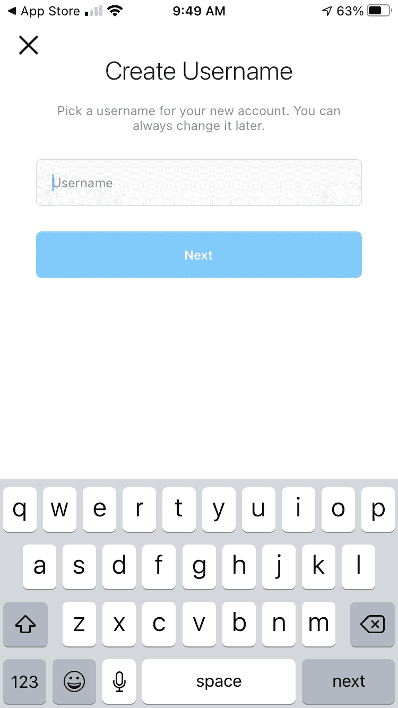

Choose your Instagram username (and password in the next step).

#### 第三步:添加个人资料照片和其他信息

帐户设置完成后，您需要添加一张个人资料照片。它不一定是你的脸的照片，但你应该添加一些东西。没有人想看到那个灰色的小图标。

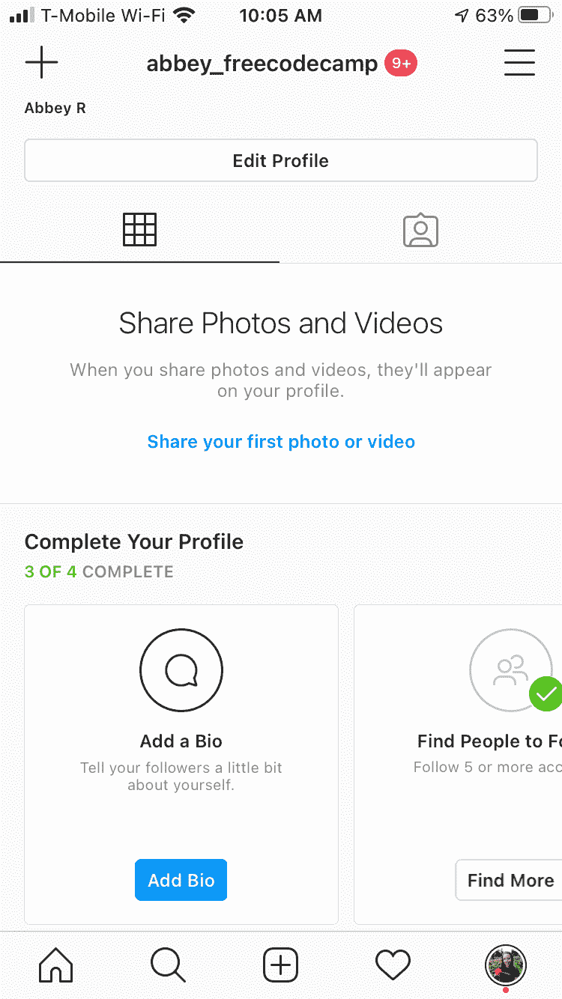

Complete the steps to fill out your profile.

你还可以添加个人信息、网站和任何其他你想让人们知道的信息(如上图所示)。许多人使用这个部分来介绍自己，链接到他们的个人网站等等。

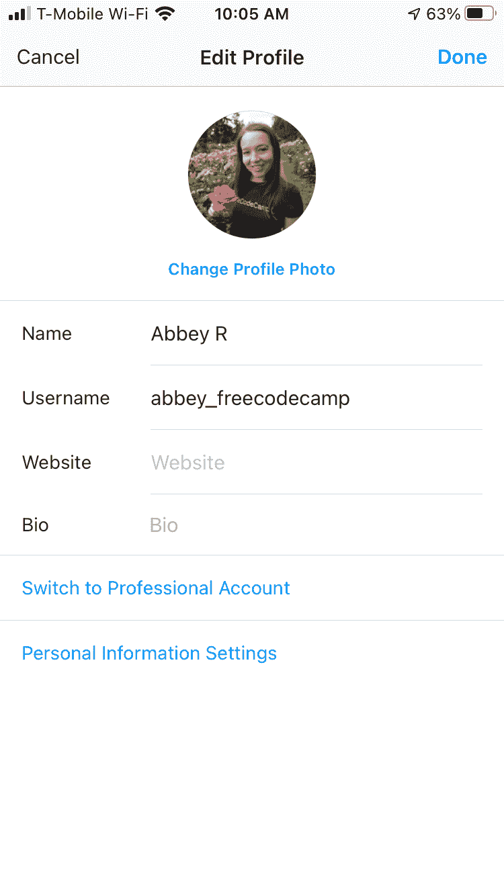

An example profile.

现在你的个人资料已经设置好了，你可以开始探索并发布到 Instagram 了。让我们深入了解一下您会发现的一些功能。

## 如何使用 insta gram——基础

为了充分利用你的 Instagram 账户，你应该分享一些东西。你不必一天多次分享，甚至每天都分享——但你应该定期分享。

不同的人有不同的策略，比如多久发布一次，一天中的什么时间，一周中的哪几天，等等。

如果你正在经营一个品牌/公司账户，或者你正试图增加你的追随者，并最终通过赞助等方式赚钱，这将对你更重要。

如果你只是想拥有一个可以分享宠物照片和放大他人声音的个人账户，那就由你来决定怎样做最有效。

现在，让我们来看看你将在主屏幕上看到的一些小按钮和图标，并了解更多关于你在 Instagram 上实际可以做的事情。

**注意**:从现在开始，我只会分享手机应用程序的信息和截图，因为这可能是你使用该网站的方式。

### 如何在 Instagram 上搜索

当你刚刚开始使用 Instagram 时，搜索是一个重要的功能。您会在屏幕底部的左侧找到搜索图标:

Magnifying glass = search icon (on home screen).

如果你点击小放大镜图标，你会被带到搜索页面。它在顶部显示了一个搜索栏，下面是一些受欢迎的帐户(照片和视频)，如下所示:

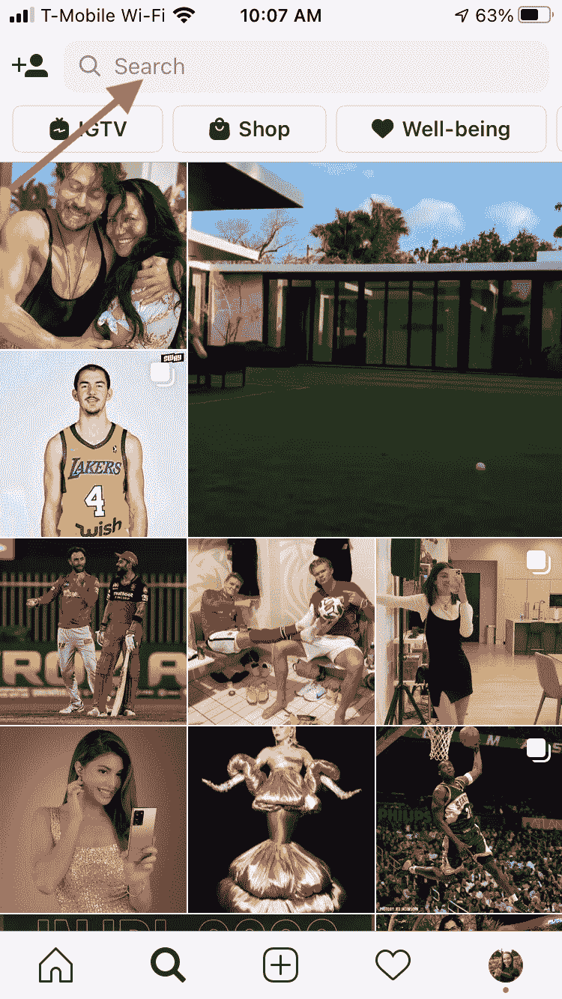

You can search for people by name or Username.

如果你想找一个特定的人，在搜索栏中输入他们的名字(或者他们的 Instagram 用户名，如果你知道的话)。找到他们后，您可以单击“关注”在您的订阅源中获取他们帐户的更新。

如果你只是想四处逛逛，关注长相有趣的人，你也可以在搜索页面上这样做。

### 如何找到 Instagram 主页(feed)

当你打开 Instagram 应用程序时，它会带你到主页。或者，如果你已经浏览并访问了另一个页面(如你的活动)，它会带你去那里。

要找到您的主页，请查看屏幕底部带有五个图标的菜单栏。您可以点击小房子图标回家:

Just tap the little house to get home (in this image, you're already there – so it's highlighted).

一旦你到了那里，你可以向下滚动查看人们分享了什么。在每个帖子上，你可以喜欢它(点击心形图标)，评论(点击语音气泡图标)，给这个人发送消息(点击小纸飞机或消息气泡图标)或保存帖子供以后使用(右边的小旗子图标)。

我将在下面更详细地讨论如何使用这些特性。

向下滚动时，您还可以在主页上看到最近的故事。更多关于下面的故事。

最后，在右上角，您会看到消息图标的另一个副本。如果你点击那个图标，你会看到别人给你发的消息，你可以从那里给其他 Instagram 用户发消息。下面还有更多。

**2020 年 10 月更新:如果你更新了 Instagram 应用，你可能会看到一个新的主屏幕，看起来像这样:**

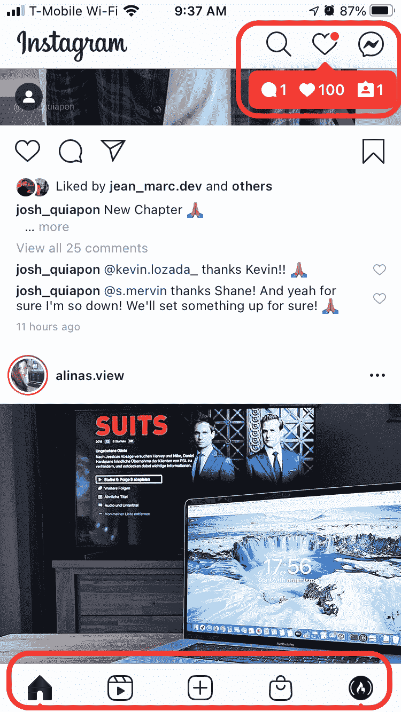

Updated homescreen.

您会看到您的活动按钮(心形)和搜索按钮(放大镜)现在位于右上角，靠近信息按钮。

沿着你的主屏幕底部，你会发现主页按钮(相同)，卷轴快捷方式(看起来像电影动作按钮)，添加照片按钮(相同)，一个“商店”按钮(看起来像一个购物袋)和你的个人资料图标(相同)。

购物标签是这里唯一真正新的东西。Instagram 为你推荐产品，你可以直接在那个页面购物。

### 如何在 Instagram 上添加照片或视频

好吧，你已经浏览了别人的内容，但现在你可能想添加你自己的内容。

#### 步骤 1:选择您想要分享的照片

要添加照片或视频，请单击主屏幕底部中间的加号(+)图标。您的“相机胶卷”将会弹出，您拍摄的最后一张照片会显示在顶部。如果需要，您可以向下滚动以查找旧照片。

在第一张照片的页面中间/右侧，您还会看到三个小图标。它们看起来像一个无穷大的符号，一对正方形和一个长方形，还有一对分层的正方形。下面有更多关于他们的信息。现在让我们只关注添加一张照片。

一旦你找到你想要的照片，只需点击它，一个蓝色的小轮廓就会出现在它的周围。

如果你想添加多张照片，点击右边的分层方块，然后你就可以选择多达 10 张照片。照片将按您选择的顺序显示(并将被编号)。

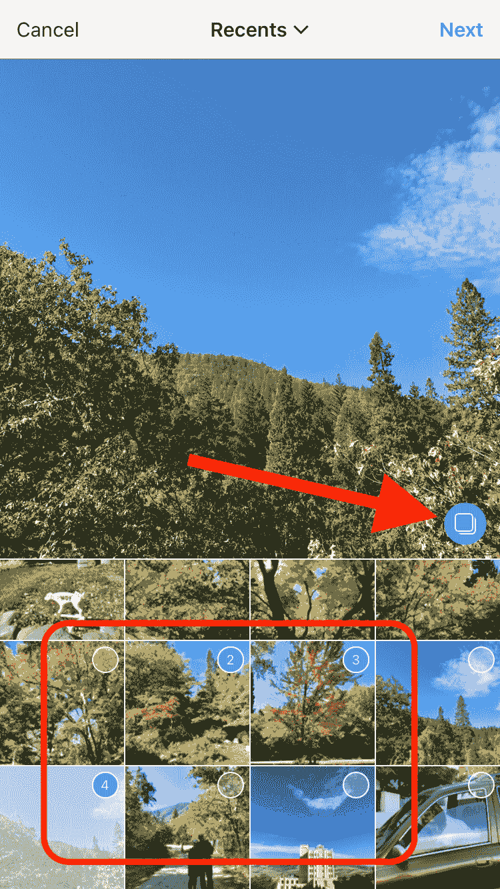

Add more than one photo to your post.

#### 第二步:添加滤镜或编辑你的照片(如果你愿意)

选择照片后，点击屏幕右上角的“下一步”。然后你可以选择滤镜——它们出现在照片下方的底部，并向你展示滤镜的预览。

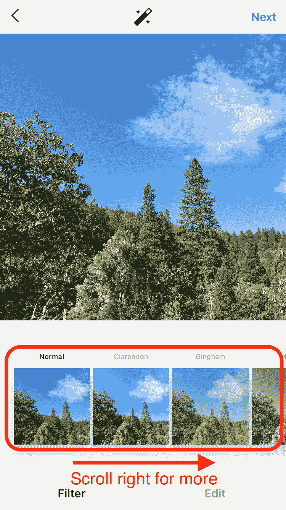

Filter options (scroll to the right to see more). Tap each option to see a preview.

如果您轻按其中一个滤镜选项，上面的主/大照片将会改变，以显示该滤镜将对照片产生的影响。如果您喜欢照片现在的样子，也可以不使用滤镜。

如果您想自定义和编辑照片的更多细节，只需选择“编辑”按钮(在“过滤器”选项的右侧)。

一个新的可滚动菜单将出现在您的照片下方，带有调整亮度、对比度和许多其他视觉功能的选项。点击每一个按钮来调整设置，直到你的照片看起来刚刚好。

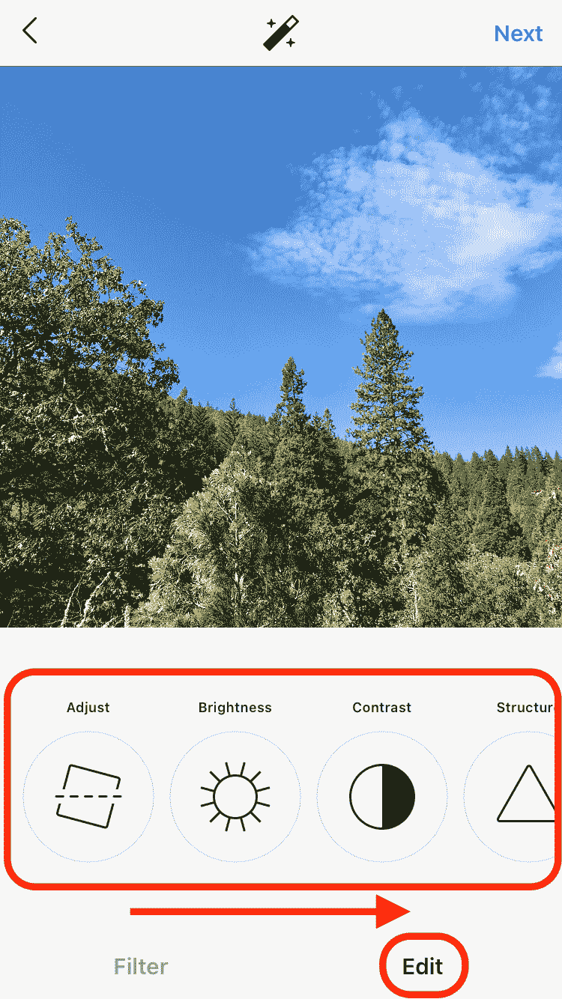

Scroll through the options. Click on each, and drag the toggle left and right to adjust the photo.

#### 第三步:在文章中添加文字、标签和位置

完成编辑后，点击右上角的“下一步”。您将被带到最后一个屏幕，在那里您可以添加标题、标签和位置。

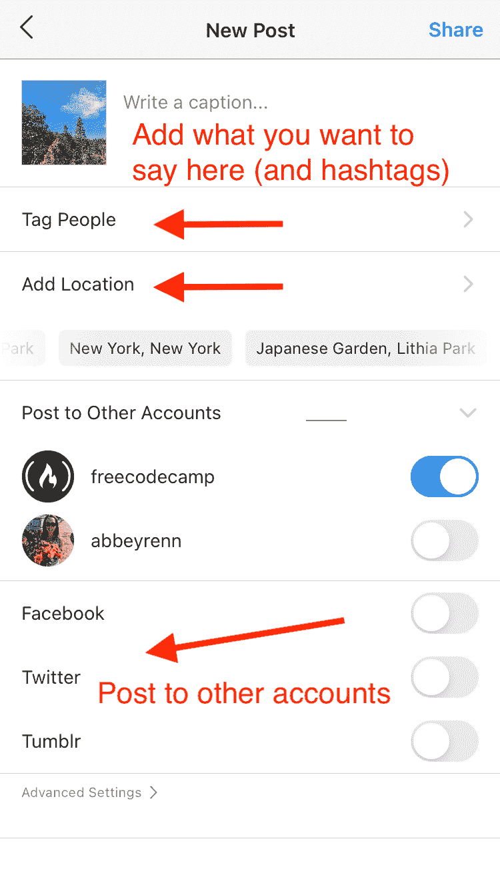

Add all the important info here.

首先，添加您的文本(如果您希望有文本)。然后，添加你的标签。要创建一个 hashtag，只需使用井号/井号/数字符号(#)后跟一个单词，比如#technology。没有空间。

当你创建标签时，Instagram 会提供匹配的标签列表。例如，如果我开始输入#tech，就会出现各种相关的标签，就像这样:

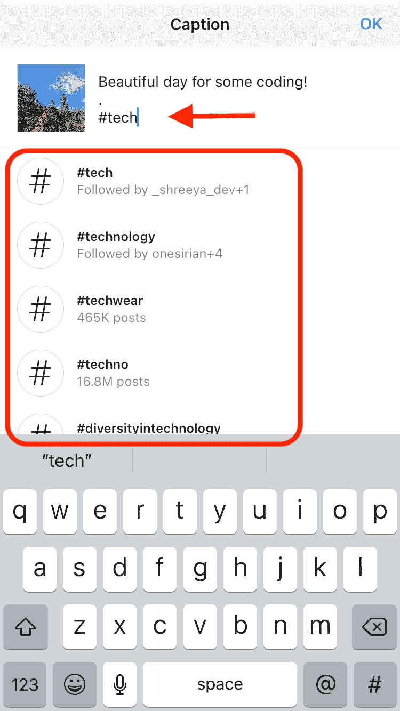

Pick from any of the related hashtags, or create your own.

点击您想要使用的标签。如果你愿意，你可以包含很多标签——只要在每个标签之间留一个空格。

添加文本和标签的一些技巧:

*   如果你想在段落之间创建空格，你需要在空格中添加/键入一个字符，否则 Instagram 会将其折叠。所以，当你输入一个句子/几个单词，想要一个空格和一个新段落时，按回车键，然后添加一个句号(。)然后再按回车键。句号会保留空格(如上图所示)。
*   如果你想让你的标题/文字更易读，考虑把它们分成多个小段落。
*   大多数人会在标题后面添加标签。如果你愿意，你可以只添加没有其他文本的标签。还可以添加表情符号。
*   确保你的标签与你分享的照片/信息相关。他们的目的是帮助人们找到他们正在搜索的照片/主题的类型。

如果有人在你的照片中，或者你想确保有人知道你的帖子，你可以标记他们。您将在文本空间下方看到一个“标记人物”选项。只需点击它，然后点击照片，添加他们的 Instagram 手柄。

提及某人的另一种方式是在你的文章中标记或@提及他们。例如，你可以说“今天在@freecodecamp 上学习 JavaScript”——这将让 freecodecamp 知道你提到了它们。

发布照片后，您还可以直接在照片中标记人物。只需点击照片右上方的三个点(下面有更多信息)，然后点击编辑。然后，您会看到一个在左侧标记人物的选项:

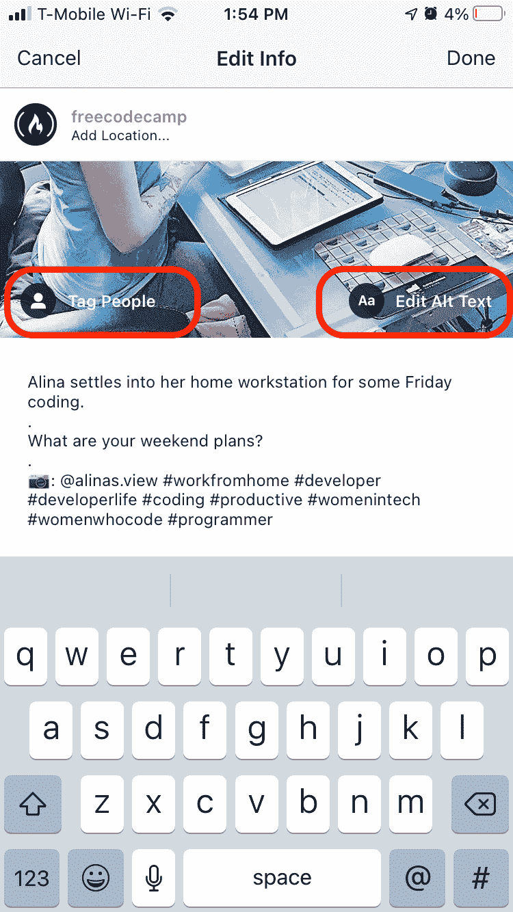

You can tag people in the photo directly, too.

您还可以添加替代文本，使您的图像更易于访问。

最后，如果你愿意，你可以添加一个位置。只需点击文本/标签部分下方的“添加位置”按钮。

Instagram 可能会推荐附近的地方，所以如果你看到你的位置，你可以从中选择一个。否则，您可以点击小右箭头来搜索一个特定的点。

#### 第四步:分享(和查看)你的作品！

一旦你完成了文本的撰写和标签的添加，你就可以分享你的照片了。

只需点击右上角的“分享”按钮，即可观看照片直播。一旦发布，它就会出现在你的主页上。您也可以通过点击您的个人资料来查看它——您的所有帖子都可以在那里看到。

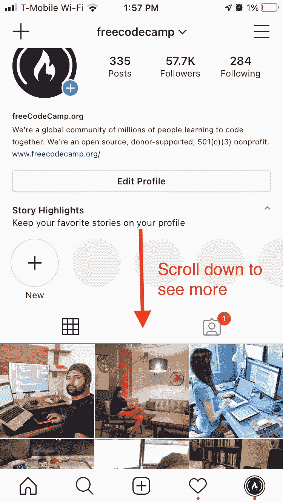

### 如何使用回旋镖和布局来升级您的照片共享游戏

也许你不只是想分享一张普通的照片。你想要一些很酷的动画或者你想要创建一个拼贴画。别担心——insta gram 让你用回旋镖和布局做到这一点。

#### 如何使用回旋镖

Boomerang 是一种有趣且更具互动性的分享图片的方式。它很短，所以人们可以在几秒钟内查看并获得整个体验。它引人注目，引人入胜，因为它会动。

好吧，那你怎么用回旋镖呢？当你选择要分享的照片时，你会看到我之前提到的三个符号(无限符号、小方块拼贴/矩形和分层方块)。我们现在将进入前两个。

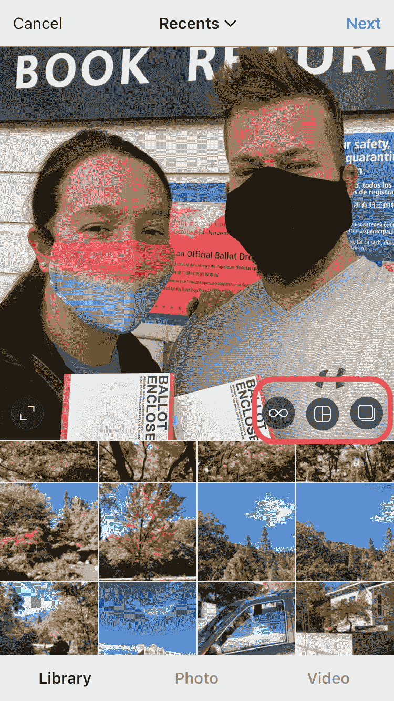

See the infinity symbol and collage symbol to its right? Those are Boomerang and Layout, respectively.

无限符号带来了回旋镖效应。它让小视频剪辑在一个循环中来回移动，因此被称为“回旋镖”。

如果你想使用这个效果，只需安装 boomerang(它会带你去 app store——点击“安装”，它是免费的)，然后回到 Instagram。

点击无限符号，你会得到一个快速回旋镖教程(如果你是第一次使用该应用程序)。下面是基本界面:

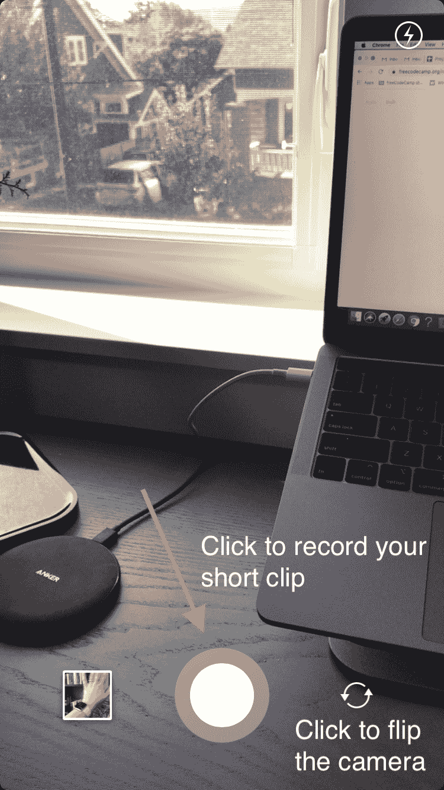

总结一下回旋镖的过程:通过点击圆形的白色按钮，拍摄一个移动的东西的短视频——比如你的几个朋友在挥手。要做到这一点，你实际上是在捕捉一系列照片(仅仅几秒钟)。Instagram 会帮你把它变成一个循环。

一旦你拍摄了一系列照片，你就可以选择分享到 Instagram、脸书或其他社交应用上。

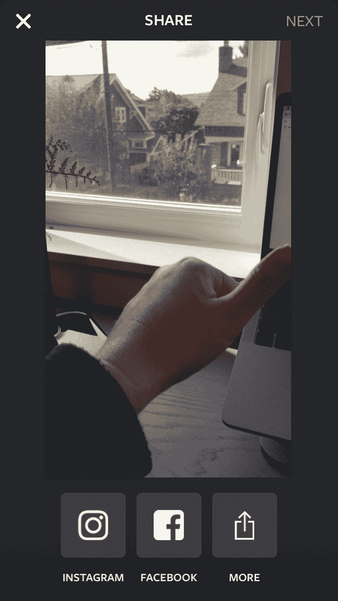

Choose Instagram, Facebook, or other apps. Or you can just save the Boomerang by clicking "Next" (upper right).

你可以选择其中一个，Boomerang 会带你回到应用程序，这样你就可以张贴你的 Boomerang(见上述过程)。或者你也可以直接点击右上角的“下一步”。这将把你的回旋镖保存到你的照片中，这样你就可以在闲暇时发布它。

#### 如何使用布局

那么，布局呢？假设你想在 Instagram 上最大化一张图片的影响力。你想分享多张照片，但不希望人们不得不滚动浏览。那么布局就是给你的。

如果您点按布局图标，您也会被带到 app store。去拿吧，免费的。然后回到 Instagram。

当你现在点击布局图标，它会带你到你的照片。只需选择其中的几个，然后在照片上方选择 Instagram 给你的布局选项之一。

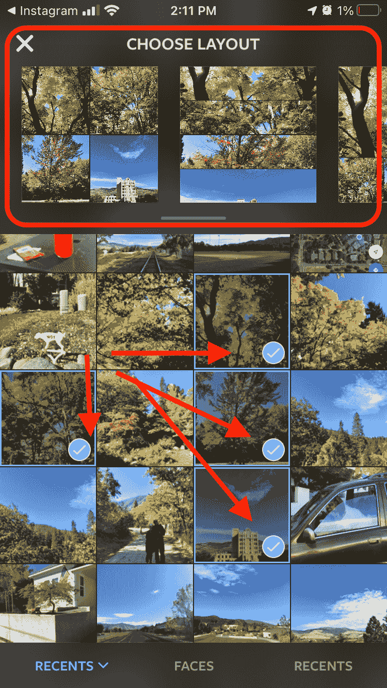

When you select your photos, they'll automatically appear in the layout options above.

您将在照片上方看到您的布局选项。布局会自动将您选择的照片放入这些布局选项中。

**提示**:如果你想要更精细的选项，只需选择屏幕底部的“最近”标签(带小箭头)，它会显示各种图像分组(如“最近”、“收藏夹”、“实时照片”等)。

无论如何，现在向右滚动，直到你看到你喜欢的布局。

一旦你点击了你最喜欢的排列，你就可以自定义它了。您可以:

*   向左/向右和向上/向下拖移每张照片以调整其大小
*   翻转或镜像照片以更改它们的方向
*   添加边框以获得视觉效果，或在照片之间创建更多间隔
*   如果您找到更合适的照片，请用另一张照片替换布局中的任何照片

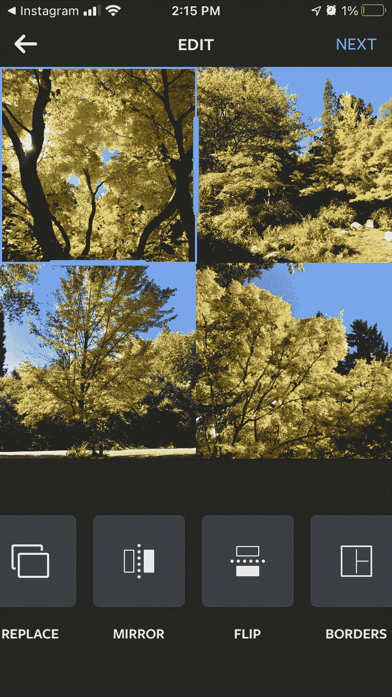

Layout customization options.

一旦你对你的酷合并感到满意，只需点击“保存”，然后你就可以像贴其他照片一样贴你的拼贴画了。

**提示** : Boomerang 和 Layout 在技术上是独立的应用程序，只会发布到你的 Instagram 账户上。因此，如果你在任何一个应用程序中，想回到 Instagram，只需双击你的主页按钮(或者无论如何都要回到你的主屏幕)，然后重新访问 Instagram。

### 如何在 Instagram 上保存帖子

如果你想保存某人的帖子——也许他们正在分享你想尝试的美味食谱，或者特别有用的编码技巧——有一个简单的方法可以做到这一点。

只需点击照片下方的小旗图标:

Click that flag icon, and the post will be saved.

该帖子将加入您保存的帖子。要访问它们，只需点击你的个人资料页面右上角的小汉堡菜单，你就会在那里看到它们。

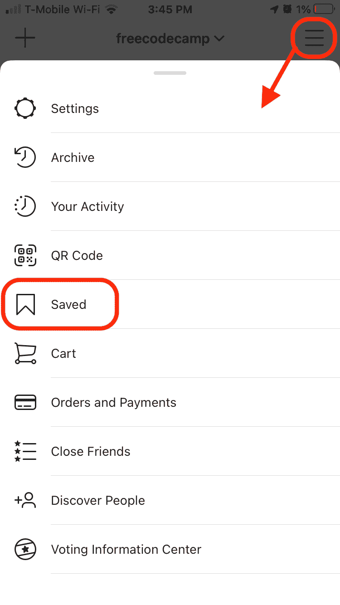

How to find your saved items (on your profile page, under the hamburger menu).

### 如何评论照片(或管理对您照片的评论)

有时你可能想在某人的帖子上留下评论。这很容易做到——你只需点击照片下方的小气泡图标(位于心形图标和信息图标之间)。

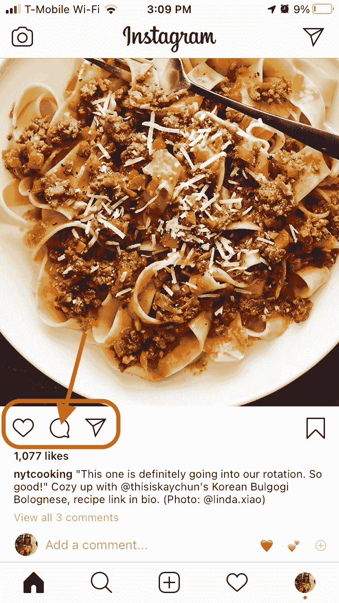

Click the little speech bubble icon below the photo to comment.

你将输入你的文本(你也可以包括表情符号)，然后点击“发布”。

你也可以喜欢人们的评论或者回复他们，无论是对你的帖子的评论还是对其他人的帖子的评论。若要喜欢评论，请轻按评论旁边的心形图标。要回复，只需点击评论下方的“回复”。

When you tap "Reply", it'll @mention the person whose comment it is (but you can delete that if you want).

最后，如果你在你的一篇帖子上看到负面或令人讨厌的评论，你可以删除它。只需从右向左滑动(从手机屏幕边缘),就会出现选项来锁定、报告或删除评论。

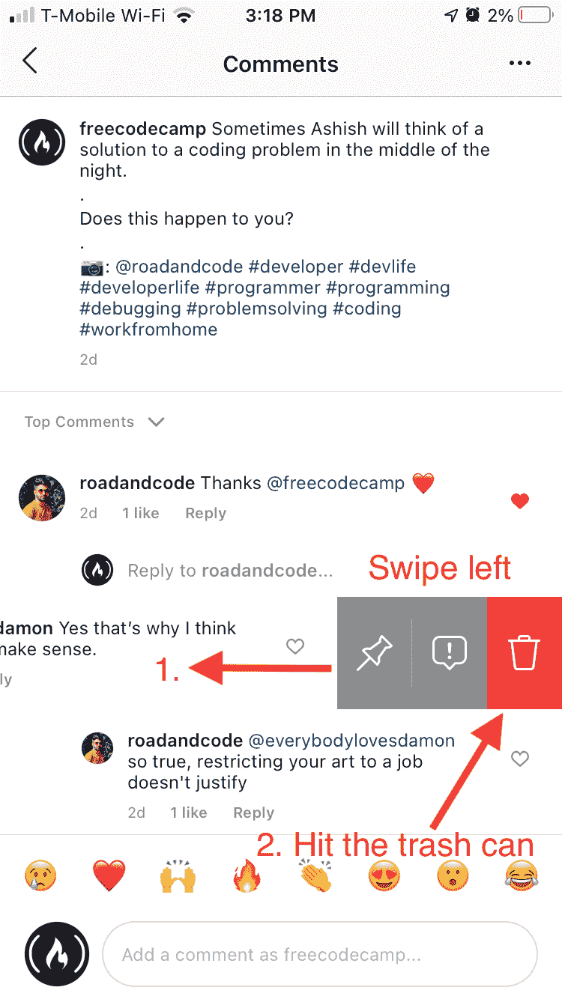

Swipe left from the edge of your phone screen (next to the comment), then select the delete icon.

**注意**:如果你是账户的所有者，你只能删除评论。如果您不是所有者，您仍然可以通过选择带有感叹号的小气泡来报告评论。

### 如何在 Instagram 上编辑或删除帖子

也许你忘了“提到某人”。也许你想到了更好的措辞。或者你真的需要删除一个帖子。你可以做到这一切，甚至更多。

只要找到你的帖子顶部的三个水平点(右上角，你名字的对面)，然后点击它们。

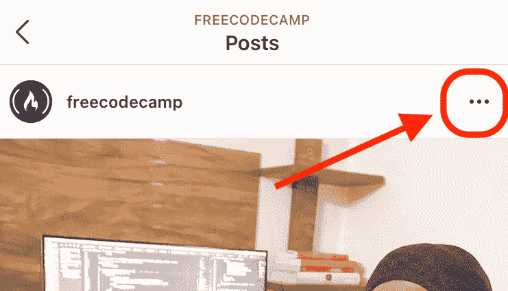

Click those three little dots above/to the right of the photo.

你会看到很多选项，比如“删除”、“关闭评论”、“编辑”等等。

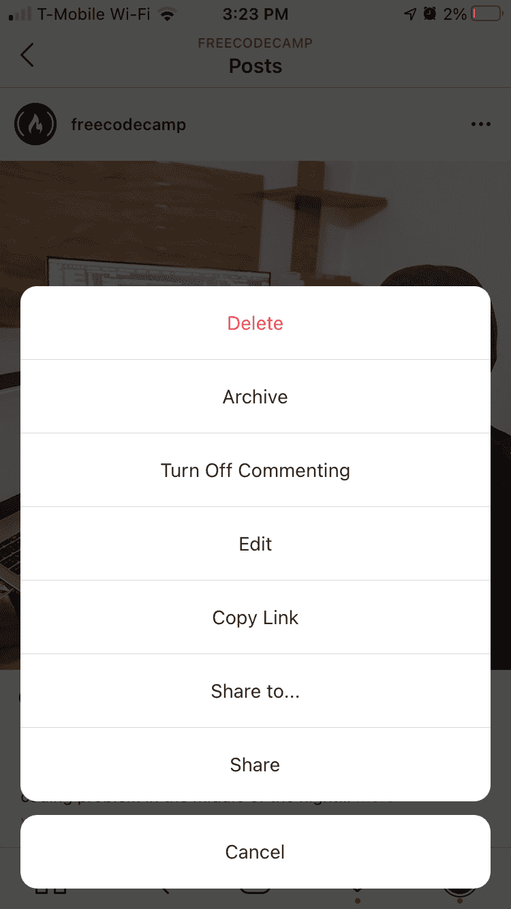

All the options that come up from those three little dots.

单击这些按钮中的任何一个来执行您需要执行的操作。

例如，如果你想编辑，只需点击“编辑”,它会带你进入草稿模式。

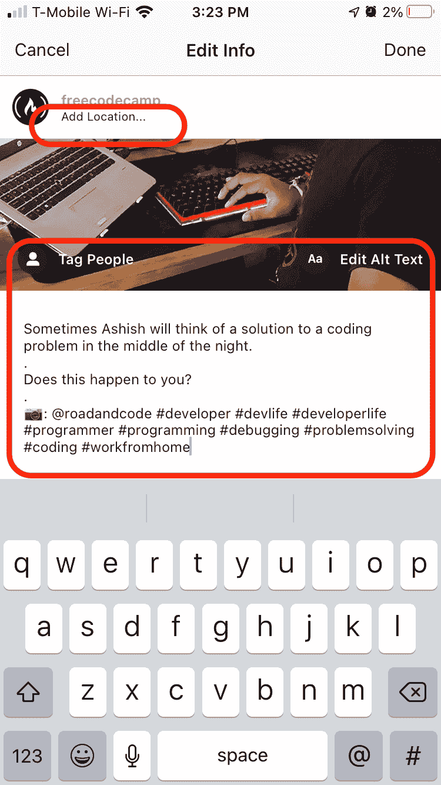

You can edit your text, hashtags, location, add tags, and add alt text. You can't change the photo(s).

然后点击你想要编辑的地方(你的标签，文本等等)并进行修改。您不能添加或删除图像，但文本是可变的。

### 如何在 Instagram 上查看您帐户的活动

通知是跟踪谁在关注你的帖子以及他们如何关注的好方法。

如果你想知道谁喜欢你的照片，关注你，评论你的照片，或者与你的内容互动，只需访问你的通知。

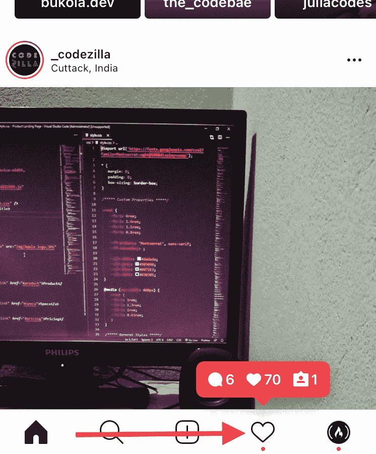

Click the little heart to view your notifications.

你会在底部菜单上看到一个心形图标。点击它，你所有的通知都会出现。您可以跟踪人们，或者点击通知，转到他们的评论或个人资料，等等。

您的通知按时间倒序显示，从最近到最近。

### 如何在 Instagram 上查找/编辑您的个人资料

有时，您可能希望更新您的个人资料照片或更改您的个人资料中的信息。

要做到这一点，只需点击屏幕右下角的个人资料照片，您将被带到您的个人资料。

Click your profile photo icon to visit your profile.

在那里你可以看到你发了多少帖子，有多少人关注你，以及你关注了多少人。

您还可以看到您存储的任何故事(“精彩部分”)、您发布的照片(在 9 方形网格图标下，左侧)和您添加标签的照片(在小人图标下，右侧)。

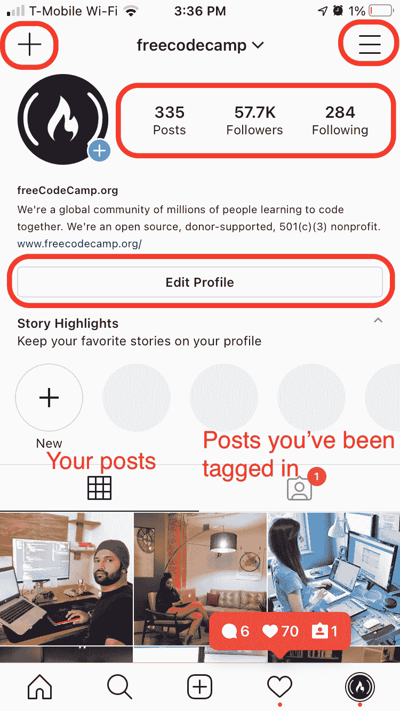

Your profile contains a lot of features...check 'em out.

您还会在右上角看到一个汉堡菜单，其中包含各种有用的信息(如您的设置、归档、已保存的项目等)。

左上角还有一个小加号(+)图标。点击它，你就可以发布一张照片、一个故事、一段视频或一卷视频。

您可以通过点击个人资料屏幕中间的大“编辑个人资料”按钮来编辑您的任何信息。

## 如何像专业人士一样使用 Instagram

如果你想超越基本的发帖和评论，有很多方法可以让你在更高的层次上使用这个应用。

### 如何在你的 Instagram 账户上分享(转发)别人的照片

Instagram 不像 Twitter——你不能只点击一个按钮就分享某人的照片。

有几种方法可以分享别人的照片。但是在你这么做之前，最好先获得对方的许可。

要做到这一点，你可以简单地在 Instagram 上给他们发一条消息(或者在其他地方，如果你知道他们的 Twitter 账号，等等)，然后问你是否可以用信用卡转发。

你也可以在照片的评论里@提到他们，问能不能转贴。

Instagram 的社区指南建议你这样做，以避免任何版权问题——所以最好等到你收到回复后再转发。

现在，回到方法上来:你可以截取照片，去掉你不想要的，然后分享截图(当然，要有适当的信用)。

但是，如果你想下载照片(质量更好)，需要几个额外的步骤。你可以在这本优秀的指南中找到详细的概述[(针对台式机/笔记本电脑，而不是你的移动设备)。](https://www.freecodecamp.org/news/instagram-picture-download-guide/)

还有一些免费的转帖应用，比如 iOS 版的 [Repost+](http://repostapp.com/) ，或者安卓版的 [Regram](https://play.google.com/store/apps/details?id=com.kimcy929.repost&hl=en_US&gl=US) 。如果你想包含原始文章的标题/标签，这些也可以帮助你(这样你就不必重新输入所有内容)。

再次强调——当你分享别人的作品时，要记得寻求许可并给予肯定。

### 如何在 Instagram 上发送消息

比方说，你在 Instagram 上找到一个你认识的人，想给他们发一条关于他们的内容或者生活的信息。如果你不想公开评论他们的帖子，你可以直接给他们发私信。

在你的主页上，点击屏幕右上角的小图标(它看起来像一架纸飞机或者一个信息泡泡)。

当你这样做的时候，你会被带到你的信息。如果你已经有消息等着你，你可以点击一个来阅读和回复。

如果您想写一封新邮件，请点击右上角的记事本/铅笔图标。你需要选择要发送给谁(你可以搜索，或者从弹出的你关注的人列表中选择)。

一旦你选择了一个人，你可以点击右上角的“聊天”,然后你会被带到信息界面。

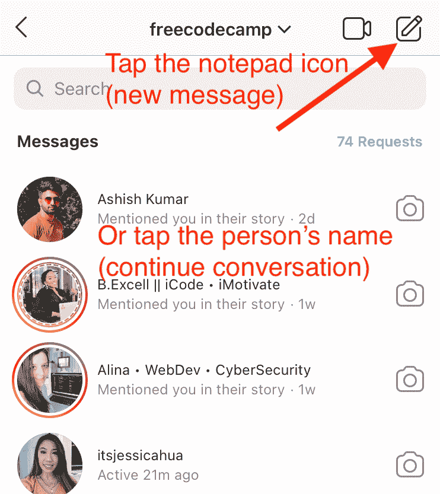

You can start a new convo or continue an old one.

如果您想继续对话，只需在您的对话列表中点击该人的姓名(如上所示)。

### 如何使用 Instagram 故事

故事让你以一种不那么永久的方式分享照片和视频。你在那里分享的任何媒体都会停留 24 小时才会消失(除非你保存它或者分享到你的订阅源)。

因此，它更像 Snapchat，让你可以让你的粉丝快速浏览你生活中的小瞬间，快速分享你想分享的消息，等等。

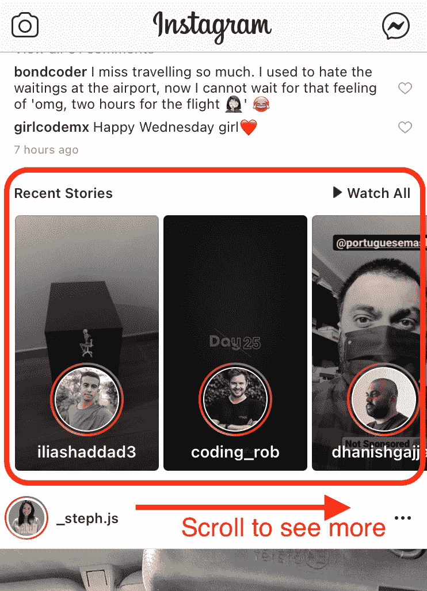

Recent stories will show up in your feed if you scroll down.

#### 如何查看别人的 Instagram 故事

要查看故事，要么滚动浏览你的订阅源直到你看到一些(如上)，要么从你的主页顶部选择某人的故事。

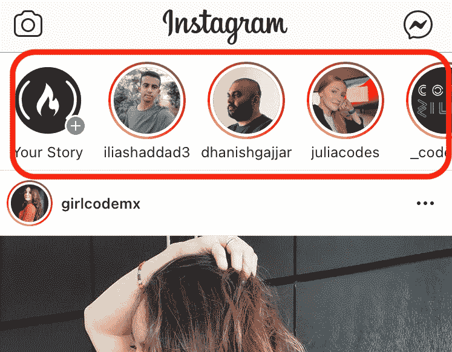

Click on one of the users to see their recent stories. Scroll right for more.

如果你只是想看看别人的故事，你可以滚动浏览。或者，如果您不想错过任何内容，可以单击“全部观看”选项卡。

一旦你点击了一个故事，它会滚动显示自从你上次查看(在过去的 24 小时内)以来，这个人已经发表了多少篇故事。然后，当你完成了他们的故事，它会移动到列表中的下一个人的故事。

如果你想在一个人的故事之间来回滚动，或者在不同的人之间来回滚动(也许你没有很好地看完最后一个剪辑)，只需点击屏幕的左侧和右侧，就可以在图像/视频或人之间移动。

An example of someone's story.

要退出故事，只需点击右上角的小 X。

#### 如何创建自己的 Instagram 故事

若要将您自己的故事添加到 Instagram，请转到您主页的顶部。在那里，你会看到一个“你的故事”图标，上面有你的个人资料图片和一个小“+”号。(在您照片的右侧，您会看到其他最近分享过故事的人。)

点击你的照片，你会被带到故事界面。

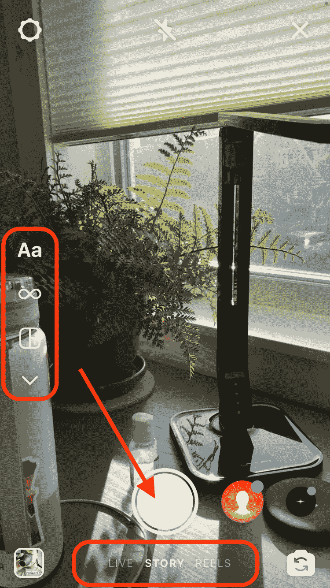

The stories interface.

当你第一次打开它时，它是为自拍而设置的。但你可以翻转相机，或者添加照片或手机上已经有的其他内容。只需选择左下角的相机胶卷图标，它会带你到你的照片。

选择你想要分享的内容(一张或多张图片——如果你想分享多张图片，右上角有一个小小的“选择多张”标签),然后你会被带到定制屏幕(如上图所示)。

在那里，您可以通过屏幕顶部的菜单选项添加文本、标记图像、添加效果等等。

**提示**:如果你从屏幕两侧向左或向右滑动，不同的滤镜将应用于你的图像。

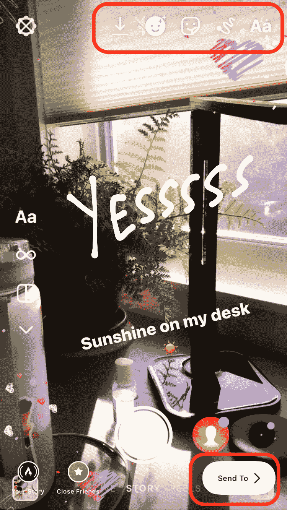

I added text, drew on it, and added the little heart effect (all from the menu at the top of the screen).

一旦你玩转并制作了你自己的图片或视频，只需点击右下角的“发送”按钮。你可以选择是否向所有人展示这个故事(“你的故事”)，只向亲密的朋友展示，还是向特定的人展示。

一旦你点击“发送”，你的故事将会 24 小时直播。

**注意**:如果你想更新你的故事设置(比如谁可以看到他们，你在哪里分享他们，等等)，只需点击故事屏幕右上角的设置齿轮。

### 如何在 Instagram 上直播

如果你想分享正在发生的事情，Instagram 提供了一个“实时”功能。这有点像用摄像机直播你的生活，让全世界都看到。

要访问它，请点击主屏幕顶部的“你的故事”图标。在故事屏幕的底部，你会看到三个选项:现场，故事(将被突出显示)，和卷轴。

点击“直播”，你将被带到录制屏幕。

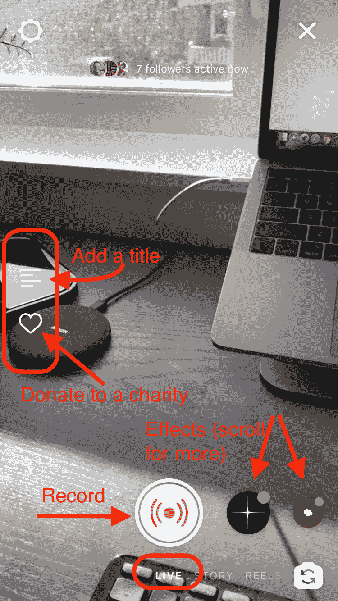

Your Live recording screen - effects and options included.

你会看到各种各样的小选项:添加文本的地方，你可以使用的过滤器，左上角的设置。你可以记录自己，或者翻转相机来显示你正在看的东西(右下角的小箭头)。

一旦你点击圆形录制按钮(屏幕底部中央)，Instagram 将检查你的连接，然后开始广播。完成后，点击右上角的“结束”即可。你会看到分享或删除实时视频的选项。

### 如何使用 Instagram 卷轴

卷轴只是在 Instagram 上分享视频的另一种方式——但这些视频是短片(大约 15 秒长)，当你播放它们时会循环播放。

要创建一个卷轴，只需从故事屏幕中选择“卷轴”选项。当您按下圆形播放按钮时，它会录制长达 15 秒钟的时间(如果您愿意，可以通过再次按下播放按钮来提前停止)。

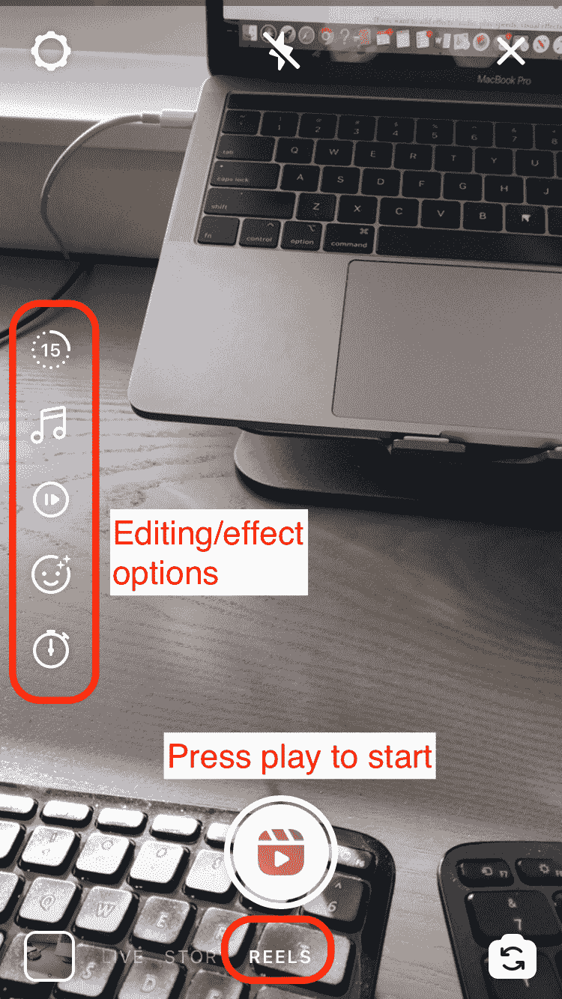

Your Reels recording screen.

**注意**:如果你在 15 秒结束前停止播放，你会在屏幕左侧看到编辑/效果选项。如果您让它持续 15 秒，它将开始循环播放您的片段，您将看不到效果。

要从那里访问效果，只需在视频循环时单击屏幕左上角的小后退箭头。要继续发布，请点击右下角的前进箭头。

当你点击右箭头，你会看到“分享到探索卷轴”的选项。您还可以打开或关闭是否要将其分享到您的订阅源。可以马上分享，也可以存成草稿。

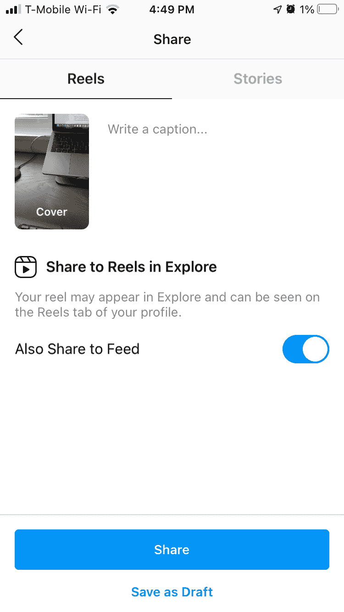

Choose whether to save or share your Reel.

如果您想添加效果(音频、播放速度、视觉效果、计时器——可让您选择要保留/共享的卷轴部分——以及对齐选项),只需点击每一项并进行播放。

一旦你完成润色你的卷轴，点击右/下一个箭头来预览你的作品。当你准备好了，再次点击下一步，你将得到共享选项。

## Instagram 礼仪——一些发布的注意事项

### 该表扬的时候一定要表扬

如果你想分享/转发别人的图片，请注明出处。大多数人都乐于让其他人分享他们的图片、艺术、视频等等——只要你给予适当的信任。

那你是怎么做到的呢？如上所述，通过直接消息联系账户所有者，询问您是否可以转贴他们的内容(带信用)。

如果他们说是，请确保在转贴内容时@提及他们的帐户。这很简单，只需键入@符号，然后输入他们的帐户名称。当你看到它弹出，点击它，他们会被标记。他们会收到你提到他们的通知。

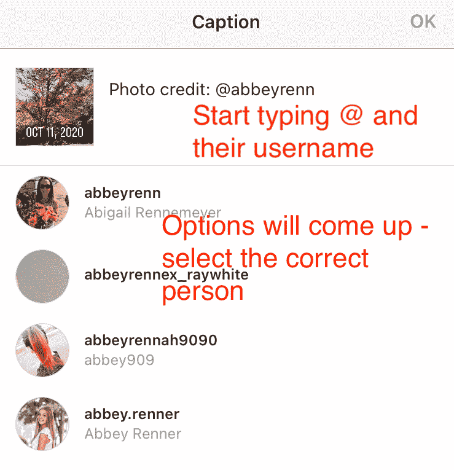

如果他们说不，尊重他们的意愿，只是从他们的帖子中获得个人灵感。

**注意**:一些账户所有者会在他们的个人资料中提到转帖，所以最好先查看一下。

### 使用好的标签

一定要使用合适的标签来帮助人们找到你的帖子。保持你的标签与你分享的内容相关，不要只是添加流行的标签来试图让你的帖子出现在搜索中。

例如，如果你分享一张你在笔记本电脑上编码的图片，一些有用的标签可能是#编码、#编程、# web 开发、#软件开发、#javascript、#开发者等等。

不要只是把#今日照片或#摄影放在那里...除非你是摄影师。

### 不要给人们发关于 collabs 或最新赚钱计划的垃圾邮件

你可能会在照片上看到类似“X 人帮我赚了几千块钱。我非常感谢他们的帮助。你也可以！”或者类似奇怪的不相关的东西。

如果您在照片上看到这些评论，您可以删除它们。

您还可能会看到一些评论，要求帐户所有者与他们合作。如果这是一个严肃的调查，这是可以的，但你不应该联系别人，除非他们正在做的事情与你正在做的事情非常吻合。垃圾评论或信息是不受欢迎的。

### 不要刻薄

Instagram 是一个普遍积极和支持的社区。当然，和其他地方一样，这里也有巨魔，但不要成为他们中的一员。

如果你有评判或负面的评论或情绪，不要说出来。

## 现在你可以像专业人士一样使用 Instagram 了！

无论你只是管理你的个人账户，还是为你的公司或雇主分享内容，你都应该有工具来充分利用 Instagram 及其众多功能。

请记住——这个应用程序有比我在这里介绍的更多的内容。了解 Instagram 的最好方式就是玩玩它。点击每个图标，尝试每种效果。边做边学，对吧？

祝你幸福！

### 额外收获:如何在台式机或笔记本电脑上注册 Instagram

#### 第一步:参观 instagram.com

如果你用的是台式机或笔记本电脑，去[instagram.com](https://www.instagram.com/)你会发现下面的主页:

Instagram's homepage (if you're not signed in/don't have an account)

您将看到几个选项。您可以:

*   登录(如果您已经有帐户)，
*   用脸书登录(Instagram 归脸书所有，所以他们选择了社交登录选项)，
*   或者没有账号就报名(朝向下方)。

#### 第二步:注册一个账户

如果您没有帐户，请单击“注册”。您将进入以下屏幕:

Sign in with Facebook, or sign up for an account

你会发现你仍然可以选择登录脸书。但如果你不想这样做，只需填写要求的信息，然后点击“注册”。

**一些提示:**

*   你确实需要使用一个真实的电子邮件或手机号码(因为 Instagram 会发送一个确认码，你需要在那里注册)。如果你愿意，你可以使用一个“测试”电子邮件——像 jane+test@heremail.com 或 jane+instagram@heremail.com(只要你的电子邮件实际上是 jane@heremail.com)。
*   如果你不想的话，你可以不用全名——可以是你的名和姓的首字母，也可以完全是别的名字。
*   选择能反映您的身份、您将共享的内容等的用户名。它必须是独一无二的，Instagram 会告诉你(带一个小勾号)你选的那个是否有效。
*   使用密码生成器为您生成并保存安全密码。

#### 第三步:输入确认码

点击“注册”后，您将进入要求输入确认码的屏幕，如下所示:

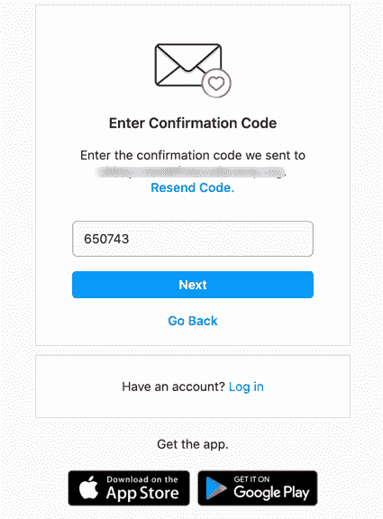

The code field will be blank - I've entered a sample code here :)

检查您的电子邮件或手机(无论您在上面提供了哪种方法),并输入发送到那里的代码。单击下一步。

#### 第四步:跟随一些人开始

然后你会被带到一个页面，上面全是推荐关注的人:

Instagram suggests some initial accounts for you to follow to get started. Pick a few and scroll down.

从列表中选择几个(或至少一个)，点击“关注”并向下滚动。你会在底部看到一个蓝色的“开始”按钮，点击它。

#### 第五步:完成输入您的信息

最后，您将被带到您的主页，看起来像这样:

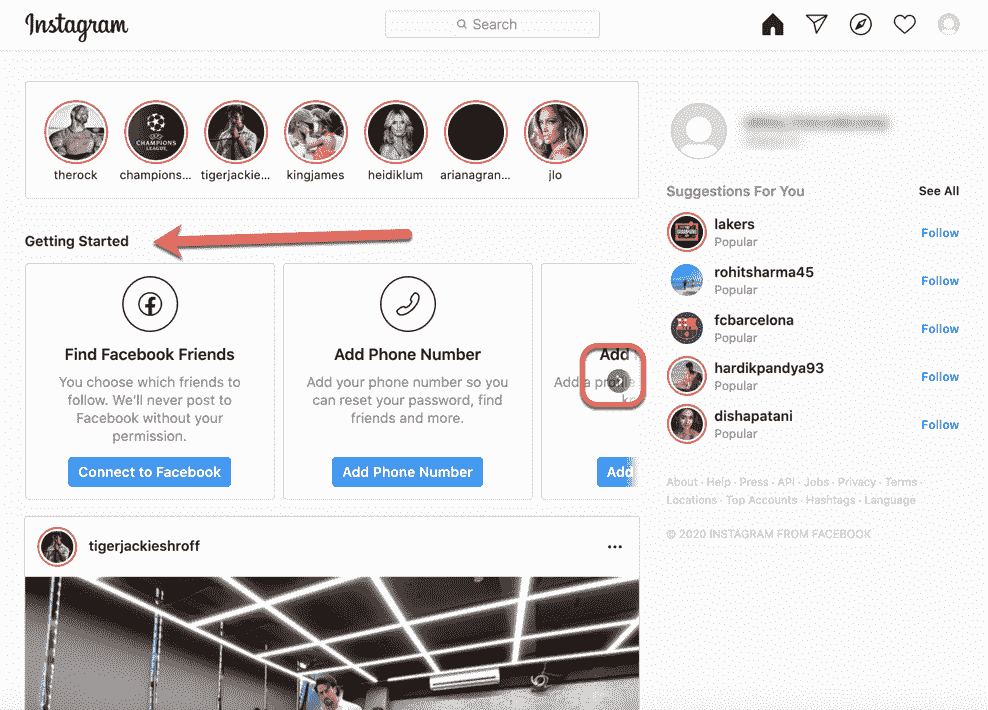

Click through the "getting started" suggestions - most importantly, add a profile picture (scroll to the right with the little arrow).

请注意，根据您在上一步中关注的人，您的主页看起来会有所不同。

在顶部的“入门”部分，你可以在 Instagram 上找到脸书的朋友，添加更多信息，但最重要的是——**添加一张个人资料照片**。

请记住，你的个人资料照片不一定是你自己的真实照片，但如果你想让人们知道你是谁，它会很有帮助。

如果没有，你可以添加任何你喜欢的照片。但肯定要补充点什么。

一旦你添加了你的照片(和任何其他信息)，那个“开始”部分将会消失，你只会看到你的主页。