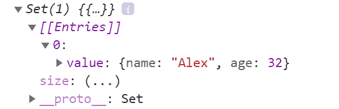
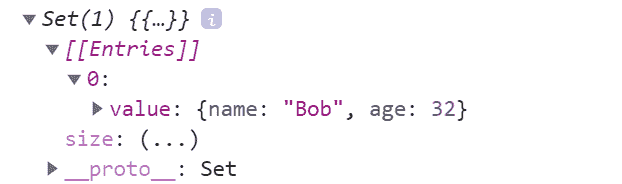

# 如何使用 JavaScript 集合——映射和设置

> 原文：<https://www.freecodecamp.org/news/how-to-use-javascript-collections-map-and-set/>

在 JavaScript 中，`objects`用于将多个值存储为一个复杂的数据结构。

用花括号`{…}`和一列属性创建一个对象。属性是一个键值对，其中`key`必须是一个字符串，`value`可以是任何类型。

另一方面，`arrays`是一个有序的集合，可以保存任何类型的数据。在 JavaScript 中，数组是用方括号`[...]`创建的，并且允许重复元素。

在 ES6 (ECMAScript 2015)之前，JavaScript `objects`和`arrays`是处理数据集合的最重要的数据结构。除此之外，开发者社区没有太多的选择。即便如此，对象和数组的组合能够在许多情况下处理数据。

然而，也有一些缺点，

*   对象键只能是类型`string`。
*   对象不保持插入其中的元素的顺序。
*   对象缺少一些有用的方法，这使得它们在某些情况下很难使用。比如，你不能很容易地计算出一个物体的大小(`length`)。同样，枚举一个对象也不是那么简单。
*   数组是允许重复的元素的集合。支持只有不同元素的数组需要额外的逻辑和代码。

随着 ES6 的引入，我们有了两个新的数据结构来解决上面提到的缺点:`Map`和`Set`。在本文中，我们将仔细研究这两者，并了解如何在不同的情况下使用它们。

## JavaScript 中的地图

`Map`是键-值对的集合，其中键可以是任何类型。`Map`记住元素添加到其中的原始顺序，这意味着数据可以按照插入的顺序进行检索。

换句话说，`Map`同时具有`Object`和`Array`的特征:

*   像对象一样，它支持键值对结构。
*   像数组一样，它会记住插入顺序。

### **如何用 JavaScript 创建和初始化地图**

新的`Map`可以这样创建:

```
const map = new Map();
```

它返回一个空的`Map`:

```
Map(0) {}
```

创建`Map`的另一种方法是使用初始值。下面是如何创建一个具有三个键值对的`Map`:

```
const freeCodeCampBlog = new Map([
  ['name', 'freeCodeCamp'],
  ['type', 'blog'],
  ['writer', 'Tapas Adhikary'],
]);
```

它返回一个包含三个元素的`Map`:

```
Map(3) {"name" => "freeCodeCamp", "type" => "blog", "writer" => "Tapas Adhikary"}
```

### **如何在 JavaScript 中向地图添加值**

要给地图添加值，请使用`set(key, value)`方法。

`set(key, value)`方法有两个参数，`key`和`value`，其中键和值可以是任何类型，一个原语(`boolean`、`string`、`number`等)。)或一个对象:

```
// create a map
const map = new Map();

// Add values to the map
map.set('name', 'freeCodeCamp');
map.set('type', 'blog');
map.set('writer', 'Tapas Adhikary');
```

输出:

```
Map(3) {"name" => "freeCodeCamp", "type" => "blog", "writer" => "Tapas Adhikary"}
```

请注意，如果您多次使用同一个键向`Map`添加一个值，它将总是替换先前的值:

```
// Add a different writer
map.set('writer', 'Someone else!');
```

因此，输出将是:

```
Map(3) 
{"name" => "freeCodeCamp", "type" => "blog", "writer" => "Someone else!"}
```

### **如何用 JavaScript 从地图中获取值**

要从`Map`中获取一个值，使用`get(key)`方法:

```
map.get('name'); // returns freeCodeCamp
```

### **JavaScript 中所有关于映射键的内容**

关键字可以是任何类型、原语或对象。这是`Map`和普通 JavaScript 对象的主要区别之一，普通 JavaScript 对象的键只能是一个字符串:

```
// create a Map
const funMap = new Map();

funMap.set(360, 'My House Number'); // number as key
funMap.set(true, 'I write blogs!'); // boolean as key

let obj = {'name': 'tapas'}
funMap.set(obj, true); // object as key

console.log(funMap);
```

以下是输出:

```
Map(3) 
{
  360 => "My House Number", 
  true => "I write blogs!", 
  {…} => true
}
```

常规的 JavaScript 对象总是将键视为字符串。即使向它传递原语或对象，它也会在内部将密钥转换为字符串:

```
// Create an empty object
const funObj = {};

// add a property. Note, passing the key as a number.
funObj[360] = 'My House Number';

// It returns true because the number 360 got converted into the string '360' internally!
console.log(funObj[360] === funObj['360']);
```

### **在 JavaScript 中映射属性和方法**

JavaScript 的`Map`有内置的属性和方法，使其易于使用。以下是一些常见的:

*   使用`size`属性知道一个`Map`中有多少个元素:
*   用`has(key)`方法搜索一个元素:
*   用`delete(key)`方法删除一个元素:
*   使用`clear()`方法一次移除`Map`中的所有元素:

```
console.log('size of the map is', map.size);
```

```
// returns true, if map has an element with the key, 'John'
console.log(map.has('John')); 

// returns false, if map doesn't have an element with the key, 'Tapas'
console.log(map.has('Tapas')); 
```

```
map.delete('Sam'); // removes the element with key, 'Sam'.
```

```
// Clear the map by removing all the elements
map.clear(); 

map.size // It will return, 0 
```

### **map iterator:JavaScript 中的 key()、values()和 entries()**

方法`keys()`、`values()`和`entries()`返回一个`MapIterator`，这很好，因为你可以直接在它上面使用一个`for-of`或`forEach`循环。

首先，创建一个简单的`Map`:

```
const ageMap = new Map([
  ['Jack', 20],
  ['Alan', 34],
  ['Bill', 10],
  ['Sam', 9]
]);
```

*   获取所有密钥:
*   获取所有值:
*   获取所有条目(键值对):

```
console.log(ageMap.keys());

// Output:

// MapIterator {"Jack", "Alan", "Bill", "Sam"}
```

```
console.log(ageMap.values());

// Output

// MapIterator {20, 34, 10, 9}
```

```
console.log(ageMap.entries());

// Output

// MapIterator {"Jack" => 20, "Alan" => 34, "Bill" => 10, "Sam" => 9}
```

### **如何在 JavaScript 中迭代地图**

您可以使用`forEach`或`for-of`循环来迭代一个`Map`:

```
// with forEach
ageMap.forEach((value, key) => {
   console.log(`${key} is ${value} years old!`);
});

// with for-of
for(const [key, value] of ageMap) {
  console.log(`${key} is ${value} years old!`);
}
```

两种情况下的输出是相同的:

```
Jack is 20 years old!
Alan is 34 years old!
Bill is 10 years old!
Sam is 9 years old!
```

### **如何在 JavaScript 中将对象转换成地图**

您可能会遇到需要将`object`转换成类似`Map`的结构的情况。你可以使用`Object`的`entries`方法来实现:

```
const address = {
  'Tapas': 'Bangalore',
  'James': 'Huston',
  'Selva': 'Srilanka'
};

const addressMap = new Map(Object.entries(address));
```

### **如何用 JavaScript 将地图转换成对象**

如果你想做相反的事情，你可以使用`fromEntries`方法:

```
Object.fromEntries(map)
```

### **如何在 JavaScript 中把地图转换成数组**

有几种方法可以将地图转换为数组:

*   使用`Array.from(map)`:
*   使用扩展运算符:

```
const map = new Map();
map.set('milk', 200);
map.set("tea", 300);
map.set('coffee', 500);

console.log(Array.from(map));
```

```
console.log([...map]);
```

### 地图与物体:什么时候应该使用它们？

`Map`兼有`object`和`array`的特点。然而，由于以`key-value`格式存储数据的本质，`Map`更像是一个`object`而不是`array`。

不过，与物体的相似性到此为止。如你所见，`Map`在很多方面都是不同的。那么，你应该在什么时候使用哪一个呢？你如何决定？

在以下情况下使用`Map`:

*   你的需求没那么简单。您可能希望创建非字符串的键。将对象存储为键是一种非常强大的方法。默认情况下给予你这个能力。
*   您需要一个可以对元素进行排序的数据结构。常规对象不保持其条目的顺序。
*   您正在寻求不依赖 lodash 这样的外部库的灵活性。您最终可能会使用类似 lodash 的库，因为我们找不到像 has()、values()、delete()这样的方法，或者像 size 这样的常规对象属性。默认情况下，Map 提供了所有这些方法，让您轻松做到这一点。

在以下情况下使用对象:

*   你没有上面列出的任何需求。
*   你依赖于`JSON.parse()`，因为`Map`不能用它来解析。

## 在 JavaScript 中设置

一个`Set`是可以是任何类型的唯一元素的集合。`Set`也是元素的有序集合，这意味着元素将按照它们被插入的顺序被检索。

JavaScript 中的`Set`的行为方式与数学集合相同。

### 如何在 JavaScript 中创建和初始化集合

新的`Set`可以这样创建:

```
const set = new Set();
console.log(set);
```

并且输出将是空的`Set`:

```
Set(0) {}
```

下面是如何用一些初始值创建一个`Set`:

```
const fruteSet = new Set(['🍉', '🍎', '🍈', '🍏']);
console.log(fruteSet);
```

输出:

```
Set(4) {"🍉", "🍎", "🍈", "🍏"}
```

### **在 JavaScript 中设置属性和方法**

`Set`具有向其中添加元素、从中删除元素、检查其中是否存在元素以及完全清除元素的方法:

*   使用`size`属性知道`Set`的大小。它返回其中元素的数量:
*   使用`add(element)`方法向`Set`添加一个元素:

```
set.size
```

```
// Create a set - saladSet
const saladSet = new Set();

// Add some vegetables to it
saladSet.add('🍅'); // tomato
saladSet.add('🥑'); // avocado
saladSet.add('🥕'); // carrot
saladSet.add('🥒'); // cucumber

console.log(saladSet);

// Output

// Set(4) {"🍅", "🥑", "🥕", "🥒"}
```

我喜欢黄瓜！再加一个怎么样？

哦不，我不能——`Set`是 **特有的** 元素的集合:

```
saladSet.add('🥒');
console.log(saladSet);
```

输出与之前相同——没有任何东西添加到`saladSet`中。

*   使用`has(element)`方法搜索我们是否有胡萝卜(🥕)或者西兰花(🥦)中的`Set`:
*   使用`delete(element)`方法将鳄梨(🥑)来自`Set`:

```
// The salad has a🥕, so returns true
console.log('Does the salad have a carrot?', saladSet.has('🥕'));

// The salad doesn't have a🥦, so returns false
console.log('Does the salad have broccoli?', saladSet.has('🥦'));
```

```
saladSet.delete('🥑');
console.log('I do not like 🥑, remove from the salad:', saladSet);
```

现在我们的沙拉`Set`如下:

```
Set(3) {"🍅", "🥕", "🥒"}
```

*   使用`clear()`方法删除`Set`中的所有元素:

```
saladSet.clear();
```

### ******JavaScript 中如何迭代一个集合******

`Set`有一个名为`values()`的方法，它返回一个`SetIterator`来获取它的所有值:

```
// Create a Set
const houseNos = new Set([360, 567, 101]);

// Get the SetIterator using the `values()` method
console.log(houseNos.values());
```

输出:

```
SetIterator {360, 567, 101}
```

我们可以使用一个`forEach`或`for-of`循环来检索这些值。

有趣的是，JavaScript 试图让`Set`与`Map`兼容。这就是为什么我们找到两个相同的方法作为`Map`、`keys()`和`entries()`。

由于`Set`没有键，`keys()`方法返回一个`SetIterator`来检索它的值:

```
console.log(houseNos.keys());

// Output

// console.log(houseNos.keys());
```

使用`Map`,`entries()`方法返回一个迭代器来检索键值对。同样，`Set`中没有键，所以`entries()`返回一个`SetIterator`来检索值-值对:

```
console.log(houseNos.entries());

// Output

// SetIterator {360 => 360, 567 => 567, 101 => 101}
```

### **如何在 JavaScript 中枚举集合**

我们可以使用`forEach`和`for-of`循环来枚举集合:

```
// with forEach

houseNos.forEach((value) => {
   console.log(value);
});

// with for-of

for(const value of houseNos) {
   console.log(value);
 }
```

两者的输出都是:

```
360
567
101
```

### **JavaScript 中的集合和数组**

像`Set`一样，数组允许您添加和删除元素。但是`Set`完全不同，并不意味着要取代数组。

数组和`Set`的主要区别在于数组允许你拥有重复的元素。此外，一些像`delete()`这样的`Set`操作比像`shift()`或`splice()`这样的数组操作要快。

把`Set`想象成一个规则数组的扩展，只是多了些肌肉。`Set`数据结构不是`array`的替代品。两者都能解决有趣的问题。

### **如何在 JavaScript 中把集合转换成数组**

将`Set`转换成数组很简单:

```
const arr = [...houseNos];
console.log(arr);
```

### **使用 JavaScript 中的集合从数组中获取唯一值**

创建一个`Set`是从数组中删除重复值的一种非常简单的方法:

```
// Create a mixedFruit array with a few duplicate fruits
const mixedFruit = ['🍉', '🍎', '🍉', '🍈', '🍏', '🍎', '🍈'];

// Pass the array to create a set of unique fruits
const mixedFruitSet = new Set(mixedFruit);

console.log(mixedFruitSet);
```

输出:

```
Set(4) {"🍉", "🍎", "🍈", "🍏"}
```

### **JavaScript 中的 Set 和 Object**

一个`Set`可以有任何类型的元素，甚至是对象:

```
// Create a person object
const person = {
   'name': 'Alex',
   'age': 32
 };

// Create a set and add the object to it
const pSet = new Set();
pSet.add(person);
console.log(pSet);
```

输出:



这并不奇怪——`Set`包含一个元素，它是一个对象。

让我们更改对象的属性，并再次将其添加到集合中:

```
// Change the name of the person
person.name = 'Bob';

// Add the person object to the set again
pSet.add(person);
console.log(pSet);
```

你认为输出会是什么？两个`person`物体还是只有一个？

以下是输出:



`Set`是独特元素的集合。通过改变对象的属性，我们并没有改变对象本身。因此`Set`不允许重复的元素。

除了 JavaScript 数组之外,`Set`是一个很好的数据结构。不过，与常规阵列相比，它并没有太大的优势。

当您需要维护一组不同的数据时，可以使用`Set`来对`union`、`intersection`、`difference`等执行集合操作。

## **总之**

这里有一个 GitHub 库，可以找到本文中使用的所有源代码。如果你觉得它有帮助，请给它打一颗星来表示你的支持:[https://github.com/atapas/js-collections-map-set](https://github.com/atapas/js-collections-map-set)

你可能也会喜欢我的其他一些文章:

*   [我最喜欢的 JavaScript 技巧和窍门](https://blog.greenroots.info/my-favorite-javascript-tips-and-tricks-ckd60i4cq011em8s16uobcelc)
*   [JavaScript 等式与相似性 with ==，=== and Object.is()](https://blog.greenroots.info/javascript-equality-comparison-with-and-objectis-ckdpt2ryk01vel9s186ft8cwl)

如果这篇文章是有用的，请分享它，这样其他人也可以阅读它。你可以在 Twitter 上@我( [@tapasadhikary](https://twitter.com/tapasadhikary) )发表评论，或者随时关注我。