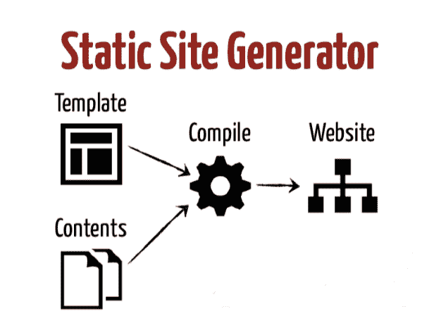
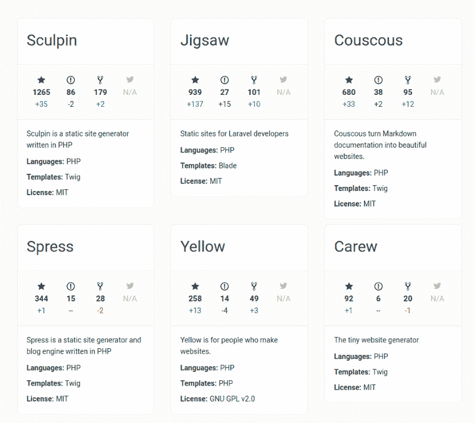
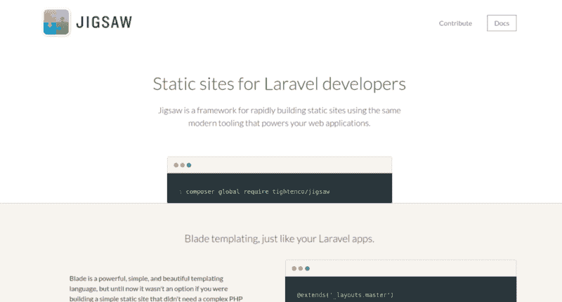
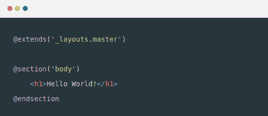

# 如何使用 Jigsaw 快速方便地构建静态站点

> 原文：<https://www.freecodecamp.org/news/how-to-use-jigsaw-to-quickly-and-easily-build-static-sites-8a3304c3ad7e/>

作者里克·韦斯特

# 如何使用 Jigsaw 快速方便地构建静态站点


Photo by [Ryoji Iwata](https://unsplash.com/photos/5siQcvSxCP8?utm_source=unsplash&utm_medium=referral&utm_content=creditCopyText) on [Unsplash](https://unsplash.com/search/photos/puzzle-pieces?utm_source=unsplash&utm_medium=referral&utm_content=creditCopyText)

#### 让我们深入 Jigsaw——一个使用支持 Laravel 应用程序的现代工具快速构建静态站点的框架。

静态站点并不是一个新概念。然而，成熟的、动态的内容管理系统(CMS ),如 Wordpress、Drupal 和 Joomla，似乎已经取而代之。也就是说，直到最近，像 Jekyll、Hugo、Pelican 和现在的 Jigsaw 这样的静态站点生成器重新流行起来。

虽然 CMS 确实在某些情况下为用户提供了一个强大而有用的工具，但是现在的趋势是开发人员试图把 CMS 硬塞进它们根本不属于的情况，或者至少不适合预期的用例。

顾名思义,“内容管理系统”的主要目标就是管理内容。他们非常擅长这样做，尤其是在博客作者、内容营销者和网站所有者需要定期更新网站的情况下。

然而，作为一个解决方案，为企业或一个简单的个人博客/投资组合建立一个小册子风格的营销网站？在我看来？不太好。

### 什么是静态站点生成器？

简而言之，静态站点生成器是一个应用程序，它获取内容(通常用 Markdown 编写)，将其应用于模板，并生成一组纯静态的 HTML 文件，准备交付给访问者。

静态站点生成器将现代工具和模板库的强大功能与静态 HTML 网页的易用性结合起来。

静态站点生成器的可部署输出不需要 web 服务器执行或解释。



Image Source ([https://www.slideshare.net/mackato/blogging-on-jekyll](https://www.slideshare.net/mackato/blogging-on-jekyll))

### 静态站点生成器的优势

#### 久经考验的技术

静态站点生成器输出只包含 HTML、CSS 和 JavaScript 的静态文件。这意味着它们不需要服务器进行处理，可以直接从 web 服务器的文件系统提供，就像存储的一样。这是一种快速、简单、久经考验的技术。

#### 最低限度的廉价托管

静态站点生成器通常在您的本地机器上运行，然后输出可以被推送到一个简单的 web 主机上——任何 web 主机都可以，因为它们只是提供静态文件。因此，静态网站可以完全免费托管在平台上，如 Github Pages 或 T2 Netlify。

#### 安全性

使用动态 CMS 开发的最大威胁之一是缺乏安全性。他们对更大的服务器端基础设施的需求为潜在的违规打开了大门。

因为静态站点没有数据库层，很少或没有服务器端功能，所以不会暴露额外的攻击面。

#### 速度和性能

因为静态站点生成器构建已经编译好的文件，然后提供给浏览器，而不必动态地从数据库中提取信息，所以加载时间很短，在大多数情况下会带来出色的性能。

#### 灵活性

静态站点生成器的重新流行可能与 JavaScript 的流行有关。

JavaScript 现在可以执行许多与 PHP 或 Python 等常规服务器端脚本语言相同的任务。

这反过来又大大提高了静态网站的灵活性，例如能够轻松集成外部 web 服务，如分析、表单提交/邮件列表注册选项和支付网关。

虽然静态站点生成器最初可能会要求开发人员具备更多的技术技能，但与仅仅制作静态页面或使用 CMS 相比，我们也获得了无限多的自由。

### PHP 开发人员的静态站点选项

有数百种静态站点生成器可用，但是如果像我一样，PHP 是您的主要编程语言，那么这将有助于大大缩小选择范围。

考虑到项目的学习曲线、可扩展性、调试和开发，选择一种用您熟悉的语言编写的工具是非常重要的。

使用[https://www.staticgen.com/](https://www.staticgen.com/)我能够很好地比较最流行的 PHP 静态站点生成器。



A comparison of PHP Static Site Generators from [https://www.staticgen.com/](https://www.staticgen.com/)

从图片中可以看出，[杜父](https://sculpin.io/)和[竖锯](https://jigsaw.tighten.co/)显然是最受欢迎的。

Sculpin 于 2012 年首次发布，因此是一个成熟、可靠的选择，建立在 [Symfony](https://symfony.com/) 组件之上。

另一方面，Jigsaw 于 2015 年由团队在[tight](https://tighten.co/)发布，并利用了几个 Laravel 组件，如 Blade 和 Laravel Mix。

建造在拉勒维尔的顶部，考虑到拉勒维尔周围显著的受欢迎程度和社区，这使得[拼图](https://jigsaw.tighten.co/)成为一个真正令人兴奋的选择？。

话虽如此，让我们更深入地了解 Jigsaw

### jigsaw——一个使用支持 Laravel 应用程序的现代工具快速构建静态站点的框架。


### 什么是竖锯

由团队在[tight](https://tighten.co/)开发的 [Jigsaw](https://jigsaw.tighten.co/) 是一个静态网站生成器，它利用来自 [Laravel](https://laravel.com/) 框架的组件来构建静态网站。

这些组件包括刀片模板引擎、集合和用于处理资产的 Laravel Mix。

> “面向 Laravel 开发人员的静态站点。

> Jigsaw 是一个快速构建静态站点的框架，它使用与 web 应用程序相同的现代工具。"

考虑到所有这些，对我来说,“竖锯”的“感觉”很像拉弗尔也就不足为奇了。非常干净，富于表现力的语法，易于设置，无限强大，一切'只是工作'？。

让我们面对现实吧，Laravel 蓝图是一个久经考验的蓝图，它是最受欢迎的后端框架是有原因的。因此，随着 Jigsaw 利用 Laravel 组件并体现 Laravel 精神，它肯定是一个良好的开端。



[https://jigsaw.tighten.co/](https://jigsaw.tighten.co/)

### Jigsaw 入门

作为我对 Jigsaw 研究的一部分(这原本是一个 uni 项目，我已经把它变成了一系列博客帖子！)，我联系了,[基思·Damiani，他是紧缩公司的高级开发人员，也是拼图项目的负责人。用他自己的话说，](https://medium.com/@rickwest8/jigsaw-my-interview-with-keith-damiani-senior-developer-at-tighten-and-lead-developer-on-the-55ead103514d)[凯斯描述了竖锯](https://medium.com/@rickwest8/jigsaw-my-interview-with-keith-damiani-senior-developer-at-tighten-and-lead-developer-on-the-55ead103514d):

> “它肯定是针对那些熟悉 Laravel 生态系统的开发人员的，因为它对 Blade 的依赖如此之大；因此，对于整天编写 Laravel(甚至 PHP)的人来说，这是一个自然的选择，只需要很短的学习曲线就可以开始运行。”

太棒了。

要使用 Jigsaw，你只需要在你的机器上安装 PHP 7，Composer，Node 和 NPM。所有这些都是标准工具，是现代 PHP 开发工作流的一部分。

从那里开始并运行是非常简单的，因为 [Jigsaw 文档](https://jigsaw.tighten.co/docs/installation/)的质量真的非常好。

从安装 Jigsaw 到在浏览器中预览，只需简单的 4 个步骤:

1.通过 Composer 安装 Jigsaw:

```
composer require tightenco/jigsaw
```

2.初始化你的拼图项目:

```
./vendor/bin/jigsaw init
```

3.通过运行 build 命令生成您的站点:

```
./vendor/bin/jigsaw build
```

4.使用 PHP 的 serve 命令预览你的站点:

```
./vendor/bin/jigsaw serve
```

嘣！这凸显了开始使用 Jigsaw 是多么容易。正如我之前提到的，它“很好用”！

让我们进一步看看该框架的其他一些重要方面…

### 生态系统和支持

[拉紧](https://tighten.co/)，Jigsaw 背后的驱动力，是更广泛的 Laravel 生态系统不可或缺的一部分，也是‘[Laravel 官方合作伙伴](https://laravel.com/partners)。

随着 Jigsaw 建立在一些 Laravel 组件之上，并与之紧密耦合，这种紧密/Laravel 连接对 Jigsaw 及其未来的发展是一个好兆头。

在 PHP/Laravel 社区中，由于其他几个出色的[开源项目](https://github.com/tightenco)，产生在线教程和托管播客，紧缩和它的许多员工也很出名。

得到这样一个充满激情、杰出和成功的公司的支持是一个很好的鼓励，并且已经在围绕拼图项目建立一个社区。事实上，他们已经创建了用 Jigsaw 构建的[，一个收集和展示用 Jigsaw 构建的项目的一些优秀例子的网站，还有社区资源和 Jigsaw 的其他有趣用例。](https://builtwithjigsaw.com/)

同样值得注意的是，当[我联系 Keith](https://medium.com/@rickwest8/jigsaw-my-interview-with-keith-damiani-senior-developer-at-tighten-and-lead-developer-on-the-55ead103514d) 就我的项目采访他时，他非常乐意抽出时间回答我的一些问题。这种与来自更广泛社区的人(一个随机的来自英国的陌生人)直接交流的意愿向我强调了 Jigsaw 团队对社区的承诺和热情。功劳归于凯斯和整体收紧的态度。

### 性能和可扩展性

在我对 Keith 的采访中，他透露说他们知道一些开发者已经使用 Jigsaw 建立了一些非常大的网站(超过 6000 页)。

Jigsaw 团队也一直致力于优化 Jigsaw 的构建时间，这对那些维护或计划构建大型 Jigsaw 站点的人来说尤其有意义，因为它将构建时间减少了大约 75%。

### 特性、灵活性和可扩展性

Jigsaw 提供了许多有助于静态网站快速开发的特性。

参考[精彩的文档](https://jigsaw.tighten.co/docs/installation/)，我总结了以下一些主要特性:

#### 叶片

Jigsaw 的支柱是刀片模板引擎。模板语言的最大好处之一是模板继承，即创建可重用布局和部分的能力。这极大地减少了代码重复，缩短了开发时间。



Blade example, take from [https://jigsaw.tighten.co/](https://jigsaw.tighten.co/)

#### 降价

和许多静态站点生成器一样，Jigsaw 支持用 Markdown 编写的内容。Markdown 对于文章、博客帖子和文档页面来说是一种非常棒的写作格式。

Jigsaw 使得在 Blade 中创建一个布局变得很容易，并用 Markdown 编写的内容填充它。

#### 拉勒韦尔混合

开箱即用，Jigsaw 带有配置好的 Laravel Mix，随时可用。Laravel Mix 提供了一个流畅的 API，使用几个常见的 CSS 和 JavaScript 预处理程序为您的应用程序定义 Webpack 构建步骤。

作为初级开发人员，以及对 Webpack 和现代前端工具了解有限的人，Laravel mix 消除了所有压力，使开始使用 Webpack 和资产编译变得轻而易举。

#### 事件

这个拉请求[https://github.com/tightenco/jigsaw/pull/189](https://github.com/tightenco/jigsaw/pull/189)向 Jigsaw 添加了 3 个事件，你可以挂接，以便在应用构建处理前后运行定制代码。

这三个事件是“生成前”、“集合后”和“生成后”。

注册事件监听器非常简单，这些事件提供了添加定制代码的绝佳机会。这将是特别有用的，例如，在想要从像 [Contentful](https://www.contentful.com/) 这样的外部基于 API 的内容管理系统中获取内容的情况下，或者在网站建成后由[生成自动站点地图](https://mattstauffer.com/blog/adding-an-auto-generated-sitemap-to-your-jigsaw-based-static-site/)的情况下。

#### 收集

Jigsaw 为处理相关页面组或集合提供了强大的功能。集合使您能够在聚合级别上访问您的内容，使您能够轻松地向静态站点添加近乎动态的功能，如菜单、分页、类别和标签。

集合可用于生成相关内容的页面，例如，按日期排序的博客文章或文章，带有显示最近五篇文章摘要的索引页面，或者用于在页面中嵌入相关内容块，用于员工简历、产品描述或项目组合等内容。

#### 包装

尽管还没有正式发布，Jigsaw/tight 团队正在为 Jigsaw 开发一些初始模板。一个用于博客，一个用于文档风格的网站。

与设计师 Steve Schoger 合作，毫无疑问，这些模板看起来会非常棒，但这也是一个很好的迹象，表明该团队正在采取第一步，通过添加外部插件生态系统来使 Jigsaw 可扩展。

毫无疑问，一旦插件集成成为可能，Jigsaw 和 Laravel 社区将开始寻找以许多创新方式扩展 Jigsaw 的方法！

### 摘要

Jigsaw 是一个稳定的、高性能的、本质上安全的框架，它充满了强大的、易于实现的特性，这些特性使我们作为开发人员的生活变得更容易，因此也更快乐？。

它很容易上手，对于熟悉现代 PHP 开发的人来说，入门门槛如此之低，以至于你可以立刻将一个项目从“jigsaw init”变成免费托管在 Netlify 或 Github 页面上。

在我看来，在考虑任何框架或库时，两个最重要的因素是文档的质量以及围绕它的生态系统和支持。

在这些情况下，Jigsaw 表现出色，超出预期。我发现文档清晰、简洁、表达良好，围绕 Jigsaw 的社区和支持也是首屈一指的(除了 Laravel 本身！).

确保在你的下一个项目中，或者当你最终有时间建立你一直谈论的博客时，给 Jigsaw 一个尝试。

不再有借口。竖锯太棒了。

作为本文研究的一部分，我联系到了 Tighten 的高级开发人员基思·Damiani，他也是 Jigsaw 项目的负责人。

Keith 很友好地回答了我一些关于 Jigsaw 发展和未来计划的问题。

*你可以在这里阅读完整的采访…[https://medium . com/@ Rick west 8/jigsaw-my-interview-with-Keith-damiani-senior-developer-at-tight-and-lead-developer-on-the-55ead 103514d](https://medium.com/@rickwest8/jigsaw-my-interview-with-keith-damiani-senior-developer-at-tighten-and-lead-developer-on-the-55ead103514d)*

感谢您的阅读！？如果你喜欢，点击下面的按钮。我真的很感谢你的支持，这有助于其他人了解这个故事。

我总是很高兴收到志同道合者的来信，所以请随时给我发电子邮件或在 Twitter 上打招呼。