# 如何在 Microsoft SQL Server 中使用 Join 和 String_agg

> 原文：<https://www.freecodecamp.org/news/how-to-use-join-and-string_agg-in-microsoft-sql-server/>

在本文中，我们将了解如何在两个以上的表上使用 join，并使用 Microsoft SQL Server 中的函数`STRING_AGG()`聚合结果。

如果你不了解微软的 SQL Server，我将简要地向你解释它是什么😃。让我们开始吧。

## 什么是 Microsoft SQL Server？

Microsoft SQL Server 是一个关系数据库管理系统，它彻底改变了企业处理数据的方式。它帮助你存储和管理数据。

如果您熟悉 MySQL 或 PostgreSQL 等其他关系数据库管理系统，那么使用 Microsoft SQL Server 应该很容易。

我正在 SQL server 的默认实例[上运行。](https://docs.microsoft.com/en-us/sql/relational-databases/lesson-1-connecting-to-the-database-engine?view=sql-server-ver15#connect)

现在，我们来考虑一个问题。

### 问题:如何获得员工的详细信息和项目

假设我们有三个表，即`Employee`、`Project`和`EmployeeProject`。下图是关系数据库设计:

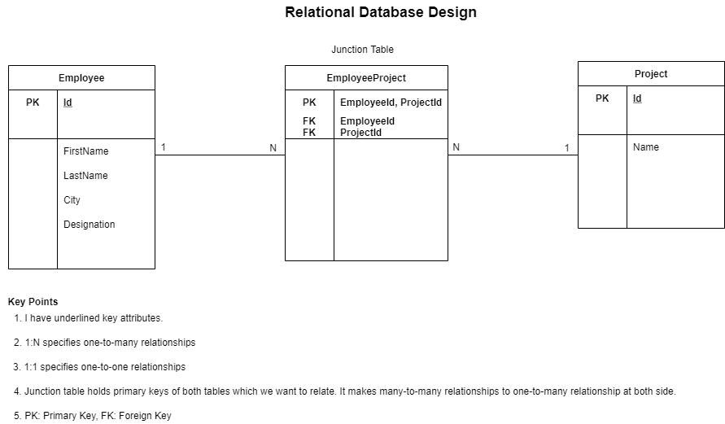

Figure 1: Relational Database Design for the problem

问题是要得到所有员工的详细信息和他们对应的项目。

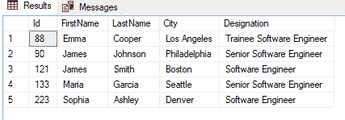

Figure 2: Employee table

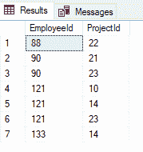

Figure 3: EmployeeProject table

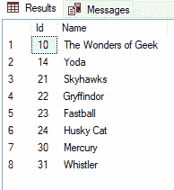

Figure 4: Project table

需要考虑的事项:并非表`Employee`中的所有员工都映射到表`EmployeeProject`，也并非表`Project` 中的所有项目都映射到表`EmployeeProject`。

我们的主要目标是从表`Employee`中检索所有员工的详细信息，无论它们是否与`EmployeeProject`映射。

我们可以尝试通过使用连接来解决这个问题。如您所见，为了解决这个问题，我们必须连接三个表。首先，我们需要连接表`Employee`和`EmployeeProject`。然后我们用`Project`连接结果表。

让我们通过一些场景来解决这个问题。

### 解决方案 1:使用内部连接

让我们到处都跟着`INNER JOIN`走吧！

```
SELECT e.Id, e.FirstName, e.LastName, e.Designation, e.City, ep.ProjectId 
FROM Employee AS e INNER JOIN EmployeeProject AS ep 
ON e.Id = ep.EmployeeId
```

这将为我们提供:

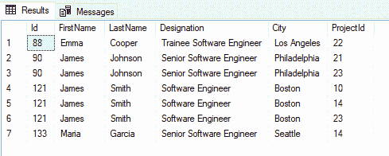

Figure 5

我们把上表想象成`Employee-EmployeeProject`。它包含所有员工的详细信息以及他们相应的项目 id。

在`Employee-EmployeeProject`的帮助下，我们将能够访问`Project`表。让我们这样做:

```
SELECT abc.FirstName, abc.LastName, abc.City, abc.Designation, p.Name AS Project FROM Project AS p 
INNER JOIN
(SELECT e.Id, e.FirstName, e.LastName, e.Designation, e.City, ep.ProjectId
FROM Employee AS e INNER JOIN EmployeeProject AS ep
ON e.Id = ep.EmployeeId) AS abc 
ON p.Id = abc.ProjectId
```

输出:

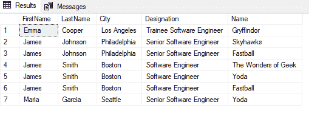

Figure 6

太好了！😃现在，我们能够检索员工的详细信息以及他们对应的项目。但是我们的主要目标丢失了(即获得所有雇员的详细信息)，因为我们丢失了 Sophia Ashley 的详细信息。

场景 1 成功了，但是我们没有完成我们的目标。😆

### 解决方案 2:使用左连接

通过使用`LEFT JOIN`和`Employee`表，让我们从员工那里获得所有详细信息，无论他们是否与`EmployeeProject`对应(我们的目标):

```
SELECT e.Id, e.FirstName, e.LastName, e.Designation, e.City, ep.ProjectId FROM Employee AS e LEFT JOIN EmployeeProject AS ep ON e.Id = ep.EmployeeId
```

该查询将为我们提供:

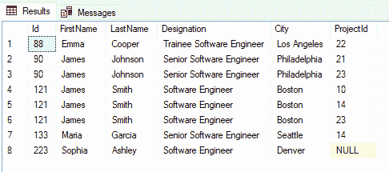

Figure 7

从上图中可以看出，我们能够检索到索菲亚·阿什利的详细信息，因为我们使用了`Employee`表中的`LEFT JOIN`和`EmployeeProject`表。

我们把上表想象成`Employee-EmployeeProject`。它包含所有员工的详细信息以及他们相应的项目 id(当它不包含任何`ProjectId`值时，包括`NULL`)。

类似于场景 1，现在我们可以访问项目名称，因为我们知道`ProjectId`。请记住，我们的目标是检索所有员工的详细信息，无论他们是否有项目。

为了确保这一点，当与`Project`表连接时，我们需要从`Employee-EmployeeProject`中检索所有值:

```
SELECT abc.FirstName, abc.LastName, abc.City, abc.Designation, p.Name AS Project FROM Project AS p RIGHT JOIN (SELECT e.Id, e.FirstName, e.LastName, e.Designation, e.City, ep.ProjectId FROM Employee AS e LEFT JOIN EmployeeProject AS ep ON e.Id = ep.EmployeeId) AS abc ON p.Id = abc.ProjectId
```

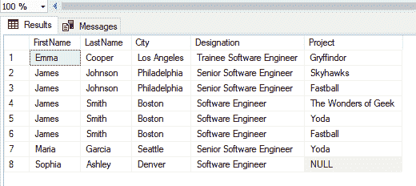

Figure 8

干得好！我们达到了目标。😃

这是好东西。但是如果我们能够将这些行分组并为每个雇员返回一行，那就太好了。这是我们的新愿望！😉

这让我们质疑如何对这些结果进行分组。我们可以使用`GROUP BY`对这些行进行分组。

因此，我们将通过`FirstName`按行对结果进行`GROUP BY`:

```
SELECT abc.FirstName, abc.LastName, abc.City, abc.Designation, p.Name AS Project FROM Project AS p RIGHT JOIN (SELECT e.Id, e.FirstName, e.LastName, e.Designation, e.City, ep.ProjectId FROM Employee AS e LEFT JOIN EmployeeProject AS ep ON e.Id = ep.EmployeeId) AS abc ON p.Id = abc.ProjectId GROUP BY abc.FirstName
```

输出是:

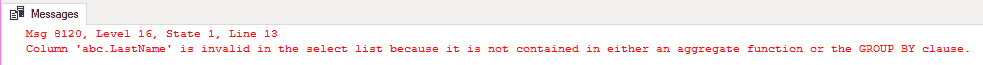

Figure 9

发生了什么事？

它表示选择列表中的列`LastName`无效，因为它是 ****，不包含在 ****聚合函数**** 或 ****GROUP BY 子句**** 中的**** 。该错误适用于所选列表中除`FirstName`之外的所有剩余列。

当我们试图选择值`FirstName`并按`FirstName`分组时，这意味着我们将只根据`FirstName`对所有行进行分组，并选择`FirstName`列。例如，让我们只选择`FirstName`并按`FirstName`分组:

```
SELECT abc.FirstName FROM Project AS p RIGHT JOIN 
(SELECT e.Id, e.FirstName, e.LastName, e.Designation, e.City, ep.ProjectId FROM Employee AS e LEFT JOIN EmployeeProject AS ep ON e.Id = ep.EmployeeId) AS abc ON p.Id = abc.ProjectId GROUP BY abc.FirstName
```

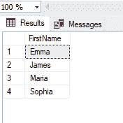

Figure 10

如图 10 所示，我们已经按照`FirstName`对所有行进行了分组。在这里，没有歧义。

现在，让我们选择`FirstName`、`LastName`，并按照`FirstName`对所有行进行分组:

```
SELECT abc.FirstName, abc.LastName FROM Project AS p RIGHT JOIN (SELECT e.Id, e.FirstName, e.LastName, e.Designation, e.City, ep.ProjectId FROM Employee AS e LEFT JOIN EmployeeProject AS ep ON e.Id = ep.EmployeeId) AS abc ON p.Id = abc.ProjectId GROUP BY abc.FirstName
```


Figure 11

如果我们检查一下图 8 中`LastName`的值是什么，我们可以看到我们有两个具有相同`FirstName`但不同`LastName`的雇员:詹姆斯·约翰逊和詹姆斯·史密斯。

因此，当我们试图按`FirstName`对所有行进行分组，并选择`FirstName`和`LastName`、**、**的值时，就会导致一种模糊状态。****

想象一下**MSSQL 问我们，“您选择了`FirstName`、`LastName`，并试图按`FirstName`对所有行进行分组。但是詹姆斯有两个不同的 T4，约翰逊和史密斯。在选择詹姆斯的姓氏时，他的`LastName`应该是什么？约翰逊？史密斯？还是两者都有？”关于选择哪一个，MSSQL 中有歧义。**

**为了解决名字和姓氏的问题，我们可以(选项 1)通过`FirstName`和`LastName`对所有行进行分组，或者(选项 2)将`LastName`放入一个[聚合函数](https://docs.microsoft.com/en-us/sql/t-sql/functions/aggregate-functions-transact-sql?view=sql-server-ver15#:~:text=An%20aggregate%20function%20performs%20a,All%20aggregate%20functions%20are%20deterministic.)中，以便只选择一个值。**

**选项 1:**

```
`SELECT abc.FirstName, abc.LastName FROM Project AS p RIGHT JOIN (SELECT e.Id, e.FirstName, e.LastName, e.Designation, e.City, ep.ProjectId FROM Employee AS e LEFT JOIN EmployeeProject AS ep ON e.Id = ep.EmployeeId) AS abc ON p.Id = abc.ProjectId GROUP BY abc.FirstName, abc.LastName`
```

**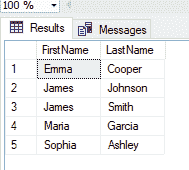

Figure 12** 

**选项 2:**

```
`SELECT abc.FirstName, MAX(abc.LastName) AS LastName FROM Project AS p RIGHT JOIN (SELECT e.Id, e.FirstName, e.LastName, e.Designation, e.City, ep.ProjectId FROM Employee AS e LEFT JOIN EmployeeProject AS ep ON e.Id = ep.EmployeeId) AS abc ON p.Id = abc.ProjectId GROUP BY abc.FirstName`
```

**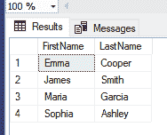

Figure 13** 

**在上面的名和姓的问题中，虽然两个选项都有效，但选项 1 比选项 2 更有意义。**

**关于歧义的更多详细信息，请查看这个[堆栈溢出问题和答案](https://stackoverflow.com/questions/13999817/reason-for-column-is-invalid-in-the-select-list-because-it-is-not-contained-in-e)！**

******注意:**** 当您有一个`GROUP BY`查询时，所选择的列表必须是分组标准的一部分，或者必须出现在`SUM`、`MAX`、`COUNT`等聚合函数中。**

**再次，回到我们的愿望，我们将尝试`GROUP BY`所有行乘所有列:**

```
`SELECT abc.FirstName, abc.LastName, abc.City, abc.Designation, p.Name AS Project FROM Project AS p RIGHT JOIN (SELECT e.Id, e.FirstName, e.LastName, e.Designation, e.City, ep.ProjectId FROM Employee AS e LEFT JOIN EmployeeProject AS ep ON e.Id = ep.EmployeeId) AS abc ON p.Id = abc.ProjectId GROUP BY abc.FirstName, abc.LastName, abc.City, abc.Designation, p.Name`
```

**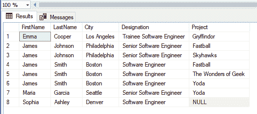

Figure 14** 

**我们已经成功地对所有行进行了分组，但是我们无法为每个雇员检索一行，因为如果我们考虑所有列，每一行都与其他行不同。这意味着按所有列对它们进行分组是行不通的。**

**根据我们的新目标，我们需要艾玛·库珀、詹姆斯·约翰逊、詹姆斯·史密斯、玛利亚·加西亚和索菲亚·阿什利的记录(五行)。**

**`GROUP BY``FirstName``LastName``City``Designation`会给我们这五排，但是`Project`呢？我们不能`GROUP BY`它(如果我们这样做，那么结果将类似于图 14)，但是我们可以使用一个聚合(相加)函数来聚合`Project`。**

**实际上，我们可以使用`[STRING_AGG()](https://docs.microsoft.com/en-us/sql/t-sql/functions/string-agg-transact-sql?view=sql-server-ver15#syntax)` MSSQL 聚合函数，通过连接`Project`表中的`Name`列和剩余的`GROUP BY`列，为每个雇员返回一行:**

```
`SELECT abc.FirstName, abc.LastName, abc.Designation, STRING_AGG (p.Name, ',') WITHIN GROUP (ORDER BY p.Name) AS Project FROM Project AS p RIGHT JOIN (SELECT e.Id, e.FirstName, e.LastName, e.Designation, e.City, ep.ProjectId FROM Employee AS e LEFT JOIN EmployeeProject AS ep ON e.Id = ep.EmployeeId) AS abc ON p.Id = abc.ProjectId GROUP BY abc.FirstName, abc.LastName, abc.City, abc.Designation`
```

**

Figure 15** 

**耶！我们做到了。😃 😃**

**我们在本文中讨论的问题帮助我们理解了 Microsoft SQL Server 背后的一些主要概念。**

**现在我们对如何在 Microsoft SQL Server 中使用 join 和`STRING_AGG`有了基本的了解。**

**如果你有任何建议或问题，请随时告诉我。**

**米在 [Unsplash](https://unsplash.com/s/photos/happy?utm_source=unsplash&utm_medium=referral&utm_content=creditCopyText) 上[拍照。](https://unsplash.com/@phammi?utm_source=unsplash&utm_medium=referral&utm_content=creditCopyText)**

**通过[媒体](https://mvthanoshan.medium.com/)与我联系。**

****请支持 freeCodeCamp 的[数据科学课程承诺活动](https://www.freecodecamp.org/news/building-a-data-science-curriculum-with-advanced-math-and-machine-learning/)。****

**谢谢你😇**

******快乐编码❤️******

### **进一步探索**

1.  **`[STRING_AGG](https://docs.microsoft.com/en-us/sql/t-sql/functions/string-agg-transact-sql?view=sql-server-ver15)` [(Transact-SQL) —微软文档](https://docs.microsoft.com/en-us/sql/t-sql/functions/string-agg-transact-sql?view=sql-server-ver15)**
2.  **[聚合函数—微软文档](https://docs.microsoft.com/en-us/sql/t-sql/functions/aggregate-functions-transact-sql?view=sql-server-ver15)**
3.  **[SQL 中](https://www.sqlshack.com/string_agg-function-in-sql/) `[STRING_AGG](https://www.sqlshack.com/string_agg-function-in-sql/)` [函数概述— SQLShack](https://www.sqlshack.com/string_agg-function-in-sql/)**
4.  **[`GROUP BY`](https://www.freecodecamp.org/news/sql-group-by-clauses-explained/)深度指南**