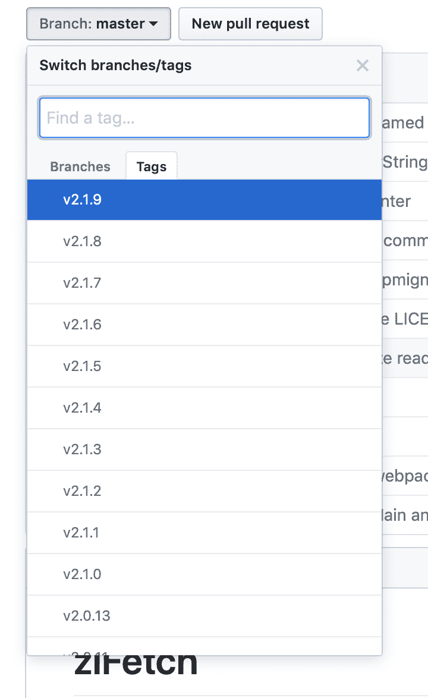
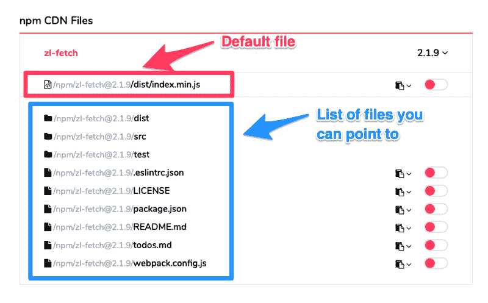

# 如何使用 JSDelivr

> 原文：<https://www.freecodecamp.org/news/how-to-use-jsdelivr-e64e5590f66e/>

#### 从 npm 和 GitHub 轻松下载 JavaScript 库

向项目添加库的最容易上手的方法是:

1.  搜索图书馆
2.  查找源文件
3.  复制源文件
4.  将您复制的内容粘贴到项目中。

这是可行的，但这是一个痛苦的过程。如果用 JSDelivr 之类的 cdn 就更容易了。

### 什么是 CDN？

CDN 代表内容交付网络。它的主要目的是让用户更快地下载文件。如果你想知道是否应该使用 CDN，请快速阅读这篇文章。

CDNS 通过在世界各地设置数据中心，让用户更快地下载文件。当浏览器看到 CDN 链接时，他们会从离用户最近的数据中心提供库。这就是 cdn 的工作方式。

### JSDelivr 是什么？

JSDelivr 是一种特殊的 CDN。它允许用户下载托管在 npm 和 Github 上的 JavaScript 库。(如果 Wordpress.org 上有 Wordpress 插件，你也可以加载它们)。

如果您使用 JSDelivr(或任何其他提供 JavaScript 库的 CDN)，您不需要将源文件复制粘贴到项目中。您可以使用这样的链接:

```
<script src="https://cdn.jsdelivr.net/npm/package-name"><;/script>
```

JSDelivr 允许您指定想要下载的库的版本。如果您想指定一个版本，您可以在一个`@`后面添加版本号，就像这样:

```
<script src="https://cdn.jsdelivr.net/npm/[email protected]"><;/script>
```

### 我如何使用 JSDelivr

我使用 JSDelivr 更像是一个包管理器,因为 JSDelivr 允许你指定库的版本。我可以通过改变一个数字来升级或降级库。没有必要将原始源代码复制粘贴到我的项目中。

然而，**我现在很少使用 JSDelivr】，因为我已经有了一个使用 Webpack 的构建过程。Webpack 允许你将库放入前端 JavaScript。它允许您将 npm 用作包管理器。**

**我只在以下项目中使用 JSDelivr:**

1.  需要一个库
2.  该库存在于 JSDelivr(或其他 cdn)上
3.  该项目没有安装 Webpack(或类似的工具)

此类项目的一个例子是 [Learn JavaScript](https://learnjavascript.today/) 中的 20 个组件。

原因如下。

报名学习 JavaScript 的学生正在尝试学习 JavaScript。我不想通过让他们学习 Webpack 来分散他们的注意力。

相反，我想帮助他们专注于他们来这里的目的——学习 JavaScript。我通过消除我们共同构建的项目的复杂性来做到这一点。我把一切都简化成普通的 HTML、CSS 和 JavaScript。

我们已经讨论了什么是 JSDelivr，为什么使用它，以及何时使用它。现在让我们来深入了解一下使用它的细节。

在本文的其余部分，我们将使用一个名为 [zl-fetch](https://github.com/zellwk/zl-fetch) 的库作为例子。

### 安装库

要安装一个库，需要添加一个指向 JSDelivr 上的库的`<scri` pt >标签。根据您的喜好，您可以从 npm 或 Github 加载该库。

我倾向于从 npm 加载库。

```
<script src="https://cdn.jsdelivr.net/npm/package-name"><;/script>
```

您需要将`package-name`更改为您正在安装的库的名称。这种情况下是`zl-fetch`。

```
<script src="https://cdn.jsdelivr.net/npm/zl-fetch"><;/script>
```

如果你不确定这个库的名字，你可以在 [npm](https://www.npmjs.com/) 上搜索，或者直接在 [JSDelivr](https://www.jsdelivr.com/) 上搜索。


### 指定版本

默认情况下，JSDelivr 下载最新版本的库。

我不建议您使用最新版本，因为作者可能会更新他们的库。如果他们更新了他们的库，你的代码可能会出错。

**你总是想指定一个版本号。**你可以添加一个版本号，方法是在包名后面加上`@`，后面跟着版本号，就像这样:

```
<script src="https://cdn.jsdelivr.net/npm/[email protected]"><;/script>
```

版本号遵循一种[永远](https://zellwk.com/blog/semantic-versioning/)的格式。你可以通过查看 Github 上的可用标签来判断有哪些版本。



在我们的例子中，`zl-fetch`的当前版本是`2.1.9`:

```
<script src="https://cdn.jsdelivr.net/npm/[email protected]"><;/script>
```

### 加载特定文件

JSDelivr 依赖于作者来指定一个默认文件，以便上述格式能够工作。**如果没有指定默认文件，则需要指向正确的文件。**

```
<script src="https://cdn.jsdelivr.net/npm/[email protected]/path-to-file"><;/script>
```

有两种方法可以知道哪些文件可用。

首先，你可以在 JSDelivr 上搜索这个包。您将看到您可以指向的文件和文件夹列表:



第二，如果你知道 npm，你可以使用 npm 在你的计算机上安装这个包。然后使用您的查找器(或浏览器)浏览文件。

在这种情况下，假设没有指定默认文件，我们想要的是`dist/index.js`文件。这是你要写的:

```
<script src="https://cdn.jsdelivr.net/npm/[email protected]/dist/index.js"><;/script>
```

### 加载缩小版本

缩小的文件通常较小。用户下载缩小文件的速度将比下载未缩小文件的速度快。

如果您使用`.min.js`扩展名，JSDelivr 会自动缩小文件。

```
<script src="https://cdn.jsdelivr.net/npm/[email protected]/dist/index.min.js"><;/script>
```

### 包扎

我希望这篇文章能让您很好地了解 JSDelivr 能做什么。

感谢阅读。这篇文章对你有帮助吗？如果是的话，我希望你能考虑分享它。你可能会帮助其他人。非常感谢！

本文原载于 [*我的博客。*](https://zellwk.com/blog/jsdelivr)
如果你想要更多的文章来帮助你成为一个更好的前端开发者，请注册我的[简讯](https://zellwk.com/)。