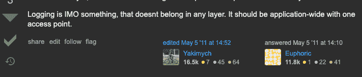
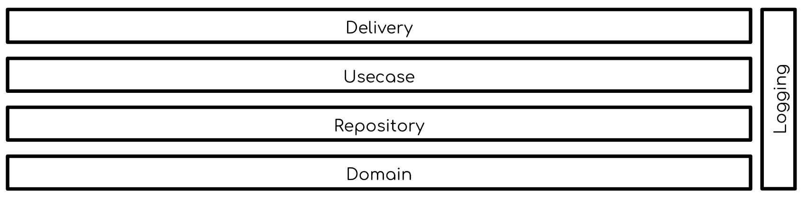

# 记录还是不记录——让记录者成为你朋友的另一种策略

> 原文：<https://www.freecodecamp.org/news/how-to-use-logs-effectively-in-your-code/>

日志普遍存在于软件项目中，有许多不同的形式、需求和风格。

从一个人创业的小公司到大型企业，伐木无处不在。甚至一个简单的算法编程问题都涉及到一些日志记录。

我们非常依赖日志来开发、维护和保持我们的程序正常运行。然而，如何在我们的系统中设计日志记录还没有得到足够的重视。

很多时候，日志记录被当作第二个想法——它只是在实现时被撒到源代码中，就像一些神奇的粉末，帮助减轻我们系统中日常操作的深渊。

Are we all log baes?

就像任何一段代码最终都会变成技术债务一样——这是一个我们只能通过严格的纪律来减缓的过程——伐木工人以令人难以置信的速度腐烂。过了一段时间，我们发现自己修复由日志程序引起的问题的次数比日志程序给我们的有用信息还多。

那么，我们如何管理伐木工的混乱，并把他们变成我们的盟友，而不是过去开发错误的遗留幽灵？

## “最先进的”

在我深入研究我提出的解决方案之前，让我们根据我的观察来定义一个具体的问题陈述。

那么到底什么是伐木？这是我从科林·埃伯哈特的文章中找到的一个有趣且切中要害的一句俏皮话:

> 日志记录是将应用程序动作和状态记录到辅助界面的过程。

这正是日志记录被编织到系统中的方式。我们似乎都下意识地同意，记录器不属于我们系统的任何特定层。相反，我们认为它们是应用程序范围的，在不同的组件之间共享。

A much approved answer on StackOverflow

在一个简单的图表中，日志记录被整合到一个采用[干净架构](https://blog.cleancoder.com/uncle-bob/2012/08/13/the-clean-architecture.html)设计的系统中，该图表如下所示:

我们可以有把握地说，日志本身就是我们应用程序中的一个子系统。我们可以有把握地说，如果不仔细考虑，它往往会比我们想象的更快失控。

虽然将日志记录设计为我们应用程序中的一个子系统并没有错，但是传统的日志记录概念(有 4 到 6 个级别的`info`、`warn`、`error`、`debug`等等)经常让开发人员关注错误的事情。这让我们关注于格式，而不是我们写日志的实际目的。

这也是为什么我们没有仔细考虑如何处理错误就记录错误的原因之一。这也是为什么我们在代码的每一步都记录日志，而讽刺的是，如果出现生产问题，我们却不能有效地调试。

这就是为什么我提出了一个替代的日志框架，反过来，我们如何设计可靠的系统日志。

## 好的，坏的，丑陋的

这是一个我认为我们应该如何制定伐木策略的框架。对于我们的日志，它有三个——也只有三个——类别或关注点。

### 记录的第一条规则:不要记录

过度日志记录不利于我们团队的生产力和处理日常业务的能力。

有很多理由说明为什么我们不应该像一些可观察性宣传所建议的那样“尽可能地记录日志”。日志记录意味着需要维护更多的代码，这会导致系统性能方面的开销，而且更多的日志记录会让我们接受更多的数据隐私监管审核。

如果你需要更多的理由来克制自己不写日志，看看尼基塔·索博列夫的[这篇文章或者杰夫·阿特伍德](https://sobolevn.me/2020/03/do-not-log)的[这篇文章。](https://blog.codinghorror.com/the-problem-with-logging/)

然而，我并不建议您完全消除日志。我认为正确使用日志记录可以极大地帮助我们保持系统可靠运行。

我只是建议我们从不记录日志开始，然后逐步确定我们需要记录日志的地方，而不是“记录所有地方，因为我们可能需要查看它们”。

我添加一行日志的经验法则是“如果我们不能确定查看日志的确切原因或场景，**不要记录**”。

话虽如此，我们如何在绝对必要的时候安全地引入日志记录呢？我们应该如何组织我们的日志和格式化它们的内容？日志中需要包含哪些信息？

### 丑陋的

这些是我想描述的第一类日志，也是我发现最不常用的日志。(如果我们过于频繁地发现它们，我们的系统可能会出现更大的问题！)

“难看的”日志是指在灾难性或意外情况下需要立即采取措施的日志(比如需要重启应用程序的灾难性错误)。我们可以说，在这种情况下，使用像 Sentry 这样的警报工具更有意义。

尽管如此，错误日志仍然可以为我们提供更多关于这些错误的上下文，而这些上下文在堆栈跟踪中是不可用的。但是它们可以帮助重现这些错误，比如用户输入。

就像它们伴随的错误一样，这些日志应该在我们的代码中保持最少，并放在一个位置。它们也应该在规范中设计/记录为错误处理所需的系统行为。此外，应该将它们编织到源代码中错误处理发生的地方。

虽然“丑陋的”日志的格式和级别完全取决于每个团队，但我建议在应用程序正常关闭和重启之前使用`log.error`或`log.fatal`。您还应该附上完整的错误堆栈跟踪和函数或请求的输入数据，以便在必要时进行复制。

### 坏事

“坏的”日志是处理预期的、已处理的错误的日志类型，如网络问题和用户输入验证。这种类型的日志只在出现异常时才需要开发人员的注意。

再加上一个监视器，在出现错误时提醒开发人员，这些日志可以很方便地缓解潜在的严重基础设施或安全问题。

这种类型的日志也应该在错误处理技术需求中进行规范，如果我们在同一个代码位置处理预期的和意外的错误，实际上可以进行捆绑。

基于他们让开发人员“可见”的本质，`log.warn`或`log.error`可以用于团队约定的“坏”日志。

### 好人

最后但绝对不是最不重要的一点，“好的”日志是应该在我们的源代码中最常出现的日志类型——但它通常是最难做对的。“好的”日志是那些与我们的应用程序的“快乐”步骤相关联的日志，指示操作的成功。

由于它在我们的系统中指示开始/成功执行操作的本质，“好”经常被开发人员滥用，他们被“日志中还有一位数据，我们可能需要它”的咒语所诱惑。

再一次，我会回到我们的第一条记录规则:“除非万不得已，否则不要记录”。为了防止这种过度日志记录的发生，我们应该将“好的”记录为我们补充主要业务逻辑的技术需求的一部分。

最重要的是，对于我们技术规范中的每一个“好的”日志，它们都需要通过石蕊测试:在什么情况下我们会查看日志(无论是客户支持请求，还是外部审计员的查询)？只有这样,`log.info`才不会成为一个可怕的遗产，遮蔽开发人员对我们应用程序的视野。

### 其余的(你需要知道的)

到目前为止，我假设您已经注意到了我提出的日志策略的主题是围绕着日志目的的清晰和具体的文档化。重要的是，我们将日志记录视为我们需求的一部分，并且我们明确了我们希望在每个日志的上下文中标记哪些关键字和消息，以便对它们进行有效的索引。

只有这样做，我们才能意识到我们生成的每一个日志，进而对我们的系统有一个清晰的认识。

随着原木升级为一等公民，我们的规格中有具体的技术要求，这意味着它们需要:

*   随着业务和技术需求的发展进行维护和更新
*   由单元和集成测试覆盖

这听起来像是要做很多额外的工作才能让我们的日志正确。然而，我认为这是日志记录应该得到的关注和努力，所以它是有用的。

为我们的原木服务，我们将获得丰厚的回报！

## 实用迁移指南

我认为对于遗留项目来说，如果没有办法将它们从混乱的状态转移到提出的理想状态，那么新的日志策略(或者任何新的策略/框架)就没有用了。

因此，我有一个三步走的总体计划，适用于那些对系统日志感到沮丧，并愿意花时间更有效地记录日志的人。

### 确定通常的嫌疑人

因为这个想法是为了减少垃圾日志，所以我们的第一步是识别罪犯的藏身之处。有了我们现在拥有的强大的文本编辑器和 ide(或者`grep`如果你正在通过一个通向未来的窗口阅读这篇文章)，所有的日志事件都可以很容易地被识别。

如果记录事件太多，那么记录所有这些事件的文档(或者电子表格)可能是必要的。

### 判他们是坏演员！

确定了所有的嫌疑人后，就该剔除那些害群之马了。重复或不可及的日志是我们可以立即从源代码中删除的唾手可得的果实。

对于我们剩余的日志事件，是时候让其他涉众参与进来了，比如启动项目的" inception "工程师(如果可能的话)，产品经理，客户支持，或者法规遵循人员来回答这个问题:我们是否需要这些日志中的每一个，如果需要，它们的用途是什么？

## 成功之望

既然我们已经有了一个绝对必要的日志的缩小列表，那么将它们转化为技术需求，并为它们中的每一个记录目的，这对于为我们的日志子系统确定一个契约(或者我们可以称之为规范)是必不可少的。问问你自己当`log.error`发生的时候该怎么做，我们`log.info`是为了谁？

在这之后，它只是一个纪律的问题，就像我们一般编写和维护软件一样。让我们一起努力，让记录变得更棒！

如果有任何问题或意见，您可以通过 Twitter 联系我。