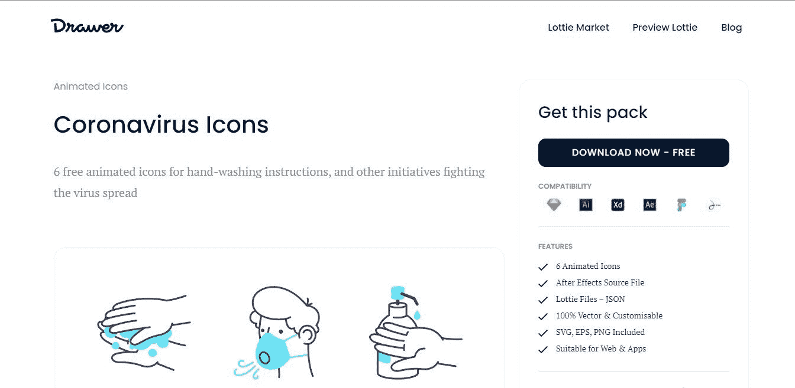
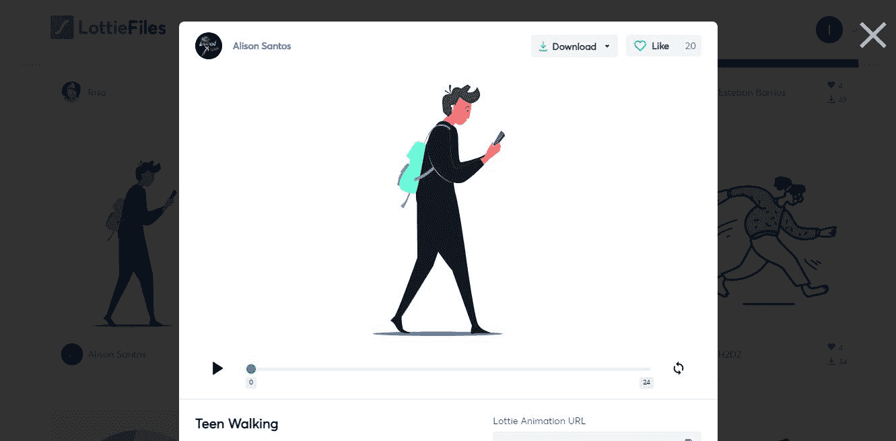
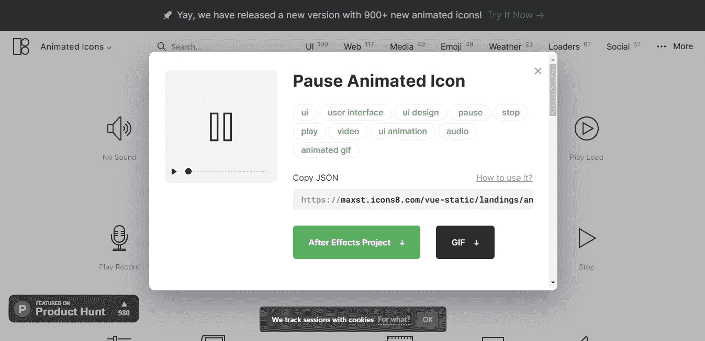
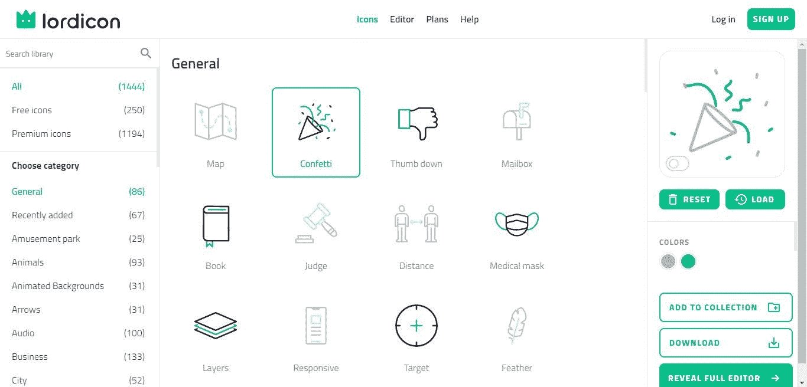
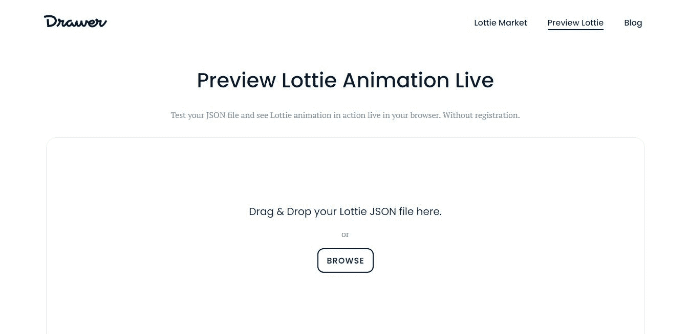
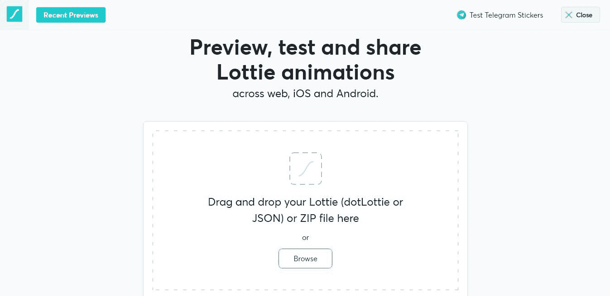

# 如何像专业人员一样使用 Lottie 库——面向设计师和开发人员的 Lottie 资源

> 原文：<https://www.freecodecamp.org/news/how-to-use-lottie-like-a-pro-resources-for-designers-and-developers/>

Lottie 是一个帮助在移动和网络上本地渲染 Adobe After Effects 动画的库。我喜欢在我的项目中使用 Lottie 制作动画，因为:

*   从头开始创建动画可能非常耗时，而且
*   GIF 文件可以是 Lottie JSON 文件(包含 Lottie 动画的文件)大小的两倍

如果你经常在项目中使用 Lottie，你可能会感受到以下压力:

*   寻找合适的 Lottie 动画(如果您不熟悉 Adobe After Effects)
*   知道完整的动画看起来像什么
*   编辑成你喜欢的风格，然后
*   在网络或手机上实现它。

这篇文章的目的是通过为你提供有效的 Lottie 资源来提高你作为 Lottie 设计者和开发者的生产力。我会试着包含一个尽可能有用的洛蒂夫资源。没有双关的意思。

## 获取洛蒂动画的资源

在 Adobe After Effects 中创建动画后，您可以使用[body movin 扩展](https://aescripts.com/bodymovin/)将其导出为 Lottie JSON 格式。

如果你不熟悉 Adobe AE，你可以从很多地方获得 Lottie 动画。让我们看看这里的一些选项。

### [出票人](https://drawer.design/)

Drawer 提供各种格式的免费和付费 Lottie 动画，如 JSON、SVG 和 PNG 以及 Adobe AE、XD 和 Illustrator 文件。

在你选择了你喜欢的动画包之后，你就可以使用你想要的格式了，最好是 Lottie JSON 格式。

Screenshot of Drawer's Coronavirus Icons' page

### [中彩票文件](https://lottiefiles.com/)

LottieFiles 还提供免费和付费的 Lottie 动画。有包和单独的图标，但是和 Drawer 不一样，LottieFiles 严格的为 Lottie 动画提供 JSON 文件。

Screenshot of *teen walking* animation on LottieFiles

### [图标 8](https://icons8.com/animated-icons)

Icons8 提供单个动画图标以及相关动画图标包。它们提供了静态托管的 Lottie JSON 动画文件的链接，您可以下载或者在您的实现中使用。

Screenshot of Icons8's pause animated icon's page

### [主图标](https://lordicon.com/)

Lordicon 是一个提供动画的网站，您可以在使用之前对其进行定制。您可以编辑颜色和宽度等特性，然后以您喜欢的格式下载动画。

除了 JSON 格式，他们还提供 HTML、GIF、AEP、PNG、EPS 和 SVG 格式的动画。

Screenshot of Lordicon's icons page

## 如何预览洛蒂动画

当你从上面列出的一个网站上得到你的洛蒂动画后，你可能想看看你在动画中的所有帧。也就是说，你会想从头到尾看动画。

虽然这通常会显示在您获得动画的网站上，但我建议您检查您正在下载的文件中的内容，以确认这是您认为您实际下载的内容。

Screenshot of Drawer Preview page

要做到这一点，你可以在网上或手机上实施，但这将非常耗时。

相反，有一些资源可以让你看到 Lottie JSON 文件中的内容，比如[抽屉预览](https://drawer.design/preview-lottie-animation/)和 [LottieFiles 预览](https://lottiefiles.com/preview)。你所要做的就是把文件拖放到提供的盒子上。当您放下文件时，动画会自动播放并循环播放。

Screenshot of LottieFiles Preview page

## 如何编辑洛蒂动画

你可能想在你的动画中调整一两件事。由于您不是在 Adobe AE 上自己创建的，您可能会认为调整它是不可能的。但这并不完全正确。

使用 [LottieFiles 编辑器](https://lottiefiles.com/editor)，您可以看到动画的宽度和高度、帧速率、帧数、持续时间、播放速度以及动画中出现的所有层。

除了帧数之外，您可以根据自己的喜好编辑所有这些功能。完成后，您可以与他人共享草稿，导出特定层或整个 Lottie 动画，或者在满足所需规范后导出为电报贴纸。

Screenshot of LottieFiles Editor page

## 如何实现洛蒂动画

这是在你检查了动画并做了任何你想做的编辑后，你实际使用动画的部分。

您可以在 web、mobile 或 CMSs 上本地实现动画。这里有许多教程向您展示如何做到这一点，但在这里我将提供一些全面的资源。

### 如何在 Web 上实现 Lottie

*   [用洛蒂制作动画| CSS-Tricks](https://css-tricks.com/animating-with-lottie/)
*   [如何使用洛蒂的网页动画](https://drawer.design/blog/how-to-use-web-animations-with-lottie/)
*   [如何在网页中添加洛蒂动画](https://lottiefiles.com/blog/working-with-lottie/how-to-add-lottie-animation-in-web-page)

### 如何在移动端实现 Lottie

*   [如何在安卓应用中使用洛蒂动画](https://drawer.design/blog/how-to-use-lottie-animation-in-android-application/)
*   [开始使用 Android 应用程序中的洛蒂动画](https://lottiefiles.com/blog/working-with-lottie/getting-started-with-lottie-animations-in-android-app)
*   [如何在安卓应用中添加洛蒂动画](https://www.geeksforgeeks.org/how-to-add-lottie-animation-in-an-android-app/)
*   [在 watchOS 中使用洛蒂动画](https://lottiefiles.com/blog/working-with-lottie/using-lottie-animations-apple-watchos)
*   [如何在 iOS 应用中添加洛蒂动画(Swift)](https://lottiefiles.com/blog/working-with-lottie/how-to-add-lottie-animation-ios-app-swift)
*   [颤动——洛蒂动画](https://www.geeksforgeeks.org/flutter-lottie-animation/)

### 如何在 CMSs 上实现 Lottie

*   [如何在 Webflow 上使用 Lottie](https://drawer.design/blog/how-to-use-lottie-on-webflow/)
*   添加带特效的网页动画&洛蒂
*   [使用 Lottie Widget 为您的网站添加精彩的动画](https://elementor.com/widgets/lottie-widget/)
*   [在 Wix 上使用洛蒂动画](https://www.wix.com/velo/blog/post/using-lottie-animations-on-wix)

## 洛蒂文件和图书馆

除了我上面列出的工具，当你实现洛蒂动画时，没有比洛蒂文档更好的地方了。如果你更喜欢 npm 包，这里也有[包的文档](https://www.npmjs.com/package/lottie-web)。

此外，GitHub 上还提供了各种平台的 Lottie 库:

*   [洛蒂-安卓](https://github.com/airbnb/lottie-android)
*   [洛蒂 ios](https://github.com/airbnb/lottie-ios)
*   [洛蒂网](https://github.com/airbnb/lottie-web)

有了这些资源，我真的希望你不会因为一些洛蒂相关的事情而迷失。

感谢阅读和快乐的动画！