# 如何配合 Deno 和 Oak 使用 MySQL

> 原文：<https://www.freecodecamp.org/news/how-to-use-mysql-in-deno-oak/>

我最近写了如何在 Deno + Oak(不使用数据库) 中制作一个 **[Todo API。可以在 GitHub 上找到](https://www.freecodecamp.org/news/create-a-todo-api-in-deno-written-by-a-guy-coming-from-node/)**[chapter_1:oak](https://github.com/adeelibr/deno-playground/tree/master/chapter_1:oak)** 下的回购。**

本教程继承了其他教程的不足，我将介绍如何将 MySQL 集成到 Deno 和 Oak 项目中。

如果你想随时查看本教程中使用的全部源代码，可以在 [**chapter_2:mysql**](https://github.com/adeelibr/deno-playground/tree/master/chapter_2:mysql) 找到。如果你喜欢，可以在 GitHub 上给它打个星。

我假设你已经完成了上面提到的最后一个教程。如果没有，请在这里查看，完成后再回来。

在我们开始之前，请确保您已经安装并运行了 MySQL 客户端:

*   MySQL 社区服务器[ [在此下载](https://dev.mysql.com/downloads/mysql/)
*   MySQL Workbench [ [在此下载](https://dev.mysql.com/downloads/workbench/)

我为 Mac OS 用户写了一个关于设置 MySQL 的小指南，因为我也很纠结。点击查看[。](https://github.com/adeelibr/deno-playground/blob/master/guidelines/setting-up-mysql-mac-os-catalina.md)

如果你在 Windows 机器上，你可以使用同样的工具，或者你也可以使用 [XAMPP](https://www.apachefriends.org/index.html) 在你的仪表板上运行一个 MySQL 实例。

一旦你有一个 MySQL 实例运行，我们就可以开始我们的教程。

## 我们开始吧

假设你来自这篇文章， [**在 Deno + Oak 中的 Todo API(不使用数据库)**](https://www.freecodecamp.org/news/create-a-todo-api-in-deno-written-by-a-guy-coming-from-node/) ，我们将做如下操作:

*   创建一个 MySQL 数据库连接
*   写一个小脚本，在每次启动 Deno 服务器时重置数据库
*   对表执行 CRUD 操作
*   向我们的 API 控制器添加 CRUD 功能

最后一件事——这是在第 1 章中将 MySQL 添加到项目中的整个提交差异([源代码显示了从第 1 章](https://github.com/adeelibr/deno-playground/pull/1/commits/5b63b51ebcadededcfec452fe6877a0bd0f1f83f)添加的新内容)。

在你的项目根文件夹中——我的名为 *`chapter_2:mysql`，*虽然你的可以随便叫——创建一个名为 **db** 的文件夹。在该文件夹中，创建一个名为 **config.ts 的文件，然后**向其中添加以下内容:

```
export const DATABASE: string = "deno";
export const TABLE = {
  TODO: "todo",
}; 
```

这里没有什么特别的，只是定义了我们的数据库名和一个表对象，然后导出它。我们的项目将有一个名为“deno”的数据库，在该数据库中，我们将只有一个名为“todo”的表。

接下来，在 **db** 文件夹中，创建另一个名为 **client.ts** 的文件，并添加以下内容:

```
import { Client } from "https://deno.land/x/mysql/mod.ts";
// config
import { DATABASE, TABLE } from "./config.ts";

const client = await new Client();

client.connect({
  hostname: "127.0.0.1",
  username: "root",
  password: "",
  db: "",
});

export default client; 
```

这里正在发生一些事情。

我们正在从`mysql`库中导入`Client`。`Client`将帮助我们连接到我们的数据库并在数据库中执行操作。

```
client.connect({
  hostname: "127.0.0.1",
  username: "root",
  password: "",
  db: "",
});
```

`Client`提供了一个名为`connect`的方法，它接受对象，我们可以在其中提供`hostname`、`username`、`password`和`db`。有了这些信息，它就可以建立到 MySQL 实例的连接。

确保你的`username`没有`password`，因为它会与连接 Deno 的 MySQL 库冲突。如果你不知道如何做到这一点，[阅读这个教程](https://github.com/adeelibr/deno-playground/blob/master/guidelines/setting-up-mysql-mac-os-catalina.md#set-your-mysql-password-to-empty)我写的。

我将`database`字段留为空白，因为我想稍后在脚本中手动选择它。

让我们添加一个脚本，该脚本将初始化一个名为“deno”的数据库，选择它，并在该数据库中创建一个名为“todo”的表。

在`db/client.ts`文件中，让我们添加一些新的内容:

```
import { Client } from "https://deno.land/x/mysql/mod.ts";
// config
import { DATABASE, TABLE } from "./config.ts";

const client = await new Client();

client.connect({
  hostname: "127.0.0.1",
  username: "root",
  password: "",
  db: "",
});

const run = async () => {
  // create database (if not created before)
  await client.execute(`CREATE DATABASE IF NOT EXISTS ${DATABASE}`);
  // select db
  await client.execute(`USE ${DATABASE}`);

  // delete table if it exists before
  await client.execute(`DROP TABLE IF EXISTS ${TABLE.TODO}`);
  // create table
  await client.execute(`
    CREATE TABLE ${TABLE.TODO} (
        id int(11) NOT NULL AUTO_INCREMENT,
        todo varchar(100) NOT NULL,
        isCompleted boolean NOT NULL default false,
        PRIMARY KEY (id)
    ) ENGINE=InnoDB DEFAULT CHARSET=utf8;
  `);
};

run();

export default client; 
```

这里我们从配置文件中导入`DATABASE`和`TABLE`，然后在一个名为`run()`的新函数中使用这些值。

我们来分解一下这个`run()`函数。我在文件中添加了注释，以帮助您理解工作流程:

```
const run = async () => {
  // create database (if not created before)
  await client.execute(`CREATE DATABASE IF NOT EXISTS ${DATABASE}`);
  // select db
  await client.execute(`USE ${DATABASE}`);

  // delete table if it exists before
  await client.execute(`DROP TABLE IF EXISTS ${TABLE.TODO}`);
  // create table
  await client.execute(`
    CREATE TABLE ${TABLE.TODO} (
        id int(11) NOT NULL AUTO_INCREMENT,
        todo varchar(100) NOT NULL,
        isCompleted boolean NOT NULL default false,
        PRIMARY KEY (id)
    ) ENGINE=InnoDB DEFAULT CHARSET=utf8;
  `);
};

run();
```

*   创建一个名为`deno`的数据库。如果它已经存在，那么什么也不做。
*   然后选择要使用的数据库，这个数据库叫做`deno`
*   删除`deno`中名为`todo`的表，如果它已经存在的话。
*   接下来，在`deno` db 中创建一个新表，将其命名为`todo`，并定义其结构:它将有一个唯一的自动增量`id`，它将是一个整数，另一个名为`todo`的字段将是一个字符串，最后一个名为`isCompleted`的字段是一个布尔值。我还将`id`定义为我的主键。

我写这个脚本的原因是因为我不想在 MySQL 实例中有额外的信息。每次脚本运行时，它只是重新初始化一切。

你不必添加这个脚本。但是如果您不这样做，那么您将不得不手动创建一个 db 和这个表。

此外，查看 Deno MySQL 库关于[数据库创建](https://deno.land/x/mysql/#create-database)和[表创建](https://deno.land/x/mysql/#create-table)的文档。

回到我们的议程，我们刚刚完成了文章顶部提到的四件事情中的两件:

*   创建一个 MySQL 数据库连接
*   写一个小脚本，在每次启动 Deno 服务器时重置数据库

这已经是教程的 50%了。不幸的是，我们现在看不到太多进展。让我们快速添加一些功能来看看它是如何工作的。

## 在表上执行 CRUD 操作，并向我们的 API 控制器添加功能

我们需要首先更新我们的 Todo 接口。转到`interfaces/Todo.ts`文件，添加以下内容:

```
export default interface Todo {
  id?: number,
  todo?: string,
  isCompleted?: boolean,
} 
```

这个`?`的作用是使对象中的键可选。我这样做是因为稍后我将使用不同的函数来传递只有一个`id`、`todo`、`isCompleted`的对象，或者同时传递所有这些对象。

如果你想了解更多关于 TypeScript 中可选属性的知识，请点击这里的文档。

接下来，创建一个名为 **models** 的新文件夹，并在该文件夹中创建一个名为 **todo.ts** 的文件。向文件中添加以下内容:

```
import client from "../db/client.ts";
// config
import { TABLE } from "../db/config.ts";
// Interface
import Todo from "../interfaces/Todo.ts";

export default {
  /**
   * Takes in the id params & checks if the todo item exists
   * in the database
   * @param id
   * @returns boolean to tell if an entry of todo exits in table
   */
  doesExistById: async ({ id }: Todo) => {},
  /**
   * Will return all the entries in the todo column
   * @returns array of todos
   */
  getAll: async () => {},
  /**
   * Takes in the id params & returns the todo item found
   * against it.
   * @param id
   * @returns object of todo item
   */
  getById: async ({ id }: Todo) => {},
  /**
   * Adds a new todo item to todo table
   * @param todo
   * @param isCompleted
   */
  add: async (
    { todo, isCompleted }: Todo,
  ) => {},
  /**
   * Updates the content of a single todo item
   * @param id
   * @param todo
   * @param isCompleted
   * @returns integer (count of effect rows)
   */
  updateById: async ({ id, todo, isCompleted }: Todo) => {},
  /**
   * Deletes a todo by ID
   * @param id
   * @returns integer (count of effect rows)
   */
  deleteById: async ({ id }: Todo) => {},
}; 
```

现在函数是空的，但是没关系。我们将一个一个地把它们装满。

接下来转到`controllers/todo.ts`文件，确保添加以下内容:

```
// interfaces
import Todo from "../interfaces/Todo.ts";
// models
import TodoModel from "../models/todo.ts";

export default {
  /**
   * @description Get all todos
   * @route GET /todos
   */
  getAllTodos: async ({ response }: { response: any }) => {},
  /**
   * @description Add a new todo
   * @route POST /todos
   */
  createTodo: async (
    { request, response }: { request: any; response: any },
  ) => {},
  /**
   * @description Get todo by id
   * @route GET todos/:id
   */
  getTodoById: async (
    { params, response }: { params: { id: string }; response: any },
  ) => {},
  /**
   * @description Update todo by id
   * @route PUT todos/:id
   */
  updateTodoById: async (
    { params, request, response }: {
      params: { id: string };
      request: any;
      response: any;
    },
  ) => {},
  /**
   * @description Delete todo by id
   * @route DELETE todos/:id
   */
  deleteTodoById: async (
    { params, response }: { params: { id: string }; response: any },
  ) => {},
}; 
```

这里我们也有空函数。让我们开始装满它们。

### [获取]所有 todos API

在`models/todo.ts`中，添加一个名为`getAll`的函数的定义:

```
import client from "../db/client.ts";
// config
import { TABLE } from "../db/config.ts";
// Interface
import Todo from "../interfaces/Todo.ts";

export default {
   /**
   * Will return all the entries in the todo column
   * @returns array of todos
   */
  getAll: async () => {
    return await client.query(`SELECT * FROM ${TABLE.TODO}`);
  },
}
```

We simply run a MySQL query to get all entries from table.

`Client`还公开了除了`connect`之外的另一个方法(我们在`db/client.ts`文件中使用了一个“连接”方法)，那就是`query`。`client.query`方法让我们直接从 Deno 代码中运行 MySQL 查询。

接下来转到`controllers/todo.ts`为`getAllTodos`添加定义:

```
// interfaces
import Todo from "../interfaces/Todo.ts";
// models
import TodoModel from "../models/todo.ts";

export default {
  /**
   * @description Get all todos
   * @route GET /todos
   */
  getAllTodos: async ({ response }: { response: any }) => {
    try {
      const data = await TodoModel.getAll();
      response.status = 200;
      response.body = {
        success: true,
        data,
      };
    } catch (error) {
      response.status = 400;
      response.body = {
        success: false,
        message: `Error: ${error}`,
      };
    }
  },
}
```

我们所做的就是导入`TodoModel`并使用它的方法`getAll`，这是我们刚刚定义的。因为它作为一个承诺返回，所以我们将它包装在 async/await 中。

方法`TodoModel.getAll()`将返回给我们一个数组，我们简单地将这个数组返回给`response.body`，并将`status`设置为`200`。

如果承诺失败或出现另一个错误，我们只需转到 catch 块并返回一个状态 400，同时将`success`设置为 false。我们还将`message`设置为我们从 catch 块中获得的内容。

就这样，我们结束了。现在让我们启动我们的终端。

确保您的 MySQL 实例正在运行。在您的终端中键入:

```
$ deno run --allow-net server.ts 
```

您的终端应该如下所示:

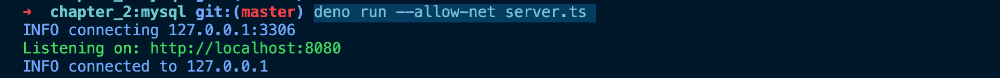

This is how my console looks when I start the server

我的控制台告诉我两件事。

1.  我的 Deno API 服务器正在端口 8080 上运行
2.  我的 MySQL 实例运行在`127.0.0.1`，也就是`localhost`

让我们测试一下我们的 API。我这里用的是 [Postman](https://www.postman.com/) ，但是你可以用你喜欢的 API 客户端。

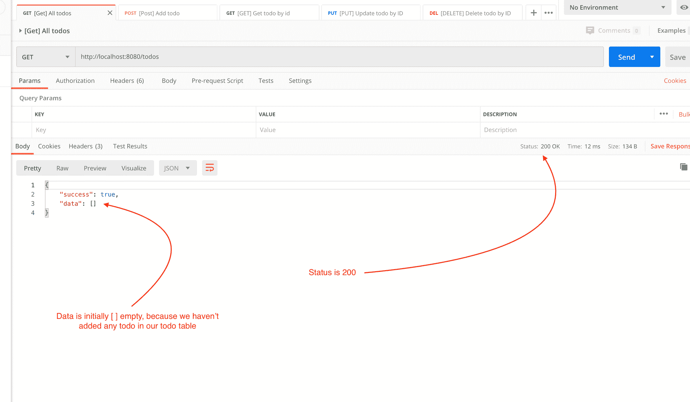

running [GET] localhost:8080/todos => Will return all todos

现在它只返回空数据。但是一旦我们将数据添加到我们的`todo`表中，它就会将这些 todos 返回到这里。

太棒了。一个 API 关闭，还有四个。

### [发布]添加待办事项 API

在`models/todo.ts`文件中，为`add()`函数添加以下定义:

```
export default {
   /**
   * Adds a new todo item to todo table
   * @param todo
   * @param isCompleted
   */
  add: async (
    { todo, isCompleted }: Todo,
  ) => {
    return await client.query(
      `INSERT INTO ${TABLE.TODO}(todo, isCompleted) values(?, ?)`,
      [
        todo,
        isCompleted,
      ],
    );
  },
}
```

add 函数接受 object 作为参数，它有两项:`todo`和`isCompleted`。

所以`*add*: *async* ({ todo, isCompleted }: Todo) => {}`也可以写成`({todo, isCompleted}: {todo:string, isCompleted:boolean})`。但是因为我们已经在我们的`interfaces/Todo.ts`文件中定义了一个接口

```
export default interface Todo {
  id?: number,
  todo?: string,
  isCompleted?: boolean,
} 
```

我们可以简单地把这个写成`*add*: *async* ({ todo, isCompleted }: Todo) => {}`。这告诉 TypeScript 这个函数有两个参数，`todo`是一个字符串，`isCompleted`是一个布尔值。

如果你想了解更多关于接口的内容，TypeScript 有一个很好的文档，你可以在这里找到。

在我们的函数中有以下内容:

```
return await client.query(
  `INSERT INTO ${TABLE.TODO}(todo, isCompleted) values(?, ?)`,
  [
    todo,
    isCompleted,
  ],
);
```

该查询可以分为两部分:

*   `INSERT INTO ${TABLE*.*TODO}(todo, isCompleted) values(?, ?)`。这里的两个问号表示在这个查询中使用了变量。
*   另一部分`[todo, isCompleted]`，是将进入查询的*第一部分*并被替换为`(?, ?)`的变量
*   `Table.Todo`只是一个来自文件`db/config.ts`的字符串，其中`Table.Todo`的值是“`todo`

接下来在我们的`controllers/todo.ts`文件中，转到`createTodo()`函数的定义:

```
export default {
   /**
   * @description Add a new todo
   * @route POST /todos
   */
  createTodo: async (
    { request, response }: { request: any; response: any },
  ) => {
    const body = await request.body();
    if (!request.hasBody) {
      response.status = 400;
      response.body = {
        success: false,
        message: "No data provided",
      };
      return;
    }

    try {
      await TodoModel.add(
        { todo: body.value.todo, isCompleted: false },
      );
      response.body = {
        success: true,
        message: "The record was added successfully",
      };
    } catch (error) {
      response.status = 400;
      response.body = {
        success: false,
        message: `Error: ${error}`,
      };
    }
  },
}
```

让我们把它分成两部分:

**第一部分**

```
const body = await request.body();
if (!request.hasBody) {
  response.status = 400;
  response.body = {
    success: false,
    message: "No data provided",
  };
  return;
}
```

我们在这里所做的只是检查用户是否在正文中发送数据。如果没有，那么我们返回一个状态`400`，并在主体中返回`success: false`和`message: <erromessage-string>`。

**第二部分**

```
try {
  await TodoModel.add(
    { todo: body.value.todo, isCompleted: false },
  );
  response.body = {
    success: true,
    message: "The record was added successfully",
  };
} catch (error) {
  response.status = 400;
  response.body = {
    success: false,
    message: `Error: ${error}`,
  };
}
```

如果没有错误，调用`TodoModel.add()`函数并简单地向用户返回一个状态`200`和一个确认消息。

否则，它只会抛出一个类似于我们在前面的 API 中所做的错误。

现在我们结束了。启动您的终端，确保您的 MySQL 实例正在运行。在您的终端中键入:

```
$ deno run --allow-net server.ts 
```

转到 [Postman](https://www.postman.com/) 并运行该控制器的 API 路由:

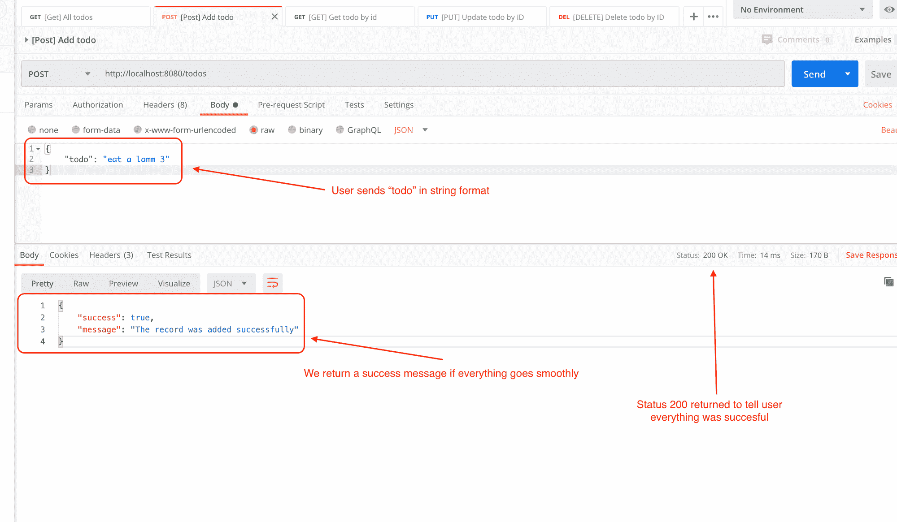

running [POST] localhost:8080/todos => Will add a new new todo item

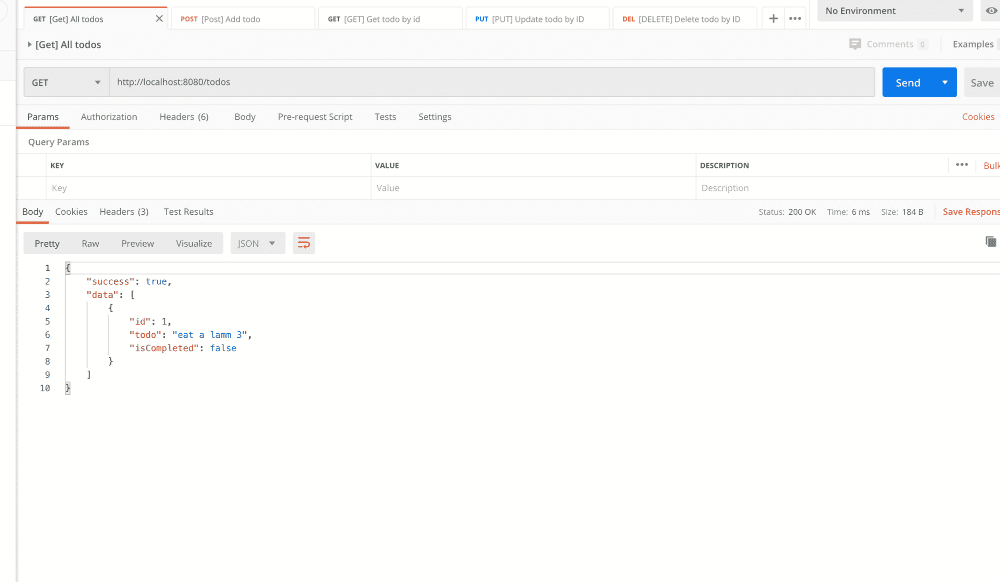

running [POST] localhost:8080/todos => Will return all todos, notice how the new added item is being returned as well

这很好，现在我们有两个工作的 API 了。只剩三个了。

### [GET]按 id 的待办事项 API

在您的`models/todo.ts`文件中，添加这两个函数的定义，`doesExistById()`和`getById()`:

```
export default {
   /**
   * Takes in the id params & checks if the todo item exists
   * in the database
   * @param id
   * @returns boolean to tell if an entry of todo exits in table
   */
  doesExistById: async ({ id }: Todo) => {
    const [result] = await client.query(
      `SELECT COUNT(*) count FROM ${TABLE.TODO} WHERE id = ? LIMIT 1`,
      [id],
    );
    return result.count > 0;
  },
  /**
   * Takes in the id params & returns the todo item found
   * against it.
   * @param id
   * @returns object of todo item
   */
  getById: async ({ id }: Todo) => {
    return await client.query(
      `SELECT * FROM ${TABLE.TODO} WHERE id = ?`,
      [id],
    );
  },
}
```

让我们一个一个地谈论每个功能:

*   `doesExistById`接受一个`id`并返回一个`boolean`,指示数据库中是否存在特定的 todo。

让我们来分解这个函数:

```
const [result] = await client.query(
  `SELECT COUNT(*) count FROM ${TABLE.TODO} WHERE id = ? LIMIT 1`,
  [id],
);
return result.count > 0;
```

我们只是根据特定的 todo id 检查表中的计数。如果计数大于零，我们返回`true`。否则，我们返回`false`。

*   `getById`返回特定 id 的待办事项:

```
return await client.query(
  `SELECT * FROM ${TABLE.TODO} WHERE id = ?`,
  [id],
);
```

我们只是在这里运行一个 MySQL 查询，通过 id 获得一个 todo，并按原样返回结果。

接下来，转到您的`controllers/todo.ts`文件并添加一个`getTodoById`控制器方法的定义:

```
export default {
   /**
   * @description Get todo by id
   * @route GET todos/:id
   */
  getTodoById: async (
    { params, response }: { params: { id: string }; response: any },
  ) => {
    try {
      const isAvailable = await TodoModel.doesExistById(
        { id: Number(params.id) },
      );

      if (!isAvailable) {
        response.status = 404;
        response.body = {
          success: false,
          message: "No todo found",
        };
        return;
      }

      const todo = await TodoModel.getById({ id: Number(params.id) });
      response.status = 200;
      response.body = {
        success: true,
        data: todo,
      };
    } catch (error) {
      response.status = 400;
      response.body = {
        success: false,
        message: `Error: ${error}`,
      };
    }
  },
}
```

让我们把它分成两个小部分:

```
const isAvailable = await TodoModel.doesExistById(
  { id: Number(params.id) },
);

if (!isAvailable) {
  response.status = 404;
  response.body = {
    success: false,
    message: "No todo found",
  };
  return;
}
```

首先，我们使用以下方法根据 id 检查数据库中是否存在 todo:

```
const isAvailable = await TodoModel.doesExistById(
  { id: Number(params.id) },
);
```

这里我们需要将`params.id`转换成`Number`，因为我们的 todo 接口只接受`id`作为数字。接下来，我们将`params.id`传递给`doesExistById`方法。此方法将作为布尔值返回。

然后，我们简单地检查 todo 是否不可用，并返回一个带有标准响应的`404`方法，就像前面的端点一样:

```
if (!isAvailable) {
  response.status = 404;
  response.body = {
    success: false,
    message: "No todo found",
  };
  return;
}
```

然后我们有:

```
try {
const todo: Todo = await TodoModel.getById({ id: Number(params.id) });
response.status = 200;
response.body = {
  success: true,
  data: todo,
};
} catch (error) {
response.status = 400;
response.body = {
  success: false,
  message: `Error: ${error}`,
};
```

这类似于我们在以前的 API 中所做的。这里我们只是从数据库获取数据，设置变量`todo`，然后返回响应。如果有错误，我们只需在 catch 块中向用户返回一条标准的错误消息。

现在启动您的终端，确保您的 MySQL 实例正在运行。在您的终端中键入:

```
$ deno run --allow-net server.ts 
```

转到 [Postman](https://www.postman.com/) 并运行该控制器的 API 路由。

请记住，每次重启服务器时，我们都会重置数据库。如果不希望出现这种行为，可以简单地在文件`db/client.ts`中注释掉`run`函数。

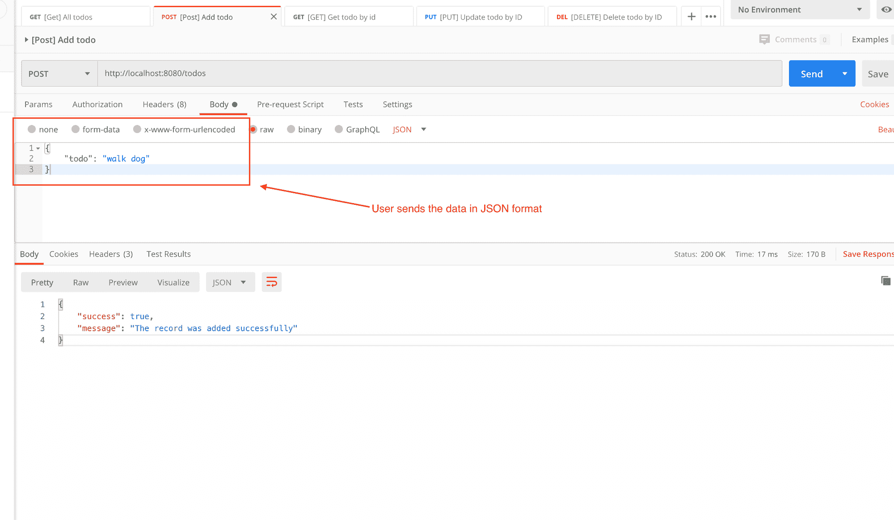

running [POST] localhost:8080/todos => Will add a new new todo item

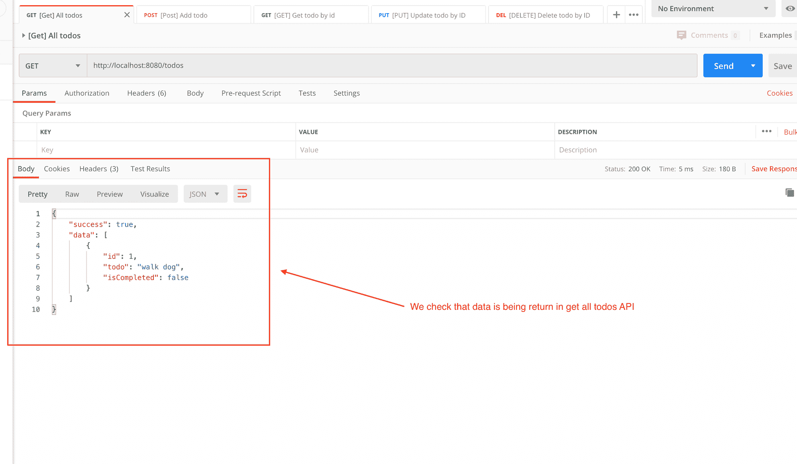

running [POST] localhost:8080/todos => Will return all todos

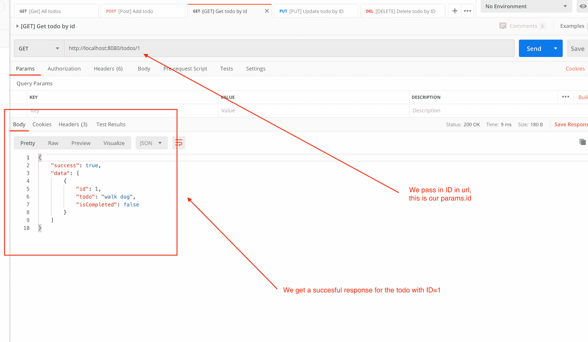

running [GET] localhost:8080/todos/:id => will return the todo for that id if found

![running [GET] localhost:8080/todos/:id => will return the todo for that id if found](img/0c58fb60d32bcec72c968c8d3885f9d2.png)

running [GET] localhost:8080/todos/<unknown-id> => returns status 404 with not found error message

到目前为止，我们已经为以下产品开发了 API:

*   获取所有待办事项
*   创建新的待办事项
*   按 ID 获取待办事项

以下是剩余的 API:

*   按 ID 更新待办事项
*   按 ID 删除待办事项

### [PUT]按 id 更新待办事项 API

让我们首先为这个 API 创建一个模型。进入我们的`models/todo.ts`文件，为`updateById`函数添加一个定义:

```
**
 * Updates the content of a single todo item
 * @param id
 * @param todo
 * @param isCompleted
 * @returns integer (count of effect rows)
 */
updateById: async ({ id, todo, isCompleted }: Todo) => {
  const result = await client.query(
    `UPDATE ${TABLE.TODO} SET todo=?, isCompleted=? WHERE id=?`,
    [
      todo,
      isCompleted,
      id,
    ],
  );
  // return count of rows updated
  return result.affectedRows;
},
```

`updateById`接受三个参数:`id`、`todo`和`isCompleted`。

我们只需在这个函数中运行一个 MySQL 查询:

```
onst result = await client.query(
  `UPDATE ${TABLE.TODO} SET todo=?, isCompleted=? WHERE id=?`,
  [
    todo,
    isCompleted,
    id,
  ],
);
```

这通过特定的`id`来更新单个待办事项的`todo`和`isCompleted`。

接下来，我们通过执行以下操作返回该查询更新的行数:

```
 // return count of rows updated
  return result.affectedRows;
```

计数将为 0 或 1，但绝不会超过 1。这是因为我们的数据库中有唯一的 ID——不能存在多个 ID 相同的待办事项。

接下来转到我们的`controllers/todo.ts`文件，添加一个`updateTodoById`函数的定义:

```
updateTodoById: async (
  { params, request, response }: {
    params: { id: string };
    request: any;
    response: any;
  },
) => {
  try {
    const isAvailable = await TodoModel.doesExistById(
      { id: Number(params.id) },
    );
    if (!isAvailable) {
      response.status = 404;
      response.body = {
        success: false,
        message: "No todo found",
      };
      return;
    }

    // if todo found then update todo
    const body = await request.body();
    const updatedRows = await TodoModel.updateById({
      id: Number(params.id),
      ...body.value,
    });
    response.status = 200;
    response.body = {
      success: true,
      message: `Successfully updated ${updatedRows} row(s)`,
    };
  } catch (error) {
    response.status = 400;
    response.body = {
      success: false,
      message: `Error: ${error}`,
    };
  }
},
```

这与我们以前编写的 API 几乎相同。新的部分是这样的:

```
// if todo found then update todo
const body = await request.body();
const updatedRows = await TodoModel.updateById({
  id: Number(params.id),
  ...body.value,
});
```

我们简单地获取用户在 JSON 中发送给我们的主体，并将主体传递给我们的`TodoModel.updateById`函数。

我们必须将`id`转换成一个数字，以符合我们的 Todo 接口。

执行查询并返回更新的行数。从那里我们简单地返回我们的响应。如果有错误，它会转到 catch 块，在那里我们返回标准的响应消息。

让我们运行这个，看看它是否有效。确保您的 MySQL 实例正在运行，并从您的终端运行以下命令:

```
$ deno run --allow-net server.ts 
```

转到 [Postman](https://www.postman.com/) 并运行该控制器的 API 路由:

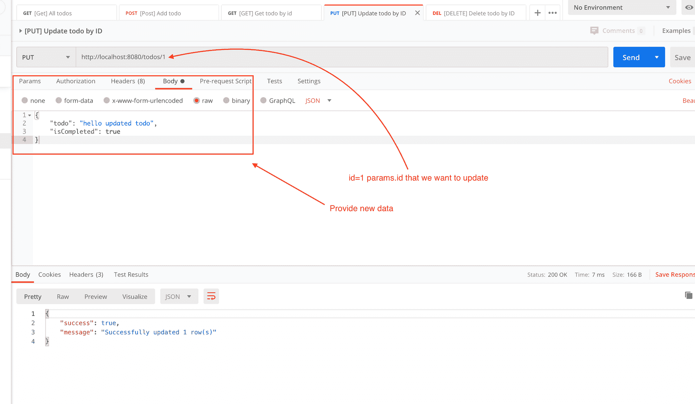

running [PUT] localhost:8080/todos/:id => will update content of that todo by given id

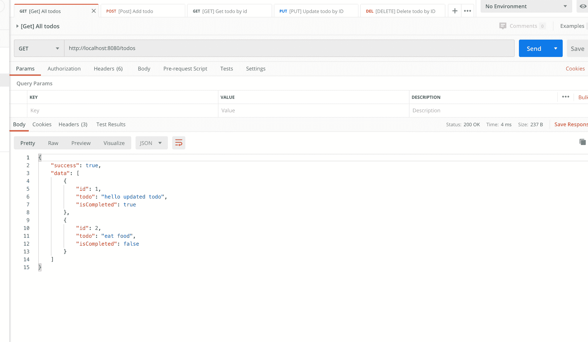

running [GET] localhost:8080/todos/ => will return all todos, see how the todo you updated is also showing there.

### [删除]按 id 的待办事项 API

在您的`models/todo.ts`文件中创建一个名为`deleteById`的函数:

```
/**
 * Deletes a todo by ID
 * @param id
 * @returns integer (count of effect rows)
 */
deleteById: async ({ id }: Todo) => {
  const result = await client.query(
    `DELETE FROM ${TABLE.TODO} WHERE id = ?`,
    [id],
  );
  // return count of rows updated
  return result.affectedRows;
},
```

这里我们简单地传递一个`id`作为参数，然后使用删除 MySQL 查询。然后，我们返回更新后的行数。更新后的计数将是 0 或 1，因为每个待办事项的 ID 是唯一的。

接下来，进入您的`controllers/todo.ts`文件并定义一个`deleteByTodoId`方法:

```
/**
 * @description Delete todo by id
 * @route DELETE todos/:id
 */
deleteTodoById: async (
  { params, response }: { params: { id: string }; response: any },
) => {
  try {
    const updatedRows = await TodoModel.deleteById({
      id: Number(params.id),
    });
    response.status = 200;
    response.body = {
      success: true,
      message: `Successfully updated ${updatedRows} row(s)`,
    };
  } catch (error) {
    response.status = 400;
    response.body = {
      success: false,
      message: `Error: ${error}`,
    };
  }
},
```

这很简单。我们将`params.id`传递给我们的`TodoModel.deleteById`方法，并返回用该查询更新的行数。

如果出现任何问题，catch 块就会抛出一个错误，返回我们的标准错误响应。

我们来看看这个。

确保您的 MySQL 实例正在运行。在您的终端中键入:

```
$ deno run --allow-net server.ts 
```

转到 [Postman](https://www.postman.com/) 并运行该控制器的 API 路由:

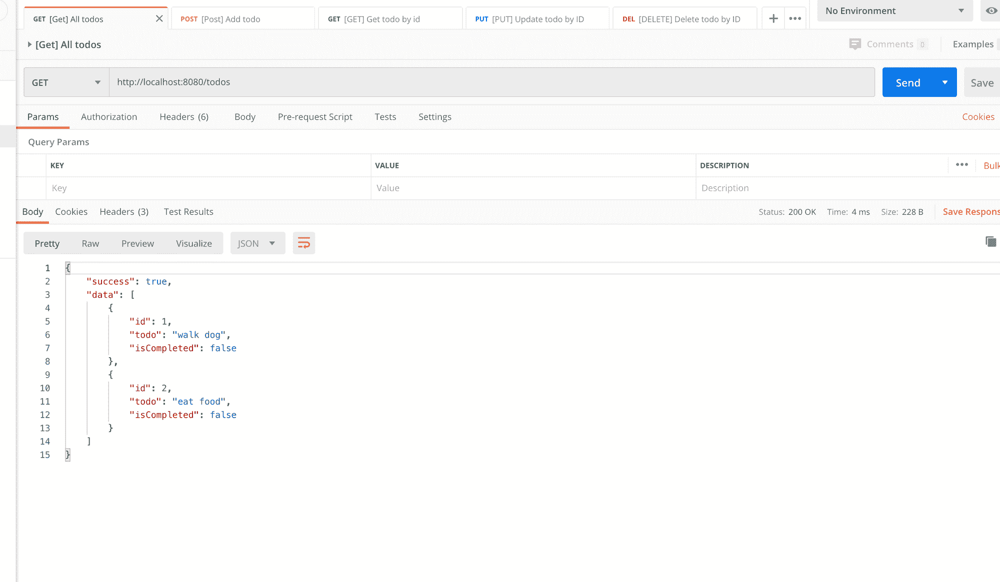

running [GET] localhost:8080/todos/ => will return all todos

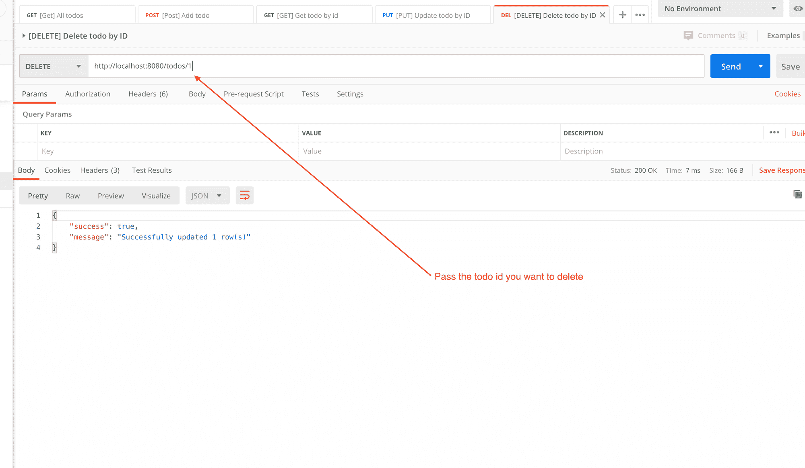

running [DELETE] localhost:8080/todos/:id => will delete a todo by ID

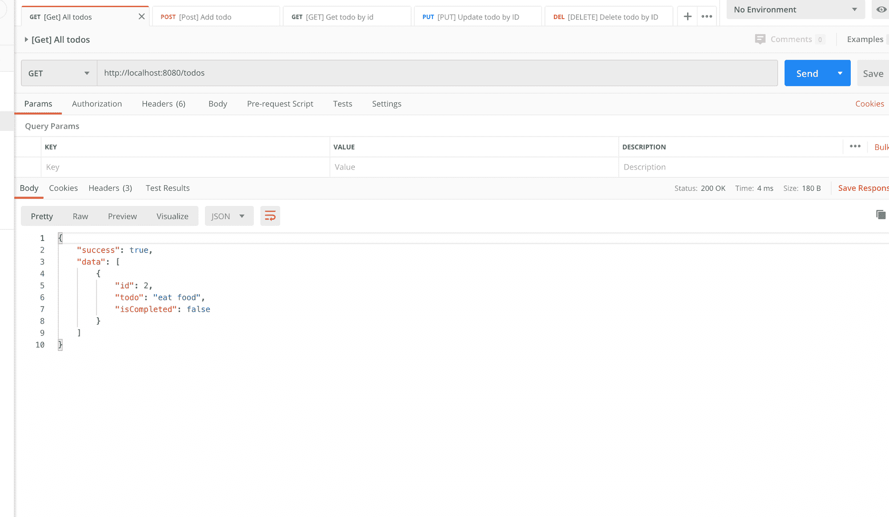

running [GET] localhost:8080/todos/ => will return all todos, see how todo with "id" is no longer here

这样我们就完成了 Deno + Oak + MySQL 教程。

完整的源代码可以在这里找到:[https://github.com/adeelibr/deno-playground](https://github.com/adeelibr/deno-playground)。如果您发现问题，请告诉我。或者随意提出拉取请求，我会在存储库中给你积分。

如果你觉得这个教程有帮助，请分享它。和往常一样，我可以在推特@adeelibr 上找到我。我很想听听你的想法。