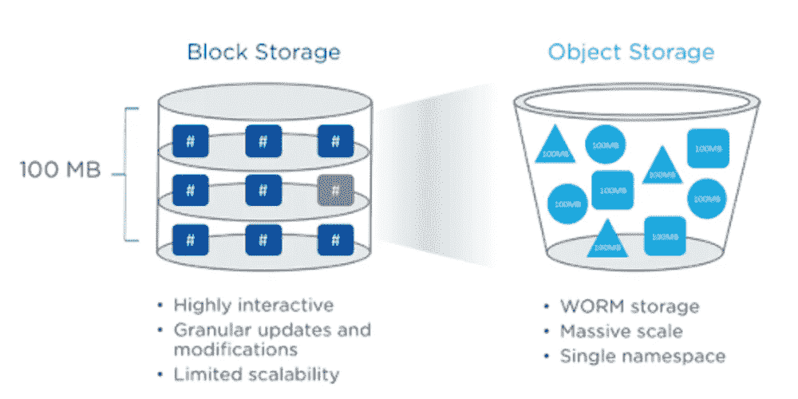
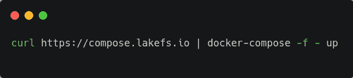
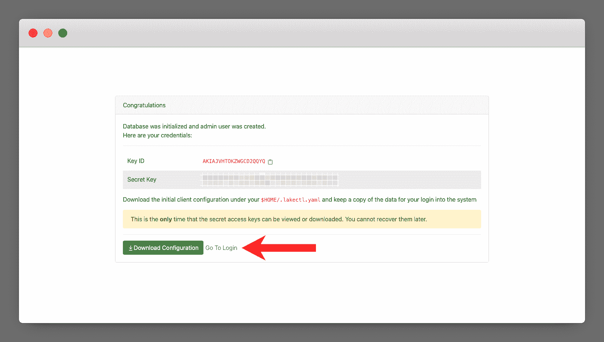
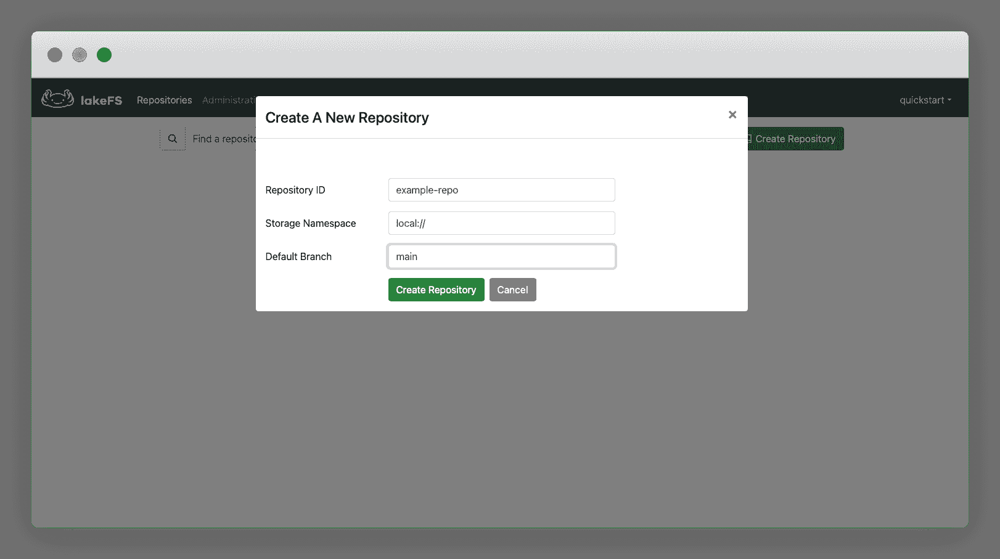
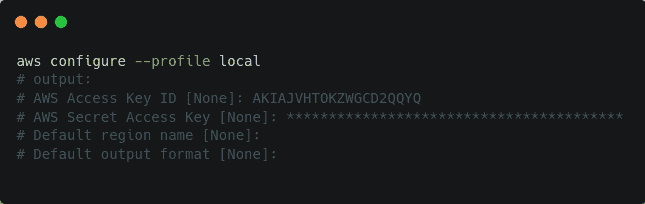
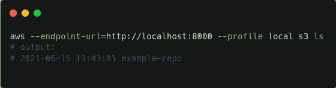
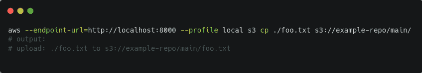
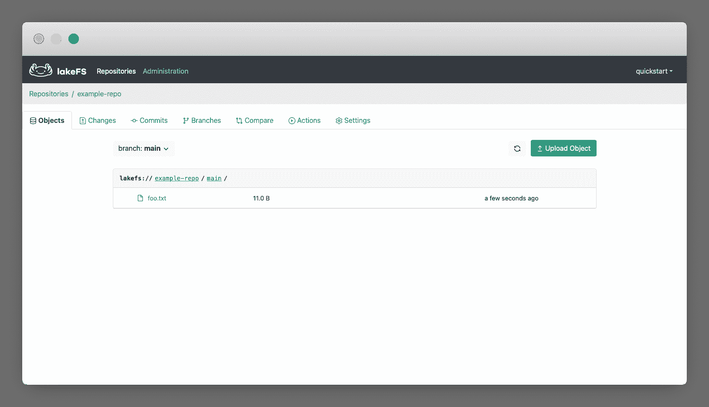
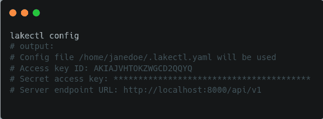
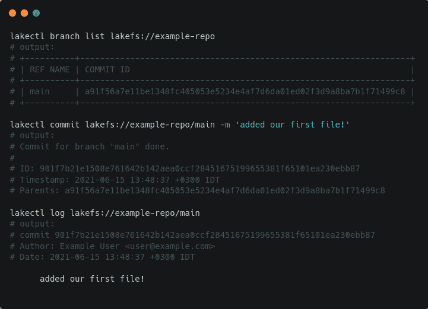

# 如何使用对象存储进行数据并行化和实验

> 原文：<https://www.freecodecamp.org/news/how-to-use-object-storage-for-parallelization-and-experimentation/>

通过使用大数据，公司可以了解很多关于其业务表现的信息。随着数据的到来，对销售额、流失率和其他基本指标的分析几乎可以实时获得。

然后你需要做更复杂的分析。有时，两个看似不相关的数据集之间的关系可以提供令人惊讶的见解，并为组织揭示重要的机会。

数据科学家和工程师正在继续改进他们分解和处理数据的方式。实验需要发现数据点之间正确的相关性。

这意味着他们还需要对此类数据和生成的模型进行某种并行处理。并行化仅仅意味着在不破坏原始数据完整性的情况下，以多种不同的方式对同一个数据集进行操作。

在本文中，我们将讨论如何确保有效地进行这种实验和并行处理，并提供最大的洞察力。我们将处理与数据存储和数据版本化相关的不同概念。

# 块存储与对象存储

对于外行来说，我们首先必须理解块存储和对象存储之间的区别，以及为什么在处理数据实验时后者是更好的选择。

[*Image source*](https://res.cloudinary.com/practicaldev/image/fetch/s--PYImgKrK--/c_imagga_scale,f_auto,fl_progressive,h_500,q_auto,w_1000/https://dev-to-uploads.s3.amazonaws.com/uploads/articles/4519hl0nf6aze73pyvsr.png)

## 什么是块存储？

它被称为“块存储”(也称为 [SAN](https://www.snia.org/education/storage_networking_primer/san/what_san) )，因为每个数据集(以文件的形式)被分组为存储在磁盘中的块。

块存储的一个经典例子是个人计算机上的文件系统。对于企业级用例，它通过由光缆连接的硬盘驱动器网络进行扩展。

使用块存储有一些缺点。首先，如果一个扇区(或一个块)被破坏，它会损坏文件。另一个问题是缺乏可扩展性(扩展光缆网络成本高昂)。

## 什么是对象存储？

在对象存储中，数据存储为对象。每个对象都包含称为 blob 的实际数据、唯一标识符(UUID)和元数据，元数据包含关于对象的信息(如时间戳、版本和作者)。

对象存储使扩展您的数据存储变得经济高效—为此您不需要复杂的硬件。它还使数据检索更快，因为每个对象都可以通过其 UUID 进行检索。

这与块存储形成对比，在块存储中，在检索实际信息之前，需要识别每个数据位置。

使用对象存储的一个缺点是数据只能写入一次，不能更新。但是这并不是一个真正的缺点，我们将在本文中进一步看到。

## 对象存储解决什么问题？

正如我们已经看到的，使用对象存储(无论数据存储的大小如何)，数据检索可以快得令人难以置信。但是当涉及到数据实验和数据并行化时，对象存储表现得最为出色。

如前所述，您不能覆盖任何已经存储为对象的数据。这可确保对象存储免受不必要的(或未经授权的)数据破坏或更新。如果您做了大量的数据处理，并且知道其中可能会发生意外的信息损坏，那就太好了。

对象存储可以解决的另一个问题是它不需要数据结构化。由于公司每时每刻都在生产和消费大量的信息，通常非结构化数据(如 pdf、视频、图像)不容易处理成有用的形式(如用于分析或仪表板)。

有了对象存储，这现在是可能的。你现在可以使用非结构化数据来开发机器学习模型。

对于数据存储，同一个 blob 可能有不同的版本(具有不同的元数据)。由于有 Git 用于代码版本控制，我们可以用相似的方式管理相同数据的不同版本。

这就引出了数据湖的概念。

## 什么是数据湖？

数据湖是数据的中央存储库，它不关心数据的格式。

公司生产和消费大量的数据。这些数据传统上处于孤岛中，因为它们属于不同的部门或以不同的形式存在(例如，视频与 MySQL 数据库中的数据不存储在同一个目录中)。

有了数据湖，企业中的任何部门都可以存储信息，而无需对其进行预处理。同样，任何部门的任何人都可以检索和分析任何数据。

数据湖非常重要，因为它们使数据分析变得非常快速和方便。

## 数据实验和并行化如何与对象存储一起工作

与开发软件一样，处理数据需要我们利用工具来帮助我们的工作流程。LakeFS 是一个强大的开源工具，用于试验数据和执行并行化(即对相同的数据进行处理，以创建不同的机器学习模型集)。

LakeFS 是一个开源平台，在处理数据时提供类似 Git 的功能。这意味着您可以创建分支(允许您试验数据)并提交数据(和数据模型)的版本。

### 为什么这个类似 Git 的特性很重要？

首先，你需要确保你的数据湖是兼容的。这意味着您的数据更改可以孤立地发生(在分支中)。因此，数据的完整性在主分支中得到维护(直到这样的更改准备好被合并)。

LakeFS 的另一个重要特性是数据的持续集成(同样，非常类似于软件开发)。企业需要在不被中断的情况下快速整合新数据。因此，拥有一个 [CI/CD](https://www.infoworld.com/article/3271126/what-is-cicd-continuous-integration-and-continuous-delivery-explained.html) 工作流的能力是非常宝贵的。

因此，让我们看看如何开始在我们的对象存储实验和并行化中使用 LakeFS。

### 如何安装 LakeFS

在本地，您可以通过在终端中运行以下命令来安装 LakeFS:*

[*Code source*](https://carbon.now.sh/?bg=rgba%28171%2C+184%2C+195%2C+1%29&t=seti&wt=none&l=application%2Fx-sh&ds=true&dsyoff=20px&dsblur=68px&wc=true&wa=true&pv=56px&ph=56px&ln=false&fl=1&fm=Hack&fs=14px&lh=133%25&si=false&es=2x&wm=false&code=curl%2520https%253A%252F%252Fcompose.lakefs.io%2520%257C%2520docker-compose%2520-f%2520-%2520up%250A)

这是假设您的系统中安装了 Docker 和 Docker-Compose。如果你没有 Docker 和 Docker-Compose，你可以试试其他的安装方法[这里](https://docs.lakefs.io/quickstart/more_quickstart_options.html)。

现在，在您的浏览器中访问[http://127 . 0 . 0 . 1:8000/setup](http://127.0.0.1:8000/setup)以验证您已经正确安装了它。

### 如何在 LakeFS 中创建存储库

一旦验证了 LakeFS 安装正确，就可以创建一个管理员用户。

[*Image source*](https://docs.lakefs.io/assets/img/setup.png)

[*Image source*](https://docs.lakefs.io/assets/img/setup_done.png)

单击登录链接，以管理员身份登录。

在您被重定向到的页面上，单击 Create Repository。将出现一个弹出窗口:

[*Image source*](https://docs.lakefs.io/assets/img/create_repo_local.png)

恭喜你！现在，您拥有了第一个存储库。这是您将要存储数据的主“桶”。

接下来，我们将开始添加一些数据。

### 如何将数据添加到您的 LakeFS 存储库中

访问[此处](https://docs.aws.amazon.com/cli/latest/userguide/cli-chap-install.html)安装 AWS CLI。

使用在管理员用户创建阶段创建的凭据，配置新的连接配置文件:

[*Code source*](https://carbon.now.sh/?bg=rgba%28171%2C+184%2C+195%2C+1%29&t=seti&wt=none&l=application%2Fx-sh&ds=true&dsyoff=20px&dsblur=68px&wc=true&wa=true&pv=56px&ph=56px&ln=false&fl=1&fm=Hack&fs=14px&lh=133%25&si=false&es=2x&wm=false&code=aws%2520configure%2520--profile%2520local%250A%2523%2520output%253A%250A%2523%2520AWS%2520Access%2520Key%2520ID%2520%255BNone%255D%253A%2520AKIAJVHTOKZWGCD2QQYQ%250A%2523%2520AWS%2520Secret%2520Access%2520Key%2520%255BNone%255D%253A%2520****************************************%250A%2523%2520Default%2520region%2520name%2520%255BNone%255D%253A%250A%2523%2520Default%2520output%2520format%2520%255BNone%255D%253A%250A)

要测试连接是否工作正常，请运行以下命令:

[*Code source*](https://carbon.now.sh/?bg=rgba%28171%2C+184%2C+195%2C+1%29&t=seti&wt=none&l=application%2Fx-sh&ds=true&dsyoff=20px&dsblur=68px&wc=true&wa=true&pv=56px&ph=56px&ln=false&fl=1&fm=Hack&fs=14px&lh=133%25&si=false&es=2x&wm=false&code=aws%2520--endpoint-url%253Dhttp%253A%252F%252Flocalhost%253A8000%2520--profile%2520local%2520s3%2520ls%250A%2523%2520output%253A%250A%2523%25202021-06-15%252013%253A43%253A03%2520example-repo%250A)

现在，要将文件复制到主分支:

[*Code source*](https://carbon.now.sh/?bg=rgba%28171%2C+184%2C+195%2C+1%29&t=seti&wt=none&l=application%2Fx-sh&ds=true&dsyoff=20px&dsblur=68px&wc=true&wa=true&pv=56px&ph=56px&ln=false&fl=1&fm=Hack&fs=14px&lh=133%25&si=false&es=2x&wm=false&code=aws%2520--endpoint-url%253Dhttp%253A%252F%252Flocalhost%253A8000%2520--profile%2520local%2520s3%2520cp%2520.%252Ffoo.txt%2520s3%253A%252F%252Fexample-repo%252Fmain%252F%250A%2523%2520output%253A%250A%2523%2520upload%253A%2520.%252Ffoo.txt%2520to%2520s3%253A%252F%252Fexample-repo%252Fmain%252Ffoo.txt%250A)

请注意，我们需要在路径前面加上我们想要使用的分支的名称。

现在，我们将在 UI 中看到我们添加的文件:

[*Image source*](https://docs.lakefs.io/assets/img/object_added.png)

接下来，我们需要知道如何提交和创建分支。为此，我们需要安装 LakeFS CLI。

### 如何安装 LakeFS CLI

你需要先在这里下载二进制文件[。](https://docs.lakefs.io/#downloads)

同样，我们需要使用之前创建的管理员凭据:

[*Code source*](https://carbon.now.sh/?bg=rgba%28171%2C+184%2C+195%2C+1%29&t=seti&wt=none&l=application%2Fx-sh&ds=true&dsyoff=20px&dsblur=68px&wc=true&wa=true&pv=56px&ph=56px&ln=false&fl=1&fm=Hack&fs=14px&lh=133%25&si=false&es=2x&wm=false&code=lakectl%2520config%250A%2523%2520output%253A%250A%2523%2520Config%2520file%2520%252Fhome%252Fjanedoe%252F.lakectl.yaml%2520will%2520be%2520used%250A%2523%2520Access%2520key%2520ID%253A%2520AKIAJVHTOKZWGCD2QQYQ%250A%2523%2520Secret%2520access%2520key%253A%2520****************************************%250A%2523%2520Server%2520endpoint%2520URL%253A%2520http%253A%252F%252Flocalhost%253A8000%252Fapi%252Fv1%250A)

下面是我们可以运行的一些命令:

[*Code source*](https://carbon.now.sh/?bg=rgba%28171%2C+184%2C+195%2C+1%29&t=seti&wt=none&l=application%2Fx-sh&ds=true&dsyoff=20px&dsblur=68px&wc=true&wa=true&pv=56px&ph=56px&ln=false&fl=1&fm=Hack&fs=14px&lh=133%25&si=false&es=2x&wm=false&code=lakectl%2520branch%2520list%2520lakefs%253A%252F%252Fexample-repo%250A%2523%2520output%253A%250A%2523%2520%252B----------%252B------------------------------------------------------------------%252B%250A%2523%2520%257C%2520REF%2520NAME%2520%257C%2520COMMIT%2520ID%2520%2520%2520%2520%2520%2520%2520%2520%2520%2520%2520%2520%2520%2520%2520%2520%2520%2520%2520%2520%2520%2520%2520%2520%2520%2520%2520%2520%2520%2520%2520%2520%2520%2520%2520%2520%2520%2520%2520%2520%2520%2520%2520%2520%2520%2520%2520%2520%2520%2520%2520%2520%2520%2520%2520%2520%257C%250A%2523%2520%252B----------%252B------------------------------------------------------------------%252B%250A%2523%2520%257C%2520main%2520%2520%2520%2520%2520%257C%2520a91f56a7e11be1348fc405053e5234e4af7d6da01ed02f3d9a8ba7b1f71499c8%2520%257C%250A%2523%2520%252B----------%252B------------------------------------------------------------------%252B%250A%2520%2520%2520%2520%2520%250Alakectl%2520commit%2520lakefs%253A%252F%252Fexample-repo%252Fmain%2520-m%2520%27added%2520our%2520first%2520file%21%27%250A%2523%2520output%253A%250A%2523%2520Commit%2520for%2520branch%2520%2522main%2522%2520done.%250A%2523%2520%250A%2523%2520ID%253A%2520901f7b21e1508e761642b142aea0ccf28451675199655381f65101ea230ebb87%250A%2523%2520Timestamp%253A%25202021-06-15%252013%253A48%253A37%2520%252B0300%2520IDT%250A%2523%2520Parents%253A%2520a91f56a7e11be1348fc405053e5234e4af7d6da01ed02f3d9a8ba7b1f71499c8%250A%2520%2520%250Alakectl%2520log%2520lakefs%253A%252F%252Fexample-repo%252Fmain%250A%2523%2520output%253A%2520%2520%250A%2523%2520commit%2520901f7b21e1508e761642b142aea0ccf28451675199655381f65101ea230ebb87%250A%2523%2520Author%253A%2520Example%2520User%2520%253Cuser%2540example.com%253E%250A%2523%2520Date%253A%25202021-06-15%252013%253A48%253A37%2520%252B0300%2520IDT%250A%2520%2520%2520%2520%2520%2520%2520%250A%2520%2520%2520%2520%2520%2520added%2520our%2520first%2520file%21%250A%2520%2520%2520%2520%2520%2520%2520)

你可以在 [online](https://docs.lakefs.io/reference/commands.html) 中找到所有其他命令，比如分支创建等等。

你有它！现在，您可以按照自己喜欢的任何方式处理数据。毫无愧疚地进行实验，创建数据模型的多个版本。

## 最后

在本文中，我们讨论了一些基础知识。我们学习了不同种类的数据存储机制，以及为什么对象存储在处理数据实验和并行性时有很多优势。

接下来，我们研究了数据湖和 LakeFS，这是处理数据的强大工具。

起初，这似乎是一项艰巨的任务。但是，正如我们在这里展示的，有了正确的工具和知识，您可以完成很多事情。