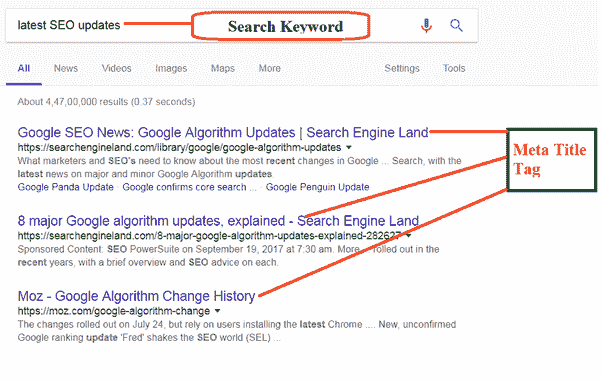
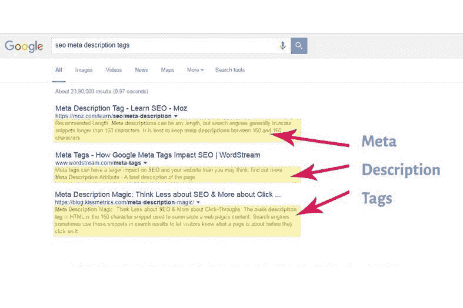
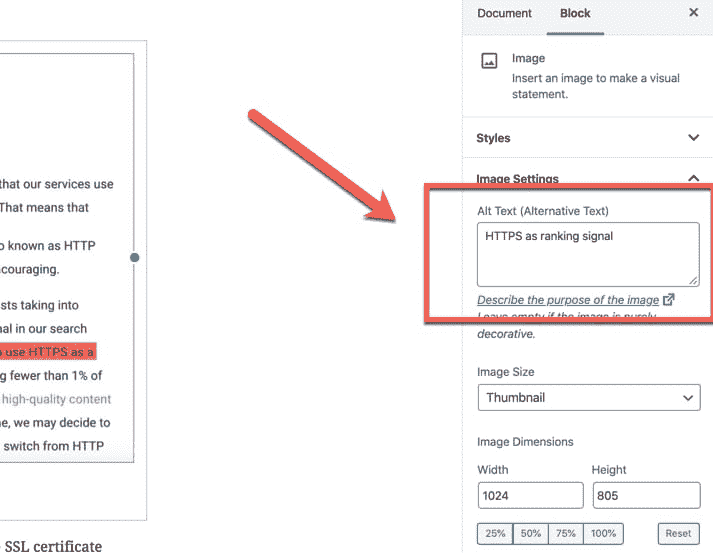

# 如何使用页面搜索引擎优化技术在谷歌的第一页排名

> 原文：<https://www.freecodecamp.org/news/how-to-use-on-page-seo-techniques-to-rank-on-the-first-page/>

页面内优化和页面外优化是影响一个网站优化的两大因素。

页面搜索引擎优化是一种搜索引擎优化技术，它可以帮助来自谷歌和其他搜索引擎的机器人浏览你的网站并理解它是关于什么的。

优化网站的一些功能，如内部链接、元标题、标题标签和描述，可以帮助你在搜索引擎中排名更高。

另一方面，离页优化与优化你的网站之外的其他信号有关。

对于这篇文章，我们将考虑最好的页面搜索引擎优化技术[来帮助你的网站在搜索引擎中排名靠前。](https://www.freecodecamp.org/news/seo-secrets-reverse-engineering-googles-algorithm-92fad4f5a39/)

Meta title

## Meta Title

如果你正在寻找最好的页面搜索引擎优化技术，那么你正在寻找你的元标题。如果你的标题优化得很好，很有吸引力，这将为你带来更多的点击。你的帖子得到的点击越多，排名就越高。

标题(H1)标签的开头应该包含目标关键词。但是如果你不能做到这一点，你应该确保你在标题中添加了关键词。

人们犯的一个错误是在标题中多次添加关键字。他们经常认为这将有助于他们更好地排名，但事实并非如此。更多的时候，会伤害你的排名。所以，你应该避免犯这个错误。

你也应该保持你的标题长度短。应该在 65 个字符左右。

## 正确使用标题标签

你的文章应该包括标题标签，你可以用它来突出重点、副标题和各种标题。

如果你的网站是 WordPress 网站，标题标签通常在 H1。所以，你的文章不应该再包含任何 H1 标签。一次就够了。你应该在你的分节符上使用 H2 标签和 H3 标签。

## 在文章中添加目录

越来越多的内容作者正在撰写冗长、深入的文章。而且现在很多博客帖子都挺长的。这些帖子有的几千字，很难看完。

对于这么长的文章，包含目录是很重要的。这将有助于读者轻松浏览你的长篇文章。同样重要的是，它可以帮助你在谷歌搜索中排名更靠前。

Keyword density

## 注意你的关键词密度

你的文章中关键词的密度应该接近 1.5%，并且应该与 LSI(潜在语义索引)关键词混合。LSI 关键字帮助谷歌理解你的页面是关于什么的。这些词与你使用的关键词有密切关系。

语义相关的词在文章中会有相同的意思和效果。所以，你可以利用同义词来降低关键词密度。

主要关键字应该在文章的第一段和最后一段只出现一次。你也应该试着只在有意义的地方使用关键词。

您也可以搜索与您的目标具有相同关键字的其他帖子，并查看这些关键字是如何使用的以及它们出现的次数。这会让你知道如何在文章中使用它们。

## Meta Tags

对于你写的每一篇长文，你应该包括一个独特的与文章相关的元描述。你的元描述也应该包括你的目标关键字。

很多人主张元描述没有那么重要，因为它不像[一样是排名](https://backlinko.com/on-page-seo)的一个因素。但这两种说法都是不真实的。元描述对你的博客文章很重要，也是排名的一个有用因素。谷歌排名和优化的元描述之间有着巨大的联系。

搜索引擎所做的就是提取关键词。但谷歌用户点击你的帖子也很重要。所以，你需要与文章相关并且非常友好的元描述。

谷歌已经澄清了关于元关键词的空气，并声称它不关心它们。但是必应和其他一些搜索引擎可能仍然关心元关键词。

Meta tegs

搜索引擎会找到关键词。但谷歌用户点击你的帖子也很重要。所以，你需要与文章相关并且非常友好的元描述。

谷歌已经澄清了关于元关键词的空气，并声称它不关心它们。但是必应和其他一些搜索引擎可能仍然关心元关键词。

## 使用带有有意义的标题和替代文本的图像

在内容中使用图片是通过图片搜索增加网站流量的好方法。因此，为你的帖子优化你的形象很重要。

例如，在你的替代文本和图片标题中使用关键词将确保你的博客文章更有针对性，更有针对性。当人们搜索与这个关键词相关的图片时，你的网站也会为此排名。

因此，在上传之前，请确保您的图像有一个有意义的名称。在你把图片添加到你的文章或 WordPress 网站之后，你还应该添加一个替代文本。

How to add Alt text

图像也能吸引用户。这反过来会让他们在你的网站上停留更长时间，增加你网站的排名。

然而，你也应该知道，大图片会降低你网站的速度，你在谷歌上的排名也会受到负面影响。为了避免这种情况，您应该:

*   使用 CDN:内容交付网络是位于全球战略位置的服务器网络。对于提高网站速度非常有效。
*   使用缓存插件:这有助于减少加载时间，提高网站速度。它将您的网页转换成静态页面，供首次用户使用。因此，当同一个用户第二次请求页面时，它会从这个缓存中加载页面。这减少了服务器的负载，使它工作得更快。
*   上传前压缩你的图片:大的图片需要更长的时间来加载。因此，减小图片尺寸对你网站的加载时间很重要。

## 检查你的字数

根据 [assignment help](https://www.assignmenthelper.com.au/) 的内容作者所说，博客文章，或者不是很长或者没有很多单词的文章在搜索引擎上排名很低。这是因为他们似乎缺乏足够的信息使他们有价值。

一般来说，基于信息的博客有至少 1300 字的标准字数。同样重要的是，你的内容包含大量的信息是经过充分研究的，尤其是如果你的关键词具有很强的竞争力。

## 内部链接

给你的博客文章添加内部链接可以确保你的读者在你的博客上停留更长的时间。这是因为他们会继续阅读你博客上已经链接在一起的文章。这也将有助于你的网站的其他网页排名更好，因为它提供了这些网页的流量。

当你[添加链接到你的其他页面](https://www.shoutmeloud.com/on-page-seo.html)时，你可以使用关键词作为锚文本。但是不要过度。在其他包含相关信息的页面上添加内部链接，表明你提供了额外的信息，搜索引擎会给你更好的排名。

## 外部链接

添加包含相关信息的外部网站链接也有助于您的排名。但是要确保你链接的网站在你的领域或行业中是权威的，值得信赖的。这将增加你的网站的可信度。

当然，如果你有任何理由怀疑网站的诚信，你不应该链接到他们，以免毁了你的信誉。

## 结论

如果你想让你的网站排在谷歌搜索的第一页，你应该实现这些页面搜索引擎优化技术。所有这些技术一起帮助你更好的排名。

我希望这篇文章对你有用。编码快乐！