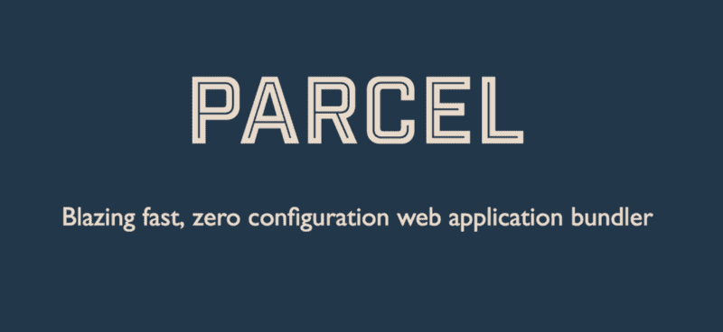

# 如何使用 package 捆绑 React.js 应用程序

> 原文：<https://www.freecodecamp.org/news/how-to-use-parcel-to-bundle-your-react-js-application-d023979e9fe4/>

迈克尔·奥祖梅纳

# 如何使用 package 捆绑 React.js 应用程序



#### 什么包裹？

[Parcel](https://parceljs.org/) 是一个 web 应用捆绑器，它利用多核处理提供了惊人的快速性能，并且不需要任何配置。

所以喜欢 Webpack？是的，像 Webpack 一样，但是更轻便，不需要配置。

#### 这篇文章提供了什么。

在本文中，我将向您展示如何使用 Parcel 来捆绑用 JavaScript (ES6)、HTML 和 CSS 构建的基本 React.js 应用程序。我们将从“零开始”创建一个 React.js 应用程序，而不使用像`create-react-app`这样的工具。

### **入门。**

我们需要做的第一件事是建立我们的项目。我在 GitHub 上创建了一些启动文件，你可以在这里看到它们[。当你在你的计算机上克隆了项目，运行`git checkout beginning`和`npm install`把事情放在一个“开始”的位置(注意，在这一点上，项目并没有真正工作，因为我们还没有任何捆绑文件)。](https://github.com/THEozmic/getting-started-parcel)

### 将文件捆绑在一起。

现在，我们设置了一个简单的`express`服务器来提供来自`dist/`文件夹的文件。当您运行`npm start`并前往`localhost:5000/`时，您看到`cannot GET /`的原因是因为还没有构建发生。因此，`dist/`文件夹是空的/不存在的。

为了开始捆绑我们的文件，并在您访问`localhost:5000/`时显示一些内容，我们需要做一些事情:

1.  通过运行`npm install parcel-bundler --save`安装软件包。
2.  创建构建脚本。
3.  运行构建脚本并启动我们的服务器。
4.  在浏览器中加载`localhost:5000/`。

### 创建构建脚本和捆绑文件。

在我们开始实际创建构建脚本并将其添加到我们的`package.json`文件之前，让我们学习更多关于捆绑文件的知识。

**注意**如果你只在你的项目的`node_modules`文件夹中安装了`parcel`并且没有全局使用`-g`标志，那么`parcel`命令将不起作用。

套装附带的一个很好的功能(除了其他惊人的东西)是内置的`dev-server`和[热模块替换](https://parceljs.org/hmr.html)。您可以通过运行`parcel index.html`来简单地使用这个`dev-server`，其中`index.html`是您的入口 HTML 文件。

不幸的是，我们不会在我们的演示项目中利用`dev-server`特性，因为我们已经构建了自己的小型`express`服务器，但这并不意味着我们将不再拥有`hot module replacement`。在你自己的时间里，请随意给`dev-server`一个旋转。

我们想使用的命令是:

*   `parcel watch index.html`将我们的文件构建到`dist/`文件夹中，并在开发模式下“观察”我们文件的变化，以及
*   `parcel build index.html`构建我们的文件并将它们转储到`dist/`文件夹中(对生产模式有用)。

如果我们运行了`npm install parcel-bundler -g`而不是`npm install parcel-bundler --save`，那么前面段落中的命令将会顺利运行——但是我们没有。我们将包安装到本地的`node_modules`文件夹中，所以我们不运行`parcel index.html`，而是运行`./node_modules/.bin/parcel index.html`来打包我们的文件。

既然我们已经了解了所有这些，我们可以继续编辑我们的`package.json`文件并向其中添加我们的构建脚本。

```
"scripts": {
    "parcel:dev": "./node_modules/.bin/parcel index.html",
    "parcel:watch": "./node_modules/.bin/parcel watch index.html",
    "parcel:build": "./node_modules/.bin/parcel build index.html"
  }
```

如你所见，我创建了三个`npm scripts`。现在，当我们运行`npm run parcel:watch`时，我们将把文件构建到`dist/`文件夹中。我们还将让 Parcel 监视我们在编辑 CSS、HTML 和 JavaScript 文件时所做的更改，这样它将为我们热重新加载页面。

### **查看结果。**

为了在浏览器中查看我们简单的 React.js 应用程序，我们可以运行`npm start`(一个已经存在的脚本)来启动我们的`express`服务器，然后它应该在监听`localhost:5000/`。

#### **要带走的关键东西。**

1.  您可以使用完全零配置的包开始运行。你所要做的就是安装它并运行命令。
2.  包适用于开发和生产模式。
3.  包裹有内置的`dev-server`和`hot module replacement`来帮助你快速移动。
4.  除了本文中的内容之外，还有更多的东西需要打包，所以一定要查看[文档](https://parceljs.org/)以获得更深入的内容。

我希望你喜欢它。如果你看到了，别忘了留下评论和一些掌声。