# 如何使用粒子氩进行位置追踪

> 原文：<https://www.freecodecamp.org/news/how-to-use-particle-argon-for-location-tracking/>

曾经想要在项目中添加存在或位置跟踪吗？对解决方案(或缺乏解决方案)感到沮丧？

别担心，你不是唯一一个！

在这篇文章中，你将学习如何实现一个非常基本的跟踪和通知应用程序。我们将使用粒子氩和瓷砖伴侣。

到最后，你将能够判断瓷砖是否存在。另外，我们将使用 Pushover 向您选择的设备发送推送通知。

我们走吧！

**注意**在我们开始之前，这个帖子是**冗长的**。[你可以下载 PDF 版本，这样你可以保存并在以后查看。](https://www.jaredwolff.com/files/how-to-location-tracking-using-particle-mesh-pdf/)

## 初步调查

乍一看，使用瓷砖的想法并不明显。理想情况下，使用电话似乎更有意义。不幸的是，这不是一个可行的选择。这将需要更多的研究和蓝牙 iOS 应用程序的创建。

所以，使用电话的想法已经过时了。

然后我想，“什么设备*一直在做广告？”*

*这就是为什么我走上了像 Tile 这样的追踪者的道路。*

*它到达后，有一些常规测试。第一站，瓷砖应用。*

*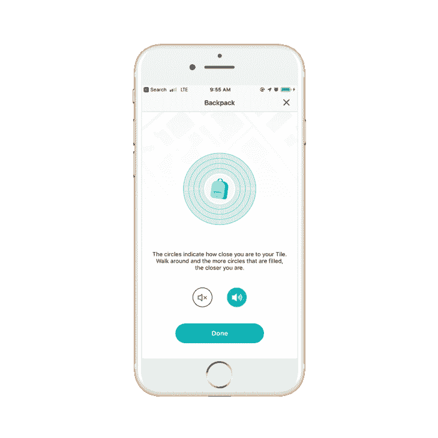*

*我可以连接并使用这个设备。我甚至让它播放了一首朗朗上口的曲子。？*

*然后，我开始使用一个蓝牙扫描仪应用程序。我滚动所有的结果，宾果。瓷砖在那里！*

*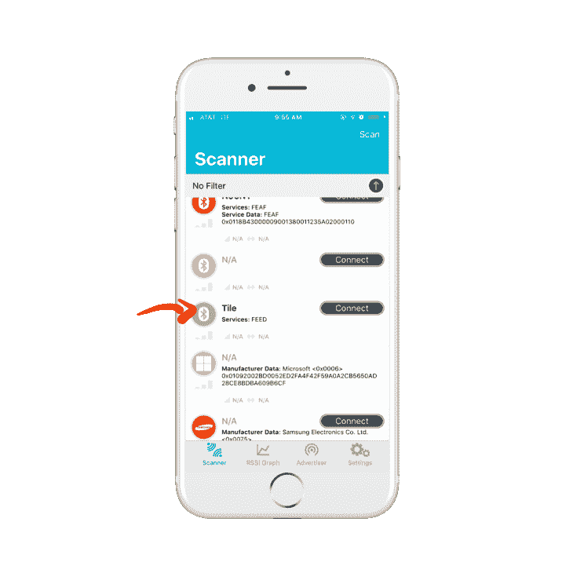*

*我甚至等了几个小时，又检查了一遍。我想确定它过一会儿不会睡着。结果，总是广告。据我所知，大约每 8 秒钟。*

*所有这些测试得出一个结论:它可以很容易地用于现场检测。*

*该过程的下一步是试图找出如何让它与氩气一起工作。*

## *广告*

*正如我们在上一步中收集的信息，我们知道磁贴大约每 8 秒钟发布一次广告。这意味着它应该很容易被任何设备扫描，包括氩、氮或硼。*

*对于这个例子，我建议你使用氩气。这是因为蓝牙和 Mesh 共享同一个无线电。当扫描瓷砖时，连接到 Mesh 的 Xenon 经常会错过广告包。这将导致假阴性(和沮丧！).*

*同样的，你要确保你的氩气没有连接到网状网络。您可以使用 CLI 删除它。将设备连接到计算机，并运行以下命令:*

```
*`particle mesh remove <device name/ID>`* 
```

*确保将 **<设备名称/ID >** 替换为您设备的名称或 ID。*

*好吧，回到正题。*

*在蓝牙中，广告可以有几种不同的用途。通常，这标志着配对阶段的开始。这样，其他设备知道广告设备是可用的。*

*此外，广告设备将指示它有什么服务。我们可以利用这些知识来过滤掉不匹配的设备。*

*例如，以下是互动程序设备上可用服务的屏幕截图:*

*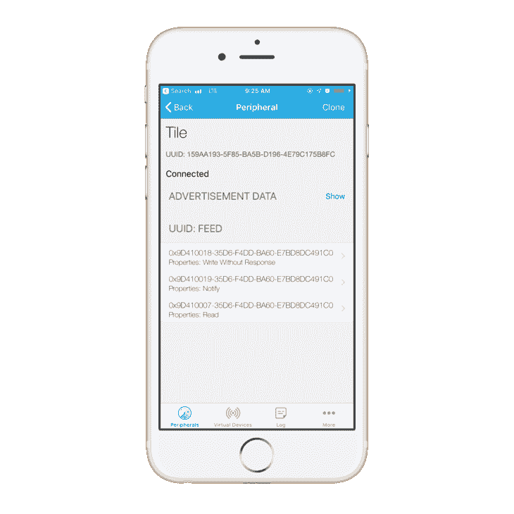*

*扫描时，我们将仔细检查我们正在连接的设备是否具有`0xfeed`的服务 UUID。*

*在我们深入研究蓝牙领域之前，让我们使用记录器设置我们的应用程序进行调试。*

## *记录*

*在本教程中，我们将使用记录器。它允许您使用`particle serial monitor`显示应用程序中的日志消息。*

*日志记录器的一个更酷的特性是消息层次结构的概念。这允许设计者有选择地屏蔽不必要的消息。*

*例如，如果您有用于调试的消息。您可以删除它们或将其注释掉。或者，您可以增加`LOG_LEVEL`以便有效地忽略它们。*

*以下是 Particle 的设备操作系统存储库中的`logging.h`中提供的日志记录级别:*

```
*`// Log level. Ensure log_level_name() is updated for newly added levels
typedef enum LogLevel {
    LOG_LEVEL_ALL = 1, // Log all messages
    LOG_LEVEL_TRACE = 1,
    LOG_LEVEL_INFO = 30,
    LOG_LEVEL_WARN = 40,
    LOG_LEVEL_ERROR = 50,
    LOG_LEVEL_PANIC = 60,
    LOG_LEVEL_NONE = 70, // Do not log any messages
    // Compatibility levels
    DEFAULT_LEVEL = 0,
    ALL_LEVEL = LOG_LEVEL_ALL,
    TRACE_LEVEL = LOG_LEVEL_TRACE,
    LOG_LEVEL = LOG_LEVEL_TRACE, // Deprecated
    DEBUG_LEVEL = LOG_LEVEL_TRACE, // Deprecated
    INFO_LEVEL = LOG_LEVEL_INFO,
    WARN_LEVEL = LOG_LEVEL_WARN,
    ERROR_LEVEL = LOG_LEVEL_ERROR,
    PANIC_LEVEL = LOG_LEVEL_PANIC,
    NO_LOG_LEVEL = LOG_LEVEL_NONE
} LogLevel;`* 
```

*酷，日志级别。但是我们如何使用它们呢？*

*我们可以通过调用以下函数之一来使用它们:*

*`Log.trace`、`Log.info`、`Log.warn`、`Log.error`。*

*例如:*

```
*`Log.trace("This is a TRACE message.");`* 
```

*如果我们将日志级别设置为`LOG_LEVEL_INFO`，我们将只看到来自`Log.info`、`Log.warn`和`Log.error`的消息。`LOG_LEVEL_WARN`？只有`Log.warn`和`Log.error`会出现。(希望你明白了。)*

*为了设置它，我们将默认级别设置为`LOG_LEVEL_ERROR`。我们还会将特定于应用程序的`LOG_LEVEL`设置为`LOG_LEVEL_TRACE`。最终结果应该是这样的*

```
*`// For logging
SerialLogHandler logHandler(115200, LOG_LEVEL_ERROR, {
    { "app", LOG_LEVEL_TRACE }, // enable all app messages
});`* 
```

*这样我们就不会收到来自 DeviceOS 日志消息的垃圾邮件。另外，我们从应用程序本身获得所有适用的消息。*

*顺便说一句，如果你想把你的设备设置成一个单独的`LOG_LEVEL`，你可以这样设置它:*

```
*`SerialLogHandler logHandler(LOG_LEVEL_INFO);`* 
```

*当你继续使用 Particle 的 DeviceOS 时，你会很快意识到它有多方便。现在，让我们进入正题吧！*

## *设置它*

*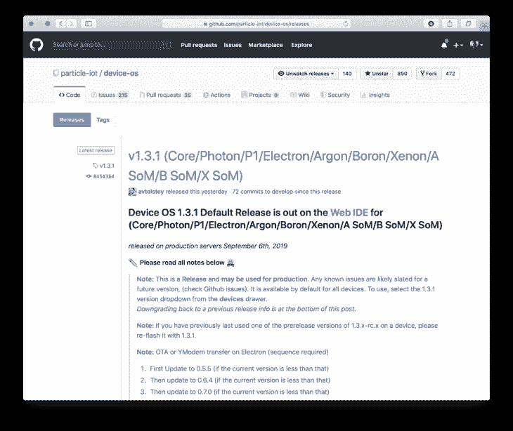*

*首先，我们要确保我们使用的是正确版本的设备操作系统。1.3 以后的任何版本都会有蓝牙。你可以在这里得到[的说明。](https://www.jaredwolff.com/how-to-upgrade-particle-mesh-device-os/)*

*接下来，我们要开始扫描瓷砖。我们希望在指定的时间间隔在`loop()`函数中这样做。在这种情况下，我们将使用一个`millis()`定时器:*

```
*`// Scan for devices
if( (millis() > lastSeen + TILE_RE_CHECK_MS) ){
    BLE.scan(scanResultCallback, NULL);
}`* 
```

*确保在文件顶部定义了`lastSeen`,如下所示:*

```
*`system_tick_t lastSeen = 0;`* 
```

*我们将使用它来跟踪瓷砖最后一次被“看到”的时间。即氩最后一次看到来自区块的广告包的时间。*

*`TILE_RE_CHECK_MS`可以定义为*

```
*`#define TILE_RE_CHECK_MS 7500`* 
```

*这样，我们至少每 7.5 秒检查一次广告包。*

*为了找到图块设备，我们将使用`BLE.scan`。当我们调用它时，它将开始扫描过程。当设备被发现时`scanResultCallback`将会触发。*

*现在，我们可以在文件的顶部定义`scanResultCallback`:*

```
*`void scanResultCallback(const BleScanResult *scanResult, void *context) {
}`* 
```

*您会注意到它包含了一个`BleScanResult`。这将包含地址、RSSI 和设备名称(如果可用)以及可用的服务信息。这将在我们寻找磁贴设备时派上用场！*

*请记住，`BLE.scan`在扫描完成之前不会返回。扫描的默认超时时间是 5 秒。您可以使用`BLE.setScanTimeout()`来更改该值。`setScanTimeout`以 10ms 为增量单位。因此，500 毫秒的超时需要值 50。*

*对于这个应用程序，我建议使用 8s(8000 毫秒)的值。您可以这样设置它:*

```
*`BLE.setScanTimeout(800);`* 
```

*在这种情况下，设备将扫描该区块进行广告的时间。这样就不太可能错过广告包。*

## *处理扫描结果*

*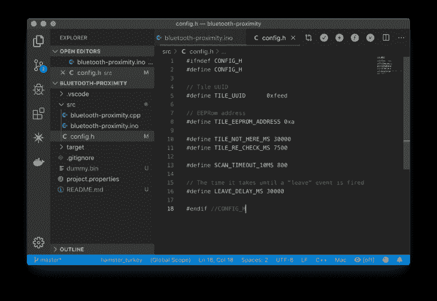*

*现在我们有了`scanResultCallback`让我们来定义内部发生了什么。*

*我们首先想获得广告数据中的服务信息。最好的办法是用`scanResult->advertisingData.serviceUUID`。我们将传入一个 UUIDs 数组，它将被复制供我们使用。*

```
*`BleUuid uuids[4];
int uuidsAvail = scanResult->advertisingData.serviceUUID(uuids,sizeof(uuids)/sizeof(BleUuid));`* 
```

*这将填充`uuids`,这样您就可以迭代它们。`uuidsAvail`将等于可用 UUIDs 的数量。*

*在我们的案例中，我们在寻找一个特定的 UUID。我们将把它定义在文件的顶部:*

```
*`#define TILE_UUID 0xfeed`* 
```

*通常 UUIDs 要长得多。像这样的短 UUID 意味着它已经被保留或者是蓝牙规范的一部分。在这两种情况下，我们都将以检查 32 位或 128 位版本的相同方式来检查它。*

*出于诊断原因，我们还可以打印出设备信息。在这种情况下，RSSI 和设备 MAC 地址很方便:*

```
*`// Print out mac info
BleAddress addr = scanResult->address;
Log.trace("MAC: %02X:%02X:%02X:%02X:%02X:%02X", addr[0], addr[1], addr[2], addr[3], addr[4], addr[5]);
Log.trace("RSSI: %dBm", scanResult->rssi);`* 
```

*最后，让我们建立一个循环，看看找到的设备是否有 UUID:*

```
*`// Loop over all available UUIDs
// For tile devices there should only be one
for(int i = 0; i < uuidsAvail; i++){

    // Print out the UUID we're looking for
    if( uuids[i].shorted() == TILE_UUID ) {
        Log.trace("UUID: %x", uuids[i].shorted());

        // Stop scanning
        BLE.stopScanning();

        return;
    }
}`* 
```

*我们可以很容易地将 UUID 的“缩短”版本与`TILE_UUID`进行比较。这是一个简单的整数，所以不需要复杂的内存比较操作。因此，使用`if( uuids[i].shorted() == TILE_UUID )`就可以了。*

*您也可以使用`Log.trace`打印出诊断信息。在这种情况下，我们用它来打印出 UUID 的`shorted()`版本。*

### *测试一下！*

*让我们来测试一下我们目前所拥有的！*

*为你的氩编程应用程序。打开终端，运行`particle serial monitor`查看调试信息。下面是一个你可能会看到的例子:*

```
*`0000005825 [app] TRACE: MAC: 65:C7:B3:AF:73:5C
0000005827 [app] TRACE: RSSI: -37Bm
0000005954 [app] TRACE: MAC: B3:D9:F1:F0:5D:7E
0000005955 [app] TRACE: RSSI: -62Bm
0000006069 [app] TRACE: MAC: C5:F0:74:3D:13:77
0000006071 [app] TRACE: RSSI: -62Bm
0000006217 [app] TRACE: MAC: 65:C7:B3:AF:73:5C
0000006219 [app] TRACE: RSSI: -39Bm
0000006224 [app] TRACE: MAC: B3:D9:F1:F0:5D:7E
0000006225 [app] TRACE: RSSI: -62Bm
0000006296 [app] TRACE: MAC: D7:E7:FE:0C:A5:C0
0000006298 [app] TRACE: RSSI: -60Bm
0000006299 [app] TRACE: UUID: feed`* 
```

*注意消息是如何包含`TRACE`和`[app]`的？这意味着它是来自应用程序代码的跟踪消息。得心应手对吗？*

*这段代码很快就会变成垃圾邮件，尤其是如果你处在一个有很多广告蓝牙设备的环境中。如果你的磁贴打开并运行，最终你会看到一条消息`UUID: feed`。这意味着你的氩找到了瓷砖！*

*接下来，我们将使用板载模式按钮将图块的地址“编程”到内存中。这样我们就可以过滤掉所有我们不关心的设备。*

## *按下按钮时添加设备*

*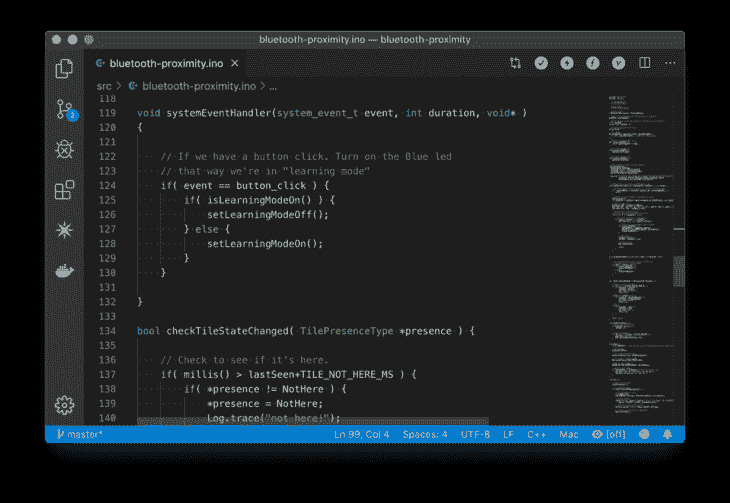*

*首先，我们需要弄清楚如何监控模式按钮。根据文档，最好的办法是使用`System.on`。*

```
*`System.on(button_click, eventHandler);`* 
```

*第一个参数是系统事件的名称。在我们的例子中是`button_click`。第二个参数是一个事件处理函数。我们暂且称之为`eventHandler`。*

*现在让我们创建`eventHandler`*

```
*`void eventHandler(system_event_t event, int duration, void* )
{

}`* 
```

***重要:**不能使用`eventHandler`里面的`Log`函数。测试它的一个简单方法是切换 D7 上的 LED。我们开始吧！*

*初始化`setup()`中的 LED*

```
*`// Set LED pin
pinMode(D7,OUTPUT);`* 
```

*然后我们可以在`eventHandler`里面加上这个*

```
*`if( event == button_click ) {
    if( digitalRead(D7) ) {
        digitalWrite(D7,LOW);
    } else {
        digitalWrite(D7,HIGH);
    }
}`* 
```

*然后，我们可以写入 D7(板载蓝色 LED)。我们甚至可以使用`digitalRead`来读取 LED 的状态。它会根据情况用`HIGH`或`LOW`来回应。*

*将固件加载到设备上，我们就可以很好地控制蓝色 LED 了！*

*在下一节中，我们将使用模式按钮将设备置于“学习”模式。这将允许我们使用目标磁贴设备进行一键设置。*

## *将地址存储到 EEPROM*

*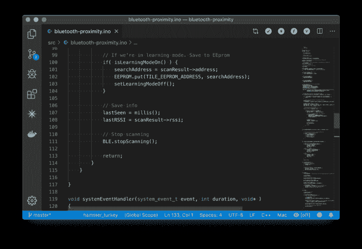*

*在下一步中，我们将把图块的地址存储到 EEPROM 中。这样，当设备重新启动或断电时，我们仍然能够在以后识别磁贴。*

*然而还有一个挥之不去的问题。我们如何让它首先保存地址？*

*通过监控按钮按压，我们可以将设备置于“学习”模式。该设备将扫描瓷砖，并保存地址，如果找到一个。*

*首先让我们在`if( uuids[i].shorted() == TILE_UUID )`中添加一个条件:*

```
*`// If we're in learning mode. Save to EEPROM
if( isLearningModeOn() ) {
    searchAddress = scanResult->address;
    EEPROM.put(TILE_EEPROM_ADDRESS, searchAddress);
    setLearningModeOff();
}`* 
```

*我们将使用 D7 的状态作为知道我们处于“学习模式”的一种方式。我们通过使用`digitalRead(D7)`读取 D7 来做到这一点。让我们创建一个函数来更清楚地说明这一点:*

```
*`bool isLearningModeOn() {
    return (digitalRead(D7) == HIGH);
}`* 
```

*我们也可以把`digitalWrite(D7,LOW);`和`digitalWrite(D7,HIGH);`换成类似的功能。这样我们做的事情就更直接了。*

```
*`// Set "Learning mode" on
void setLearningModeOn() {
    digitalWrite(D7,HIGH);
}

// Set "Learning mode" off
void setLearningModeOff() {
    digitalWrite(D7,LOW);
}`* 
```

*然后，我们指定一个全局变量`searchAddress`作为扫描结果。我们在文件的顶部这样设置`searchAddress`:*

```
*`BleAddress searchAddress;`* 
```

*接下来我们想使用`EEPROM.put`将其保存到非易失性存储器中。`TILE_EEPROM_ADDRESS`定义为`0xa`。你可以定义`TILE_EEPROM_ADDRESS`来使用任何你喜欢的内存地址。这是放在文件顶部的完整定义。*

```
*`#define TILE_EEPROM_ADDRESS 0xa`* 
```

*最后，我们使用`setLearningModeOff()`关闭 LED 和“学习模式”*

*每次发现一个设备，我们将使用`millis()`来设置`lastSeen`。此外，我们可以使用`lastRSSI`追踪最后一个 RSSI。这是一种知道设备大概有多近的廉价方法。我们将使用`scanResult->rssi`来获取这些信息，并将其设置为`lastRSSI`变量。*

*总的来说，您的更改应该如下所示:*

```
*`...

// Print out the UUID we're looking for
if( uuids[i].shorted() == TILE_UUID ) {
    Log.trace("UUID: %x", uuids[i].shorted());

    // If we're in learning mode. Save to EEprom
    if( isLearningModeOn() ) {
        searchAddress = scanResult->address;
        EEPROM.put(TILE_EEPROM_ADDRESS, searchAddress);
        setLearningModeOff();
    }

    // Save info
    lastSeen = millis();
    lastRSSI = scanResult->rssi;

    // Stop scanning
    BLE.stopScanning();

    return;
}`* 
```

*在此功能之前，我们可以过滤掉与我们的`searchAddress`不匹配的设备。在`if( uuids[i].shorted() == TILE_UUID )`前增加以下内容:*

```
*`// If device address doesn't match or we're not in "learning mode"
if( !(searchAddress == scanResult->address) && !isLearningModeOn() ) {
    return;
}`* 
```

*这将跳过不匹配的设备。只有当地址匹配或者我们处于“学习模式”时，它才会继续。*

*现在，为了让我们在启动时加载`searchAddress`，我们必须从闪存中加载它。将这一行添加到您的`setup():`*

```
*`EEPROM.get(TILE_EEPROM_ADDRESS, searchAddress);`* 
```

*然后，检查以确保地址有效。如果所有字节都是`0xFF`，则无效:*

```
*`// Warning about address
if( searchAddress == BleAddress("ff:ff:ff:ff:ff:ff") ) {
    Log.warn("Place this board into learning mode");
    Log.warn("and keep your Tile near by.");
}`* 
```

*我们应该能够“教”我们的氩我们瓷砖的地址。让我们测试一下！*

### *测试一下。*

*现在，如果我们编译并运行这个应用程序，注意到没有更多的日志输出了吗？我们必须将图块地址“教授”给粒子设备。所以，按下模式键。蓝色 LED 应该会亮起。*

*一旦找到您的图块，LED 将关闭，您将在命令行上看到一些输出。类似于我们之前看到的:*

```
*`0000006296 [app] TRACE: MAC: D7:E7:FE:0C:A5:C0
0000006298 [app] TRACE: RSSI: -60Bm
0000006299 [app] TRACE: UUID: feed`* 
```

*设备已被提交到内存中！*

*您还可以检查复位后它是否仍被保存。点击**复位**按钮，检查是否有与上述相同的输出。如果它出现了，我们还是好的！*

## *更新云*

*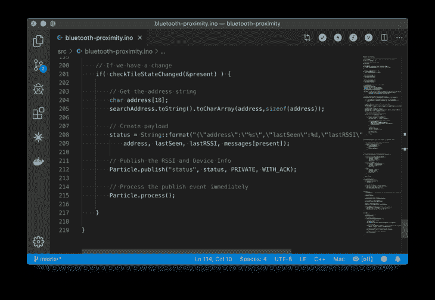*

*最后让我们建立一个名为`checkTileStateChanged`的函数。我们将使用它定期检查图块状态的变化。*

```
*`bool checkTileStateChanged( TilePresenceType *presence ) {

}`* 
```

*该功能的主要目的是将`lastSeen`变量与“超时”持续时间进行比较。在我们的例子中，我们的超时持续时间是`TILE_NOT_HERE_MS`,应该设置为*

```
*`#define TILE_NOT_HERE_MS 30000`* 
```

*靠近你程序的顶端。还有两个条件需要考虑。一个是`lastSeen`等于 0。这通常是因为应用程序在启动后尚未找到磁贴。*

*最后一种情况是设备已经被看到并且`lastSeen`不为 0。因此，在`checkTileStateChanged`内，让我们将所有内容放在一起。*

```
*`// Check to see if it's here.
if( millis() > lastSeen+TILE_NOT_HERE_MS ) {

} else if ( lastSeen == 0 ) {

} else {

}

return false;`* 
```

*现在我们只希望这个函数在状态已经改变的情况下返回真值**。所以我们需要利用协议中的`TilePresenceType`指针。***

***简单地列举所有可能的状态。你也可以把它贴在你文件的顶部。这是:***

```
***`typedef enum {
    PresenceUnknown,
    Here,
    NotHere
} TilePresenceType;`*** 
```

***您还需要一个全局变量，我们可以将它传递给函数。也将此设置在文件的顶部:***

```
***`// Default status
TilePresenceType present = PresenceUnknown;`*** 
```

***现在，我们可以在每个阶段进行比较。符合标准吗？状态和上一个不一样吗？如果是，则返回 true。***

***记住，我们希望将`presence`设置为新的更新值。所以每个条件都应该更新存在值。例如:***

```
***`*presence = NotHere;`*** 
```

***下面是完全清除函数的样子:***

```
***`bool checkTileStateChanged( TilePresenceType *presence ) {

    // Check to see if it's here.
    if( millis() > lastSeen+TILE_NOT_HERE_MS ) {
        if( *presence != NotHere ) {
            *presence = NotHere;
            Log.trace("not here!");
            return true;
        }
    // Case if we've just started up
    } else if ( lastSeen == 0 ) {
        if( *presence != PresenceUnknown ) {
            *presence = PresenceUnknown;
            Log.trace("unknown!");
            return true;
        }
    // Case if lastSeen is < TILE_NOT_HERE_MS
    } else {
        if( *presence != Here ) {
            *presence = Here;
            Log.trace("here!");
            return true;
        }
    }

    return false;
}`*** 
```

***我们现在可以在定时器下面的主循环中使用这个函数来启动`Ble.scan()`。我们可以用它来发送 JSON 有效载荷。在这种情况下，我们将包括重要信息，如蓝牙地址、`lastSeen`数据、`lastRSSI`数据和一条消息。***

```
***`// If we have a change
if( checkTileStateChanged(&present) ) {

}`*** 
```

***我们将使用一个数组`char`来获取字符串格式的地址。你可以把`toString()`和`toCharArray`链在一起，得到我们需要的东西。***

```
***`// Get the address string
char address[18];
searchAddress.toString().toCharArray(address,sizeof(address));`*** 
```

***有效负载字符串的示例如下所示:***

```
***`// Create payload
status = String::format("{\"address\":\"%s\",\"lastSeen\":%d,\"lastRSSI\":%i,\"status\":\"%s\"}",
    address, lastSeen, lastRSSI, messages[present]);`*** 
```

***`status`只是一个在文件顶部定义的字符串:***

```
***`// The payload going to the cloud
String status;`*** 
```

***您会注意到还有一个名为`messages`的变量。这是一个字符串的静态常量数组。它们被映射到来自`TilePresenceType`的值。这是它的样子***

```
***`const char * messages[] {
    "unknown",
    "here",
    "not here"
};`*** 
```

***这样`PresenceUnknown`匹配到`"unknown"`，`Here`匹配到`"here"`，以此类推。这是一种将字符串与枚举关联起来的简单而廉价的方法。***

***最后，我们将发布和处理。这使我们能够立即发送更新。***

```
***`// Publish the RSSI and Device Info
Particle.publish("status", status, PRIVATE, WITH_ACK);

// Process the publish event immediately
Particle.process();`*** 
```

***最终，整个函数应该是这样的:***

```
***`// If we have a change
if( checkTileStateChanged(&present) ) {

    // Get the address string
    char address[18];
    searchAddress.toString().toCharArray(address,sizeof(address));

    // Create payload
    status = String::format("{\"address\":\"%s\",\"lastSeen\":%d,\"lastRSSI\":%i,\"status\":\"%s\"}",
        address, lastSeen, lastRSSI, messages[present]);

    // Publish the RSSI and Device Info
    Particle.publish("status", status, PRIVATE, WITH_ACK);

    // Process the publish event immediately
    Particle.process();

}`*** 
```

***现在，让我们来测试一下！***

### ***测试它！***

***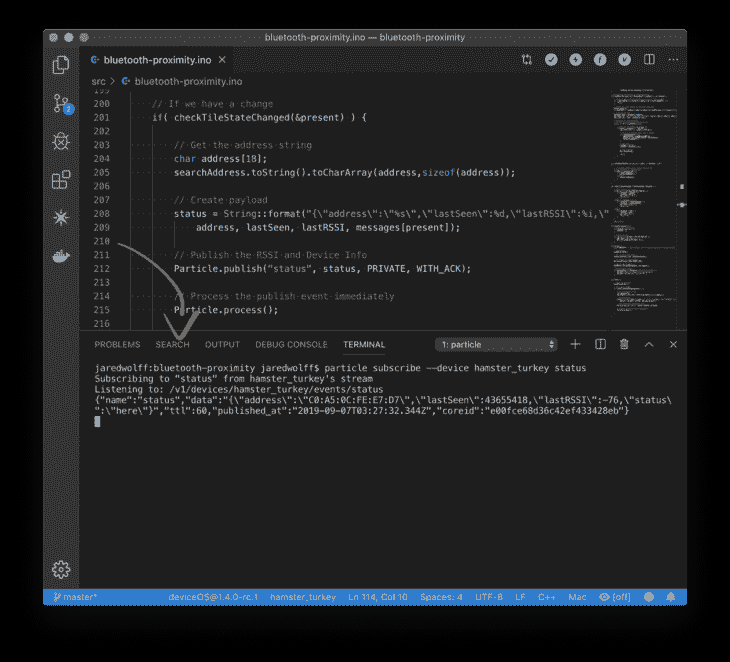***

***我们可以进行测试，以确保我们的发布事件在没有事件离开粒子工作台的情况下发生。进入**视图→终端，打开一个新的终端。**然后使用以下命令:***

```
***`particle subscribe --device <device_name> <event_name>`*** 
```

***用您设备的名称或 ID 替换`<device_name>`。***

***将`<event_name>`替换为事件的名称。在我们的例子中是`status`。***

***然后，您可以通过取出电池并等待“不在这里”的提示来测试这一切。插上电池，你应该会得到一个“这里”的提示。***

***这是输出的一个例子***

```
***`> particle subscribe --device hamster_turkey status

Subscribing to "status" from hamster_turkey's stream
Listening to: /v1/devices/hamster_turkey/events/status
{"name":"status","data":"{\"address\":\"C0:A5:0C:FE:E7:D7\",\"lastSeen\":40154002,\"lastRSSI\":-82,\"status\":\"not here\"}","ttl":60,"published_at":"2019-09-07T02:29:42.232Z","coreid":"e00fce68d36c42ef433428eb"}
{"name":"status","data":"{\"address\":\"C0:A5:0C:FE:E7:D7\",\"lastSeen\":40193547,\"lastRSSI\":-83,\"status\":\"here\"}","ttl":60,"published_at":"2019-09-07T02:29:50.352Z","coreid":"e00fce68d36c42ef433428eb"}`*** 
```

## ***配置 Webhook***

***在本教程的最后一部分，我们将使用 webhook 设置推送通知。如前所述，我们将使用 Pushover 和它们的便捷 API 向您选择的设备发送推送通知。***

***Pushover 有一个非常容易使用的 API。他们的应用程序是一把瑞士军刀，适用于你不想编写应用程序来发送推送通知的情况。***

***你要注意的第一件事是你的**用户密钥。**登录 Pushover 即可获得。注意:如果您还没有帐户，您需要先设置一个帐户。***

***它应该是这样的:***

***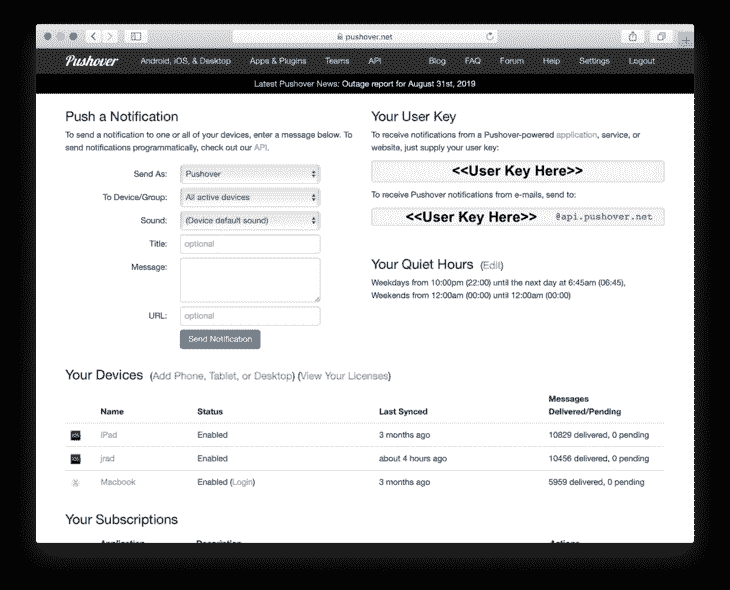***

***如果你登录后看不到这个页面，点击 **Pushover 标志**，应该会把你带回来。***

***接下来，我们要创建一个应用程序。点击屏幕上方的**应用程序&插件**。***

***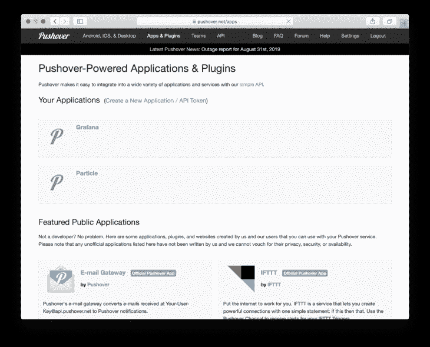***

***然后你应该点击**创建一个新的应用程序。**这将允许我们获得一个 **API 令牌**，这将是粒子网络钩子设置所需要的。***

***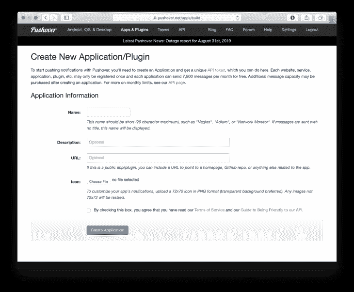***

***设置一个你认为合适的名字。如果您需要提醒，请填写描述。**点击方框**然后点击**创建应用。*****

***你应该翻到下一页。复制并保存 **API 令牌/密钥**我们还需要几个步骤。***

***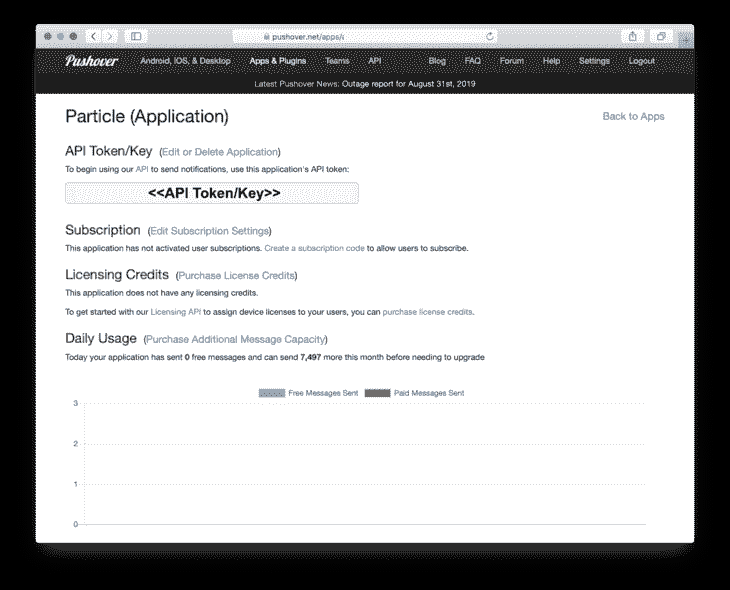***

***现在，让我们设置 Webhook。跳转到[https://console . particle . io](https://console.particle.io/)并创建一个新的集成。***

***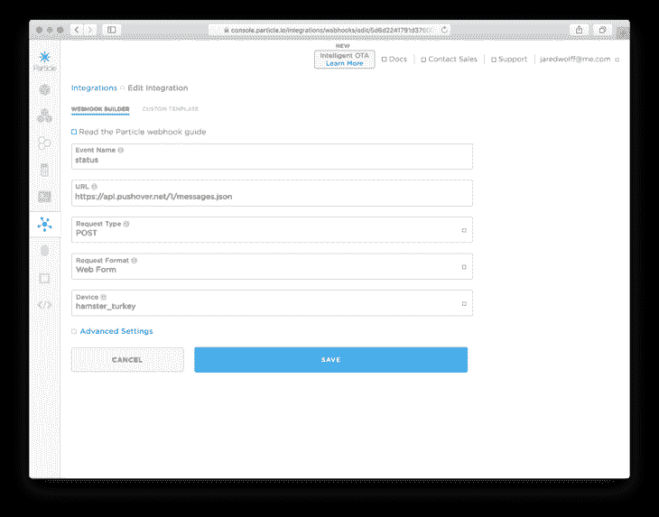***

***我们将把**事件名称**设置为**状态**。***

*****网址**到**https://api.pushover.net/1/messages.json*****

***此外，如果您想通过特定设备进行过滤，请确保在**设备下拉列表中选择该设备。*****

***在**高级设置**下，我们将通过设置几个字段来结束。***

***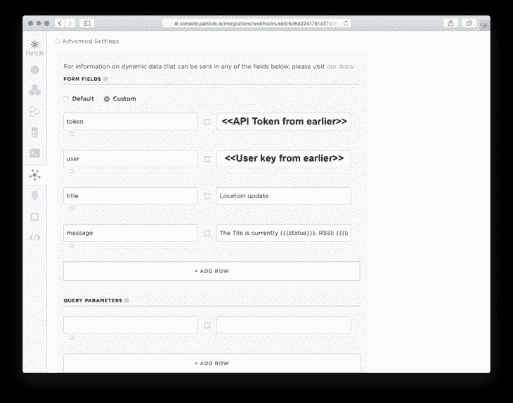***

***创建以下字段:**令牌、** **用户**、**头衔**和**消息**。然后将 token 设置为我们之前得到的 **API Token** 。对**用户键进行同样的操作。*****

*****标题**将显示为您消息的标题。做对你有意义的事情。***

***您可以将**消息**设置为`The Tile is currently {{{status}}}. RSSI: {{{lastRSSI}}}`。***

***我们在这里使用小胡子模板。它们允许您使用发布的有效负载中的数据，并根据您的喜好重新格式化它。在我们的例子中，我们用它们来“填补空白”经过处理的**消息**看起来会像这样:***

***`The Tile is currently here. RSSI: -77`***

***顺便提一下，我将在我的指南中更多地讨论这些模板。敬请关注！***

### ***测试一下***

***一旦您的集成就位，您就可以测试我们在前面步骤中所做的事情。取出电池，等待“不在这里”的消息。把它放回去，等着“到了”的消息。***

***这是它在 iPhone 上的样子:***

***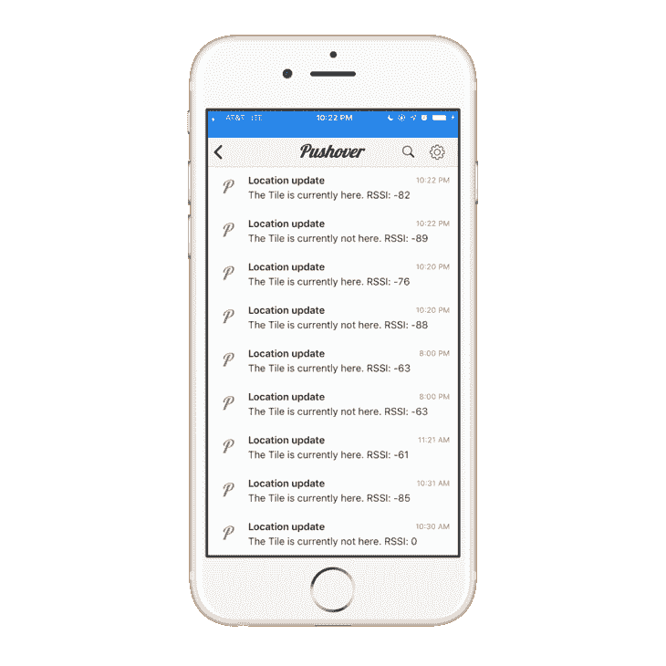***

***如你所见，我测试了一堆！？***

***如果你已经做到了这一步，而且一切正常，那就太棒了。你现在有一个瓷砖追踪器为你的房子，办公室或任何地方。***

## ***代码***

***寻找这个例子的完成代码？我也会的！它[托管在 Github 上，在这里](https://github.com/jaredwolff/particle-bluetooth-presence-detection)可以使用。***

## ***结论***

***可以想象，本文中使用的技巧和技术可以有多种用途。让我们总结一些要点:***

1.  ***使用 Bluetooth Central 扫描并识别现成的图块设备***
2.  ***将区块识别信息存储到 EEPROM。这样就可以在启动时检索它。***
3.  ***使用我们熟悉的`Particle.publish`向云推送更新。***
4.  ***使用粒子集成 Webhook 创建状态变化的推送通知。***

***现在你已经有了一切，扩展它，破解它，让它成为你的。哦，别忘了分享！我很乐意收到你的来信。***

***喜欢这个帖子？点击下面的一个分享链接，与全世界分享。:)***

***这是我博客上的一篇交叉帖子。[你可以在这里查看原文。](https://www.jaredwolff.com/how-to-location-tracking-using-particle-mesh/)***

***有兴趣了解更多信息吗？我正在写一篇关于如何充分利用粒子平台的指南。点击此处了解更多信息。***