# 如何使用 Python 和 Flask 构建 web 应用程序—深入教程

> 原文：<https://www.freecodecamp.org/news/how-to-use-python-and-flask-to-build-a-web-app-an-in-depth-tutorial-437dbfe9f1c6/>

Python 是一种非常通用的语言。它被认为是现代发展的主要部分。它用于从最简单的脚本到复杂的机器学习和神经网络训练算法。

但是 Python 鲜为人知的用途可能是作为 web 服务器使用。与更流行的框架如 Node/Express 和 Ruby on Rails 相比，Python 作为 web 服务器的选择经常被大多数开发人员忽视。

用 Python 编写后端非常有用，原因有几个，其中包括:

*   从将 Python 作为常规脚本语言学习到使用它制作后端是很容易的。
*   如果您计划为已经用 Python 编写的部分应用程序提供服务(例如，提交表单，通过 Tensorflow 模型评估输入，并将输出返回给用户)，那么最好使用
*   它有一个多样化的软件包和工具生态系统来帮助你进行开发，更不用说一个伟大的开发人员社区了(因为这种语言已经存在了这么久)

本文的目的是演示如何使用 Python 来创建全栈 web 应用程序。在本教程中，我将使用 Flask，一个 Python“微框架”来开发一个 web 应用程序。

如果不提还有其他更受欢迎的 Python 框架，比如 Django，那我就太疏忽了，但是 Flask 对于初学的开发人员来说是有用的，因为它是基本框架，要求开发人员根据他们的需求在应用程序中创建/利用他们需要的组件(而不是调用一些自动生成 20 个文件的命令行工具…看看 Ruby on Rails)。当然，我不会从头开始讲述如何启动一个 Web 应用程序，相反，我会向您介绍 Flask，然后介绍如何使用一个名为 flask-base 的项目，以便在未来快速上手。

### 烧瓶介绍

Flask 是一个用 Python 进行 web 开发的微框架(读作:它没有附带太多)。在我们深入探讨之前，让我们先了解一下后端开发的一些基本概念。

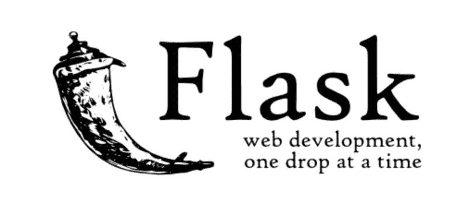

Soure: flask.pocoo.org

### 路线

让我们假设你正在访问`apple.com`，想去`apple.com/mac/`的 Mac 区。苹果的服务器如何知道为你提供显示 Mac 设备详细信息的特定页面。这很可能是因为他们有一个运行在服务器上的网络应用程序，它知道当有人查找`apple.com`并进入网站的`/mac/`部分时，处理该请求并发回一些页面。当某人去`/mac/`时，计算该做什么背后的逻辑是通过**路线**完成的。

所以当我访问`apple.com`(隐含的`apple.com/`)时，`/`路线处理显示的内容。如果我去`apple.com/purchase`，有一条`/purchase`的路线。如果我转到`apple.com/purchase/1`，其中`1`是某个项目标识符，那么很可能有一个通用路由处理程序`/purchase/<int:item-` id >来处理这个请求。路由也可以处理 GET 和 POST 请求。

### 基本应用程序

那么我们怎么做一个基本的有路线的 Flask app 呢？好吧，让我们看看文件。创建一个名为`hello.py`的 Python 文件，包含以下内容。

```
from flask import Flask
app = Flask(__name__)

@app.route("/")
def hello():
	return "Hello World"
```

让我们来分析一下这里发生了什么。

1.  我们导入我们的烧瓶依赖项
2.  我们创建了一个 Flask 应用程序的实例。传递给 Flask 实例化器(`__name__`)的参数计算出一个字符串，该字符串“命名”Flask 应用程序。从命令行运行时，`__name__ == "__main__"`。您可以将第一个参数设置为任何值。
3.  我们在应用程序上设置了一条路线`[/](http://blah.com/)`,当这条路线被访问时，它立即执行下面的`[hello(](http://blah.com/))`功能。请注意，该函数必须返回字符串或呈现的模板。

在命令行上，让我们设置一个叫做虚拟环境的东西(它将帮助我们将我们的开发环境和包安装与系统的其余部分隔离开来)。

1.  如果您还没有这样做，请通过`easy_install pip`安装 pip(如果您在 Mac 上，您可能需要在此之前运行`sudo`。
2.  运行`pip install virtualenv`使用 pip 安装 virtualenv
3.  在您的应用程序的目录中，通过运行`virtualenv venv`创建您的虚拟环境(这将在当前目录的一个名为`venv`的文件夹中创建一个虚拟环境)。
4.  运行`source venv/bin/activate`激活虚拟环境。这是在其中安装软件包时特别需要的。您可以通过从命令行运行`deactivate`来停用虚拟环境。很简单。

现在我们的虚拟环境已经安装并激活，让我们安装 Flask。真的很简单，运行`pip install Flask`就可以了。然后，我们可以通过在命令行中编写以下内容来运行前面的示例。

```
FLASK_APP=hello.py flask run
```

您应该在终端中看到类似于`* Running on http://localhost:5000/`的内容。如果你在浏览器中访问这个链接，你会看到一个只有`Hello World`的页面。

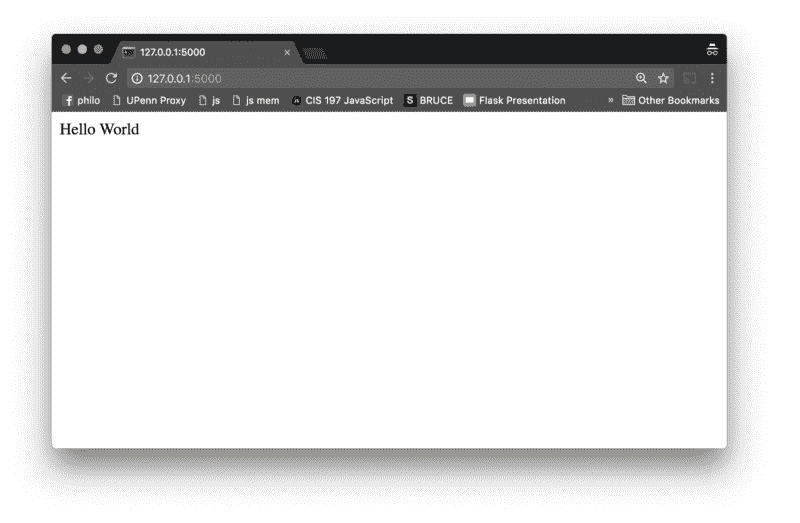

### 示例应用程序:宾夕法尼亚俱乐部评论

*注意:这个项目的代码可以在 GitHub 的[这个资源库中找到。](https://github.com/abhisuri97/penn-club-ratings)*

现在让我们想出一些项目来展示 Flask 的全部功能。我最近想到的一个项目是一个名为“PennClubReview”的俱乐部评级应用程序。


我目前就读于宾夕法尼亚大学。大学新生面临的一个最常见的问题是选择参加校园里的哪些俱乐部。一些俱乐部竞争激烈，有多轮面试，需要投入大量时间，这使得这个过程变得更加复杂。通常，在扶轮社信息会议中，这些扶轮社的方面都不会被讨论。


UPenn club fair

因此，为了解决这个问题，我们可以创建一个应用程序

*   管理员可以设置调查问题，让用户回答有关俱乐部的问题。

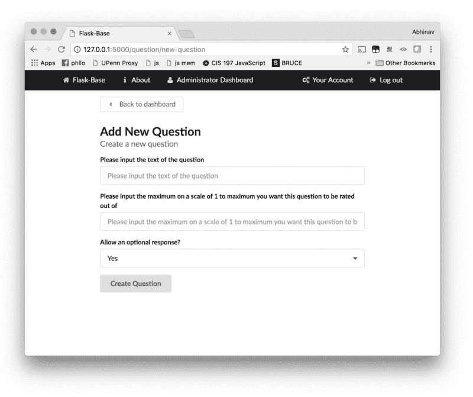

*   用户可以查看每个俱乐部每个调查问题的平均评分

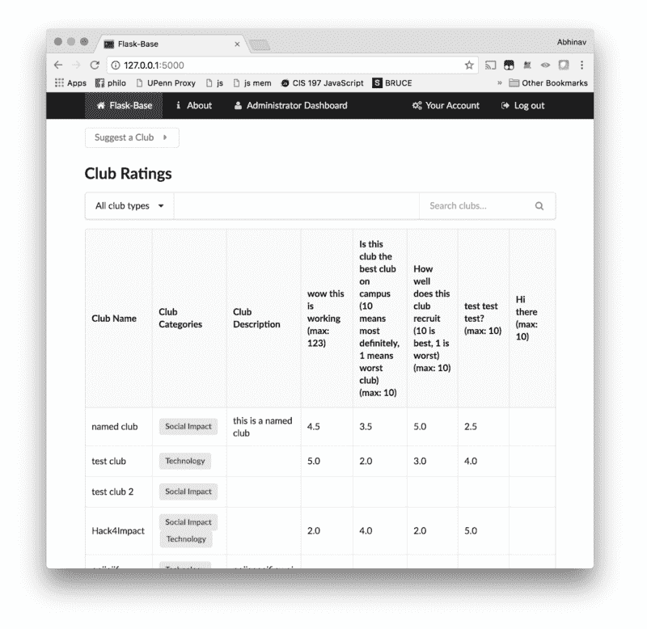

*   用户可以查看俱乐部的个人回复。如果用户选择提交另一个审核，他们以前的回复将被覆盖。

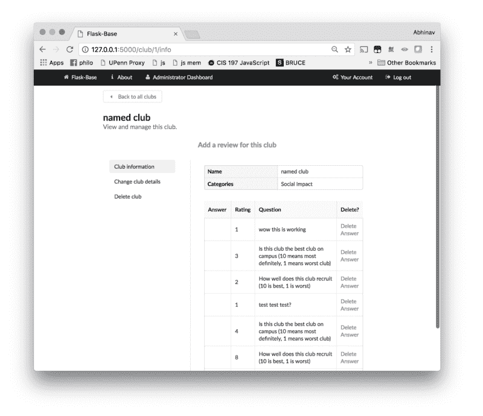

*   用户可以向管理员建议俱乐部以供编辑/批准在公共场合展示(发生这种情况时，应通过电子邮件通知管理员)

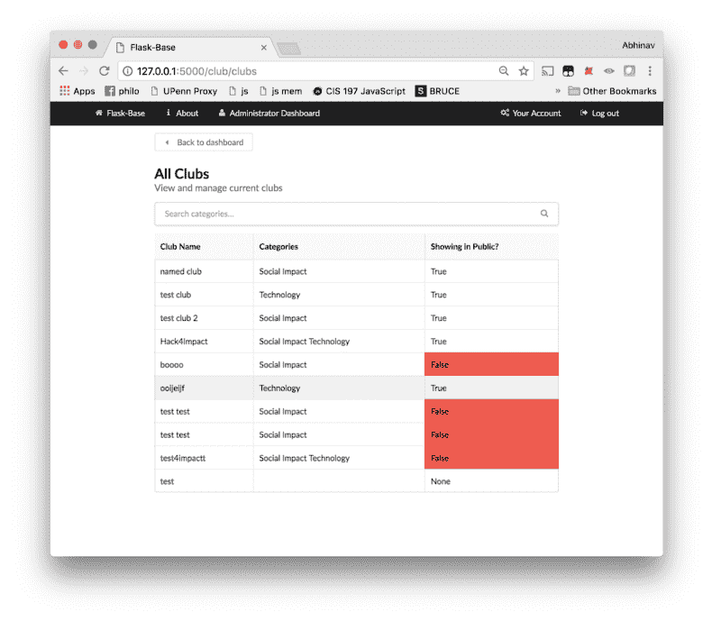

*   用户或管理员需要能够编辑自己的帐户信息。
*   管理员应该有能力从系统中添加/删除用户，调查问题，俱乐部类别和俱乐部。

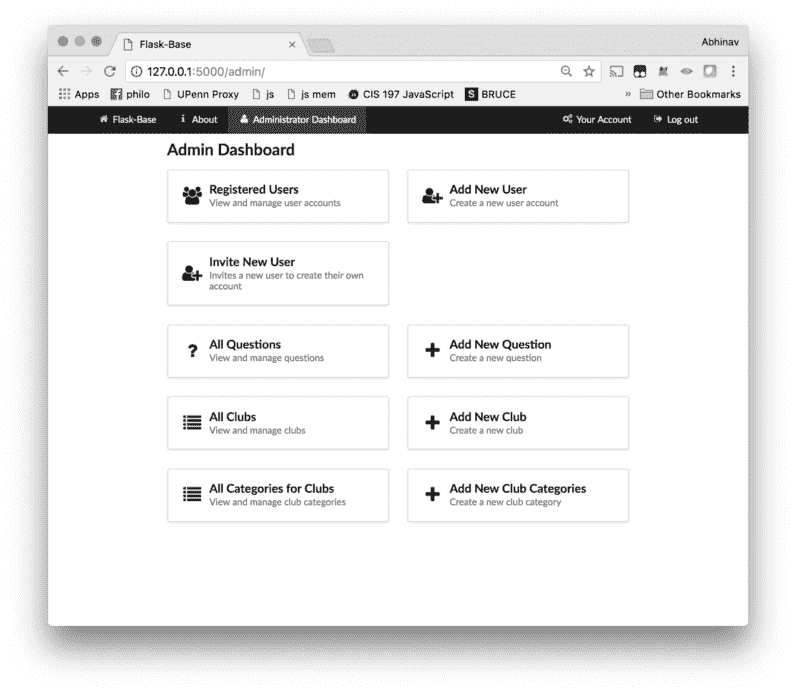

### 分解应用程序组件

为了开发这个应用程序，除了 Flask 之外，我们还需要更多的组件，比如后备数据库、登录管理系统、一些组织路线和处理电子邮件的方法。我们可以从零开始编写代码。但是，已经有一个惊人的样板，可以给你一个很好的起点。

### 进入烧瓶底部

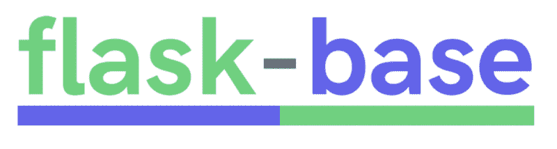

Flask-base 是我和我的朋友们开发的一个项目，是一个名为 [Hack4Impact](https://hack4impact.org/) 的学生运营非营利组织的一部分。我们与非营利组织合作一个学期来开发技术项目，帮助他们完成使命。

在从事如此多的项目时，我们发现我们经常会在所有的应用程序中重复相同的代码。因此，我们决定创建一个单一的代码库，包含我们制作的任何应用程序都需要的最常见的部分。该代码库将包括:

*   用户认证方案
*   账户管理
*   蓝图(处理路线)
*   后备数据库
*   电子邮件(带重定向队列)

它最近变得相当受欢迎，在几个月的时间里获得了 1200 多颗 GitHub 星。这个代码库非常适合我们试图建立的东西。你可以在这里找到包含烧瓶底座[代码的 GitHub repo。](https://github.com/hack4impact/flask-base)

### 应用程序开发设置

首先，让我们克隆烧瓶基地。按照 README.md 页面上的说明进行操作。简而言之，运行以下内容。

```
git clone https://github.com/hack4impact/flask-base.git

cd flask-base

virtualenv  venv

source venv/bin/activate

pip install -r requirements.txt

python manage.py recreate_db

python manage.py setup_dev
```

好的。我将详细说明我们在这里做了什么。

*   从 GitHub 克隆这个库(即下载它)，然后进入它的目录。
*   创建一个新的虚拟环境并激活它。
*   读取`requirements.txt`文件中的包依赖项，并通过`pip`安装它们。
*   实例化数据库(重新创建它)并插入一个管理员规则(通过 setup_dev)。

此外，让我们创建一个正在运行的数据库迁移。这将跟踪我们的数据库模型中的变化，而不需要重新创建我们的数据库(即删除所有信息，然后从头开始重建数据库)。迁移使我们能够保存信息。我们可以通过下面的命令做到这一点。

要运行这个应用，运行`honcho start -f Local`(如果你还没有安装 Honcho，你需要安装它)。如果你有任何问题，很可能已经在 flask-base 的自述文件中解决了。现在你可以访问`localhost:5000`并调出一个正在运行的基于 flask 的应用程序。

要以管理员身份登录应用程序，请访问登录链接，输入用户名`flask-base-admin@example.com`和密码`password`。然后，您可以从管理员屏幕邀请新用户加入应用程序。注意，在这样做之前，您需要创建一个包含以下两个变量的`config.env`文件:

```
MAIL_PASSWORD=someSendGridPasswordMAIL_USERNAME=someSendGridUsername
```

创建用户帐户后，该帐户将保持未确认状态，直到新邀请的用户单击发送到其电子邮件的链接。此外，用户可以注册该应用程序，并通过类似的认证流程进行确认。

浏览 flask-base 文档，更好地了解 flask-base 开箱即用的一些功能。现在，我们将继续讨论如何使用它来制作我们的应用程序。

### 数据库！

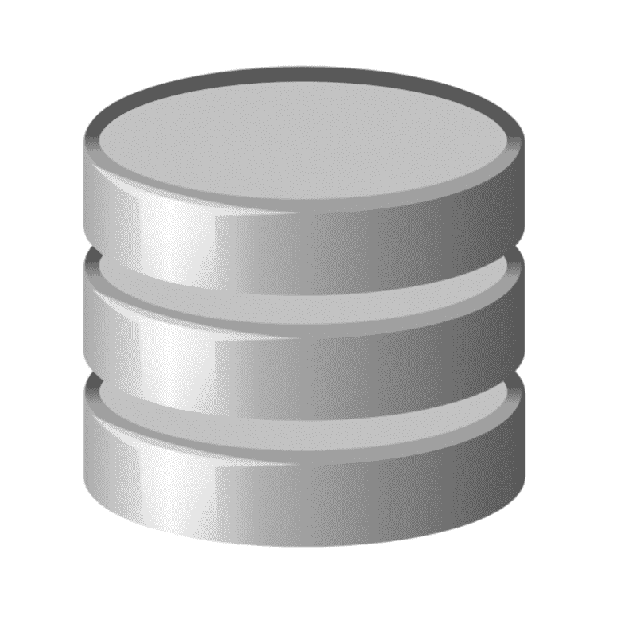

我们所有的数据库逻辑都被 SQLAlchemy ORM 包装起来，因此我们不必使用非常冗长的数据库语句来运行查询或添加/删除记录。所有的数据库*模型*(把它们当做类)都包含在`app/models`文件夹中。让我们想想应用程序本身需要的一些模型。

因此，我们需要一个`Club`模型，其中包含俱乐部的`name`(数据类型:字符串)、俱乐部的`description`(数据类型:文本)和变量`is_confirmed`(数据类型:布尔)，以跟踪建议的俱乐部是否已被管理员批准显示。此外，我们希望以某种方式引用一个俱乐部的类别，以另一种方式引用属于一个俱乐部的问题答案。

让我们思考一下俱乐部和俱乐部类别应该如何相互联系。我们可以这样想。一个俱乐部有许多类别(例如，一个俱乐部可以是`Social Impact`和`Tech`俱乐部)，一个俱乐部类别可以属于许多俱乐部(例如，校园里可以有许多`Tech`俱乐部)。这个`ClubCategory`的唯一属性有一个`category_name`(数据类型:字符串)。

我们可以通过关联表创建这种关系(多对多关系)。

### 俱乐部和俱乐部类别(多对多)

现在我们如何将逻辑编码到 flask-base 中？首先，在`app/models`中创建一个名为`club.py`的文件。首先让我们创建`Club`和`ClubCategory`模型。

所以现在我们有两个模型，但是它们没有相互连接。它们中的每一个都有各自的属性，但是都不能明确地相互连接。正如我前面提到的，我们通过一个协会来建立联系。在`db`导入之后，添加以下几行。

这将创建一个新的关联表(Club 和 ClubCategory 模型之间的中介)。该表中有两列`club_id`和`club_category_id`，它们分别引用各自模型的 id(注意，`id`属性是每个模型中的主键，也就是说，对于每个记录来说是唯一的)。但是在关联表中，我们将这些主键称为外键(因为它们引用其他表)。此外，我们需要在底部的`Club`模型中添加一行。

```
categories = db.relationship(        'ClubCategory', secondary=club_category_assoc, backref='clubs')
```

这实际上创建了`Club`和`ClubCategory`模型之间的双向关系，并使用`club_category_assoc`关联表建立了`Club`和`ClubCategory`之间的关系。`backref`告诉`ClubCategory`模型如何引用`Club`模型。因此，对于给定的 club `club`，您可以运行`club.categories`来获得一个类别对象返回数组。给定一个名为`category`的`ClubCategory`，你可以通过做`category.clubs`得到该类别中的所有球杆。

通过执行以下操作，您可以看到这一点:

在`app/models/__init__.py`中添加一行

然后运行`python manage.py shell`。运行以下命令与您的数据库模型进行交互(注意`>`；> >表示你放进去的一个输入。

### 问题和答案(多对一)

太好了！我们现在有一个工作俱乐部和俱乐部类别模型。现在让我们来看看`Question`和`Answer`型号。对于一个问题，我们需要跟踪问题的`content`，它将是一个包含问题本身文本的字符串。我们还将包含一个`max_rating`属性，该属性将包含个人对该问题的最高评分。例如，如果问题内容是“评价俱乐部的社区 10 是最好的”，我们可以将`max_rating`设置为 10。此外，我们将跟踪一个布尔值`free_response`，以确定我们是否允许人们包含一个长格式的可选额外响应。最后，我们需要与`Answer`模型建立联系。这将是一对多关系，因为一个问题可以有多个答案，但一个答案只能有一个问题。

`Answer`模型将具有以下属性:

*   与答案的自由文本响应相对应的`answer`属性(如果问题允许自由文本响应)
*   从 1 到问题的最高等级
*   与写问题的用户相关的一个`user_id`(同样，一个用户可以有许多答案，但是一个答案只能有一个用户)
*   a `question_id`指答案所属的`question`
*   答`club_id`指的是答案所属的`club`

让我们创建一个文件`question.py`

除了最后一行，这里的大部分内容都相当简单。最后一行连接`Question`和`Answer`型号。它说建立与`Answer`模型的关系，该模型可以通过关键字`question`引用`Question`模型。给定一个答案`a`，你可以通过`a.question`得到问题；给定一个问题`q`，你可以通过`q.answers`得到与之相关的答案。现在让我们建立`Answer`模型。在 models 文件夹中创建一个名为`answer.py`的新文件，并粘贴到下面。

所以这个文件要长得多，但是回想一下，一个答案涉及到很多事情。让我们从头开始，注意`question_id`通过外键`questions.id`引用`Question`模型(`questions`表的`id`列(包含`Question`模型的实例记录)。

注意，我们还有一个引用用户的`user_id`列。让我们进入`app/models`文件夹中的`user.py`，在`role_id`声明后添加下面一行。

该语句使用与`Question`模型非常相似的语法。

还要注意，有一个`club_id`属性引用了与答案相关联的俱乐部。编辑`club.py`文件，将下面一行作为`Club`模型的最后一个属性。

最后，将这两行添加到`app/models`中的`__init__.py`

现在，我们应该能够像下面这样摆弄我们的数据库了。

最后，让我们讨论一下`newAnswer`方法。该方法用于向数据库中插入新的答案，同时确保如果用户已经回答了该问题，我们会将其删除并插入新的答案。

我们可以再次运行`python manage.py shell`

现在，我们已经完成了模型:)

### 视图

现在数据库的东西已经过时了，让我们为用户创建一种与应用程序本身交互的方式。首先让我们建立一些蓝图。

### 蓝图

蓝图是组织 flask 应用程序的好方法。它允许您在单个文件中装载所有相互关联的路由。例如，与帐户相关的所有操作，如帐户管理、用户密码重置、忘记密码等。会包含在`account`蓝图中。

每个蓝图在`app`下都有一个关联的文件夹。例如，有一个`account/`文件夹和一个位于`templates`下的文件夹，其中包含将呈现给用户的实际 html 模板。

让我们添加一些蓝图。在`app/__init__.py`的`return app`行前添加以下内容。

这些调用分别在 url 前缀`/club`、`/question`和`/category`处创建蓝图。让我们为每个蓝图创建文件夹`club`、`question`和`category`。在每个文件夹中创建文件`__init__.py`、`forms.py`和`views.py`。

### 俱乐部形式和观点

我将介绍如何为`club`蓝图设置视图/模板。其他视图从代码中很容易理解。

所以从俱乐部的角度来看，我们想展示一些不同的东西

1.  如果您是管理员，您应该能够创建一个俱乐部，并给它一个名称、描述和类别。
2.  如果你是管理员，你应该可以查看所有的俱乐部，包括那些没有确认的。
3.  如果您是管理员或用户，您应该能够查看单个俱乐部的信息。
4.  如果你是管理员，你应该能够编辑俱乐部的信息和删除俱乐部。

让我们首先在`forms.py`中创建几个表单，然后将它们传递给我们的视图，特别是处理创建新俱乐部的视图和编辑俱乐部信息的视图。

在`club`的`forms.py`中添加以下几行:

Flask-base 使用`wtforms`来创建表单。wtforms 允许我们以面向对象的方式创建表单，其中每个表单都是一个类。

因此我们创建了两个表单，一个名为`NewClubForm`，它扩展了基本的`wtforms` `Form`类，有 3 个字段- `name`(数据类型:文本)、`desc`(数据类型:文本)，包含俱乐部的描述，以及`categories`(一个多选下拉列表)。对于`categories`字段，我们使用 Lambda 函数(基本上是一个匿名函数)查询`ClubCategory`模型中的类别名称，并用查询结果填充类别选择字段选项。

最后，我们有一个`submit`字段，因此可以呈现提交按钮。

接下来，我们有一个`EditClubForm`，它通过添加一个名为`is_confirmed`的新字段来扩展`NewClubForm`字段集。回想一下，我们的`Club`模型中的`is_confirmed`决定了给定的俱乐部实例是否可以向公众显示。我们将增加用户建议俱乐部的功能，默认情况下，建议的俱乐部是隐藏的，直到管理员批准。我们还覆盖了`submit`字段以显示文本“编辑俱乐部”。

在`club/`下的`views.py`中，我们创建了几条路线。

*   (GET，POST)登录受保护:呈现并接受来自表单的数据，以创建新的俱乐部。
*   管理员保护:渲染所有的俱乐部
*   `/<int:club_id>/(` :info) (GET)登录受保护:将呈现给定俱乐部实例 `with id = c` lub_id 的信息，并可以访问/club/1 或/club/1/info 处的路线。
*   etails (GET，POST) ADMIN PROTECTED:呈现并接受来自表单的数据，用于编辑俱乐部信息。
*   `/<int:club_id>/`删除(获取)管理员保护:呈现页面以删除俱乐部
*   删除(获得)管理员保护:删除带有俱乐部 id 的俱乐部。

对于第一条路线`/new-club`，我们也希望允许普通用户创建一个新的俱乐部，这就是为什么我们只登录保护它。让我们看看我们如何为此制定一条路线。

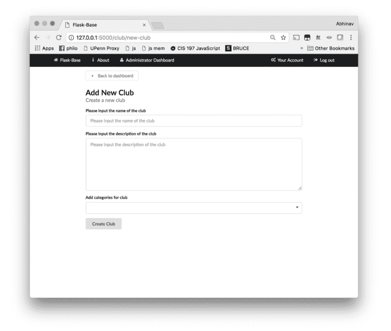

破解密码。在第 1 行中，我们声明在哪里可以访问该路由。例如，它将出现在子路线`/new-club.`的`club`蓝图上，可以访问的完整 URL 是`basedomain.com/club/new-club`。

然后我们在路由上放置一个路由装饰器`@login_required`，如果用户没有登录，这个装饰器将抛出 403 错误，但是如果用户登录了，它也允许用户查看路由。

接下来，我们定义一个方法来处理对路由的请求(注意，这个名称必须是惟一的)。这个方法可以参考 Jinja 模板中的`club.new_club`。

然后我们实例化我们之前创建的`NewClubForm`。在下面一行中，我们通过`form.validate_on_submit()`方法检查表单提交是否有效(注意，这个路由也将接受对它的 POST 请求)。如果是，那么我们创建一个新的`Club`实例，其中的`name`、`description`和`categories`对应于表单字段。注意`is_confirmed`我们将它设置为当前用户是否是管理员(因为如果一个普通用户提交这个表单，我们希望新的俱乐部不会出现在每个人面前，因此我们将`is_confirmed`设置为 False)。然后，我们将新的俱乐部实例添加到数据库会话中，并提交会话。

最后，如果提交表单的用户不是管理员，我们会生成一个链接，通过电子邮件发送给表单管理员。该链接应直接指向管理员`change_club_details`路线，这将允许管理员切换`is_confirmed`。然后，我们在数据库中查找所有具有管理员角色的用户，并将电子邮件任务添加到我们的 redis 队列中。在`get_queue()`方法中，我们专门将`send_email`作业排队，将收件人设置为管理员电子邮件，主题等于

添加 club 实例(用作模板变量)和 link(也用作模板变量)。

我们也传递我们在`app/templates/club/email/suggested_club.html`和`.txt`中创建的`template`。html 文件的内容如下:

对于。txt 文件

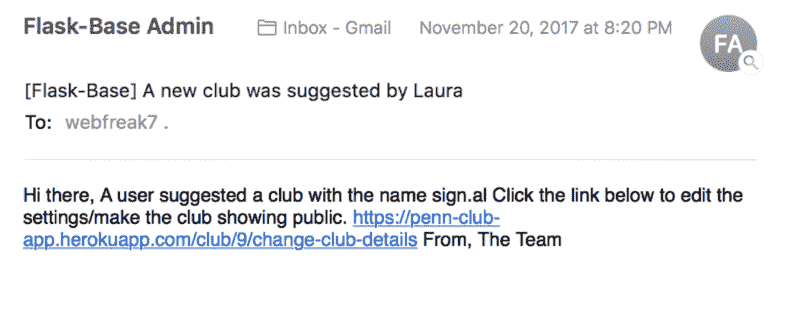

接下来，我们将关注将所有球杆呈现在一张桌子上的`/clubs`路线。对于路由处理程序，我们可以将所有俱乐部传入一个模板。

而我们渲染的球杆模板位于`app/templates/club/clubs.html`，内容如下。

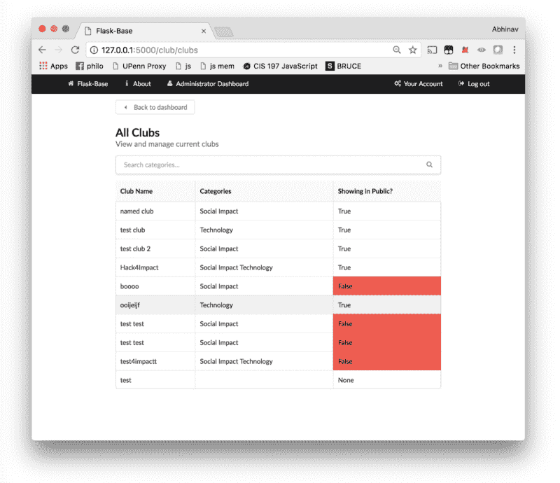

如果您了解 Jinja(或任何模板语言)，这大部分都相当简单。基本上，for 循环` ... `将遍历所有俱乐部，对于每个俱乐部，它将呈现俱乐部名称`{{ c.name }}`和俱乐部类别。

请注意，对于渲染的每个球杆，我们还包括一行:

这链接到呈现的给定俱乐部实例的单个俱乐部信息页面。让我们继续走这条路。

注意，对于这个视图，我们只需要将俱乐部实例信息传递给 manage_club 视图。我们可以通过以下方式轻松做到这一点:

我们还可以设置一些其他路线，因为我们的`manage_club.html`页面实际上显示了多条路线。

让我们设置`/change-club-details`路由，它只是呈现和接受来自`EditClubForm`表单的信息。

注意，当保存`club.is_confirmed`字段时，我们需要将字符串`True`和`False`的值转换为布尔型的对应值，如`EditClubForm`的`forms.py`规范所述。我们通过自定义函数`bool`来实现这一点，该函数定义如下:

如果定义了任何字符串，包括`False'`，python 默认的`bool`将返回`True`，因此我们需要定义自己的函数。

我们还定义了呈现删除页面的`delete`和实际删除俱乐部实例的`_delete`函数。

注意，对于`_delete`路由，我们有一个到`clubs`路由的重定向，它列出了所有的俱乐部实例。

现在我们移动到`app/templates/club/manage_club.html`的`manage_club.html`模板。其内容如下:

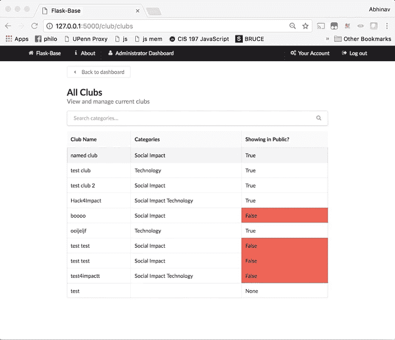

让我们分解这个文件。在第一行，我们只是扩展我们的基本布局，然后我们导入表单宏。在 Jinja 中，宏基本上是方法。

我们有一个`endpoints`变量，它将包含管理页面不同部分的链接。在`navigation`宏中，我们呈现了`endpoints`中列表的所有单个元素。

我们还通过执行以下操作创建了一个`club_info`宏，它将包含与俱乐部相关的信息以及与俱乐部相关的所有答案

最后，我们实际上编写了在` ... `标签中呈现页面的逻辑。我们通过检查`request.endpoint`在要呈现的子页之间切换，看看它是删除端点还是有表单(在这种情况下呈现表单)。否则，我们就称之为`club_info`宏。我们已经完成了俱乐部的路线和风景。类别和问题的大多数其他途径遵循类似的逻辑。

### 主要视图和表格

主要途径是应用程序面向公众的部分。路线行为如下

*   / (GET):在表格中显示所有俱乐部、相关问题以及每个俱乐部每个问题的平均评级。
*   /submit-review/ <club_id>(GET，POST):基于“问题”数据库中的问题动态生成表单以提交俱乐部评论。同时接受表单数据，并保存为与 club_id 匹配的俱乐部的答案。</club_id>

第一条路线非常简单，与我们之前实现的“俱乐部”路线相匹配。唯一的区别是“问题”也必须传入。

这里最有趣的部分是如何计算平均评分并将其传递到路由中。我创建了一个名为`all_c`的列表，并为每个俱乐部创建了一个包含俱乐部基本信息的`club_obj`。对于一个俱乐部的每一个答案，我会添加一个与问题内容相对应的`club_obj`的新属性，如果这个属性还不存在的话。我将每个评级附加到一个列表中，然后遍历`club_obj`的每个属性。如果这个属性有一个 list 类型的值，那么我用列表中评级的平均值替换这个列表。然后，我将`club_obj`附加到`all_c`上，并将其传递到模板中。

#### 动态表单生成

对于`submit-review`路线，我需要根据我在`Question`模型中的问题动态创建一个表单。代码如下:

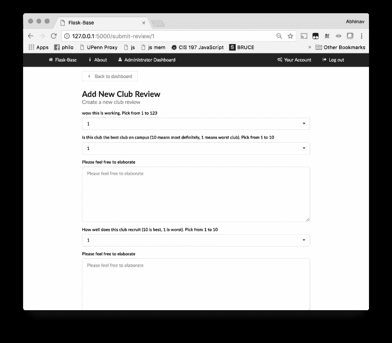

我们首先创建一个继承自基类`Form`的虚拟表单类。然后对于每个问题，我们在虚拟表单`F`上创建新的表单字段`setattr(F, ...)`。`setattr`方法将表单字段的名称作为它的第二个参数。我们将此设置为问题的 id，在它后面附加对应于评级的`_q`和对应于自由回答的`_resp`(如果有指示的话)。对于评分表字段，我们创建了一个从 1 到`max_rating`的选项`SelectField`。

为了处理表单提交，我们使用相同的 if 语句`form.validate_on_submit()`，但是不是寻找表单的特定命名字段，而是遍历`form`的所有字段，并使用`newAnswer`方法创建一个新答案。如果用户对此俱乐部作出回应，此方法将在为用户添加新回应之前删除任何以前的回应。

### 发射

现在大部分应用已经完成，我们可以在 Heroku 上启动这个应用。

如果你从未和 Heroku 签约

1.  去 Heroku.com 注册一个账户
2.  安装 CLI

如果你最初没有设置 git repo，运行`git init`并用你的 Heroku 账户登录。

然后，`git add`所有相关文件(即除了`config.env`和`venv/`之外的任何文件)并运行`pip freeze > requirements.` txt 以确保您已经安装的所有依赖项都包含在内。

运行`heroku create`创建一个新的 Heroku 实例，运行`git push heroku master`将您的文件添加到 Heroku 存储库中。

运行完成后，您需要用下面的命令设置一些环境变量

完成后，运行以下命令，在 Heroku 上创建数据库

然后下面的命令将创建管理员帐户。

您还需要创建一个 Redis togo 实例来处理任务队列

最后运行下面的命令，它将告诉 Heroku 启动一个 dyno(读取为子服务器)来处理我们的 Redis 队列。

然后，您可以运行`heroku open`在单独的窗口中打开正在运行的 Heroku 应用程序。

### 扩展应用程序和结论

复制当前的应用程序结构并扩展它以向应用程序添加更多信息/路线是非常容易的。只需查看之前已实施的任何路线。如果出于某种原因，你想包括某种类型的文件上传，如果你计划在 Heroku 上运行应用程序，你需要将应用程序与亚马逊 S3 集成(因为它有一个短暂的文件系统)。

总的来说，flask-base 为创建 flask 应用程序提供了一个很好的起点。当然，后端代码可能相当冗长，但结果是，它给了你对你的应用程序非常精细的控制。