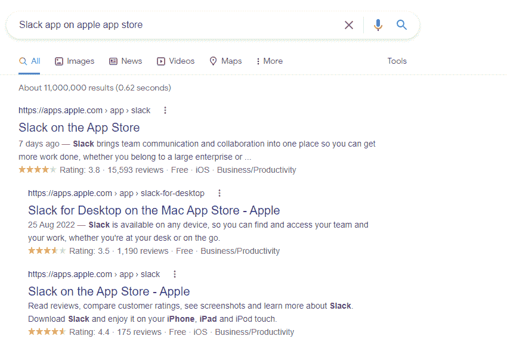
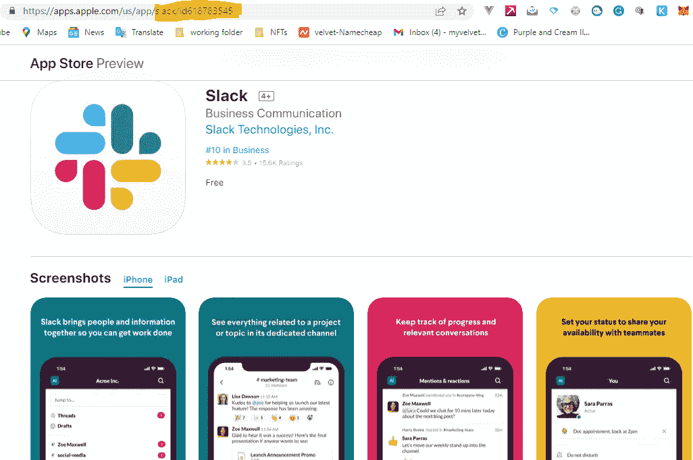
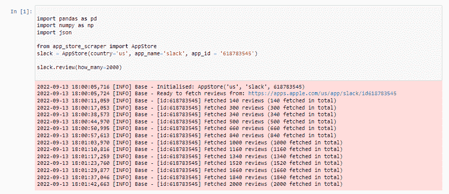
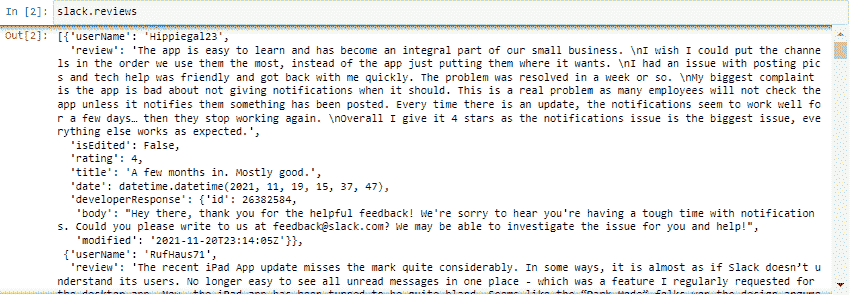
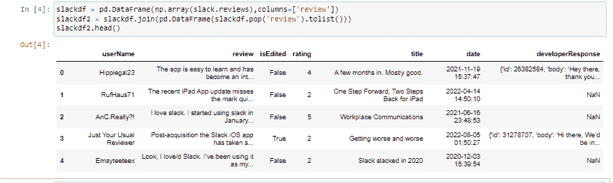

# 如何用 Python 刮 App Store 评论

> 原文：<https://www.freecodecamp.org/news/how-to-use-python-to-scrape-app-store-reviews/>

数据抓取，通常称为网页抓取，是一种从互联网上获取数据和内容的技术。

您通常将这些信息保存在本地文件中，以便在需要时进行更改和检查。

网络抓取基本上就是在很小的范围内将网站内容复制并粘贴到 Excel 电子表格中。

这篇文章的主要目的是帮助你使用快速简单的步骤开始网络抓取。您将学习如何使用 Python 中的`app_store_scraper`库收集应用商店评论。你还可以使用其他工具和库，比如`Scrapy`、`Pandas`和`BeautifulSoup`，但是这里我们将使用`app_store_scraper`。

根据您选择的 web 抓取机制，它可能非常简单，也可能非常复杂。

幸运的是，有一个简单而优秀的软件可以帮助你从苹果应用商店收集关于你的应用的评论，并使用它们进行进一步的情感分析。

### 为什么网络抓取甚至有用？

数据分析专业人员使用 web 抓取来完成各种任务，包括线索创建、市场分析、消费者情绪分析和数据集成。

您还可以使用 web 抓取来跟踪股票价格、在线机会(如奖学金、就业、实习等)、竞争对手的库存数据以及客户评论和评级。

在本文中，你将通过 4 个简单的步骤学习如何使用 Python 来抓取应用商店评论。

在你开始之前，有一些事情要记住:一些网站不允许你抓取他们的内容，所以在这样做之前一定要检查。网络抓取并没有被严格禁止，但是你应该注意知道何时何地你可以抓取。我强烈建议你只为信息和教育目的刮。

## 步骤 1–安装和设置软件包

首先，您必须安装和设置必要的软件包。在这一步中，您将使用 Python 包安装程序安装 **app_store_scraper** 。

```
pip install app_store_scraper 

#or

pip3 install app_store_scraper 
```

## 第 2 步-获取应用程序的名称和 ID

我将使用一个随机的应用程序，我会为这个演示的缘故刮它的评论。但是，如果你有一个自己开发的个人应用程序，并且你在 app store 上有它，你可以使用这些相同的技术来使用那个应用程序。你只需要获得应用程序的名称和 ID，你可以通过使用你的电脑在谷歌上输入应用程序的名称来找到它。

**例子**:*苹果应用商店的 Slack 应用*



你应该点击第一个结果，这会将你重定向到苹果官方商店。在那里你会找到“ **Slack app** ”以及关于它的一切。

页面加载到 URL 后，您将看到应用名称( **Slack** )和应用 ID (618783545)。把它抄在你的记事本上。



现在您需要导入一些包并运行一些代码:

```
import pandas as pd
import numpy as np
import json

from app_store_scraper import AppStore
slack = AppStore(country='us', app_name='slack', app_id = '618783545')

slack.review(how_many=2000) 
```

在上面的代码中，您将导入 **`pandas`** 库，该库有助于向数据框架添加评估/评论。您还将导入 **`numpy`** 库来进行数据转换和修改。最后，你会得到 **`app_store_scraper`** 包本身，用于从网站上抓取评论。

你必须创建一个 **`Appstore`** 类的实例，然后传入参数**`country`****`app_name`**和 **`app_id`** 。



slack app ratings

评论都存储在`slack`变量中，所以运行下面的命令来查看以 JSON 格式存储的评论。

```
slack.reviews 
```



slack app scraped reviews

## 步骤 3——从 JSON 转换数据

为了使数据更具可读性和格式正确，您需要将它从 JSON 格式转换成 Pandas 数据帧。您可以使用以下代码来实现这一点:

```
slackdf = pd.DataFrame(np.array(slack.reviews),columns=['review'])
slackdf2 = df.join(pd.DataFrame(slackdf.pop('review').tolist()))
slackdf2.head() 
```



generated reviews in pandas dataframe

## 步骤 4–将数据帧转换为 CSV 格式

这是最后一步:您将把数据帧转换成 **csv** (逗号分隔值)格式，这样您就可以在本地机器上拥有它。然后，您可以在电子表格中查看，也可以与同事分享。

```
slackdf2.to_csv('Slack-app-reviews.csv') 
```

最后，您应该将“ **Slack-app-reviews.csv** ”文件保存到项目文件夹中，这样就可以开始了。

## 结论

在这篇短文中，您能够将松散的 app store 评论收集到一个数据帧中，然后使用 4 个简单的步骤将其保存到您的本地机器中。我希望你喜欢它，干杯。

这里是我存放代码的 GitHub repo，请随意启动这个库。