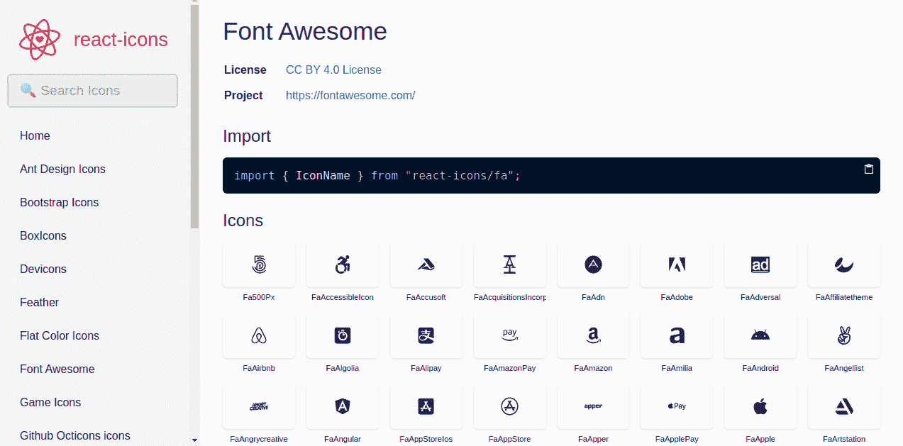
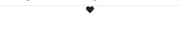
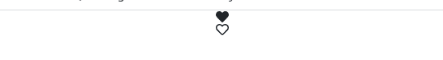
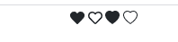
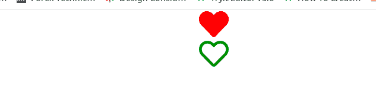
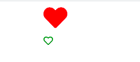
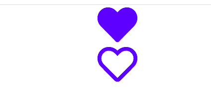
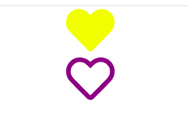
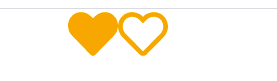

# 如何使用 react 图标在 React 应用程序中安装字体 Awesome

> 原文：<https://www.freecodecamp.org/news/how-to-use-react-icons/>

当您构建 React web 应用程序时，很可能会用到图标。图标是概念、想法、文件、程序、应用程序、业务等的图形表示。

您可以使用图标来表示特征的身份。如果您不想写出程序的名称，可以用一个合适的图标来代表程序或应用程序，以便于识别。

有许多不同的图标库，那么如何将它们添加到 React 应用程序中呢？在本文中，我们将了解到这一点，以及更多内容。

## 在本文中，您将了解到:

*   什么是反应图标库？
*   什么是字体牛逼图标？
*   如何设置开发环境
*   如何安装 React 图标
*   如何导入 React 图标
*   如何在应用中使用 React 图标
*   如何使用多个图标
*   如何呈现不同图标库中的多个图标
*   如何内嵌显示图标
*   如何在 React 应用程序中设计字体很棒的图标
*   奖金:所有图标库进口代码反应图标
*   结论

## 什么是反应图标？

React-icons 是一个小程序库，可以帮助你添加图标到 React 应用程序中。它将图标作为组件提供给你的应用程序，因此它们更容易使用，它还允许你对它们进行样式化，以便它们与你的应用程序的整体风格保持一致。

React-icons 使用 ES6 特性将图标导入 React 应用程序。它使得只有你实际使用的图标从每个库中被导入。

使用 React-icons，您只需要运行一个命令就可以使用某个库中的任何图标。你只需要选择正确的进口代码和你的图标设置。

React-icons 与一堆不同的图标库一起工作，比如字体 Awesome、材质 UI、引导图标等等。

## 什么是字体牛逼图标？

有许多不同的图标库，但其中最流行的是[字体真棒](https://www.freecodecamp.org/news/how-to-add-font-awesome-icons-to-your-buttons/)。字体 Awesome 是一个图形库或工具包，创建的目的是像字体一样工作。

字体真棒图标就像普通字体，但你得到的是图形而不是字母。它们是可缩放矢量图形(SVG ),这意味着您可以更改它们的颜色、调整它们的大小等等，而不会影响质量。

但是如果没有 react-icons，要在 React web 应用程序中使用字体很棒的图标，您必须经历一个使用几个命令行安装不同软件包的漫长过程。

有时你可能也需要安装 pro 包。然后，您必须将它们统一导入或导入到单独的文件中。所有这些过程，只是为了在你的网页上得到几个图标？

这就是反应图标的用武之地。在本文中，我将展示如何使用 react-icons 向 React web 应用程序添加字体精美的图标。让我们开始吧。

## 如何设置开发环境

按照下面的步骤设置您的开发环境。

> 注意:如果您已经完成了设置，就没有必要重复了。直接跳到下一部分。

1.  如果你还没有的话，请到 [Node.js](https://nodejs.org/en/) 下载并安装它。
2.  打开设备的终端。
3.  键入此命令:`npm i -g create-react-app fonts-app`。这将安装一个 React 应用程序，其中包含项目所需的所有包。
4.  接下来，键入`cd fonts-app/`。`fonts-app`是项目文件夹的名称。你可以选择任何你想要的名字。`cd fonts-app`带你到你的项目文件夹。
5.  然后运行`npm start`，这将在您的开发服务器上启动项目。
6.  从代码编辑器中打开项目 src 文件夹并找到`App.js`文件。
7.  删除在那里呈现的原始 React 元素，并添加您自己的 div 或 h1 或您喜欢的任何元素(只是为了举例)。

现在你都准备好了。

## 如何安装 React 图标

要安装`react-icons`库，请执行以下操作:

*   在项目文件夹中，打开代码编辑器的终端。
*   运行命令`npm install react-icons`将库安装到项目文件夹中。

这可能需要一些时间，取决于您的系统速度。一旦完成，你就可以使用你的反应图标了。

## 如何用反应图标导入图标

转到[反应图标](https://react-icons.github.io/react-icons/)页面。你会看到一些你可以使用的图标库。每个图标库都有一个导入代码。对于本教程，我们将重点放在字体真棒图标库。

Font Awesome 的导入代码是`import { IconName } from "react-icons/fa";`。

#### 代码示例

```
import { IconName } from "react-icons/fa"; 
```



Font Awesome icons on React icons page

## 如何在应用中使用图标

按照以下步骤在您的应用程序中使用字体超赞图标。

1.  在`App.js`中，将导入代码粘贴在文件顶部 React 导入代码之后
2.  返回 React 图标页面，从字体 Awesome 图标中选择任何图标
3.  点击图标进行复制
4.  返回到`App.js`文件中的导入代码
5.  用复制的图标粘贴并替换花括号中的`IconName`
6.  将图标名称呈现为 React 元素。

###### 代码示例

```
import React, { Component } from 'react';
import { FaHeart } from "react-icons/fa";

class Like extends Component {
  render() {
    return <FaHeart />  
  }
}

export default Like;
```



Rendered Font Awesome heart icon

将`<FaHeart />`图标添加到 render 方法会在您的 web 页面上显示该图标。这是可能的，因为我们已经在文件顶部导入了图标。

> 注意:您必须匹配复制到其导入代码中的任何图标。所以你不能粘贴一个引导图标在一个字体牛逼图标导入代码。这样做不会给你正确的结果。

## 如何使用多个图标

由于您已经导入了所需的图标库，因此无需再次导入。你所要做的就是回到反应图标页面。复制另一个您想要的图标，并将其粘贴到花括号中。

这就是你如何从字体库使用尽可能多的图标。

###### 代码示例

```
import React, { Component } from 'react';
import { FaHeart, FaRegHeart } from 'react-icons/fa';

class Like extends Component {
  render() {
    return (
    <div>
      <FaHeart />
      <FaRegHeart />
    </div>
    ) 
  }
}

export default Like
```



Two font awesome heart icons rendered

## 如何呈现不同图标库中的多个图标

不同的图标库之间有一些细微的差别。有时你可能无法在一个库中找到你需要的所有图标。

在这种情况下，您可以使用多个图标库中的图标。你只需要导入你想要的图标库。例如，您可以同时导入 Bootstrap 和字体 Awesome。然后你只需要像以前一样渲染图标。

###### 代码示例

```
import React, { Component } from 'react';
import { FaHeart, FaRegHeart } from 'react-icons/fa';
import { BsHeartFill, BsHeart } from "react-icons/bs";

class Icons extends Component {
  render() {
    return (
    <div>
      <FaHeart />
      <FaRegHeart />
      <BsHeartFill />
      <BsHeart />
    </div>
    ) 
  }
}

export default Icons
```

导入不同图标库的能力使您可以访问各种图标。当你搜索所有的图标库时，你总能找到你需要的。


Rendered hearts from font awesome and bootstrap icon libraries

> 注意:如果绝对必要，只使用多个库中的图标，因为这可能会降低你的应用程序的速度。

## 如何内嵌显示图标

您可能已经注意到图标以块布局显示。这是因为我们一个接一个地放置图标元素。如果你想让它们内嵌显示，只需将它们并排放置即可。查看下面的代码示例:

```
import React, { Component } from 'react';
import { FaHeart, FaRegHeart } from 'react-icons/fa';
import { BsHeartFill, BsHeart } from "react-icons/bs";

class Like extends Component {
  render() {
    return (
    <div>
      <FaHeart /> <FaRegHeart /> <BsHeartFill /> <BsHeart />
    </div>
    ) 
  }
}

export default Like
```



Four hearts inline

## 如何在 React 应用程序中设计字体很棒的图标

一般来说，图标的颜色和基本尺寸都很平淡，你可能不喜欢它出现在你的页面上。所以你需要根据你的喜好来设计图标。

React 图标很容易设计。您可以使用以下样式来设置 React 图标的样式:

*   内嵌样式
*   使用 HTML 标题标签调整大小
*   对象样式
*   CSS 样式表
*   图标上下文

### 如何使用内嵌样式来设计图标

您可以使用内联 CSS 样式来设置 React 图标的样式。这意味着您将根据元素的自结束标记来设计图标的样式。

当你只有一个或两个图标需要设计时，使用这种方法。当你需要不同风格的图标时，你也可以使用它。查看下面的代码示例:

###### 代码示例

```
import React, { Component } from 'react';
import { FaHeart, FaRegHeart } from 'react-icons/fa';

class Like extends Component {
  render() {
    return (
    <div>
      <FaHeart style={{color: 'red', fontSize: '50px'}}/>
      <FaRegHeart style={{color: 'green', fontSize: '50px'}}/>
    </div>
    ) 
  }
}

export default Like
```



colored font awesome hearts

在上面的例子中，我们将颜色和字体大小传递给 style 属性。第一个图标是纯红色。第二个图标用绿色标出。

注意，字体大小是用骆驼字体写的。有两个单词的 CSS 属性用 camel case 编写，而不是在普通的 CSS 中使用`-`来分隔它们。这是 React 中的约定。

### 如何用 HTML 标题标签调整图标的大小

你也可以使用 HTML 标题标签使你的图标和标题标签一样大。

为此，请在标题的开始和结束标记之间添加 icon 元素。

```
import React, { Component } from 'react';
import { FaHeart, FaRegHeart } from 'react-icons/fa';

class Like extends Component {
  render() {
    return (
    <div>
      <h1><FaHeart style={{color: 'red'}}/></h1>
 	  <h6><FaRegHeart style={{color: 'green'}}/></h6>
    </div>
    ) 
  }
}

export default Like
```



在上面的代码中，我们分别在 HTML 标题标签之间添加了两个图标标签。

### 如何用对象样式设计图标的样式

您可以在变量中存储和使用您想要的图标样式作为对象属性。只需声明一个对象，并为它分配所有你想要的图标样式。

当您有许多样式要传递给图标时，请使用此方法。当定位特定图标时，也可以使用这种样式。查看下面的代码示例:

###### 代码示例

```
import React, { Component } from 'react';
import { FaHeart, FaRegHeart } from 'react-icons/fa';

const fontStyles = {color: 'blue', fontSize: '80px'};

class Like extends Component {
  render() {
    return (
    <div>
      <FaHeart style={fontStyles}/>
      <FaRegHeart style={fontStyles}/>
    </div>
    ) 
  }
}

export default Like
```



在上面的代码示例中，我们将所需的样式存储在一个对象中。然后，我们将对象作为一个值传递给图标上的 style 属性。

所有传递了对象样式的图标都采用相同的样式。所以在上面的例子中，两个图标现在有相同的蓝色和 80px 的大小。

### 如何用 CSS 样式表设计图标样式

您也可以使用 CSS 样式表来设计图标的样式。当你有多种样式和图标要整合到你的应用程序中时，使用样式表是最合适的。

要使用样式表，您必须将样式表导入到包含图标的文件中。传递一个你想要的图标元素的类。使用样式表中的类设置图标元素的样式。查看下面的代码示例:

###### 代码示例

```
//style.css file
.yellow{
font-size: 80px;
color: yellow
}

.purple{
font-size: 80px;
color: purple
}
```

```
import React, { Component } from 'react';
import { FaHeart, FaRegHeart } from 'react-icons/fa';
import "./style.css";

class Like extends Component {
  render() {
    return (
    <div>
      <FaHeart className='yellow'/>
       <FaRegHeart className='purple'/>
    </div>
    ) 
  }
}

export default Like
```



Yellow and purple icons

代码示例展示了一个 CSS 样式表，其中包含两个类的样式。我们将这个样式表导入到 React 文件中。我们将这些类传递给 React 元素上需要它们的样式。

### 如何使用图标上下文设计图标样式

您还可以导入 React 图标上下文，而不是在不同的图标上添加多个类名。为图标上下文赋予您想要的值。在上下文中添加图标元素，如下所示:

###### 代码示例

```
import React from 'react';
import { IconContext } from "react-icons";

const Like = () => {
  return (
    <IconContext.Provider
      value={{style: { color: '#f4a200', fontSize: '50px' }}}
    >
      <div>
        <FaHeart />
        <FaRegHeart />
      </div>
    </IconContext.Provider>
  );
}

export default Like;
```



Two yellow hearts in line

在代码示例中，我们导入了 React 图标上下文。然后，我们使用一个无状态函数来呈现图标上下文中的图标。

请注意，默认情况下，图标上下文为图标提供了内联显示。如果您希望图标保持块显示，那么添加`display: 'block'`作为属性之一。换句话说，您可以为图标上下文标记中的字体传递任何想要的样式。

## 反应图标的所有图标库导入代码

如果您想使用其他库中的图标(除了我们在这里讨论的那些)，这里有它们的导入代码，这样您可以快速开始使用它们:

```
import { IconName } from "react-icons/ai"; //Ant Design Icons
import { IconName } from "react-icons/bs"; //Bootstrap Icons
import { IconName } from "react-icons/bi"; //Boxicons
import { IconName } from "react-icons/di"; //Devicon Icons
import { IconName } from "react-icons/fi"; //Feather 
import { IconName } from "react-icons/fc"; //Flat Color Icons
import { IconName } from "react-icons/fa"; //Font Awesome Icons
import { IconName } from "react-icons/gi"; //Game Icons
import { IconName } from "react-icons/go"; //Github Octicons Icons
import { IconName } from "react-icons/gr"; //Grommet-Icons
import { IconName } from "react-icons/hi"; //HeroIcons
import { IconName } from "react-icons/im"; //IcoMoon Free
import { IconName } from "react-icons/io"; //Ionicon4
import { IconName } from "react-icons/io5"; //Ionicon5
import { IconName } from "react-icons/md"; //Material Design Icons
import { IconName } from "react-icons/ri"; //Remix Icons
import { IconName } from "react-icons/si"; //Simple Icons
import { IconName } from "react-icons/ti"; //Typicons
import { IconName } from "react-icons/vsc"; //VS Code Icons
import { IconName } from "react-icons/wi"; //Weather Icons
import { IconName } from "react-icons/cg"; //css.gg 
```

React-icons 页面上所有可用的图标库的使用方式与本文中讨论的相同。

## 结论

React 图标经过高度优化，可伸缩，易于使用。我希望我已经能够帮助你学习使用它们的基本知识。你可以阅读 react-icons 的[文档]( https://react-icons.github.io/react-icons/)来了解更多。