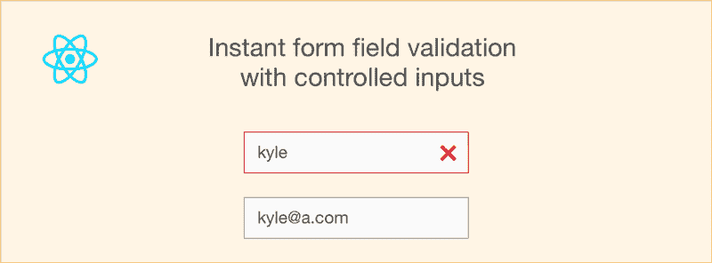
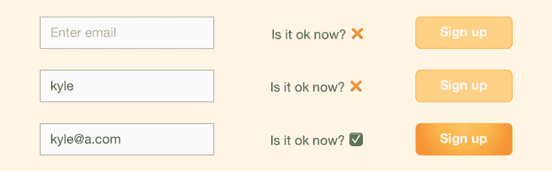
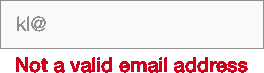
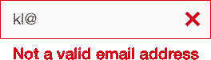

# 如何使用 React 的受控输入进行即时表单域验证

> 原文：<https://www.freecodecamp.org/news/how-to-use-reacts-controlled-inputs-for-instant-form-field-validation-b1c7b033527e/>

戈萨·阿里尼奇

# 如何使用 React 的受控输入进行即时表单域验证



[受控输入](https://goshakkk.name/controlled-vs-uncontrolled-inputs-react/)实现简单的事情，比如当一些字段丢失或无效时[禁用提交按钮](https://goshakkk.name/form-recipe-disable-submit-button-react/)。

当然，我们不会就此止步。

虽然禁用按钮很好，但是用户可能不知道为什么他们不能点击那个按钮。他们可能不知道自己犯了什么错误导致了它的失效，甚至不知道是哪个场导致了它。

这可不太好。我们必须解决这个问题。

### 受控输入的基础

使用受控输入意味着我们在状态中存储所有的输入值。然后，我们可以评估每一个值变化的特定条件，并基于它做一些事情。以前，我们所做的只是禁用按钮。



我们使用一个简单的表达式来计算是否应该禁用按钮(例如，当电子邮件或密码字段为空时):

```
const { email, password } = this.state;const isEnabled =  email.length > 0 &&  password.length &gt; 0;
```

```
<button disabled={!isEnabled}>Sign up<;/button>
```

它完成了任务。现在，为了标记坏的输入，我们需要问自己几个问题。

### 错误将如何显示？

这是一个需要自问的重要问题，因为不同的需求可能保证不同的错误表示。

有许多方法可以显示输入错误。例如，您可以:

*   展示❌


*   将包含错误数据的输入标记为红色


*   在相关输入旁边显示错误



*   在表单顶部显示错误列表
*   以上任意组合，或者别的！



你应该用哪一个？嗯，都是你想提供的体验。挑你想要的。

就本文的目的而言，我将使用最简单的方法——将错误的输入标记为红色，没有其他任何东西。

### 错误将如何表示？

您希望显示错误的方式会影响您可能表示它们的方式。

要表明某个特定的输入是否有效，不需要任何关于*为什么*它可能无效的附加信息，类似这样的信息就足够了:

```
errors: {  name: false,  email: true,}
```

`false`表示没有错误或完全有效；`true`表示字段无效。

将来，如果我们决定需要存储无效的原因，我们可以用包含错误消息的字符串替换 true/false。

### 但是这个错误对象是如何创建的呢？

现在我们知道了如何显示错误，以及如何表示它们，还缺少一些重要的东西。

如何实际制造错误。

或者，换句话说:我们如何获取现有的输入，验证它们，并获得我们需要的错误对象？

为此，我们需要一个**验证函数**。它将接受字段的当前值，并将`errors`对象返回给我们。

我们将继续使用注册表单示例。回想一下我们有过这样的经历:

```
const { email, password } = this.state;const isEnabled =  email.length > 0 &&  password.length &gt; 0;
```

事实上，我们可以将这部分逻辑转换成一个验证函数，它将:

*   如果电子邮件为空，请选择`email: true`,以及
*   如果密码为空，则有`password: true`

```
function validate(email, password) {  // true means invalid, so our conditions got reversed  return {    email: email.length === 0,    password: password.length === 0,  };}
```

### 剩下的那块

还有一块拼图没有完成。

我们有一个验证函数，我们知道如何显示错误。我们还有一张表格。

现在是时候把这些点连接起来了。

**步骤 1:** 运行`render`中的验证器。

如果我们从来不调用函数`validate`,那么它就没有用。我们希望每次(是的，每次)表单被重新呈现时都验证输入——也许输入中有一个新字符。

```
const errors = validate(this.state.email, this.state.password);
```

**第二步:**禁用按钮。

这是一个简单的。如果有任何错误(即，如果任何`errors`值为`true`)，该按钮应被禁用。

```
const isEnabled = !Object.keys(errors).some(x => errors[x]);
```

**步骤 3:** 将输入标记为错误。

这可以是任何东西。在我们的例子中，向坏输入添加一个`error`类就足够了。

```
<input  className={errors.email ? "error" : ""}  .../>
```

我们还可以添加一个简单的 CSS 规则:

```
.error { border: 1px solid red; }
```

### 还有一点

如果你看看上面的 JS Bin，你可能会注意到一些奇怪的事情。默认情况下，这些字段标记为红色，因为空字段无效。

但是我们甚至没有给用户先输入的机会！此外，第一次聚焦时，字段是红色的。

这对 UX 来说不是好事。

我们将通过添加`error`类来解决这个问题，如果这个字段至少被聚焦过一次，但是已经被模糊了。这确保用户第一次关注该字段时，错误不会立即出现。而是只有在视野模糊的情况下才会弹出。然而，在随后的焦点上，错误就出现了。

这很容易通过使用`onBlur`事件和状态来跟踪模糊的内容来实现。

```
class SignUpForm extends React.Component {  constructor() {    super();    this.state = {      email: '',      password: '',      touched: {        email: false,        password: false,      },    };  }
```

```
 // ...
```

```
 handleBlur = (field) => (evt) => {    this.setState({      touched: { ...this.state.touched, [field]: true },    });  }
```

```
 render()    const shouldMarkError = (field) => {      const hasError = errors[field];      const shouldShow = this.state.touched[field];
```

```
 return hasError ? shouldShow : false;    };
```

```
 // ...
```

```
 <input      className={shouldMarkError('email') ? "error" : ""}      onBlur={this.handleBlur('email')}
```

```
 type="text"      placeholder="Enter email"      value={this.state.email}      onChange={this.handleEmailChange}    />  }}
```

没那么难，对吧？

### 最后润色

注意`shouldMarkError`只影响现场演示。提交按钮的状态仍然只取决于验证`errors`。

想要添加漂亮的最后一笔吗？当用户悬停或单击禁用的提交按钮时，您可以强制显示所有字段中的错误，而不管它们是否已成为焦点。现在你自己去试试吧。

我最初在我的博客上发表了这篇文章，地址是[goshakk . name](https://goshakkk.name/instant-form-fields-validation-react/)

如果你喜欢这个，给我一些掌声，看看我的关于用 React 处理表单的系列文章。你也可以通过[订阅](http://goshakkk.name/subscribe/)，直接在你的收件箱里获得新帖子。