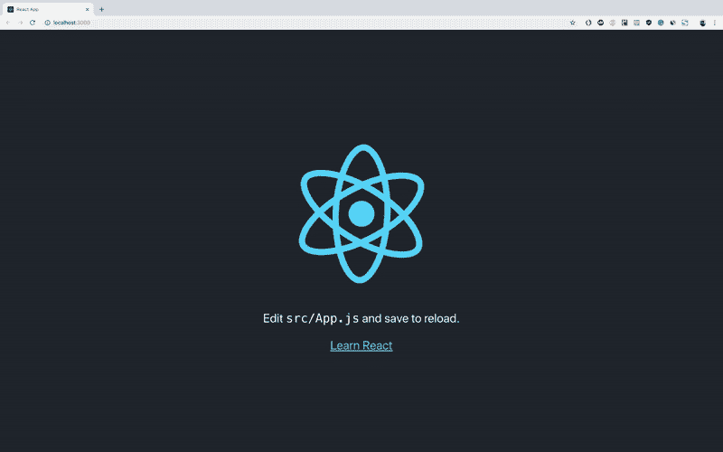
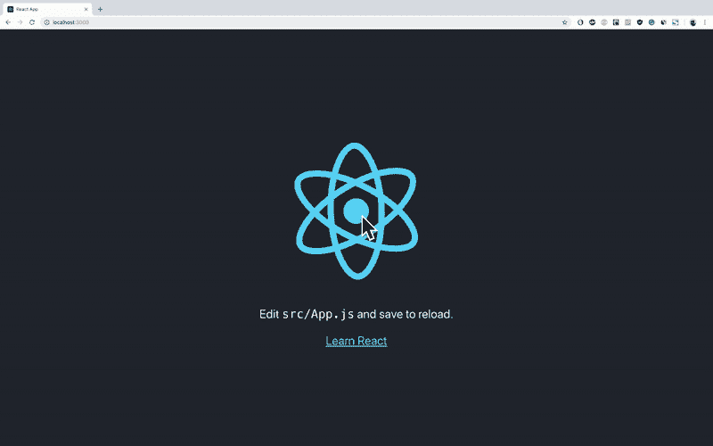
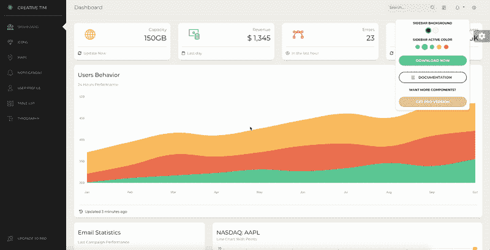
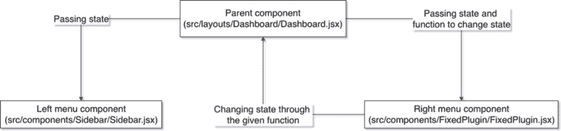
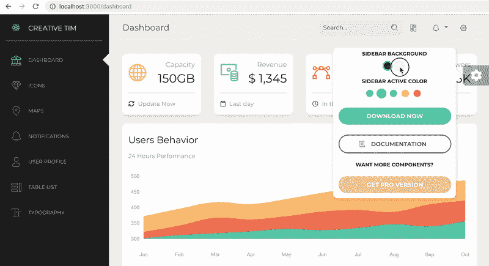

# 如何在 ReactJS 中使用 Redux，结合实际例子

> 原文：<https://www.freecodecamp.org/news/how-to-use-redux-in-reactjs-with-real-life-examples-687ab4441b85/>

by Nazare Emanuel Ioan

# 如何在 ReactJS 中使用 Redux，结合实际例子


自从我在 [Creative-Tim](https://www.creative-tim.com/) 开始与 [ReactJS](https://reactjs.org/) 合作以来，我只使用它来创建[简单的 react 应用](https://www.creative-tim.com/bootstrap-themes/react-themes)，或者[模板](https://www.creative-tim.com/bootstrap-themes/react-themes)。我只在 [create-react-app](https://github.com/facebook/create-react-app) 中使用过 ReactJS，从未尝试过将它与其他东西集成。

很多用户问我或我的团队，我创建的模板上是否有 [Redux](https://redux.js.org/) 。或者它们是以可以与 Redux 一起使用的方式创建的。我的回答总是这样:“我还没有和 Redux 合作过，我不知道我应该给你什么样的回答”。

所以我现在在这里，写一篇关于 Redux 以及应该如何在 React 中使用它的文章。稍后，在本文中，我将把 Redux 添加到我在过去一年和几年中参与的一个项目之上。

在我们继续讨论这两个库之前，最好了解一下:

*   我准备用 [create-react-app@2.1。](https://github.com/facebook/create-react-app) 1(全球安装)
*   我使用的是 [npm@6.4.1](https://www.npmjs.com/package/npm)
*   我写这篇文章时的版本是 10.13.0 (LTS)
*   如果你想使用 [Webpack](https://webpack.js.org/) 来代替，那么你可以阅读我的 [Webpack 文章](https://medium.freecodecamp.org/how-to-use-reactjs-with-webpack-4-babel-7-and-material-design-ff754586f618)，并且将我在那里向你展示的与我将要在这里向你展示的结合起来。

### 创建一个新的基于 ReactJS 的项目并向其中添加 Redux

首先，让我们创建一个新的 react 应用程序，并启动它。

```
create-react-app react-redux-tutorial
cd react-redux-tutorial
npm start
```



default **create-react-app** output of **npm start**

正如我们所看到的，create-react-app 为我们提供了一个非常基本的模板，其中包含一个段落、一个 react 网站的锚和官方 ReactJS 图标旋转。

我还没有告诉你们我们要用 Redux 做什么，或者我们在这里做什么。这是因为我需要上面的 gif 图片。

为了让这篇教程文章更简单易懂，我们不打算构建非常复杂的东西。我们将使用 Redux 使上面的 React 图像停止或开始旋转。

话虽如此，让我们继续添加下面的 **Redux** 包:

```
npm install --save redux react-redux
```

[redux 4 . 0 . 1 版](https://redux.js.org/)

*   从广义上讲，Redux 为整个应用程序创建了一个全局状态，任何组件都可以访问它
*   这是一个状态管理库
*   整个应用程序只有一个状态，而不是每个组件都有状态

[react-redux v5.1.1](https://www.npmjs.com/package/react-redux)

*   这样我们就可以访问 Redux 的数据，并通过向 Redux 发送动作来修改它——实际上不是 Redux，但我们会到达那里
*   官方文档声明:*它让您的 React 组件从 Redux 存储中读取数据，并向存储发送动作以更新数据*

**注意** : *如果你对上面的命令有问题，试着单独安装软件包*

使用 Redux 时，您需要三样东西:

*   [动作](https://redux.js.org/basics/actions):这些对象应该有两个属性，一个描述动作的**类型**，另一个描述在应用状态下应该改变什么。
*   [reducer](https://redux.js.org/basics/reducers):这些是实现动作行为的函数。他们根据动作描述和状态改变描述来改变应用程序的状态。
*   [store](https://redux.js.org/basics/store) :它把动作和 reducers 集合在一起，为整个应用保持和改变状态——只有一个 store。

正如我上面所说的，我们将停止并开始旋转 React 徽标。这意味着我们需要采取如下两项行动:

1 — Linux / Mac 命令

```
mkdir src/actions
touch src/actions/startAction.js
touch src/actions/stopAction.js
```

2 — Windows 命令

```
mkdir src\actions
echo "" > src\actions\startAction.js
echo "" > src\actions\stopAction.js
```

现在让我们编辑**src/actions/start action . js**如下:

```
export const startAction = {
  type: "rotate",
  payload: true
};
```

所以，我们要对我们的减速器说，动作的类型是关于 React 标志的*旋转* ( **旋转**)。React 徽标的旋转状态应该更改为**true**——我们希望徽标开始旋转。

现在让我们编辑**src/actions/stop action . js**如下:

```
export const stopAction = {
  type: "rotate",
  payload: false
};
```

所以，我们要对我们的减速器说，动作的类型是关于 React 标志的*旋转* ( **旋转**)。React 徽标的旋转状态应改为**假**——我们希望徽标停止旋转。

让我们也为我们的应用程序创建一个缩减器:

1 — Linux / Mac 命令

```
mkdir src/reducers
touch src/reducers/rotateReducer.js
```

2 — Windows 命令

```
mkdir src\reducers
echo "" > src\reducers\rotateReducer.js
```

并且，在其中添加以下代码:

```
export default (state, action) => {
  switch (action.type) {
    case "rotate":
      return {
        rotating: action.payload
      };
    default:
      return state;
  }
};
```

因此，减速器将接收我们的两个动作，这两个动作都是**旋转、**类型，并且它们都在 app 中改变相同的状态——这是*状态。基于这些动作的有效载荷，*状态旋转*将变为**真**或**假**。*

我添加了一个**默认**案例，如果动作类型不是**旋转**，它将保持状态不变。默认值在这里，以防我们创建了一个操作而忘记为该操作添加一个案例。这样我们不会删除整个应用程序状态——我们只是什么都不做，保留我们所拥有的。

我们需要做的最后一件事是为整个应用程序创建我们的商店。由于整个应用程序只有一个商店/一个州，我们不打算为商店创建新文件夹。如果您愿意，您可以为商店创建一个新文件夹并将其添加到那里，但这与操作不同，例如，您可以有多个操作，将它们保存在一个文件夹中会更好。

也就是说，我们将运行这个命令:

1 — Linux / Mac 命令

```
touch src/store.js
```

2 — Windows 命令

```
echo "" > src\store.js
```

并在其中添加以下代码:

```
import { createStore } from "redux";
import rotateReducer from "reducers/rotateReducer";

function configureStore(state = { rotating: true }) {
  return createStore(rotateReducer,state);
}

export default configureStore;
```

因此，我们创建一个名为 **configureStore** 的函数，在其中我们发送一个默认状态，并且我们使用创建的 reducer 和默认状态创建我们的存储。

我不确定你是否看过我的导入，它们使用绝对路径，所以你可能会因此而产生一些错误。解决这个问题的方法有两种:

也

1-将. env 文件添加到您的应用程序中，如下所示:

```
echo "NODE_PATH=./src" > .env
```

或者

2 —全局安装 cross-env 并从 package.json 文件中更改启动脚本，如下所示:

```
npm install -g cross-env
```

以及 package.json 内部

```
"start": "NODE_PATH=./src react-scripts start",
```

现在我们已经建立了我们的存储、我们的动作和我们的 reducer，我们需要在 **src/App.css** 文件中添加一个新类。这个类将暂停徽标的旋转动画。

所以我们要在 **src/App.css** 里面写以下内容:

```
.App-logo-paused {
  animation-play-state: paused;
}
```

所以你的 **App.css** 文件应该是这样的:

```
.App {
  text-align: center;
}

.App-logo {
  animation: App-logo-spin infinite 20s linear;
  height: 40vmin;
}

/* new class here */
.App-logo-paused {
  animation-play-state: paused;
}

.App-header {
  background-color: #282c34;
  min-height: 100vh;
  display: flex;
  flex-direction: column;
  align-items: center;
  justify-content: center;
  font-size: calc(10px + 2vmin);
  color: white;
}

.App-link {
  color: #61dafb;
}

@keyframes App-logo-spin {
  from {
    transform: rotate(0deg);
  }
  to {
    transform: rotate(360deg);
  }
}
```

现在，我们只需要修改我们的 **src/App.js** 文件，让它监听我们的存储状态。当点击图标时，它调用开始或停止动作。

首先，我们需要将组件连接到 redux 存储，因此我们从 **react-redux** 导入 **connect** 。

```
import { connect } from "react-redux";
```

之后，我们将通过 connect 方法导出我们的应用程序组件，如下所示:

```
export default connect()(App);
```

要更改 redux store 状态，我们需要之前完成的操作，所以我们也导入它们:

```
import { startAction } from "actions/startAction";
import { stopAction } from "actions/stopAction";
```

现在，我们需要从我们的存储中检索状态，并说我们希望开始和停止操作用于更改状态。

这将使用 connect 函数来完成，该函数接受两个参数:

*   **mapStateToProps:** 用于检索商店状态
*   **mapDispatchToProps:** 这用于检索动作并将它们发送到商店

你可以在这里阅读更多关于它们的内容: [react-redux 连接函数参数](https://github.com/reduxjs/react-redux/blob/master/docs/api.md#arguments)。

因此，让我们在 App.js 中编写(如果可以的话，在文件的末尾):

```
const mapStateToProps = state => ({
  ...state
});

const mapDispatchToProps = dispatch => ({
  startAction: () => dispatch(startAction),
  stopAction: () => dispatch(stopAction)
});
```

之后，让我们将它们添加到我们的连接函数中，如下所示:

```
export default connect(mapStateToProps, mapDispatchToProps)(App);
```

现在，在我们的应用组件中，我们可以通过 props 访问商店状态、startAction 和 stopAction。

让我们将 **img** 标签改为:

```

```

所以，我们在这里说的是，如果商店的 rotating 状态( **this.props.rotating** )为真，那么我们只希望将*的 App-logo* **className** 设置为我们的 **img** 。如果这是假的，那么我们也希望在 **className** 中设置 *App-logo-paused* 类。这样我们可以暂停动画。

另外，如果 **this.props.rotating** 为**真**，那么我们要发送到我们的商店进行 **onClick** 功能，并将其改回**假**，反之亦然。

我们快完成了，但是我们忘记了一些事情。

我们还没有告诉我们的 react 应用程序我们有一个全局状态，或者如果你愿意，我们使用 redux 状态管理。

为此，我们进入 **src/index.js** ，我们从 **react-redux** 导入一个**提供者**，新创建的商店如下所示:

```
import { Provider } from "react-redux";

import configureStore from "store";
```

*   [Provider](https://react-redux.js.org/docs/api/provider) :使 Redux 存储对任何已经包装在 connect 函数中的嵌套组件可用

此后，我们不再直接呈现我们的应用程序组件，而是通过我们的提供者使用我们创建的商店来呈现它，如下所示:

```
ReactDOM.render(
  <Provider store={configureStore()}>
    <App />
  </Provider>,
  document.getElementById('root')
);
```

在这里，我们可以将 **configureStore** 函数用于其他状态，例如***configure store({ rotating:false })***。

所以，你的 **index.js** 应该是这样的:

```
import React from 'react';
import ReactDOM from 'react-dom';
// new imports start
import { Provider } from "react-redux";

import configureStore from "store";
// new imports stop

import './index.css';

import App from './App';
import * as serviceWorker from './serviceWorker';

// changed the render
ReactDOM.render(
  <Provider store={configureStore()}>
    <App />
  </Provider>,
  document.getElementById('root')
);
// changed the render

serviceWorker.unregister();
```

让我们来看看我们的 redux 应用程序是否有效:



**react** and **redux** in action

### 使用动作创建器

可选地，代替**动作**，我们可以使用[动作创建器](https://redux.js.org/basics/actions#action-creators)，它们是创建动作的函数。

这样，我们可以将两个操作合并到一个函数中，并减少一点代码。

因此，让我们继续创建一个新文件:

1 — Linux / Mac 命令

```
touch src/actions/rotateAction.js
```

2 — Windows 命令

```
echo "" > src\actions\rotateAction.js
```

并添加以下代码:

```
const rotateAction = (payload) => {
  return {
    type: "rotate",
    payload
  }
}
export default rotateAction;
```

我们将发送一个 rotate 类型的操作，并在应用程序组件中获得一个有效负载。

在 src/App.js 组件中，我们需要导入新的动作创建器:

```
import rotateAction from "actions/rotateAction";
```

向 mapDispatchToProps 添加新函数，如下所示:

rotateAction:将接收一个(有效负载)并将使用有效负载调度 rotateAction

将 **onClick** 功能改为:

```
onClick={() => this.props.rotateAction(!this.props.rotating)}
```

最后，将我们的新动作创建者添加到**mapdispatchtopros**中，如下所示:

```
rotateAction: (payload) => dispatch(rotateAction(payload))
```

我们还可以删除旧操作的旧导入，并从 **mapDispatchToProps** 中删除它们。

新的 src/App.js 应该是这样的:

```
import React, { Component } from 'react';
// new lines from here
import { connect } from "react-redux";
import rotateAction from "actions/rotateAction";

//// new lines to here

import logo from './logo.svg';
import './App.css';

class App extends Component {
  render() {
    console.log(this.props);
    return (
      <div className="App">
        <header className="App-header">
           this.props.rotateAction(!this.props.rotating)
            }
          />
          <p>
            Edit <code>src/App.js</code> and save to reload.
          </p>
          <a
            className="App-link"
            href="https://reactjs.org"
            target="_blank"
            rel="noopener noreferrer"
          >
            Learn React
          </a>
        </header>
      </div>
    );
  }
}

const mapStateToProps = state => ({
  ...state
});
const mapDispatchToProps = dispatch => ({
  rotateAction: (payload) => dispatch(rotateAction(payload))
});

export default connect(mapStateToProps, mapDispatchToProps)(App);
```

### 现实生活中的一个例子[纸质仪表盘反应](https://www.creative-tim.com/product/paper-dashboard-react)



**Paper Dashboard React** — Product Gif

正如你在上面的 gif 图片中看到的，我使用右边的菜单来改变左边菜单的颜色。这是通过使用组件状态，并通过将该状态从父组件传递到两个菜单和一些函数来改变该状态来实现的。



small diagram on how the app works at the moment

我认为这是一个很好的例子，用 Redux 替换这个产品的组件状态。

你可以通过以下三种方式获得:

1.  从[creative-tim.com](https://www.creative-tim.com/product/paper-dashboard-react)下载
2.  从 [Github](https://github.com/creativetimofficial/paper-dashboard-react) 下载
3.  从 Github 克隆:

```
git clone https://github.com/creativetimofficial/paper-dashboard-react.git
```

现在我们已经有了这个产品，让我们把它放入 cd 并再次安装 redux 和 react-redux:

```
npm install --save redux react-redux
```

在这之后，我们需要创建动作。因为在右侧菜单中，我们有 2 种颜色设置左侧菜单的背景，5 种颜色改变链接的颜色，所以我们需要 7 个动作，或者 2 个动作创建者——我们使用第二个选项，因为它需要编写的代码较少:

1 — Linux / Mac 命令

```
mkdir src/actions
touch src/actions/setBgAction.js
touch src/actions/setColorAction.js
```

2 — Windows 命令

```
mkdir src\actions
echo "" > src\actions\setBgAction.js
echo "" > src\actions\setColorAction.js
```

之后，让我们创建如下的动作代码:

—**src/actions/setbgaction . js**

```
const setBgAction = (payload) => {
  return {
    type: "bgChange",
    payload
  }
}
export default setBgAction;
```

—**src/actions/setcoloraction . js**

```
const setColorAction = (payload) => {
  return {
    type: "colorChange",
    payload
  }
}
export default setColorAction;
```

现在，和第一部分一样，我们需要减速器:

1 — Linux / Mac 命令

```
mkdir src/reducers
touch src/reducers/rootReducer.js
```

2 — Windows 命令

```
mkdir src\reducers
echo "" > src\reducers\rootReducer.js
```

减速器的代码是:

```
export default (state, action) => {
  switch (action.type) {
    case "bgChange":
      return {
        ...state,
        bgColor: action.payload
      };
    case "colorChange":
      return {
        ...state,
        activeColor: action.payload
      };
    default:
      return state;
  }
};
```

正如您在这里看到的，与我们的第一个例子不同，我们希望保持旧的状态并更新其内容。

我们还需要商店:

1 — Linux / Mac 命令

```
touch src/store.js
```

2 — Windows 命令

```
echo "" > src\store.js
```

它的代码是:

```
import { createStore } from "redux";
import rootReducer from "reducers/rootReducer";

function configureStore(state = { bgColor: "black", activeColor: "info" }) {
  return createStore(rootReducer,state);
}
export default configureStore;
```

在 src/index.js 中，我们需要:

```
// new imports start
import { Provider } from "react-redux";

import configureStore from "store";
// new imports stop
```

并且，改变**渲染**功能:

```
ReactDOM.render(
  <Provider store={configureStore()}>
    <Router history={hist}>
      <Switch>
        {indexRoutes.map((prop, key) => {
          return <Route path={prop.path} key={key} component={prop.component} />;
        })}
      </Switch>
    </Router>
  </Provider>,
  document.getElementById("root")
);
```

所以 **index.js** 文件应该是这样的:

```
import React from "react";
import ReactDOM from "react-dom";
import { createBrowserHistory } from "history";
import { Router, Route, Switch } from "react-router-dom";
// new imports start
import { Provider } from "react-redux";

import configureStore from "store";
// new imports stop

import "bootstrap/dist/css/bootstrap.css";
import "assets/scss/paper-dashboard.scss";
import "assets/demo/demo.css";

import indexRoutes from "routes/index.jsx";

const hist = createBrowserHistory();

ReactDOM.render(
  <Provider store={configureStore()}>
    <Router history={hist}>
      <Switch>
        {indexRoutes.map((prop, key) => {
          return <Route path={prop.path} key={key} component={prop.component} />;
        })}
      </Switch>
    </Router>
  </Provider>,
  document.getElementById("root")
);
```

现在我们需要在**src/layouts/Dashboard/Dashboard . jsx**里面做一些修改。我们需要删除状态和改变状态的函数。所以继续前进，**删除这些代码:**

构造函数(在第 16 行和第 22 行之间):

```
constructor(props){
  super(props);
  this.state = {
    backgroundColor: "black",
    activeColor: "info",
  }
}
```

状态函数(第 41 行和第 46 行之间):

```
handleActiveClick = (color) => {
    this.setState({ activeColor: color });
  }
handleBgClick = (color) => {
  this.setState({ backgroundColor: color });
}
```

侧边栏**背景颜色**和**活动颜色**道具(第 53 和 54 行):

```
bgColor={this.state.backgroundColor}
activeColor={this.state.activeColor}
```

所有固定插件道具(第 59-62 行之间):

```
bgColor={this.state.backgroundColor}
activeColor={this.state.activeColor}
handleActiveClick={this.handleActiveClick}
handleBgClick={this.handleBgClick}
```

因此，我们仍然使用仪表板布局组件中的代码:

```
import React from "react";
// javascript plugin used to create scrollbars on windows
import PerfectScrollbar from "perfect-scrollbar";
import { Route, Switch, Redirect } from "react-router-dom";

import Header from "components/Header/Header.jsx";
import Footer from "components/Footer/Footer.jsx";
import Sidebar from "components/Sidebar/Sidebar.jsx";
import FixedPlugin from "components/FixedPlugin/FixedPlugin.jsx";

import dashboardRoutes from "routes/dashboard.jsx";

var ps;

class Dashboard extends React.Component {
  componentDidMount() {
    if (navigator.platform.indexOf("Win") > -1) {
      ps = new PerfectScrollbar(this.refs.mainPanel);
      document.body.classList.toggle("perfect-scrollbar-on");
    }
  }
  componentWillUnmount() {
    if (navigator.platform.indexOf("Win") > -1) {
      ps.destroy();
      document.body.classList.toggle("perfect-scrollbar-on");
    }
  }
  componentDidUpdate(e) {
    if (e.history.action === "PUSH") {
      this.refs.mainPanel.scrollTop = 0;
      document.scrollingElement.scrollTop = 0;
    }
  }
  render() {
    return (
      <div className="wrapper">
        <Sidebar
          {...this.props}
          routes={dashboardRoutes}
        />
        <div className="main-panel" ref="mainPanel">
          <Header {...this.props} />
          <Switch>
            {dashboardRoutes.map((prop, key) => {
              if (prop.pro) {
                return null;
              }
              if (prop.redirect) {
                return <Redirect from={prop.path} to={prop.pathTo} key={key} />;
              }
              return (
                <Route path={prop.path} component={prop.component} key={key} />
              );
            })}
          </Switch>
          <Footer fluid />
        </div>
        <FixedPlugin />
      </div>
    );
  }
}

export default Dashboard;
```

我们需要将**侧栏**和**固定插件**组件连接到商店。

对于**src/components/Sidebar/Sidebar . jsx**:

```
import { connect } from "react-redux";
```

并将导出更改为:

```
const mapStateToProps = state => ({
  ...state
});

export default connect(mapStateToProps)(Sidebar);
```

对于**src/components/fixed plugin/fixed plugin . jsx**:

```
import { connect } from "react-redux";
import setBgAction from "actions/setBgAction";
import setColorAction from "actions/setColorAction";
```

现在导出应该是:

```
const mapStateToProps = state => ({
  ...state
});

const mapDispatchToProps = dispatch => ({
  setBgAction: (payload) => dispatch(setBgAction(payload)),
  setColorAction: (payload) => dispatch(setColorAction(payload))
});

export default connect(mapStateToProps, mapDispatchToProps)(FixedPlugin);
```

我们将有以下变化:

*   无论你在哪里找到单词 **handleBgClick** ，你都需要把它改成 **setBgAction**
*   在任何你发现单词 **handleActiveClick** 的地方，你都需要把它改成 **setColorAction**

因此，FixedPlugin 组件现在应该如下所示:

```
import React, { Component } from "react";

import { connect } from "react-redux";
import setBgAction from "actions/setBgAction";
import setColorAction from "actions/setColorAction";

import Button from "components/CustomButton/CustomButton.jsx";

class FixedPlugin extends Component {
  constructor(props) {
    super(props);
    this.state = {
      classes: "dropdown show"
    };
    this.handleClick = this.handleClick.bind(this);
  }
  handleClick() {
    if (this.state.classes === "dropdown") {
      this.setState({ classes: "dropdown show" });
    } else {
      this.setState({ classes: "dropdown" });
    }
  }
  render() {
    return (
      <div className="fixed-plugin">
        <div className={this.state.classes}>
          <div onClick={this.handleClick}>
            <i className="fa fa-cog fa-2x" />
          </div>
          <ul className="dropdown-menu show">
            <li className="header-title">SIDEBAR BACKGROUND</li>
            <li className="adjustments-line">
              <div className="badge-colors text-center">
                <span
                  className={
                    this.props.bgColor === "black"
                      ? "badge filter badge-dark active"
                      : "badge filter badge-dark"
                  }
                  data-color="black"
                  onClick={() => {
                    this.props.setBgAction("black");
                  }}
                />
                <span
                  className={
                    this.props.bgColor === "white"
                      ? "badge filter badge-light active"
                      : "badge filter badge-light"
                  }
                  data-color="white"
                  onClick={() => {
                    this.props.setBgAction("white");
                  }}
                />
              </div>
            </li>
            <li className="header-title">SIDEBAR ACTIVE COLOR</li>
            <li className="adjustments-line">
              <div className="badge-colors text-center">
                <span
                  className={
                    this.props.activeColor === "primary"
                      ? "badge filter badge-primary active"
                      : "badge filter badge-primary"
                  }
                  data-color="primary"
                  onClick={() => {
                    this.props.setColorAction("primary");
                  }}
                />
                <span
                  className={
                    this.props.activeColor === "info"
                      ? "badge filter badge-info active"
                      : "badge filter badge-info"
                  }
                  data-color="info"
                  onClick={() => {
                    this.props.setColorAction("info");
                  }}
                />
                <span
                  className={
                    this.props.activeColor === "success"
                      ? "badge filter badge-success active"
                      : "badge filter badge-success"
                  }
                  data-color="success"
                  onClick={() => {
                    this.props.setColorAction("success");
                  }}
                />
                <span
                  className={
                    this.props.activeColor === "warning"
                      ? "badge filter badge-warning active"
                      : "badge filter badge-warning"
                  }
                  data-color="warning"
                  onClick={() => {
                    this.props.setColorAction("warning");
                  }}
                />
                <span
                  className={
                    this.props.activeColor === "danger"
                      ? "badge filter badge-danger active"
                      : "badge filter badge-danger"
                  }
                  data-color="danger"
                  onClick={() => {
                    this.props.setColorAction("danger");
                  }}
                />
              </div>
            </li>
            <li className="button-container">
              <Button
                href="https://www.creative-tim.com/product/paper-dashboard-react"
                color="primary"
                block
                round
              >
                Download now
              </Button>
            </li>
            <li className="button-container">
              <Button
                href="https://www.creative-tim.com/product/paper-dashboard-react/#/documentation/tutorial"
                color="default"
                block
                round
                outline
              >
                <i className="nc-icon nc-paper"></i> Documentation
              </Button>
            </li>
            <li className="header-title">Want more components?</li>
            <li className="button-container">
              <Button
                href="https://www.creative-tim.com/product/paper-dashboard-pro-react"
                color="danger"
                block
                round
                disabled
              >
                Get pro version
              </Button>
            </li>
          </ul>
        </div>
      </div>
    );
  }
}

const mapStateToProps = state => ({
  ...state
});

const mapDispatchToProps = dispatch => ({
  setBgAction: (payload) => dispatch(setBgAction(payload)),
  setColorAction: (payload) => dispatch(setColorAction(payload))
});

export default connect(mapStateToProps, mapDispatchToProps)(FixedPlugin);
```

我们已经完成了，你可以开始这个项目，看看一切是如何正常工作的:



### 多重减速器

由于可以有多个操作，所以可以有多个减速器。唯一的问题是你需要将它们结合起来——我们将在后面看到这一点。

让我们继续为我们的应用程序创建两个新的 reducers，一个用于 **setBgAction** ，一个用于 **setColorAction** :

1 — Linux / Mac 命令

```
touch src/reducers/bgReducer.js
touch src/reducers/colorReducer.js
```

2 — Windows 命令

```
echo "" > src\reducers\bgReducer.js
echo "" > src\reducers\colorReducer.js
```

在此之后，让我们创建如下的 reducers 代码:

—**src/reducers/bgreducer . js**

```
export default (state = {}, action) => {
  switch (action.type) {
    case "bgChange":
      return {
        ...state,
        bgColor: action.payload
      };
    default:
      return state;
  }
};
```

—**src/reducers/color reducer . js**

```
export default (state = {} , action) => {
  switch (action.type) {
    case "colorChange":
      return {
        ...state,
        activeColor: action.payload
      };
    default:
      return state;
  }
};
```

当使用组合减速器时，您需要在将要组合的每个减速器中添加一个默认状态。在我的例子中，我选择了一个空对象，即**state = { }**；

现在，我们的 **rootReducer** 将结合这两者如下:

—**src/reducers/root reducer . js**

```
import { combineReducers } from 'redux';

import bgReducer from 'reducers/bgReducer';
import colorReducer from 'reducers/colorReducer';

export default combineReducers({
  activeState: colorReducer,
  bgState: bgReducer
});
```

所以，我们说我们希望 **colorReducer** 被 app 状态的 **activeState** 属性引用，而 **bgReducer** 被 app 状态的 **bgState** 属性引用。

这意味着我们的国家将不再是这个样子:

```
state = {
  activeColor: "color1",
  bgColor: "color2"
}
```

它现在看起来像这样:

```
state = {
  activeState: {
    activeColor: "color1"
  },
  bgState: {
    bgColor: "color2"
  }
}
```

既然我们已经改变了我们的 reducers，现在我们已经将它们合并成一个，我们还需要改变我们的 **store.js** :

— **src/store.js**

```
import { createStore } from "redux";
import rootReducer from "reducers/rootReducer";

// we need to pass the initial state with the new look
function configureStore(state = { bgState: {bgColor: "black"}, activeState: {activeColor: "info"} }) {
  return createStore(rootReducer,state);
}
export default configureStore;
```

既然我们已经改变了状态的外观，我们现在需要将**侧栏**和**固定插件**组件中的道具更改为新的状态对象:

—**src/components/Sidebar/Sidebar . jsx**:

将**线 36** 从

```
<div className="sidebar" data-color={this.props.bgColor} data-active-color={this.props.activeColor}>
```

到

```
<div className="sidebar" data-color={this.props.bgState.bgColor} data-active-color={this.props.activeState.activeColor}>
```

—**src/components/fixed plugin/fixed plugin . jsx**:

我们需要把所有的`**this.props.bgColor**`都改成`**this.props.bgState.bgColor**` 。还有所有的`**this.props.activeColor**`到`**this.props.activeState.activeColor**`。

所以新代码应该是这样的:

```
import React, { Component } from "react";

import Button from "components/CustomButton/CustomButton.jsx";

import { connect } from "react-redux";
import setBgAction from "actions/setBgAction";
import setColorAction from "actions/setColorAction";

class FixedPlugin extends Component {
  constructor(props) {
    super(props);
    this.state = {
      classes: "dropdown show"
    };
    this.handleClick = this.handleClick.bind(this);
  }
  handleClick() {
    if (this.state.classes === "dropdown") {
      this.setState({ classes: "dropdown show" });
    } else {
      this.setState({ classes: "dropdown" });
    }
  }
  render() {
    return (
      <div className="fixed-plugin">
        <div className={this.state.classes}>
          <div onClick={this.handleClick}>
            <i className="fa fa-cog fa-2x" />
          </div>
          <ul className="dropdown-menu show">
            <li className="header-title">SIDEBAR BACKGROUND</li>
            <li className="adjustments-line">
              <div className="badge-colors text-center">
                <span
                  className={
                    this.props.bgState.bgColor === "black"
                      ? "badge filter badge-dark active"
                      : "badge filter badge-dark"
                  }
                  data-color="black"
                  onClick={() => {
                    this.props.setBgAction("black");
                  }}
                />
                <span
                  className={
                    this.props.bgState.bgColor === "white"
                      ? "badge filter badge-light active"
                      : "badge filter badge-light"
                  }
                  data-color="white"
                  onClick={() => {
                    this.props.setBgAction("white");
                  }}
                />
              </div>
            </li>
            <li className="header-title">SIDEBAR ACTIVE COLOR</li>
            <li className="adjustments-line">
              <div className="badge-colors text-center">
                <span
                  className={
                    this.props.activeState.activeColor === "primary"
                      ? "badge filter badge-primary active"
                      : "badge filter badge-primary"
                  }
                  data-color="primary"
                  onClick={() => {
                    this.props.setColorAction("primary");
                  }}
                />
                <span
                  className={
                    this.props.activeState.activeColor === "info"
                      ? "badge filter badge-info active"
                      : "badge filter badge-info"
                  }
                  data-color="info"
                  onClick={() => {
                    this.props.setColorAction("info");
                  }}
                />
                <span
                  className={
                    this.props.activeState.activeColor === "success"
                      ? "badge filter badge-success active"
                      : "badge filter badge-success"
                  }
                  data-color="success"
                  onClick={() => {
                    this.props.setColorAction("success");
                  }}
                />
                <span
                  className={
                    this.props.activeState.activeColor === "warning"
                      ? "badge filter badge-warning active"
                      : "badge filter badge-warning"
                  }
                  data-color="warning"
                  onClick={() => {
                    this.props.setColorAction("warning");
                  }}
                />
                <span
                  className={
                    this.props.activeState.activeColor === "danger"
                      ? "badge filter badge-danger active"
                      : "badge filter badge-danger"
                  }
                  data-color="danger"
                  onClick={() => {
                    this.props.setColorAction("danger");
                  }}
                />
              </div>
            </li>
            <li className="button-container">
              <Button
                href="https://www.creative-tim.com/product/paper-dashboard-react"
                color="primary"
                block
                round
              >
                Download now
              </Button>
            </li>
            <li className="button-container">
              <Button
                href="https://www.creative-tim.com/product/paper-dashboard-react/#/documentation/tutorial"
                color="default"
                block
                round
                outline
              >
                <i className="nc-icon nc-paper"></i> Documentation
              </Button>
            </li>
            <li className="header-title">Want more components?</li>
            <li className="button-container">
              <Button
                href="https://www.creative-tim.com/product/paper-dashboard-pro-react"
                color="danger"
                block
                round
                disabled
              >
                Get pro version
              </Button>
            </li>
          </ul>
        </div>
      </div>
    );
  }
}

const mapStateToProps = state => ({
  ...state
});

const mapDispatchToProps = dispatch => ({
  setBgAction: (payload) => dispatch(setBgAction(payload)),
  setColorAction: (payload) => dispatch(setColorAction(payload))
});

export default connect(mapStateToProps, mapDispatchToProps)(FixedPlugin);
```

让我们用`npm start`再次打开项目，看看一切是如何工作的。哒哒！

### 感谢阅读！

如果你喜欢阅读本教程，请分享它。我很想听听你对这件事的看法。只要给这个帖子一个评论，我会非常乐意回复。

还要特别感谢[埃丝特·法莱伊](https://medium.com/@estherfalayi)的[教程](https://medium.com/backticks-tildes/setting-up-a-redux-project-with-create-react-app-e363ab2329b8)，让我对 **Redux** 有了一些急需的了解。

有用的链接:

*   从 [Github](https://github.com/creativetimofficial/react-redux-tutorial) 获取本教程的代码
*   在 ReactJS 官方网站上阅读更多关于 react js 的信息
*   点击阅读更多关于 [Redux 的信息](https://redux.js.org/)
*   阅读更多关于 [React-Redux](https://react-redux.js.org/) 的信息
*   查看我们的平台，看看[我们在做什么](https://www.creative-tim.com/)和[我们是谁](https://www.creative-tim.com/presentation)
*   从[www.creative-tim.com](https://www.creative-tim.com/product/paper-dashboard-react)或者从 [Github](https://github.com/creativetimofficial/paper-dashboard-react) 获取纸质仪表盘反应
*   阅读更多关于纸张仪表板 React 的核心 [Reactstrap](https://reactstrap.github.io/)

在以下位置找到我:

*   电子邮件:[manu@creative-tim.com](mailto:manu@creative-tim.com)
*   https://www.facebook.com/NazareEmanuel
*   insta gram:[https://www.instagram.com/manu.nazare/](https://www.instagram.com/manu.nazare/)
*   领英:[https://www.linkedin.com/in/nazare-emanuel-ioan-4298b5149/](https://www.linkedin.com/in/nazare-emanuel-ioan-4298b5149/)