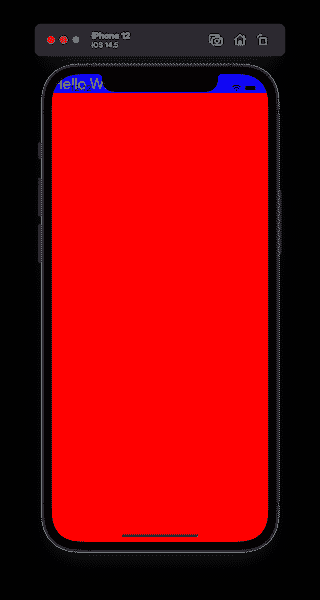
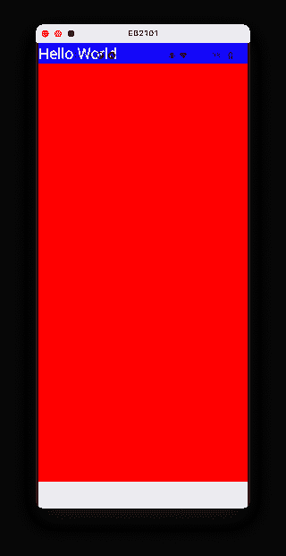
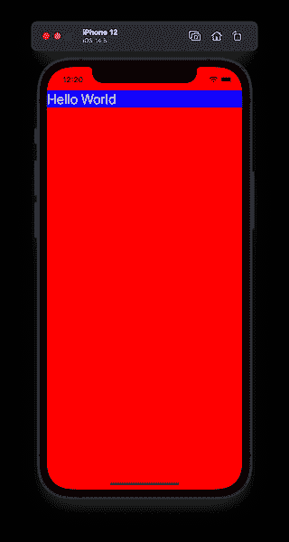
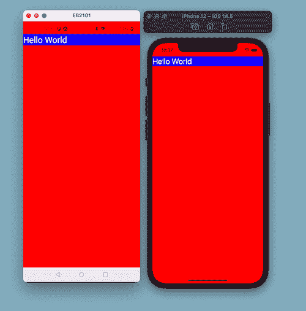
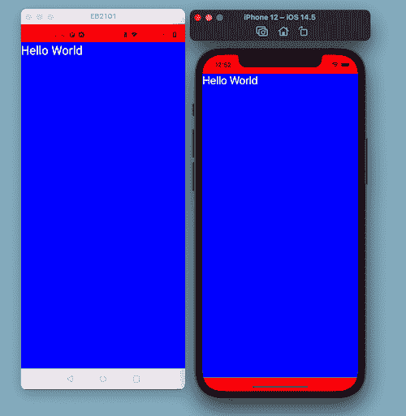

# 如何在 React 本地应用中使用安全区域上下文来避免缺口

> 原文：<https://www.freecodecamp.org/news/how-to-use-safe-area-context-to-avoid-notches-in-react-native-apps/>

如今大多数设备在屏幕顶部都有一个缺口。因此，当您使用 React Native 构建移动应用程序时，您需要确保应用程序屏幕的内容能够在不同类型的设备上正确呈现。

在本文中，我们将研究在 React Native 中制作应用程序屏幕的两种不同方法。每一个都避免将内容放在缺口或状态栏的后面。

第一种方法使用 React 本地组件 API 中的`SafeAreaView`组件。第二种方法讨论了使用[react-native-safe-area-context](https://github.com/th3rdwave/react-native-safe-area-context)开源库的优势，以及它如何提供跨平台的解决方案。

## 缺口问题

当您开始在 React 本机应用程序中构建屏幕时，您可以使用以下代码片段来显示文本:

```
import React from 'react';
import { StyleSheet, Text, View } from 'react-native';

export const HomeScreen = () => {
  return (
    <View style={[styles.container]}>
      <View style={{ backgroundColor: 'blue' }}>
        <Text style={{ fontSize: 28, color: 'white' }}>Hello World</Text>
      </View>
    </View>
  );
};

const styles = StyleSheet.create({
  container: {
    flex: 1,
    backgroundColor: 'red'
  }
});
```

上面的代码片段有一个背景色为`red`的父`View`组件。它包装了另一个背景颜色为`blue`的`View`组件，该组件包含一个`Text`组件以在屏幕上显示一些文本。

这将在 iOS 设备上显示屏幕内容，如下所示:



Without safe area view on iOS

嵌套的`View`组件的内容隐藏在 iOS 设备的状态栏和凹槽后面。

在 Android 设备上，行为完全相同:



Status bar overlaps the content of the screen on Android

## 如何使用 React Native 中的 SafeAreaView 组件

一种方法是使用 React Native 中可用的[安全区域视图组件](https://reactnative.dev/docs/safeareaview)。

```
import { SafeAreaView } from 'react-native';
```

您只是用它来代替顶级的`View`组件。它确保安全区域边界内的内容正确呈现在嵌套内容周围，并自动应用填充。

所以现在我们可以修改前面的代码片段:

```
import React from 'react';
import { StyleSheet, Text, View, SafeAreaView } from 'react-native';

export const HomeScreen = () => {
  return (
    <SafeAreaView style={[styles.container]}>
      <View style={{ backgroundColor: 'blue' }}>
        <Text style={{ fontSize: 28, color: 'white' }}>Hello World</Text>
      </View>
    </SafeAreaView>
  );
};
```

因此它可以在 iOS 上完美运行:



On using SafeAreaView component

在 React Native 中，该组件仅适用于 iOS 版本 11 或更高版本的 iOS 设备。不幸的是，这意味着它不适用于 Android 设备，因为屏幕内容仍然在状态栏后面。

## 如何使用 React Native 的安全区域上下文库

幸运的是，有一个跨平台的解决方案来处理 notch 设备上的安全区域，名为[react-native-safe-area-context](https://github.com/th3rdwave/react-native-safe-area-context)。它提供了一个灵活的 API 来处理 JS 中的安全区域插入，并且可以在 iOS、Android 和 Web 上工作。

首先将它安装在 React 本机应用程序中:

```
# for plain React Native apps
yarn add react-native-safe-area-context

# install pod dependency for iOS only
npx pod-install

# for Expo apps
expo install react-native-safe-area-context
```

这个库提供了一个`SafeAreaProvider`，它需要包装你的根导航器或者你想要处理安全区域插入的屏幕。

例如，在下面的代码片段中，`SafeAreaProvider`包装了`HomeScreen`组件，因为示例应用程序中只有一个屏幕。

```
import React from 'react';
import { SafeAreaProvider } from 'react-native-safe-area-context';

import { HomeScreen } from './src/screens';

export default function App() {
  return (
    <SafeAreaProvider>
      <HomeScreen />
    </SafeAreaProvider>
  );
}
```

现在，您可以从`react-native-safe-area-context`库中导入`SafeAreaView`组件，并用 React Native 中的组件替换它。

```
import React from 'react';
import { StyleSheet, Text, View } from 'react-native';
import { SafeAreaView } from 'react-native-safe-area-context';

export const HomeScreen = () => {
  return (
    <SafeAreaView style={[styles.container]}>
      <View style={{ backgroundColor: 'blue' }}>
        <Text style={{ fontSize: 28, color: 'white' }}>Hello World</Text>
      </View>
    </SafeAreaView>
  );
};

const styles = StyleSheet.create({
  container: {
    flex: 1,
    backgroundColor: 'red'
  }
});
```

它适用于 iOS 和 Android:



The library works on both iOS and Android without any extra configuration

如果您给嵌套的`View`组件一个属性`flex: 1`，如下所示:

```
<View style={{ backgroundColor: 'blue', flex: 1 }}>
```

你可以在 iOS 上看到安全区域的边缘:



`SafeAreaView`的行为类似于 React Native 中的常规`View`组件，并包括额外的填充，以将内容放置在设备的凹槽或状态栏下方。

它还带有一个`edges`道具，可以定制不同边缘周围的安全区域，如顶部、底部、左侧和右侧。

## 如何使用 useSafeAreaInsets 挂钩

使用这个库的另一个优点是它提供了一个名为`useSafeAreaInsets`的钩子，这提供了更多的灵活性。它还为您提供了更多的控制，您可以使用该钩子的属性为每个边缘应用填充。

例如，在下面的`View`组件中，我们只想在上边缘应用填充:

```
import { useSafeAreaInsets } from 'react-native-safe-area-context';

export const HomeScreen = () => {
  const insets = useSafeAreaInsets();

  return (
    <View
      style={{
        paddingTop: insets.top
      }}
    >
      {children}
    </View>
  );
};
```

## 结论

使用 react-native-safe-area-context 库，跨不同设备处理状态栏和槽口变得更加容易。在您的下一个 React 本机库中尝试一下。

🐙[GitHub 库的源代码](https://github.com/amandeepmittal/react-native-examples/tree/master/rnSplashAndIconExample)

访问我的[博客](https://amanhimself.dev/)和 Twitter 上的[关注我](https://twitter.com/amanhimself)，了解更多 React Native 或 Expo 相关内容。