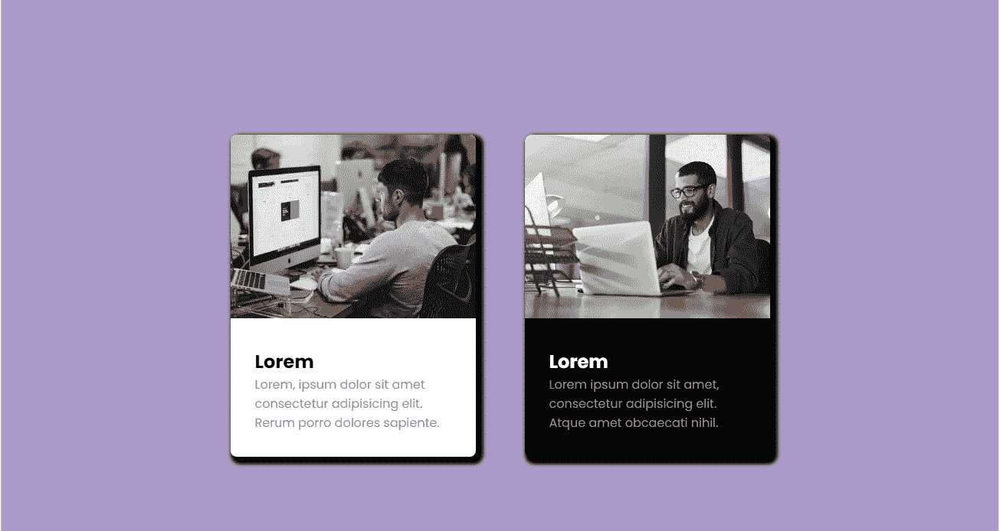
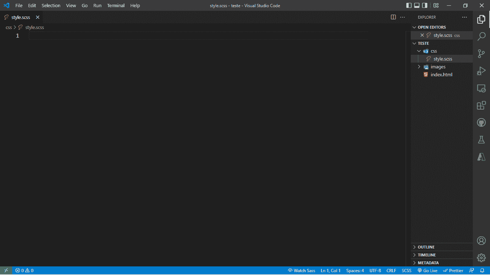
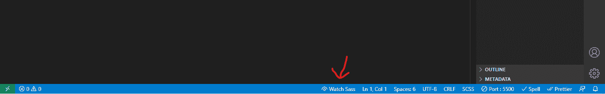
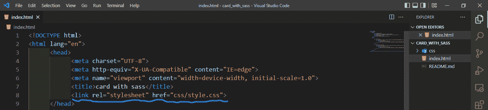
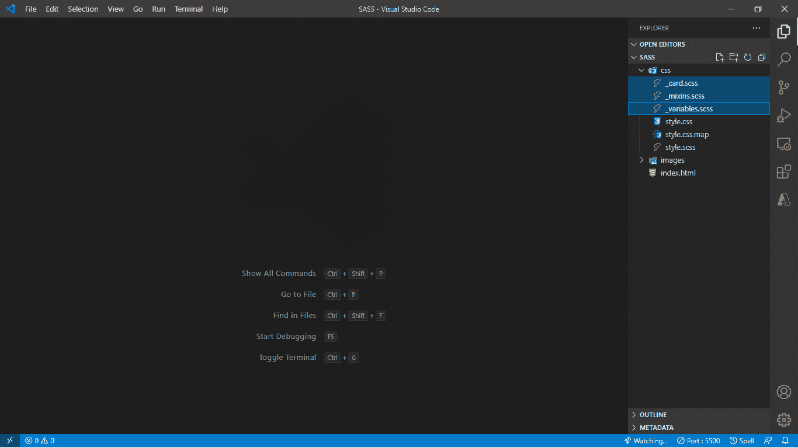
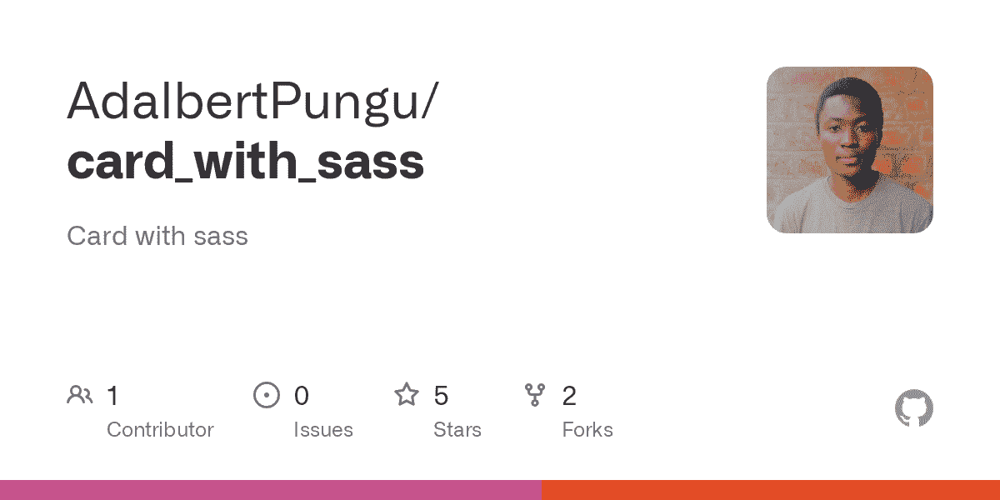

# 如何在 CSS 中使用 Sass

> 原文：<https://www.freecodecamp.org/news/how-to-use-sass-with-css/>

你好。如果你正在阅读这篇文章，你可能正在试图理解 Sass 是什么以及它是如何工作的。

Sass 是一个 CSS 预处理器，它可以帮助您管理大型项目中的任务，在这些项目中，样式表变得越来越大，您有许多行 CSS 代码，并且维护您的 CSS 代码变得很困难。

这就是 Sass 变得有用的地方，因为它具有 CSS 中还不存在的特性，比如嵌套、用 mixins 创建函数、继承等等。这些特性将帮助您编写可维护的 CSS 代码。

Sass 允许你重用你的代码，把它分割成文件，它还可以帮助你创建函数，变量，嵌套你的 CSS 选择器，以及其他快捷方式。

## Sass 如何工作

然而，网络浏览器不理解 Sass 代码——它只理解 CSS 代码。这意味着您必须将 Sass 代码转换为 CSS 代码。

为此，编译器将生成一个包含 CSS 代码的文件。这种转换称为编译。当您在. scss 文件中编写 Sass 代码时，它会被编译成常规的 css 文件，浏览器将使用该文件在网页上显示它。

## 为什么要用 Sass？

使用 Sass 有很多优点，所以现在让我们来看看其中的一些:

第一，如果你懂 CSS 的话，Sass 很好理解。因为它是一个 CSS 预处理器，它的语法是相似的。

同样，如果你使用 Sass，你的 CSS 代码将兼容所有版本的浏览器。

Sass 还可以通过创建可以反复重用的混合变量和函数(分割代码片段)来重用您的代码。这有助于您节省时间，并让您更快地编码。

说到节省时间，Sass 减少了编写 CSS 代码的重复。这要归功于它的功能，比如函数、变量、继承等等。

最后，Sass 被编译成 CSS，并添加了所有必要的供应商前缀，因此您不必担心手动编写它们。

## 如何安装和配置 Sass

在本文中，我将向您展示两种安装 Sass 的方法。

### 如何用 Node.js 安装 Sass

首先，我们将下载并安装节点。然后我们将使用 JavaScript 包管理器 npm 来安装 Sass 并在您的项目中配置它。

我们将进行一次全局安装，因为这将使您在每次计划使用 Sass 的项目中不用安装它。

以下是在项目中安装和设置 Sass 的步骤:

首先，打开您的终端并键入:

```
npm install -g scss 
```

同样，这是全球安装。如果您这样做了，就可以避免每次计划在项目中使用 Sass 时安装它。

然后，在项目文件夹中，创建一个 Sass 文件。

```
style.css 
```

`style`是文件名，`.scss`是 Sass 扩展名。

然后，您将使用以下命令从 SASS 文件生成一个 style.css 文件:

```
sass --watch style.scss style.css
```

`style.scss`是源文件，`style.css`是目标文件，Sass 在其中生成 CSS 代码。

现在安装和配置完成了！您可以在项目中使用 Sass。

但是在我们开始讨论如何使用 Sass 之前，我想向您展示第二种方法。我推荐这种方式，因为这是安装和配置 Sass 最简单、最容易的方式。

### 如何使用 VS 代码安装 Sass

首先，如果你还没有下载并安装微软的 VS 代码编辑器。然后启动编辑器，这样就可以下载实时的 Sass 编译器扩展。


这就是你要做的。一旦安装完成，您就可以在您的项目中使用 Sass 了。很简单，对吧？

## 如何在项目中使用 Sass

为了理解如何使用 Sass，我们将在一个示例项目中创建两个网格。这里的想法并不是要学习关于 Sass 的所有知识，而是你所看到的大部分是你开始使用 Sass 所需要知道的。

这里有一个概述，我们将创建什么来理解 Sass。



你可能想知道为什么我举了网格的例子？嗯，因为我们经常在网页中使用网格，它们很容易理解。

首先，您应该知道我们将在 Sass 文件(style.scss)中而不是在 style.css 文件中进行所有的编码。Sass 会用同样的代码为我们生成一个 CSS 文件。

首先，创建一个包含两个文件夹的文件夹， **CSS** 和**图片**。然后在 CSS 文件夹中创建一个扩展名为 Sass 的文件——在我的例子中是 **style.scss** 。

然后打开它，文件将立即被检测到。在编辑器的下方会出现一个名为 **Watch Sass** 的按钮。只需点击它，告诉 Sass 观看这个文件，并开始在 CSS 文件中生成(编译)代码。



一旦 SASS 完成编译，它将在项目的 CSS 文件夹中创建三个文件: **style.css** 、 **style.scss** 、**和 **style.css.map** 。它跟踪所有的变化，并准备生成 CSS 代码。**

如果您很快回来继续工作，您所要做的就是打开扩展名为. scss 的文件。然后单击 Watch Sass for Sass 开始在 css 文件中生成修改(否则 CSS 文件中不会生成任何内容)。

我希望到目前为止一切顺利。您已经看到了如何在您的项目中安装、配置和开始使用 Sass。所以现在让我们继续我们的网格例子来理解 Sass 带来的不同功能。

## 如何在 Sass 中使用变量

在了解如何创建 Sass 变量之前，创建一个**index.html**文件，将下面的代码复制并粘贴到该文件中:

```
 <!DOCTYPE html>
<html lang="en">
      <head>
            <meta charset="UTF-8">
            <meta http-equiv="X-UA-Compatible" content="IE=edge">
            <meta name="viewport" content="width=device-width, initial-scale=1.0">
            <title>card with sass</title>
      </head>
      <body>

            <div class="card">
                  
                  <div class="card_content">
                        <h2 class="card_title">Lorem</h2>
                        <p class="card_description">Lorem, ipsum dolor sit amet consectetur adipisicing elit. Rerum porro dolores sapiente.</p>
                  </div>
            </div>

            <div class="card card_dark">
                  
                  <div class="card_content">
                        <h2 class="card_title">Lorem</h2>
                        <p class="card_description">Lorem ipsum dolor sit amet, consectetur adipisicing elit. Atque amet obcaecati nihil.</p>
                  </div>
            </div>

      </body>
</html> 
```

在浏览器中运行该文件以查看结果。


Sass 允许您创建变量，但是我想向您展示 Sass 和 CSS 之间的区别。

```
body {
    font-family: 'Poppins', Helvertica, sans-serif;
    background-color: #ab99ca;
    padding: 2rem;
    min-height: 100vh;
    display: flex;
    align-items: center;
    justify-content: center;
} 
```

如果你看这个例子，它是 CSS。但是如果我想在项目中重用任何颜色、填充或字体，我必须重写相同的代码(用 CSS)。

但是使用 Sass，我可以创建变量，这样我就可以重用这些特性。为了在 Sass 中创建一个变量，我们使用美元符号 **$** ，后跟变量名和一个冒号作为值。请记住，最好创建一个反映您要使用的对象的名称。

```
/* Creating and Using Variables */

$fonts: 'Poppins', Helvertica, sans-serif;
$primary-color: #ab99ca;
$spacing: 2rem;

body {
    font-family: $fonts;
    background-color: $primary-color;
    padding: $spacing;
    min-height: 100vh;
    display: flex;
    align-items: center;
    justify-content: center;
} 
```

将上述代码添加到 style.scss 文件中。因为我们正在处理一个 Sass 文件，而 HTML 不识别 Sass，为了查看结果，我们将指定在我们的文件**index.html**中生成的 CSS 文件。

## 如何链接 CSS 文件

将 CSS 文件链接到 index.html，允许 CSS 文件将 CSS 样式应用到 HTML，这非常重要。否则将不会应用样式，您将只能看到 HTML 生成的代码。

因此，我们将链接我们的 CSS 文件在 index.html 文件。就我而言:

```
<link rel="stylesheet" href="css/style.css"> 
```



在浏览器中运行该文件以查看结果。


我们现在将看到如何通过导入来组织代码。当我们继续使用我们的例子时，代码将被切割成文件。

创建文件时，文件名的开头会跟一个下划线(_)，以防止被 Sass 编译。

创建三个文件:

*   `_variables.scss`:添加变量
*   `_mixins.scss`:添加我们将重复使用的功能
*   添加我们卡片的样式



将您在 **style.scss** 文件中创建的变量复制粘贴到`_variables.scss`文件中:

```
 $fonts: 'Poppins', Helvetica, sans-serif;
    $primary-color: #ab99ca;
    $spacing: 2rem;
    $dark-grey: #999; 
```

对于`_mixins.scss`文件，这是我们用 mixins 创建可重用函数的地方。

Mixins 允许你创建可重用的函数。要声明一个函数，你必须输入`@mixin name_fonction { content }`，或者如果你的函数有一个参数，你必须输入`@mixin name_fonction($name_variable) { content }`。

要使用 mixins，您必须通过键入`@include namefunction();`来导入它，这在大型项目中可以节省时间。

将此代码添加到`_mixins.scss`文件中:

```
 @mixin flex-center {
    display: flex;
    align-items: center;
    justify-content: center;
}

/* $radius is the parameter of the function */

@mixin border-radius($radius) {
    -webkit-border-radius: $radius;
    -moz-border-radius: $radius;
    border-radius: $radius;
} 
```

对于`_card.scss`文件，添加以下代码:

```
.card {
    background-color: white;
    width: 20rem;
    overflow: hidden;
    margin: 2rem;
    box-shadow: 5px 5px 5px 5px #000;
    @include border-radius(0.5rem); /* using the mixins function */

    img {
        height: 15rem;
        background-size: cover;
        background-position: center center;
    }

    .card_content {
        padding: $spacing;
    }

    .card_title {
        margin: 0;
        color: black;
    }

    .card_description {
        margin: 0;
        color: $dark-grey;
    }

    &_dark {

        background-color: black;

        .card_title {
            color: white;
        }
    }

} 
```

在上面的代码中，我们使用了**嵌套**和**别名**。嵌套帮助我们简化编写 CSS 样式的方式，并允许我们嵌套 CSS 选择器。

对于别名，您可以使用( **&** )或(**和**)，后跟将恢复父选择器代码的类名。

要使用别名，必须通过键入别名后跟变量名(&_dark)来导入别名。

如果你尝试运行 index.html 文件，什么都不会改变。它不会改变，因为我们已经创建了与 index.html 无关的文件，而我们的 style.sass 文件只生成它所拥有的代码。

为了解决这个问题，我们将把我们创建的所有文件导入 style.sass 文件，这样当 sass 进行监控时，它将生成这些文件的代码。

```
/* file import */
@import 'variables';
@import 'mixins';
@import 'card'; 
```

对于 style.scss 文件，添加上面的代码。style.scss 文件应该如下所示:

```
 /* file import */

@import 'variables';
@import 'mixins';
@import 'card';

body {
    font-family: $fonts; /* variable usage */
    background-color: $primary-color;
    padding: $spacing;
    min-height: 100vh;
    @include flex-center(); /* using the mixins function */
} 
```

在前面的代码中，我将文件( **SASS import** )导入到 style.css 中，以便可以跟踪它们，并在发生更改时生成代码。

在浏览器中运行 index.html 文件来查看结果。


如果您得到了与上面捕获相同的结果，那么恭喜您，您现在已经理解了 Sass 是如何工作的。

这是我们建立的项目的预览链接:[https://adalbertpungu.github.io/card_with_sass/](https://adalbertpungu.github.io/card_with_sass/)

这是 GitHub 资源库的链接:

[GitHub - AdalbertPungu/card_with_sass: Card with sassCard with sass. Contribute to AdalbertPungu/card_with_sass development by creating an account on GitHub.AdalbertPunguGitHub](https://github.com/AdalbertPungu/card_with_sass)

## 结论

在本文中，您通过构建一个简单的照片网格了解了 Sass 的工作原理。在这个小项目中，我们涵盖了许多核心的 Sass 特性，但不是全部。所以我希望你开始在你的项目中使用它来学习更多。

如果你想更深入地了解，你可以查阅相关文档:[https://sass-lang.com/documentation](https://sass-lang.com/documentation)。

本文到此为止。感谢您的阅读！我想你已经准备好尝试使用 Sass 了。

快乐编码。

在推特上关注我:[twitter.com](https://twitter.com/adalbertpungu)/阿达伯特彭古