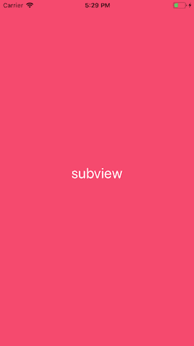
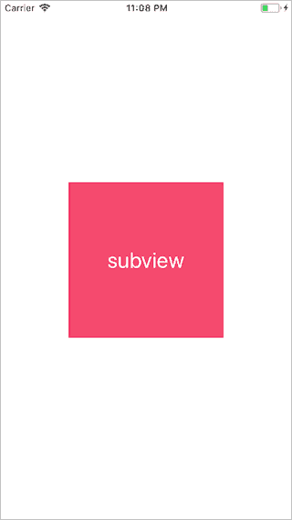
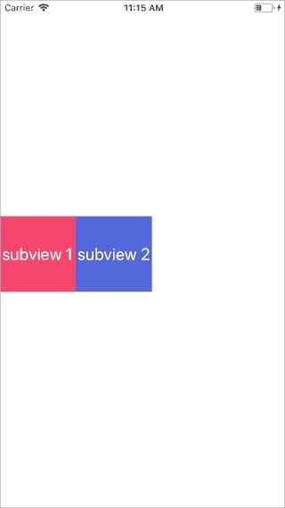
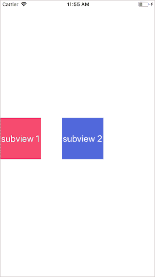
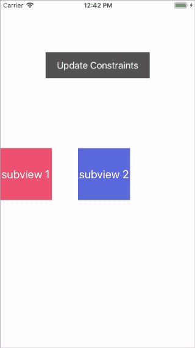
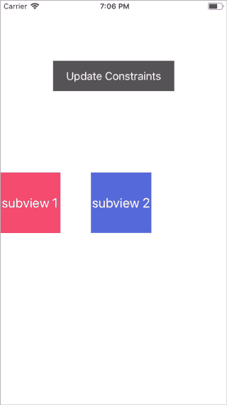
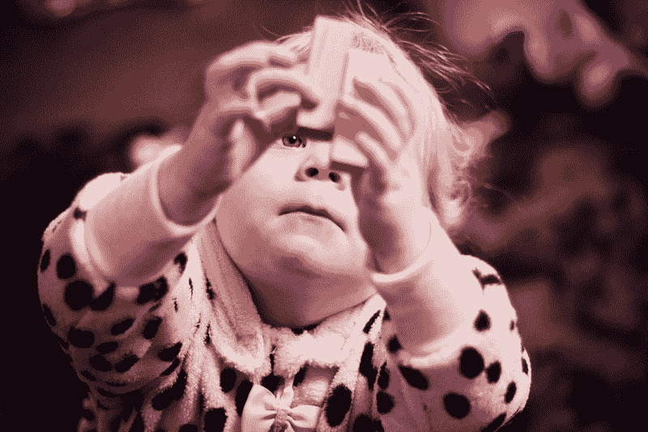

# 如何使用 SnapKit 为 iOS 应用程序以编程方式编写约束

> 原文：<https://www.freecodecamp.org/news/how-to-use-snapkit-to-write-constraints-programmatically-for-ios-apps-ce0a6d9e76cf/>

当我第一次开始用 Xcode 构建应用程序时，我认为故事板很神奇。将子视图拖放到适当的位置是如此简单，我从来不明白没有子视图人们是如何构建视图的。

最终，我决定要成为一名“编程大师”，我需要学习如何以编程方式构造视图。一个问题是，在代码中编写约束是一件痛苦的事情。

```
let horizontalConstraint = NSLayoutConstraint(   item: newView,    attribute: NSLayoutAttribute.centerX,    relatedBy: NSLayoutRelation.equal,    toItem: view,    attribute: NSLayoutAttribute.centerX, multiplier: 1, constant: 0)
```

这是一个水平约束，它将子视图在其超级视图的 X 轴上居中。读起来不容易，更不用说写了，因为每个约束都会很快过时。尽管如此，我想放弃故事板，所以我寻找一个替代方案。这时我发现了 [SnapKit](http://github.com/SnapKit/SnapKit) 。

SnapKit 有一个清晰简洁的 API，使得在代码中编写约束变得轻而易举。我将通过几个非常基本的例子来说明 SnapKit 能做些什么。

我要过去了:

1.  **在其监督视图中布置子视图**
2.  **布置彼此相关的子视图**
3.  **更新约束并制作动画**

#### 入门指南

确保在项目中下载 SnapKit。我使用第三方库的 Cocoapods。

将`pod 'SnapKit'`添加到您的 Podfile 并运行`pod install`。现在把`import SnapKit`写在你想用它的文件的顶部。

#### 在其超级视图中布置子视图

首先，我将把一个子视图固定到它的超级视图的边缘:

```
let subview = UIView()view.addSubview(subview)
```

```
subview.snp.makeConstraints { (make) in    make.top.equalTo(view)    make.bottom.equalTo(view)    make.left.equalTo(view)    make.right.equalTo(view)}
```

这将把子视图的上、下、左、右边缘的约束设置为其子视图的相应边缘，常量为 0。



The subview pinned to its superview’s edges with a constant of 0

请注意，在设置子视图的约束之前，我将子视图添加到了超级视图中。如果您为还没有添加到 superview 中的视图编写约束，那么当视图加载时，它将抛出一个致命的运行时错误。

SnapKit 语法已经比标准库可读性强了很多，但还可以缩短。SnapKit 提供了一种更简洁的方法来将视图约束到其超级视图的边缘:

```
let subview = UIView()view.addSubview(subview)
```

```
subview.snp.makeConstraints { (make) in    make.top.bottom.left.right.equalTo(view)}
```

这将按照与上面代码相同的方式布局我的子视图，但是用一行而不是四行。

我还可以限制子视图的大小。下面，我将设置子视图的高度和宽度，并将其设置在其超级视图的中心:

```
subview.snp.makeConstraints { (make) in    make.width.equalTo(200)    make.height.equalTo(200)    make.centerX.equalTo(view)    make.centerY.equalTo(view)}
```



这个例子很简单，但是我重复了很多次。当设置具有相同值的约束时，SnapKit 允许我将约束链接在一起，如下所示:

```
subview.snp.makeConstraints { (make) in    make.width.height.equalTo(200)    make.centerX.centerY.equalTo(view)}
```

该程序块将产生与上述相同的约束。这是 SnapKit 帮助编写更简洁代码的另一种方式。

#### 布置彼此相关的子视图

当向一个视图中添加许多子视图时，您可能希望子视图的布局相互关联。在本例中，我将:

1.  添加`subview1`,并将其限制在其超级视图的左边
2.  添加`subview2`并将其约束到`subview1`的右边缘

```
let subview1 = UIView()let subview2 = UIView()view.addSubview(subview1)view.addSubview(subview2)
```

```
subview1.snp.makeConstraints { (make) in    make.width.height.equalTo(100)    make.left.equalTo(view)}
```

```
subview2.snp.makeConstraints { (make) in    make.width.height.equalTo(subview1)    make.left.equalTo(subview1.snp.right)}
```

到目前为止，我一直希望我的约束等于相对视图的相应约束。例如，在`make.left.equalTo(view)`中，SnapKit 将`subview1`的`left`设置为`view`的`left`。如果我没有另外指定，SnapKit 将自动匹配我设置的约束。

对于`subview2`的`left`约束，我想设置为`subview1`的`right`边。如果我写`make.left.equalTo(subview1)`，SnapKit 会将`subview2`的`left`边沿设置为`subview1`的`left`边沿。相反，我使用通过写`subview1.snp.right`获得的`subview1`的`right`边缘。

如上所示，我可以通过添加`snp`来访问视图布局的任何约束。



subview 2 is constrained to the right of subview 1 with a constant of 0

现在我已经将`subview2`放在了`subview1`的右边，我将通过给`subview2`添加一个**偏移量**来在它们之间创建一些空间。

```
subview2.snp.makeConstraints { (make) in    make.width.height.equalTo(subview1)    make.left.equalTo(subview1.snp.right).offset(50)}
```

可以在任何`equalTo()`的末尾附加一个偏移量，以改变该约束的常数。现在`subview2`在其`left`约束上将有一个常量 50。



subview 2 is now constrained to subview 1 with a constant of 50

#### 更新约束并制作动画

如果你想让你的应用成为人人皆知的#NextBigThing，你需要增加一点天赋！SnapKit 提供了一种轻松更新约束以创建动态视图的方法。

用 SnapKit 更新约束几乎等同于添加新约束。这里，我将通过将`left`边约束的常数从 0 更改为 50 来更新上一个示例中的`subview1`的约束:

```
subview1.snp.updateConstraints { (make) in   make.left.equalTo(50)}
```

就是这样！当代码块运行时，我的子视图将更新到新的约束。



Clicking the button updates subview1’s constraints

你可能注意到当我更新`subview1`时`subview2`移动了，即使我没有更新它的约束。`subview2`被约束在`subview1`的右边缘。当`subview1`被移动时，`subview2`将继续遵守它与`subview1`的左约束。

现在我将添加一个动画来平滑过渡。如果您以前曾经制作过视图动画，那么这个语法应该很熟悉:

```
UIView.animate(withDuration: 0.3) {    subview1.snp.updateConstraints { (make) in        make.left.equalTo(50)    }        self.view.layoutIfNeeded()}
```

当对我的约束进行动画更新时，我需要对子视图的父视图调用`layoutIfNeeded()`。如果我一次制作多个视图的动画，我需要在子视图最近的公共超级视图上调用`layoutIfNeeded()`。



`updateConstraints()`只能更新现有的约束。试图更新一个不存在的约束将导致致命的运行时错误。

如果你想给你的子视图添加新的约束，使用`remakeConstraints()`。`**remakeConstraints()**` **将删除您在该子视图**上设置的任何现有约束，并允许您添加新的约束。

您也可以使用`deactivate()`删除一个约束。下面我使用`deactivate()`创建、设置并移除一个约束:

```
var constraint: Constraint!let subview = UIView()
```

```
subview.snp.makeConstraints { (make) in    constraint = make.height.equalTo(100).constraint}
```

```
constraint.deactivate()
```

也可以通过在动画块中取消激活约束来激活约束的移除。

所以现在你是编程编写约束的大师了。故事板现在看起来就像一个笑话，没有理由再回到过去，对吗？



How it feels building storyboards after reading this guide

不完全是。故事板和笔尖仍然是组装视图控制器的最快方式，而且，如果你与非开发人员一起工作，它们是展示应用程序外观的最佳方式，而无需发送测试版。

我个人两个都用。在我构建的最后一个应用中，我用 SnapKit 在代码中添加了约束，并在故事板和笔尖上使用自动布局，有时在同一视图上。最后，您必须决定哪一个最适合您正在构建的视图。

非常感谢您的阅读！如果你喜欢这个故事，请在 [Twitter](https://twitter.com/JakeShelley3) 上关注我，我在那里发布关于产品管理、工程和设计的文章。