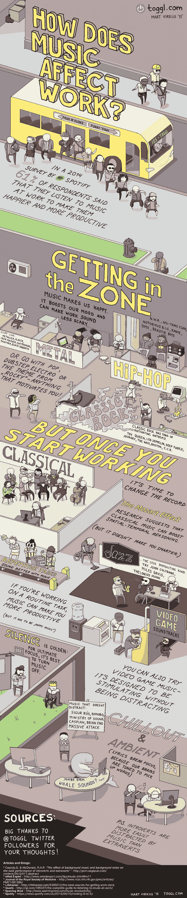

# 如何使用 Anki 的间隔重复来更快地学习编码

> 原文：<https://www.freecodecamp.org/news/how-to-use-spaced-repetition-with-anki-to-learn-to-code-faster-3cca37644927/>

这里有三个值得你花时间的链接:

1.  如何使用 Anki 的间隔重复学习编码更快( [10 分钟阅读](http://bit.ly/2k9TsA8))
2.  加密软件可能失败的许多许多方式( [8 分钟读取](http://bit.ly/2jFLoZj)
3.  Zenimax 成功起诉 Oculus VR，索赔 5 亿美元。以下是 Oculus VR 首席技术官约翰·卡马克对专家证人关于“非文字复制”代码的观点的评论

额外收获:外面很冷！所以，今天就去我们社区的商店买一件温暖的 freeCodeCamp 连帽衫吧[。](http://bit.ly/2k9Sns8)

### 想到这一天:

> “今天的大多数软件非常像一座埃及金字塔，数百万块砖层层叠叠，没有结构完整性，只是靠蛮力和数千名奴隶完成的。”—艾伦·凯

### 每日一图:

音乐如何影响工作？([来源](http://bit.ly/2kALZLg))

编码快乐！

–昆西·拉森，自由代码营的老师