# 如何使用 Spark 集群并行处理大数据

> 原文：<https://www.freecodecamp.org/news/how-to-use-spark-clusters-for-parallel-processing-big-data-86a22e7f8b50/>

作者:哈里·桑塔南

# 如何使用 Spark 集群并行处理大数据

#### 使用 Apache Spark 的弹性分布式数据集(RDD)和数据块


Star clusters-Tarantula Nebula

由于物理限制，单个计算机处理器在目前的设计中已经很大程度上达到了速度上限。因此，硬件制造商在主板上增加了更多的处理器(并行 CPU 内核，以相同的速度运行)。

但是……过去几十年中编写的大多数软件应用程序并不是为并行处理而编写的。

此外，由于可以收集特定数据(如温度、声音、速度等)的廉价设备，数据收集已经呈指数级增长。

为了以更有效的方式处理这些数据，需要更新的编程方法。

计算进程的集群类似于一组工作人员。一个团队可以比一个人工作得更好、更有效率。他们集中资源。这意味着他们共享信息，分解任务，收集更新和输出，以得出一组结果。

正如农民从在一片土地上工作到使用联合收割机和拖拉机高效地从更大和更多的农场生产粮食，农业合作社使加工更容易一样，集群共同努力处理更大和更复杂的数据收集和处理。

集群计算和并行处理是答案，今天我们有了 Apache Spark 框架。Databricks 是一个统一的分析平台，用于以简单易行的方式启动 Spark 集群计算。

#### 什么是火花？

Apache Spark 是一个用于大数据和机器学习的闪电般快速的统一分析引擎。它最初是由加州大学伯克利分校开发的。

火花很快。它利用了内存计算和其他优化。它目前保持着大规模磁盘排序的记录。

Spark 使用弹性分布式数据集(RDD)来跨集群或计算机处理器执行并行处理。

它有易于使用的 API，可以在各种编程语言中操作大型数据集。它还有用于转换数据的 API，以及用于操作半结构化数据的常见数据框架 API。

基本上，Spark 使用集群管理器来协调计算机集群的工作。集群是一组相互连接并相互协调以处理数据和计算的计算机。

Spark 应用程序由驱动程序进程和执行器进程组成。

简而言之，驱动程序进程运行主函数，并在执行器之间分析和分配工作。执行器实际上执行分配的任务——执行代码并向驱动程序节点报告。

在商业和新兴人工智能编程的现实世界应用中，并行处理正成为效率、速度和复杂性的必要条件。

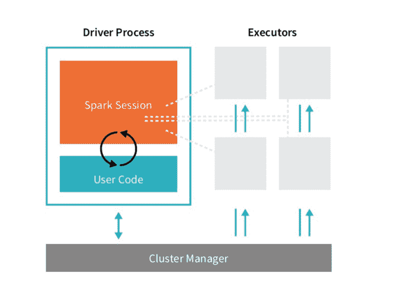

Image credit: Databricks — Apache Spark v2.pdf

#### 太好了——那么什么是数据块呢？

Databricks 是一个统一的分析平台，来自 Apache Spark 的创建者。它可以在几分钟内轻松启动云优化的 Spark 集群。

可以把它想象成一个编写代码的一体化包。你可以使用 Spark(不用担心底层细节)并产生结果。

它还包括可以共享的 Jupyter 笔记本，以及提供 GitHub 集成，连接到许多广泛使用的工具和自动化监控，调度和调试。更多信息见[此处](https://databricks.com)。

您可以免费注册社区版。这将允许你玩火花簇。根据计划，其他优势包括:

*   在 AWS 和 Azure CPU 和 GPU 实例上几秒钟内启动并运行集群，以实现最大的灵活性。
*   快速入门，即时集成 TensorFlow、Keras 及其对 Databricks 集群的依赖。

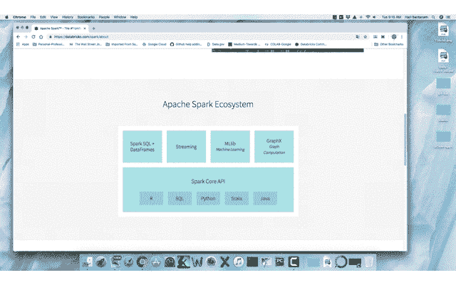

Gif is mine, from Spark Architecture-Image: [https://databricks.com/spark/about](https://databricks.com/spark/about)

让我们开始吧。如果您之前已经使用过数据块，请跳到下一部分。否则，你可以在这里注册[，选择‘社区版’免费试用。](https://databricks.com/)

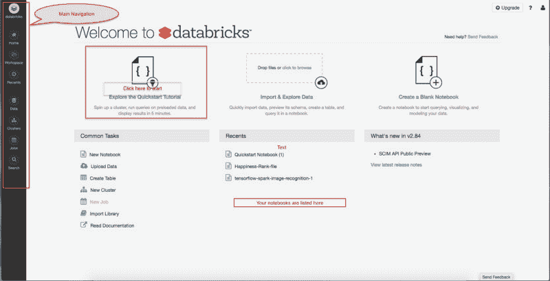

Main databricks screen-start with the Quickstart Tutorial, upper left

按照那里的指示走。它们清晰、简洁、简单:

*   创建一个集群
*   将笔记本电脑连接到群集，并在群集上运行笔记本电脑中的命令
*   处理数据并创建图表
*   Python DataFrame API 上的操作；从数据块数据集创建数据框架
*   处理数据并显示结果

现在，您已经在集群上创建了一个数据程序，让我们转到另一个数据集，进行更多的操作，这样您就可以有更多的数据。

该数据集是根据不同因素(如 GDP、慷慨度、信任度、家庭和其他因素)编制的 2017 年世界幸福报告。这些字段及其描述将在文章的后面列出。

我之前下载了数据集，然后通过简单地拖放到 Databricks 的窗口中，将它移动到 DataBricks 的 DBFS (DataBricks 文件系统)中。

或者，您可以单击左侧导航窗格中的数据，单击添加数据，然后拖放或浏览并添加。

```
# File location and type#this file was dragged and dropped into Databricks from stored #location; https://www.kaggle.com/unsdsn/world-happiness#2017.csv 
```

```
file_location = "/FileStore/tables/2017.csv"file_type = "csv"
```

```
# CSV options# The applied options are for CSV files. For other file types, these # will be ignored: Schema is inferred; first row is header - I # deleted header row in editor and intentionally left it 'false' to #contrast with later rdd parsing, #delimiter # separated, #file_location; if you don't delete header row, instead of reading #C0, C1, it would read "country", "dystopia" etc.infer_schema = "true"first_row_is_header = "false"delimiter = ","df = spark.read.format(file_type) \  .option("inferSchema", infer_schema) \  .option("header", first_row_is_header) \  .option("sep", delimiter) \  .load(file_location)
```

```
display(df)
```

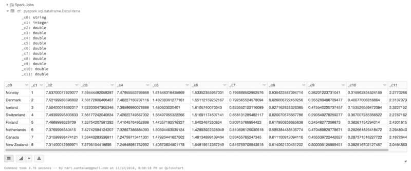

Code output showing schema and content

现在，让我们将文件加载到前面提到的 Spark 的弹性分布式数据集(RDD)中。RDD 跨集群或计算机处理器执行并行处理，使数据操作更快、更高效。

```
#load the file into Spark's Resilient Distributed Dataset(RDD)data_file = "/FileStore/tables/2017.csv"raw_rdd = sc.textFile(data_file).cache()#show the top 5 lines of the fileraw_rdd.take(5)
```

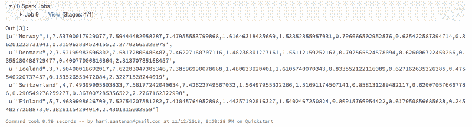

Output from RDD. Note the Spark Jobs / stages on top

请注意下面的“火花作业”，就在输出的上方。单击“View”查看详细信息，如右侧的插图窗口所示。

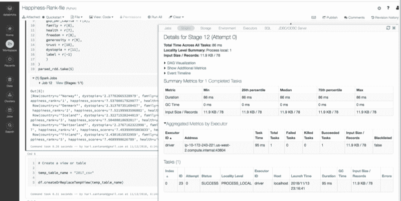

Databricks 和 Sparks 对过程进行了出色的可视化。

在 Spark 中，一个作业与一系列 RDD 依赖关系相关联，这些依赖关系组织在一个有向无环图(DAG)中。在 DAG 中，分支从一个节点指向另一个节点，没有环回。任务被提交给调度器，调度器使用流水线来执行它们，以优化工作并转换成最小的阶段。

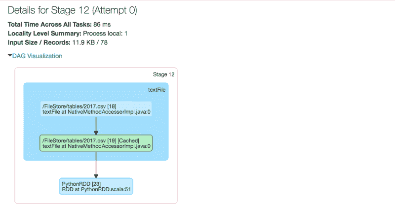

Spark RDD job sequence illustrated by DAG graph

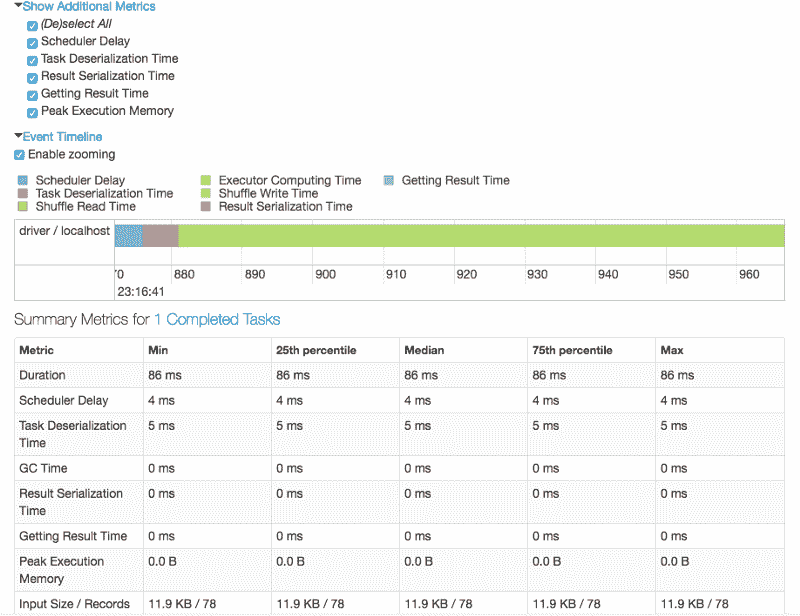

Metrics for tasks processed with RDD

如果以上项目看起来很复杂，也不用担心。在您按下 Spark Job view 按钮的特定阶段，会有流程的可视快照。你可能需要也可能不需要这些信息——如果你需要，它们就在那里。

RDD 条目由逗号分隔，我们需要在解析和构建数据帧之前拆分逗号。然后，我们将从数据集中选取特定的列来使用。

```
#split RDD before parsing and building dataframecsv_rdd = raw_rdd.map(lambda row: row.split(","))#print 2 rowsprint(csv_rdd.take(2))#print typesprint(type(csv_rdd))print('potential # of columns: ', len(csv_rdd.take(1)[0]))
```

```
#use specific columns from dataset
```

```
from pyspark.sql import Row
```

```
parsed_rdd = csv_rdd.map(lambda r: Row(    country = r[0],   #country, position 1, type=string    happiness_rank = r[1],    happiness_score = r[2],    gdp_per_capita = r[5],    family = r[6],    health = r[7],    freedom = r[8],    generosity = r[9],    trust = r[10],    dystopia = r[11],    label = r[-1]    ))parsed_rdd.take(5)
```

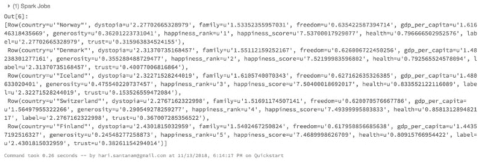

Output from the parsed RDD

以下是幸福数据集的列和定义:

快乐数据集列和定义

国家——国家的名称。

地区—国家所属的地区。

幸福排名——根据幸福指数对国家进行排名。

幸福分数——2015 年通过向被抽样的人提出问题来衡量的一个指标:“在 0 到 10 的范围内，你如何评价你的幸福，其中 10 是最幸福的。”

经济(人均 GDP)——GDP(国内生产总值)对幸福指数计算的贡献程度

家庭——家庭对幸福指数计算的贡献程度

健康—(预期寿命)预期寿命对幸福指数计算的贡献程度

自由——自由对幸福分数计算的贡献程度。

信任—(政府腐败)对腐败的感知对幸福得分的影响程度。

慷慨度——慷慨度在计算幸福分数时的贡献程度。

反乌托邦残余——反乌托邦残余对幸福分数计算的贡献程度(反乌托邦=想象中的地方或状态，其中一切都令人不快或糟糕，通常是极权主义或环境退化的地方或状态。剩余——所有东西都被计算或取走后剩下的东西。

```
# Create a view or table
```

```
temp_table_name = "2017_csv"
```

```
df.createOrReplaceTempView(temp_table_name)
```

```
#build dataframe from RDD created earlierdf = sqlContext.createDataFrame(parsed_rdd)display(df.head(10)#view the dataframe's schemadf.printSchema()
```

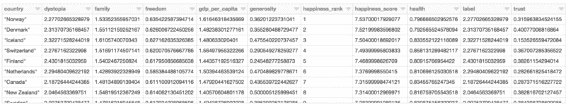

Dataframe output-compare with previous table output in screenshot way above.

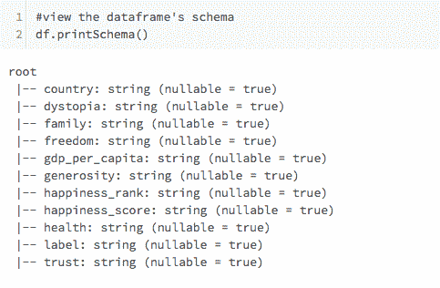

Print df schema output

```
#build temporary table to run SQL commands#table only alive for the session#table scoped to the cluster; highly optimizeddf.registerTempTable("happiness")#display happiness_score counts using dataframe syntaxdisplay(df.groupBy('happiness_score')          .count()          .orderBy('count', ascending=False)       )
```

```
df.registerTempTable("happiness")
```

```
#display happiness_score counts using dataframe syntaxdisplay(df.groupBy('happiness_score')          .count()          .orderBy('count', ascending=False)       )
```

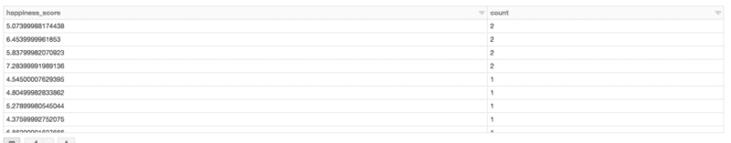

Output of running dataframe display command on temp table

现在，让我们使用 SQL 运行一个查询来做同样的事情。目的是向您展示处理数据的不同方法，并对这些方法进行比较。

```
#use SQL to run query to do same thing as previously done with dataframe (count by happiness_score)happ_query = sqlContext.sql("""                        SELECT happiness_score, count(*) as freq                        FROM happiness                        GROUP BY happiness_score                        ORDER BY 2 DESC                        """)display(happ_query)
```

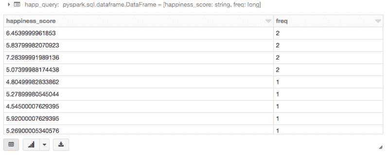

SQL query output-count by happiness score

练习数据处理的另一个 SQL 查询:

```
#another sql queryhapp_stats = sqlContext.sql("""                            SELECT                              country,                              happiness_rank,                              dystopia                            FROM happiness                            WHERE happiness_rank > 20                            """)display(happ_stats)
```

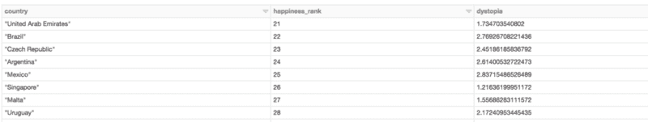

Output from the last SQL query

那里！您已经做到了——创建了一个 Spark 驱动的集群，并使用该集群完成了一个数据集查询过程。您可以将它用于您自己的数据集，以处理和输出您的大数据项目。

您还可以使用图表——单击任何输出底部的图表/图形图标，指定图形的值和类型，看看会发生什么。这很有趣。

代码发布在 Databricks 公共论坛的笔记本[这里](https://databricks-prod-cloudfront.cloud.databricks.com/public/4027ec902e239c93eaaa8714f173bcfc/3359023939916891/786783084190303/6450208345118766/latest.html)中，根据 Databricks，将在大约 6 个月内可用。

*   要了解更多关于深度学习使用 Sparks 的信息，请阅读[法维奥·巴斯克斯](https://www.freecodecamp.org/news/how-to-use-spark-clusters-for-parallel-processing-big-data-86a22e7f8b50/undefined)的这篇优秀文章

感谢阅读！我希望你有关于 Databricks 的有趣的程序，并且和我一样喜欢它。如果你觉得它有趣或有用，请鼓掌。

要查看我的文章的完整列表，请点击查看[。](https://medium.com/@hari.santanam)