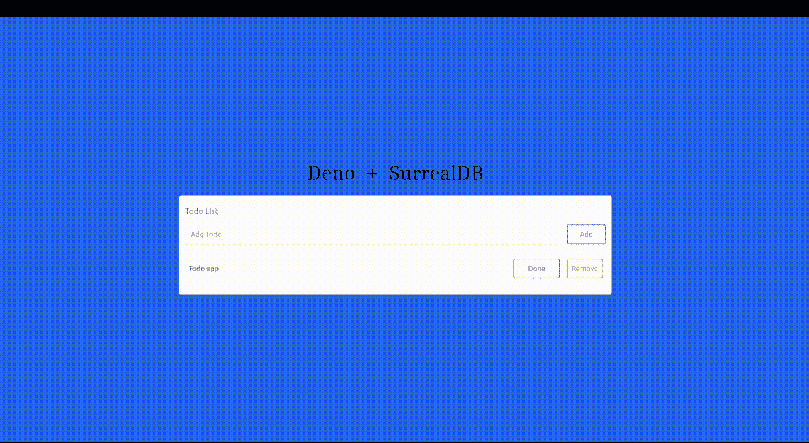
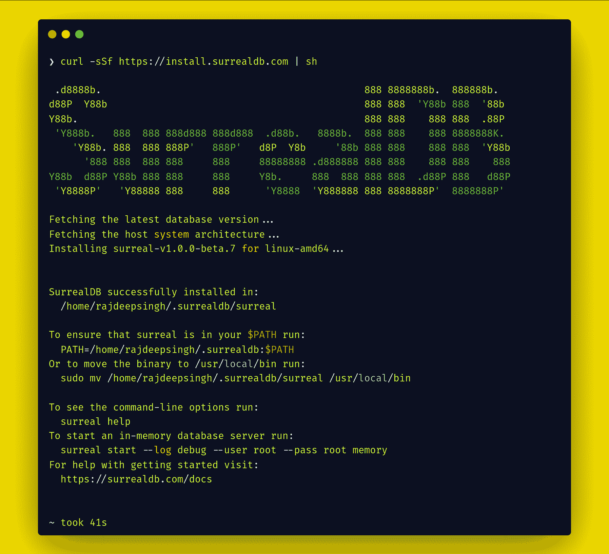
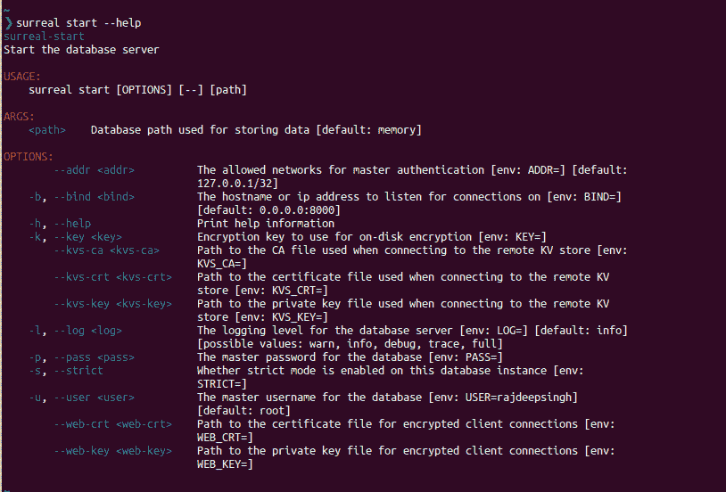
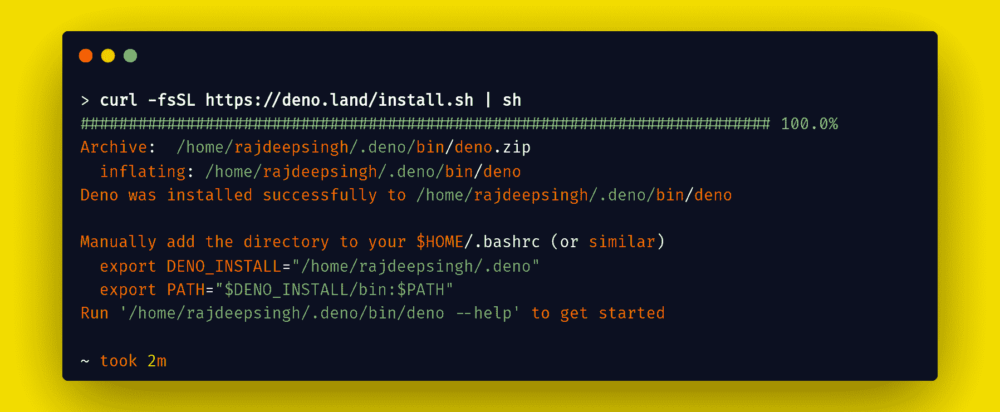
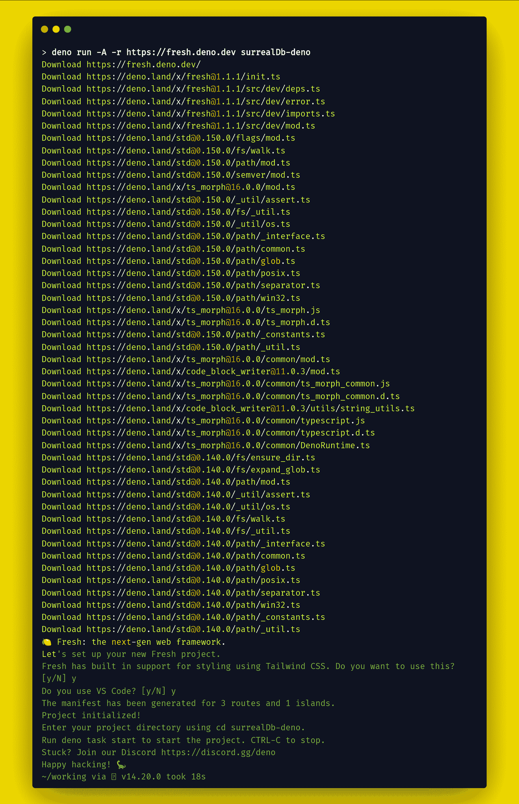
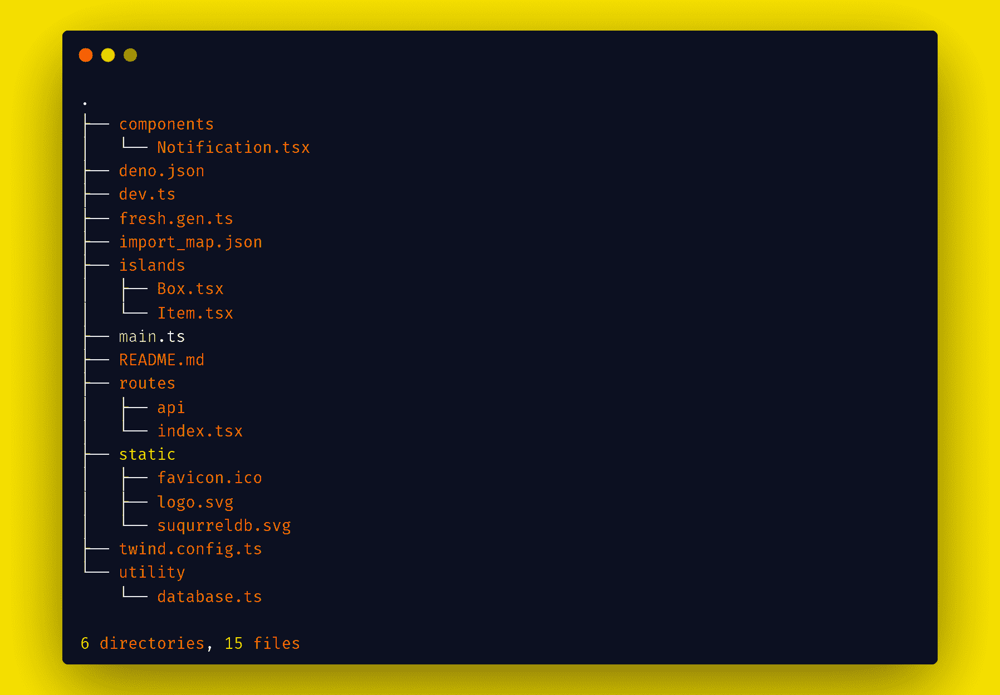
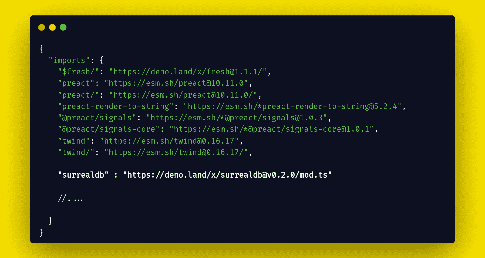
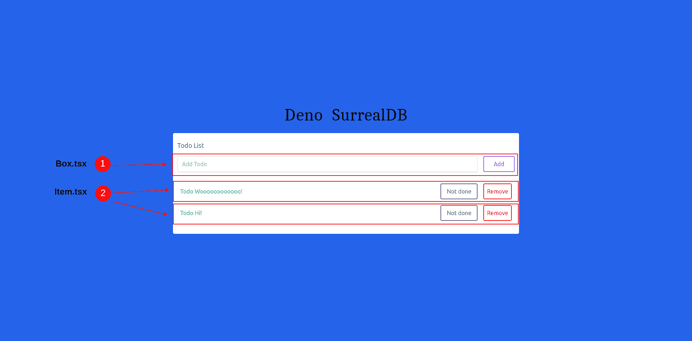
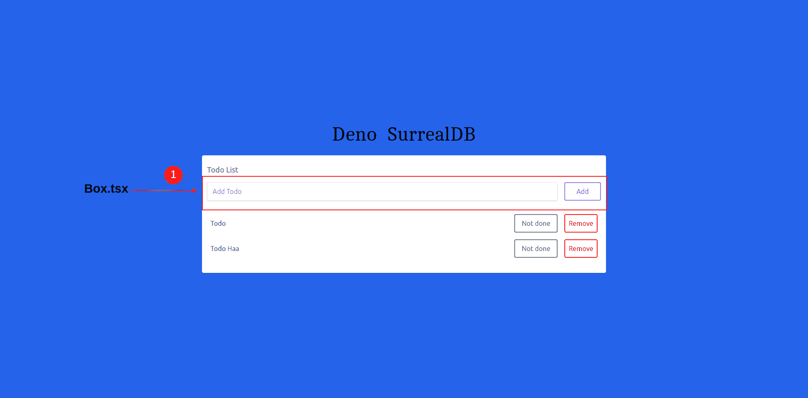
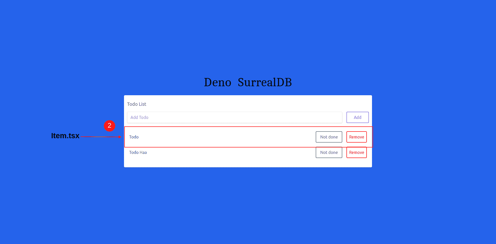

# 如何将超现实数据库与 Fresh Framework 和 Deno 一起使用

> 原文：<https://www.freecodecamp.org/news/how-to-use-surrealdb-with-fresh-framework/>

超现实数据库是一个新推出的数据库，最近开始在编程界流行起来。

超现实数据库是用 Rust 语言构建的，由托比·摩根·希区柯克和 T2·杰米·摩根·希区柯克创建。

超现实数据库的新数据库有许多特性，但我最感兴趣的是 [Deno 超现实数据库](https://surrealdb.com/docs/integration/libraries/deno)库。

在本文中，我们将使用 [Fresh framework](https://fresh.deno.dev/) 和超现实数据库创建一个简单的 todo 应用程序。我们将使用新的框架来构建带有超现实数据库的 API。

Fresh 框架是 Deno 自己引入的一个新的 JavaScript 框架。Fresh 使用 [Preact 库](https://preactjs.com/)来设计和构建组件。Fresh 带有内置的 TypeScript 和 Tailwind CSS 支持以及基于**岛的**架构。也不需要任何配置。

Deno 和 Fresh】生产就绪。因此，您可以构建任何 web 应用程序，只需一次单击即可部署。但是要记住，超现实 DB 可能不是。根据他们的文档，超现实数据库已经可以生产了，但是文档在这个问题上不是很清楚。

所有的代码都可以在 GitHub 上找到。

### 这是我们将要构建的演示:



TODO Application demo 

## 如何安装超现实数据库、Deno 和 Fresh 框架

本教程有三个要求:第一个是安装了 **Deno** ，第二个是安装了**超现实数据库**、**T5，最后一个是使用新的框架。**

首先，我们将用 Deno 安装[超现实数据库](https://surrealdb.com/)和[新鲜框架](https://fresh.deno.dev/)。如果你已经安装了 Deno 和超现实 DB 包，你可以跳过这一部分。

### 如何在 Linux 上安装超现实数据库

SurreadDB 的安装过程对所有操作系统来说都非常简单。例如，在 Linux 中，您可以用一个 curl 命令安装数据库。

如果你有不同的操作系统，我建议阅读[超现实数据库安装](https://surrealdb.com/install)文档。

在 Linux 中，使用以下命令:

```
curl -sSf https://install.surrealdb.com | sh
```

Install surrealDB in Linux



Install the SurrealDB database in Linux.

要在 Linux 中启动超现实数据库，请运行以下命令:

```
surreal start --log debug --user root --pass root memory
```

Run surreal database in Linux

1.  您使用`--user`标志作为您的用户名。在我的例子中，我的用户名是 root。
2.  您使用`--pass`标志作为您的密码。在我的例子中，我的密码是 root。

要了解关于所有标志或选项的更多信息，请运行`surreal start --help`命令。这是你将会看到的:



现在您已经准备好使用超现实数据库了。

### 如何在 Linux 上安装 Deno

Deno 是一个较新的 JavaScript 运行时环境。与 Node.js 相比，它既快又安全。

要了解更多关于 Deno 的知识，你可以[阅读我在 freeCodeCamp 上找到的由 Brian Barrow 写的这个有用的教程](https://www.freecodecamp.org/news/intro-to-deno/)。

要在 Linux 上安装 Deno，您需要一个命令:

```
curl -fsSL https://deno.land/install.sh | sh
```

Install deno in Linux



Install deno in Linux

### 如何用 Deno 安装新的框架

Fresh 是一个基于 Deno 的新的 JavaScript 框架。默认情况下，新框架支持 TypeScript。此外，默认情况下，Fresh 向客户端发送零 DB 的 JavaScript。

您可以使用以下命令设置一个新项目:

```
deno run -A -r https://fresh.deno.dev my-new-fresh-project
```

Install deno with a fresh framework



您可以使用`deno task start`运行本地开发服务器。

**注意**Fresh 框架和超现实数据库使用相同的`8000`端口。在超现实数据库中，我没有找到任何关于端口更改的文档。但是在 Fresh 中，你可以很容易地在`main.ts`文件中改变端口。然后，在不更改端口的情况下，您的新本地主机重定向超现实数据库本地主机。

例如，您可以像这样更改 Fresh 中的端口:

```
// change port in main.ts

await start(manifest, { port:3002, plugins: [twindPlugin(twindConfig)] }); 
```

Important step 

## 新的框架项目结构

项目文件夹结构非常简单。对于这个项目，我们必须遵循文件夹和文件结构，用超现实数据库创建一个待办事项 app。



File and folder structure

让我们在这里进一步讨论一些基本文件:

1.  components 文件夹有助于包含使用 Preact 构建的所有自定义组件。
2.  在`deno.json`文件中，添加任务和 importMap 文件。任务类似于 Node 中的脚本，在 importMap 部分，传递一个 JSON 文件，其中包含来自 Deno 的所有导入包。
3.  `dev.ts`是一个仅为开发而创建的文件。
4.  `fresh.gen.ts`根据`dev.ts`自动生成并更新**。它包括所有路线、岛屿和其他配置。**
5.  **`import_map.json`文件包含运行项目所需的所有包的导入。**
6.  **孤岛在 Fresh 中支持客户端基于浏览器的交互性。基本上，使用 island 文件夹，您将 JavaScript 发送到浏览器。默认情况下，Fresh 框架发送零 KB 的 JavaScript。**
7.  **`main.ts`是帮助您启动应用程序的主要入口点。**
8.  **`routes`文件夹处理你的路径和 API。它类似于 Next.js pages 文件夹。**
9.  **`static`文件夹包含根目录下的所有静态文件，如 JavaScript、图像和字体。所有这些都是通过引用访问的，并以基本 URL ( `/`)开始。例如，`/logo.svg`。**
10.  **`twind.config.ts`配置顺风 CSS**
11.  **`utility`文件夹包含数据库配置。**

**可以从 Fresh 的[官方文档](https://fresh.deno.dev/docs/getting-started/create-a-project)了解更多文件夹结构。**

**同样，要运行本地开发服务器，使用命令`deno task start`。**

## **如何在 Fresh 框架中安装超现实数据库库**

**你需要基于 Deno 的[超现实数据库 librar](https://surrealdb.com/docs/integration/libraries/deno) y(模块)。这是由超现实数据库团队创建的超现实数据库库。**

**超现实数据库库(模块)帮助您将应用程序连接到数据库。超现实数据库模块可以非常容易地连接本地和远程数据库。**

**要在新框架中安装超现实数据库模块，只需复制以下代码并粘贴到`import_map.json`文件中:**

```
 `"surrealdb" : "https://deno.land/x/surrealdb@v0.2.0/mod.ts"`
```

**copy following code**

**

Paste the following code into `import_map.json file`** 

### **如何在 Fresh 中设置超现实数据库**

**第一步是为超现实数据库创建一个安装文件。安装文件帮助您将新框架连接到超现实数据库。**

**在我的例子中，我在一个单独的`utility/database.ts`文件中创建了一个数据库设置。单独的文件有助于减少代码，并且更易于管理。**

```
`// utility/database.ts

//  import surrealdb 
import Surreal from "surrealdb";

// load Environment Variables
import "https://deno.land/x/dotenv@v3.2.0/load.ts";

// get DATABASE_URL url
const domain = Deno.env.get("DATABASE_URL")

// surreal database
const db = new Surreal(domain);

// signin
await db.signin({
    user: 'root',
    pass: 'root',
});

//  Select a specific namespace /  database
await db.use('test', 'test');

export default db`
```

**setup for database**

**要连接数据库，请确保您的数据库正在运行，并且您的口令和用户名与您的数据库条件相匹配。**

**例如，运行与您的`utility/database.ts`文件中相同的本地超现实数据库用户名和密码。**

```
`surreal start --log debug --user root --pass root memory`
```

## **如何使用超现实数据库模块(库)方法**

**超现实数据库模块带有内置的方法。所有这些方法都有助于在超现实数据库上执行凝乳操作。这些方法允许你**快速创建**，**获取**，**更新**，**从数据库中删除**东西。**

**在本文中，我们将使用四种方法，即`create()`、`update()`、`delete()`和`select()`。**

**超现实数据库还提供了其他方法，您可以在[超现实数据库模块文档页面](https://surrealdb.com/docs/integration/libraries/deno)上了解这些方法。**

### **如何创建 API 端点**

**要创建 Todo 应用程序，您需要四个端点。我们将使用新的框架来创建 API。所有的 API 路径都放在`routes/api`文件夹中。**

1.  **得到**
2.  **邮政**
3.  **Isdone(更新)**
4.  **删除**

### **获取 API**

**Get API 允许您显示 todo 表中的所有数据。要访问 Todo 表中的所有数据，您需要一个由超现实数据库模块提供的`select()`函数。**

```
`import { HandlerContext } from "$fresh/server.ts";
import db from "../../utility/database.ts";

export async function handler(_req: Request, _ctx: HandlerContext) {

    try {
        // get all todo list
        const todo = await db.select("todo");

        // return todo 
        return Response.json(JSON.stringify(todo))

    } catch (error) {

        return new Response(error);
    }

}`
```

**Get all todo from the todo table.**

### **发布 API**

**在 Post API 中，您将基于标题创建一个新的 todo。所有待办事项都保存在待办事项表中。使用 get API，您可以从 todo 表中访问所有 todo。**

**要在数据库中创建一个新的 todo 项，可以使用超现实数据库模块的内置`create()`函数。**

```
`import { HandlerContext } from "$fresh/server.ts";

// import module uuid from deno 
import * as mod from "https://deno.land/std@0.156.0/uuid/mod.ts";

// import database 
import db from "../../utility/database.ts";

export async function handler(_req: Request, _ctx: HandlerContext) {
    // get url
    const url = new URL(_req.url);

    // get title from url
    const title = url.searchParams.get("title") || "";

    try {

        // Create a new person with a random id

        const NAMESPACE_URL = "6ba7b810-9dad-11d1-80b4-00c04fd430c8";

        // create a unique uuid for demo purposes
        const uuid = await mod.v5.generate(NAMESPACE_URL, new TextEncoder().encode("python.org"));

        // create new data based on value
        const created = await db.create("todo", {
            uuid: uuid,
            title: title,
            isDone: false
        });

        // return data
        return Response.json({ sucessfull: "your data submit sucessfully", created })

    } catch (error) {

        return new Response(error);
    }

}`
```

**Create a new todo inside the todo table **

### **Isdone(更新)API**

**Isdone API 有助于更新 todo 表中的 todo 项。为了更新表中的数据，超现实数据库模块为此提供了一个内置的`update`函数。**

**使用`update`功能，您可以在一个请求中通过一个或多个项目快速更新待办事项。**

```
`import { HandlerContext } from "$fresh/server.ts";

// import database 
import db from "../../utility/database.ts";

export async function handler(_req: Request, _ctx: HandlerContext) {
// get URL
  const url = new URL(_req.url);
  // get todo id based on id we update todo.
  const todoid = url.searchParams.get("todoID") || "";
  // get title
  const todoTitle = url.searchParams.get("todoTitle") || "";
  // get uuid
  const todoUuid = url.searchParams.get("todoUuid") || "";

    try {

        // update the todo
        const person = await db.update(todoid, {
            isDone: true,
            title: todoTitle,
            uuid: todoUuid
        });

        return Response.json({sucessfull:"your data submit sucessfully ",person})

    } catch (error) {

        return new Response(error);
    }

}`
```

**Update the todo item**

### **删除 API**

**您可以使用 Delete API 从待办事项列表中删除待办事项。您将使用内置的`delete()`函数。使用这个内置函数，您可以根据待办事项的 id 快速删除待办事项。**

```
`import { HandlerContext } from "$fresh/server.ts";

// import database 
import db from "../../utility/database.ts";

export async function handler(_req: Request, _ctx: HandlerContext) {
    // get url
    const url = new URL(_req.url);

    // get todo id – based on id we delete todo.
    const todoid = url.searchParams.get("todoID") || "";

    try {

        // delete specified todo item 
        await db.delete(todoid);

        return Response.json({ sucessfull: "your data submit sucessfully " })

    } catch (error) {

        return new Response(error);
    }

}`
```

**delete the todo item**

## **如何为 Todo 应用程序创建用户界面**

**

UI for dashboard** 

****`Box.tsx`****`Item.tsx`**文件来自一个孤岛文件夹。这两个文件都被称为组件。在这两个组件中，我们都需要 JavaScript 集成。因此，我们在 island 文件夹中创建这两个组件。**

### **索引页**

**索引页面显示`Box.tsx`和`Item.tsx`文件都来自这个岛。我们将用它们来设计主页(索引)布局。**

```
`import { Handlers } from "$fresh/server.ts";

//  Import Box components from island
import Box from "../islands/Box.tsx";

//  Import Item components from island
import Item from "../islands/Item.tsx";

// to load Environment variable 
import "https://deno.land/x/dotenv@v3.2.0/load.ts";

// get Environment variable 
let domain= Deno.env.get("DOMAIN")

interface todo {
  id: string;
  title:string;
  isDone:boolean
}

//  Call get API with fresh handler
export const handler: Handlers<todo | null> = {

  async GET(_, ctx) {

    // call get api
    const response = await fetch(domain + "/api/get").then(      
      (response)=> response.json()
    ).then(
      (response)=> JSON.parse(response)
    ).catch(
      error=> console.log(error)
    );

    //  pass data into component props
    return ctx.render(response);
  }
};

export default function Home({data}: { data: any; }) {
  return (
    <div class="h-screen w-screen flex flex-col items-center justify-center bg-blue-600 font-sans">
      <div class="flex flex-row w-4/6 justify-center mx-auto">
        <h2 class="m-2 p-1 text-5xl font-mono font-serif cursor-pointer">Deno</h2>
        <h2 class="m-2 p-1 text-5xl font-mono font-serif cursor-pointer">SurrealDB</h2>
      </div>

      <div class="bg-white rounded shadow container mx-auto p-3 m-4 w-3/6 lg:w-3/6 xl:w-3/6 md:w-3/6 2xl:w-3/6 ">
            <div class=" flex mb-4 flex-col py-2">
                <h1 class="text-gray-500  text-lg">Todo List</h1>
                <Box/>
            </div>
            <div class="p-2">
              {
                data.map( (item: any) => 
                  <Item item={item} />
                )
              }
            </div>
        </div>
    </div>
  );
}`
```

**Index page**

### **Box.tsx 组件**

**Box 组件帮助调用 post API 并在数据库中创建新的 todo。`Box.tsx`是使用 Preact 创建的基于岛的组件。Preact 类似于 react，但 Preact 是该库的一个轻量级版本。**

**在 Box 组件上，我们通过 onChange 事件获得输入中的值。然后，在用户点击 add 按钮之后，我们调用 post API 在超现实数据库中创建一个新的 todo。**

**

Design the box component with fresh framework** 

```
`import { useState } from "preact/hooks";

// import Notification from components
import Notification from "../components/Notification.tsx";

interface todo {
    id: string;
    title: string;
    isDone: boolean
}

export default function Box({ data }: { data: any; }) {

    //  title
    const [title, setTitle] = useState("");

    // show Notification based on success
    const [successful, setSuccessful] = useState(false);

    function submit() {

        if (title) {
            //  call post api 
            fetch(`/api/post?title=${encodeURIComponent(title)}`)
                .then((res) => res.json())
                .then((data) => {
                    console.log("your data submit sucessfully ");

                    // change false to true
                    setSuccessful(true)
                });
        }
    }

    return (
        <>
          <Notification  successful={successful}  setSuccessful={setSuccessful} />

            <div class="flex mt-4 justify-between">
                <input onChange={(event) => setTitle(event.currentTarget.value)} class="shadow appearance-none border rounded w-full py-2 px-3 mr-4 text-gray-600" placeholder="Add Todo" />
                <button onClick={submit} class="flex-shrink p-2 border-2 rounded text-purple-500 border-purple-500 hover:text-white hover:bg-purple-500 w-24">Add</button>
            </div>
        </>
    );
}`
```

**Box component**

### **Item.tsx 组件**

**项目组件调用两个 API，一个是删除 API，另一个是更新 API。delete API 从 todo 表中删除项目，update API 更新数据库中 todo 表中的项目。**

**`Item.tsx`是一个类似于盒子组件的岛状组件。item 组件也是用 Preact 构建的。**

**我们的第一个按钮根据 todo 是完成还是挂起而改变，第二个按钮根据 todo 的 ID 删除 Todo。**

**首先，我们用 onChange 事件获取输入中的值。在用户点击 add 按钮后，我们调用 post API 在超现实数据库中创建一个新的 todo。**

**当单击 remove 按钮时，我们调用带有 todo ID 的 delete API 从数据库中删除 todo。当单击 Not Done 按钮时，我们调用 Isdone API 来更新数据库中的 Isdone。**

**

Item component in the fresh framework** 

```
`import { useState } from "preact/hooks";

// import Notification from components
import Notification from "../components/Notification.tsx";

interface todo {
    id: string;
    title: string;
    isDone: boolean
}

export default function Item({ item }) {

    // todo
    const [todo, setTodoID] = useState(
        {
            id: item.id,
            title: item.title,
            uuid: item.uuid
        }
    );

    // show Notification based on success
    const [successful, setSuccessful] = useState(false);

    //  delete dfunction
    function deleteItem() {

        if (todo.id) {
            //  call delete api
            fetch(`/api/delete?todoID=${encodeURIComponent(todo.id)}`)
                .then((res) => res.json())
                .then((data) => {
                    console.log("your data submit sucessfully ");
                    setSuccessful(true)
                });
        }
    }

    // isdone
    function isDone() {

        if (todo.id) {
            //  call isdone api
            fetch(`/api/isdone?todoID=${encodeURIComponent(todo.id)}&todoTitle=${encodeURIComponent(todo.title)}&todoUuid=${encodeURIComponent(todo.uuid)}`)
                .then((res) => res.json())
                .then((data) => {
                    console.log("your data submit sucessfully ");
                    setSuccessful(true)
                });
        }
    }

    return (
        <>

            <Notification successful={successful} setSuccessful={setSuccessful} />

            <div class="flex mb-4 items-center">
                <p class={`${item.isDone === false ? "w-full text-green-500 cursor-pointer" : " w-full line-through decoration-purple-600 text-green-500 cursor-pointer"}`}>{item.title}</p>
                <button onClick={isDone} class="flex-shrink p-2 ml-4 mr-2 border-2 rounded hover:text-white text-gray-500 border-gray-500 hover:bg-gray-500 w-32">
                    {item.isDone === true ? "Done" : " Not done"}
                </button>
                <button onClick={deleteItem} class="flex-shrink p-2 ml-2 border-2 rounded text-red-500 border-red-500 hover:text-white hover:bg-red-500 w-24">Remove</button>
            </div>
        </>
    );
}` 
```

**Item component**

**现在，我们已经在 Todo 应用程序中实现了所有的功能。**

## **结论**

**超现实数据库是一个有用的数据库，我希望您喜欢在本教程中学习它。**

**经常会有很多开始使用其他数据库的需求，但是超现实数据库非常简单。您需要一个命令来本地启动数据库并使用它。这是数据库的一次新革命。**

**最大的问题是，超现实数据库并不清楚它是否具有生产能力。截至目前，它似乎还不能满足一键生产就绪的 web 应用程序(比如 MongoDB Atlas)。**

**您可以使用 Docker 映像部署超现实数据库。问题是文档有时对新开发人员来说不够信息(例如，如何在 Docker 容器中更改密码和用户)。**

**如果没有云基础设施，您将无法使用 SuurealDB 部署应用程序。因此，我没有提供 Todo 应用程序的现场演示。但我知道，在未来，SuurealDB 将改变数据库的未来。**