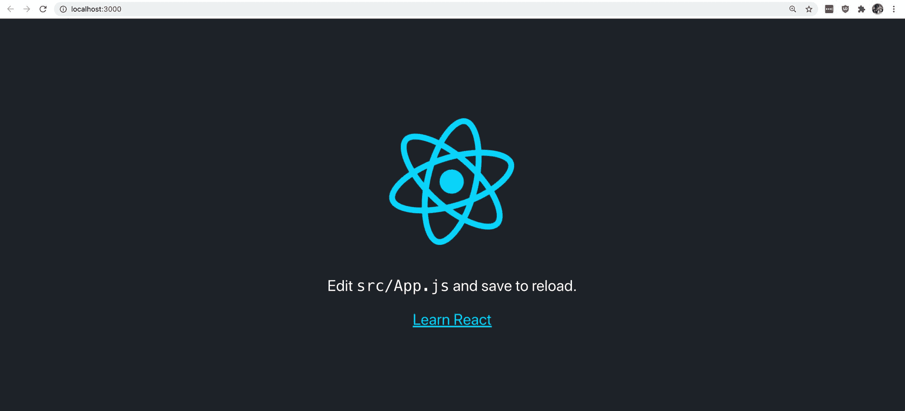
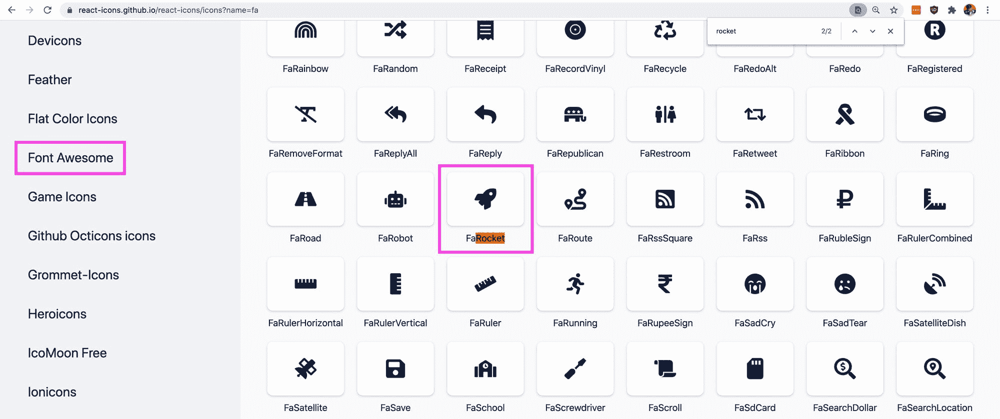
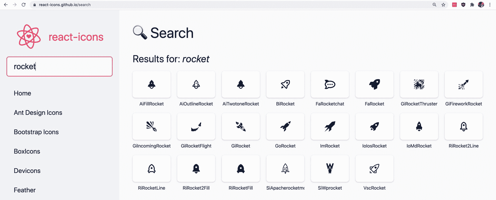
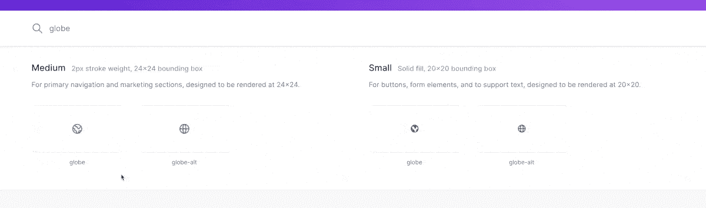
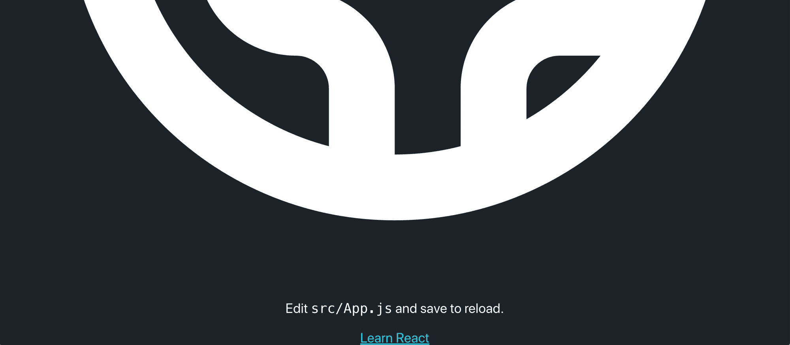

# 如何在 React 中使用 SVG 图标

> 原文：<https://www.freecodecamp.org/news/how-to-use-svg-icons-in-react-with-react-icons-and-font-awesome/>

图标是一种不用文字就能直观传达概念和意义的方式。这可能是为了分类、行动，甚至是警告。

我们如何使用 SVG 将图标添加到 React 应用程序中来改善我们的视觉交流？

*   [什么是 SVG？](#what-is-svg)
*   是什么让 SVG 对 web 如此重要？
*   [第 0 部分:创建 React 应用](#part-0-creating-a-react-app)
*   [第 1 部分:用反应图标添加 SVG 图标](#part-1-adding-svg-icons-with-react-icons)
*   [第 2 部分:手动向 React 组件添加 SVG 文件](#part-2-manually-adding-svg-files-to-a-react-component)

[https://www.youtube.com/embed/OtcA2EAlldo?feature=oembed](https://www.youtube.com/embed/OtcA2EAlldo?feature=oembed)

## What is SVG？

[SVG](https://www.w3.org/Graphics/SVG/) 代表可缩放矢量图形。它是一种基于类似 XML 的标记语言的文件格式，允许开发人员和设计人员使用路径定义创建基于矢量的图像。

## 是什么让 SVG 对 web 如此重要？

SVG 是为 web 而生的。这是一个由 W3C 创建的开放标准，旨在提供一种更好的方式将图像添加到 web 上。如果你在电脑上打开一个 SVG 文件，你可能会惊讶地发现这全是代码！

这在小文件大小中起了一定作用。通常，在使用 SVG 时，与提供相同高分辨率所需的较大图像文件相比，您可以利用其较小的尺寸。

此外，由于我们将 SVG 定义为路径，它们可以根据我们的需要缩放。这使得它们在网络使用上更加灵活，尤其是在体验响应性方面。

## 我们要创造什么？

我们首先将使用一个名为 [react-icons](https://react-icons.github.io/react-icons/) 的包，它将允许我们轻松地将流行图标集(如[字体牛逼](https://fontawesome.com/))中的图标导入我们的应用程序。

我们还将了解如何通过将 SVG 文件的代码复制到一个新组件中，将 SVG 文件手动添加到我们的应用程序中。

## 第 0 部分:创建 React 应用程序

对于本演练，您可以使用任何您喜欢的 React 框架，无论是 [Create React App](https://create-react-app.dev/) 还是 [Next.js](https://nextjs.org/) 。您甚至可以使用现有的项目。

因为我们不需要任何特殊的东西来添加我们的图标，所以我将使用 create-react-app。

要开始使用 create-react-app，您可以在终端中使用以下命令创建一个新项目:

```
yarn create react-app [project-name]
# or
npx create-react-app [project-name] 
```

*注意:将`[project-name]`替换为您希望在项目中使用的名称。我准备用`my-svg-icons`。*

一旦你有了你的新应用或者你现有的应用，我们就可以开始了！



New Create React App

## 第 1 部分:用反应图标添加 SVG 图标

### 向您的项目添加反应图标

为了开始使用 react-icons，我们想在我们的项目中安装它。

在项目内部，运行以下命令:

```
yarn add react-icons
# or
npm install react-icons --save 
```

一旦完成，我们就可以在我们的项目中使用它了。

### 为项目选择图标

react-icons 的一个很酷的地方是它们在单个包中提供了大量的库。

我们不仅有立即可用的字体 Awesome，我们还有 [GitHub 的 Octicons](https://primer.style/octicons) 、 [Heroicons](https://heroicons.com/) 、[材质设计图标](https://google.github.io/material-design-icons/)和[一大堆更多的](https://react-icons.github.io/)。


react-icons Heroicons

在选择图标时，你几乎可以随时使用任何你想要的图标。也就是说，我建议尽量保持你的图标的外观和感觉一致。

如果你的网站主要使用字体 Awesome，那么如果你开始添加[单色图标](https://react-icons.github.io/icons?name=fc)的话，看起来可能会有点奇怪和不一致。你最终想要提供一种体验，让人们能够容易地识别你创造的模式。

### 在项目中使用反应图标

一旦你找到了你想要使用的图标，我们现在可以将它们添加到我们的项目中。

react-icons 的网站使我们可以很容易地查找我们想要用来导入到我们的项目中的图标的名称。

如果我们想使用字体 Awesome 火箭图标，我们可以在侧边栏中导航到字体 Awesome，在页面中搜索“rocket”(CMD+F 或 CTRL+F)，然后单击该图标，它会将其名称复制到您的剪贴板中。



Font Awesome rocket icon

我们也可以在页面左上方的搜索表单中搜索“rocket ”,这会向我们显示所有图标集中的结果“rocket”。



Rocket icons in react-icons

在我们的项目中，我们现在可以导入图标。类似于 react-icons 页面顶部的说明，我们想要从`react-icons/fa`导入那个特定的图标，它引用 react-icons 的字体 Awesome 模块。

将以下内容添加到要导入图标的文件的顶部。如果使用新的 create-react-app 项目，可以将其添加到`src/App.js`的顶部。

```
import { FaRocket } from 'react-icons/fa'; 
```

为了测试这一点，让我们用我们的图标替换 React 徽标。

移除` 
```

如果我们重新加载页面，我们可以看到我们的火箭！


Rocket icon in React app

我们的火箭不像 React 标志那样旋转，所以让我们解决这个问题。

将类`.App-logo`添加到`FaRocket`组件中:

```
<FaRocket className="App-logo" /> 
```

火箭现在应该在旋转了！


Spinning rocket icon in React app

但是也有点小。如果我们观察`src/App.css`的内部，我们将`.App-logo`的高度设置为`40vmin`。虽然这样做是可行的，但是为了让我们的图标填充空间，我们还需要为它提供一个填充宽度。

将以下内容添加到`.App-logo`类中，以添加宽度:

```
width: 40vmin; 
```

虽然它现在可能有点太大了，但我们有了一个更合适的尺寸，而且我们有了自己的图标！


Increased size of spinning rocket icon in React app

[跟随提交](https://github.com/colbyfayock/my-svg-icons/commit/036112c3e2ffc5f42a53c68e8025fe70a87e3b13)。

## 第 2 部分:手动向 React 组件添加 SVG 文件

有时你不想仅仅为了得到一个图标而添加一个新的库。有时它是公共图书馆中没有的自定义图标。

幸运的是，使用 React，我们可以非常容易地创建一个新的 SVG 组件，允许我们在任何需要的地方添加自定义的 SVG 图标。

首先，我们来找一个图标。

虽然所有的 Heroicons 都可以在 react-icons 中找到，但是让我们以它为例，因为很容易找到和复制一些 SVG 代码。

去 heroicons.com 搜索一个你想在这个例子中使用的图标。我要用“地球仪”。

找到你想要的图标后，将鼠标悬停在该图标上，你会看到将该图标复制为 SVG 或 JSX，以及复制为 JSX 的选项。



Copy as JSX in Heroicons

复制图标后，在`src`下创建一个名为`Globe.js`的新文件。

在该文件中，我们将创建一个名为 Globe 的新组件，并将我们的 SVG 粘贴到该组件中。

```
import React from 'react';

const Globe = () => {
  return (
    <svg  fill="none" viewBox="0 0 24 24" stroke="currentColor">
      <path stroke-linecap="round" stroke-linejoin="round" stroke-width="2" d="M3.055 11H5a2 2 0 012 2v1a2 2 0 002 2 2 2 0 012 2v2.945M8 3.935V5.5A2.5 2.5 0 0010.5 8h.5a2 2 0 012 2 2 2 0 104 0 2 2 0 012-2h1.064M15 20.488V18a2 2 0 012-2h3.064M21 12a9 9 0 11-18 0 9 9 0 0118 0z" />
    </svg>
  )
}

export default Globe; 
```

*注意:当将普通 SVG 复制到 React 组件时，它可能无法“按原样”工作。有时 SVG 文件包含对 JSX 无效的 CSS 类或元素属性。*

如果您遇到错误，尝试修复属性并查看 web 控制台以查看警告和错误反应抛出。因为我们是以 JSX 的身份复制的，所以我们能够马上让它工作。

现在，回到`src/App.js`并导入我们的新组件:

```
import Globe from './Globe'; 
```

然后，我们可以用新组件替换火箭图标:

```
<Globe /> 
```

如果我们打开浏览器，我们可以看到我们的地球！



Large globe icon in REact app

虽然，它有点大。

我们想将我们的`.App-logo`类应用到我们的 Globe 组件，所以我们需要更新该组件以获得一个`className`属性。

回到`src/Globe.js`，添加一个`className` prop 参数:

```
const Globe = ({ className }) => { 
```

然后，将带有`className`新道具添加到`<svg`组件中:

```
<svg className={className} 
```

现在，我们可以在`src/App.js`中更新我们的 Globe 组件来包含这个类:

```
<Globe className="App-logo" /> 
```

如果我们重新加载页面，我们可以看到我们的标志回到正确的大小，它再次旋转！


Spinning, normal size globe icon in React app

[跟随提交](https://github.com/colbyfayock/my-svg-icons/commit/87b00748fc9b38d80336ddb5f6f823388c2edead)。

## 为什么我们不把它作为一个 img 文件包含进来呢？

虽然我们可以像 React 在默认的 create-react-app 代码中那样将它作为一个图像文件包含进来，但是我们从“内联”添加 SVG 文件中获得了一些好处。

首先，当内联添加 SVG 时，我们可以用 CSS 属性访问不同的路径。这为我们动态定制它提供了更多的灵活性。

它还将提供更少的 HTTP 请求。浏览器会知道如何加载那个 SVG，所以我们不需要麻烦浏览器请求在页面中包含那个文件。

也就是说，它仍然是向页面添加 SVG 文件的有效选项。

[](https://twitter.com/colbyfayock)

*   [？在 Twitter 上关注我](https://twitter.com/colbyfayock)
*   [？订阅我的 Youtube](https://youtube.com/colbyfayock)
*   [✉️注册我的简讯](https://www.colbyfayock.com/newsletter/)
*   [？赞助我](https://github.com/sponsors/colbyfayock)