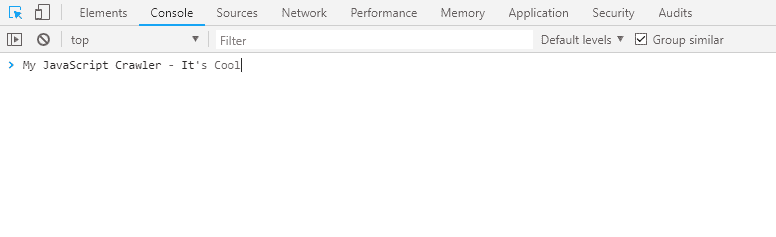
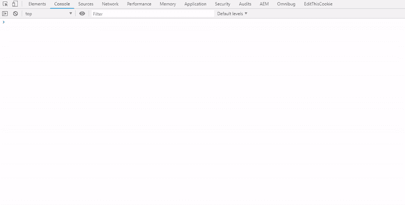
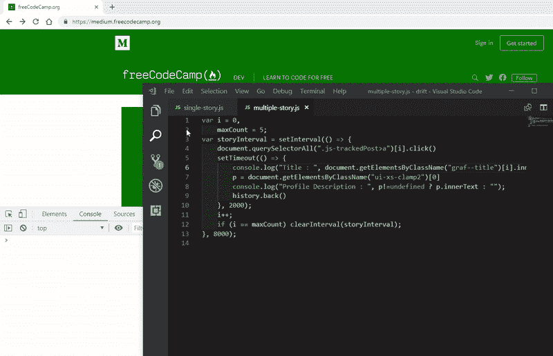

# 如何使用浏览器控制台用 JavaScript 抓取并保存文件中的数据

> 原文：<https://www.freecodecamp.org/news/how-to-use-the-browser-console-to-scrape-and-save-data-in-a-file-with-javascript-b40f4ded87ef/>

作者:普拉文·杜比

# 如何使用浏览器控制台用 JavaScript 抓取并保存文件中的数据


Photo by [Lee](https://unsplash.com/@leecampbell) from [Unsplash](https://unsplash.com)

不久前，我不得不抓取一个站点的链接，并使用 selenium 或 puppeteer 进一步使用这些页面链接来抓取数据。网站内容的设置有点不可思议，所以我不能直接从 selenium 和 node 开始。此外，不幸的是，网站上的数据是巨大的。我不得不迅速想出一个方法，首先抓取所有的链接，并通过这些细节抓取每个页面。

这就是我学习浏览器控制台 API 的地方。你可以在任何网站上使用它，不需要太多的设置，因为它只是 JavaScript。

让我们进入技术细节。

### 高级概述



为了抓取页面上的所有链接，我在控制台中编写了一小段 JS。这个 JavaScript 抓取所有链接(需要 1-2 个小时，因为它也进行分页)，并转储一个包含所有抓取数据的`json`文件。需要记住的是，你需要确保网站的工作方式*类似于单页应用程序。*否则，如果你想抓取多个页面*，它不会重新加载页面。*如果没有，你的控制台代码就会消失。

对于某些情况，中不刷新页面。现在，让我们抓取一个故事，并在报废后自动从控制台将抓取的数据保存在一个文件中。

但在此之前，这里有一个最终执行的快速演示。


Demo

### 1.从浏览器获取控制台对象实例

```
// Console API to clear console before logging new data 
```

```
console.API;
```

```
if (typeof console._commandLineAPI !== 'undefined') {    console.API = console._commandLineAPI; //chrome
```

```
} else if (typeof console._inspectorCommandLineAPI !== 'undefined'){    console.API = console._inspectorCommandLineAPI; //Safari
```

```
} else if (typeof console.clear !== 'undefined') {    console.API = console;
```

```
}
```

该代码只是试图根据用户的当前浏览器获取控制台对象实例。您可以忽略该实例，并将其直接分配给浏览器。

例如，如果你使用的是 Chrome 浏览器，下面的代码就足够了。

```
if (typeof console._commandLineAPI !== 'undefined') {    console.API = console._commandLineAPI; //chrome
```

```
}
```

### 2.定义初级助手功能

我假设你已经在浏览器中打开了一个中型故事。第 6 行到第 12 行定义了 DOM 元素属性，分别用于提取*故事标题、点击次数、用户名、简介图片 URL、简介描述和故事的阅读时间、*。

这些是我想在这个故事中展示的基本东西。您可以添加更多的元素，如从文章中提取链接、所有图像或嵌入链接。

### 3.定义我们的高级助手功能—野兽

由于我们在页面中搜索不同的元素，所以我们将它们保存在一个集合中。这个集合将被传递给一个主函数。

我们已经定义了一个函数名`console.save`。这个函数的任务是转储一个 csv / json 文件，其中包含传递的数据。

它用我们的数据创建一个 Blob 对象。`Blob`对象表示不可变的原始数据的类似文件的对象。Blobs 表示不一定是 JavaScript 原生格式的数据。

Create blob 附加到链接标签`<`；点击事件被触发的>。

这里是`console.save`的快速演示，有一个小的`array`作为数据传递。



将所有的代码放在一起，我们得到了:

1.  控制台 API 实例
2.  提取元素的辅助函数
3.  创建文件的控制台保存功能

让我们在浏览器中执行 console.save()将数据保存到一个文件中。为此，您可以转到媒体上的[故事，并在浏览器控制台中执行这段代码。](https://medium.freecodecamp.org/an-introduction-to-plotly-js-an-open-source-graphing-library-c036a1876e2e)


我已经展示了从单个页面提取数据的演示，但是可以调整相同的代码来从出版商的主页抓取多个故事。以 [freeCodeCamp](https://medium.freecodecamp.org) 为例:你可以从一个故事导航到另一个故事，然后返回*(使用浏览器的后退按钮)*到[出版商主页](https://medium.freecodecamp.org)，而无需刷新页面。

下面是从出版商的主页中提取多个故事所需的最少代码。

让我们看看从多个故事中获取概要描述的代码。



对于任何这种类型的应用程序，一旦你丢弃了数据，你可以将它传递到我们的*控制台。保存*功能，并将其存储在一个文件中。

控制台保存功能可以快速附加到您的控制台代码中，并可以帮助您转储文件中的数据。我不是说你*必须*使用控制台抓取数据，但有时这将是一种更快的方法，因为我们都非常熟悉使用 CSS 选择器处理 DOM。

你可以从 [Github](https://github.com/edubey/browser-console-crawl) 下载代码

> 感谢您阅读本文！希望它给了你不需要太多设置就能快速收集一些数据的好主意。如果它喜欢，就按拍手按钮！如果有任何问题，请发邮件给我(praveend806 [at] gmail [dot] com)。

#### *了解控制台更多信息的资源:*

[**使用控制台 Web 开发者工具|谷歌开发者**](https://developers.google.com/web/tools/chrome-devtools/console/)
[*了解如何导航 Chrome DevTools JavaScript 控制台。*developers.google.com](https://developers.google.com/web/tools/chrome-devtools/console/)[**浏览器控制台**](https://developer.mozilla.org/en-US/docs/Tools/Browser_Console)
[*浏览器控制台类似于 Web 控制台，但应用于整个浏览器而不是单个内容选项卡。*developer.mozilla.org](https://developer.mozilla.org/en-US/docs/Tools/Browser_Console)[**Blob**](https://developer.mozilla.org/en-US/docs/Web/API/Blob)
[*Blob 对象表示一个不可变的、原始数据的类文件对象。Blobs 代表不一定在…*developer.mozilla.org](https://developer.mozilla.org/en-US/docs/Web/API/Blob)中的数据