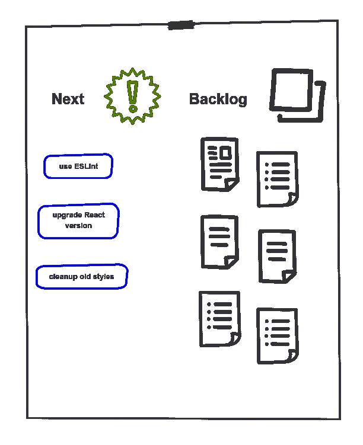

# 如何使用开发会议让您的开发人员达成共识

> 原文：<https://www.freecodecamp.org/news/how-to-use-the-dev-huddle-to-get-your-developers-on-the-same-page/>

您如何确保团队中的开发人员与您的技术方向保持一致？那是一个困难的问题。

每个团队都有自己的特质。作为一名技术领导者，我想了很多，最后得出了一些模糊的想法，比如 T2 授权，T4 共享目标。但这些都不太具有可操作性。

然而，有一个仪式在我所在的团队中非常有效。我想谈谈*开发者大会*。

## 什么是开发人员会议？


Developers aligning expectations

它有许多名字:开发者大会、技术大会、开发者会议。不管你叫它什么，它是一个团队中开发人员的定期会议。

那么它能实现什么呢？嗯，这是一个讨论技术主题并就架构、约定或任何其他技术堆栈方面做出决策的论坛。

“哇，那是*所以*创新！”你可能会想。是的，没什么开创性的。不过，问题出在细节上。

召开有效的开发人员会议可能会很棘手。没有什么比再开一次无用的会议更让一群开发人员沮丧的了。如果你占用了他们的时间，你最好让它有价值。

## 我为什么要这么做？

在重点讨论*如何*之前，我们先来看看*为什么*。我们期望完成什么？

### 创建对齐

开发人员可能会密切合作(有时*也是*字面上的意思)，但他们会像从未见过面一样开发软件。他们同意编码约定吗？解析 JSON 的首选库是什么？

有大量的小决定要做。随着时间的推移，这些形成了对构建软件的一致理解，这对任何高绩效的团队都是至关重要的。

### 促进创新

你不会每六个月用最时髦的技术重写你的应用程序，但是你想鼓励实验。[持续改进](https://www.creativesafetysupply.com/articles/continuous-improvement/)复合时间。

我曾是一开始看起来毫无希望的团队的一员。经过一年多的小改进，我们正在进行[持续部署](https://www.atlassian.com/continuous-delivery/continuous-deployment#:~:text=Continuous%20Deployment%20(CD)%20is%20a,cycle%20has%20evolved%20over%20time)。然而，这很少会在一次大的推动中发生。

### 鼓励辩论

一些团队实践我称之为任期讨论的方法，团队中最资深的人制定技术决策，而其他人，嗯，遵循他们。如果他们足够幸运，能够发现这些决定。

你的长辈有经验和直觉，但其他人也可以做出贡献。

## 准备

我喜欢围绕积压的想法组织会议。

像墙上的便利贴或 Github 工作中的问题列表这样简单的事情。每一个都可以是一个简单的标题——它们是用来开始对话的。

一些例子:

*   让我们试试新的断言库 [strikt](https://strikt.io/)
*   重构我们的 API 调用以使用 [React 钩子](https://reactjs.org/docs/hooks-intro.html)
*   我们最新的微服务缺少文档



谁添加新话题？各位！

结对的同时寻找重构的候选？看了那篇关于新图书馆的文章吗？

把它加到墙上就行了。

一开始，你将是唯一一个发表想法的人。随着时间的推移，团队的其他成员会感觉更舒服，并加入进来。我们一会儿就来看看怎么选择谈什么。

### 找个时间

有些人可能会说，“让我们在需要的时候聚一聚吧。我们敏捷！”

根据我的经验，这是行不通的。总是有紧急的事情，或者某人现在没有时间。

我的建议？选择一个固定的时间段:每周同一天同一个时间。

理想情况下，只要破坏性最小。每天下班后，午饭后——没关系。人们会习惯它，并在他们的时间表中考虑到它。

半个小时应该足够进行有意义的谈话了。

董事会的流动性是一个很好的指标。如果你收集了越来越多你从未谈论过的话题，也许你的开发会议需要长一点。如果你的东西快用完了，也许你可以早点结束，或者甚至改为两周一次的会议。

## 如何召开开发人员会议

运行开发会议包括浏览主题列表，讨论它们，得出结论，并记录下来。听起来很简单，对吧？


Moderation happening

没那么快。首先，there **有**做主持人。

一个好的主持人会记录总时间，确保没有一个话题会占用整个时间段。他们也给每个人发言的机会。

如果没有这个角色，你可能会在酒吧讨论，只是没有啤酒。

我以前在一个团队负责所有的秘密会议。很久以后我才意识到这是一个多么大的错误。

本应属于整个团队的会议最终变成了你的。很难在提供便利的同时成为积极的参与者。

请改为旋转促进。每个人都可以练习主持，你也可以从中获得一些乐趣！

如果你有太多的话题，你必须选择要解决的。你可以按照创作的顺序来选，或者在开始前用[点选](https://en.wikipedia.org/wiki/Dot-voting)。

有些人会比其他人提出更多的观点。尽量保持平衡。一个大的架构变化需要的不仅仅是几分钟，因此可能需要一个后续会议。

然后，讨论随之而来。

一次会议不会修复一个破碎的文化，但它是一个很好的试金石。你是在陈述观点还是事实？你想插一句话吗？如果是这样的话，你的问题就不算什么了。

下面是一个样本清单，可以帮助经验不足的版主:

```
- Are there open points from last time?
- Choose the topics for today
* For every topic

    The owner presents the issue so that everybody is on the same page
    Talk about it (Keep a timebox!)
    Resolution
        What did we decide?
        Assign an owner to take care of the follow-up

- Have we made decisions that need to be reflected in ADRs?
- Finish on time, unless there is something that absolutely can't wait
```

## 结果

让团队成员互相交流已经是一件很重要的事情了。但是，如果没有结果，那就不是真正的会议，而是一次社交聚会。

所以写下你的发现。通常，它会是关于你想做的事情或者从那时起你将要做的事情。

### 技术故事/闲置项目

不要听那些头发尖尖的微观管理者的话，他们想记录下曾经采取的每一个行动，不管多么无关紧要。对于小事情，保持会计最小化，依靠[松弛时间](https://www.solutionsiq.com/resource/blog-post/the-importance-of-slack-in-achieving-speed-and-quality/)。

对于更大的事情，编写技术故事，并确保将它们整合到您的常规待办事项中。关于这个有很多可以说的[。](https://www.thoughtworks.com/insights/blog/treat-devops-stories-user-stories)

TLDR:用和用户故事一样的标准来看待技术故事。

### 跟踪决策


Archiving decisions

想象一下:每个人都兴奋地聚集在一起。气氛变得紧张，但你会就是否使用分号达成一致。*事情正在完成*。但是没有人写下来，下周你得重新开始。

令人恼火，不是吗？

我能让你对一些[轻量级架构决策记录](https://www.thoughtworks.com/radar/techniques/lightweight-architecture-decision-records)感兴趣吗？这听起来可能很正式，不敏捷，但实际上不是。你只是有一个地方来记录你所做的决定。

你所需要的只是一个带有标题、你的决定和上下文解释的降价文件。我见过有人写小说来美化卡夫卡的美德，而一些简单的东西也能起到同样的作用:

```
Title: Use Kotlin instead of Java for new services

Date: 2018/10

Decision: We'll be using Kotlin whenever we start a new service but leave the existing ones

Context: We think Kotlin will help us create more lightweight services while improving quality thanks to null safety
```

有许多模板可以使用。重要的是要自律，并反映出你所认同的东西。

## 聚在一起。

回顾过去，我所在的所有团队都从为开发人员提供一个结盟的场所中受益匪浅。只是投入了很少的精力和时间。

继续尝试，找到最适合你的设置。