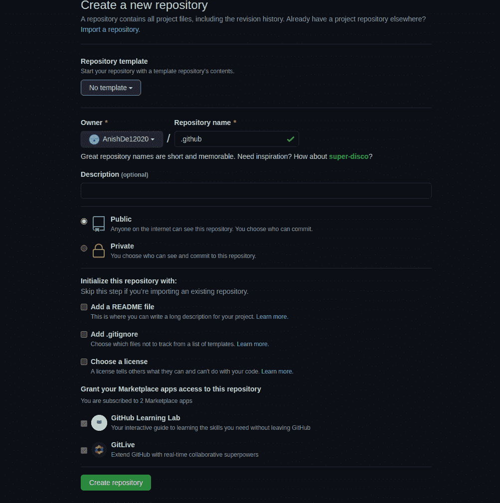
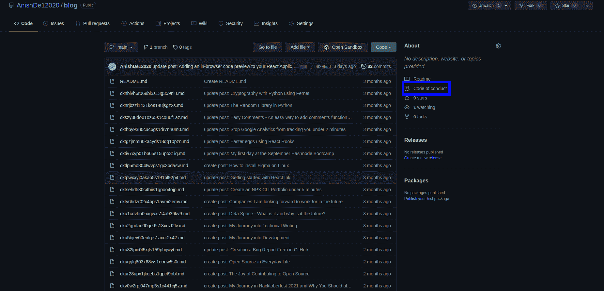
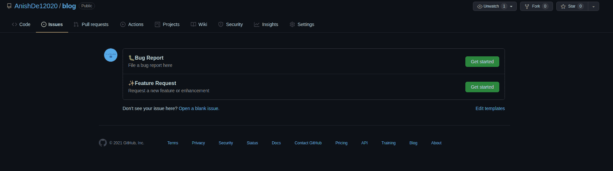
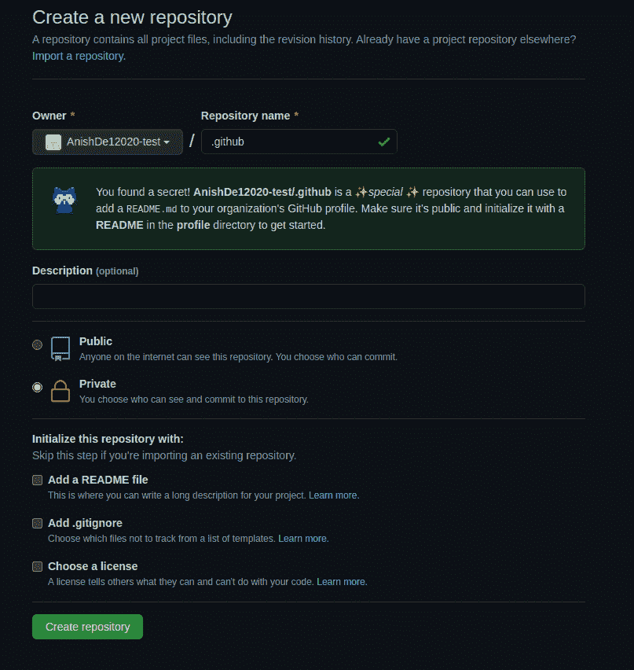
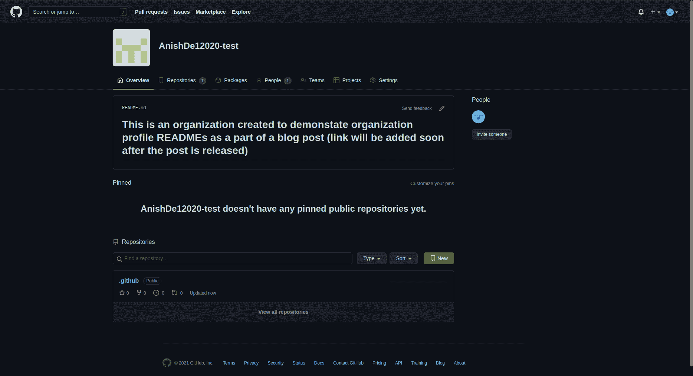

# 如何使用？github 知识库

> 原文：<https://www.freecodecamp.org/news/how-to-use-the-dot-github-repository/>

GitHub 有很多特殊的仓库。例如，您可以创建一个与您的用户名匹配的存储库，向其中添加一个自述文件，该文件中的所有信息都将显示在您的 GitHub 个人资料中。

您可能已经熟悉了许多存储库中的`.github`目录。`.github`目录包含工作流、问题模板、拉式请求模板、资金信息和其他一些特定于该项目的文件。

但是您可以创建的另一个特殊存储库是`.github`存储库。它充当所有没有包含问题模板和其他社区健康文件的实际`.github`目录的存储库的后备。

例如，假设我有一个名为`.github`的存储库，其中有通用的错误报告和特性请求问题模板。假设我创建了另一个名为`new-project`的存储库，但是我没有添加一个包含问题模板的`.github`目录。

然后，如果有人去`new-project`回购并打开一个问题，他们会看到一个选项，从已经在`.github`目录中的通用模板中进行选择。

类似地，如果我将行为准则添加到我的`.github`存储库中，它将在我所有没有明确行为准则的存储库中显示。

请注意，存储库的`.github`目录中的文件将优先于`.github`目录中的文件。例如，如果我的`new-project`回购有一个`.github`目录，其中有一个功能请求问题模板，它将被用来代替来自`.github`回购的通用功能请求模板。

让我们看看这个特殊的存储库是如何工作的。

## 如何使用。个人 github 账户上的 GitHub

创建这个特殊的资源库就像在 GitHub 上创建任何其他资源库一样简单。因此，继续在您的 web 浏览器上打开 GitHub，并像这样创建存储库:



Creating a .github repository on my personal GitHub account

创建完存储库后，您可以开始向其中添加文件。我要添加的第一个文件是错误报告问题表单。在本文中，我不打算讨论创建问题表单的细节，但是你可以看看我以前写的一篇关于 GitHub 问题表单的文章。

`.github/ISSUE_TEMPLATE/bug_report.yml`

```
name: 🐛Bug Report
description: File a bug report here
title: "[BUG]: "
labels: ["bug"]
assignees: ["AnishDe12020"]
body:
  - type: markdown
    attributes:
      value: |
        Thanks for taking the time to fill out this bug report 🤗
        Make sure there aren't any open/closed issues for this topic 😃

  - type: textarea
    id: bug-description
    attributes:
      label: Description of the bug
      description: Give us a brief description of what happened and what should have happened
    validations:
      required: true

  - type: textarea
    id: steps-to-reproduce
    attributes:
      label: Steps To Reproduce
      description: Steps to reproduce the behavior.
      placeholder: |
        1\. Go to '...'
        2\. Click on '...'
        3\. Scroll down to '...'
        4\. See error
    validations:
      required: true
  - type: textarea
    id: additional-information
    attributes:
      label: Additional Information
      description: |
        Provide any additional information such as logs, screenshots, likes, scenarios in which the bug occurs so that it facilitates resolving the issue. 
```

Bug Report Issue form code

我还将创建一个功能请求表单。

`.github/ISSUE_TEMPLATE/feature_request.yml`

```
name: ✨Feature Request
description: Request a new feature or enhancement
labels: ["enhancement"]
title: "[FEAT]: "
body:
  - type: markdown
    attributes:
      value: |
        Please make sure this feature request hasn't been already submitted by someone by looking through other open/closed issues

  - type: textarea
    id: description
    attributes:
      label: Description
      description: Give us a brief description of the feature or enhancement you would like
    validations:
      required: true

  - type: textarea
    id: additional-information
    attributes:
      label: Additional Information
      description: Give us some additional information on the feature request like proposed solutions, links, screenshots, etc. 
```

Feature Request Issue Form code

我还将添加一个拉取请求模板。

`.github/pull_request_template.md`

```
<!-- 
Thanks for creating this pull request 🤗

Please make sure that the pull request is limited to one type (docs, feature, etc.) and keep it as small as possible. You can open multiple prs instead of opening a huge one.
-->

<!-- If this pull request closes an issue, please mention the issue number below -->
Closes # <!-- Issue # here -->

## 📑 Description
<!-- Add a brief description of the pr -->

<!-- You can also choose to add a list of changes and if they have been completed or not by using the markdown to-do list syntax
- [ ] Not Completed
- [x] Completed
-->

## ✅ Checks
<!-- Make sure your pr passes the CI checks and do check the following fields as needed - -->
- [ ] My pull request adheres to the code style of this project
- [ ] My code requires changes to the documentation
- [ ] I have updated the documentation as required
- [ ] All the tests have passed

## ℹ Additional Information
<!-- Any additional information like breaking changes, dependencies added, screenshots, comparisons between new and old behavior, etc. --> 
```

Pull Request Template code

我要添加的最后一个文件是行为准则，但它将位于存储库的根目录下。尽管如此，这将按预期工作(行为准则文件通常保存在存储库的根目录下)。注意，我使用的是[贡献者约定](https://www.contributor-covenant.org/)约定。

`CODE_OF_CONDUCT.md`

```
 # Contributor Covenant Code of Conduct

## Our Pledge

We as members, contributors, and leaders pledge to make participation in our
community a harassment-free experience for everyone, regardless of age, body
size, visible or invisible disability, ethnicity, sex characteristics, gender
identity and expression, level of experience, education, socio-economic status,
nationality, personal appearance, race, caste, color, religion, or sexual
identity and orientation.

We pledge to act and interact in ways that contribute to an open, welcoming,
diverse, inclusive, and healthy community.

## Our Standards

Examples of behavior that contributes to a positive environment for our
community include:

* Demonstrating empathy and kindness toward other people
* Being respectful of differing opinions, viewpoints, and experiences
* Giving and gracefully accepting constructive feedback
* Accepting responsibility and apologizing to those affected by our mistakes,
  and learning from the experience
* Focusing on what is best not just for us as individuals, but for the overall
  community

Examples of unacceptable behavior include:

* The use of sexualized language or imagery, and sexual attention or advances of
  any kind
* Trolling, insulting or derogatory comments, and personal or political attacks
* Public or private harassment
* Publishing others' private information, such as a physical or email address,
  without their explicit permission
* Other conduct which could reasonably be considered inappropriate in a
  professional setting

## Enforcement Responsibilities

Community leaders are responsible for clarifying and enforcing our standards of
acceptable behavior and will take appropriate and fair corrective action in
response to any behavior that they deem inappropriate, threatening, offensive,
or harmful.

Community leaders have the right and responsibility to remove, edit, or reject
comments, commits, code, wiki edits, issues, and other contributions that are
not aligned to this Code of Conduct, and will communicate reasons for moderation
decisions when appropriate.

## Scope

This Code of Conduct applies within all community spaces, and also applies when
an individual is officially representing the community in public spaces.
Examples of representing our community include using an official e-mail address,
posting via an official social media account, or acting as an appointed
representative at an online or offline event.

## Enforcement

Instances of abusive, harassing, or otherwise unacceptable behavior may be
reported to the community leaders responsible for enforcement at
[INSERT CONTACT METHOD].
All complaints will be reviewed and investigated promptly and fairly.

All community leaders are obligated to respect the privacy and security of the
reporter of any incident.

## Enforcement Guidelines

Community leaders will follow these Community Impact Guidelines in determining
the consequences for any action they deem in violation of this Code of Conduct:

### 1\. Correction

**Community Impact**: Use of inappropriate language or other behavior deemed
unprofessional or unwelcome in the community.

**Consequence**: A private, written warning from community leaders, providing
clarity around the nature of the violation and an explanation of why the
behavior was inappropriate. A public apology may be requested.

### 2\. Warning

**Community Impact**: A violation through a single incident or series of
actions.

**Consequence**: A warning with consequences for continued behavior. No
interaction with the people involved, including unsolicited interaction with
those enforcing the Code of Conduct, for a specified period of time. This
includes avoiding interactions in community spaces as well as external channels
like social media. Violating these terms may lead to a temporary or permanent
ban.

### 3\. Temporary Ban

**Community Impact**: A serious violation of community standards, including
sustained inappropriate behavior.

**Consequence**: A temporary ban from any sort of interaction or public
communication with the community for a specified period of time. No public or
private interaction with the people involved, including unsolicited interaction
with those enforcing the Code of Conduct, is allowed during this period.
Violating these terms may lead to a permanent ban.

### 4\. Permanent Ban

**Community Impact**: Demonstrating a pattern of violation of community
standards, including sustained inappropriate behavior, harassment of an
individual, or aggression toward or disparagement of classes of individuals.

**Consequence**: A permanent ban from any sort of public interaction within the
community.

## Attribution

This Code of Conduct is adapted from the [Contributor Covenant][homepage],
version 2.1, available at
[https://www.contributor-covenant.org/version/2/1/code_of_conduct.html][v2.1].

Community Impact Guidelines were inspired by
[Mozilla's code of conduct enforcement ladder][Mozilla CoC].

For answers to common questions about this code of conduct, see the FAQ at
[https://www.contributor-covenant.org/faq][FAQ]. Translations are available at
[https://www.contributor-covenant.org/translations][translations].

[homepage]: https://www.contributor-covenant.org
[v2.1]: https://www.contributor-covenant.org/version/2/1/code_of_conduct.html
[Mozilla CoC]: https://github.com/mozilla/diversity
[FAQ]: https://www.contributor-covenant.org/faq
[translations]: https://www.contributor-covenant.org/translations 
```

Contributor Convent CODE OF CONDUCT v2.1 in markdown

我们可以添加更多的文件，如资金信息、投稿指南等等。要了解更多信息，您可以查看关于社区健康档案的 GitHub 文档

### 运行中的`.github`存储库

我的[博客库](https://github.com/AnishDe12020/blog)没有任何问题模板、行为准则或任何其他文件，除了我的博客的降价文件和一个自述文件。因此，这是测试该特性是否有效的最佳存储库。

我已经可以看到行为准则出现在这里:



如果我尝试创建一个问题，我也会看到模板:



这也适用于创建拉取请求。

## 如何使用？组织/公共帐户的 github 存储库

组织账户上的`.github`存储库的工作方式与个人 GitHub 账户上的`.github`存储库一样——除了有一点不同。

组织也可以在 GitHub 的组织页面上显示个人资料。该自述文件位于组织的`.github`存储库的`profile`目录中。为了演示这一点，我将快速创建一个演示组织。

在为一个组织创建`.github`存储库时，您应该看到以下消息:



另外，在将配置文件自述文件添加到`profile/README.md`时，您应该会看到以下消息:


Creating a GitHub organization README

现在，我将向该自述文件添加一些内容并提交它。当我访问该组织的主页时，我们应该看到以下内容:



Seeing GitHub organization profile README contents on the organization page

## 结论

我希望您现在知道了`.github`存储库是做什么的。您还应该知道如何为您的存储库设置默认的社区健康文件，并为您的组织设置一个配置文件自述文件。

请随时在推特上联系我，祝你愉快😃

### 资源

*   [关于社区健康档案的 GitHub 文档](https://docs.github.com/en/communities/setting-up-your-project-for-healthy-contributions/creating-a-default-community-health-file)
*   [我的`.github`储存库](https://github.com/AnishDe12020/.github)
*   [我的测试机构的`.github`仓库](https://github.com/AnishDe12020-test/.github)
*   [投稿人大会](https://www.contributor-covenant.org/)
*   [GitHub 问题表单入门文章](https://blog.anishde.dev/creating-a-bug-report-form-in-github)

我目前正在做一个名为 DevKit 的项目，这是一个 PWA，将开发者工具放在一个应用程序中，并提供快速完成工作的方法。一定要去 https://www.devkit.one/看看。