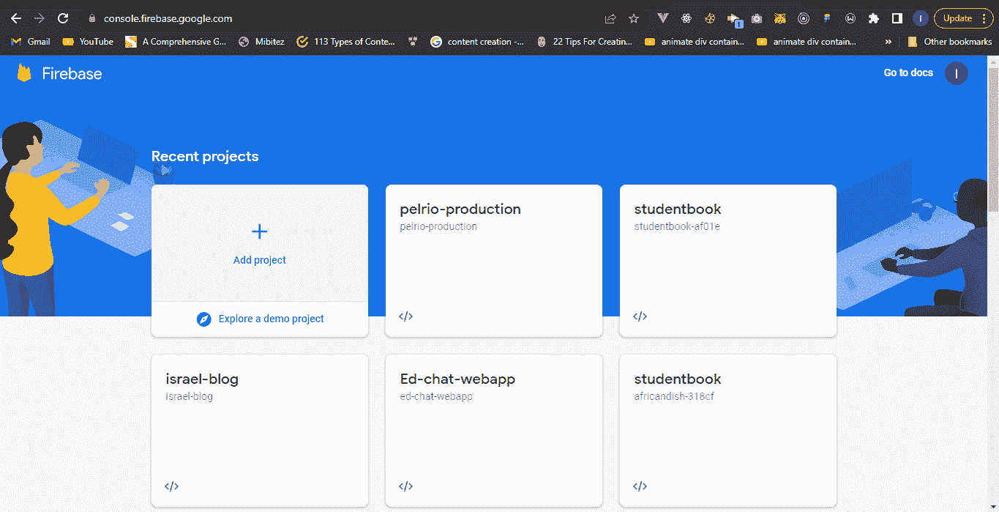
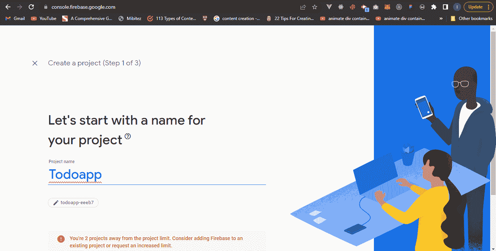
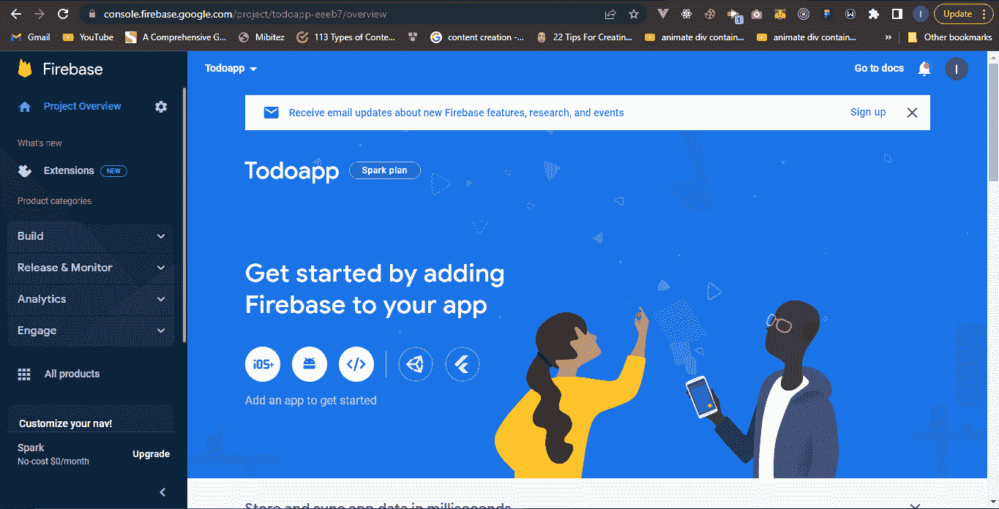
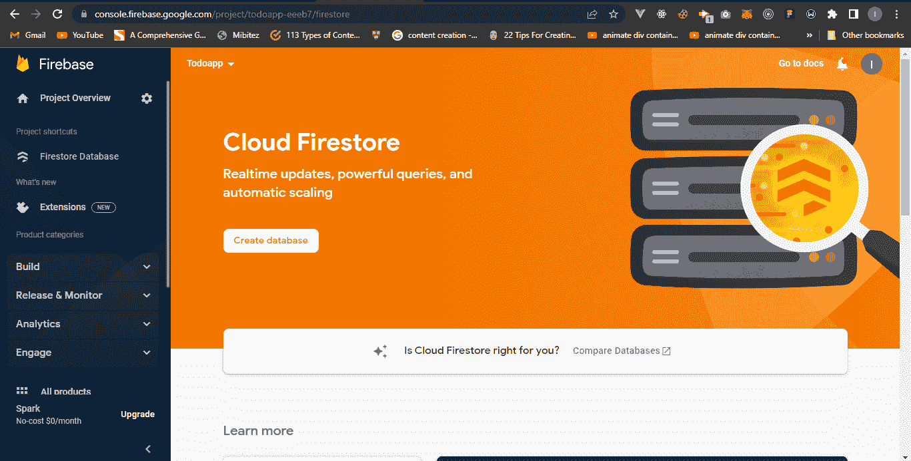
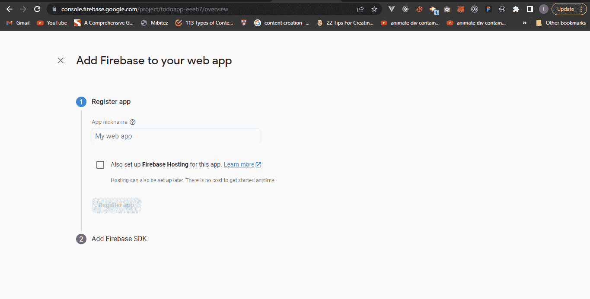

# 如何在 react 应用中使用云风暴

> 原文：<https://www.freecodecamp.org/news/how-to-use-the-firebase-database-in-react/>

Firebase 提供了一些很棒的服务，比如 NoSQL 数据库、认证、云存储等等。

在本教程中，我们将学习如何使用 React 应用程序来读取和添加数据到 Firebase 数据库。

为了演示这一点，我们将学习如何使用 React 和 Cloud Firestore (Firebase9 web SDK)构建一个 Todo 应用程序。在我们开始构建之前，让我们了解一下我们将在本教程中使用的工具。

## 什么是云 Firestore？

与一些将数据存储在表格中的数据库(SQL 数据库)不同，Cloud Firestore 是一个非表格数据库，将数据存储在集合中。

根据[文件](https://firebase.google.com/docs/firestore)，

> “Cloud Firestore 是一个灵活、可扩展的数据库，适用于移动、web 和服务器开发。Cloud Firestore 不要求您显式创建集合或文档。Cloud Firestore 将数据存储在文档中，这些文档存储在集合中。”

由于在本教程中我们不会关注设计部分，我将提供 CSS 样式。让我们继续建立我们的数据库。

## 如何设置您的云 Firestore

在设置云 Firestore 之前，您需要登录 Firebase 控制台。以下是方法。

### 登录 Firebase

前往 [Firebase 控制台](https://console.firebase.google.com/)并使用您的 Google 帐户登录。如果您还没有帐户，请注册您的 Google 帐户，并按照提示创建一个新项目。



firebase console 

为您的项目选择一个合适的名称，然后点击**继续**。对于本教程，我们将把我们的项目命名为 **Todo-app** 。



setting up firebase

你的下一个屏幕是启用**谷歌分析**的提示。你可以选择关闭它。本教程不需要谷歌分析，所以我会把它关掉。

恭喜您，您已经成功设置了您的云 Firestore。您的下一个屏幕将是 Firebase 控制台仪表板。



firebase dashboard

## 如何为 Firebase 设置 React 应用程序

我们将使用 **npx** 创建一个新的 React 应用。我们将创建一个新的 React 应用程序，用 **firebase-react-app** 作为应用程序名和目录名。使用命令行，输入以下代码创建一个新的 React 应用程序:

```
$ npx create-react-app firebase-react-app
```

要启动 React 应用程序，请使用以下命令。它在 Visual Studio 代码中打开 React 应用程序，导航到新目录，最后运行 React 应用程序。

```
$ code .
$ cd firebase-storage
$ npm run start
```

在本教程中，我们不需要大量的启动文件和代码。我们将删除 **App.test.js** 、 **index.css** 和 **logo.svg** 文件。我们还将删除 **App.css** 和 **App.js** 文件中的启动代码。

## Firebase 控制台概述

Firebase 仪表盘有一个**侧边栏**和一个**主视图**。侧边栏被分为 Firebase 提供的不同产品。除了我们感兴趣的领域 Cloud Firestore 之外，Firebase 还有许多产品，它们在身份验证、存储、数据库等方面提供了出色的服务。

要开始使用云 Firestore 服务，请导航至您的 Firebase 仪表盘，点击**构建**下拉菜单，然后选择 **Firestore 数据库**。



Firebase dashboard showing the cloud firestore view

选择选项**创建数据库**并将安全规则设置为在**测试模式**下启动。选择默认的 Firestore 位置，点击**启用您的数据库**。

通过将 Firebase web SDK 添加到我们的 React 应用程序，继续配置您的 Firebase。为此，请单击项目概述屏幕上的 web 图标。


Click the web icon

下一个提示将要求您将 Firebase 添加到 web 应用程序中。你需要为你的应用选择一个**昵称**。我们将使用 **Todo-app** 作为我们应用的昵称。

我们不需要 Firebase 托管。因此，您可以不选中 Firebase 托管框。然后，点击**注册 app。**



Firebase screen to register your web app

您的下一个提示将要求您使用 [npm](https://www.npmjs.com/) 安装 Firebase 的最新 SDK，还将提供您的 web 应用程序配置。

```
$ npm install firebase
```

点击**继续控制台**。您已经完成了将 Firebase 添加到 React 应用程序的一半。

您的 web 应用程序配置将与您唯一的 API 密钥和其他一些有用的信息一起显示。

在 **src** 目录下创建一个名为 **firebase.js** 的文件，并将您的 firebase 配置粘贴到 **firebase.js** 文件中。我们还将把云 Firestore SDK 导入 React 应用程序。你的 **firebase.js** 应该是这样的:

```
 // Import the functions you need from the SDKs you need
import { initializeApp } from "firebase/app";
import { getFirestore } from "firebase/firestore";
// TODO: Add SDKs for Firebase products that you want to use
// https://firebase.google.com/docs/web/setup#available-libraries
// Your web app's Firebase configuration
const firebaseConfig = {
  apiKey: "XXXXXXXXXXXXXXXXXXXXXXXXXXXXXX",
  authDomain: "XXXXXXXXXXXXXXXXXXXXXXXXXXXXXX",
  projectId: "XXXXXXXXXXXXXXXXX",
  storageBucket: "XXXXXXXXXXXXXXXXXXXXXXXX",

  messagingSenderId: "XXXXXXXXXXXXXXX",
  appId: "XXXXXXXXXXXXXXXXXXXXXXXXXXXXXX"
};
// Initialize Firebase

const app = initializeApp(firebaseConfig);
// Export firestore database
// It will be imported into your react app whenever it is needed
export const db = getFirestore(app);
```

再次恭喜你。您已经成功地初始化了 Firebase 和 Cloud Firestore，并导出了它们，以便可以在 React 应用程序中使用它们。

## 如何创建我们的应用程序

为了编写更干净的代码，我们将在我们的 **src** 目录中创建一个**组件**文件夹。然后我们将在我们的**组件**文件夹中创建一个 **Todo.js** 文件。这个新文件将被导入到 **App.js** 文件中进行渲染。

**Todo.js** 文件将包含以下代码:

```
import React, { useState } from 'react';
import "../App.css";

const Todo = () => {
    const [todo, setTodo] = useState("")

    const addTodo = (e) => {
        e.preventDefault();        
    }

    return (
        <section className="todo-container">
            <div className="todo">
                <h1 className="header">
                    Todo-App
                </h1>

                <div>

                    <div>
                        <input
                            type="text"
                            placeholder="What do you have to do today?"
                            onChange={(e)=>setTodo(e.target.value)}
                        />
                    </div>

                    <div className="btn-container">
                        <button
                            type="submit"
                            className="btn"
                            onClick={addTodo}
                        >
                            Submit
                        </button>
                    </div>

                </div>

                <div className="todo-content">
                    ...
                </div>
            </div>
        </section>
    )
}

export default Todo
```

### 代码解释:

**Todo.js** 文件有一个输入标签(接受用户的输入)，一个带有 **onClick** 功能的按钮(我们将使用它向 Firestore 发送数据)，以及一个处理状态的 **onChange** 功能。

我们不会深入处理表单输入。上面的代码展示了如何使用 **useState** 钩子来实现这一点。

每当点击按钮时，将由 useState 钩子处理的输入值将被添加到云 Firestore 中。

就像我上面提到的，这不是一个 CSS 教程。下面是 CSS 样式的代码，您可以复制并粘贴:

```
*{
    padding: 0;
    margin: 0;
    box-sizing: border-box;
}
.todo-container {
    display: flex;
    justify-content: center;
    align-items: center;    
}

.todo {
    width: 70%;
    margin: 3rem auto 0 auto;    
}

.header {
    font-size: 2.5rem;
    margin-bottom: 1rem;
    text-align: center;
}

input {
    padding: 10px 3px;
    width: 100%;
}

.btn-container {
    display: flex;
    justify-content: center;
    align-items: center;
    margin-top: 1rem;
}

.btn {
    padding: 10px 1rem;
    background: #334;
    color: white;
    border-radius: 5px;
    cursor: pointer;
}

.todo-content {
    margin-top: 2rem;
}
```

## 如何给云风暴添加数据

您可以使用以下代码将从输入中获得的数据添加到云 Firestore:

```
import { collection, addDoc } from "firebase/firestore";
import {db} from '../firebase';

    const addTodo = async (e) => {
        e.preventDefault();  

        try {
            const docRef = await addDoc(collection(db, "todos"), {
              todo: todo,    
            });
            console.log("Document written with ID: ", docRef.id);
          } catch (e) {
            console.error("Error adding document: ", e);
          }
    } 
```

### 代码解释:

在 Cloud Firestore 中，数据存储在集合中。要向 Firestore 添加数据，请导入**集合**和 **addDoc** 函数。我们还导入了在 **firebase.js** 文件中初始化的 **db** 。

当点击按钮时，云 Firestore 创建一个集合(我们命名为 **todos)** ，并将数据作为文档添加到 **todos** 集合中。

如果你还在关注，恭喜你。您已经成功地将数据添加到 Firebase。

## 如何读取数据

您可以随时查看 Firebase 控制台仪表板，查看您添加的所有数据。

为了获取添加到 Firestore 中的数据，我们将使用 Firebase **get** 方法读取添加到集合中的所有文档。您可以使用以下代码将读取数据添加到云 Firestore:

```
import { collection, getDocs } from "firebase/firestore";
import {db} from '../firebase';
Import { useState } from ‘react’;

   const [todos, setTodos] = useState([]);

    const fetchPost = async () => {

        await getDocs(collection(db, "todos"))
            .then((querySnapshot)=>{               
                const newData = querySnapshot.docs
                    .map((doc) => ({...doc.data(), id:doc.id }));
                setTodos(newData);                
                console.log(todos, newData);
            })

    }

    useEffect(()=>{
        fetchPost();
    }, [])
```

### 代码解释:

我们从 Firebase 导入了**集合**和 **getDocs** 函数。我们使用 **getDocs** 函数从我们最初创建的集合中获取数据。我们使用了 **useEffect** 钩子在每次重新渲染后获取数据。我们使用 **useState** 钩子来处理从 Firestore 获得的数据。我们映射了 **Todos** 集合中的每个文档，并将每个值添加到 **setTodos** 数组中。

**todo** 数组现在包含了我们添加到 Firestore 的所有数据。我们可以使用以下代码读取添加到 Firestore 数据库中的每个 todo 输入:

```
<div className="todo-content">
    {
        todos?.map((todo,i)=>(
            <p key={i}>
                {todo.todo}
            </p>
        ))
    }
</div>
```

如果你还在跟进这一点，恭喜你。您已经使用 React.js 成功地从云 Firestore 添加和读取了数据。下面是我们的 Todo.js 文件的完整代码:

```
import "../App.css";
import React, { useState, useEffect } from 'react';
import { collection, addDoc, getDocs } from "firebase/firestore";

const Todo = () => {
    const [todo, setTodo] = useState("");
    const [todos, setTodos] = useState([]);

    const addTodo = async (e) => {
        e.preventDefault();  

        try {
            const docRef = await addDoc(collection(db, "todos"), {
              todo: todo,    
            });
            console.log("Document written with ID: ", docRef.id);
          } catch (e) {
            console.error("Error adding document: ", e);
          }
    }

    const fetchPost = async () => {

        await getDocs(collection(db, "todos"))
            .then((querySnapshot)=>{              
                const newData = querySnapshot.docs
                    .map((doc) => ({...doc.data(), id:doc.id }));
                setTodos(newData);                
                console.log(todos, newData);
            })

    }

    useEffect(()=>{
        fetchPost();
    }, [])

    return (
        <section className="todo-container">
            <div className="todo">
                <h1 className="header">
                    Todo-App
                </h1>

                <div>

                    <div>
                        <input
                            type="text"
                            placeholder="What do you have to do today?"
                            onChange={(e)=>setTodo(e.target.value)}
                        />
                    </div>

                    <div className="btn-container">
                        <button
                            type="submit"
                            className="btn"
                            onClick={addTodo}
                        >
                            Submit
                        </button>
                    </div>

                </div>

                <div className="todo-content">
                    {
                        todos?.map((todo,i)=>(
                            <p key={i}>
                                {todo.todo}
                            </p>
                        ))
                    }
                </div>
            </div>
        </section>
    )
}

export default Todo
```

## 结论

如果您一直按照说明进行操作，您应该能够在 React 应用程序中使用 Cloud Firestore。

云 Firestore 不仅仅是添加和获取数据。可以查看[文档](https://firebase.google.com/docs/firestore/quickstart)了解更多。

我希望你通过这篇教程学到了很多。编码快乐！