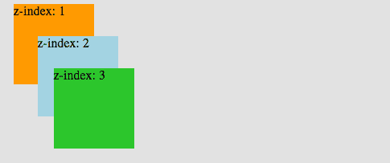
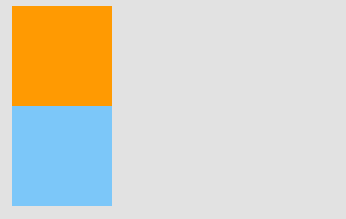
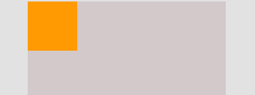
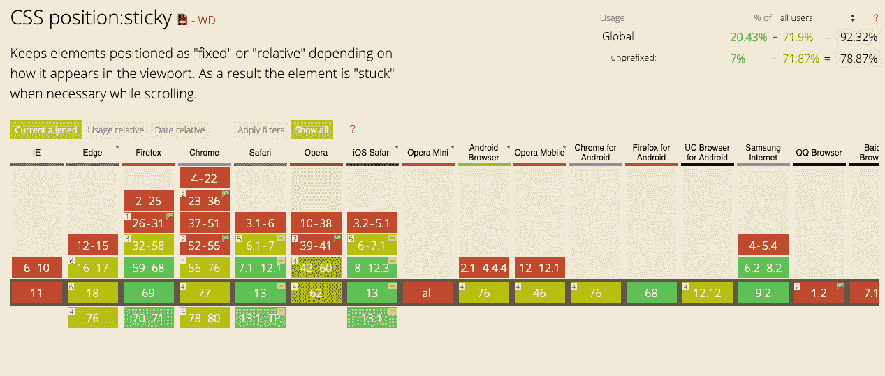

# 如何使用 CSS 中的 position 属性来对齐元素

> 原文：<https://www.freecodecamp.org/news/how-to-use-the-position-property-in-css-to-align-elements-d8f49c403a26/>

在 web 开发中用 CSS 定位元素并不像看起来那么简单。随着项目越来越大，事情会变得越来越复杂，如果没有很好地理解 CSS 如何处理对齐 HTML 元素，您将无法解决对齐问题。

用纯 CSS 定位元素有不同的方式/方法。使用 CSS **浮动，显示**和**位置**属性是最常见的方法。

在本文中，我将解释用纯 CSS 对齐元素的最令人困惑的方法之一: ****位置属性。**** 我这里还有另外一个 [CSS 显示属性的教程](https://www.youtube.com/watch?v=hgoFi0fCv3w)。

如果你愿意，你可以观看 CSS 定位教程的视频版本:

[https://www.youtube.com/embed/NYEEN4rs4T8?feature=oembed](https://www.youtube.com/embed/NYEEN4rs4T8?feature=oembed)

我们开始吧...

### CSS 位置和辅助属性

所以 ****位置**属性 **:**** 有 5 个主值

`position: static | relative | absolute | fixed | sticky`

以及设置一个元素坐标的附加属性(我称之为 ****【助手属性】**** ):

`top | right | bottom | left`和`z-index`

> ***重要说明** ***:** 助手属性没有声明位置就不起作用，或者用 ****位置:静态。******

#### 这个 z 索引是什么？

我们有高度和宽度(x，y)两个维度。z 是第三维度。随着其`z-index`值的增加，网页中的一个元素出现在其他元素的前面。

> ****Z-index**** 不与`position: static`或没有声明的位置一起工作。



Elements are ordered from back to front, as their **z-index **increase

您可以在我的频道上观看视频，了解如何更详细地使用 **z-index** :

[https://www.youtube.com/embed/vo1JBj-OAa8?feature=oembed](https://www.youtube.com/embed/vo1JBj-OAa8?feature=oembed)

现在让我们继续讨论 ****位置**属性**值**...**

### 1.静态

`position: static`是**的默认值**。无论我们声明与否，元素在网页上都是以正常的顺序放置的。我们举个例子:

首先，我们定义我们的 HTML 结构:

```
<body>
  <div class="box-orange"></div>
  <div class="box-blue"></div>
</body>
```

然后，我们创建两个盒子，并定义它们的宽度、高度和位置:

```
.box-orange {          // without any position declaration
  background: orange;
  height: 100px;
  width: 100px;       
}

.box-blue {
  background: lightskyblue;
  height: 100px;
  width: 100px; 
  position: static;   // Declared as static
}
```



same result with & without **position: static**

如图所示，定义**位置:静态**与否没有任何区别。箱子按照**正常文件流程**放置。

### 2.亲戚

`position: relative` : **元素相对于其正常位置的新位置。**

从`position: relative`开始，对于所有 ****非静态**** 位置值，我们能够通过使用我上面提到的**助手属性**来改变元素的 ****默认**** 位置。

让我们把橙色的盒子移到蓝色的旁边。

```
.box-orange {
  position: relative;  // We are now ready to move the element
  background: orange;
  width: 100px;
  height: 100px;
  top: 100px;         // 100px from top relative to its old position
  left: 100px;        // 100px from left
}
```


**Orange box is moved 100px to bottom & right, relative to its normal position**

> **注意:使用 ****位置:相对于某个元素的**** ，不影响其他元素的位置。**

### 3.绝对的

在`position: relative`中，元素相对于自身定位于 ****。**** 但是，一个 ****绝对** ly** 定位的元素是相对于其父 的**。**

带有`position: absolute`的元素从正常文档流中删除。它会自动定位到其父元素的起点(****)****)。如果它没有任何父元素，那么初始的 ****文档< html >**** 将是它的父元素。

由于`position: absolute`从文档流中移除元素，其他元素 ****受到影响**** 并且表现为该元素完全从网页中移除。

让我们添加一个 ****容器**** 作为父元素:

```
<body>
  <div class="container">
    <div class="box-orange"></div>
    <div class="box-blue"></div>
  </div>
</body>
```

```
.box-orange {
  position: absolute;
  background: orange;
  width: 100px;
  height: 100px;
}
```



**position: absolute** takes the element to the **beginning** of its parent

现在看起来蓝盒子消失了，其实没有。蓝色框的行为类似于橙色框被移除，因此它向上移动到橙色框的位置。

让我们将橙色框移动 5 个像素:

```
.box-orange {
  position: absolute;
  background: orange;
  width: 100px;
  height: 100px;
  left: 5px;
  top: 5px;
}
```


**Now we can see the blue box**

一个 ****绝对**** 定位元素的坐标是 ****相对于其父**** 如果父元素也有一个 ****非静态位置。**** 否则，帮助器属性相对于 ****初始< html >定位元素。****

```
.container {
  position: relative;
  background: lightgray;
}

.box-orange {
  position: absolute;
  background: orange;
  width: 100px;
  height: 100px;
  right: 5px;    // 5px relative to the most-right of parent
}
```


### 4.固定的；不变的

像`position: absolute`一样，固定位置的元素也被从正常的文档流中删除。不同之处在于:

*   它们是 ****只相对于< html >文档，**** 不是任何其他的父级。
*   他们是不受滚动影响的****。****

```
`.container {
  position: relative;
  background: lightgray;
}

.box-orange {
  position: fixed;
  background: orange;
  width: 100px;
  height: 100px;
  right: 5px;    // 5px relative to the most-right of parent
}`
```

**在这里的例子中，我将橙色框的位置改为 ****固定**** ，这次是相对于 ****< html >**** 右边的 5px，而不是它的 ****父(容器)** :****

 **[https://codepen.io/cem_eygi/embed/preview/EebjaB?height=300&slug-hash=EebjaB&default-tabs=css,result&host=https://codepen.io](https://codepen.io/cem_eygi/embed/preview/EebjaB?height=300&slug-hash=EebjaB&default-tabs=css,result&host=https://codepen.io)** 

**我们可以看到，滚动页面并不影响 ****固定**** 定位框。它不再与其父容器相关。**

### **5.粘的**

**`position: sticky`可以解释为`position: relative`和`position: fixed`的混合。**

**它的行为一直持续到像`position: relative`这样的声明点，之后它将其行为改变为`position: fixed`。解释 ****位置的最好方法；就是举一个例子来说明**** 的粘性；**

 **[https://codepen.io/cem_eygi/embed/preview/RYjrWz?height=300&slug-hash=RYjrWz&default-tabs=css,result&host=https://codepen.io](https://codepen.io/cem_eygi/embed/preview/RYjrWz?height=300&slug-hash=RYjrWz&default-tabs=css,result&host=https://codepen.io)** 

******重要:****ie 浏览器及其他浏览器的早期版本不支持位置粘滞。**你可以在[caniuse.com](https://caniuse.com)查看浏览器支持。****

**

Browser Support for Position:sticky** 

* * *

**理解 CSS 位置属性的最好方法是实践。继续编码，直到你有更好的理解。如果有不清楚的地方，我会在下面的评论区回答你的问题。**

****如果你想了解更多关于 web 开发的知识，欢迎在 Youtube 上关注我**[](https://www.youtube.com/channel/UC1EgYPCvKCXFn8HlpoJwY3Q)****！******

****感谢您的阅读！****