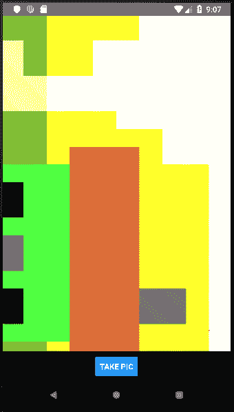
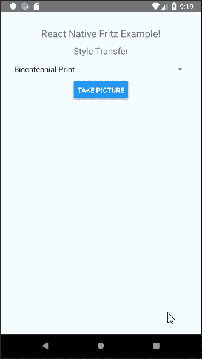

# 如何在 React Native with Fritz 中使用样式转换 API

> 原文：<https://www.freecodecamp.org/news/how-to-use-the-style-transfer-api-in-react-native-with-fritz-e90bc609fb17/>

Fritz 是一个平台，旨在使开发者能够轻松地为他们的移动应用提供机器学习功能。目前，它有一个适用于 Android 和 iOS 的 SDK。SDK 包含可用于以下功能的现成 API:

1.  [物体检测](https://www.fritz.ai/features/object-detection.html)
2.  [图像标注](https://www.fritz.ai/features/image-labeling.html)
3.  [风格转移](https://www.fritz.ai/features/style-transfer.html)
4.  [图像分割](https://www.fritz.ai/features/image-segmentation.html)
5.  [姿态估计](https://www.fritz.ai/features/pose-estimation.html)

今天，我们将探讨如何在 React Native 中使用样式转换 API。

我只能在 Android 上开发和测试(这里没有 MAC！)并得到了工作申请。

样式传输 API 根据真实艺术杰作来设计图像或视频的样式。有 11 种预先训练的艺术风格，包括梵高的《星夜》和蒙克的《呐喊》等。

我们将开发的应用程序允许用户拍照，并将其转换成一个风格的图像。它还允许用户选择他们希望在图像上使用的艺术风格。

该应用程序将包含一个主页，用户可以选择艺术风格。它还将包括一个单独的相机视图，用户在那里捕捉图像。

> 注意:以下教程仅适用于 Android 平台。

#### 先决条件

1.  React Native CLI:运行`npm i -g react-native-cli`以全局安装 CLI

因为 Fritz 没有默认的 React 本机模块，所以我们需要自己编写。编写本机模块意味着编写真正的本机代码，以便在一个或两个平台上使用。

### 步骤 1 —创建 RN 应用程序并安装模块

要创建应用程序，请在终端中运行以下命令:

```
react-native init <appname>
```

移动到文件夹的根目录开始配置。

对于导航，我们将使用[反应导航](https://reactnavigation.org/)和[反应本地相机](https://github.com/react-native-community/react-native-camera)的相机视图。

要安装这两个依赖项，请在终端中运行以下命令:

```
npm i --save react-navigation react-native-camera
```

按照此处的说明[为应用程序配置 React 导航。我们还需要安装`react-native-gesture-handler`，因为它是 React 导航的一个依赖项。](https://reactnavigation.org/docs/en/getting-started.html#installation)

按照此处的说明[为应用程序配置 React 原生摄像头。我们可以在第 6 步停止，因为在这个例子中，我们不会使用文本、人脸或条形码识别。](https://github.com/react-native-community/react-native-camera#android)

### 步骤 2 —在应用中包含 Fritz SDK

首先，我们需要创建一个 Fritz 帐户和一个新项目。

从项目概述中，单击 Add to Android 以包含 Android 平台的 SDK。我们需要包括一个应用程序名称和应用程序 ID。应用程序 ID 可以在标签`defaultConfig`内的`android/app/build.gradle`中找到。

注册应用程序时，我们需要在`android/build.gradle`中添加以下几行:

```
allprojects {    
	.....    
    repositories {        
    	.....        
        maven { url "https://raw.github.com/fritzlabs/fritz-repository/master" } //add this line    
    }
}
```

之后，在`android/app/build.gradle`中包含依赖关系:

```
dependencies {    
	implementation 'ai.fritz:core:3.0.2'
}
```

我们需要更新`AndroidManifest.xml`文件，以允许应用程序使用互联网并注册 Fritz 服务:

```
<manifest xmlns:android="http://schemas.android.com/apk/res/android">
	.....    
	<uses-permission android:name="android.permission.INTERNET" />    
    <application>        
    	.....        
        <service            
        	android:name="ai.fritz.core.FritzCustomModelService"            
            android:exported="true"            
            android:permission="android.permission.BIND_JOB_SERVICE" />    
    </application>
</manifest>
```

然后我们需要在`MainActivity.java`中包含以下方法:

```
import ai.fritz.core.Fritz;
import android.os.Bundle; //import these two as well

public class MainActivity extends ReactActivity {    
	.....    
    @Override    
    protected void onCreate(Bundle savedInstanceState) {        
    	// Initialize Fritz        
        Fritz.configure(this, "<api-key>");    
    }
}
```

### 步骤 3 —创建本机模块

由于 SDK 只支持 iOS 和 Android，我们需要制作原生模块。要更好地理解这一点，请参考以下文档:

[**原生模块 React Native**](https://facebook.github.io/react-native/docs/native-modules-android)
[*有时候一个 app 需要访问一个平台 API，React Native 还没有对应的模块。也许……*Facebook . github . io](https://facebook.github.io/react-native/docs/native-modules-android)

要制作一个 Android 原生模块，我们需要制作两个新文件。它们将位于 Android 源文件夹的根包中。

1.  `FritzStyleModule`:这包含了返回样式图像的代码
2.  `FritzStylePackage`:注册模块，以便应用程序的 JavaScript 端可以使用它。

#### FritzStyleModule

```
package com.fritzexample;

import com.facebook.react.bridge.Callback;
import com.facebook.react.bridge.ReactApplicationContext;
import com.facebook.react.bridge.ReactContextBaseJavaModule;
import com.facebook.react.bridge.ReactMethod;

import java.util.*;
import java.io.*;
import android.graphics.*;

import ai.fritz.fritzvisionstylepaintings.PaintingStyles;
import ai.fritz.vision.styletransfer.*;
import ai.fritz.core.FritzOnDeviceModel;
import ai.fritz.vision.*;

public class FritzStyleModule extends ReactContextBaseJavaModule {
    private final ReactApplicationContext reactContext;

    public FritzStyleModule(ReactApplicationContext reactContext) {
        super(reactContext);
        this.reactContext = reactContext;
    }

    @Override
    public String getName() {
        return "FritzStyle";
    }

    @ReactMethod
    public void getNewImage(String image, String filter, Callback errorCallback, Callback successCallback) {

        try {

            // Get the style of painting the user wishes to convert the image into.

            FritzOnDeviceModel styleOnDeviceModel;

            switch (filter) {
            case "STARRY_NIGHT":
                styleOnDeviceModel = PaintingStyles.STARRY_NIGHT;
                break;
            case "BICENTENNIAL_PRINT":
                styleOnDeviceModel = PaintingStyles.BICENTENNIAL_PRINT;
                break;
            case "FEMMES":
                styleOnDeviceModel = PaintingStyles.FEMMES;
                break;
            case "HEAD_OF_CLOWN":
                styleOnDeviceModel = PaintingStyles.HEAD_OF_CLOWN;
                break;
            case "HORSES_ON_SEASHORE":
                styleOnDeviceModel = PaintingStyles.HORSES_ON_SEASHORE;
                break;
            case "KALEIDOSCOPE":
                styleOnDeviceModel = PaintingStyles.KALEIDOSCOPE;
                break;
            case "PINK_BLUE_RHOMBUS":
                styleOnDeviceModel = PaintingStyles.PINK_BLUE_RHOMBUS;
                break;
            case "POPPY_FIELD":
                styleOnDeviceModel = PaintingStyles.POPPY_FIELD;
                break;
            case "RITMO_PLASTICO":
                styleOnDeviceModel = PaintingStyles.RITMO_PLASTICO;
                break;
            case "THE_SCREAM":
                styleOnDeviceModel = PaintingStyles.THE_SCREAM;
                break;
            case "THE_TRAIL":
                styleOnDeviceModel = PaintingStyles.THE_TRAIL;
                break;
            default:
                styleOnDeviceModel = PaintingStyles.THE_TRAIL;
                break;
            }

            // Initialize the style Predictor with the selected artwork style.
            FritzVisionStylePredictor stylePredictor = FritzVision.StyleTransfer.getPredictor(styleOnDeviceModel);

            // Get the Base 64 encoder and decoder.
            Base64.Decoder decoder = Base64.getDecoder();
            Base64.Encoder encoder = Base64.getEncoder();

            // Decode the base 64 image into an array of bytes.
            byte[] decodedString = decoder.decode(image);

            // Convert the byte array into an Bitmap image from the beginning (0) to the end
            // (decodedString.length) of the array.
            Bitmap bitmap = BitmapFactory.decodeByteArray(decodedString, 0, decodedString.length);

            // A standard input class for the style Predictor.
            FritzVisionImage visionImage = FritzVisionImage.fromBitmap(bitmap);

            // Convert the normal image into a styled image according to the selected
            // artwork style.
            FritzVisionStyleResult styleResult = stylePredictor.predict(visionImage);

            // Get a Bitmap image from the styled Result.
            Bitmap styledBitmap = styleResult.getResultBitmap();

            ByteArrayOutputStream baos = new ByteArrayOutputStream();

            // Compress the Bitmap image into a .png image and add it to the output stream
            // baos.
            styledBitmap.compress(Bitmap.CompressFormat.PNG, 0, baos);

            // Convert the output stream into a byte array.
            byte[] b = baos.toByteArray();

            // Encode the byte array into a base 64 image.
            String newImage = encoder.encodeToString(b);

            // Send the styled images' base 64 string through the success callback to the
            // Javascript side.
            successCallback.invoke(newImage);

        } catch (Exception e) {

            errorCallback.invoke(e.getMessage());

        }

    }

}
```

正在使用的 React 方法有一个成功和错误回调。所选的作品样式和原始图像的 base64 被发送到该方法。当抛出`Exception`并返回错误时，调用错误回调。成功回调返回转换后图像的 base64 编码字符串。在高层次上，上述代码执行以下操作:

1.  用用户选择的图稿初始化样式预测器。
2.  将原始 base64 图像转换为`Bitmap`。
3.  创建一个`FritzVisionImage`，它是样式预测器的输入。
4.  将`FritzVisionImage`转换为样式化的`FritzVisionStyleResult`，即转换后的图像。
5.  从`FritzVisionStyleResult`中获取一个`Bitmap`。
6.  将`Bitmap`转换成 base64 格式，然后发送回应用程序的 JavaScript 端。

#### FritzStylePackage

```
package com.fritzexample;

import com.facebook.react.ReactPackage;
import com.facebook.react.bridge.NativeModule;
import com.facebook.react.bridge.ReactApplicationContext;
import com.facebook.react.uimanager.ViewManager;

import java.util.ArrayList;
import java.util.Collections;
import java.util.List;

public class FritzStylePackage implements ReactPackage {

    @Override
    public List<NativeModule> createNativeModules(ReactApplicationContext reactContext) {
        List<NativeModule> modules = new ArrayList<>();

        // Append the DataUsage Module to the list of Native module list, that is
        // reffered by the React-Native code
        modules.add(new FritzStyleModule(reactContext));
        return modules;
    }

    @Override
    public List<ViewManager> createViewManagers(ReactApplicationContext reactContext) {
        return Collections.emptyList();
    }
}
```

这个类用于注册包，这样就可以在应用程序的 JavaScript 端调用它。

该类也在`MainApplication.java`的`getPackages()`中初始化:

```
@Override
protected List<ReactPackage> getPackages() {  
	return Arrays.<ReactPackage>asList(    
    	new MainReactPackage(),    
        ......,     
        new FritzStylePackage() //Add this line and import it on top  
        );
}
```

现在来看看应用程序的 JavaScript 方面。

### 步骤 4 —创建用户界面

为此，我们将创建/更新以下页面:

1.  Home.js —显示图稿样式的选取器和最终结果。
2.  CameraContainer.js 显示相机视图以捕捉图像。
3.  FritzModule.js —将上面创建的原生模块导出到 JavaScript 端。
4.  App.js —包含导航堆栈的应用程序的根。

#### Home.js

```
import React, { Component } from 'react';
import { StyleSheet, Text, View, Button, Image, Picker } from 'react-native';
import { ScrollView } from 'react-native-gesture-handler';

export default class Home extends Component {

    // Hide the header
    static navigationOptions = {
        header: null,
    }

    constructor(props) {
        super(props);

        // initialize the picker with the first value
        this.state = {
            filter: "BICENTENNIAL_PRINT"
        }
    }

    render() {

        // Get the following parameters from navigation props, if they have a value.
        const { navigation } = this.props;
        const oldImage = navigation.getParam('oldImage');
        const newImage = navigation.getParam('newImage');

        return (
            <View style={styles.container}>
                <ScrollView>
                    <View style={styles.innerContainer}>
                        <Text style={styles.welcome}>React Native Fritz Example!</Text>
                        <Text style={{ fontSize: 18 }}>Style Transfer</Text>
                        <Picker style={{ width: "100%" }} selectedValue={this.state.filter} mode="dropdown" onValueChange={(value) => this.setState({ filter: value })}>
                            <Picker.Item value="BICENTENNIAL_PRINT" label="Bicentennial Print" />
                            <Picker.Item value="FEMMES" label="Femmes" />
                            <Picker.Item value="HEAD_OF_CLOWN" label="Head of Clown" />
                            <Picker.Item value="HORSES_ON_SEASHORE" label="Horses on Seashore" />
                            <Picker.Item value="KALEIDOSCOPE" label="Kaleidoscope" />
                            <Picker.Item value="PINK_BLUE_RHOMBUS" label="Pink Blue Rhombus" />
                            <Picker.Item value="POPPY_FIELD" label="Poppy Field" />
                            <Picker.Item value="RITMO_PLASTICO" label="Ritmo Plastico" />
                            <Picker.Item value="STARRY_NIGHT" label="Starry Night" />
                            <Picker.Item value="THE_SCREAM" label="The Scream" />
                            <Picker.Item value="THE_TRAIL" label="The Trail" />
                        </Picker>
                        <Button title="Take Picture" onPress={() => this.props.navigation.navigate('Camera', { filter: this.state.filter })} />
                        {/* Display the images, only if the values are not undefined or empty strings */}
                        {oldImage && <Image style={styles.imageStyle} source={{ uri: 'data:image/png;base64,' + oldImage }} />}
                        {newImage && <Image style={styles.imageStyle} source={{ uri: 'data:image/png;base64,' + newImage }} />}
                    </View>
                </ScrollView>
            </View>
        );
    }
}

const styles = StyleSheet.create({
    container: {
        flex: 1,
        flexDirection: 'column',
        backgroundColor: '#F5FCFF',
    },
    innerContainer: {
        flex: 1,
        flexDirection: 'column',
        justifyContent: "center",
        alignItems: "center",
        padding: 20
    },
    welcome: {
        fontSize: 20,
        textAlign: 'center',
        margin: 10,
    },
    imageStyle: {
        width: 250,
        height: 250,
        marginVertical: 5
    }
}); 
```

此页面包含:

1.  显示应用程序描述的文本。
2.  选取器，允许用户选择转换图像的插图样式。
3.  按钮将用户重定向到摄像头页面。它会将选定的艺术作品样式传递给 CameraContainer。
4.  如果导航道具包含原始和转换后的图像，它将被显示。

该页面当前如下所示；


Home page before taking a picture

#### CameraContainer.js

```
import React, { Component } from 'react';
import { RNCamera } from 'react-native-camera';
import { View, StyleSheet, Button, Alert, ActivityIndicator } from 'react-native';
import FritzStyle from "./FritzModule";

const styles = StyleSheet.create({
    container: {
        flex: 1,
        flexDirection: 'column',
        backgroundColor: "#000",
        position: 'absolute',
        height: '100%',
        width: '100%'
    },
    preview: {
        flex: 1,
        justifyContent: 'flex-end',
        alignItems: 'center',
    },
    cameraButton: {
        position: "absolute",
        bottom: 0,
        width: "100%",
        backgroundColor: "#000",
        alignItems: "center",
        justifyContent: "center",
        paddingVertical: 10
    },
});

class CameraContainer extends Component {

    // Hide the header
    static navigationOptions = {
        header: null,
    }

    constructor(props) {
        super(props);

        // Initialize below properties
        this.state = {
            oldImage: '',
            newImage: '',
            loading: false
        };
    }

    render() {

        return (
            <View style={styles.container}>
                <RNCamera
                    ref={ref => {
                        this.camera = ref;
                    }}
                    style={styles.preview}
                    type={RNCamera.Constants.Type.back}
                    captureAudio={false}
                >
                    {/* Display the button to take picture only if camera permission is given */}
                    {({ camera, status }) => {
                        if ((status !== 'NOT_AUTHORIZED')) {
                            return (
                                <View style={styles.cameraButton}>
                                    {/* Display spinner if loading, if not display button */}
                                    {this.state.loading ? <ActivityIndicator size="large" color="#FFF" /> : <Button onPress={this.takePicture.bind(this)} title={"Take Pic"} />}
                                </View>
                            );
                        }
                    }}
                </RNCamera>
            </View>

        );
    }

    takePicture = async function () {

        // set loading to true on button click, to show user and action is taking place.
        this.setState({ loading: true });

        // Get the chosen artwork filter picked byt user.
        const { navigation } = this.props;
        const filter = navigation.getParam('filter');

        // If the reference to the camera exists.
        if (this.camera) {

            // Take a base64 image with the following options.
            const options = { quality: 0.75, base64: true, maxWidth: 500, maxHeight: 500, fixOrientation: true };
            const data = await this.camera.takePictureAsync(options);

            // Set the old image as the one captured above.
            this.setState({
                oldImage: data.base64
            },
                () => {

                    // Call the native module method and pass the base64 of the original image and name of selected artwork style.
                    FritzStyle.getNewImage(data.base64, filter,
                        // Error Callback
                        (error) => {
                            // Display an alert to tell user an Arror was encountered.
                            console.log(error);
                            Alert.alert("Alert", "An Error has occured.");
                        },
                        //Success Callback
                        (newData) => {

                            // Set the new image as the one sent from the success callback.
                            this.setState({
                                newImage: newData
                            },
                                () => {

                                    // Navigate to the Home page, while passing the old and converted image.
                                    this.props.navigation.navigate("Home", {
                                        oldImage: this.state.oldImage,
                                        newImage: this.state.newImage
                                    });
                                });
                        });
                }
            );
        }
    }
}

export default CameraContainer;
```

CameraContainer 页面显示整页的 CameraView。在页面底部有一个拍照按钮。单击它时，将显示一个微调器，向用户传达一个动作正在发生。

首先使用 react-native-camera 方法`takePictureAsync()`捕捉图像。原始图像然后被保存到页面的状态中。`setState`方法是异步的，因此有一个在状态设置后运行的成功回调。

来自`FritzModule`的`getNewImage`方法在这个成功回调中运行。从主页中选取的原始图像和滤镜(插图样式)被传递给方法。在错误回调时，会向用户显示一个警告，告知发生了错误。在成功回调时，新样式的图像被保存到状态中。在第二次`setState`方法的成功回调中，用户被重定向到包含原始图像和样式化图像的主页。



CameraContainer on emulator

#### FritzModule.js

```
import { NativeModules } from 'react-native';
export default NativeModules.FritzStyle;
```

该页面公开了本机模块`FritzStyle`。这允许 JavaScript 端调用方法`getNewImage`。

#### App.js

```
import React, { Component } from 'react';
import Home from './src/Home';
import CameraContainer from './src/CameraContainer';
import { createStackNavigator, createAppContainer } from 'react-navigation';

const AppNavigator = createStackNavigator({  
	Home: { screen: Home },  
    Camera: { screen: CameraContainer }
});

const AppContainer = createAppContainer(AppNavigator);

export default class App extends Component {
	render() {    
    	return (
        	<AppContainer />
        );  
    }
}
```

首先，我们用主页和摄像机视图创建堆栈导航器。导航到主页时使用“Home”键，导航到 CameraContainer 时使用“Camera”键。

`AppContainer`成为应用程序的根组件。它也是管理应用程序状态的组件。

现在来看看整个应用程序的功能；



### 概括地说，我们有:

1.  创建了一个 React 本地应用程序，
2.  包括了 Fritz SDK，
3.  创建了一个使用样式转换 API 的本机模块，并且
4.  设计了一个 UI 来显示样式化的图像。

找到代码 repo，[这里](https://github.com/samsam-026/FritzExample)。

对于 Fritz 的 Style Transfer API 的原生 iOS 或 Android 实现，请查看以下教程:

[**Android 实时风格传输-将您的照片和视频转换为杰作**](https://heartbeat.fritz.ai/real-time-style-transfer-for-android-6a9d238dfdb5)
[*风格传输允许您从毕加索和梵高等艺术家那里获得灵感，并将普通图像转换为…*heart beat . fritz . ai](https://heartbeat.fritz.ai/real-time-style-transfer-for-android-6a9d238dfdb5)[**iOS 实时风格传输-将您的照片和视频转换为杰作**](https://heartbeat.fritz.ai/real-time-style-transfer-for-ios-transform-your-photos-and-videos-into-masterpieces-f04111fcd2ff)
[heart beat . fritz . ai](https://heartbeat.fritz.ai/real-time-style-transfer-for-ios-transform-your-photos-and-videos-into-masterpieces-f04111fcd2ff)