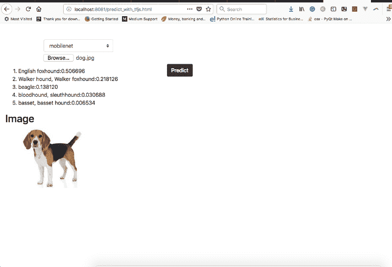
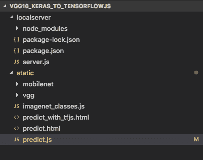
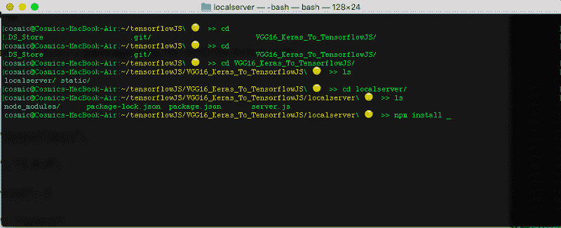
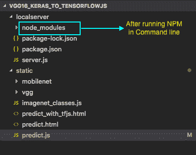
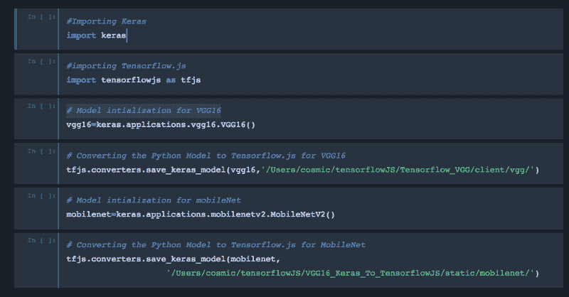
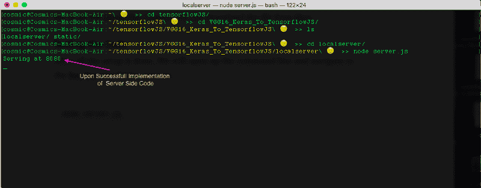

# 如何通过 TensorFlow.js 使用 VGG16 神经网络和 MobileNet

> 原文：<https://www.freecodecamp.org/news/how-to-use-the-vgg16-neural-network-and-mobilenet-with-tensorflow-js-ea4c76d0b8e0/>

通过 ADL

# 如何通过 TensorFlow.js 使用 VGG16 神经网络和 MobileNet


Photo by [Artem Sapegin](https://unsplash.com/@sapegin?utm_source=medium&utm_medium=referral) on [Unsplash](https://unsplash.com?utm_source=medium&utm_medium=referral)

在本文中，我们将使用 JavaScript & TensorFlow.js 构建一个深度神经网络，该网络可以在客户端以高精度识别图像。我将解释整个过程中使用的技术。为了便于演示，我们将使用 VGG16 和 MobileNet。

如果你需要快速复习 TensorFlow.js，请阅读这篇文章。

下面是最终 web 应用程序的屏幕截图:



Final Web App

首先，我们将创建一个文件夹**(vgg 16 _ Keras _ To _ TensorflowJS)**，其中包含两个子文件夹: **localserver** 和 **static。****local server**文件夹将包含所有的服务器 **NodeJS** 代码，而**静态**文件夹将包含所有的 CSS、HTML 和 JavaScript 代码。



Screenshot Showing the Folder structure

> 注意:你可以随意命名文件夹和文件。

### 服务器配置

我们将使用以下代码手动创建一个 **package.json** 文件:

```
{
```

```
"name": "tensorflowjs",
```

```
"version": "1.0.0",
```

```
"dependencies": {
```

```
"express": "latest"
```

```
}}
```

**package.json** 文件记录了我们将在这个项目中使用的所有第三方包。保存 **package.json** 文件后，我们将打开命令行，在其中我们将导航到 **localserver** 文件夹。然后，我们将执行以下命令:

```
npm install
```



Command Line for MacOS

之后，NPM 将执行并确保 **package.json** 中提到的所有必需的包都已安装并准备好使用。您将在**本地服务器**文件夹中看到一个**节点模块**文件夹。



我们将使用以下代码创建一个 **server.js** 文件:

**server.js** 包含 NodeJS 代码，它允许本地服务器运行我们的 WebApp。

### 客户端配置

接下来我们将创建一个 **predict_with_tfjs.html** 。下面是代码:

HTML 代码完成后，我们将创建一个 JavaScript 文件，并将其命名为 **predict.js** 。下面是代码:

### 模型配置

一旦客户端和服务器端代码完成，我们现在需要一个 DL/ML 模型来预测图像。我们将训练好的模型(VGG16 和移动网络)从 Keras 导出到 TensorFlow.js。将输出分别保存在静态文件夹中名为 VGG 和移动网络的文件夹中。



ScreenShot for Python

### 定义类别

我们将把 **imagenet_classes.js** 保存在**静态**文件夹中。该文件包含所有 ImageNet 类的列表。*你可以从[这里](https://github.com/ADLsourceCode/TensorflowJS/blob/master/VGG16_Keras_To_TensorflowJS/static/imagenet_classes.js)下载这个文件。*

### 测试代码

所有设置完成后，我们将打开命令行，导航到 **localserver** 文件夹并执行:

```
node server.js
```

我们应该会看到下面的输出:



成功实现服务器端代码后，我们现在可以去浏览器打开[**http://localhost:8080/predict _ with _ tfjs . html**](http://localhost:8080/predict_with_tfjs.html)。
如果客户端代码没有错误，应用程序将会启动。然后您可以从选择框中选择不同的型号(VGG16 和移动网)并进行预测。

#### **项目的 GitHub 库:**

[**ADLsourceCode/TensorflowJS**](https://github.com/ADLsourceCode/TensorflowJS/tree/master/VGG16_Keras_To_TensorflowJS)
[*GitHub 是人们构建软件的地方。超过 2800 万人使用 GitHub 来发现、分享和贡献超过…*github.com](https://github.com/ADLsourceCode/TensorflowJS/tree/master/VGG16_Keras_To_TensorflowJS)

**您可以在下面的视频中观看完整的代码解释和实现:**

> 我的下一篇文章将涉及**金融时间序列分析**使用 Tensorflow.js… [敬请关注](https://goo.gl/u72j6u)。

祝你好运！？

如果你喜欢我的文章，请点击？下面 A nd 跟我上 M**edium**:


如果你有任何问题，请在下面的评论中或者 [**Twitter**](https://twitter.com/I_AM_ADL) 告诉我。订阅我的 YouTube 频道获取更多科技视频: [**ADL**](https://goo.gl/u72j6u) 。