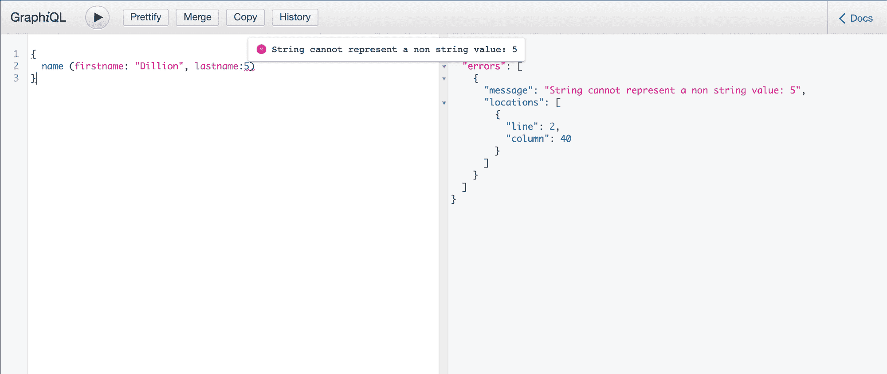
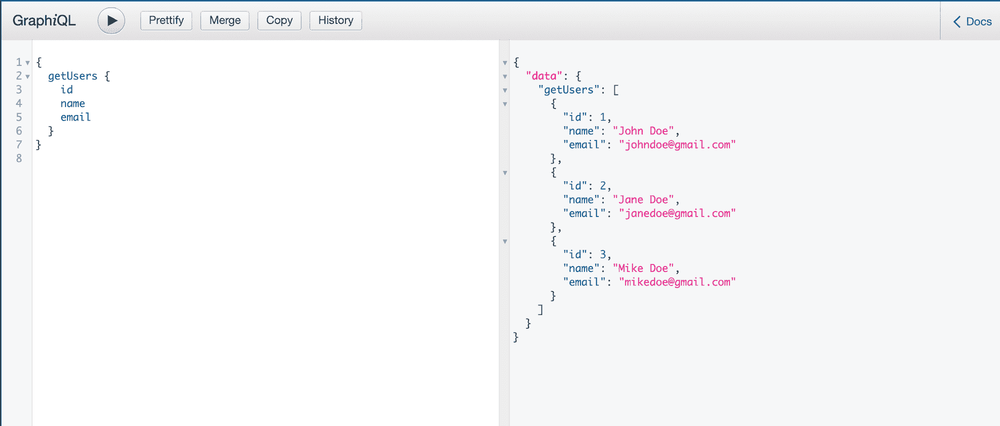
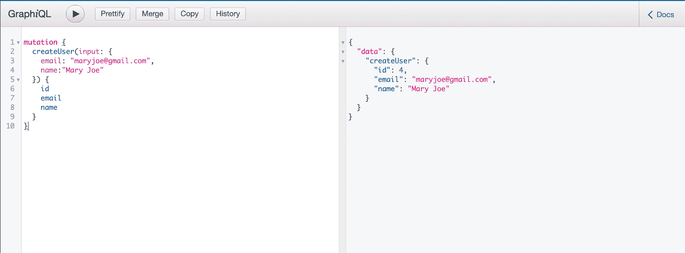

# 如何将 TypeScript 与 GraphQL 一起使用使用 TypeGraphQL

> 原文：<https://www.freecodecamp.org/news/how-to-use-typescript-with-graphql/>

在本教程中，我将解释什么是 TypeScript 和 GraphQL，以及使用它们的好处。

然后，我将向您展示如何使用 TypeGrapQL 将它们结合起来使用，以及为什么要这样做。

## 什么是 TypeScript？

TypeScript 是 JavaScript 的超集，编译成 JavaScript 用于生产。它就像 JavaScript，但是有强大的功能——类型的功能。

TypeScript 帮助您构建类型化的应用程序，帮助您避免这些应用程序中的静态类型错误，并生成可预测的代码。

如果没有 TypeScript，声明接收字符串类型参数的函数可能会在执行期间接收数字类型参数，并且您可能会得到运行时错误。这对于生产代码可能是不利的。

使用 TypeScript，除非传递适当的类型，否则这样的函数将导致编译时错误。

TypeScript 可以处理不止一个基本类型。它还可以确保键入正确的、预期的、结构化的对象。这意味着缺少对象属性也会导致错误。

TypeScript 通过类型检查帮助我们在开发过程中构建更可预测的 JavaScript 代码。它还被集成到像 VSCode 这样的编辑器中，这使得在编写代码时更容易发现类型错误。

TypeScript 需要一个额外的步骤来编译成 JavaScript 以便使用。虽然 React 等一些库在内部为您完成了这项工作，但是如果您在没有这些工具的情况下进行构建，您可能需要自己进行设置。但我认为这是值得的。

## GraphQL 是什么？

GraphQL 是管理 API 的另一种方法。它是 Rest APIs 的替代，允许您“只请求您需要的数据”。这有助于减少需要从服务器发送到客户端的数据量。

例如，使用 Rest API，一个端点可能会返回所有用户的数据，而此时只需要他们的电子邮件和电话号码。这被称为“过度提取”。使用 GraphQL，客户端可以请求这样的特定数据。

GraphQL 还带有类型定义，它存在于模式对象中。GraphQL 使用模式对象来了解哪些属性是可查询的，以及基本上可以接受的查询类型。当执行未被接受的查询时，它也会抛出错误。

然而，这些类型定义仅限于模式对象。它们不会在应用程序中提供整体的静态类型。这就是为什么 TypeScript 是一个很好的补充，我们将在本文的其余部分看到。

## 使用 TypeScript 和 GraphQL 的优势

使用 TypeScript 和 GraphQL 可以确保静态类型存在于整个应用程序中。

没有 TypeScript，您仍然可以使用 GraphQL 创建查询类型。但是这是有限制的。

GraphQL 类型仅存在于 GraphQL 模式中。GraphQL 库中的`buildSchema`函数用于创建模式对象:

```
const schema = buildSchema(`
    type Query {
        name(firstname: String!, lastname: String!): String
    }
`) 
```

我们已经创建了模式对象，现在我们需要一个解析器:

```
const root = {
    name: variables => {
        return `My name is ${firstname} ${lastname}!`
    },
} 
```

在 GraphQL playground 中使用错误输入的变量执行查询时，我们会得到错误:



GraphQL playground showing error for wrong type provided to query

但是解析器不知道模式对象中的类型定义。如您所见，解析器是一个常规的 JavaScript 函数。这意味着，我们在解析器中没有静态类型。

比方说，我们向解析器提供了错误的参数类型，或者我们从解析器返回了模式不期望的不同类型。我们可能会在不知道的情况下将错误引入到代码中。

这就是为什么 TypeScript 是有益的。使用 TypeScript，我们在模式对象和解析器中都有类型定义，从而使它们同步，并使我们的代码更加可预测。

## 如何使用 TypeScript 和 GraphQL

在本节中，我们将使用 TypeScript 和 GraphQL 在 Express 服务器上创建一个简单的 GraphQL API。

### 步骤 1:创建项目文件夹

您可以随意命名，但我们将在本教程中使用`graphql-ts-example`文件夹:

```
mkdir graphql-ts-example
cd graphql-ts-example
npm init -y 
```

### 步骤 2:安装依赖项

在本教程中，我们将使用以下依赖关系:

*   [graphql](https://www.npmjs.com/package/graphql) :用于 graphql 的 JavaScript 库
*   express:一个用于节点的 web 框架，允许我们创建 API 和一个后端服务器
*   [express-graphql](https://www.npmjs.com/package/express-graphql) :为 API 创建一个 graphql 服务器
*   [ts-node](https://www.npmjs.com/package/ts-node) :用于执行节点中的打字稿代码
*   [类型脚本](https://www.npmjs.com/package/typescript):用于将类型脚本代码编译成 JavaScript
*   [@types/express](https://www.npmjs.com/package/@types/express) :用于在 TypeScript 中使用 express
*   [nodemon](https://www.npmjs.com/package/nodemon) :用于在发生变化时重启服务器

在您的终端中，运行:

```
npm install graphql express express-graphql
npm install -D nodemon ts-node @types/express typescript 
```

为了测试我们的 API，我们将使用 express-graphql 提供的 GraphQL playground。

### 步骤 3:设置我们的脚本

在`package.json`中，将`scripts`对象更新为:

```
"scripts": {
    "start": "nodemon --exec ts-node src/index.ts",
} 
```

另外，为 TypeScript 添加一个配置文件，`tsconfig.json`:

```
{
    "compilerOptions": {
        "target": "es2018",
        "module": "commonjs",
        "jsx": "preserve",
        "strict": true,
        "esModuleInterop": true,
        "lib": ["es2018", "esnext.asynciterable"]
    },
    "exclude": ["node_modules"]
} 
```

有了这个，我们可以用`npm start`运行我们的服务器。

### 步骤 4:编写代码

我们将创建一个带有 GraphQL API 的 Express 服务器，它允许我们获取用户、创建用户和更新用户数据。

创建一个名为“src”的新目录，并将`index.ts`文件添加到其中。我们的导入文件如下:

```
import { buildSchema } from "graphql"
import express from "express"
import { graphqlHTTP } from "express-graphql" 
```

然后我们需要我们的用户列表。理想情况下，这将来自一个数据库，但我们将在这里硬编码:

```
const users = [
    { id: 1, name: "John Doe", email: "johndoe@gmail.com" },
    { id: 2, name: "Jane Doe", email: "janedoe@gmail.com" },
    { id: 3, name: "Mike Doe", email: "mikedoe@gmail.com" },
] 
```

接下来，我们构建 GraphQL 模式:

```
const schema = buildSchema(`
    input UserInput {
        email: String!
        name: String!

    }

    type User {
        id: Int!
        name: String!
        email: String!
    }

    type Mutation {
        createUser(input: UserInput): User
        updateUser(id: Int!, input: UserInput): User
    }

    type Query {
        getUser(id: String): User
        getUsers: [User]
    }
`) 
```

根据我们的模式，我们定义了:

*   具有两个必需属性的用户输入，这在创建用户时是必需的
*   具有三个必需属性的用户类型
*   GraphQL 的一个变种，我们创建用户和更新用户
*   和获取特定用户或所有用户的 GraphQL 查询。

现在，我们需要为静态类型定义我们的 TypeScript 类型:

```
 type User = {
    id: number
    name: string
    email: string
}

type UserInput = Pick<User, "email" | "name"> 
```

接下来，我们的解决方案:

```
const getUser = (args: { id: number }): User | undefined =>
    users.find(u => u.id === args.id)

const getUsers = (): User[] => users

const createUser = (args: { input: UserInput }): User => {
    const user = {
        id: users.length + 1,
        ...args.input,
    }
    users.push(user)

    return user
}

const updateUser = (args: { user: User }): User => {
    const index = users.findIndex(u => u.id === args.user.id)
    const targetUser = users[index]

    if (targetUser) users[index] = args.user

    return targetUser
}

const root = {
    getUser,
    getUsers,
    createUser,
    updateUser,
} 
```

最后，我们的快速路线和服务器:

```
const app = express()

app.use(
    "/graphql",
    graphqlHTTP({
        schema: schema,
        rootValue: root,
        graphiql: true,
    })
)

const PORT = 8000

app.listen(PORT)

console.log(`Running a GraphQL API server at http://localhost:${PORT}/graphql`) 
```

有了上面的内容，我们的解析器将按照模式定义进行类型化。这样，我们的解析器就同步了。在`localhost:4000/graphql`上，我们可以看到 GraphQL 游乐场:



GraphQL playground showing working queries

尽管我们可以看到 TypeScript 是多么有益，但我们也不能否认在创建 schema 对象后编写类型定义的麻烦。

这个代码库很小，所以更容易，但是想象一下大的东西，有许多解析器，并且必须为每个解析器创建类型定义😩

我们需要一种更好的方法来做这件事。我们需要一些东西，允许我们在一个地方创建类型定义，作为事实的主要来源，然后在我们的解析器和模式对象中使用它们。

## 如何使用 TypeGraphQL 来改进您的类型化 GraphQL

[TypeGraphQL](https://typegraphql.com/) 的目标是无缝地享受解析器中的静态类型，并从一个地方创建模式。

它自带语法，这又是一个学习过程。但这并不太陡峭——这是朝着正确方向迈出的一步。

让我们通过使用 TypeGraphQL 来改进我们的代码库。

我们需要几个依赖项:

*   [类验证器](https://www.npmjs.com/package/class-validator):允许使用[装饰器](https://www.typescriptlang.org/docs/handbook/decorators.html)进行验证
*   type-graph QL:typegraph QL 库本身，它允许您使用类和装饰器，用 TypeSCript 创建模式和解析器
*   [reflect-metadata](https://www.npmjs.com/package/reflect-metadata) :用于类型的运行时反射(在这里了解更多信息:[TypeScript 中的元数据反射](http://blog.wolksoftware.com/decorators-metadata-reflection-in-typescript-from-novice-to-expert-part-4))

在您的终端中，运行:

```
npm install class-validator type-graphql reflect-metadata 
```

在您的`tsconfig.json`中，将以下内容添加到`compilerOptions`对象中:

```
"compilerOptions": {
    // ...
    "emitDecoratorMetadata": true,
    "experimentalDecorators": true,
} 
```

这些很重要，这样 TypeScript 就不会抱怨 decorators 的使用。他们仍处于试验阶段。

现在，让我们使用 TypeGraphQL 更新我们的代码库。创建一个名为“用户”的新目录。在其中，我们将有模式和解析器。

在“用户”中创建新文件，名为“users.schema.ts”:

```
// users.schema.ts

import { Field, ObjectType, InputType } from "type-graphql"

@ObjectType()
export class User {
    @Field()
    id!: number
    @Field()
    name!: string
    @Field()
    email!: string
}

@InputType()
export class UserInput implements Pick<User, "name" | "email"> {
    @Field()
    name!: string
    @Field()
    email!: string
} 
```

首先，我们有了用`ObjectType`装饰器装饰的`User`类。这告诉 GraphQL 这个类是 GraphQL 类型。在 GraphQL 中，这被解释为:

```
buildSchema(`
    type User {
        id: Int!
        name: String!
        email: String!
    }

    input UserInput {
        name: String!
        email: String!
    }
`) 
```

接下来，我们的解决方案。在“用户”目录下创建一个`users.resolvers.ts`文件:

```
 // users.resolvers.ts

import { Query, Resolver, Mutation, Arg } from "type-graphql"
import { UserInput, User } from "./users.schema"

@Resolver(() => User)
export class UsersResolver {
    private users: User[] = [
        { id: 1, name: "John Doe", email: "johndoe@gmail.com" },
        { id: 2, name: "Jane Doe", email: "janedoe@gmail.com" },
        { id: 3, name: "Mike Doe", email: "mikedoe@gmail.com" },
    ]

    @Query(() => [User])
    async getUsers(): Promise<User[]> {
        return this.users
    }

    @Query(() => User)
    async getUser(@Arg("id") id: number): Promise<User | undefined> {
        const user = this.users.find(u => u.id === id)
        return user
    }

    @Mutation(() => User)
    async createUser(@Arg("input") input: UserInput): Promise<User> {
        const user = {
            id: this.users.length + 1,
            ...input,
        }

        this.users.push(user)
        return user
    }

    @Mutation(() => User)
    async updateUser(
        @Arg("id") id: number,
        @Arg("input") input: UserInput
    ): Promise<User> {
        const user = this.users.find(u => u.id === id)

        if (!user) {
            throw new Error("User not found")
        }

        const updatedUser = {
            ...user,
            ...input,
        }

        this.users = this.users.map(u => (u.id === id ? updatedUser : u))

        return updatedUser
    }
} 
```

这里有几个装饰者需要注意:

*   有一个`Resolver`装饰器，它用许多查询和变异解决方法将类装饰成一个对象。这里的美妙之处在于，我们在同一个类中定义了查询、变异和解决方法。
*   有一个`Query`装饰器，它告诉 GraphQL 这是一个查询和相应的解决方法
*   有一个`Mutation`装饰器，它告诉 GraphQL 这是一个变异和相应的解决方法
*   有一个`Arg`装饰器，它告诉 GraphQL 这个参数是解析器的 GraphQL 参数。

正如您会注意到的，不需要为`User`对象创建类型定义，我们可以简单地使用从模式文件导出的类。

上述代码将被 GraphQL 解释为:

```
buildSchema(`
    type Query {
        getUsers: [User]
        getUser(id: Int!): User
    }

    type Mutation {
        createUser(input: UserInput): User
        updateUser(id: Int!, input: UserInput): User
    }
`)

// resolvers 
```

回到`src/index.ts`，下面是代码的样子:

```
import "reflect-metadata"
import { buildSchema } from "type-graphql"
import express from "express"
import { graphqlHTTP } from "express-graphql"

import { UsersResolver } from "./users/users.resolver"

async function main() {
    const schema = await buildSchema({
        resolvers: [UsersResolver],
        emitSchemaFile: true,
    })

    const app = express()

    app.use(
        "/graphql",
        graphqlHTTP({
            schema: schema,
            graphiql: true,
        })
    )

    app.listen(8000)

    console.log("Running a GraphQL API server at http://localhost:8000/graphql")
}

main() 
```

这次的`buildSchema`函数来自于`type-graphql`库。回到 GraphQL 领域，我们的查询按预期工作:



GraphQL playground showing GraphQL mutation for creating user

这是这个项目的 GitHub 库:[graph QL-typescript-example](https://github.com/dillionmegida/graphql-typescript-example)

## 结论

在本文中，我们已经了解了什么是 GraphQL 和 TypeScript，并且看到了在没有 TypeScript 的情况下使用 GraphQL 的局限性。

我们还看到了一种结合使用 GraphQL 和 TypeScript 的好方法——TypeGraphQL。

如果您发现这很有帮助，请与他人分享: )