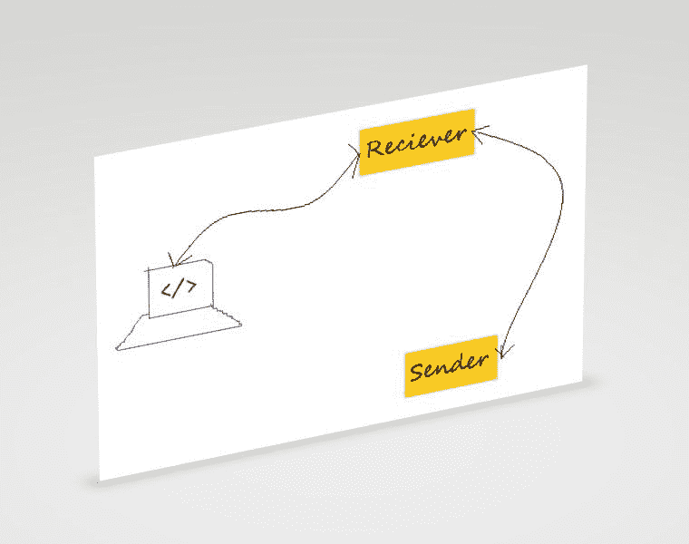
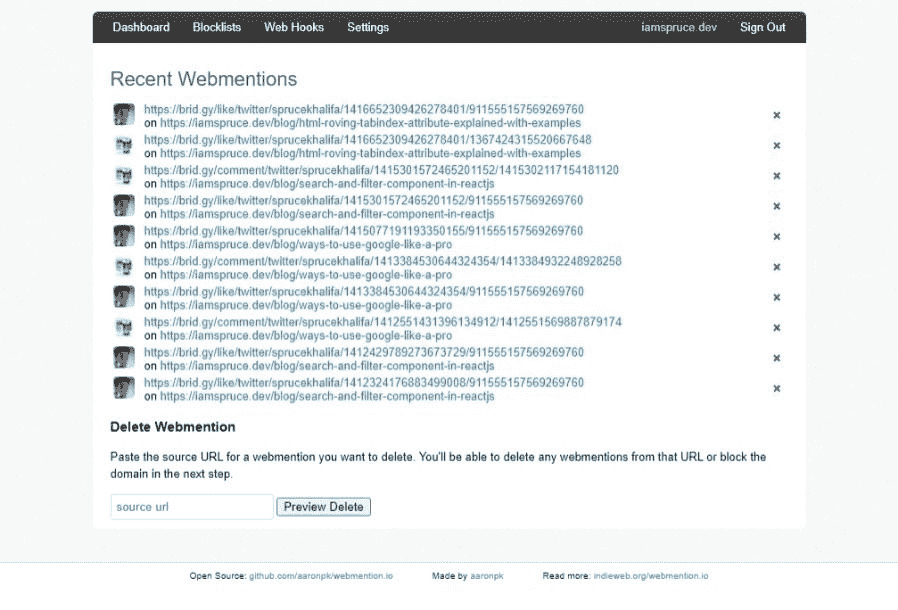
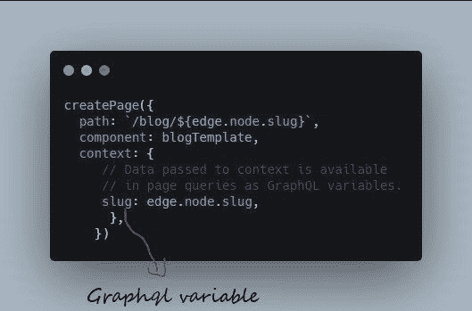
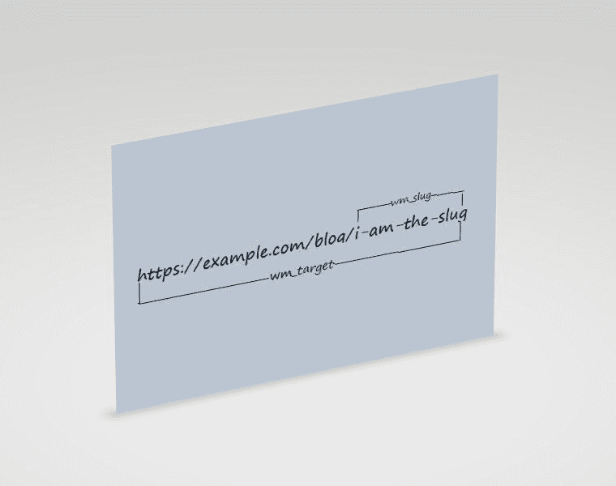
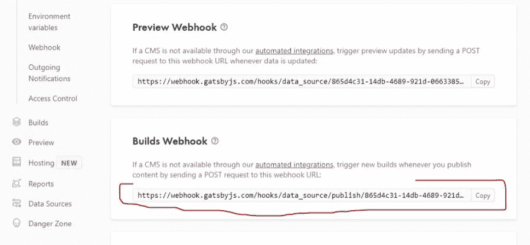
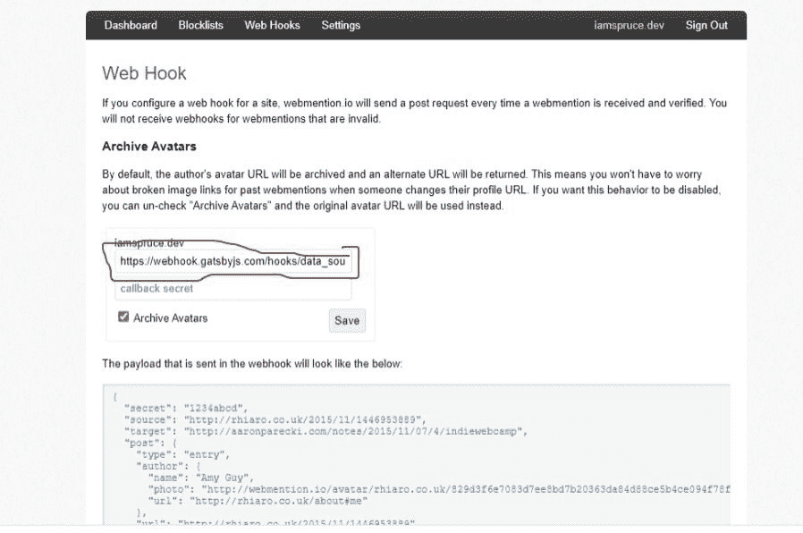

# 如何在 Gatsby.js 中使用 Webmentions 初学者指南

> 原文：<https://www.freecodecamp.org/news/how-to-use-webmentions-with-gatsby-beginners-guide/>

web reference 是由 IndieWeb 社区开发的一个简单协议，当你的 URL 在网上被提及时，你可以用它来请求通知。

当你在自己的网站上发帖并在其他地方联合发帖时，webreference 可以让你在联合发帖上进行丰富的互动。本文将带你通过最简单的方法将你的社交媒体互动转化为网络提及，并显示在你的 Gatsby.js 网站上。

本教程将在一个已经存在的站点上实现 web references，因此您至少应该对 React 和 Gatsby 有一些基本的了解。

## 入门指南

为了帮助你更好地理解 Webmentions 是如何工作的，请看下图:



Different stages of Webmention process

让我们来分解这三个阶段，并学习如何实现它们。

## 如何发送网络提及

web reference 发送者是发送者 web reference 的实现。Bridgy 是发送者的一个很好的例子。

Bridgy 是一个开源工具，它从流行的社交网站和博客引擎(如 Twitter、脸书、Instagram 和 Medium)中提取你的社交媒体互动，并神奇地将其转化为网络提及。


Bridgy turning social interactions to Webmentions

要使用 Bridgy，您的域需要支持 [indieAuth 登录过程](https://indieauth.com/)。

在您的`layout.js`组件中(或从您使用 React 头盔管理`<head>`的任何组件中)，添加以下代码以链接到您的社交资料:

```
import { Helmet } from "react-helmet"
// other imports

export default function Layout({ children}) {

  return (
    <div className="wrapper">
      <Helmet>

        <link rel="me" href="https://twitter.com/sprucekhalifa" />
        <link rel="me" href="https://github.com/iamspruce" />

      </Helmet>
...
    </div>
  )
} 
```

在你刚刚链接到的每个社交服务上，确保你的个人资料有一个链接，可以返回到你的主页，如下所示:


Adding a link back to you homepage on Twitter

就是这样！您已经完成了 IndieAuth 登录过程。现在前往 [Bridgy](https://brid.gy/) 并使用 Twitter 登录(如果您在 IndieAuth 流程中使用了 Twitter)。

从现在开始，Bridgy 将定期分析你的推文([我保证它不会对你的数据做任何事情](https://brid.gy/about#privacy))。对于每一条有链接到你的网站的推文，它会得到所有的回复、赞、转发等等，并以网络提及的形式发送出去。

## 如何接收网络提及

web reference receiver 是一个实现，它接收对一个或多个目标 URL 的 web reference。

这个实现可以是在你的服务器上执行的脚本，但是在 GatsbyJs 没有服务器的情况下，我们将依赖由 [Aaron Parecki](https://aaronparecki.com/) 创建的名为[web reference . io](https://webmention.io/)的第三方工具。

这个工具接收你的网上提及，并存储和组织它们。它还提供了一个 API，你可以用它来轻松地抓取你的网页提及，并把它们显示在你的网站上。

要使用 web reference . io，请确保您遵循了“如何发送 web references”一节中的 IndieAuth 登录流程。然后去[web reference . io](https://webmention.io/)用你的域名登录。

注册后，将以下内容添加到您网站的`<head>`(并使用您登录时获得的用户名替换`username`):

```
import { Helmet } from "react-helmet"
// other imports

export default function Layout({ children}) {

  return (
    <div className="wrapper">
      <Helmet>
        ...
        <link rel="webmention" href="https://webmention.io/username/webmention" />
        <link rel="pingback" href="https://webmention.io/username/xmlrpc" />

      </Helmet>
...
    </div>
  )
} 
```

当你开始从你的目标网址获得网站提及时，你应该会在你的仪表盘上看到它们，如下所示:



webmention.io dashboard

您可以在仪表板中轻松监控您的网络提及。

## 如何将网站提及数据拉至您的网站

这是有趣的部分，您将从 web reference . io API 中提取 web references 数据。为此，我创建了一个名为`[gatsby-source-webmentions](https://www.npmjs.com/package/gatsby-source-webmentions)`的 Gatsby 插件

注意:还有另一个插件叫做`[gatsby-plugin-webmentions](https://github.com/ChristopherBiscardi/gatsby-plugin-webmention)`，它从 web reference . io API 获取 web references 数据，并使它们在 Graphql 中可用。

### Spruce，如果已经有了一个 Gatsby 插件，为什么还要再创建一个呢？

我创建这个插件有两个原因:

1.  首先是因为我能，为什么不能。
2.  第二，用于图像优化——这个插件允许你使用 gatsby-image 插件来优化 API 返回的图像。

### 如何安装插件

要安装插件，请打开您的系统终端或 VS 代码集成终端，并运行以下命令:

```
npm install gatsby-source-webmentions
```

接下来，您需要将插件添加到您的`gatsby-config.js`插件数组中:

```
 { 
      resolve: "gatsby-source-webmentions",
      options: {
        DOMAIN: "example.com", // without https and any slashes
        TOKEN: process.env.WEBMENTIONS_TOKEN, // token from webmention.io
        perPage: 100, // optional
      }, 
```

该插件有几个选项:

1.  域:您用来登录 web reference . io 的域名
2.  令牌:您从 web reference . io 仪表盘获得的令牌
3.  perPage:你想在每页上获取的网页提及次数(这是完全可选的)

为了避免将您的秘密令牌推送到 GitHub，请将其添加为一个环境变量。

### 如何在客户端显示网页提及

如果你用 [createPage 节点 API](https://www.gatsbyjs.com/docs/reference/config-files/gatsby-node/#createPages) 动态创建你的页面，你很有可能将`slug`变量传递给所有的站点页面。如果你不确定或者你给它起了别的名字，只要检查你的站点`gatsby-node.js`文件。



Using Create pages to generate a slug for site pages

在你的`src/templates/blog.js`或者你的页面模板所在的地方，只有当`wm_slug`与页面`slug`匹配时，你才会查询网页提及。

```
import React from "react"
import { graphql } from "gatsby"
import Layout from "../components/Layout"
import Comment from "./Comment"

export const query = graphql`
  query($slug: String!) {
    allWebmention(filter: { wm_slug: { eq: $slug } }) {
        totalCount
        edges {
          node {
            id
            published
            publishedFormated: published(formatString: "MMM Do, YYYY")
            author {
                name
                photo
                url
            }
            url
            wm_id
            content {
              html
            }
          }
        }
      }
    }
`

export default function BlogPost({ data, location }) {
...
  const mentions = data.allWebmention

  return (
    <>
      <Layout>
      ...
      // display mentions in a react component
      </Layout>
    </>
  )
}
```

`wm_slug`是我创建的一个节点，用来从`wm_target`中抓取 slug。



现在，您可以映射该目标`slug`的所有 web 提及，并在 React 组件中显示它们:

```
import React from "react"
import { graphql } from "gatsby"
import Layout from "../components/Layout"
import Comment from "./Comment"

export const query = graphql`
  query($slug: String!) {
    allWebmention(filter: { wm_slug: { eq: $slug } }) {
    // graphql queries
      }
    }
`

export default function BlogPost({ data }) {
...
  const mentions = data.allWebmention

  return (
    <>
      <Layout>
      ...
          <ol className="webmentions__list">
      {mentions.edges.map(edge => (
        <Comment
          key={edge.node.wm_id}
          imageUrl={edge.node.author.photo}
          authorUrl={edge.node.author.url}
          authorName={edge.node.author.name}
          dtPublished={edge.node.published}
          dtPublishedFormated={edge.node.publishedFormated}
          content={edge.node.content && edge.node.content.html}
          url={edge.node.url}
        />
      ))}
      </ol>
      </Layout>
    </>
  )
}
```

### 如何按类型对网络提及进行分组

尽管这是完全可选的，但按类型对您的网站提及进行分组是一个好主意:

1.  `"in_reply_to"`–用于回复
2.  `"like_of"`–喜欢
3.  `"retweet_of"`–用于转发等。

```
...

export const query = graphql`
  query($slug: String!) {
    allWebmention(filter: { wm_slug: { eq: $slug } }) {
      likes: group(field: like_of) {
        totalCount
        edges {
          node {
             // node queries
          }
        }
      }

      replies: group(field: in_reply_to) {
        totalCount
        edges {
          node {
            // node queries
        }
      }
    }
}
...
```

### 如何优化网页提及作者图片

我前面提到过,`gatsby-source-plugin`允许我们优化 Webmentions 查询返回的图像。

为了能够优化图像，您必须安装`[gatsby-plugin-image](https://www.gatsbyjs.com/plugins/gatsby-plugin-image/)`、`gatsby-plugin-sharp`、`gatsby-transformer-sharp`和`gatsby-source-filesystem`:

```
export const query = graphql`
  query($slug: String!) {
    allWebmention(filter: { wm_slug: { eq: $slug } }) {
      likes: group(field: like_of) {
        totalCount
        edges {
          node {
            // other node queries
            author {
                photoSharp {
                  childImageSharp {
                    gatsbyImageData(
                      width: 38
                      placeholder: BLURRED
                      formats: [AUTO, WEBP, AVIF]
                )
              }
             }
            }
          }
        }
      }
    }
` 
```

关于其他优化和图像处理，请参考`gatsby-plugin-image` [参考指南](https://www.gatsbyjs.com/docs/reference/built-in-components/gatsby-plugin-image/)。

### 如何添加自定义分页

您可以使用众多 Gatsby 分页插件中的一个对您的 web references 进行分页。但我想要的只是一个简单的“加载更多”按钮，谢天谢地，像埃里克·豪伊这样聪明的人已经想到了这一点。

下面的代码来自于 **[文章《盖茨比](https://www.erichowey.dev/writing/load-more-button-and-infinite-scroll-in-gatsby/)** 中的加载更多按钮和无限滚动》(虽然我对它做了一些调整):

```
import React, { useState, useEffect } from "react"
import { graphql } from "gatsby"
import Button from "./Button"
import Comment from "./Comment"

export const query = graphql`
  query($slug: String!) {
    allWebmention(filter: { wm_slug: { eq: $slug } }) {
        totalCount
        edges {
          node {
          // node queries
         }
        }
       }
      }

export default function BlogPost({ data }) {
...
  const replies = data.allWebmention

  const [state, setState] = useState({
    list: [...replies.slice(0, 5)],
    Load_more: false,
    has_more: replies.length > 5,
  })
  const handleState = () => {
    state.Load_more = true
  }
  //handle loading more mentions
  useEffect(() => {
    if (state.Load_more && state.has_more) {
      const currentLength = state.list.length
      const is_more = currentLength < replies.length
      const new_list = is_more
        ? replies.slice(currentLength, currentLength + 5)
        : []
      setState.list = [...state.list, ...new_list]
      setState.Load_more = false
    }
  }, [state.Load_more, state.has_more, replies, state.list])

  useEffect(() => {
    const is_more = state.list.length < replies.length
    setState.has_more = is_more

  }, [state.list,replies.length])
  return (
    <div className="webmentions-wrapper">
      {replies.length > 0 ? (
        <>
    <h4>Comments <span className="webmentions-counter">{replies[0].totalCount}</span> </h4>
    <ol className="webmentions__list">
      {state.list.edges.map(edge => (
        <Comment
          key={edge.node.wm_id}
          imageUrl={edge.node.authorImg}
          authorUrl={edge.node.authorUrl}
          authorName={edge.node.authorName}
          dtPublished={edge.node.published}
          dtPublishedFormated={edge.node.publishedFormated}
          content={edge.node.content && edge.node.content.html}
          url={edge.node.url}
        />
      ))}
      </ol>
      <div className="webmentions-load text-center">
      {state.has_more ? (
          <Button
            event={handleState}
            name="Load More"
            label="Load More Webmentions"
            btnSize="small"
            btnType="primary"
          />
      ) : (
        <p>No More Mentions...</p>
      )}
    </div>
        </>
      ) : (
        <p>No Webmentions found</p>
      )}
    </div>
  )
} 
```

## 通过网络提及进行持续部署

您可能已经注意到，您的 web references 数据是在构建时提取的。这意味着用户不会看到新的网站提及，除非你的网站已经建成。

我把我的网站放在盖茨比云上，为了避免半夜爬下床来建立我的网站。它为我们提供了一个 WEBHOOK，可以在你睡觉的时候触发你的站点的构建。

如果您使用的是 Gatsby cloud，请转到您的[仪表盘](https://www.gatsbyjs.com/dashboard/)并复制 Webhook:



Webhooks from Gatsby Cloud dashboard

一旦你复制了网页挂钩，进入你的网页提及. io 仪表板，点击[网页挂钩](https://webmention.io/settings/webhooks)，将复制的网页挂钩粘贴到表格中:



webmention.io web hooks

就这样，你完成了。现在，任何时候你得到一个新的网站，网站挂钩会自动建立你的网站。

## 包扎

在本教程中，我们学习了如何在 Gatsby 站点上实现 Webmentions。如果你有任何问题或者你觉得这个教程很有用，请随时在 Twitter [@sprucekhalifa](https://twitter.com/sprucekhalifa) 上联系我。谢谢你。

编码快乐！