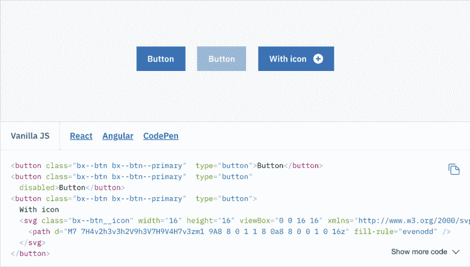
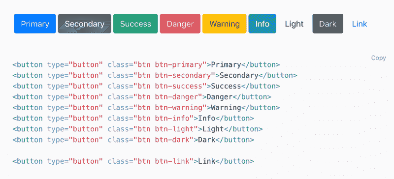
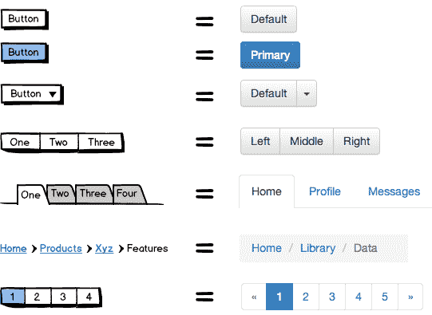
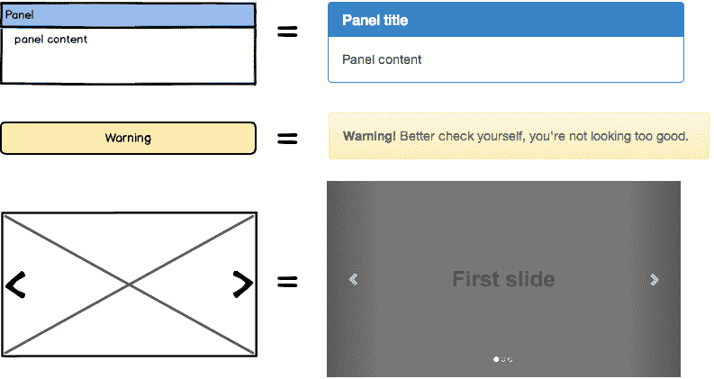
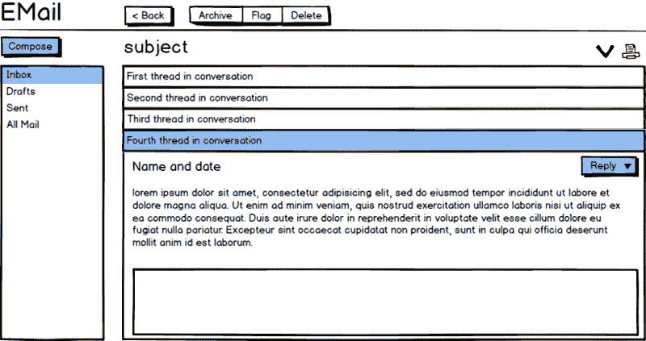
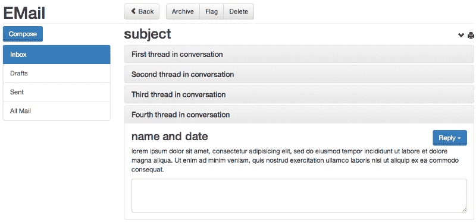

# 如何在设计系统中使用线框

> 原文：<https://www.freecodecamp.org/news/how-to-use-wireframes-with-design-systems-46f3040829b6/>

里昂·巴纳德

# 如何在设计系统中使用线框

Photo by [Med Badr Chemmaoui](https://unsplash.com/photos/ZSPBhokqDMc?utm_source=unsplash&utm_medium=referral&utm_content=creditCopyText) on [Unsplash](https://unsplash.com/search/photos/wireframe?utm_source=unsplash&utm_medium=referral&utm_content=creditCopyText)

在我作为 UX 设计师的 10 多年里，我被问到的关于线框最常见的问题之一就是要在里面放多少视觉细节。

简单的黑白草图有一种吸引人的优雅，但有时会导致对最终产品真实外观的共同理解出现差距。

在产品开发的早期阶段，当构思和快速迭代最受重视时，线框图会大放异彩。但是，使它们成为这一阶段的理想选择的同时，也阻碍了它们在下一阶段的应用，因为下一阶段需要像素精度和视觉细节。

因此，许多人(我对此感到内疚)试图通过调整字体、添加颜色和使用其他视觉效果，将精细和美学的细节融入到他们的线框中。

当这些原型高保真线框被用作实现规范并被“翻墙”发送给开发团队时，这经常会导致混乱。大多数线框工具并没有为创建看起来和感觉上都像成品的工件而优化。然而，创建每个屏幕的完美再现或高保真原型非常耗时，而且[可能无法很好地转化为最终产品](https://blog.teamtreehouse.com/rapidly-prototype-websites)。

但是，还有别的办法吗？

**肯定有**！一种方法，你可以保持你的线框低保真度，但实现了强大的实现外观和感觉的共同理解。

#### 设计救援系统

超越线框限制的另一种方法是保持它们的低保真度，让另一个工具来完成指定外观和感觉的工作。

在这篇文章中，我将解释为什么，至少对于 web 应用程序和站点来说，一个出色的工具是一个**设计系统**。

在开始之前，让我们定义一下什么是设计系统。

像它们的前身，风格指南一样，设计系统定义了应用程序的外观和感觉。然而，它们更进一步，因为它们通常还定义了**行为**,并由工作代码支持。

大公司使用设计系统已经有很长时间了。直到最近，它们对于小公司来说还是过于劳动密集型的，因为它们经常需要专门的设计师和开发人员在主要产品团队之外工作。

这里有一个来自 IBM Carbon 设计系统的例子，展示了按钮的外观和代码。

[Carbon Design System](https://www.carbondesignsystem.com) buttons

在 2011 年发布了 [Bootstrap](http://getbootstrap.com/) 框架之后，设计系统的前景发生了变化。这是一个用于 web 开发的免费初学者工具包，它提供了兼容的、健壮的 HTML 模板和通常很好看的 CSS 样式，可以根据您的品牌进行定制。

它有自己的网格和版式定义，以及按钮、表单等的样式。简而言之，启动一个 web 项目并确保它能跨浏览器工作需要付出很多努力。

Bootstrap 和其他类似的框架已经被用作小型公司设计系统的基础，这些公司没有资源来构建自己的系统。

正如你在下面看到的，Bootstrap 非常类似于上面显示的公司设计系统。

[Bootstrap](http://getbootstrap.com) buttons

#### 实践中的设计系统+线框

将设计系统与线框图工具配对的主要优点是，它可以让你不用担心线框图的外观、感觉和行为。然而，它们提供了最终产品组件的像素级完美再现。

当你已经知道一个按钮(或者标签，菜单，等等。)将会是什么样子，当你点击它的时候它的状态转换会是什么样子，那么你就不需要在你的线框中设置它的样式。黑色和白色，没有香醋就可以了。

> 有一个设计系统可以参考，可以让你直接从线框跳到代码，而不会留下未定义的最终愿景。

以下是将它们配对的方法。你会发现他们在一起相处得相当好！

如果你已经有了一个设计系统，那太好了。如果没有，可以从定制下载 [Bootstrap](https://getbootstrap.com/docs/4.1/getting-started/introduction/) 或者 [Foundation](https://foundation.zurb.com/sites/download.html/) 开始。下一步是在它和线框工具中的控件之间创建一个映射。

映射基本上意味着开发一个“这意味着那”的共享协议。您可以通过创建一个显示这些映射的文档，或者通过与设计和开发团队一起开会来解决这个问题。

这里有一个如何将一些 [Balsamiq](https://balsamiq.com) 控件映射到引导组件的例子(你也可以从[引导线框到 Go 库](https://wireframestogo.com/#/search=bootstrap)开始)。

Simple mapping of wireframe controls to coded UI controls

> ***注意:*** *使用一些颜色是可以的，但是只应该在必要的时候使用，比如表示州和选区。*

拥有这种映射意味着**开发者不再需要考虑线框中的颜色是否应该在他们的代码中使用**。他们可以在脑海中理解线框中的蓝色按钮实际上意味着 UI 中的绿色按钮(如果这是你使用的颜色)，并且面包屑由`&`gt；例如，在应用程序中，字符实际上应该由 t `h` e / character 分隔。

你也可以扩展你的设计系统，创建你自己的 Balsamiq 控件作为[符号](https://docs.balsamiq.com/desktop/symbols/)来映射到你库中的其他组件，就像这样:

Balsamiq symbols mapped to design system components

随着组织中需求和设计语言的变化，这种映射会随着时间的推移而发展壮大。

这里有一个简单的例子，展示了当与设计系统一起构建时，一个完整的线框会是什么样子。

> *注意:线框中的蓝色不一定意味着成品中的蓝色。*

Created in Balsamiq

Created with code

线框到工作代码，中间没有额外的设计工件！

拥有一个设计系统也意味着你可以在应用程序的所有部分重用相同的代码，这样不同的开发者就可以产生相同的用户界面，从而带来更好的标准和一致性。如果设计系统得到更新，线框也不必改变。

最后，**设计师可以更多地依赖工具**中的库存控制，而不是花费数小时试图自己复制外观，因此设计和开发周期都缩短了。

#### 摘要

当然，没有什么对每个人都有效。这种方法不能保证适用于所有的项目或组织。例如，它更适合内部团队。

您组织之外的客户更有可能希望看到高保真的模型。此外，大多数初始设计系统都是针对基于网络的产品的。桌面和移动应用程序设计系统模板和示例不太常见。

最后，也许也是最重要的，你应该在设计和开发团队之间有良好的沟通。

对线框和设计系统之间的联系的许多共同理解是通过**关于它的对话**产生的。仅仅通过电子邮件或简单地在你的内部网上发布可能是行不通的。尝试这种方法的瀑布和遥远的远程团队可能不太顺利。

也就是说，它确实为许多团队提供了许多优势，例如:

*   绘制线框时节省时间
*   线框和现实之间没有不匹配
*   适用于精益/敏捷方法，可交付成果不需要如此正式
*   适用于没有很多资源的小团队和初创公司(尤其是在使用框架的时候)
*   不同的技能可以应用于不同的设计领域(例如，设计系统的视觉设计师和开发人员，交互设计师或线框的项目经理)
*   设计过程(线框与设计系统创建)可以独立完成，从而减少瓶颈
*   整个产品的用户界面更加一致

### 更多设计系统资源

*   [设计系统图库](https://designsystemsrepo.com/design-systems/)
*   [“设计设计系统”](https://clearleft.com/posts/designing-design-systems)
*   [“模式库入门”](https://alistapart.com/blog/post/getting-started-with-pattern-libraries)
*   [原子设计简介](http://atomicdesign.bradfrost.com/chapter-1/)
*   [模式实验室设计系统工具](https://patternlab.io)
*   [网站风格指南资源](http://styleguides.io/)