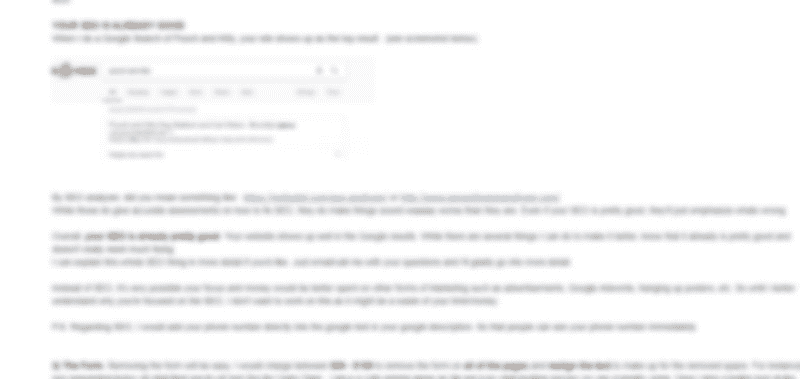

# 如何利用客户的设计理念——以及为什么这很重要

> 原文：<https://www.freecodecamp.org/news/how-to-use-your-clients-design-ideas-and-why-this-is-important-398be69c08be/>

客户喜欢自己的想法。当我说“客户”时，我指的是你向其汇报的个人或团队。这可能是你的主管、老板、客户或项目经理。为了简单起见，我们将那个人称为您的*客户*。那个人会对自己的想法比其他任何事情都更兴奋。

这可以归结为:*如果你代表某人工作，那么你做的每一件事都必须听取那个人的意见。*

我专门做网站。对我来说，好的网页设计是当你的客户感觉到他们对所有伟大的想法负责的时候**。你的客户认为他们能得到的好处越多，你就越好。**

**你的客户需要感觉到他们的投入非常有用——这是人类的核心需求。不关心或不征求客户的意见会导致他们对你的产品漠不关心。这是一个容易犯的错误。我经常因此失去客户。每当我坚持并坚持开出自己的解决方案时，它就会发生。事实上，这里有一个尴尬的故事，当我因为我的处方而失去了一个潜在客户。**

### **通过开太多处方疏远客户**

**不久前，当我刚开始做网页设计的时候，我收到了一个潜在客户的电子邮件。这是一个小狗照看服务。他们希望对他们的搜索引擎优化内容进行小的网站修复，并希望我删除一个表格。这种简单的东西我用不了一个小时就能搞定。**

**我开始打字回复，问我们是否可以谈谈，看看他们想要什么。然后我开始思考我是多么渴望我的第一个付费客户。因此，我改变了思路，开始让我的电子邮件尽可能全面。我添加了更多关于 SEO 如何工作以及它如何与网站相关的细节。我提到了移除表单的几种可能方式以及最终结果应该是什么样子。**

**然后我开始想，我真的想要我的第一个付费客户。如果我说的不够呢？所以我补充了更多的细节。我给她发了最后一封 375 字的邮件。375!！**

**

My (blurred) email reply. 375 words + images + links. Too long!!!** 

**我从未得到回复。一开始，我很烦。我花了那么多时间打了这么长的电子邮件，却没有回音！但是过了一段时间，我冷静下来，开始意识到我的邮件可能有点太长了。但是我还是不明白为什么这是个问题。为了找到答案，我去了纽约的一家自由代码营咖啡和代码，并与它最活跃的成员之一，资深网页设计自由职业者迈克尔·塞姆科进行了交谈。**

**迈克尔向我解释说，我的电子邮件违反了网页设计的一条核心规则。与客户一起工作必须是一个来回的对话。我的太长的邮件都是我的主意。它没有来自客户的任何输入。因为我的电子邮件是一个来自零客户输入的解决方案，我和我的网站技能被拒绝。这就产生了一个问题:我的邮件应该写些什么？**

**Michael 解释说，获得客户意见的最简单方法是通过咖啡、Skype 或面对面交谈进行讨论。他说我的电子邮件的核心信息应该是**我可以完成工作**并向**请求某种一对一的讨论来检查细节。**真的就这么简单:*“嘿，我可以把工作做完。我们可以讨论一下细节吗？在……”怎么样。***

**在那次**对话**中，通过来回的讨论，你们一起决定客户想要什么，检查定价，并试图锁定交易，等等。**

**一次成功的会议的基石是，如果客户觉得他们被倾听、被理解，并且他们可以从最终产品中获得荣誉。面对面地，你可以在屏幕上向你的客户展示网页设计的样本，并立即得到他们的反馈。这种力量是不可能通过电子邮件获得的。**

**似乎很容易避免开处方。要知道，在某些特定的场景下，太容易掉入陷阱。**

### **绝望增加了处方量**

**我写了一封很长的电子邮件，因为我真的很想做生意。那时我没有付费顾客。我绝望了。因为我太想要它了，所以我试着表现出“我有多聪明”,开始开处方，开处方，开处方。**

**要知道，每当你真正需要某样东西的时候，开处方的野兽就越有可能抬起它丑陋的头。当绝望出现时，处方就变得更有可能。**

**有时候，我开始开处方仅仅是因为我想要“帮助别人”的好感觉。因为我想感觉到我是有帮助的，如果我遇到其他人在学习 JavaScript，我通常会大声说出我发现的对学习 JavaScript 有帮助的各种好网站和资源。这种连珠炮一般会浪费对方的时间，疏远对方。如前所述，这真的应该是一对一的来回讨论，他们觉得他们可以对所有发生的伟大想法负责。**

**总之，成功的网页设计需要让你的客户感觉到他们的输入和想法正在引导着一切。绝望的时候特别容易开始开药。所以在这种情况下，你要格外小心。你的客户觉得他们能得到的信任越多，他们就会越喜欢最终的设计。因此，如果你代表某人工作，那么你做的每一件事都必须考虑到那个人的意见。**