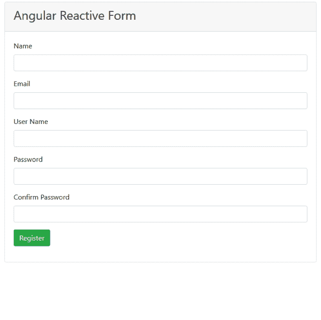

# 如何验证角反应形式

> 原文：<https://www.freecodecamp.org/news/how-to-validate-angular-reactive-forms/>

## 介绍

在本文中，我们将学习 Angular 中反应式表单的验证。我们将创建一个简单的用户注册表单，并在其上实现一些内置的验证。除了内置的验证，我们还将对反应式表单实现一些自定义验证。

对于此演示，我们将考虑以下自定义验证:

*   检查用户名的可用性
*   密码模式验证
*   匹配在两个不同字段中输入的密码

看一看运行中的应用程序。



## 先决条件

*   从[这里](https://code.visualstudio.com/)安装 Visual Studio 代码
*   从[这里](https://cli.angular.io/)安装最新版本的 Angular CLI

## 源代码

从 [GitHub](https://github.com/AnkitSharma-007/angular-forms-validation) 获取源代码。

## 创建角度应用程序

导航到要创建项目文件的文件夹。打开命令窗口，运行如下所示的命令:

```
ng new angular-forms-validation --routing=false --style=scss
```

我们正在指定创建新角度应用程序的命令。创建路由模块的选项设置为假，样式文件扩展名设置为`scss`。该命令将创建名为`angular-forms-validation`的角度项目。

将目录切换到新项目，并使用下面显示的命令集在 VS 代码中打开该项目:

```
cd angular-forms-validation 
code .
```

## 安装引导程序

运行以下命令安装引导库:

```
npm install bootstrap --save
```

在`styles.scss`文件中添加以下导入定义:

```
@import "~bootstrap/dist/css/bootstrap.css";
```

## 创建验证服务

运行以下命令创建新服务:

```
ng g s services\customvalidation
```

这个命令将创建一个名为 services 的文件夹，其中有两个文件——`customvalidation.service.ts`和`customvalidation.service.spec.ts`。打开`customvalidation.service.ts`文件，将以下代码放入其中:

```
import { Injectable } from '@angular/core';
import { ValidatorFn, AbstractControl } from '@angular/forms';
import { FormGroup } from '@angular/forms';

@Injectable({
  providedIn: 'root'
})
export class CustomvalidationService {

  patternValidator(): ValidatorFn {
    return (control: AbstractControl): { [key: string]: any } => {
      if (!control.value) {
        return null;
      }
      const regex = new RegExp('^(?=.*?[A-Z])(?=.*?[a-z])(?=.*?[0-9]).{8,}

方法`patternValidator`用于验证我们表单中的密码模式。此方法的参数属于类型`AbstractControl`，它是`FormControl`的基类。

我们将使用正则表达式来验证密码。我们将使用正则表达式验证以下四个条件:

*   密码长度至少应为八个字符。
*   它至少有一个小写字母。
*   它至少有一个大写字母。
*   它至少有一个数字。

如果密码没有通过正则表达式检查，我们将把`invalidPassword`属性设置为 true。

方法`MatchPassword`用于比较两个字段中的密码。该方法将接受两个 string 类型的参数。这些参数表示要匹配的字段的名称。我们将获得这两个字段的`FormControl`,然后匹配其中的值。如果值不匹配，我们将把`passwordMismatch`属性设置为真。

方法`userNameValidator`用于验证用户名是否已被占用。这个方法将接受一个类型为`AbstractControl`的参数。我们将检查这个字段的值是否出现在静态数组`UserList`中。如果用户输入的值已经存在，我们将把`userNameNotAvailable`属性设置为 true。

我们使用`setTimeout`函数每两秒钟调用一次检查。这将确保在用户停止在字段中键入内容的两秒钟后抛出错误。

> 为了简化本文，我们使用一个静态数组来搜索用户名的可用性。理想情况下，它应该是对服务器的服务调用，以在数据库中搜索值。

## 创建反应式表单组件

运行以下命令创建反应式构件:

```
ng g c reactive-form
```

打开`reactive-form.component.ts`并将以下代码放入其中:

```
import { Component, OnInit } from '@angular/core';
import { Validators, FormGroup, FormBuilder } from '@angular/forms';
import { CustomvalidationService } from '../services/customvalidation.service';

@Component({
  selector: 'app-reactive-form',
  templateUrl: './reactive-form.component.html',
  styleUrls: ['./reactive-form.component.scss']
})
export class ReactiveFormComponent implements OnInit {

  registerForm: FormGroup;
  submitted = false;

  constructor(
    private fb: FormBuilder,
    private customValidator: CustomvalidationService
  ) { }

  ngOnInit() {
    this.registerForm = this.fb.group({
      name: ['', Validators.required],
      email: ['', [Validators.required, Validators.email]],
      username: ['', [Validators.required], this.customValidator.userNameValidator.bind(this.customValidator)],
      password: ['', Validators.compose([Validators.required, this.customValidator.patternValidator()])],
      confirmPassword: ['', [Validators.required]],
    },
      {
        validator: this.customValidator.MatchPassword('password', 'confirmPassword'),
      }
    );
  }

  get registerFormControl() {
    return this.registerForm.controls;
  }

  onSubmit() {
    this.submitted = true;
    if (this.registerForm.valid) {
      alert('Form Submitted succesfully!!!\n Check the values in browser console.');
      console.table(this.registerForm.value);
    }
  }
}
```

我们将创建一个类型为`FormGroup`的变量`registerForm`。在`ngOnInit`方法中，我们将使用`FormBuilder`类设置表单的控件。所有字段都被设置为该表单的必填字段。我们将使用绑定函数调用服务的`userNameValidator`方法。

对于密码字段，我们将使用 compose 方法将多个验证器合并成一个函数。我们还将调用`MatchPassword`方法，并将`password`和`confirmPassword`表单控件的名称作为参数传递。

属性将返回表单的表单控件。如果表单有效并且提交成功，那么`onSubmit`方法将在控制台上打印表单的内容。

打开`reactive-form.component.html`并将以下代码放入其中:

```
<div class="container">
    <div class="row">
        <div class="col-md-8 mx-auto">
            <div class="card">
                <div class="card-header">
                    <h3>Angular Reactive Form</h3>
                </div>
                <div class="card-body">
                    <form class="form" [formGroup]="registerForm" (ngSubmit)="onSubmit()">
                        <div class="form-group">
                            <label>Name</label>
                            <input type="text" class="form-control" formControlName="name">
                            <span class="text-danger"
                                *ngIf="(registerFormControl.name.touched || submitted) && registerFormControl.name.errors?.required">
                                Name is required
                            </span>
                        </div>
                        <div class="form-group">
                            <label>Email</label>
                            <input type="text" class="form-control" formControlName="email">
                            <span class="text-danger"
                                *ngIf="(registerFormControl.email.touched || submitted) && registerFormControl.email.errors?.required">
                                Email is required
                            </span>
                            <span class="text-danger"
                                *ngIf="registerFormControl.email.touched && registerFormControl.email.errors?.email">
                                Enter a valid email address
                            </span>
                        </div>
                        <div class="form-group">
                            <label>User Name</label>
                            <input type="text" class="form-control" formControlName="username">
                            <span class="text-danger"
                                *ngIf="(registerFormControl.username.touched || submitted) && registerFormControl.username.errors?.required">
                                User Name is required
                            </span>
                            <span class="text-danger"
                                *ngIf="registerFormControl.username.touched && registerFormControl.username.errors?.userNameNotAvailable">
                                User Name is not available
                            </span>
                        </div>
                        <div class="form-group">
                            <label>Password</label>
                            <input type="password" class="form-control" formControlName="password">
                            <span class="text-danger"
                                *ngIf="(registerFormControl.password.touched || submitted) && registerFormControl.password.errors?.required">
                                Password is required
                            </span>
                            <span class="text-danger"
                                *ngIf="registerFormControl.password.touched && registerFormControl.password.errors?.invalidPassword">
                                Password should have minimum 8 characters, at least 1 uppercase letter, 1 lowercase
                                letter and 1 number
                            </span>
                        </div>
                        <div class="form-group">
                            <label>Confirm Password</label>
                            <input type="password" class="form-control" formControlName="confirmPassword">
                            <span class="text-danger"
                                *ngIf="(registerFormControl.confirmPassword.touched || submitted)&& registerFormControl.confirmPassword.errors?.required">
                                Confirm Password is required
                            </span>
                            <span class="text-danger"
                                *ngIf="registerFormControl.confirmPassword.touched && registerFormControl.confirmPassword.errors?.passwordMismatch">
                                Passwords doesnot match
                            </span>
                        </div>
                        <div class="form-group">
                            <button type="submit" class="btn btn-success">Register</button>
                        </div>
                    </form>
                </div>
            </div>
        </div>
    </div>
</div>
```

我们将创建一个反应式表单，并使用引导卡进行造型。卡头将包含一个标题，而卡体将包含表单字段。我们将把`<form>`标签的`formGroup`属性绑定到表单的名称`registerForm`。提交表单时将调用`onSubmit`方法。我们还将把每个输入字段的`formControlName`属性绑定到我们的`FormGroup`控件名。我们将检查表单控件中的错误，然后在屏幕上显示适当的验证错误消息。

## 创建导航栏组件

运行以下命令创建导航栏组件:

```
ng g c nav-bar
```

打开`nav-bar.component.html`并将以下代码放入其中:

```
<nav class="navbar navbar-expand-sm navbar-dark bg-dark fixed-top">
    <a class="navbar-brand" [routerLink]='["/"]'>Form Validation Demo</a>
    <div class="collapse navbar-collapse">
        <ul class="navbar-nav mr-auto">
            <li class="nav-item">
                <a class="nav-link" [routerLink]='["/reactive-form"]'>Reactive Form</a>
            </li>
        </ul>
    </div>
</nav>
```

我们将导航链接添加到导航栏中的反应式表单组件。

## 更新应用程序组件

打开`app.component.html`文件，将以下代码放入其中:

```
<app-nav-bar></app-nav-bar>
<div class="container">
  <router-outlet></router-outlet>
</div>
```

## 更新应用程序模块

在`app.module.ts`文件中添加以下代码。我们将导入表单模块，并为我们的应用程序定义路由。这个文件的完整源代码可以参考 [GitHub](https://github.com/AnkitSharma-007/angular-forms-validation/blob/master/src/app/app.module.ts) 。

```
import { RouterModule } from '@angular/router';
import { ReactiveFormsModule } from  '@angular/forms';

@NgModule({
  ...    
  imports: [
    ...
    ReactiveFormsModule,
    RouterModule.forRoot([
      { path: '', component: ReactiveFormComponent },
      { path: 'reactive-form', component: ReactiveFormComponent }
    ]),
  ],
})
```

## 执行演示

我们将使用以下命令来启动 web 服务器:

```
ng serve -o
```

此命令将在`http://localhost:4200/`在您的默认浏览器中启动应用程序。您可以执行我们在这里讨论的所有表单验证。

该应用程序也托管在[https://ng-forms-validation.herokuapp.com/](https://ng-forms-validation.herokuapp.com/)。导航到该链接，并使用它进行更好的理解。

## 摘要

我们已经使用 Angular 中的反应式表单方法创建了一个示例用户注册表单。我们已经实现了表单的内置验证和自定义验证。引导库用于设计表单的样式。

从 [GitHub](https://github.com/AnkitSharma-007/angular-forms-validation) 获取源代码，并对其进行试验，以便更好地理解。

## 请参见

*   [使用 i18n 工具进行角度定位](https://ankitsharmablogs.com/localization-in-angular-using-i18n-tools/)
*   [角度模板驱动的表单验证](https://ankitsharmablogs.com/template-driven-form-validation-in-angular/)
*   [了解角度动画](https://ankitsharmablogs.com/understanding-angular-animation/)
*   [使用 JWT 的 Angular 中基于策略的授权](https://ankitsharmablogs.com/policy-based-authorization-in-angular-using-jwt/)
*   [服务器端 Blazor 应用中的脸书认证和授权](https://ankitsharmablogs.com/facebook-authentication-and-authorization-in-server-side-blazor-app/)

你可以在 [Ankit Sharma 的博客](https://ankitsharmablogs.com/)上找到类似 Angular 中[反应式表单验证的其他帖子。](https://ankitsharmablogs.com/reactive-form-validation-in-angular/));
      const valid = regex.test(control.value);
      return valid ? null : { invalidPassword: true };
    };
  }

  MatchPassword(password: string, confirmPassword: string) {
    return (formGroup: FormGroup) => {
      const passwordControl = formGroup.controls[password];
      const confirmPasswordControl = formGroup.controls[confirmPassword];

      if (!passwordControl || !confirmPasswordControl) {
        return null;
      }

      if (confirmPasswordControl.errors && !confirmPasswordControl.errors.passwordMismatch) {
        return null;
      }

      if (passwordControl.value !== confirmPasswordControl.value) {
        confirmPasswordControl.setErrors({ passwordMismatch: true });
      } else {
        confirmPasswordControl.setErrors(null);
      }
    }
  }

  userNameValidator(userControl: AbstractControl) {
    return new Promise(resolve => {
      setTimeout(() => {
        if (this.validateUserName(userControl.value)) {
          resolve({ userNameNotAvailable: true });
        } else {
          resolve(null);
        }
      }, 1000);
    });
  }

  validateUserName(userName: string) {
    const UserList = ['ankit', 'admin', 'user', 'superuser'];
    return (UserList.indexOf(userName) > -1);
  }
}
```

方法`patternValidator`用于验证我们表单中的密码模式。此方法的参数属于类型`AbstractControl`，它是`FormControl`的基类。

我们将使用正则表达式来验证密码。我们将使用正则表达式验证以下四个条件:

*   密码长度至少应为八个字符。
*   它至少有一个小写字母。
*   它至少有一个大写字母。
*   它至少有一个数字。

如果密码没有通过正则表达式检查，我们将把`invalidPassword`属性设置为 true。

方法`MatchPassword`用于比较两个字段中的密码。该方法将接受两个 string 类型的参数。这些参数表示要匹配的字段的名称。我们将获得这两个字段的`FormControl`,然后匹配其中的值。如果值不匹配，我们将把`passwordMismatch`属性设置为真。

方法`userNameValidator`用于验证用户名是否已被占用。这个方法将接受一个类型为`AbstractControl`的参数。我们将检查这个字段的值是否出现在静态数组`UserList`中。如果用户输入的值已经存在，我们将把`userNameNotAvailable`属性设置为 true。

我们使用`setTimeout`函数每两秒钟调用一次检查。这将确保在用户停止在字段中键入内容的两秒钟后抛出错误。

> 为了简化本文，我们使用一个静态数组来搜索用户名的可用性。理想情况下，它应该是对服务器的服务调用，以在数据库中搜索值。

## 创建反应式表单组件

运行以下命令创建反应式构件:

[PRE6]

打开`reactive-form.component.ts`并将以下代码放入其中:

[PRE7]

我们将创建一个类型为`FormGroup`的变量`registerForm`。在`ngOnInit`方法中，我们将使用`FormBuilder`类设置表单的控件。所有字段都被设置为该表单的必填字段。我们将使用绑定函数调用服务的`userNameValidator`方法。

对于密码字段，我们将使用 compose 方法将多个验证器合并成一个函数。我们还将调用`MatchPassword`方法，并将`password`和`confirmPassword`表单控件的名称作为参数传递。

属性将返回表单的表单控件。如果表单有效并且提交成功，那么`onSubmit`方法将在控制台上打印表单的内容。

打开`reactive-form.component.html`并将以下代码放入其中:

[PRE8]

我们将创建一个反应式表单，并使用引导卡进行造型。卡头将包含一个标题，而卡体将包含表单字段。我们将把`<form>`标签的`formGroup`属性绑定到表单的名称`registerForm`。提交表单时将调用`onSubmit`方法。我们还将把每个输入字段的`formControlName`属性绑定到我们的`FormGroup`控件名。我们将检查表单控件中的错误，然后在屏幕上显示适当的验证错误消息。

## 创建导航栏组件

运行以下命令创建导航栏组件:

[PRE9]

打开`nav-bar.component.html`并将以下代码放入其中:

[PRE10]

我们将导航链接添加到导航栏中的反应式表单组件。

## 更新应用程序组件

打开`app.component.html`文件，将以下代码放入其中:

[PRE11]

## 更新应用程序模块

在`app.module.ts`文件中添加以下代码。我们将导入表单模块，并为我们的应用程序定义路由。这个文件的完整源代码可以参考 [GitHub](https://github.com/AnkitSharma-007/angular-forms-validation/blob/master/src/app/app.module.ts) 。

[PRE12]

## 执行演示

我们将使用以下命令来启动 web 服务器:

[PRE13]

此命令将在`http://localhost:4200/`在您的默认浏览器中启动应用程序。您可以执行我们在这里讨论的所有表单验证。

该应用程序也托管在[https://ng-forms-validation.herokuapp.com/](https://ng-forms-validation.herokuapp.com/)。导航到该链接，并使用它进行更好的理解。

## 摘要

我们已经使用 Angular 中的反应式表单方法创建了一个示例用户注册表单。我们已经实现了表单的内置验证和自定义验证。引导库用于设计表单的样式。

从 [GitHub](https://github.com/AnkitSharma-007/angular-forms-validation) 获取源代码，并对其进行试验，以便更好地理解。

## 请参见

*   [使用 i18n 工具进行角度定位](https://ankitsharmablogs.com/localization-in-angular-using-i18n-tools/)
*   [角度模板驱动的表单验证](https://ankitsharmablogs.com/template-driven-form-validation-in-angular/)
*   [了解角度动画](https://ankitsharmablogs.com/understanding-angular-animation/)
*   [使用 JWT 的 Angular 中基于策略的授权](https://ankitsharmablogs.com/policy-based-authorization-in-angular-using-jwt/)
*   [服务器端 Blazor 应用中的脸书认证和授权](https://ankitsharmablogs.com/facebook-authentication-and-authorization-in-server-side-blazor-app/)

你可以在 [Ankit Sharma 的博客](https://ankitsharmablogs.com/)上找到类似 Angular 中[反应式表单验证的其他帖子。](https://ankitsharmablogs.com/reactive-form-validation-in-angular/)