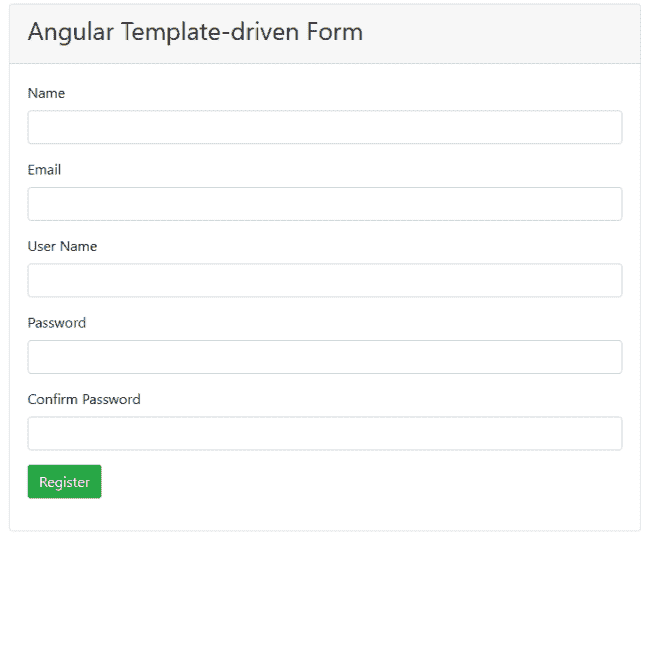

# 如何验证角度模板驱动的表单

> 原文：<https://www.freecodecamp.org/news/how-to-validate-angular-template-driven-forms/>

## **简介**

在这篇文章中，我们将学习 Angular 模板驱动表单中的验证。我们将创建一个简单的用户注册表单，并在其上实现一些内置的验证。除了内置的验证，我们还将为模板驱动的表单实现一些定制的验证。

对于此演示，我们将考虑以下自定义验证:

*   检查用户名的可用性
*   密码模式验证
*   匹配在两个不同字段中输入的密码

看一看运行中的应用程序。



## **先决条件**

*   从[这里](https://code.visualstudio.com/)安装 Visual Studio 代码
*   从[这里](https://cli.angular.io/)安装最新版本的 Angular CLI
*   从[这里](https://nodejs.org/en/)安装 Node.js 的最新 LTS 版本

## **源代码**

可以从 [GitHub](https://github.com/AnkitSharma-007/angular-forms-validation) 获取源代码。

## **创建角度应用**

导航到要创建项目文件的文件夹。打开命令窗口，运行如下所示的命令:

```
ng new angular-forms-validation --routing=false --style=scss
```

我们正在指定创建新角度应用程序的命令。创建路由模块的选项设置为 false，样式文件扩展名设置为 SCSS。该命令将创建名为 angular-forms-validation 的角度项目。

将目录切换到新项目，并使用下面的命令集在 VS 代码中打开该项目:

```
cd angular-forms-validation
code .
```

## 安装引导程序

运行以下命令安装引导程序:

```
npm install bootstrap --save
```

在`styles.scss`文件中添加以下导入定义:

```
@import "~bootstrap/dist/css/bootstrap.css";
```

## 创建验证服务

运行以下命令创建新服务:

```
ng g s services\customvalidation
```

这个命令将创建一个名为 services 的文件夹，其中有两个文件——`customvalidation.service.ts`和`customvalidation.service.spec.ts`。打开`customvalidation.service.ts`,把下面的代码放进去:

```
import { Injectable } from '@angular/core';
import { ValidatorFn, AbstractControl } from '@angular/forms';
import { FormGroup } from '@angular/forms';

@Injectable({
  providedIn: 'root'
})
export class CustomvalidationService {

  patternValidator(): ValidatorFn {
    return (control: AbstractControl): { [key: string]: any } => {
      if (!control.value) {
        return null;
      }
      const regex = new RegExp('^(?=.*?[A-Z])(?=.*?[a-z])(?=.*?[0-9]).{8,}

方法`patternValidator`用于验证我们表单中的密码模式。此方法的参数属于类型`AbstractControl`，它是`FormControl`的基类。

我们将使用正则表达式来验证密码。此正则表达式将检查密码中的以下四个条件:

*   密码长度至少应为八个字符
*   它应该至少有一个小写字母
*   它应该至少有一个大写字母
*   它应该至少有一个数字

如果密码没有通过正则表达式检查，我们将把`invalidPassword`属性设置为 true。

方法`MatchPassword`用于比较两个字段中的密码。该方法将接受两个 string 类型的参数。这些参数表示要匹配的字段的名称。我们将获得这两个字段的`FormControl`,然后匹配其中的值。如果值不匹配，我们将把`passwordMismatch`属性设置为真。

方法`userNameValidator`用于验证用户名是否已被占用。这个方法将接受一个类型为`AbstractControl`的参数。

我们将检查这个字段的值是否存在于静态数组 UserList 中。如果用户输入的值已经存在，我们将把`userNameNotAvailable`属性设置为 true。

我们使用 setTimeout 函数每两秒钟调用一次检查。这将确保在用户停止在字段中键入内容的两秒钟后抛出错误。

为了简化本文，我们使用一个静态数组来搜索用户名的可用性。理想情况下，它应该是对服务器的服务调用，以在数据库中搜索值。

## 创建用户模型

在`src/app`文件夹中创建一个名为 models 的新文件夹。在 models 文件夹中添加一个名为`user.ts`的新文件。将下面的代码放到`user.ts`文件中。

```
export class User {
    public name: string;
    public email: string;
    public username: string;
    public password: string;
    public confirmPassword: string;
}
```

## 创建自定义指令

我们将创建自定义指令来实现模板驱动表单的自定义验证器。

运行如下所示的命令来创建`passwordPattern`指令:

```
ng g d directives\passwordPattern
```

这个命令将创建一个名为 directives 的文件夹，其中有两个文件——`passwordPattern.directive.ts`和`passwordPattern.directive.spec.ts`。打开`passwordPattern.directive.ts`,把下面的代码放进去。

```
import { Directive } from '@angular/core';
import { NG_VALIDATORS, Validator, AbstractControl } from '@angular/forms';
import { CustomvalidationService } from '../services/customvalidation.service';

@Directive({
  selector: '[appPasswordPattern]',
  providers: [{ provide: NG_VALIDATORS, useExisting: PasswordPatternDirective, multi: true }]
})
export class PasswordPatternDirective implements Validator {

  constructor(private customValidator: CustomvalidationService) { }

  validate(control: AbstractControl): { [key: string]: any } | null {
    return this.customValidator.patternValidator()(control);
  }
}
```

该指令用于验证密码模式。我们将在类`PasswordPatternDirective`上实现验证器接口。我们将覆盖接受类型为`AbstractControl`的参数的 validate 方法，这是我们想要验证的控件。然后，我们将从服务中调用`patternValidator`方法。

运行如下所示的命令来创建`matchPassword`指令:

```
ng g d directives\matchPassword
```

打开`matchPassword.directive.ts`并将以下代码放入其中:

```
import { Directive, Input } from '@angular/core';
import { NG_VALIDATORS, Validator, ValidationErrors, FormGroup } from '@angular/forms';
import { CustomvalidationService } from '../services/customvalidation.service';

@Directive({
  selector: '[appMatchPassword]',
  providers: [{ provide: NG_VALIDATORS, useExisting: MatchPasswordDirective, multi: true }]
})
export class MatchPasswordDirective implements Validator {
  @Input('appMatchPassword') MatchPassword: string[] = [];

  constructor(private customValidator: CustomvalidationService) { }

  validate(formGroup: FormGroup): ValidationErrors {
    return this.customValidator.MatchPassword(this.MatchPassword[0], this.MatchPassword[1])(formGroup);
  }
}
```

该指令用于验证在两个字段中输入的密码是否匹配。该指令将接受字符串数组类型的输入，其中包含要匹配的字段。我们将覆盖 validate 方法并传递类型为`FormGroup`的参数。然后，我们将从服务中调用`MatchPassword`方法。

运行如下所示的命令来创建`validateUserName`指令:

```
ng g d directives\validateUserName
```

打开`validateUserName.directive.ts`并将以下代码放入其中:

```
import { Directive, forwardRef } from '@angular/core';
import { Validator, AbstractControl, NG_ASYNC_VALIDATORS } from '@angular/forms';
import { CustomvalidationService } from '../services/customvalidation.service';
import { Observable } from 'rxjs';

@Directive({
  selector: '[appValidateUserName]',
  providers: [{ provide: NG_ASYNC_VALIDATORS, useExisting: forwardRef(() => ValidateUserNameDirective), multi: true }]

})
export class ValidateUserNameDirective implements Validator {

  constructor(private customValidator: CustomvalidationService) { }

  validate(control: AbstractControl): Promise<{ [key: string]: any }> | Observable<{ [key: string]: any }> {
    return this.customValidator.userNameValidator(control);
  }
}
```

该指令用于验证用户名的可用性。我们将覆盖 validate 方法并传递类型为`AbstractControl`的参数。然后，我们将从服务中调用`userNameValidator`方法。这个方法将返回一个承诺。

## 创建模板驱动的表单组件

运行以下命令创建模板驱动表单组件:

```
ng g c template-driven-form
```

打开`template-driven-form.component.ts`并将以下代码放入其中:

```
import { Component } from '@angular/core';
import { User } from '../models/user';

@Component({
  selector: 'app-template-driven-form',
  templateUrl: './template-driven-form.component.html',
  styleUrls: ['./template-driven-form.component.scss']
})
export class TemplateDrivenFormComponent {

  userModal = new User();

  constructor() { }

  onSubmit() {
    alert('Form Submitted succesfully!!!\n Check the values in browser console.');
    console.table(this.userModal);
  }
}
```

我们已经创建了一个 User 类型的对象`userModal`。我们将使用该对象的属性绑定表单字段。`onSubmit`方法将在屏幕上显示成功消息，并将表单内容打印到控制台。

打开`template-driven-form.component.html`并将以下代码放入其中:

```
<div class="container">
    <div class="row">
        <div class="col-md-8 mx-auto">
            <div class="card">
                <div class="card-header">
                    <h3>Angular Template-driven Form</h3>
                </div>
                <div class="card-body">
                    <form class="form" #registerForm="ngForm" [appMatchPassword]="['password', 'confirmPassword']"
                        (ngSubmit)="registerForm.form.valid && onSubmit()" novalidate>
                        <div class=" form-group">
                            <label>Name</label>
                            <input type="text" class="form-control" [(ngModel)]="userModal.name" name="name"
                                #name="ngModel" required>
                            <span class="text-danger"
                                *ngIf="(name.touched || registerForm.submitted) && name.errors?.required">
                                Name is required
                            </span>
                        </div>
                        <div class="form-group">
                            <label>Email</label>
                            <input type="text" class="form-control" [(ngModel)]="userModal.email" name="email"
                                #email="ngModel" required email>
                            <span class="text-danger"
                                *ngIf="(email.touched || registerForm.submitted) && email.errors?.required">
                                Email is required
                            </span>
                            <span class="text-danger" *ngIf="email.touched && email.errors?.email">
                                Enter a valid email address
                            </span>
                        </div>
                        <div class="form-group">
                            <label>User Name</label>
                            <input type="text" class="form-control" [(ngModel)]="userModal.username" name="username"
                                #username="ngModel" appValidateUserName required>
                            <span class="text-danger"
                                *ngIf="(username.touched || registerForm.submitted) && username.errors?.required">
                                User Name is required
                            </span>
                            <span class="text-danger" *ngIf="username.touched && username.errors?.userNameNotAvailable">
                                User Name not available
                            </span>
                        </div>
                        <div class="form-group">
                            <label>Password</label>
                            <input type="password" class="form-control" [(ngModel)]="userModal.password" name="password"
                                #password="ngModel" appPasswordPattern required>
                            <span class="text-danger"
                                *ngIf="(password.touched || registerForm.submitted) && password.errors?.required">
                                Password is required
                            </span>
                            <span class="text-danger" *ngIf="password.touched && password.errors?.invalidPassword">
                                Password should have minimum 8 characters, at least 1 uppercase letter, 1 lowercase
                                letter and 1 number
                            </span>
                        </div>
                        <div class="form-group">
                            <label>Confirm Password</label>
                            <input type="password" class="form-control" [(ngModel)]="userModal.confirmPassword"
                                name="confirmPassword" #confirmPassword="ngModel" required>
                            <span class="text-danger"
                                *ngIf="(confirmPassword.touched || registerForm.submitted) && confirmPassword.errors?.required">
                                Confirm Password is required
                            </span>
                            <span class="text-danger"
                                *ngIf="confirmPassword.touched && confirmPassword.errors?.passwordMismatch">
                                Passwords doesnot match
                            </span>
                        </div>
                        <div class="form-group">
                            <button type="submit" class="btn btn-success">Register</button>
                        </div>
                    </form>
                </div>
            </div>
        </div>
    </div>
</div>
```

我们将创建一个模板驱动的表单，并使用引导卡进行样式设计。卡头将包含一个标题，而卡体将包含表单字段。

我们将在表单上使用`appMatchPassword`指令，并传递密码和`confirmPassword`字段进行验证。`ngModel`属性用于将表单控件绑定到模型。

为了验证用户名的可用性，我们将在用户名字段上使用`appValidateUserName`指令。类似地，我们将在密码字段上使用`appPasswordPattern`指令来验证密码模式。

我们将检查表单控件中的错误，然后在屏幕上显示适当的验证错误消息。

## 创建导航栏组件

运行下面显示的命令来创建导航栏组件:

```
ng g c nav-bar
```

打开`nav-bar.component.html`并将以下代码放入其中:

```
<nav class="navbar navbar-expand-sm navbar-dark bg-dark fixed-top">
    <a class="navbar-brand" [routerLink]='["/"]'>Form Validation Demo</a>
    <div class="collapse navbar-collapse">
        <ul class="navbar-nav mr-auto">
            <li class="nav-item">
                <a class="nav-link" [routerLink]='["/template-form"]'>Template Form</a>
            </li>
        </ul>
    </div>
</nav>
```

这里，我们将导航链接添加到模板驱动的表单组件。

## 更新应用程序组件

打开`app.component.html`文件，将以下代码放入其中:

```
<app-nav-bar></app-nav-bar>
<div class="container">
  <router-outlet></router-outlet>
</div>
```

## 更新应用程序模块

我们将导入表单模块，并在 app 模块中为我们的应用程序设置路由。在`app.module.ts`文件中添加以下代码。你可以参考 [GitHub](https://github.com/AnkitSharma-007/angular-forms-validation/blob/master/src/app/app.module.ts) 获得该文件的完整源代码:

```
import { RouterModule } from '@angular/router';
import { FormsModule } from  '@angular/forms';

@NgModule({
  ...    
  imports: [
    ...
    FormsModule,
    RouterModule.forRoot([
      { path: '', component: TemplateDrivenFormComponent },
      { path: 'template-form', component: TemplateDrivenFormComponent }
    ]),
  ],
})
```

## 执行演示

使用以下命令启动 web 服务器:

```
ng serve -o
```

此命令将在`http://localhost:4200/`在您的默认浏览器中启动应用程序。您可以执行我们在这里讨论的所有表单验证。

该应用程序也托管在[https://ng-forms-validation.herokuapp.com/](https://ng-forms-validation.herokuapp.com/)。导航到该链接，并使用它进行更好的理解。

## 摘要

我们已经使用 Angular 中的模板驱动表单方法创建了一个示例用户注册表单。我们已经实现了表单的内置验证和自定义验证。引导库用于设计表单的样式。

从 [GitHub](https://github.com/AnkitSharma-007/angular-forms-validation) 获取源代码，并对其进行试验，以便更好地理解。

## 请参见

*   [角度反应形式验证](https://ankitsharmablogs.com/reactive-form-validation-in-angular/)
*   [使用 i18n 工具进行角度定位](https://ankitsharmablogs.com/localization-in-angular-using-i18n-tools/)
*   [使用 JWT 的 Angular 中基于策略的授权](https://ankitsharmablogs.com/policy-based-authorization-in-angular-using-jwt/)
*   [ASP.NET 核心–使用带角度 5 的高图表](https://ankitsharmablogs.com/asp-net-core-using-highcharts-with-angular-5/)
*   [ASP.NET 核心–使用角度和实体框架核心的 CRUD】](https://ankitsharmablogs.com/asp-net-core-crud-using-angular-and-entity-framework-core/)

你可以在 Angular 和 [Ankit Sharma 的博客](https://ankitsharmablogs.com/)上找到这篇文章[模板驱动的表单验证。](https://ankitsharmablogs.com/template-driven-form-validation-in-angular/));
      const valid = regex.test(control.value);
      return valid ? null : { invalidPassword: true };
    };
  }

  MatchPassword(password: string, confirmPassword: string) {
    return (formGroup: FormGroup) => {
      const passwordControl = formGroup.controls[password];
      const confirmPasswordControl = formGroup.controls[confirmPassword];

      if (!passwordControl || !confirmPasswordControl) {
        return null;
      }

      if (confirmPasswordControl.errors && !confirmPasswordControl.errors.passwordMismatch) {
        return null;
      }

      if (passwordControl.value !== confirmPasswordControl.value) {
        confirmPasswordControl.setErrors({ passwordMismatch: true });
      } else {
        confirmPasswordControl.setErrors(null);
      }
    }
  }

  userNameValidator(userControl: AbstractControl) {
    return new Promise(resolve => {
      setTimeout(() => {
        if (this.validateUserName(userControl.value)) {
          resolve({ userNameNotAvailable: true });
        } else {
          resolve(null);
        }
      }, 1000);
    });
  }

  validateUserName(userName: string) {
    const UserList = ['ankit', 'admin', 'user', 'superuser'];
    return (UserList.indexOf(userName) > -1);
  }
}
```

方法`patternValidator`用于验证我们表单中的密码模式。此方法的参数属于类型`AbstractControl`，它是`FormControl`的基类。

我们将使用正则表达式来验证密码。此正则表达式将检查密码中的以下四个条件:

*   密码长度至少应为八个字符
*   它应该至少有一个小写字母
*   它应该至少有一个大写字母
*   它应该至少有一个数字

如果密码没有通过正则表达式检查，我们将把`invalidPassword`属性设置为 true。

方法`MatchPassword`用于比较两个字段中的密码。该方法将接受两个 string 类型的参数。这些参数表示要匹配的字段的名称。我们将获得这两个字段的`FormControl`,然后匹配其中的值。如果值不匹配，我们将把`passwordMismatch`属性设置为真。

方法`userNameValidator`用于验证用户名是否已被占用。这个方法将接受一个类型为`AbstractControl`的参数。

我们将检查这个字段的值是否存在于静态数组 UserList 中。如果用户输入的值已经存在，我们将把`userNameNotAvailable`属性设置为 true。

我们使用 setTimeout 函数每两秒钟调用一次检查。这将确保在用户停止在字段中键入内容的两秒钟后抛出错误。

为了简化本文，我们使用一个静态数组来搜索用户名的可用性。理想情况下，它应该是对服务器的服务调用，以在数据库中搜索值。

## 创建用户模型

在`src/app`文件夹中创建一个名为 models 的新文件夹。在 models 文件夹中添加一个名为`user.ts`的新文件。将下面的代码放到`user.ts`文件中。

[PRE6]

## 创建自定义指令

我们将创建自定义指令来实现模板驱动表单的自定义验证器。

运行如下所示的命令来创建`passwordPattern`指令:

[PRE7]

这个命令将创建一个名为 directives 的文件夹，其中有两个文件——`passwordPattern.directive.ts`和`passwordPattern.directive.spec.ts`。打开`passwordPattern.directive.ts`,把下面的代码放进去。

[PRE8]

该指令用于验证密码模式。我们将在类`PasswordPatternDirective`上实现验证器接口。我们将覆盖接受类型为`AbstractControl`的参数的 validate 方法，这是我们想要验证的控件。然后，我们将从服务中调用`patternValidator`方法。

运行如下所示的命令来创建`matchPassword`指令:

[PRE9]

打开`matchPassword.directive.ts`并将以下代码放入其中:

[PRE10]

该指令用于验证在两个字段中输入的密码是否匹配。该指令将接受字符串数组类型的输入，其中包含要匹配的字段。我们将覆盖 validate 方法并传递类型为`FormGroup`的参数。然后，我们将从服务中调用`MatchPassword`方法。

运行如下所示的命令来创建`validateUserName`指令:

[PRE11]

打开`validateUserName.directive.ts`并将以下代码放入其中:

[PRE12]

该指令用于验证用户名的可用性。我们将覆盖 validate 方法并传递类型为`AbstractControl`的参数。然后，我们将从服务中调用`userNameValidator`方法。这个方法将返回一个承诺。

## 创建模板驱动的表单组件

运行以下命令创建模板驱动表单组件:

[PRE13]

打开`template-driven-form.component.ts`并将以下代码放入其中:

[PRE14]

我们已经创建了一个 User 类型的对象`userModal`。我们将使用该对象的属性绑定表单字段。`onSubmit`方法将在屏幕上显示成功消息，并将表单内容打印到控制台。

打开`template-driven-form.component.html`并将以下代码放入其中:

[PRE15]

我们将创建一个模板驱动的表单，并使用引导卡进行样式设计。卡头将包含一个标题，而卡体将包含表单字段。

我们将在表单上使用`appMatchPassword`指令，并传递密码和`confirmPassword`字段进行验证。`ngModel`属性用于将表单控件绑定到模型。

为了验证用户名的可用性，我们将在用户名字段上使用`appValidateUserName`指令。类似地，我们将在密码字段上使用`appPasswordPattern`指令来验证密码模式。

我们将检查表单控件中的错误，然后在屏幕上显示适当的验证错误消息。

## 创建导航栏组件

运行下面显示的命令来创建导航栏组件:

[PRE16]

打开`nav-bar.component.html`并将以下代码放入其中:

[PRE17]

这里，我们将导航链接添加到模板驱动的表单组件。

## 更新应用程序组件

打开`app.component.html`文件，将以下代码放入其中:

[PRE18]

## 更新应用程序模块

我们将导入表单模块，并在 app 模块中为我们的应用程序设置路由。在`app.module.ts`文件中添加以下代码。你可以参考 [GitHub](https://github.com/AnkitSharma-007/angular-forms-validation/blob/master/src/app/app.module.ts) 获得该文件的完整源代码:

[PRE19]

## 执行演示

使用以下命令启动 web 服务器:

[PRE20]

此命令将在`http://localhost:4200/`在您的默认浏览器中启动应用程序。您可以执行我们在这里讨论的所有表单验证。

该应用程序也托管在[https://ng-forms-validation.herokuapp.com/](https://ng-forms-validation.herokuapp.com/)。导航到该链接，并使用它进行更好的理解。

## 摘要

我们已经使用 Angular 中的模板驱动表单方法创建了一个示例用户注册表单。我们已经实现了表单的内置验证和自定义验证。引导库用于设计表单的样式。

从 [GitHub](https://github.com/AnkitSharma-007/angular-forms-validation) 获取源代码，并对其进行试验，以便更好地理解。

## 请参见

*   [角度反应形式验证](https://ankitsharmablogs.com/reactive-form-validation-in-angular/)
*   [使用 i18n 工具进行角度定位](https://ankitsharmablogs.com/localization-in-angular-using-i18n-tools/)
*   [使用 JWT 的 Angular 中基于策略的授权](https://ankitsharmablogs.com/policy-based-authorization-in-angular-using-jwt/)
*   [ASP.NET 核心–使用带角度 5 的高图表](https://ankitsharmablogs.com/asp-net-core-using-highcharts-with-angular-5/)
*   [ASP.NET 核心–使用角度和实体框架核心的 CRUD】](https://ankitsharmablogs.com/asp-net-core-crud-using-angular-and-entity-framework-core/)

你可以在 Angular 和 [Ankit Sharma 的博客](https://ankitsharmablogs.com/)上找到这篇文章[模板驱动的表单验证。](https://ankitsharmablogs.com/template-driven-form-validation-in-angular/)