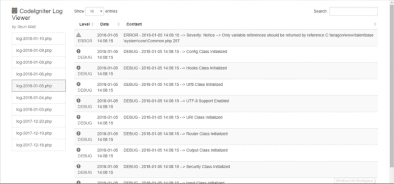

# 如何在浏览器中查看 CodeIgniter 日志文件

> 原文：<https://www.freecodecamp.org/news/how-to-view-codeigniter-log-files-in-the-browser-e4ec7a9e8b23/>

by Seun Matt

# 如何在浏览器中查看 CodeIgniter 日志文件


就像任何其他页面一样，现在可以在浏览器中读取 CodeIgniter 日志文件。我的天啊！



Example view of code igniter log files

在加入一家很棒的公司后，我开始在日常编码中使用 CodeIgniter。该公司的技术堆栈包括 PHP 框架等。到目前为止，我已经使用(*并且仍然使用* ) Laravel 开发了一些很棒的应用程序。

Laravel 有一个很棒的简单而优雅的日志系统。此外，还有一个用于在浏览器中显示日志的[库](https://github.com/rap2hpoutre/laravel-log-viewer)。能够在浏览器中读取日志有利于应用程序调试和洞察。尤其是在生产环境中。

因此，我现在身处 CodeIgniter 的世界，却找不到一个等效的库来读取我的日志以进行调试和洞察。

所以我接受了挑战，创建了我今年的第一个开源项目— [codeigniter-log-viewer](https://github.com/SeunMatt/codeigniter-log-viewer) 。

### 使用

首先，让我们将它添加到一个依赖项中。我们可以通过执行以下命令来实现:

```
composer require seunmatt/codeigniter-log-viewer
```

然后，我们可以创建一个 CodeIgniter 应用程序控制器，*LogViewerController.php*:

```
private $logViewer;
```

```
public function __construct() {    $this->logViewer = new \CILogViewer\CILogViewer();    //...}
```

```
public function index() {    echo $this->logViewer->showLogs();    return;}
```

我们所做的是在构造函数中实例化 *$logViewer* ，然后在 *index()* 函数中回显 *showLogs()* 的结果。

[codeigniter-log-viewer](https://github.com/SeunMatt/codeigniter-log-viewer) 的 *showLogs()* 方法将解析*应用/日志* *中日志文件的内容。它将返回它以在浏览器上显示。*

最后，我们可以将我们选择的任何路线映射到我们上面创建的*索引()*。这可以通过向*应用程序/配置/路由. php:* 中的*$路由*数组添加一个条目来实现

```
$route['logs'] = "logViewerController/index";
```

现在我们可以在浏览器上访问 */logs* ，并在那里看到所有的日志文件。也可以删除和下载日志文件。

**注**:建议在生产环境中使用受保护的路线，以避免一般公众访问。

### 它是如何工作的

在内部，该库将默认日志目录中可用的所有日志文件的名称读入一个数组，并对其进行反转。如果在 URL 查询参数中没有指定文件，则默认情况下会处理最新的日志文件进行显示。

处理日志文件以供显示包括读取其内容，使用 regex 确定日志级别以及每个条目的 CSS 类和图标。

还会检查每个条目，以了解它是新的日志行还是前一行的延续(*由于换行符*)。

最后，日志条目被处理成 HTML 内容，然后发送到浏览器进行显示。

完整的源代码可以在 Github 上找到，如果你想使用它或者/和在其他框架中使用它。

### **结论**

现在调试 CodeIgniter 应用程序变得更加容易和快速——甚至在生产中。向工作中的朋友和同事传播这个消息。

想在评论区听听大家使用该库的经历(*和意见*)。谢谢！

访问 [Github 链接](https://github.com/SeunMatt/codeigniter-log-viewer)